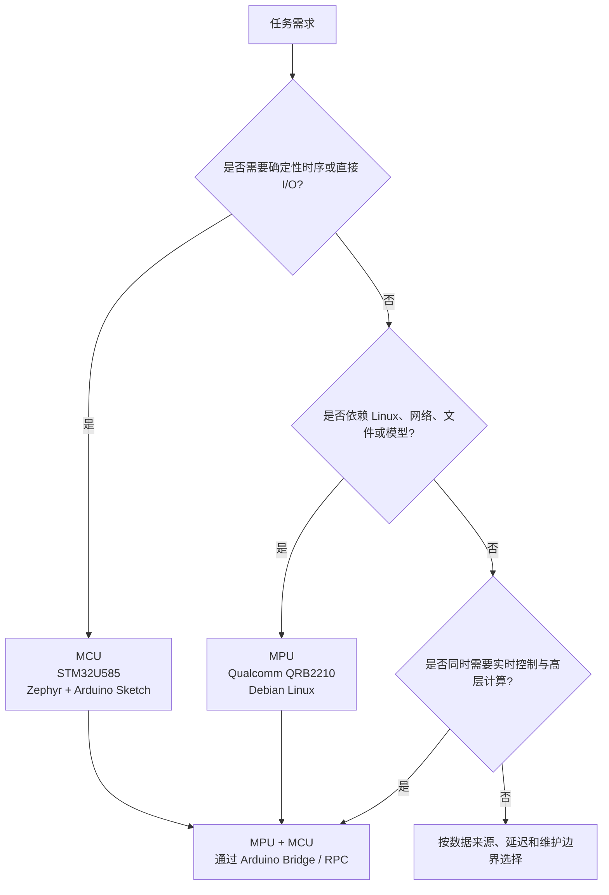

# 第2章 什么是 Arduino UNO Q

## 学习目标

- 用“双处理器、双运行时、明确协同边界”的模型说明 Arduino UNO Q，而不是把它理解成一块单纯更快的传统 UNO。
- 区分 Linux 高层计算与实时硬件控制的典型责任，并能根据时序、数据来源、依赖和维护边界选择执行侧。
- 说明 Arduino Bridge / 远程过程调用（Remote Procedure Call，RPC）在两侧之间承载服务调用、响应和通知，但不会把两颗处理器变成一个没有边界的运行环境。
- 区分 Arduino IDE 与 Arduino App Lab 的主要适用范围，并说清纸面判断、静态检查、命令行验证和硬件验证不是同一种证据。

## 本章导读

Arduino UNO Q 在一块板上组合了 Qualcomm Dragonwing QRB2210 与 STM32U585。前者提供 Debian Linux 环境，适合承载应用、网络、文件和模型等高层能力；后者运行基于 Zephyr 的 Arduino Core，让 Arduino Sketch 可以承担直接 I/O 和对时序更敏感的控制。理解 UNO Q 的关键不是比较单一主频，而是先辨认任务属于哪一个责任域，以及两个责任域何时需要协同。

本章只建立产品定位和任务决策模型。读者会完成一个不需要硬件和命令行的纸面实验，不会在这里学习 STM32 外设 API、Debian 操作、Python Bridge 实现、App Lab 项目文件、OpenCV 或 AI 模型的具体用法。

## 背景与边界

微处理器（Microprocessor，MPU）通常与完整操作系统、较丰富的内存和应用软件栈配合，适合运行多进程应用及高层服务。微控制器（Microcontroller，MCU）把处理核心与片上存储、定时器和外设控制能力紧密结合，适合直接连接传感器、按钮和执行器。UNO Q 同时提供这两类处理器，因此同一项目可以兼顾 Linux 应用能力和硬件控制能力。

本章所说的“适合”是一种责任分配提示，不是不可更改的处理器绑定规则。实际放置任务时，还要核对目标硬件、引脚与电气条件、可用软件接口、延迟预算、故障恢复方式和所用版本。后续操作范围分别从 [STM32 与实时控制篇](../第2篇_STM32/README.md)、[Debian Linux 篇](../第3篇_Linux/README.md)、[Python Bridge 协同篇](../第4篇_PythonBridge/README.md) 和 [Arduino App Lab 篇](../第5篇_AppLab/README.md) 进入。

## 1. 先建立正确的产品模型

把 UNO Q 称为“更快的 UNO”会漏掉它最重要的结构变化。传统入门经验常把一块开发板想成“一个 Sketch 控制整块板”；UNO Q 则需要先问三个问题：任务在哪一侧运行、它依赖哪一侧的资源、跨侧时通过什么接口交换意图和结果。

一个可用的第一层模型是：

1. MPU 侧提供 Debian Linux，承担需要操作系统服务、网络、文件或较高计算资源的工作。
2. MCU 侧运行 Arduino Sketch，承担直接 I/O、周期采样和对时序更敏感的控制。
3. 两侧需要协同时，通过 Arduino Bridge / RPC 交换服务请求、响应或通知。

这个模型描述的是责任，而不是宣称“某类任务永远只能运行在某颗处理器”。例如，简单数据变换在两侧都可能实现；选择时应看数据在哪里产生、结果在哪里消费、允许多少延迟，以及团队希望把故障和维护边界放在哪里。

## 2. UNO Q 的双处理器组成

UNO Q 的 MPU 是 Qualcomm Dragonwing QRB2210。官方产品页和 User Manual 将它描述为运行 Debian Linux 的应用处理侧。Linux 提供进程、文件系统、网络和应用依赖管理等能力，因此这侧更像一台嵌入式 Linux 计算机，而不只是传统 Arduino Sketch 的执行环境。

UNO Q 的 MCU 是 STM32U585。MCU 侧 Arduino Sketch 运行在基于 Zephyr 的核心上。Zephyr 是实时操作系统（Real-Time Operating System，RTOS）：它面向资源受限的嵌入式设备，为任务调度、并发和硬件支持提供基础。这里的“实时”强调能围绕已定义的时序约束组织系统，并不表示任何 Sketch 在没有设计和测量的情况下都会自动满足实时要求。

两颗处理器位于同一块板上，仍然各有运行环境、资源和生命周期。共享一块 PCB 不等于共享同一个进程空间，也不意味着一侧的函数可以绕过接口直接成为另一侧的本地函数。

## 3. 两个运行时与两个责任域

MPU 侧的 Debian Linux 适合组织高层应用：访问网络服务、读写文件、运行多进程程序、调用 Linux 软件库，或承载需要更多计算和内存的处理。它的优势是完整的软件生态和应用编排能力；普通 Linux 用户态程序的调度延迟则不应未经测量就当作确定性实时保证。

MCU 侧的 Zephyr 与 Arduino Sketch 适合靠近硬件的工作：读取按钮、按固定节奏采样、驱动引脚，以及执行需要快速、可控响应的保护或控制逻辑。它的优势是硬件接口近、控制路径清晰；它也不应承担所有需要文件系统、复杂网络依赖或大规模模型的任务。

“两个责任域”比“两个功能清单”更重要。责任域要求每项功能同时说明输入、输出、失败方式和所有者。高层策略可以在 MPU 上计算，最终的安全限幅和输出时序可以由 MCU 执行；如果 MPU 应用停止，MCU 仍应有明确的超时或安全状态。具体安全设计不在本章展开，但这种边界意识应从一开始建立。

## 4. Bridge/RPC：跨处理器的协同边界

远程过程调用（Remote Procedure Call，RPC）让一侧以“调用服务”的方式请求另一侧执行已公开的能力。Arduino Bridge 是 UNO Q 上组织这种跨侧通信的接口层。根据官方 User Manual，Bridge 可处理双向 RPC 流量，包括方法注册与查找、请求转发、等待或异步取得响应，以及不等待返回值的通知。

可以把一次协同理解成三类消息：

- 服务调用：调用方给出服务名和参数，请求另一侧执行明确能力。
- 响应：被调用方返回结果或错误，让调用方知道请求的结局。
- 通知：调用方发送事件或状态而不等待返回值，适合不要求同步结果的更新。

Bridge/RPC 是边界，不是边界的消失。两侧仍需约定服务名、参数、超时、错误和状态恢复。官方手册还说明底层 Router 支持服务发现和多点路由，因此 Bridge 不能简单等同于“普通串口收发几行文本”；即使其底层会占用串行传输资源，开发者面对的是带方法语义和路由规则的 RPC 层。本章只解释这个模型，具体 Python 或 Sketch API 留到 [Python Bridge 协同篇](../第4篇_PythonBridge/README.md)。

## 5. 开发工具如何对应责任域

Arduino IDE 延续熟悉的 Sketch 编辑、编译和上传体验。对 UNO Q 而言，官方产品页和 User Manual 都明确其主要目标是 STM32U585 MCU 侧；在 IDE 中上传 Sketch，并不等于已经开发或验证了 Debian Linux 应用。

Arduino App Lab 面向组合工作流，可在一个项目体验中组织 Arduino Sketch、Python 脚本和容器化 Linux 应用。它更适合需要同时覆盖 MPU 与 MCU 的项目，但“使用 App Lab”本身仍不是两侧均已正确运行的证据：项目要分别观察各运行侧，并验证 Bridge/RPC 调用和失败路径。

ArduinoCore-zephyr 是 MCU 侧的重要软件基础。其官方仓库说明该核心基于 Zephyr，并支持 Arduino IDE、Arduino CLI 和 Arduino App Lab。工具可以共享底层核心，不代表工具职责完全相同；选择工具时仍应从要修改和验证的责任域出发。

## 6. 任务应该放在哪里执行

先看任务最硬的约束，而不是先选熟悉的语言：

- 需要确定性时序、直接 I/O 或快速安全响应时，优先考虑 MCU。
- 依赖 Linux 软件、网络、文件或模型时，优先考虑 MPU。
- 同时需要高层计算和实时控制时，拆成两侧职责，再以 Bridge/RPC 连接。
- 两侧都能完成时，根据数据来源、端到端延迟、故障隔离、升级方式和长期维护成本选择。

下面的流程图把这组问题压缩为学习时的判断顺序。

这张图是学习启发式规则，不替代对硬件能力、电气条件或软件接口的逐项核验。真实项目还要用目标版本和目标负载测量延迟，确认 API、引脚占用、错误处理和安全状态。

> 图示占位：图号=Fig-03；位置=本流程图之后；内容=读者应看到任务约束如何映射到 MPU、MCU 或通过 Bridge/RPC 协同的两侧责任关系；来源=基于官方资料原创重绘。

## 7. 纸面实验：给任务选择执行侧

先独立填写“首选执行侧”和理由，再与下表对照。这里的“首选”代表在信息有限时的起点，不排除在详细设计后调整。

| 案例 | 首选执行侧 | 理由 |
|---|---|---|
| 按钮输入 | MCU | 数据来自直接 I/O，通常需要短而清晰的采样与消抖路径。 |
| 周期采样 | MCU | 固定节奏采集更依赖可控时序；批量分析可另交给 MPU。 |
| Web 服务 | MPU | 依赖 Linux 网络栈、进程和服务管理，适合在 Debian 环境组织。 |
| 文件处理 | MPU | 文件系统和成熟的软件库位于 Linux 责任域，便于管理输入、输出和错误。 |
| 模型推理 | MPU | 通常需要更高算力、内存及模型运行时；具体可用能力仍需按模型和版本核验。 |
| 固定阈值的执行器保护 | MCU | 保护动作靠近输出并要求快速、可预期的响应，不应依赖高层应用及时调度。 |
| 策略驱动的执行器控制 | MPU + MCU | MPU 处理网络、文件或模型产生的策略，MCU 负责限幅、时序和实际输出，两侧通过 Bridge/RPC 交换命令、状态与错误。 |

最后一个案例是组合两侧的典型情形。拆分的关键不是把代码平均分配，而是让高层策略和硬件安全责任各自有清楚的执行位置与验证方法。

## 操作或实验

本实验不需要 Arduino UNO Q 硬件、Arduino IDE、Arduino App Lab 或任何命令行工具。

1. 遮住上一节表格的“首选执行侧”和“理由”两列。
2. 对每个案例依次回答：数据从哪里来、最硬的延迟要求是什么、依赖哪些系统能力、失败时谁负责进入安全状态。
3. 将任务标为 MPU、MCU 或 MPU + MCU；若选择两侧，再写出至少一个 RPC 服务调用及其响应或通知方向。
4. 与参考答案比较。答案不同时，不以“表格写了什么”结束，而要说明是哪项约束改变了选择。

实验通过条件是：学习者能用时序、I/O、Linux 依赖、数据来源和维护边界解释选择，并能为组合案例说明两侧职责与通信方向。

## 验证结果

本章已完成的验证是文档静态检查：核对固定元数据、标题、必要章节、Mermaid 声明和独立 `.mmd` 源文件；纸面实验的学习验证是读者能否解释自己的执行侧选择。这两类验证都不需要硬件。

尚未完成的验证包括 Arduino CLI 编译、Sketch 上传、Debian Linux 进程检查、Bridge/RPC 实际通信和硬件 I/O 观察。静态检查通过不能代替这些命令行或实机证据，本章也不据此声称 UNO Q 硬件或双侧软件栈已经运行。

## 常见问题

### UNO Q 只是更快的 UNO 吗？

不是。性能提升只是表面差异；更重要的是 UNO Q 把运行 Debian Linux 的 QRB2210 MPU 与运行 Arduino Sketch 的 STM32U585 MCU 组合在一块板上。开发者需要设计两个责任域及其协同接口。

### Linux 会取代 MCU 吗？

不会。Linux 擅长应用、网络、文件和高层计算，MCU 擅长直接 I/O 与对时序更敏感的控制。两者互补，具体职责由项目约束决定。

### Arduino IDE 等于完整的双侧开发吗？

不等于。官方资料明确 Arduino IDE 主要编程 MCU 侧。完整双侧工作流更适合使用 Arduino App Lab，并分别验证 Linux 应用、MCU Sketch 和 Bridge/RPC。

### Bridge 只是普通串口吗？

不是。Bridge/RPC 提供方法注册、服务发现、请求路由、响应和通知等语义。底层传输资源不等于上层编程模型；绕过约定接口直接占用其资源还可能破坏 Bridge 通信。

### 为什么 Blink 不能证明 Linux 侧正在运行？

官方 User Manual 说明 Blink 的板载 LED 由 STM32 MCU 上的 Arduino Sketch 驱动。看到 LED 闪烁只能支持 MCU 侧对应程序路径工作的结论；它没有观察 Debian 进程、Linux 服务或跨侧 RPC，因此不能证明 Linux 侧正在运行。

## 本章小结

Arduino UNO Q 的核心定位是双处理器协同平台：Qualcomm Dragonwing QRB2210 MPU 运行 Debian Linux，STM32U585 MCU 通过基于 Zephyr 的核心运行 Arduino Sketch。MPU 侧通常承担 Linux、网络、文件和模型相关工作，MCU 侧通常承担直接 I/O 与时序敏感控制，Arduino Bridge / RPC 则定义两侧之间的服务调用、响应和通知边界。

这是一套用于拆分责任和组织验证的模型，不是把所有任务永久绑定到某一颗处理器。面对具体需求，应先识别硬约束，再选择执行侧，并用与该责任域匹配的工具和证据验证。

## 交叉引用与延伸阅读

- 回顾开发模型的演进：[第 1 章：Arduino 的发展](./第1章_Arduino的发展.md)。
- 深入 MCU 外设与实时控制：[第二篇：STM32](../第2篇_STM32/README.md)。
- 深入 Debian 环境与 Linux 应用：[第三篇：Linux](../第3篇_Linux/README.md)。
- 深入跨处理器通信：[第四篇：Python Bridge](../第4篇_PythonBridge/README.md)。
- 深入双侧项目工作流：[第五篇：App Lab](../第5篇_AppLab/README.md)。
- 查阅全书已登记的外部资料：[参考资料索引](../../resources/references.md)。

## 来源与验证

本章来源于 Arduino 官方资料，并于 `2026-09-16` 核验：

1. [Arduino UNO Q 产品页](https://docs.arduino.cc/hardware/uno-q)：核对 Qualcomm Dragonwing QRB2210、STM32U585、Debian Linux、Zephyr、Arduino IDE、Arduino App Lab 与内置 RPC 的产品定位。
2. [Arduino UNO Q User Manual](https://github.com/arduino/docs-content/blob/main/content/hardware/02.uno/boards/uno-q/tutorials/01.user-manual/content.md)：核对双处理器运行环境、Blink 执行侧、IDE 目标侧，以及 Bridge 的请求、响应、通知、服务发现和路由语义。
3. [Arduino UNO Q Datasheet](https://docs.arduino.cc/resources/datasheets/ABX00162-datasheet.pdf)：核对开发板身份、主要器件与官方硬件资料边界；本章不从数据表扩展外设或电气教程。
4. [ArduinoCore-zephyr](https://github.com/arduino/ArduinoCore-zephyr)：核对基于 Zephyr 的 Arduino Core 及其对 Arduino IDE、Arduino CLI 和 Arduino App Lab 的支持范围。

官方来源只用于事实核验，本章文字与 Mermaid 图均为独立整理；没有复制或打包外部正文、代码或图片。链接可访问不等于本项目获得外部材料的再分发许可，本章不作任何再分发许可证声明。产品功能、软件版本和接口可能变化，实施前仍应回到对应官方资料复核。
