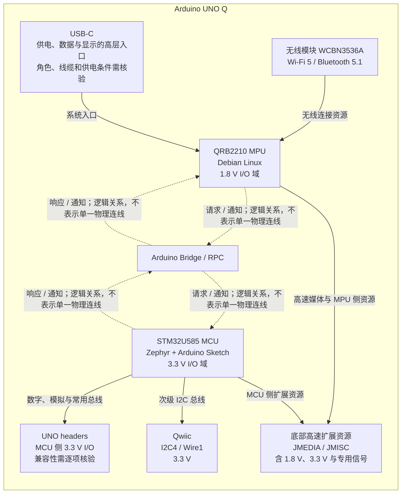

# 第3章 Arduino UNO Q 的硬件架构

## 学习目标

- 从“单一微控制器开发板”转向“Linux 计算与实时控制协同平台”的视角理解 Arduino UNO Q。
- 识别 Qualcomm Dragonwing QRB2210 微处理器（Microprocessor，MPU）与 STM32U585 微控制器（Microcontroller，MCU）的运行环境、典型职责和边界。
- 说明无线模块、UNO headers、Qwiic、底部高速连接器和 USB-C 在整板中的高层位置，并理解“有接口”不等于“任意外设都能直接使用”。
- 区分 Arduino Bridge / 远程过程调用（Remote Procedure Call，RPC）的逻辑协同关系与具体物理连线，避免从架构图推导未被资料支持的总线结论。
- 在接线前识别 1.8 V MPU I/O 域、3.3 V MCU I/O 域和混合电气域带来的风险，知道哪些结论必须回到数据表、引脚图、原理图和目标软件版本核验。

## 本章导读

传统 Arduino 学习常从“一颗 MCU、一份 Sketch、一组引脚”开始。UNO Q 保留了熟悉的 UNO 外形与 Arduino 开发入口，却把运行 Debian Linux 的 QRB2210 MPU、运行 Zephyr/Arduino Sketch 的 STM32U585 MCU、无线连接和多层扩展资源组合到同一块单板计算机上。面对它，第一步不再只是找某个引脚，而是先判断任务属于计算、实时控制、连接扩展还是电气核验中的哪一层。

本章建立硬件架构阅读方法，不替代完整数据表或逐针脚接线指南。操作部分是一项不需要硬件的资料识读练习；本章没有可运行代码，也不声称完成了 Arduino CLI 编译、烧录、网络连接、USB 外设、Bridge/RPC 或任何硬件实机验证。相关 API、接线和软件配置留给后续章节按具体任务展开。

## 背景与边界

UNO Q 的复杂性来自“多种能力共板”，而不只是处理器数量增加。Linux 应用、实时 I/O、无线通信、显示与摄像头、传统 UNO 扩展和供电管理可能同时参与一个项目，但它们并不共享同一种运行时、同一组引脚或同一个电压域。

因此，本章只回答三类问题：主要资源位于哪一侧、资源之间如何在逻辑上协同、动手前还要核验什么。文中的箭头用于帮助理解责任关系，不代表未经官方资料确认的时序、带宽、引脚复用状态或单一物理总线。任何外设连接都应以目标板版本对应的官方数据表、引脚图和原理图为准，并结合所用 Arduino Core、Debian 镜像、驱动和库版本检查软件支持。

## 1. 从传统开发板到计算平台

在传统单 MCU 开发板模型中，Sketch 通常直接读取输入、执行逻辑并驱动输出。处理器、运行时和大部分外设控制集中在一个责任域内，学习者容易把“板上有接口”和“Sketch 可以直接使用接口”视为同一件事。

UNO Q 更适合被理解为一个小型异构计算平台：MPU 提供完整 Linux 环境和高层计算能力，MCU 提供贴近硬件的控制与可组织的实时响应，两侧通过明确的软件接口协同。无线模块、USB-C、传统 UNO 扩展和底部高速扩展又分别服务不同资源。这个视角会改变设计顺序：先划分任务与数据的归属，再选择接口和软件，最后确认电气条件，而不是看见连接器就开始接线。

“平台”并不意味着每个项目都必须同时使用两颗处理器。简单的实时 I/O 任务可以主要位于 MCU 侧，高层网络或文件任务可以主要位于 MPU 侧；只有当需求跨越两个责任域时，才需要设计 Bridge/RPC 服务、超时、错误和恢复路径。

## 2. MPU：QRB2210 与 Debian Linux

UNO Q 的计算侧由 Qualcomm Dragonwing QRB2210 MPU 承担，并运行 Debian Linux。它适合组织进程、文件、网络服务、应用依赖以及需要更多计算资源的高层工作。官方资料也把图形、视频和高速媒体能力放在这一侧的硬件体系中。

把 QRB2210 称为“主处理器”不应被理解为它取代了 MCU。Linux 应用擅长复杂编排，但普通用户态程序的调度和外设访问路径不能未经测量就当作确定性实时控制。对执行器保护、周期采样或快速 I/O 响应，仍应评估 MCU 是否是更清晰、更安全的责任位置。

QRB2210 的外部 I/O 还涉及 1.8 V 电气域。这个事实尤其重要：Linux 侧能够访问某项资源，不等于相关信号可以直接接到 3.3 V MCU GPIO 或普通 5 V 外设。具体信号是否暴露、是否专用、是否复用以及如何做电平兼容，都必须按连接器和目标引脚逐项核验。

## 3. MCU：STM32U585、Zephyr 与 Arduino Sketch

实时控制侧使用 STM32U585 MCU。Arduino Sketch 运行在基于 Zephyr 的 Arduino Core 上，适合承担直接 I/O、定时、采样和需要清晰响应边界的控制任务。官方 `ArduinoCore-zephyr` 仓库是这一软件基础的来源之一；它能说明 Sketch 的目标运行侧，但不能代替对某个外设、引脚或时序的实机测量。

MCU 侧常见扩展 I/O 属于 3.3 V 域，包括 UNO 风格的数字与模拟接口、专用 SPI 接口以及 Qwiic。这里的 3.3 V 是逻辑与电气设计边界，不应与连接器上可能存在的电源引脚混为一谈，更不能因为外形沿用 UNO form factor 就把所有信号默认成 5 V。

Zephyr 提供实时操作系统（Real-Time Operating System，RTOS）基础，但“运行在 RTOS 上”不等于任何 Sketch 自动满足实时要求。任务优先级、共享资源、Bridge 调用、外设驱动和中断负载都可能影响响应；真实项目必须给出时序指标并测量验证。

## 4. 无线连接是平台资源，不是软件保证

UNO Q 使用 WCBN3536A 无线模块，官方资料列出双频 Wi-Fi 5（2.4/5 GHz）和 Bluetooth 5.1，并使用板载天线。它为 Linux 应用和整板联网提供连接基础，但“板上有无线模块”只证明硬件能力存在。

能否在目标场景工作，还取决于 Debian 镜像、驱动、固件、网络配置、权限、射频环境和应用使用的 API。企业网络、访客网络、VPN 或防火墙也可能改变发现与连接行为。没有在目标镜像、目标网络和目标距离上观察连接状态、吞吐、重连和错误日志，就不能把产品规格写成项目已经联网成功的证据。

## 5. 三类扩展入口：外形相似不等于边界相同

UNO Q 提供多种扩展入口，学习时可先按使用目的区分：

- **UNO headers**：保留熟悉的 UNO 风格扩展位置，主要连接 MCU 侧的 3.3 V 数字、模拟和常用总线资源。机械位置或接口名称相似，不代表任意历史 Shield 都满足电压、引脚占用、库、功耗和时序要求。
- **Qwiic**：提供免焊接的 I2C 扩展入口。官方 User Manual 将其标为 MCU 的次级 I2C 总线 `I2C4`，在 Arduino 侧使用 `Wire1`，并明确为 3.3 V。它不等于任意 I2C 设备都可直接接入；仍要核对器件电压、地址、供电电流、上拉条件和库支持。
- **底部高速连接器**：面向 carrier 和摄像头、显示、音频等更复杂扩展，主要包括 `JMEDIA` 与 `JMISC`。这里既可能有 MPU 的 1.8 V 高速或 GPIO 资源，也可能有 MCU 的 3.3 V 资源、电源和专用信号；`JMISC` 本身就是混合电气域连接器，不能把整排引脚当作同一种普通 GPIO。

“有接口不等于任意可用”至少要拆成五项检查：连接器是否匹配、目标信号是否真的暴露、该信号当前是否与其他功能复用、所用系统与库是否支持、供电与逻辑电平是否兼容。底部连接器中的摄像头控制、媒体通道或专用信号也不能仅凭名称改作通用 I/O。本章不扩写逐针脚接线结论，实施时应回到官方引脚图、数据表和原理图。

## 6. USB-C 与供电：一个连接器承载多种角色

USB-C 是 UNO Q 的供电、数据和显示能力入口之一。官方 User Manual 与数据表列出 5 V、最高 3 A 的 USB-C 供电路径，并说明 USB 数据、角色切换和 DisplayPort Alt Mode 等能力。使用带外部供电的多口适配器时，还可能接入显示器、键盘、鼠标、摄像头、存储或网络设备。

这些能力不能被简化为“任意 USB-C 线都能完成所有功能”。线缆是否包含完整通道、适配器是否支持相应角色和供电、外设总功耗是否合适、显示资源是否与底部 `JMEDIA` 复用，以及主机/设备模式如何配置，都要按目标组合核验。连接器能插入不等于供电、电流、数据速率、视频和角色协商均已满足。

板卡还存在 USB-C 之外的供电入口，但本章不提供电源设计或接线教程。给扩展板、执行器或外设供电前，应重新核对允许的输入范围、各电源轨能力、反向供电风险和总负载；不能把逻辑电压、信号容限和供电引脚的标称电压混为一谈。

## 7. Bridge/RPC 是逻辑协同，电气域仍然存在

Arduino Bridge / RPC 为 Linux 侧和 MCU 侧提供服务调用、响应与通知的双向协同方式。Linux 侧可请求 MCU 执行硬件动作，Sketch 侧也可调用 Linux 服务或上报事件。设计者应围绕服务名、参数、超时、错误和恢复来组织跨处理器行为，而不是假设两侧共享内存、共享函数调用栈或共享全部外设。

Bridge/RPC 是软件层的逻辑关系。官方数据表说明其可以适配多种物理传输，因此架构图中的虚线不会指定某一条实际总线，也不表达时序、带宽或确定性保证。需要定位传输问题时，应进一步查目标软件版本、Router/Bridge 配置和底层资源占用。

如果不经过 Bridge，而是考虑用 GPIO 等硬件信号在两侧协同，1.8 V MPU I/O 与 3.3 V MCU I/O 的差异必须先处理。两侧 GPIO 不应凭名称直接互接；应按具体引脚功能与容限选择经验证的电平转换或其他兼容电路，并核对上电、掉电、复位和高阻状态。未经这些检查，直接连接可能导致通信失败、反向供电或器件损伤。

## 8. 硬件关系图：资源、协同与边界

图中实线只表示资源归属或高层入口，不能据此推导逐针脚连接；四条虚线分别表示 MPU 与 Bridge/RPC、Bridge/RPC 与 MCU 之间双向的请求、响应和通知关系。可追溯的原始图源保存在 [`diagrams/uno-q-hardware-map.mmd`](../../diagrams/uno-q-hardware-map.mmd)。

> 图示占位：图号=Fig-04；位置=本节 Mermaid 架构图之后；内容=Arduino UNO Q 内 QRB2210 MPU、STM32U585 MCU、无线模块、UNO headers、Qwiic、底部高速扩展资源以及 Arduino Bridge / RPC 逻辑协同与电气域边界；来源=基于 Arduino 官方资料原创重绘，源文件 diagrams/uno-q-hardware-map.mmd。

未来若导出 SVG，应以该 Mermaid 源文件原创生成，并记录生成日期和工具版本；不得把官方产品图、数据表框图或第三方图片直接复制后当作本项目原创图示。

## 操作或实验

本章没有可运行代码。下面的实验是纸面资料识读，不需要 Arduino UNO Q、Arduino IDE、Arduino App Lab、Arduino CLI、网络连接或任何接线。

1. 打开已登记的 Arduino UNO Q 产品页、User Manual 和数据表，分别找到处理器、无线、扩展连接器、电气域和 USB-C/供电的说明。
2. 在纸上画出四个区域：计算侧、实时控制侧、连接与扩展侧、电气核验侧。不要先画具体引脚。
3. 将“Linux 文件处理”“周期采样”“Wi-Fi 联网”“Qwiic 传感器”“摄像头 carrier”“MPU 与 MCU 协同控制”分别放入一个或多个区域，并写出理由。
4. 对每个连接需求填写五项检查：连接器、信号归属/复用、软件支持、逻辑电平、供电条件。资料没有给出结论时标记“待核验”，不要猜测。
5. 将纸面图与本章 Fig-04 对照。若箭头被理解为实际导线或固定总线，就把它改写为“资源归属”或“逻辑协同”，并在旁边列出仍需查阅的数据表章节。

实验通过条件是：学习者能正确区分 QRB2210/MPU/1.8 V 域与 STM32U585/MCU/3.3 V 域，能指出 Qwiic 使用 `I2C4`/`Wire1`，能把 `JMEDIA`/`JMISC` 识别为需要逐项核验的底部扩展资源，并且不会把 Bridge/RPC 虚线解释成单一物理连线。

## 验证结果

本章已完成的验证仅限文档与来源核对：front matter、固定章节结构、术语、官方来源链接、Fig-04 唯一占位、内联 Mermaid 与独立 `.mmd` 源文件，以及新增相对链接目标。纸面实验的结果是资料分类与边界识别，不是硬件输出。

尚未完成的验证包括 Arduino CLI 编译、Sketch 上传、Debian 进程观察、Wi-Fi/Bluetooth 连接、USB-C 供电与角色切换、显示或摄像头、Shield/Modulino/carrier 兼容性、Bridge/RPC 实际通信、GPIO 电平、时序和负载测量。只有在目标硬件、目标软件版本和目标外设组合上取得相应证据后，才能把这些项目标记为实机通过。

## 常见问题

### QRB2210 是否取代了 MCU？

没有。QRB2210 提供 Debian Linux 和高层计算能力，STM32U585 负责贴近硬件的 3.3 V I/O、定时和控制。两者是互补的责任域；是否同时使用取决于项目需求。

### UNO headers 是否可以默认按 5 V 处理？

不可以。UNO 外形和接口位置不等于 5 V 逻辑保证。官方数据表把 MCU 侧常用 I/O 标为 3.3 V 域；连接器上存在电源相关引脚也不能改变某个信号的逻辑容限。使用 Shield 或自制扩展板前必须逐项核对电压、引脚映射、复用、功耗和库支持。

### MPU GPIO 与 MCU GPIO 是否可以直接互接？

不能默认直接互接。MPU GPIO 属于 1.8 V 域，MCU GPIO 属于 3.3 V 域。只有在具体引脚功能、方向、容限、上下电状态和电平转换方案都核验后，才能设计硬件连接；优先使用已定义的 Bridge/RPC 软件接口完成逻辑协同。

### Qwiic 是否等于任意 I2C 接线？

不等于。UNO Q 的 Qwiic 使用 MCU 次级 I2C 总线 `I2C4` 和 Arduino `Wire1` 对象，并且是 3.3 V。目标设备还必须满足接口、地址、供电、上拉、总线负载和软件库条件。

### 硬件存在是否等于软件已经支持？

不等于。硬件规格只说明资源存在；实际可用还依赖操作系统镜像、驱动、固件、Arduino Core、库、权限、引脚复用和应用配置。必须在目标版本上调用对应 API，并观察成功路径和错误路径。

### Bridge/RPC 虚线是不是两颗处理器之间的一根固定总线？

不是。虚线表达服务调用、响应和通知构成的逻辑协同。官方资料说明 Bridge 可以适配多种物理传输；本章不从逻辑图推导具体总线、时序或带宽。

## 本章小结

Arduino UNO Q 应被理解为异构计算平台：QRB2210 MPU 运行 Debian Linux，STM32U585 MCU 通过 Zephyr/Arduino Core 运行 Sketch，无线模块、USB-C、UNO headers、Qwiic 和底部高速连接器分别提供连接与扩展能力，Arduino Bridge / RPC 则组织两侧的软件协同。

真正安全的硬件阅读方法不是记住一张引脚表，而是把资源归属、接口复用、软件支持、电气域和供电条件分开核验。尤其要记住：UNO 外形不等于 5 V 逻辑，Qwiic 不等于任意 I2C，底部连接器不等于一排普通 GPIO，Bridge/RPC 逻辑关系也不等于单一物理连线。

## 交叉引用与延伸阅读

- 回顾双处理器定位与任务分工：[第 2 章：什么是 Arduino UNO Q](./第2章_什么是Arduino_UNO_Q.md)。
- 深入 MCU 外设、Zephyr 与实时控制：[第二篇：STM32](../第2篇_STM32/README.md)。
- 深入 Debian 环境、进程与网络：[第三篇：Linux](../第3篇_Linux/README.md)。
- 深入跨处理器服务设计：[第四篇：Python Bridge](../第4篇_PythonBridge/README.md)。
- 深入双侧项目工作流：[第五篇：App Lab](../第5篇_AppLab/README.md)。
- 查看本章可追溯图源：[UNO Q 硬件关系图 Mermaid 源文件](../../diagrams/uno-q-hardware-map.mmd)。
- 查阅全书已登记的外部资料：[参考资料索引](../../resources/references.md)。

## 来源与验证

本章仅使用已登记的 Arduino 官方资料，并于 `2026-09-20` 核验：

1. [Arduino UNO Q 产品页](https://docs.arduino.cc/hardware/uno-q)：核对双处理器产品定位、WCBN3536A、Wi-Fi 5、Bluetooth 5.1、UNO headers、Qwiic、底部高速连接器、USB-C 高层用途和内置 RPC。
2. [Arduino UNO Q Datasheet](https://docs.arduino.cc/resources/datasheets/ABX00162-datasheet.pdf)：核对 QRB2210 与 STM32U585、1.8 V MPU I/O 域、3.3 V MCU I/O 域、`JMEDIA`/`JMISC`、Qwiic、USB-C/供电和接口复用边界。
3. [Arduino UNO Q User Manual](https://github.com/arduino/docs-content/blob/main/content/hardware/02.uno/boards/uno-q/tutorials/01.user-manual/content.md)：核对 Debian Linux、Zephyr、UNO form factor、USB-C 高层功能、`I2C4`/`Wire1`、Qwiic 3.3 V 和 IDE/App Lab 的运行侧边界。
4. [ArduinoCore-zephyr](https://github.com/arduino/ArduinoCore-zephyr)：核对 MCU 侧基于 Zephyr 的 Arduino Core 与工具支持边界；本章不复制其代码，也不把仓库配置当作硬件实测。

正文和 Mermaid 图均为基于官方事实的原创整理，没有复制官方数据表框图、外部图片、代码或大段正文。链接可访问不等于本项目取得外部材料再分发许可；未来 SVG 只从本章登记的 Mermaid 源文件原创导出。产品资料、软件版本和接口支持可能变化，接线或实现前仍应回到目标版本的官方文档复核。
