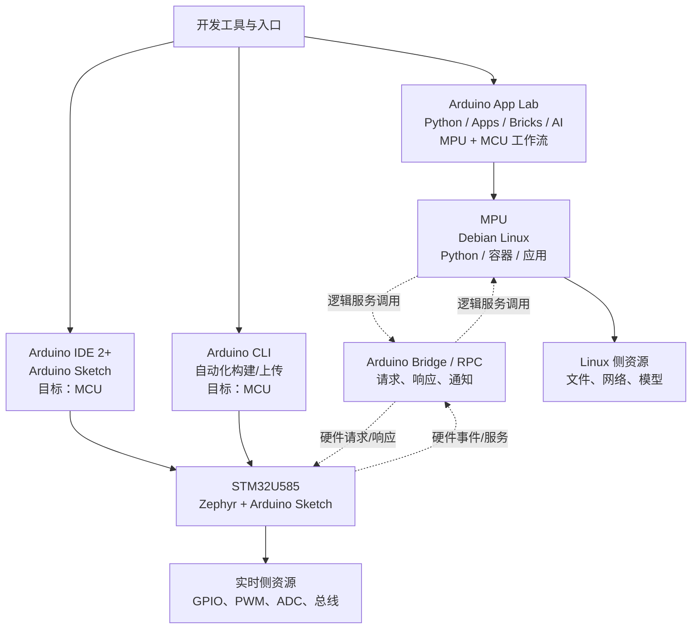

# 第4章 UNO Q 的软件架构

## 学习目标

- 说明开发主机、QRB2210 MPU、STM32U585 MCU 与 Arduino Bridge / RPC 各自承担的责任。
- 区分 Arduino App Lab 的统一工作流，与 Arduino IDE 2+、Arduino CLI 面向 MCU 的 Arduino/Zephyr 工作流。
- 将 Linux 文件或网络工作、实时 I/O 和跨处理器控制放到恰当的软件责任域。
- 在软件设计中保留第 3 章定义的 1.8 V MPU 与 3.3 V MCU 电气边界。

## 本章导读

Arduino UNO Q 不是把一份程序平均分给两颗处理器，而是让 Linux 计算与实时控制在明确边界内协同。开发者先从主机选择入口，再决定工作应落在运行 Debian Linux 的 QRB2210 MPU，还是运行 Zephyr 与 Arduino Sketch 的 STM32U585 MCU；只有跨越两个责任域时，才设计 Arduino Bridge / RPC 服务。

本章建立软件责任地图，不提供可运行代码。本章同样不声称完成 Arduino CLI 编译或上传、Arduino App Lab 执行、Linux 进程检查、Bridge/RPC 通信或任何硬件/运行时测量。

## 背景与边界

软件架构图用于说明责任、请求和资源归属，不替代接口定义、传输配置、时序分析或硬件原理图。Arduino UNO Q 的软件地图也不能抹去第 3 章的资源与电气边界：MPU I/O 为 1.8 V 域，MCU I/O 为 3.3 V 域。即使两侧的软件服务能够协同，设计者仍须按具体连接器、引脚、容限与电平转换方案核验实际硬件路径。

## 1. 四层责任模型

可以从四层阅读 UNO Q 的软件架构：

1. **主机开发入口**：开发主机上的工具决定工作流，而不是直接把所有任务放进同一个运行时。
2. **MPU 层**：Qualcomm Dragonwing QRB2210 MPU 运行 Debian Linux，适合 Python、容器、Linux 应用，以及文件、网络和模型等 Linux 侧资源。
3. **MCU 层**：STM32U585 MCU 运行 Zephyr 加 Arduino Sketch，适合 GPIO、PWM、ADC、总线、采样与贴近硬件的控制。
4. **逻辑协同层**：Arduino Bridge / RPC 用请求、响应和通知组织跨处理器服务，不是第三颗处理器，也不是一条被本章固定命名的物理线路。

责任模型先解决“谁负责什么”，再讨论 API、驱动和连接。它不能据此保证共享内存、固定物理布线、调用时延、实时性或自动获得所有硬件访问权限。

## 2. 主机开发入口与工具分工

Arduino App Lab 提供统一的 Python、Sketches、Bricks 和 Linux 应用工作流，可覆盖 MPU 与 MCU 协同的学习与项目入口。它的“统一”指工作流体验与项目组织，不表示所有代码在同一处理器、同一权限域或同一实时条件下执行。

Arduino IDE 2+ 与 Arduino CLI 面向 MCU 侧 Arduino/Zephyr 工作流：IDE 适合交互式 Sketch 开发，CLI 适合自动化构建与上传。它们以 MCU 为目标，因此使用 IDE 或 CLI 并不因此给 QRB2210 MPU 编程；同样，Debian Linux 也不会替代 STM32U585 上的 Zephyr。实际工具能力、板支持包和版本兼容性仍须回到目标版本的官方资料核验。

## 3. MPU：QRB2210 与 Debian Linux

QRB2210 MPU 上的 Debian Linux 提供进程、文件系统、网络、应用依赖和较高层计算的运行环境。需要读取文件、组织网络服务、调用模型或运行 Linux 应用时，应先将任务归入这一侧，再明确所需权限、设备节点、驱动和错误处理。

Linux 侧适合复杂编排，不自动等同于确定性 I/O 控制。若任务包含周期采样、快速响应或执行器保护，应把时序目标和最终硬件动作的归属单独分析，而不能仅因 Linux 侧可发出请求就默认其满足实时要求。

## 4. MCU：STM32U585、Zephyr 与 Arduino Sketch

STM32U585 MCU 承担实时侧资源。其 Zephyr 加 Arduino Sketch 运行环境适合组织 GPIO、PWM、ADC 与常用总线等贴近硬件的工作。ArduinoCore-zephyr 说明这一 Arduino Core 的软件基础，但不替代对特定引脚、驱动、负载或时序的实机验证。

MCU 侧的资源归属也不意味着可跳过电气检查。第 3 章已说明该侧 I/O 是 3.3 V 域；使用任何外设前，仍要核对信号归属、复用、供电、逻辑电平和所用库的支持情况。

## 5. Arduino Bridge / RPC：逻辑服务边界

当 Linux 应用需要 MCU 侧硬件服务，或 MCU 需要向 Linux 侧报告事件、请求服务时，可用 Arduino Bridge / RPC 设计双向的请求、响应和通知。服务应明确名称、参数、结果、失败情形、超时与恢复责任，使跨处理器行为可被理解和测试。

Bridge / RPC 只描述逻辑边界：它不承诺共享内存、固定物理布线、时序保证或自动硬件访问。图中的虚线表示逻辑服务调用；实线表示工具、处理器与资源之间的高层归属或流程。两种箭头都不能被解释为已经验证的实际传输带宽、固定总线或电气连线。

## 6. 软件架构图：入口、责任与资源

图号=Fig-05

可追溯的原始图源见 [UNO Q 软件架构 Mermaid 源文件](../../diagrams/uno-q-software-architecture.mmd)。图中的实线表示开发入口、处理器与资源的高层流程或归属；虚线表示 Bridge / RPC 的逻辑请求、响应和通知边界，绝不表示固定物理接线。

## 操作或实验

本章没有可运行代码。以下为不需要开发板、网络或工具执行的纸面分类练习：

1. 将 **Blink** 放入 MCU 侧，说明它是 Arduino Sketch 与实时侧 I/O 的入门任务。
2. 将 **Linux 文件/网络工作** 放入 MPU 的 Debian Linux 侧，列出文件、网络或模型资源之一。
3. 将 **GPIO/PWM/ADC** 放入 STM32U585 的实时侧，并注明仍须核对 3.3 V 电气边界。
4. 将 **App Lab Brick 工作** 标为 App Lab 的统一工作流入口，再写明其具体资源与执行侧仍需按项目核验。
5. 将 **跨处理器控制** 标为 Bridge / RPC 的逻辑服务边界，为它写出一个请求、一个响应或通知以及一个失败或超时情形；不要把它画成共享内存或固定导线。

完成条件是能说明每项工作为什么归属该层，并指出任何从 MPU 到 MCU 的实际硬件信号仍受 1.8 V 与 3.3 V 边界约束。

## 验证结果

已完成的验证仅限文档静态核对：front matter、固定章节结构、术语、官方来源链接、Fig-05 锚点与占位、内联 Mermaid 和独立 `.mmd` 源文件的一致性，以及相对链接目标。

本章没有硬件或运行时结果。未执行 Arduino CLI 编译或上传、App Lab、Linux 进程、Bridge/RPC 实际通信、GPIO/PWM/ADC 输出、文件/网络操作或电气测量；这些项目必须在目标硬件、软件版本和外设组合上单独取得证据。

## 常见问题

### Arduino IDE 2+ 或 Arduino CLI 能否直接给 MPU 编程？

不能据此推断。官方高层工具分工中，Arduino IDE 2+ 和 Arduino CLI 面向 MCU 侧 Arduino/Zephyr 工作流；它们的使用不等于 QRB2210 MPU 已被编程。

### Debian Linux 是否取代 Zephyr？

不是。Debian Linux 位于 QRB2210 MPU，Zephyr 加 Arduino Sketch 位于 STM32U585 MCU。两者互补，分别服务 Linux 计算与实时侧控制。

### Bridge / RPC 是否保证两个处理器共享内存或固定时序？

不保证。本章只将其解释为请求、响应和通知的逻辑服务边界；具体物理传输、时延、带宽和故障处理必须在目标软件版本与实际系统中核验。

### Linux 侧能请求 MCU 硬件服务，是否就能自动使用全部硬件？

不能。服务是否实现、权限、引脚复用、驱动、资源占用和电气条件都会限制可用性。跨处理器请求也不会消除 1.8 V MPU 与 3.3 V MCU 的实际硬件边界。

## 本章小结

Arduino UNO Q 的软件架构可概括为：主机选择入口；QRB2210 MPU 上的 Debian Linux 承担文件、网络、模型和应用；STM32U585 MCU 上的 Zephyr 与 Arduino Sketch 承担 GPIO、PWM、ADC 和总线等实时侧资源；Arduino Bridge / RPC 在两侧之间组织逻辑请求、响应和通知。

选择工具和处理器时，最重要的是保留边界：IDE/CLI 面向 MCU，Debian 不替代 Zephyr，Bridge/RPC 不等于共享内存、固定布线、实时保证或自动硬件访问，软件协同也不能取消 1.8 V 与 3.3 V 的电气限制。

## 交叉引用与延伸阅读

- 回顾产品定位与双处理器分工：[第 2 章：什么是 Arduino UNO Q](./第2章_什么是Arduino_UNO_Q.md)。
- 回顾资源归属与电气边界：[第 3 章：Arduino UNO Q 的硬件架构](./第3章_UNO_Q的硬件架构.md)。
- 深入 STM32 实时控制：[第二篇：STM32](../第2篇_STM32/README.md)。
- 深入 Linux 环境与网络：[第三篇：Linux](../第3篇_Linux/README.md)。
- 深入跨处理器服务设计：[第四篇：Python Bridge](../第4篇_PythonBridge/README.md)。
- 深入 App Lab 工作流：[第五篇：App Lab](../第5篇_AppLab/README.md)。
- 查看本章图源：[UNO Q 软件架构 Mermaid 源文件](../../diagrams/uno-q-software-architecture.mmd)。
- 查阅全书来源索引：[参考资料索引](../../resources/references.md)。

## 来源与验证

本章仅使用下列已登记的 Arduino 官方资料，并于 `2026-09-20` 核验：

1. [Arduino UNO Q 产品页](https://docs.arduino.cc/hardware/uno-q)：用于核对产品的双处理器定位、Arduino App Lab 入口与 Arduino Bridge / RPC 的高层能力。
2. [Arduino UNO Q Datasheet](https://docs.arduino.cc/resources/datasheets/ABX00162-datasheet.pdf)：用于核对 QRB2210、STM32U585 以及 MPU 1.8 V 与 MCU 3.3 V 的资源和电气边界。
3. [Arduino UNO Q User Manual](https://github.com/arduino/docs-content/blob/main/content/hardware/02.uno/boards/uno-q/tutorials/01.user-manual/content.md)：用于核对 Debian Linux、Zephyr、Arduino IDE 2+、Arduino CLI、App Lab 与 Blink 的高层工作流边界。
4. [ArduinoCore-zephyr](https://github.com/arduino/ArduinoCore-zephyr)：用于核对 MCU 侧 Arduino Core 基于 Zephyr 的事实边界；本章不复制其代码，也不把仓库内容当作运行时或硬件实测。

正文和图示均为基于上述官方资料的原创整理；未复制外部代码、图片或正文。本章未执行任何工具链、运行时或硬件验证，产品资料、软件版本和接口支持可能变化，实施前应回到目标版本的官方资料复核。
