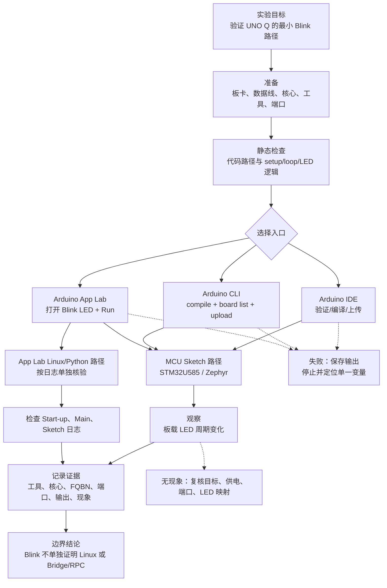

# 第5章 第一个实验：Blink 验证闭环

## 学习目标

- 使用已有的 Blink Sketch 建立从源码、编译、上传到实机观察的证据链。
- 区分 Arduino IDE、Arduino CLI 和 Arduino App Lab 的入口、执行侧与验证范围。
- 解释 `arduino:zephyr:unoq` 这一完全限定板卡名称（Fully Qualified Board Name，FQBN）在 CLI 工作流中的作用。
- 把“编译成功”“上传成功”“LED 出现预期现象”和“Linux/Bridge 已运行”分别记录，避免用一个结果替代另一个结果。
- 在没有开发板或工具链的情况下完成静态检查，并明确哪些结论只能留到硬件环境中验证。

## 本章导读

前四章建立了 Arduino UNO Q 的历史背景、产品定位、硬件架构和软件架构。本章把这些概念收束为第一个可复现实验：让一个最小的 Blink Sketch 在 UNO Q 的 MCU 侧形成可观察结果。

Blink 的价值不在于程序复杂，而在于它把一次开发活动拆成一条可以逐项核验的闭环：读懂源代码，确认目标板和核心，完成编译，完成上传，观察板载 LED，并保存足够的证据。对 UNO Q 而言，这条闭环还必须保留一个边界：Blink 主要覆盖 STM32U585 MCU 上的 Zephyr/Arduino Sketch 路径，不能单独证明 QRB2210 MPU、Debian Linux、Python 应用或 Arduino Bridge / RPC 已经运行。

## 背景与边界

本章只使用最小 LED 实验建立工作方法，不展开 GPIO 电气设计、Linux 运维、Python Bridge 实现或 App Lab 项目打包。硬件连接和工具版本会影响结果，因此正文把“应该怎么做”和“本次是否真的做过”分开书写。

### 五级证据边界

| 证据层级 | 能够支持的结论 | 不能单独支持的结论 |
|---|---|---|
| 源码静态检查 | 文件存在，包含 `setup()`、`loop()`、LED 输出和延时逻辑 | 编译器接受代码，硬件已经运行 |
| 编译成功 | 当前工具链能够为选定 FQBN 生成构建结果 | 目标板已经接收或执行固件 |
| 上传成功 | 工具报告固件已发送到目标路径 | LED 一定可见，Linux 应用一定启动 |
| LED 实际观察 | MCU 侧程序产生了可观察的板载 LED 现象 | MPU、Python、Bridge/RPC 或网络功能已验证 |
| App Lab 日志与协同观察 | App Lab 项目中记录了相应的启动、Python 或 Sketch 输出 | 其他未记录的外设、权限和时序性质已自动成立 |

后文所有“验证结果”都应写明位于哪一级。没有证据的层级使用“未验证”或“待硬件验证”，不使用“应该已经成功”代替结果。

## 1. 实验对象：一个最小 Sketch

### 1.1 使用仓库中的规范代码

本书不在多个章节复制同一份 Blink 源码。实验的规范代码位于[第 1 章 Blink 示例目录](../../code/第1章_Arduino的发展/Blink/README.md)，其中的 [`Blink.ino`](../../code/第1章_Arduino的发展/Blink/Blink.ino) 使用 `setup()` 完成 LED 引脚初始化，在 `loop()` 中反转 LED 状态并等待约 1 秒。

这样组织有两个好处：第 1 章保留“Arduino 跨代际学习入口”，第 5 章则把同一份代码放进完整的验证流程。后续若代码发生修改，只维护一个规范文件，并在本章重新记录验证边界。

### 1.2 代码行为与执行侧

实验代码依赖 `LED_BUILTIN`，不把某个物理引脚号硬编码为全板通用结论。对 Arduino UNO Q 来说，Blink Sketch 的目标执行侧是 STM32U585 MCU；LED 的具体颜色、物理位置和板级映射以目标板卡资料为准。

本实验预期的程序逻辑是：

1. 初始化阶段把板载 LED 对应的 Arduino 引脚设为输出。
2. 循环阶段切换输出状态。
3. 延时约 1 秒后再次切换。

“约 1 秒切换”是程序行为说明，不是本环境的实测结果。只有在目标板、端口和供电条件正确，并完成上传和观察后，才能把它写成实际现象。

## 2. 实验前检查

开始编译或上传前，先完成以下检查：

1. **目标确认**：确认手边的确是 Arduino UNO Q，而不是外形相近的其他 UNO 系列板。
2. **代码确认**：确认打开的是仓库中的 `Blink.ino`，没有把其他板卡示例误当成 UNO Q 实验。
3. **核心确认**：工具中安装并选择支持 UNO Q 的 Arduino Zephyr Core；板卡名称应显示为 Arduino UNO Q。
4. **连接确认**：使用可传输数据的 USB-C 连接，确认设备由目标计算机识别；不要把只充电线当成数据线。
5. **端口确认**：记录工具显示的端口或网络上传目标。端口变化时重新识别，不复用旧记录。
6. **停止条件**：遇到板卡、核心、端口、权限或连接错误时先保存完整输出，再排查；不要在错误原因不明时反复上传或更换多个变量。

本实验不要求外接 LED、电阻或面包板。涉及外部接线时，应先回到[第 3 章的硬件与电气边界](./第3章_UNO_Q的硬件架构.md)，核对引脚复用、供电和电平条件。

## 3. 选择开发入口

### 3.1 Arduino IDE：交互式 Sketch 路径

Arduino 官方 UNO Q 手册给出的基本路径是：

1. 在 Boards Manager 中安装支持 UNO Q 的 Zephyr Core。
2. 在 `Tools > Board` 中选择 Arduino UNO Q。
3. 在 `Tools > Port` 中选择当前连接的 UNO Q。
4. 打开 `Blink.ino`，先执行验证/编译，再点击上传。
5. 等待上传完成后观察板载 RGB LED 的红色通道是否按程序产生周期变化。

IDE 的上传结果应单独记录。即使 IDE 报告上传完成，也要继续记录是否观察到 LED 现象；如果 LED 没有变化，不能把“上传成功”改写成“实验成功”。

### 3.2 Arduino CLI：可重复的命令行路径

Arduino CLI 使用 FQBN 明确目标板。当前 ArduinoCore-zephyr 的 UNO Q 板卡标识为 `arduino:zephyr:unoq`；核心、CLI 和板卡定义可能随版本更新，执行前应使用目标环境实际安装的版本复核。

代码说明
- 用途：先编译，再识别端口并上传本章使用的 Blink Sketch。
- 运行环境：安装了支持 UNO Q 的 Arduino CLI、Arduino Zephyr Core 和相关工具链的开发主机。
- 文件位置：`code/第1章_Arduino的发展/Blink/`。
- 依赖：`arduino-cli`、UNO Q 的 Zephyr Core、目标板卡和数据 USB-C 连接；上传还需要实际端口。
- 操作步骤：从仓库根目录运行；先替换 `<PORT>`，再执行上传命令。编译失败或端口未识别时停止，不跳过错误。
- 预期输出：编译命令报告构建完成；上传命令报告目标端口上的上传过程。下面的文字只是示例输出，不是本次实测输出。
- 故障排查：先执行 `arduino-cli board list`，再核对 FQBN、核心版本、端口和连接权限；不要用另一块板的 FQBN 代替。
- 验证方式：分别保存 CLI 版本、编译输出、端口列表、上传输出和 LED 观察记录。

```powershell
$sketch = '.\code\第1章_Arduino的发展\Blink'
arduino-cli compile --fqbn arduino:zephyr:unoq $sketch
arduino-cli board list
arduino-cli upload --port '<PORT>' --fqbn arduino:zephyr:unoq $sketch
```

代码说明（结果解释）
- `compile` 只产生构建证据，不代表已经连接目标板。
- `board list` 用于确认当前端口，输出为空时应先处理连接或驱动问题。
- `upload` 需要把 `<PORT>` 替换为实际识别结果；如果上传失败，应保留错误原文和当时的板卡/核心版本。
- 本仓库当前未宣称已执行上述命令；命令输出必须由读者在自己的工具环境中取得。

### 3.3 Arduino App Lab：统一项目路径

App Lab 的 Blink LED 示例属于不同的项目入口。按照官方资料，读者可以在 Examples 中打开 Blink LED，连接 UNO Q 后点击 Run；App Lab 可能同时处理 MCU Sketch 的编译/上传与 Linux 侧 Python 应用的启动。

如果使用 App Lab，至少同时观察以下信息：

- **Start-up**：项目启动、MCU 编译和 Linux 部署相关日志。
- **Main (Python)**：Python 应用的标准输出和错误。
- **Sketch (Microcontroller)**：MCU Sketch 的串行输出。

App Lab 的 Run 完成不能替代对三个日志区域的阅读。若只看到 LED 变化，应把结论限制为“看到 MCU 侧可观察现象”，不要自动推导 Python 应用、Linux 服务或 Bridge/RPC 已经按预期协同。

## 4. Blink 验证流程

下面的流程把工具入口和证据层级放在同一张图中。失败节点的作用是提醒读者停止并保留证据，而不是继续盲目重试。

<a id="fig-06-uno-q-blink-validation"></a>



> 图示占位：图号=Fig-06；位置=Blink 验证流程图之后；内容=从准备、静态检查、IDE/CLI/App Lab 入口到 MCU LED 观察、App Lab 日志、失败停止和验证边界的实验闭环；来源=diagrams/uno-q-first-experiment-validation.mmd。

可追溯的原始图源见 [Blink 验证流程 Mermaid 源文件](../../diagrams/uno-q-first-experiment-validation.mmd)。图中 App Lab 的 Linux/Python 路径是独立证据支路；它不表示普通 IDE/CLI Blink 自动包含 Linux 应用。

## 操作或实验

### 实验 A：无硬件静态检查

在仓库根目录执行本节代码说明中的检查，确认规范 Sketch 路径存在，并能找到 `setup()`、`loop()`、`LED_BUILTIN`、`pinMode()`、`digitalWrite()` 和 `delay()`。这一步不需要 Arduino UNO Q，也不产生编译或硬件运行证据。

### 实验 B：IDE 或 CLI 的 MCU 侧验证

1. 按“实验前检查”确认目标板、核心、数据线和端口。
2. 选择 IDE 或 CLI，并记录工具版本、核心版本和板卡选择。
3. 完成一次编译；保存成功输出或完整错误。
4. 只有编译成功后才执行上传；保存端口和上传输出。
5. 等待板卡运行，观察 LED 的周期变化；记录观察时间、颜色、节奏和异常。
6. 按五级证据边界写出结论：静态、编译、上传和实机观察分别到了哪一级。

任何一步失败都应停止在该层级。例如编译失败时，记录只能到“源码已检查，编译未通过”；不能跳到“LED 未亮”或“Linux 未运行”等未经执行的结论。

### 实验 C：App Lab 日志核对

使用 App Lab 官方 Blink LED 示例时，除观察 LED 外，打开 Start-up、Main (Python) 和 Sketch (Microcontroller) 三类日志。分别记录：

- MCU Sketch 是否完成编译和部署；
- Python 应用是否启动、是否有异常；
- Sketch 是否有串行输出；
- LED 现象与日志时间是否大致对应。

本实验不要求读者把 App Lab 的项目文件复制进本仓库；本仓库保留一个最小 `.ino` 示例，App Lab 的完整项目结构留给第五篇。

## 验证结果

本章本次提交前可验证的内容包括：规范代码路径、章节结构、代码说明字段、Fig-06 图号与占位、内联 Mermaid 与独立图源的一致性、相对链接和官方来源登记。

本章没有宣称本环境已经完成 `arduino-cli` 编译、端口识别、上传、Arduino IDE 操作、App Lab 运行、LED 观察、Linux 进程检查或 Bridge/RPC 通信。读者完成实验后，应把自己的工具版本、命令输出和实机现象补入实验记录；不要把本章的示例输出当成实测输出。

## 常见问题

### 编译成功是否等于 LED 一定会闪？

不等于。编译成功只说明当前工具链能为选定 FQBN 生成构建结果；还需要确认上传目标、供电、端口和板载 LED 映射，并在实机上观察。

### 为什么 IDE 和 CLI 都要选择 UNO Q 的目标？

因为工具必须知道要使用哪个板卡定义、编译器、链接配置和上传工具。CLI 通过 FQBN 明确目标；IDE 通过 Board 菜单完成相同类型的目标选择。两者入口不同，但都不能省略目标确认。

### App Lab 的 Run 和 IDE 的 Upload 是同一件事吗？

不是。IDE 主要提供 MCU 侧 Arduino Sketch 的交互式编程路径；App Lab 以项目为单位组织 Sketch、Python 和其他应用入口，Run 可能同时触发 MCU 编译/部署与 Linux 应用启动。两者都需要分别记录自己的输出和验证边界。

### 上传成功但 LED 没有变化，应该怎么办？

先停止重复上传，保存上传输出，然后依次核对板卡选择、供电、USB-C 数据连接、端口是否变化、核心版本和 `LED_BUILTIN` 的板级映射。不要先修改代码、换线、换板和换核心多个变量；一次只改变一个因素。

### Blink 运行了，是否说明 Linux 和 Bridge/RPC 也正常？

不能。普通 Blink 主要覆盖 MCU Sketch 路径。Linux 应用、Python 输出和 Bridge/RPC 需要各自的启动、日志、请求响应或故障恢复证据；LED 现象不能替代这些证据。

### 没有开发板时，本章能完成什么？

可以完成代码路径和结构的静态检查，阅读 IDE/CLI/App Lab 的操作步骤，理解证据分层，并准备实验记录表。不能声称编译、上传、LED 观察或 Linux/Bridge/RPC 运行已经完成。

## 本章小结

Blink 是 UNO Q 的第一个实验，但它不是“按一下上传就结束”的演示。可靠的实验闭环包括：确认代码和执行侧，确认板卡核心与工具入口，分别取得编译和上传证据，再观察 LED 并记录现象。App Lab 还需要额外检查启动、Python 和 Sketch 日志。

对 UNO Q 而言，最重要的结论是验证范围：Blink 可以作为 STM32U585 MCU、Zephyr 和 Arduino Sketch 路径的入门检查，但不能单独证明 QRB2210 MPU、Debian Linux、Python 应用或 Arduino Bridge / RPC 已经工作。后续篇章将在这个边界上继续增加外设、Linux 和跨处理器服务的证据。

## 交叉引用与延伸阅读

- 回顾软件入口与执行侧：[第 4 章：UNO Q 的软件架构](./第4章_UNO_Q的软件架构.md)。
- 回顾硬件和电气边界：[第 3 章：UNO Q 的硬件架构](./第3章_UNO_Q的硬件架构.md)。
- 查看本章规范代码：[第 1 章 Blink 示例目录](../../code/第1章_Arduino的发展/Blink/README.md)。
- 进入 MCU 外设路线：[第二篇：STM32](../第2篇_STM32/README.md)。
- 进入 Linux 路线：[第三篇：Linux](../第3篇_Linux/README.md)。
- 进入跨处理器服务路线：[第四篇：Python Bridge](../第4篇_PythonBridge/README.md)。
- 进入 App Lab 项目路线：[第五篇：App Lab](../第5篇_AppLab/README.md)。
- 查看本章图源：[Blink 验证流程 Mermaid 源文件](../../diagrams/uno-q-first-experiment-validation.mmd)。
- 查阅全书来源索引：[参考资料索引](../../resources/references.md)。

## 来源与验证

本章于 `2026-09-21` 核验以下官方资料：

1. [Arduino UNO Q User Manual](https://github.com/arduino/docs-content/blob/main/content/hardware/02.uno/boards/uno-q/tutorials/01.user-manual/content.md)：核对 Arduino IDE 的 UNO Q MCU 编程范围、Zephyr Core 安装入口和 Blink 的 IDE 操作路径。
2. [Arduino UNO Q Datasheet](https://docs.arduino.cc/resources/datasheets/ABX00162-datasheet.pdf)：核对 Blink LED 示例、App Lab Run 路径、MCU Sketch 与 Linux/Python 日志的区分。
3. [ArduinoCore-zephyr](https://github.com/arduino/ArduinoCore-zephyr)：核对 UNO Q 的 Arduino Zephyr Core、FQBN `arduino:zephyr:unoq` 与 IDE/CLI 支持边界。
4. [Arduino CLI Getting Started](https://docs.arduino.cc/arduino-cli/getting-started)：核对 `compile`、`board list` 和 `upload` 的命令行工作流。

正文和图示均为基于上述官方资料的原创整理；本章不复制外部代码、图片或正文。当前只完成文档和来源静态核对，未执行工具链、App Lab、Linux、Bridge/RPC 或硬件实机验证。
