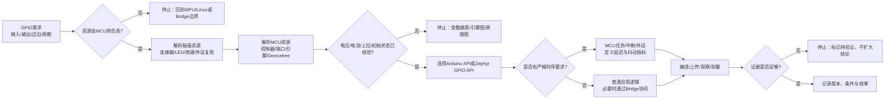

# 第1章 STM32 侧开发基础：GPIO、引脚与实时边界

## 学习目标

- 说明 Arduino UNO Q 中 STM32U585、Zephyr 和 Arduino Core 的职责关系。
- 区分逻辑引脚名、板级连接器引脚、STM32 GPIO 控制器/引脚和外设复用功能。
- 掌握 GPIO 输入、输出、上下拉、有效电平和初始状态的基本判断方法。
- 知道什么时候可以使用 Arduino API，什么时候必须继续阅读 Zephyr 的 Devicetree、驱动和板级定义。
- 把 MCU 侧的时序控制与 QRB2210 MPU、Debian Linux 以及 Bridge/RPC 的高层协同分开。
- 在没有开发板或工具链时，完成一份可审查的 GPIO 资源识读和风险检查记录。

## 本章导读

第一篇已经完成从 Arduino 发展、UNO Q 定位、硬件架构、软件架构到 Blink 验证闭环的基础铺垫。本篇进入 STM32 侧，但章节编号在本篇重新开始，因此本章是**第二篇第 1 章**，不是全书的第 6 章。

本章不急于罗列所有外设 API，而是先建立一个以后每个外设章节都要复用的判断框架：一个信号由谁拥有，如何从板级资源映射到 MCU，软件通过哪一层 API 访问，电气条件和时序要求如何核验，以及最终用什么证据证明它真的工作。GPIO 是最小而完整的练习对象，因为它同时包含引脚归属、逻辑状态、电气边界、软件抽象和可观察验证。

Arduino UNO Q 的官方板卡资料把 STM32U585 作为 MCU 侧 Zephyr 目标；Arduino UNO Q User Manual 也明确 Arduino IDE 的 UNO Q 工作流针对 MCU，而 Linux 应用和更高层项目属于另一侧。这个事实使本章的范围清晰：我们学习的是 MCU 侧开发模型，不把 Linux 代码、Bridge/RPC 请求或一张产品引脚图自动当成 GPIO 实测结果。

## 背景与边界

本章覆盖：

1. STM32U585 MCU、Zephyr 和 Arduino Core 的分层关系。
2. GPIO 资源从需求到软件 API 的解析链。
3. Arduino API 与 Zephyr GPIO API 的概念对照。
4. MCU 实时控制、Linux 高层应用和 Bridge/RPC 的边界。
5. 一项不需要接线的纸面识读练习。

本章不覆盖：

- UNO Q 全部物理引脚的逐针脚接线表；
- PWM、ADC、UART、SPI、I2C 的完整 API 和外设实验；
- STM32U585 数据表中的全部电气参数；
- Arduino CLI 编译、上传、调试器连接或硬件实机测量；
- Linux 侧直接控制任意 GPIO 的权限、设备节点或驱动实现。

涉及具体电压、电流、复用、上电状态和负载时，应回到 UNO Q 数据表、完整引脚图、板级原理图、STM32U585 数据表和目标软件版本的板卡定义逐项核验。没有实测证据时，本文使用“需要核验”“静态示例”或“待硬件验证”，不把推断写成运行结果。

## 1. 为什么第二篇从 STM32 侧开始

### 1.1 UNO Q 的 MCU 责任域

Arduino UNO Q 同时包含 Qualcomm Dragonwing QRB2210 微处理器（Microprocessor，MPU）和 STM32U585 微控制器（Microcontroller，MCU）。MPU 侧运行 Debian Linux，适合文件、网络、应用和较高层计算；MCU 侧运行 Zephyr 与 Arduino Sketch，适合直接面对 GPIO、定时、采样和常用总线等硬件控制任务。

“适合”表示责任分配和验证起点，不表示处理器之间存在绝对不可改变的功能墙。真正的边界还取决于引脚归属、外设复用、驱动、权限、通信路径、时序目标和故障恢复方案。对于一个需要在固定时间内改变输出状态的任务，先把最终动作放在 MCU 侧，通常比让 Linux 用户态程序直接承担同一个时序责任更容易分析；是否满足项目指标，仍必须测量。

### 1.2 Arduino Core 与 Zephyr 的关系

ArduinoCore-zephyr 是面向 Zephyr 的 Arduino Core，它让熟悉 Arduino Sketch 的开发者可以使用 Arduino 工具链，同时接触 Zephyr 的板级和实时能力。这里有三个容易混淆的对象：

| 对象 | 回答的问题 | 本章的正确理解 |
|---|---|---|
| STM32U585 | 哪颗 MCU 执行硬件控制 | UNO Q 的 MCU 侧目标芯片 |
| Zephyr | MCU 上的运行时和设备抽象如何组织 | 提供内核、驱动接口、Devicetree 和调度能力 |
| Arduino Core | Arduino API 如何连接到板卡与 Zephyr | 为 Arduino IDE、Arduino CLI 或 App Lab 的 Sketch 工作流提供板级适配 |

因此，使用 `pinMode()` 不等于绕开 Zephyr，使用 Zephyr GPIO API 也不等于已经完成 UNO Q 的板级验证。两者都必须落到具体板卡定义、可用驱动、引脚复用和目标版本上。

## 2. 从需求到 GPIO 的五层解析

一个可靠的 GPIO 设计不能从“找一个数字编号”开始。建议按以下五层逐步解析：

| 层次 | 要回答的问题 | 主要核验对象 | 常见误判 |
|---|---|---|---|
| 需求层 | 信号是输入、输出、边沿事件还是周期波形？ | 功能需求、时序和故障状态 | 只写“控制一个 LED”，没有定义安全初始状态 |
| 板级层 | 信号在哪个连接器、LED、按键或扩展设备上？ | UNO Q 数据表、完整引脚图、原理图 | 把板上存在的资源当成任意引脚都可用 |
| MCU 层 | 对应哪个 GPIO 控制器、端口/引脚和复用功能？ | STM32U585 数据表、板卡定义、外设复用 | 把 Arduino 逻辑编号直接当成 STM32 端口名 |
| 运行时层 | 由 Arduino API、Zephyr GPIO API 还是其他驱动访问？ | Arduino Core、Zephyr 配置、Devicetree | 复制通用示例但没有确认目标板支持该别名 |
| 证据层 | 怎样证明编译、上传、信号状态和时序都正确？ | 构建输出、运行日志、示波器/万用表/实物观察 | 用“代码看起来正确”代替硬件证据 |

这五层的顺序不是形式要求，而是风险控制。只要板级归属或电气条件尚未确认，就不应因为某个 API 可以调用而直接接线；只要时序指标尚未定义，就不应因为程序运行在 RTOS 上而宣称“实时”。

## 3. GPIO 的基本模型

### 3.1 输入、输出与备用功能

GPIO（General-Purpose Input/Output，通用输入输出）是可以由软件配置为数字输入或数字输出的信号资源。一个物理引脚还可能复用为 UART、SPI、I2C、PWM、ADC 或其他专用功能。引脚在某一时刻究竟由 GPIO 还是由外设控制，取决于复用配置和板级连接，不取决于名称中是否出现“GPIO”。

| 模式 | 软件观察或驱动的对象 | 设计时必须确认 |
|---|---|---|
| 数字输入 | 读取高/低状态，或等待边沿/电平事件 | 外部驱动、浮空风险、上下拉、去抖和中断条件 |
| 数字输出 | 设置高/低或有效/无效状态 | 负载、电流、上电初始状态、是否会与外部驱动冲突 |
| 备用功能 | 由 UART、SPI、I2C、PWM 等外设控制 | 复用表、外设实例、冲突资源和驱动支持 |
| 高阻/断开 | 暂不主动驱动信号 | 外部上拉/下拉、掉电状态和安全默认值 |

### 3.2 逻辑状态不等于可以随意接线

软件中的 `HIGH`、`LOW`、有效、无效是逻辑层概念。它们不能单独告诉我们：

- 信号的实际高电平电压是多少；
- 输入端是否允许该电压；
- 输出端可以提供或吸收多大电流；
- 板上是否已经有上拉、下拉、指示灯或其他负载；
- 上电、复位或软件尚未启动时引脚处于什么状态。

UNO Q 的 MCU 侧常见 I/O 是 3.3 V 域，但这不等于任意 UNO 外设、旧 Shield 或外部模块都可以直接连接；具体逻辑容限、供电和负载必须按目标引脚与器件数据表核验。类似地，MPU 侧的 1.8 V I/O 不能因为软件上也叫 GPIO 就与 3.3 V MCU 信号直接互接。

### 3.3 有效电平与初始状态

许多板载 LED 或外部控制线是低电平有效（active-low）：软件写入逻辑低时，物理器件反而处于“开”或“触发”状态。软件 API 可能把这个差异隐藏在板级定义、Devicetree 标志或 Arduino 变体中；如果学习者只记住“写 HIGH 就是开”，就会在换板、换 LED 或换外设时产生错误。

为每个输出定义至少三个状态：

1. **初始化前状态**：复位或程序尚未配置引脚时的安全要求。
2. **非活动状态**：正常工作中不触发执行器的状态。
3. **活动状态**：驱动 LED、继电器、使能脚或其他负载的状态。

先定义这些状态，再选择 `GPIO_ACTIVE_LOW`、Arduino 的 `HIGH/LOW` 或自己的逻辑变量，能够减少“软件名字正确但硬件动作相反”的错误。

## 4. GPIO 任务决策图

下面的流程把一个“我要控制一个数字信号”的想法拆成责任、映射、电气和证据四个检查点。图中的“通过”只表示可以进入下一项核验，不表示已经完成硬件测试。

<a id="fig-07-uno-q-stm32-gpio-boundary"></a>



> 图示占位：图号=Fig-07；位置=GPIO 任务决策图之后；内容=从 GPIO 需求出发，经过 MCU 责任、板级资源、STM32/Devicetree 映射、电气核验、API 选择、实时性判断和证据记录的成功与停止路径；来源=diagrams/uno-q-stm32-gpio-boundary.mmd。

可追溯的图源见 [STM32 GPIO 边界 Mermaid 源文件](../../diagrams/uno-q-stm32-gpio-boundary.mmd)。图中的停止节点是安全边界，不是错误处理的完整实现；真实项目还需记录回滚、断电和执行器保护方案。

## 5. Arduino API 与 Zephyr GPIO API 的对照

### 5.1 Arduino API：面向 Sketch 的逻辑入口

Arduino API 把很多板级细节收敛成 `pinMode()`、`digitalWrite()`、`digitalRead()` 等熟悉的调用。对初学者来说，这适合先表达“把一个逻辑引脚设为输出并改变状态”的意图；但它不会替代板级引脚、电气和运行时核验。

代码说明
- 用途：展示 Arduino Sketch 如何表达一个输出状态机，不新增或替代仓库中已有的 Blink 规范代码。
- 运行环境：Arduino UNO Q 的 MCU 侧 Arduino/Zephyr Sketch 工作流；本片段未在本环境编译。
- 文件位置：概念片段；规范 Blink 文件仍位于[第一篇 Blink 示例目录](../../code/第1章_Arduino的发展/Blink/README.md)。
- 依赖：Arduino Core 提供的 `pinMode()`、`digitalWrite()` 和 `LED_BUILTIN`；具体板级映射需由目标核心确认。
- 操作步骤：先确认目标板、核心、端口和 `LED_BUILTIN` 的板级定义，再把片段放入完整 Sketch；没有开发板时只做静态阅读。
- 预期输出：逻辑状态每隔约 1 秒切换；这是程序意图，不是本环境的实测输出。
- 故障排查：若 LED 不亮，依次检查核心、上传、板载 LED 的有效电平、目标端口和硬件连接，不把“代码可读”当作上传或运行成功。
- 验证方式：静态检查 API 使用；真实结果需要编译、上传、LED 观察或仪器测量。

```cpp
bool outputState = false;

void setup() {
  pinMode(LED_BUILTIN, OUTPUT);
  digitalWrite(LED_BUILTIN, LOW);
}

void loop() {
  outputState = !outputState;
  digitalWrite(LED_BUILTIN, outputState ? HIGH : LOW);
  delay(1000);
}
```

这个片段有三个值得注意的地方：

1. `LED_BUILTIN` 是逻辑板级名称，不应在本章直接替换成猜测出来的 STM32 端口号。
2. `HIGH` 与 `LOW` 表达逻辑输出状态，不自动提供电压、电流或有效电平的完整证明。
3. `delay(1000)` 表达一个简单的周期意图，不足以证明复杂系统在负载、并发和中断下仍满足实时指标。

### 5.2 Zephyr GPIO API：面向设备描述的硬件入口

Zephyr 的通用 GPIO 文档通常通过 Devicetree 提供控制器、引脚和标志，再由 `gpio_dt_spec` 携带这些信息进入 GPIO API。这样做的价值是把“板级资源描述”和“应用逻辑”分开：应用可以读取一个已声明的 LED 或按键，而不是在每份代码中硬编码端口寄存器。

下面是根据 Zephyr GPIO 文档整理的概念片段。它用于解释 `gpio_dt_spec`、设备就绪检查和配置顺序，不表示本仓库已经确认 UNO Q 的 `led0` 别名、原生 Zephyr 工程配置或该片段可以直接通过 Arduino Core 编译。

代码说明
- 用途：说明 Zephyr GPIO 的 Devicetree 解析、设备就绪检查和输出配置顺序。
- 运行环境：原生 Zephyr 应用模型的概念示例；不是本仓库已验证的 Arduino UNO Q 工程。
- 文件位置：概念片段；没有新增可直接编译的 Zephyr 应用目录。
- 依赖：目标板存在 `led0` Devicetree 别名，启用 GPIO 驱动，并提供相应设备节点；这些条件必须逐项确认。
- 操作步骤：先查目标板的 Devicetree 和构建配置，再将示例改造成目标工程；禁止在未确认别名和引脚的情况下直接接线。
- 预期输出：成功返回 0，失败返回负错误码或在设备未就绪时停止；这是示例控制流，不是本次实测输出。
- 故障排查：优先检查 Devicetree 节点/别名、GPIO 配置、目标板支持和构建日志，再检查物理接线。
- 验证方式：先做静态编译与配置验证，再进行上传、运行日志和 GPIO 实测；本章未执行这些运行验证。

```c
#include <errno.h>
#include <zephyr/devicetree.h>
#include <zephyr/drivers/gpio.h>

#define LED0_NODE DT_ALIAS(led0)

static const struct gpio_dt_spec led =
    GPIO_DT_SPEC_GET(LED0_NODE, gpios);

int configure_led(void)
{
    if (!gpio_is_ready_dt(&led)) {
        return -ENODEV;
    }

    return gpio_pin_configure_dt(&led, GPIO_OUTPUT_INACTIVE);
}
```

与 Arduino 片段相比，这段代码显式暴露了更多前置条件：设备节点必须存在，GPIO 控制器必须就绪，Devicetree 中的有效电平和引脚标志必须与板级电路相符，构建系统还必须启用相关驱动。抽象层更接近硬件，并不意味着可以跳过硬件核验。

## 6. MCU 实时边界与 Linux/Bridge 协同

### 6.1 按时序需求分配任务

可以使用下面的初始分类，但最终决定必须由时序指标和硬件资源约束支持：

| 任务类型 | 优先考虑的责任域 | 原因 | 需要留下的证据 |
|---|---|---|---|
| 读取按钮并改变板载指示灯 | MCU | 直接 I/O，链路短，容易形成闭环 | 编译、上传、输入变化、输出观察 |
| 固定周期采样并保护执行器 | MCU/外设 | 需要明确采样和响应预算 | 周期、延迟、抖动和异常状态测量 |
| 文件处理、网络请求、模型推理 | MPU/Linux | 依赖进程、文件系统、网络或较高层库 | 进程日志、权限、网络和资源使用 |
| Linux 请求 MCU 改变输出 | Bridge/RPC + MCU | Linux 负责业务意图，MCU 负责最终硬件动作 | 请求、响应、超时、硬件状态和恢复 |
| 对硬件状态作可视化展示 | MPU/Linux | UI、日志和网络展示属于高层应用 | 数据来源、刷新策略、断链行为 |

Bridge/RPC 是服务边界，不是实时循环的替代品。如果每一次 GPIO 翻转都必须先等待 Linux 请求、跨处理器通信和用户态调度，时序分析就不能只看 MCU 代码。对于严格周期或安全动作，应让 MCU 本地任务、定时器、中断或专用外设承担关键时序，把 Linux/Bridge 放在配置、策略和非实时协同位置。

### 6.2 “使用 Zephyr”不自动等于“满足实时”

实时性是一个需要定义和测量的工程属性，至少要说明：

- 目标周期或最大响应延迟；
- 允许的抖动范围；
- 中断、线程、驱动和 Bridge 调用的竞争关系；
- 共享资源、内存和队列的最坏情况；
- 失联、超时、复位和输出回到安全状态的行为；
- 使用的板卡、固件、核心、编译选项和外设负载。

因此，本章只把 Zephyr 视为提供实时系统基础的运行时，不替任何具体项目作出“确定性已满足”的结论。

## 7. 操作或实验：GPIO 资源识读工作表

本实验不需要开发板、USB 线、网络或工具链。目标是练习在写代码前识别资源和停止条件。

### 7.1 工作表

选择一个板载 LED、按钮或计划连接的数字信号，填写下表：

| 项目 | 填写内容 |
|---|---|
| 功能需求 | 例如：按钮按下后点亮指示灯 |
| 责任域 | MCU、MPU/Linux，或两侧协同 |
| 板级资源 | LED、按键、UNO header、Qwiic 或其他连接器 |
| 逻辑名称 | 例如 `LED_BUILTIN`、Devicetree 别名或服务名 |
| MCU 映射 | 控制器、端口/引脚、外设复用；未知项标记“待核验” |
| 有效电平 | 高有效、低有效或尚未确认 |
| 电气条件 | I/O 电压域、输入容限、负载、上下拉和供电 |
| API 入口 | Arduino API、Zephyr GPIO API 或其他已登记驱动 |
| 时序目标 | 周期、最大响应、允许抖动；没有指标就写“未定义” |
| 运行证据 | 构建、上传、日志、LED/按键观察、仪器测量 |
| 停止条件 | 哪些资料缺失时不能继续接线或扩大结论 |

### 7.2 操作步骤

1. 先写功能需求，不写数字引脚号。
2. 在 UNO Q 官方资料中确认板级资源和电气域；资料没有给出的字段保留“待核验”。
3. 再查看 STM32U585 数据表和目标板卡定义，确认端口、复用和输入/输出限制。
4. 选择 Arduino API 或 Zephyr GPIO API，并说明选择理由。
5. 为初始化、正常运行、故障和复位分别写出安全状态。
6. 列出能够证明每一层结论的证据，不把一个编译结果扩展成整板功能通过。
7. 如果发现资源归属、电压、复用、负载或时序不明确，停止在纸面检查，不开始接线。

### 7.3 通过条件

完成后，应能够清楚回答：

- 这个信号最终由哪颗处理器、哪一个运行时和哪一层 API 负责？
- 逻辑名称如何映射到板级资源和 STM32 资源？
- 高/低电平和有效/无效是否被混为一谈？
- 该任务是否需要本地实时控制，是否错误地依赖 Linux/Bridge 往返？
- 如果今天没有开发板，哪些结论仍只能写成“待硬件验证”？

## 8. 验证结果

本章的事实基线来自已登记的 Arduino、Zephyr 和 ST 官方资料；本章正文、Mermaid 图和工作表是基于这些资料的原创整理。

本章当前不声明以下运行结果已经取得：

- Arduino IDE、Arduino CLI 或 App Lab 的编译结果；
- Sketch 上传、Zephyr 原生应用构建或调试器连接；
- UNO Q 板载 LED、按键或外接 GPIO 的实物观察；
- GPIO 电压、电流、边沿、周期、延迟或抖动测量；
- Linux/Bridge/RPC 与 MCU 之间的实际通信；
- 任意旧 UNO Shield 或外部模块的电气兼容性。

提交前的静态检查应至少覆盖 front matter、篇内章节号、SUMMARY 入口、相对链接、Fig-07 图号、Mermaid 独立源文件一致性、代码说明字段和 `git diff --check`。这些检查通过后，也只能证明文档结构和可追溯性，不能替代硬件运行验证。

## 常见问题

### 为什么第一篇最后是第 5 章，而本篇又是第 1 章？

本书按篇组织章节号。每一篇是一个相对独立的学习阶段，因此第一篇的第 1～5 章不会把编号传递给第二篇；跨篇引用必须写出篇名和章节号，例如“第二篇第 1 章”。

### 第二篇第 1 章是不是第一篇第 3 章的重复？

不是。第一篇第 3 章建立 UNO Q 的整板硬件地图，回答“资源在哪里、两颗处理器如何分工”；本章把范围收窄到 STM32 侧 GPIO 的开发方法，回答“一个信号如何被解析、配置和验证”。后续外设章节再分别展开 PWM、ADC 和通信总线。

### `LED_BUILTIN` 对应哪个 STM32 端口？

不能仅凭名称在本章猜测。它是 Arduino Core 面向板卡提供的逻辑标识，实际映射应由目标版本的板级定义、完整引脚图、数据表和原理图共同确认。即使映射已确认，也还要核对有效电平、负载和运行状态。

### `HIGH` 是否一定等于 3.3 V？

不能这样写成普遍结论。`HIGH` 是软件逻辑状态；实际电压受 I/O 电源域、输出结构、负载和测量条件影响。UNO Q MCU 侧的 3.3 V 设计边界不能替代具体引脚和器件的电气参数。

### Arduino GPIO API 和 Zephyr GPIO API 能否随意混用？

不能假设随意混用。它们属于不同抽象层，依赖的板级映射、Devicetree、驱动和构建配置可能不同。可以对照理解，但在同一个工程中选择哪种入口，必须以目标核心和工程配置支持为准。

### Linux 程序能否直接控制所有 STM32 GPIO？

不能。Linux 侧能否访问某项资源取决于资源归属、Bridge/RPC 服务、驱动、权限和电气连接。对于 MCU 侧的时序动作，应先设计并验证 MCU 本地控制路径，而不是从 Linux 可以发出请求推断“所有 GPIO 都可直接用”。

### Zephyr 已经提供调度，为什么还要写时序指标？

因为调度能力只是系统基础。实际响应还会受到线程优先级、中断、驱动、队列、共享资源、通信和负载影响。没有目标周期、最大延迟、抖动范围和测量方法，就没有可审查的实时性结论。

## 本章小结

第二篇从 STM32 侧开始，第一章从 GPIO 建立通用的硬件开发方法：

1. 先确定需求和责任域，再确定板级资源。
2. 再把板级资源解析到 STM32 控制器、引脚和复用功能。
3. 根据目标运行时选择 Arduino API 或 Zephyr GPIO API。
4. 在接线前确认电压、电流、上下拉、有效电平、初始化状态和负载。
5. 对周期与响应要求严格的动作，让 MCU 本地控制承担关键时序。
6. 用构建、上传、运行观察和仪器测量逐层记录证据。

本章的核心不是记住某一个数字引脚，而是形成一条可复查的 GPIO 解析链。以后进入 PWM、ADC、串口、SPI、I2C 或综合项目时，仍应沿用这条链，并在每一篇内部从本篇自己的第 1 章开始编号。

## 交叉引用与延伸阅读

- 回顾整板资源与电气域：[第一篇第 3 章：Arduino UNO Q 的硬件架构](../第1篇_认识UNOQ/第3章_UNO_Q的硬件架构.md)。
- 回顾软件责任与工具分工：[第一篇第 4 章：UNO Q 的软件架构](../第1篇_认识UNOQ/第4章_UNO_Q的软件架构.md)。
- 回顾第一个 MCU 侧 Blink 验证闭环：[第一篇第 5 章：第一个实验——Blink 验证闭环](../第1篇_认识UNOQ/第5章_第一个实验_Blink验证闭环.md)。
- 返回本篇章节地图：[第二篇：STM32](./README.md)。
- 后续进入 Linux 侧责任域：[第三篇：Linux](../第3篇_Linux/README.md)。
- 后续进入跨处理器协同：[第四篇：Python Bridge](../第4篇_PythonBridge/README.md)。
- 查看本章图源：[STM32 GPIO 边界 Mermaid 源文件](../../diagrams/uno-q-stm32-gpio-boundary.mmd)。
- 查阅全书来源索引：[参考资料索引](../../resources/references.md)。

## 来源与验证

本章于 2026-09-21 核验以下已登记的官方资料：

1. [Arduino UNO Q User Manual](https://github.com/arduino/docs-content/blob/main/content/hardware/02.uno/boards/uno-q/tutorials/01.user-manual/content.md)：核对 UNO Q 的双处理器、Debian Linux、Zephyr 和 Arduino IDE 面向 MCU 的工作流边界。
2. [ArduinoCore-zephyr](https://github.com/arduino/ArduinoCore-zephyr)：核对 Arduino Core 基于 Zephyr、UNO Q 板卡支持和工具链入口的事实边界。
3. [ArduinoCore-zephyr boards.txt](https://github.com/arduino/ArduinoCore-zephyr/blob/main/boards.txt)：核对 UNO Q 的 Zephyr 目标、STM32U585 变体和 FQBN/上传配置属于板级构建信息，不能被当作运行实测。
4. [Zephyr GPIO 文档](https://docs.zephyrproject.org/latest/hardware/peripherals/gpio.html)：核对 GPIO 配置、数据访问、Devicetree 和 gpio_dt_spec 的通用 API 模型。
5. [Zephyr Blinky 示例说明](https://github.com/zephyrproject-rtos/zephyr/blob/main/samples/basic/blinky/README.rst)：核对 led0 别名、GPIO 配置和不支持板卡时的构建边界。
6. [Zephyr Arduino UNO Q 板卡文档](https://github.com/zephyrproject-rtos/zephyr/blob/main/boards/arduino/uno_q/doc/index.rst)：核对 UNO Q 的 QRB2210 MPU、STM32U585 MCU 和 MCU 侧 Zephyr 目标。
7. [Arduino UNO Q Datasheet](https://docs.arduino.cc/resources/datasheets/ABX00162-datasheet.pdf)：核对 UNO Q 板级 MCU I/O 和连接器的电气边界。
8. [STM32U585xx Datasheet](https://www.st.com/resource/en/datasheet/stm32u585oi.pdf)：说明 GPIO、复用和电气参数必须回到 MCU 数据表及具体条件核验。

本章未复制上述资料的代码、图片或大段正文。链接可访问不等于本项目取得外部材料再分发许可；本章中的代码是原创概念片段，硬件、工具链和运行时结论仍需在目标版本和实际设备上单独验证。
