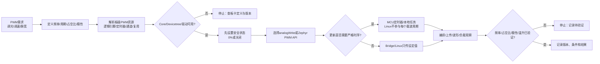

# 第2章 PWM 与定时输出：从占空比到安全控制

## 学习目标

- 区分周期、频率、脉宽、占空比和有效电平，能够用统一单位完成基本计算。
- 理解一个逻辑 PWM 引脚如何映射到板级资源、STM32 定时器通道、引脚复用和软件 API。
- 了解 Arduino analogWrite() 与 Zephyr PWM API 的抽象边界，不把函数名当成硬件能力证明。
- 设计 PWM 输出的安全初始状态、关闭路径、极性处理和负载边界。
- 区分 PWM 载波频率、控制环更新频率和 Linux/Bridge 的设定值传输频率。
- 在没有开发板或示波器时完成纸面计算、资源核对和待验证项登记。

## 本章导读

第二篇第 1 章先建立了 GPIO、引脚复用、电气条件和 MCU/MPU 责任边界。本章在这个基础上增加“时间轴”：输出不再只是高或低，而是按固定周期重复的波形。PWM（Pulse Width Modulation，脉冲宽度调制）可以用数字输出的脉冲宽度改变负载在一个周期内获得的平均能量，因此常被用于 LED 调光、风扇调速、加热功率控制或向外部驱动器提供脉宽信号。

本章的核心不是记住一个“万能频率”，而是建立一条可以复查的链：

> 定义需求 → 计算周期与占空比 → 确认板级 PWM 资源 → 选择 API → 设定安全初始状态 → 测量波形与负载 → 记录版本和证据。

本章是**第二篇第 2 章**，章节编号在本篇内从 1 开始，不承接第一篇的编号，也不是全书的第 7 章。

## 背景与边界

本章覆盖：

1. PWM 的周期、频率、脉宽、占空比和极性。
2. UNO Q 的逻辑引脚、STM32 定时器通道、板级变体/Devicetree 和负载之间的映射关系。
3. Arduino analogWrite() 与 Zephyr PWM API 的使用边界。
4. PWM 输出的安全状态、驱动能力、故障关闭和实时责任分配。
5. 一项纸面计算练习、一项资源识读练习和一套可选的硬件验证顺序。

本章不覆盖：

- UNO Q 全部 PWM 引脚、定时器实例和频率能力的固定清单；
- 某个具体核心版本下所有 analogWrite() 参数范围、默认频率或分辨率；
- 电机、继电器、舵机、加热器等负载的完整功率级设计；
- 示波器、逻辑分析仪或实际负载的实测结果；
- Linux 用户态直接生成严格 PWM 载波的方案。

具体引脚、复用、频率上限、定时器共享关系、有效电平和电气限制必须回到目标版本的板卡定义、Devicetree、Arduino Core、UNO Q 数据表、STM32U585 数据表以及负载器件资料逐项核验。没有实测证据时，本文使用“静态计算”“概念片段”或“待硬件验证”，不把推导写成运行结果。

## 1. PWM 的四个基本量

### 1.1 周期、频率与脉宽

一个理想的 PWM 波形在每个周期内有一段有效脉冲，其余时间处于非有效状态。先约定波形的周期 T、频率 f 和有效脉宽 t_on：

| 量 | 符号 | 含义 | 常用单位 |
|---|---|---|---|
| 周期 | T | 相邻两个同类边沿之间的时间间隔 | s、ms、µs、ns |
| 频率 | f | 每秒重复的周期数 | Hz、kHz |
| 有效脉宽 | t_on | 每个周期内处于有效状态的时间 | s、ms、µs、ns |
| 占空比 | D | 有效脉宽占周期的比例 | 0～1 或 0%～100% |
| 极性 | active-high/active-low | 哪个逻辑电平代表“有效” | 标志或板级约定 |

三者的基本关系是：

```text
f = 1 / T
D = t_on / T
t_on = D × T
```

例如，目标频率为 1 kHz 时，周期为 1 ms；若占空比为 25%，有效脉宽为 250 µs。这是单位换算和比例计算，不是 UNO Q 某个引脚的测量结果。

### 1.2 占空比不是“模拟电压”

PWM 输出通常仍是数字高低电平快速切换，并不等同于 DAC（Digital-to-Analog Converter，数模转换器）直接产生的连续模拟电压。负载看到的平均效果取决于：

- 负载对频率的响应；
- 电源、驱动器、滤波器和保护电路；
- 占空比的有效极性；
- 负载的非线性、惯性或闭环控制；
- 采样仪器的带宽和测量方法。

因此，不能仅凭“占空比加倍”就断言 LED 的主观亮度、直流电机的转速或加热器的温升也会加倍。对于 LED，眼睛的亮度感知通常不是线性的；对于电机，占空比还会受到驱动器、电源和负载转矩影响。本章只把占空比定义为波形参数，不替具体负载作出线性效果承诺。

### 1.3 频率、更新率和有效电平不是一回事

PWM 项目中至少存在三种“频率”或速率：

| 名称 | 回答的问题 | 典型负责者 |
|---|---|---|
| PWM 载波频率 | 波形本身每秒重复多少次？ | 定时器/PWM 外设 |
| 控制环更新率 | 多久计算并更新一次占空比？ | MCU 本地任务或控制器 |
| 设定值传输频率 | Linux/Bridge 多久发送一次新的目标值？ | Bridge、通信链路和上层应用 |

上层每 100 ms 发送一次占空比，并不意味着 PWM 载波只有 10 Hz。只要 MCU 的 PWM 外设继续运行，载波仍可以按独立的硬件周期输出；上层发送的是设定值，而不是每一个载波边沿。

## 2. 从逻辑引脚到定时器通道

### 2.1 五层映射链

PWM 的“可用”至少要同时满足以下五层映射：

| 层次 | 要回答的问题 | 核验对象 | 未核验时的风险 |
|---|---|---|---|
| 需求层 | 是调光、调速、功率控制，还是外部设备要求的脉宽信号？ | 负载数据表、控制协议、时序指标 | 选择了错误频率或占空比语义 |
| 板级层 | 信号最终连接到哪一个 UNO Q 接口、板载器件或外部驱动器？ | UNO Q 数据表、引脚图、原理图 | 把任意数字引脚当作 PWM 输出 |
| 复用层 | STM32 哪个定时器实例和通道可以接管该引脚？ | STM32U585 复用表、板卡变体、Devicetree | GPIO 能用，但对应 PWM 复用不可用 |
| 软件层 | Arduino Core 或 Zephyr 如何描述并访问该资源？ | analogWrite() 映射、pwms 属性、驱动配置 | API 可调用，但底层资源没有正确绑定 |
| 证据层 | 如何证明频率、占空比、极性和负载行为都正确？ | 编译输出、波形测量、负载观察、故障测试 | 只凭 LED 变亮宣称整个控制链通过 |

可以把一个逻辑 PWM 输出写成如下关系：

```text
逻辑引脚名
  → Arduino 变体或 Zephyr Devicetree
  → STM32 GPIO 端口/引脚
  → 定时器实例/通道/复用功能
  → 周期、脉宽、极性和驱动能力
  → 板载器件或外部负载
```

其中任一层发生变化，都可能改变最终行为。例如，同一个 Arduino 逻辑引脚在不同核心版本、不同板卡变体或不同复用配置下，可能对应不同的底层资源；一个在代码层被称作“PWM 引脚”的资源，也不等于它能直接驱动电机或继电器。

### 2.2 UNO Q 资源必须按版本核验

ArduinoCore-zephyr 的 UNO Q 板级变体会把逻辑引脚与 STM32U585 的底层资源联系起来，当前源代码中也可以看到 PWM 相关的板级定义。这里的“当前”只表示核验时的仓库分支，不是对未来核心版本的永久承诺。正式实验前，应同时记录：

- 选用的 Arduino Core 版本或 Git 提交；
- 目标板卡和变体名称；
- 逻辑引脚名及其底层端口/通道；
- 定时器是否被其他功能共享；
- PWM 极性、周期单位和默认行为；
- 负载连接、供电和保护电路。

不要把一张网上的引脚表、另一块 UNO 板的经验或旧版本示例，直接替代当前目标版本的板级定义。若来源之间冲突，以目标板卡、目标软件版本和实际测量为准，并把冲突记录下来。

## 3. Arduino API 与 Zephyr PWM API

### 3.1 Arduino analogWrite()：高层逻辑入口

Arduino 的 analogWrite() 名称容易让人误以为它总是在输出模拟电压。对于支持 PWM 的引脚，它通常表达“让板级核心在该引脚上产生某个占空比的 PWM 输出”；但具体的引脚范围、数值分辨率、默认频率、定时器共享和极性，仍由目标核心与板级实现决定。

使用 analogWrite() 前，至少确认：

1. 目标逻辑引脚确实支持 PWM，而不是只有普通 GPIO 功能。
2. 目标核心接受的占空比数值范围和分辨率已经核验。
3. 默认 PWM 频率满足负载或协议要求，或者目标核心提供了可用的频率配置入口。
4. 该定时器/通道没有被其他功能占用，改变参数不会影响其他输出。
5. 输出的有效极性、初始化状态和关闭行为与负载安全要求一致。

下面的片段刻意使用编译门槛，要求读者先补齐已核验的引脚和量程。它不是可以直接复制到任意 UNO Q 工程的成品，也不把 PWM_OUTPUT_PIN 当成已经确认的物理引脚。

代码说明
- 用途：展示 Arduino Sketch 如何在完成资源核验后设置一个 PWM 占空比。
- 运行环境：支持目标 Arduino UNO Q 的 Arduino/Zephyr Sketch 工作流；本片段未在本环境编译或上传。
- 文件位置：概念片段；本章没有新增可直接复用的 .ino 工程文件。
- 依赖：目标 Arduino Core、已确认支持 PWM 的 PWM_OUTPUT_PIN、已确认的 PWM_DUTY_MAX 量程和负载驱动电路。
- 操作步骤：先在目标核心和板级定义中确认引脚、量程、频率及极性，再通过编译参数或板级配置定义两个宏；未完成核验时保留编译错误并停止接线。
- 预期输出：目标引脚产生指定占空比的 PWM；这是程序意图，不是本次实测输出。
- 故障排查：先检查引脚是否支持 PWM、量程是否正确、定时器是否冲突和负载是否需要外部驱动，再检查上传与测量；不要仅因 LED 有变化就跳过波形核验。
- 验证方式：保存核心版本、板级映射、编译输出，并使用示波器或逻辑分析仪核对频率、周期、占空比和极性；本章未执行这些运行验证。

```cpp
#ifndef PWM_OUTPUT_PIN
#error "Define PWM_OUTPUT_PIN after verifying the UNO Q PWM mapping"
#endif

#ifndef PWM_DUTY_MAX
#error "Define PWM_DUTY_MAX after verifying the target core's duty range"
#endif

constexpr uint8_t DUTY_PERCENT = 25U;
constexpr uint32_t dutyValue =
    (static_cast<uint32_t>(PWM_DUTY_MAX) * DUTY_PERCENT) / 100U;

void setup() {
  pinMode(PWM_OUTPUT_PIN, OUTPUT);
  analogWrite(PWM_OUTPUT_PIN, dutyValue);
}

void loop() {
  // 载波由 PWM 外设持续生成；此处不参与每一个载波周期。
}
```

这里的两个宏不是 Arduino UNO Q 已经提供的通用名称，而是显式的“先核验、后编译”门槛。analogWrite() 调用表达的是高层意图；它是否绑定到正确的 STM32 定时器通道，仍要由目标 Core 的板级实现和波形测量证明。

### 3.2 Zephyr PWM：设备描述与外设入口

Zephyr 的 PWM 接口把控制器、通道、周期和标志放在 Devicetree 的 pwms 描述中，再用 pwm_dt_spec 携带这些信息进入 API。pwm_set_dt() 用给定的周期和脉宽更新输出；Zephyr 还提供 PWM_HZ、PWM_KHZ、PWM_USEC、PWM_MSEC 等时间单位辅助宏。

下面的片段使用 pwm_led0 作为概念别名。Zephyr 的通用 PWM 示例也要求板级 Devicetree 提供相应别名；本仓库没有把这个别名宣称为 Arduino UNO Q 当前 Arduino Core 工程的已验证入口。pwm_dt_spec 中的周期和标志仍需以目标板级描述为准。

代码说明
- 用途：展示 Zephyr 如何从 Devicetree 取得 PWM 资源，并以百分比设置安全可审查的脉宽。
- 运行环境：原生 Zephyr 应用模型的概念示例；不是本仓库已经验证的 Arduino UNO Q 原生工程。
- 文件位置：概念片段；没有新增可直接编译的 Zephyr 应用目录。
- 依赖：目标板存在状态为 okay 的 pwm_led0 Devicetree 别名、PWM 控制器驱动和有效的 pwms 属性；这些条件必须逐项确认。
- 操作步骤：先检查目标板的 Devicetree、构建配置和 PWM 驱动，再把片段放入目标工程；确认初始安全状态后才连接外部负载。
- 预期输出：合法百分比返回驱动调用结果，非法百分比或设备未就绪时返回负错误码；这是示例控制流，不是本次实测输出。
- 故障排查：先查别名、节点状态、控制器驱动、通道、周期和极性，再查编译日志与物理接线；不要用 GPIO 示例的 led0 别名代替 pwm_led0。
- 验证方式：先完成 Devicetree/构建静态检查，再测量 PWM 周期、有效脉宽、极性和关闭状态；本章未执行这些运行验证。

```c
#include <errno.h>
#include <stdint.h>

#include <zephyr/devicetree.h>
#include <zephyr/drivers/pwm.h>

#define PWM_LED_NODE DT_ALIAS(pwm_led0)

#if !DT_NODE_HAS_STATUS(PWM_LED_NODE, okay)
#error "The pwm_led0 Devicetree alias is not available on this board"
#endif

static const struct pwm_dt_spec led_pwm =
    PWM_DT_SPEC_GET(PWM_LED_NODE);

int set_pwm_percent(uint8_t percent)
{
  if (!pwm_is_ready_dt(&led_pwm)) {
    return -ENODEV;
  }

  if (percent > 100U) {
    return -EINVAL;
  }

  const uint64_t pulse =
      ((uint64_t)led_pwm.period * percent) / 100U;

  return pwm_set_dt(&led_pwm, led_pwm.period, (uint32_t)pulse);
}

int stop_pwm(void)
{
  if (!pwm_is_ready_dt(&led_pwm)) {
    return -ENODEV;
  }

  return pwm_set_dt(&led_pwm, led_pwm.period, 0U);
}
```

这个片段把 0% 作为“请求零脉宽”的示例，但真实的安全状态还要考虑极性、外部使能脚和驱动器的失效行为。若 Devicetree 标记为 active-low，底层驱动可能按标志解释有效电平；因此仍应以波形和负载观察确认“关闭”确实意味着安全关闭。

### 3.3 两类 API 的对照

| 对照项 | Arduino analogWrite() | Zephyr PWM API |
|---|---|---|
| 入口抽象 | 逻辑引脚和占空比数值 | Devicetree 资源、控制器、通道、周期和标志 |
| 适合的起点 | Sketch 快速表达板级 PWM 意图 | 明确描述硬件资源和周期的 MCU 工程 |
| 需要核验 | PWM 引脚、数值范围、默认频率、定时器共享、极性 | 节点状态、pwms、通道、周期、驱动、标志 |
| 容易误解的地方 | 函数名含 analog 不代表 DAC；可调用不代表负载安全 | 有节点描述不代表波形和电气负载已经实测 |
| 关闭策略 | 由核心行为、占空比、极性和板级定义共同决定 | 由脉宽、周期、标志和外部使能/驱动共同决定 |
| 本章结论 | 可作为高层入口，但必须回到板级实现核验 | 可见性更强，但仍不能替代实物和波形证据 |

## 4. PWM 资源决策图

下面的流程把“需要一个 PWM”拆解为参数、资源、API、安全状态、实时责任和证据检查。图中的“通过”只表示可以进入下一步，不表示负载已经安全或功能已经实测。

<a id="fig-08-uno-q-stm32-pwm-duty-cycle-boundary"></a>



> 图示占位：图号=Fig-08；位置=PWM 资源决策图之后；内容=从 PWM 需求、周期/占空比/极性定义、板级和定时器资源映射、Core/Devicetree/驱动可用性、安全初始状态、API 选择、实时责任到波形和负载验证的成功与停止路径；来源=diagrams/uno-q-stm32-pwm-duty-cycle-boundary.mmd。

可追溯的图源见 [PWM 资源决策 Mermaid 源文件](../../diagrams/uno-q-stm32-pwm-duty-cycle-boundary.mmd)。图中把 Linux/Bridge 放在设定值路径，而不是载波边沿路径；这是一条时序责任边界，不是对任意应用性能的保证。

## 5. 安全输出与负载边界

### 5.1 先定义“关闭”是什么

PWM 代码最容易遗漏的不是占空比计算，而是关闭语义。为每个输出明确写出以下状态：

1. **复位/未初始化状态**：MCU 复位或应用尚未配置 PWM 时，外部负载必须处于什么状态？
2. **安全关闭状态**：出现启动失败、通信超时、看门狗复位或传感器异常时，输出应该是什么？
3. **正常最小输出**：业务上允许的最小占空比是多少？它是否仍会让负载动作？
4. **正常工作范围**：允许的频率、占空比、更新速率和温升范围是什么？
5. **停止顺序**：先把 PWM 设为零、先关闭使能脚，还是需要同时断开功率级？

“设置占空比为 0”不一定等于“系统安全”：active-low 输出可能需要另一种逻辑状态，外部驱动器可能有独立的使能脚，某些负载还需要释放、制动或断开电源。安全状态必须由负载电路和故障分析共同定义。

### 5.2 PWM 引脚不是功率输出级

UNO Q 的 MCU I/O 是控制信号资源，不应默认直接承担电机、继电器、加热器、灯带或其他大电流负载。典型的功率控制链还可能需要：

- 晶体管、MOSFET、专用电机驱动器或其他功率级；
- 栅极/基极电阻、下拉和电平兼容；
- 负载独立供电、公共地和反向电动势保护；
- 保险、限流、散热和故障关闭；
- 对电源启动、掉电、MCU 复位和通信断开的测试。

具体电流、电压、热设计和保护元件不能由本章的通用 PWM API 推导。接线前应同时查 UNO Q 数据表、STM32U585 数据表、功率器件数据表和负载数据表。

### 5.3 更新频率和定时器共享

若只调整占空比而保持周期不变，通常更容易保持负载行为和资源配置稳定；但实际硬件驱动是否支持无毛刺更新、何时生效、是否在下一个周期边界锁存，都必须查目标驱动和测量验证。

若要改变频率，必须重新检查：

- 定时器时钟、分频和周期分辨率；
- 同一计时器或通道组上的其他 PWM/捕获/通信功能；
- 负载对频率改变的响应；
- 更新期间是否需要先进入安全关闭状态；
- API 返回值、驱动限制和失败后的回退行为。

不要把“两个逻辑引脚都支持 PWM”理解为“它们可以独立使用任意频率”。它们可能共享计时器资源，也可能受同一个板级外设实例约束。

## 6. MCU、Linux 与 Bridge 的时序边界

### 6.1 让硬件外设生成载波

PWM 载波适合由 STM32 定时器或 PWM 外设持续生成，MCU 本地任务只在设定值变化时更新脉宽。这样，Linux 进程调度、文件系统、网络或跨处理器通信的偶发延迟，不会直接变成每一个载波周期的抖动。

可以按如下方式分配职责：

| 责任 | 更适合的执行侧 | 说明 |
|---|---|---|
| 产生固定频率载波 | STM32 PWM/定时器外设 | 由硬件按周期翻转输出 |
| 更新占空比 | MCU 本地任务或中断安全的驱动路径 | 受控制环和驱动约束 |
| 计算目标值 | MCU 或 MPU/Linux | 取决于算法复杂度和实时指标 |
| 传输目标设定 | Bridge/RPC 或其他通信 | 传输的是设定值，不是每个载波边沿 |
| 失联后的安全动作 | MCU 本地超时/故障路径 | 不能只依赖 Linux 进程继续运行 |

如果业务要求“每个 1 ms 周期都必须按严格抖动更新占空比”，就应把相关控制环放在 MCU 侧或专用外设附近，而不是让 Linux/Bridge 参与每次更新。若业务只需要每秒刷新一次目标亮度，Bridge 发送设定值即可，PWM 载波仍由 MCU 保持。

### 6.2 设定值协议也要有安全字段

跨处理器设置 PWM 时，至少应考虑：

- 设定值范围和单位，是百分比、原始计数值还是物理量；
- 目标频率是否可变，谁拥有频率配置权；
- 消息序号、时间戳或版本，如何拒绝过期命令；
- 超时、断链、重复命令和非法值如何处理；
- MCU 重启、Linux 重启和 Bridge 重连后默认状态是什么；
- 如何记录请求、接受、应用和实际输出之间的证据差异。

这些字段属于后续 Bridge/RPC 章节的设计入口。本章只规定时序边界和安全问题，不宣称已经实现跨处理器控制协议。

## 7. 操作或实验

### 实验 A：周期、频率和脉宽纸面计算

不连接开发板，完成下表。所有结果都应写清单位，并把“计算值”和“实测值”分开。

| 目标频率 | 周期计算 | 占空比 | 有效脉宽计算 | 当前结果 |
|---|---:|---:|---:|---|
| 1 kHz | 1 / 1000 = 1 ms | 25% | 1 ms × 25% = 250 µs | 纸面计算 |
| 1 kHz | 1 ms | 50% | 500 µs | 纸面计算 |
| 20 kHz | 50 µs | 10% | 5 µs | 纸面计算 |

操作步骤：

1. 先统一使用 Hz 和秒，计算后再换算成 ms、µs 或 ns。
2. 写明“有效脉宽”采用 active-high 还是 active-low 语义。
3. 检查脉宽不大于周期；若出现超过周期或单位不一致，停止进入代码。
4. 把目标值写入资源识读工作表，不把它改写成某个引脚已经输出的结论。

### 实验 B：PWM 资源识读工作表

选择一个计划用于 LED、风扇或外部驱动器的输出，填写以下字段：

| 项目 | 填写内容 |
|---|---|
| 功能需求 | 调光、调速、功率控制或脉宽协议 |
| 负载模型 | LED、驱动器输入、功率级或其他；直接连接风险 |
| 目标频率/周期 | 数值、单位和来源 |
| 占空比范围 | 最小、正常、最大和故障值 |
| 有效极性 | active-high、active-low 或待核验 |
| UNO Q 逻辑资源 | 逻辑引脚、板载器件或连接器 |
| STM32 映射 | GPIO 端口/引脚、定时器实例、通道和复用 |
| 软件描述 | Arduino Core 映射或 Devicetree pwms/别名 |
| 计时器共享 | 已确认、存在冲突或待核验 |
| 安全初始状态 | 复位、初始化、失联和停止时的输出 |
| 功率级与供电 | 驱动器、独立电源、公共地、保护和散热 |
| 验证证据 | 编译、波形、负载、温升、故障和恢复记录 |
| 停止条件 | 哪些资料缺失时禁止接线或通电 |

操作步骤：

1. 先填写需求和安全状态，再填写逻辑引脚。
2. 在目标版本的板卡定义和 Devicetree 中核对定时器、通道、周期和极性。
3. 查负载与功率级资料，确认 MCU I/O 只承担控制信号。
4. 写出“零占空比”“关闭使能”“断链超时”是否等价；不等价时分别实现和验证。
5. 把所有未确认字段保留为“待核验”，不通过猜测补齐。

### 实验 C：有硬件时的最小验证顺序

若具备 UNO Q、目标负载和测量仪器，可按以下顺序执行；缺少任一安全条件时停止：

1. **静态与构建**：记录 Arduino Core/Zephyr 版本、板卡变体、配置和编译输出。
2. **空载或受控负载**：先不接高风险功率负载，验证 API 返回值和安全初始状态。
3. **低占空比**：从明确的低风险设定开始，确认极性和关闭路径。
4. **波形测量**：测量频率、周期、有效脉宽、占空比和边沿；不要只凭肉眼看 LED。
5. **负载观察**：在额定供电、驱动器和散热条件下观察负载、温升和异常声音/振动。
6. **故障测试**：测试 MCU 复位、Bridge 断开、设定值越界和停止命令，确认输出回到安全状态。
7. **记录**：保存接线、版本、仪器、波形截图、日志、测量条件和已知限制。

## 8. 验证结果

本章本次提交前可静态核验的内容包括：篇内章节编号、front matter、PWM 公式、两个 API 概念片段的代码说明字段、Fig-08 Mermaid 图源和相对链接。

本章没有宣称本环境已经取得以下结果：

- UNO Q 某个具体逻辑引脚的 PWM 输出；
- analogWrite() 的实际频率、分辨率、极性或定时器映射；
- Zephyr pwm_led0 别名在 Arduino UNO Q 目标工程中的存在；
- 示波器/逻辑分析仪测得的周期、占空比、抖动或边沿；
- LED 亮度、电机转速、温升或其他负载的线性关系；
- MCU、Linux、Bridge/RPC 之间的实际设定值传输和断链恢复。

提交前的静态检查还应覆盖：参考资料登记、Mermaid 内联代码块与独立 .mmd 源文件一致性、图号唯一性、代码说明字段完整性、相对 Markdown 链接和 Git 差异空白。当前环境未安装 mmdc，未生成 SVG；没有开发板和工具链时，也不执行硬件结论替代。

## 常见问题

### PWM 是模拟输出吗？

通常不是。PWM 是数字电平的周期性切换；负载或滤波器可能把它表现为平均能量或近似电压，但这取决于频率、负载和电路。需要真正模拟电压时，应确认 DAC、滤波和采样要求。

### analogWrite() 能调用，为什么还要核对引脚？

函数调用只说明代码通过了某一层 API 入口。目标引脚是否支持 PWM、映射到哪个定时器通道、默认频率是否合适、是否与其他功能冲突，都要回到当前核心和板级定义核对，并用波形测量确认。

### 占空比为 0% 就一定关闭了吗？

不一定。active-low 极性、外部使能脚、驱动器故障逻辑和负载惯性都可能使“零脉宽”与系统安全关闭不同。应分别定义并验证 PWM 输出、使能控制和功率级状态。

### Linux 或 Bridge 能不能每个周期修改占空比？

如果“每个周期”是严格时序要求，不应把关键载波更新依赖于 Linux 用户态和跨处理器通信。让 MCU 定时器产生载波，Linux/Bridge 传递较低频的目标设定；实时控制环需要时放在 MCU 侧。

### 为什么没有直接给出 UNO Q 的 PWM 引脚表？

因为引脚映射、复用、Core 版本和板级定义可能随目标版本变化，而且“可产生 PWM”不等于“适合直接连接负载”。本章训练的是核对方法；正式实验应锁定版本后再生成并验证具体表格。

### 可以把 PWM 引脚直接接电机或继电器吗？

不应默认可以。MCU I/O 通常只提供控制信号，电机、继电器和其他功率负载需要合适的驱动器、电源、保护和故障关闭设计。接线前必须完成功率级和电气边界核验。

## 本章小结

PWM 的第一步不是调用 analogWrite()，而是定义周期、频率、有效脉宽、占空比和极性。第二步不是寻找一个看起来像 PWM 的数字编号，而是沿着逻辑引脚、板级资源、STM32 定时器通道、复用、软件描述和负载逐层映射。第三步不是看到 LED 有变化就宣布成功，而是测量波形、观察负载并验证安全关闭。

对 Arduino UNO Q 而言，MCU 定时器或 PWM 外设应承担载波生成；Arduino API 和 Zephyr API 是不同层次的入口，均不能替代目标版本的板级核验。Linux/Bridge 更适合发送目标设定和策略，严格的载波及实时控制应留在 MCU 或硬件外设附近。

## 交叉引用与延伸阅读

- 回顾 GPIO、引脚复用和 MCU/MPU 边界：[第二篇第 1 章：STM32 侧开发基础](./第1章_STM32侧开发基础_GPIO与实时边界.md)。
- 回顾 UNO Q 的硬件与电气边界：[第一篇第 3 章：UNO Q 的硬件架构](../第1篇_认识UNOQ/第3章_UNO_Q的硬件架构.md)。
- 回顾 MCU 侧最小验证闭环：[第一篇第 5 章：第一个实验——Blink 验证闭环](../第1篇_认识UNOQ/第5章_第一个实验_Blink验证闭环.md)。
- 返回第二篇章节地图：[第二篇：STM32](./README.md)。
- 查看 PWM 资源决策图源：[PWM 资源决策 Mermaid 源文件](../../diagrams/uno-q-stm32-pwm-duty-cycle-boundary.mmd)。
- 查阅全书来源索引：[参考资料索引](../../resources/references.md)。

## 来源与验证

本章于 2026-09-21 核验以下已登记的官方资料：

1. [Zephyr PWM 文档](https://docs.zephyrproject.org/latest/hardware/peripherals/pwm.html)：核对 PWM 的周期、脉宽、占空比、时间单位辅助宏、Devicetree pwms 与 pwm_set/pwm_set_dt 的通用 API 边界。
2. [Zephyr PWM Blinky 示例](https://github.com/zephyrproject-rtos/zephyr/blob/main/samples/basic/blinky_pwm/README.rst)：核对 pwm_led0 别名和板级 PWM 示例需要的 Devicetree 前提；不把通用示例当作 UNO Q 实测。
3. [Zephyr pwm_dt_spec API 说明](https://docs.zephyrproject.org/latest/doxygen/html/structpwm__dt__spec.html)：核对 PWM 设备、通道、周期和标志组成的资源描述。
4. [Zephyr PWM API 参考](https://docs.zephyrproject.org/latest/doxygen/html/group__pwm__interface.html)：核对 pwm_set_dt() 和 PWM 接口的调用边界。
5. [Arduino analogWrite() 参考](https://github.com/arduino/reference-en/blob/master/Language/Functions/Analog%20IO/analogWrite.adoc)：核对 Arduino 高层 PWM 入口的通用语义；目标 UNO Q 的实际映射和参数范围仍以目标 Core 为准。
6. [ArduinoCore-zephyr UNO Q 变体 overlay](https://github.com/arduino/ArduinoCore-zephyr/blob/main/variants/arduino_uno_q_stm32u585xx/arduino_uno_q_stm32u585xx.overlay)：核对当前仓库分支中的板级 PWM/引脚描述入口；不把当前 main 的映射承诺为未来版本或实机测量结果。
7. [Arduino UNO Q 数据表](https://docs.arduino.cc/resources/datasheets/ABX00162-datasheet.pdf)：核对 UNO Q 连接器、I/O 电气域和 PWM/外部负载边界应回到官方硬件资料确认。

本章未复制上述资料的代码、图片或大段正文。链接可访问不等于本项目取得外部材料再分发许可；代码是原创概念片段，板级映射、工具链、PWM 波形和负载行为仍需在目标版本与实际设备上单独验证。
