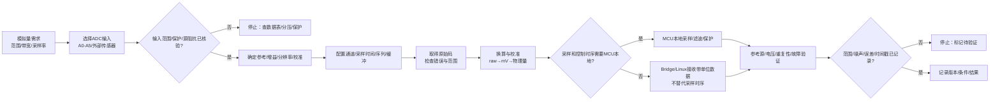

# 第3章 ADC 与模拟采样：从电压读数到可验证数据

## 学习目标

- 区分模拟输入、电压参考、分辨率、原始码、物理量和测量误差。
- 识读 Arduino UNO Q 当前板级 A0～A5 的 ADC 映射，并知道为什么仍需锁定 Core 和硬件版本。
- 理解 Arduino analogRead() 与 Zephyr adc_dt_spec、adc_sequence、adc_read_dt() 的职责边界。
- 设计 ADC 输入的电压保护、源阻抗、采样时间、滤波和异常状态检查。
- 区分 MCU 本地采样时序、数据换算、控制保护和 Linux/Bridge 的数据消费。
- 在没有开发板和仪器时完成原始码换算、资源工作表和待验证项登记。

## 本章导读

第二篇第 1 章建立了 GPIO、引脚复用和电气边界；第 2 章把时间轴引入 PWM 输出。本章转向输入：ADC（Analog-to-Digital Converter，模数转换器）把某个时刻的模拟电压转换为数字原始码，应用再根据参考电压、增益、校准和传感器模型把原始码解释为电压或物理量。

“读到了一个整数”不是完整的测量结果。一个可审查的 ADC 结论至少要回答：

1. 输入接在哪个真实引脚，是否处于 ADC 模式？
2. 输入电压有没有超出该引脚和参考电压允许的范围？
3. 使用了什么参考电压、增益、分辨率、采样时间和校准条件？
4. 原始码如何换算成毫伏或物理量，误差和滤波如何记录？
5. 采样由谁按什么时序完成，Linux/Bridge 是否只消费结果而不承担关键采样环？

本章是**第二篇第 3 章**。编号在本篇内继续递增，不承接第一篇的第 5 章，也不是全书的第 8 章。

## 背景与边界

本章覆盖：

1. ADC 从输入电压到原始码、换算值和业务量的完整链条。
2. Arduino UNO Q A0～A5 的当前板级映射与 3.3 V 模拟输入边界。
3. Arduino analogRead() 和 Zephyr ADC API 的概念对照。
4. 参考电压、分辨率、采样时间、源阻抗、滤波、过采样和校准的基本关系。
5. MCU 本地采样与 Linux/Bridge 数据消费的时序边界。

本章不覆盖：

- 所有 STM32U585 ADC 电气参数、误差表和校准寄存器的完整抄录；
- 任意传感器的具体线性化、标定曲线或计量认证；
- 高压输入、工业 4～20 mA、隔离采集或功率级的完整硬件设计；
- UNO Q 当前版本以外的固定引脚表、默认采样时间或永久分辨率承诺；
- Arduino CLI、Zephyr 原生工程编译、示波器/万用表实测或实际传感器验证。

所有电压、输入容限、参考值、通道、采样率和误差结论都必须回到目标版本的数据表、板级 overlay、Core 实现、Devicetree 和传感器资料核验。没有仪器证据时，本文使用“理想计算”“概念片段”或“待硬件验证”，不把换算值写成实测电压。

## 1. 从模拟电压到业务数据

### 1.1 ADC 的六层链条

一个 ADC 读数可以拆成六层。任何一层没有定义，最后的“温度”“压力”或“电池电压”都可能只是未经证明的数字：

| 层次 | 要回答的问题 | 典型对象 | 常见误判 |
|---|---|---|---|
| 信号层 | 输入代表什么？范围、带宽、共模和故障状态是什么？ | 传感器、分压器、运放输出 | 只看标称电压，不看最大值和异常值 |
| 电气层 | 输入是否在 ADC 引脚允许范围内？源阻抗是否合适？ | VREF+、I/O 容限、保护、地 | 把数字模式的 5 V 容忍误用于 ADC 模式 |
| 采样层 | 何时采样、采多少次、如何触发？ | 采样时间、序列、触发、缓冲 | 把循环执行频率当成 ADC 采样率 |
| 编码层 | 原始码对应什么分辨率、参考和增益？ | N 位码、ADC reference、gain | 看到 1023 就默认所有板都是 10 位 |
| 换算层 | 如何由原始码得到毫伏和物理量？ | raw→mV→校准曲线 | 用名义 3.3 V 代替真实参考和校准 |
| 证据层 | 怎样证明数值稳定、范围正确、故障可识别？ | 参考源、万用表、重复性、日志 | 用一次串口打印代替测量验证 |

### 1.2 当前 UNO Q A0～A5 的板级映射

截至本章核验的 ArduinoCore-zephyr main 分支，UNO Q 的板级 overlay 在 zephyr,user 中为逻辑 ADC 资源提供了以下映射。表中通道号、复用功能和文件内容属于当前版本证据，不是对未来 Core 版本的永久保证：

| Arduino 逻辑标识 | MCU 引脚 | 当前 overlay ADC 通道 | 数据表中列出的主要复用/说明 |
|---|---|---:|---|
| A0 / D14 | PA4 | ADC1 channel 9 | 直接 ADC；DAC0；TIM2_CH1 |
| A1 / D15 | PA5 | ADC1 channel 10 | 直接 ADC；DAC1；TIM3_CH1 |
| A2 / D16 | PA6 | ADC1 channel 11 | ADC；OPAMP2_INPUT+；TIM3_CH2 |
| A3 / D17 | PA7 | ADC1 channel 12 | ADC；OPAMP2_INPUT− |
| A4 / D18 | PC1 | ADC1 channel 2 | ADC；I2C3_SDA；LPTIM1_CH1 |
| A5 / D19 | PC0 | ADC1 channel 1 | ADC；I2C3_SCL；LPTIM1_IN1 |

这张表至少说明三个事实：

1. Arduino 逻辑名称、STM32 端口和 ADC 通道是三种不同的标识。
2. 同一个物理引脚可能有 ADC、DAC、定时器或 I2C 等备用功能，使用一个功能时需要确认其他功能没有同时占用。
3. 表格来自目标版本的板级描述，仍需结合实际板卡、Core 版本、Devicetree 构建结果和硬件测量使用。

### 1.3 UNO Q 模拟输入的电气边界

Arduino UNO Q 数据表把 A0～A5 所在的模拟输入说明为 3.3 V 模拟域，输入参考为 VREF+，有效输入范围为 0 V 到 VREF+。数据表同时强调：部分 STM32U585 引脚在数字模式下可能具备 5 V 容忍，但当配置为 ADC 或其他模拟功能时，A0～A5 不能按 5 V 容忍处理，输入不能超过 VDD + 0.3 V；A0 和 A1 的表格说明给出的绝对上限约为 3.6 V。

因此，本章采用以下默认安全规则：

- 不把 5 V 直接接到 A0～A5。
- 不把 AREF 当作普通 GPIO，也不在未确认参考电路时向其施加外部电压。
- 任何外部传感器、分压器或运放都必须与 UNO Q 的模拟地和电源关系一并核验。
- 输入保护、分压比例、器件容差和瞬态保护必须按最大输入而不是正常输入设计。
- A4/A5 若切换到 I2C3 等备用功能，必须重新确认 pinctrl、上拉和采样路径。

这里的电压限制来自当前官方数据表和板级资料；它不等于本章已经对某一块实物板的输入保护和电压进行了测量。

## 2. 分辨率、参考电压与采样条件

### 2.1 原始码和理想换算

对于理想的单端 N 位 ADC，原始码大致位于 0 到 2^N − 1。若参考电压为 VREF，理想输入电压可以近似写成：

```text
V_in ≈ raw × V_REF / (2^N − 1)
```

这个公式只表达理想比例。真实误差还包括参考电压误差、偏置、增益误差、量化噪声、噪声耦合、输入源阻抗、采样保持时间、温漂和 PCB/电源布局影响。

例如，在“10 位、VREF=3300 mV、无误差”的纸面假设下：

| 原始码 | 理想计算值 | 解释 |
|---:|---:|---|
| 0 | 0 mV | 仅表示理想下限 |
| 512 | 约 1652 mV | 中间码的理想近似 |
| 1023 | 3300 mV | 仅表示理想满量程假设 |

这些数值是计算练习，不是 UNO Q 当前 A0～A5 的测量结果。特别是“3.3 V”不能自动替代某一次采样时真实的 VREF+。

### 2.2 参考电压、增益与校准

参考电压决定 ADC 把输入范围切成多大的一段；增益可能改变有效输入范围和换算关系；校准则用已知条件修正器件和系统误差。记录 ADC 数据时，至少保存：

- ADC 控制器和通道；
- 参考类型及其毫伏值来源；
- 增益、分辨率和是否启用校准；
- 原始码、换算值和换算函数；
- 板卡、供电、温度、Core/Zephyr 版本；
- 是否使用外部分压、滤波、运放或保护器件。

Zephyr 提供从 Devicetree 描述和 ADC 配置进行原始码到毫伏换算的辅助接口，但辅助函数返回成功不等于外部参考、电阻容差、传感器误差和系统校准已经完成。Arduino API 的 analogRead() 也只负责读取逻辑模拟引脚，不负责替用户完成传感器标定。

### 2.3 采样时间、源阻抗和稳定时间

ADC 输入常包含采样保持电容。若前级源阻抗很高、分压电阻过大、滤波电容刚发生变化或多路通道快速切换，采样保持节点可能还没有稳定就开始转换，读数会出现通道相关偏差。

设计时要核对：

1. 传感器或分压器的等效源阻抗；
2. ADC 采样时间和芯片数据表建议；
3. 输入 RC 滤波的截止频率、启动稳定时间和相位/延迟；
4. 多通道扫描时每个通道的切换顺序和丢弃首样策略；
5. 采样频率是否满足信号带宽和抗混叠要求。

延长 delay() 只能改变程序等待时间，不能自动改变 ADC 采样保持时间、参考稳定性或硬件触发配置。

### 2.4 过采样和滤波不是“凭空增加精度”

多次采样求平均可能降低一部分随机噪声，但它需要输入噪声、采样独立性、带宽和时间预算满足条件。Zephyr 的 adc_sequence 也提供 oversampling 字段，但具体硬件和模式可能不支持；即使平均值更稳定，也不等于绝对精度、线性度和校准准确度自动提高。

任何滤波都会带来代价：

| 方法 | 可能收益 | 必须记录的代价 |
|---|---|---|
| 单次采样 | 延迟低、实现简单 | 对瞬时噪声敏感 |
| 多次平均 | 降低部分随机噪声 | 延迟增加，快速变化被平滑 |
| 中值滤波 | 抑制少量尖峰 | 需要缓存，响应可能变慢 |
| 一阶低通 | 可解释、计算量小 | 有相位/响应延迟 |
| MCU 本地控制滤波 | 时序可控 | 占用 MCU 时间和内存 |
| Linux 后处理 | 算法灵活 | 不适合承担严格保护闭环 |

## 3. Arduino API 与 Zephyr ADC API

### 3.1 Arduino analogRead()：逻辑引脚入口

Arduino 的 analogRead() 把 ADC 访问封装为逻辑引脚读取。通用 Arduino 参考资料说明不同板卡的默认分辨率、参考电压和可用引脚并不相同；不能把经典 UNO 的 10 位和 5 V 假设直接搬到 UNO Q。

当前 ArduinoCore-zephyr 的 wiring_analog.cpp 通过 zephyr,user 的 io-channels 和 adc-pin-gpios 建立模拟引脚映射，再调用 Zephyr ADC 的通道配置和读取接口。当前源码将 Arduino 侧读取分辨率初始为 10，并提供 analogReadResolution()；底层 ADC 分辨率、参考值和目标版本仍需继续核验。

代码说明
- 用途：展示如何读取 UNO Q 逻辑模拟引脚并输出原始码，不把原始码直接伪装成电压。
- 运行环境：Arduino UNO Q 的 Arduino/Zephyr Sketch 工作流；本片段未在本环境编译、上传或接入电压源。
- 文件位置：概念片段；本章没有新增可直接复用的 .ino 工程文件。
- 依赖：目标 Core 已启用 ADC，目标逻辑引脚存在有效的板级模拟映射，且串口输出路径已按目标环境确认。
- 操作步骤：先确认 A0 或其他目标引脚的板级映射和输入电压安全范围，再编译上传；输入端必须连接在允许范围内，不能直接接 5 V。
- 预期输出：串口周期性输出整数原始码；输出内容是程序意图，不是本次实测结果。
- 故障排查：先检查目标引脚、Core 版本、ADC 配置、串口路径和输入接线，再判断读数是否异常；悬空输入不应被当作稳定电压源。
- 验证方式：用已知且安全的参考电压和万用表对照，记录原始码、参考值、分辨率、重复性和误差；本章未执行这些硬件验证。

```cpp
const uint8_t analogPin = A0;
constexpr uint8_t READ_BITS = 10;

void setup() {
  Serial.begin(115200);
  analogReadResolution(READ_BITS);
}

void loop() {
  const int raw = analogRead(analogPin);
  Serial.println(raw);
  delay(100);
}
```

这个片段有四个边界：

1. A0 是逻辑模拟引脚，不应在没有板级资料时替换成猜测出的端口号。
2. READ_BITS=10 是一个可审查的示例设置，不是对所有 Core 版本和所有模拟模式的永久结论。
3. raw 是原始码；若要得到毫伏，必须提供参考电压、增益、校准和换算规则。
4. 悬空模拟输入的波动是输入状态问题，不是可以直接解释成传感器信号。

### 3.2 Zephyr ADC：Devicetree 资源与采样序列

Zephyr ADC API 把 ADC 控制器、通道、参考、增益和其他配置放入 adc_dt_spec 或其 Devicetree 来源，再用 adc_sequence 指定缓冲区、分辨率、过采样和采样选项。一个典型读取顺序是：

1. 确认 ADC 设备就绪；
2. 根据 Devicetree 配置通道；
3. 用 adc_sequence_init_dt() 初始化序列；
4. 准备足够大的缓冲区；
5. 执行 adc_read_dt()；
6. 按配置把原始码换算为毫伏；
7. 对负错误码、范围和质量状态进行处理。

下面的片段读取 zephyr,user 的第一个 io-channels 元素。当前 UNO Q overlay 将 A0～A5 放在这一组 io-channels 中，但该索引和节点只对目标板级描述成立；它不是任意 Zephyr 板卡都存在的别名。

代码说明
- 用途：展示 Zephyr 如何从 Devicetree 取得第一个 ADC 通道，完成配置、读取和原始码到毫伏的概念换算。
- 运行环境：原生 Zephyr ADC API 概念示例；不是本仓库已经验证的 Arduino UNO Q 原生工程。
- 文件位置：概念片段；没有新增可直接编译的 Zephyr 应用目录。
- 依赖：目标板存在 zephyr,user 节点、io-channels 属性、有效 ADC 驱动和与通道匹配的参考/增益信息。
- 操作步骤：先检查目标板 Devicetree 和 Kconfig，再确认输入电压安全、配置通道并执行读取；任何节点、参考或输入范围不确定时停止接线。
- 预期输出：函数成功时返回 0 并填入原始码和毫伏值，失败时返回负错误码；这不是本次实测输出。
- 故障排查：依次检查设备就绪、通道配置、序列缓冲区、参考/增益换算和输入接线；-ENOTSUP 等错误不能被改写成读数有效。
- 验证方式：先做 Devicetree/构建静态检查，再用已知电压和仪器核对原始码、毫伏值、重复性和误差；本章未执行这些运行验证。

```c
#include <errno.h>
#include <stddef.h>
#include <stdint.h>

#include <zephyr/devicetree.h>
#include <zephyr/drivers/adc.h>

#define ADC_NODE DT_PATH(zephyr_user)
#define ADC_SPEC ADC_DT_SPEC_GET_BY_IDX(ADC_NODE, 0)

static const struct adc_dt_spec adc = ADC_SPEC;

int read_first_channel(int16_t *raw_out, int32_t *millivolts_out)
{
  if ((raw_out == NULL) || (millivolts_out == NULL)) {
    return -EINVAL;
  }

  if (!adc_is_ready_dt(&adc)) {
    return -ENODEV;
  }

  int ret = adc_channel_setup_dt(&adc);
  if (ret < 0) {
    return ret;
  }

  struct adc_sequence sequence = {0};
  ret = adc_sequence_init_dt(&adc, &sequence);
  if (ret < 0) {
    return ret;
  }

  int16_t raw = 0;
  sequence.buffer = &raw;
  sequence.buffer_size = sizeof(raw);

  ret = adc_read_dt(&adc, &sequence);
  if (ret < 0) {
    return ret;
  }

  int32_t millivolts = raw;
  ret = adc_raw_to_millivolts_dt(&adc, &millivolts);
  if (ret < 0) {
    return ret;
  }

  *raw_out = raw;
  *millivolts_out = millivolts;
  return 0;
}
```

这个片段没有加入滤波、校准曲线和故障状态机，目的是把 ADC API 的最小职责暴露出来。adc_raw_to_millivolts_dt() 的成功依赖 Devicetree 和驱动提供足够的参考/增益信息；即使函数返回成功，外部传感器误差、分压器容差和实际参考电压仍需要单独验证。

### 3.3 两类 API 的对照

| 对照项 | Arduino analogRead() | Zephyr ADC API |
|---|---|---|
| 入口抽象 | 逻辑模拟引脚和整数原始码 | Devicetree 通道、配置和采样序列 |
| 适合的起点 | Sketch 中快速读取一个逻辑输入 | 明确控制器、通道、参考、增益、缓冲和序列 |
| 需要核验 | 模拟引脚、分辨率、参考、Core 映射和错误行为 | adc_dt_spec、通道配置、adc_sequence、缓冲区和驱动 |
| 换算责任 | 应用自行提供参考、校准和物理量模型 | 可使用 adc_raw_to_millivolts_dt()，仍需检查 DT 和外部误差 |
| 采样控制 | 由 Core 实现和 Sketch 调用路径决定 | 可表达序列、过采样、间隔和缓冲等条件 |
| 本章结论 | 简洁但不能隐藏电气和测量边界 | 资源可见性更强，但不能替代输入保护和仪器验证 |

## 4. ADC 采样决策图

下面的流程把模拟输入从需求、引脚和电气核验推进到采样、换算、实时归属和证据记录。停止节点表示资料或证据不足时的安全边界。

<a id="fig-09-uno-q-stm32-adc-measurement-boundary"></a>



> 图示占位：图号=Fig-09；位置=ADC 采样决策图之后；内容=从模拟量需求、A0～A5/外部输入选择、电气范围与保护、参考/增益/分辨率/校准、通道与采样序列、原始码换算、MCU/Linux 责任到重复性与故障验证的成功和停止路径；来源=diagrams/uno-q-stm32-adc-measurement-boundary.mmd。

可追溯的图源见 [ADC 采样决策 Mermaid 源文件](../../diagrams/uno-q-stm32-adc-measurement-boundary.mmd)。图中的 MCU 本地路径表示时序和保护的优先归属，不表示所有算法都必须在 MCU 上完成。

## 5. 输入保护与多功能引脚

### 5.1 分压器不能只按正常电压计算

当外部电压高于 ADC 允许范围时，常见方案是使用电阻分压、缓冲器或隔离/专用采集器件。理想分压关系为：

```text
V_pin = V_in × R_bottom / (R_top + R_bottom)
```

工程设计还必须加入：

- 最大输入而不是典型输入；
- 电阻容差、温漂和功耗；
- ADC 输入源阻抗与采样时间的匹配；
- 输入过压、ESD、浪涌和断线状态；
- 分压器在传感器断电或 UNO Q 断电时的反向供电路径；
- 保护元件对测量范围、漏电和响应时间的影响。

例如，不能因为分压后的标称值小于 3.3 V，就省略对瞬态、容差和 VREF+ 的核验。高压、工业现场和危险能量输入应使用适当的隔离或专用前端，不应直接接入 UNO Q A0～A5。

### 5.2 A0～A5 的备用功能必须纳入方案

当前资料显示 A0/A1 还涉及 DAC 或定时器复用，A4/A5 还涉及 I2C3。选择 ADC 后，需要确认：

1. pinctrl 是否把引脚切换到模拟功能；
2. 其他外设是否仍在驱动同一物理引脚；
3. 外部上拉、下拉、滤波电容或 Shield 是否改变输入；
4. 复位、启动和异常时引脚是否会短暂进入其他模式；
5. ADC 采样结束后是否要恢复其他外设功能。

“逻辑上叫 A4”不等于该引脚在整个程序生命周期都只做 ADC。

### 5.3 异常读数要有质量状态

采样数据除了数值，还应带有质量信息。至少考虑：

- 原始码接近 0 或满量程；
- 传感器断线、短路或超范围；
- 连续样本变化超过物理允许斜率；
- ADC 设备、通道配置或换算失败；
- 采样时间戳过期、序号跳变或 Bridge 断链；
- MCU 复位、供电异常或传感器尚未稳定。

对安全控制而言，异常值不应仅被转换成一个“看起来合理”的浮点数；应用应决定保持、降级、关闭或请求人工处理。

## 6. MCU、Linux 与 Bridge 的数据边界

### 6.1 采样时序放在信号拥有者一侧

若 ADC 用于过流保护、闭环控制、快速故障检测或固定周期采样，建议让 STM32 ADC、定时器触发、MCU 本地任务和保护路径共同承担关键时序。Linux/Bridge 可以负责配置、可视化、记录和较高层策略，但不应成为每一次关键采样的必要往返环节。

可按以下方式分配责任：

| 责任 | 更适合的执行侧 | 应记录的字段 |
|---|---|---|
| 触发采样和读取原始码 | MCU/ADC 外设 | 通道、序号、时间戳、错误码 |
| 滤波、越界和快速保护 | MCU 本地 | 阈值、状态转换、响应预算 |
| 标定和复杂模型 | MCU 或 MPU/Linux | 标定版本、输入范围、单位 |
| 展示、存储和趋势分析 | MPU/Linux | 原始码、单位、质量标志、时间 |
| 配置采样参数 | Bridge/RPC | 请求、版本、确认、超时和回滚 |

### 6.2 传给上层的不是“裸整数”

跨处理器发送 ADC 数据时，消息至少应说明：

- 通道和物理来源；
- 原始码、分辨率、参考和增益；
- 换算单位及校准版本；
- 采样时间戳和序号；
- 数据质量、越界、断线或过期状态；
- MCU 复位、配置变化和 Bridge 断链行为。

如果 Linux 只收到一个没有单位、参考和时间戳的整数，后续趋势图和模型可能会把不同版本、不同通道或不同参考条件混在一起。本章不实现 Bridge/RPC 协议，只规定数据证据边界。

## 7. 操作或实验

### 实验 A：理想原始码换算

不连接开发板，按以下假设计算三组数据：

- 分辨率 N = 10；
- VREF = 3300 mV；
- 单端输入；
- 无增益、无偏置、无噪声、无校准误差。

填写并复核：

| 原始码 | 公式 | 理想输入 |
|---:|---|---:|
| 0 | 0 × 3300 / 1023 | 0 mV |
| 512 | 512 × 3300 / 1023 | 约 1652 mV |
| 1023 | 1023 × 3300 / 1023 | 3300 mV |

操作步骤：

1. 先写出分辨率和参考假设，不直接套用 5 V。
2. 计算后保留原始码、单位和舍入方式。
3. 在结果旁标记“理想计算”，不写“测得”。
4. 再列出实际结果可能偏离的来源：VREF、增益、偏置、源阻抗、温度和噪声。

### 实验 B：ADC 输入安全工作表

为一个 A0～A5 或外部传感器输入填写以下内容：

| 项目 | 填写内容 |
|---|---|
| 信号来源 | 传感器、分压器、运放、外部基准或其他 |
| 正常/最大/故障电压 | 数值、单位、来源和容差 |
| 目标逻辑输入 | A0～A5、板级连接器和物理引脚 |
| ADC 通道 | 控制器、通道号、Devicetree/Core 映射 |
| 参考与增益 | VREF+、内部/外部参考、增益和校准 |
| 分辨率与采样率 | 位数、周期、触发方式和缓冲 |
| 源阻抗与滤波 | 等效阻抗、RC、稳定时间和滤波延迟 |
| 保护设计 | 分压、限流、钳位、隔离、ESD 和断电路径 |
| 换算模型 | raw→mV→物理量、版本和误差 |
| 异常状态 | 开路、短路、越界、过期、ADC 错误和复位 |
| MCU/Linux 责任 | 谁采样、谁保护、谁存储和谁展示 |
| 验证证据 | 万用表、参考源、原始码、重复性和温升 |
| 停止条件 | 哪些资料缺失时禁止接线或通电 |

操作步骤：

1. 先填写最大和故障电压，再选择分压和保护。
2. 核对 A0～A5 的当前板级映射以及备用功能。
3. 用目标版本的 Devicetree/Core 填通道、参考、增益和分辨率。
4. 为异常输入和 MCU/Bridge 断链定义质量状态与安全动作。
5. 所有未确认字段保留为“待核验”，不以典型值替代最大值。

### 实验 C：有硬件时的最小验证顺序

若具备 UNO Q、已核验的安全输入和测量仪器，按以下顺序执行：

1. **断电静态检查**：确认 A0～A5、地、参考、分压和保护，禁止把 5 V 接入模拟输入。
2. **版本记录**：保存板卡、Core/Zephyr、overlay、构建配置和程序版本。
3. **已知输入**：使用安全、可计算的参考电压，先测低点和中间点，再测接近但不超过上限的点。
4. **仪器对照**：用万用表或经过核验的参考源记录引脚电压，同时保存原始码和换算值。
5. **重复性**：在稳定供电和固定环境下采集多次，记录均值、范围和异常样本。
6. **动态条件**：改变输入或采样率，检查滤波延迟、别名、通道切换和缓冲区行为。
7. **故障测试**：测试开路、越界、ADC 配置失败、MCU 复位和 Bridge 断开时的质量状态与保护动作。
8. **停止条件**：任何输入超过允许范围、参考值不明、保护失效或读数与仪器明显不符时，立即停止通电并保留证据。

## 8. 验证结果

本章本次提交前可静态核验的内容包括：篇内章节编号、A0～A5 当前映射表、ADC 公式、两个 API 概念片段的代码说明字段、Fig-09 Mermaid 图源和相对链接。

本章没有宣称本环境已经取得以下结果：

- Arduino UNO Q A0～A5 的实际电压、噪声、采样率或重复性；
- 当前 Core 版本下每个模拟引脚的实际分辨率、参考和采样时间；
- Arduino analogRead() 片段的编译、上传和串口输出；
- Zephyr ADC 片段的 Devicetree 构建、原始码或毫伏结果；
- 分压器、传感器、外部参考或保护电路的电气兼容性；
- MCU 本地保护或 Linux/Bridge 数据传输的实际延迟与断链恢复。

当前环境没有开发板、ADC 仪器和完整目标工具链；本章保留文档静态检查和 Mermaid 双源一致性，未生成 SVG，也未把理想计算扩展为硬件测量结论。

## 常见问题

### ADC 原始码能直接当作电压吗？

不能。原始码必须结合分辨率、参考电压、增益和校准条件换算；外部的分压器、运放和传感器模型还会改变物理量关系。

### UNO Q 的 A0～A5 能接 5 V 吗？

不能按 5 V 容忍处理。官方数据表明确 A0～A5 在 ADC/模拟模式下不是 5 V 容忍输入，输入范围应保持在 0～VREF+，并受 VDD + 0.3 V 的绝对上限约束。

### 为什么读数不动或总是异常？

先检查引脚映射、输入是否悬空、地是否共地、参考和增益是否正确、pinctrl 是否处于模拟模式、源阻抗和采样时间是否匹配，再检查滤波和换算。不要先用软件平均掩盖电气或配置错误。

### 10 位、12 位和 16 位读数哪个更准确？

分辨率只表示编码步数，不单独决定绝对精度。参考稳定性、噪声、线性度、校准、源阻抗和 PCB 环境都可能成为更大的误差来源。

### 多次平均是否能解决所有噪声？

不能。平均主要针对满足条件的随机噪声；它不能修复过压、接线错误、系统性偏置、混叠、参考漂移或传感器断线，也会增加延迟。

### Linux 可以直接读取 ADC 并做保护吗？

Linux 可以适合做展示、存储和较高层分析，但严格采样时序和快速保护更适合留在 MCU/ADC 外设附近。跨处理器传输应携带单位、时间戳、校准和质量状态。

### A4/A5 同时用于 I2C 和 ADC 可以吗？

不能默认可以。它们存在 I2C3 备用功能；需要明确哪个时段由哪个外设控制引脚、是否有上拉和外部负载，并在目标 pinctrl/Devicetree 和硬件上验证。

## 本章小结

ADC 学习的关键不是记住一个换算公式，而是把模拟信号从输入保护、引脚复用、参考和采样条件一路追踪到原始码、毫伏、物理量和证据。当前 UNO Q 的 A0～A5 属于 3.3 V 模拟边界，必须按 VREF+ 和官方数据表约束使用，不能把数字模式的 5 V 容忍经验带进 ADC 模式。

Arduino analogRead() 适合表达逻辑读取意图；Zephyr ADC API 进一步暴露 Devicetree 通道、采样序列、缓冲和换算边界。无论选择哪一层 API，都不能替代输入保护、参考核验、仪器对照和异常状态设计。需要稳定的采样和保护时，MCU 负责时序，Linux/Bridge 消费带单位、时间戳和质量标志的数据。

## 交叉引用与延伸阅读

- 回顾 GPIO、引脚复用和 MCU/MPU 边界：[第二篇第 1 章：STM32 侧开发基础](./第1章_STM32侧开发基础_GPIO与实时边界.md)。
- 回顾 PWM、定时器通道和安全输出：[第二篇第 2 章：PWM 与定时输出](./第2章_PWM与定时输出_从占空比到安全控制.md)。
- 回顾 UNO Q 的硬件与电气边界：[第一篇第 3 章：UNO Q 的硬件架构](../第1篇_认识UNOQ/第3章_UNO_Q的硬件架构.md)。
- 返回第二篇章节地图：[第二篇：STM32](./README.md)。
- 查看 ADC 采样决策图源：[ADC 采样决策 Mermaid 源文件](../../diagrams/uno-q-stm32-adc-measurement-boundary.mmd)。
- 查阅全书来源索引：[参考资料索引](../../resources/references.md)。

## 来源与验证

本章于 2026-09-21 核验以下已登记的官方资料：

1. [Arduino UNO Q 数据表](https://docs.arduino.cc/resources/datasheets/ABX00162-ABX00173-datasheet.pdf)：核对 A0～A5 的 PA4/PA5/PA6/PA7/PC1/PC0 映射、3.3 V 模拟域、VREF+、有效输入范围和 ADC 模式下的 5 V 电气边界。
2. [ArduinoCore-zephyr UNO Q 当前板级 overlay](https://github.com/arduino/ArduinoCore-zephyr/blob/main/variants/arduino_uno_q_stm32u585xx/arduino_uno_q_stm32u585xx.overlay)：核对 adc-pin-gpios、io-channels 和 A0～A5 到 ADC1 通道的当前 main 分支描述；不把当前映射承诺为未来版本或实机测量。
3. [ArduinoCore-zephyr wiring_analog.cpp](https://github.com/arduino/ArduinoCore-zephyr/blob/main/cores/arduino/wiring_analog.cpp)：核对当前 Core 通过 Devicetree ADC 描述实现 analogRead()、分辨率设置、通道配置和 adc_read() 的代码边界。
4. [Arduino analogRead() 参考](https://github.com/arduino/reference-en/blob/master/Language/Functions/Analog%20IO/analogRead.adoc)：核对 Arduino 高层模拟读取语义和不同板卡的分辨率/电压差异；不把通用 Arduino 表格当作 UNO Q 实测。
5. [Zephyr ADC API 参考](https://docs.zephyrproject.org/latest/doxygen/html/group__adc__interface.html)：核对 adc_dt_spec、adc_channel_setup_dt()、adc_sequence_init_dt()、adc_read_dt()、参考获取和原始码换算接口。
6. [Zephyr ADC 示例索引](https://docs.zephyrproject.org/latest/samples/drivers/adc/index.html)：核对 sequence、Devicetree 和 stream 示例的职责边界；不把通用示例当作 UNO Q 原生工程验证。
7. [Zephyr adc_sequence 结构说明](https://docs.zephyrproject.org/latest/doxygen/html/structadc__sequence.html)：核对 channels、buffer、resolution、oversampling 和采样选项的含义。

本章未复制上述资料的代码、图片或大段正文。链接可访问不等于本项目取得外部材料再分发许可；代码是原创概念片段，板级映射、工具链、参考电压、ADC 波形和传感器行为仍需在目标版本与实际设备上单独验证。
