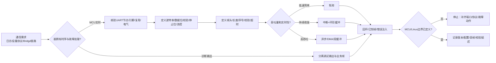

# 第4章 串口通信：从帧格式到 MCU/Linux 边界

## 学习目标

- 区分 UART 外设、逻辑串口对象、物理引脚、调试通道和应用协议。
- 理解波特率、数据位、校验位、停止位、流控和有效吞吐量之间的关系。
- 识读 Arduino UNO Q 当前 ArduinoCore-zephyr 串口资源声明，并知道为什么不能只凭 Serial 或 Serial1 的名称推断物理引脚。
- 掌握 Arduino Serial API、Zephyr 轮询/中断/异步 UART API 的职责边界。
- 设计具有帧头、长度、序号、校验、超时和错误状态的最小串口协议。
- 为 MCU、Linux/Bridge 和上层应用分配采样、收发、解析、重试、日志和安全职责。
- 在没有开发板和串口仪器时，完成吞吐量预算、协议工作表和待硬件验证项登记。

## 本章导读

前 3 章分别建立了 GPIO 的引脚边界、PWM 的时间边界和 ADC 的采样边界。本章把这些边界连接到数据流：Arduino UNO Q 的 MCU 侧可以使用多个 UART 设备，但一个叫作 Serial 的对象并不天然等于某一对排针，也不天然等于 Linux 侧的某个设备文件。串口对象、Devicetree 节点、路由器/Monitor、pinctrl 和外部线缆必须逐层核对。

串口通信也不等于打印几行文字。一个可维护的串口链路至少要回答：

1. 谁是发送者和接收者，TX/RX/GND 如何连接，电气电平是否兼容？
2. 使用哪一个 UART 控制器、哪一组 pinctrl 和哪一个 Arduino 串口对象？
3. 双方的波特率、数据位、校验位、停止位和流控是否完全一致？
4. 一次消息的边界如何确定，丢字节、插入噪声、半帧和重复帧如何处理？
5. MCU 与 Linux/Bridge 谁负责时序、缓存、重试、故障降级和安全动作？

本章是**第二篇第 4 章**。编号在本篇内继续递增，不承接第一篇的第 5 章，也不是全书的第 9 章。

## 背景与边界

本章覆盖：

1. UART 的字符帧、吞吐量和配置参数。
2. Arduino UNO Q 当前 Core/overlay 中的串口资源声明与路由边界。
3. Arduino Serial 和 Zephyr UART 三类 API 的选择条件。
4. 二进制帧、状态机、校验、超时、序号和错误质量状态。
5. MCU、Linux/Bridge 和调试终端之间的数据责任划分。
6. 纸面协议设计、回环验证和故障注入工作表。

本章不覆盖：

- RS-232、RS-485、CAN 或 USB CDC 收发器的完整硬件设计；
- 任意传感器或执行器的应用协议标准；
- UNO Q 当前版本之外的固定串口对象、默认引脚和永久路由承诺；
- Arduino CLI、Zephyr 原生工程编译、串口适配器回环和开发板实测；
- Linux 设备文件、权限、systemd 服务或网络转发的完整部署方案。

所有端口、引脚、路由、默认配置、时延和吞吐量结论都必须回到目标 Core 版本、板级 overlay、Devicetree 构建结果和实际线缆验证。没有硬件证据时，本文使用“当前源代码声明”“理想计算”或“待硬件验证”，不把概念片段写成实测结果。

## 1. 从字节流到可验证消息

### 1.1 UART 字符帧的组成

UART 是异步串行接口，发送端和接收端不共享独立时钟，而是依据约定的波特率和字符格式恢复采样时序。常见的 8N1 表示 8 个数据位、无校验、1 个停止位；在线路空闲时通常保持高电平，发送一个字符时依次出现起始位、数据位和停止位。

一个字符帧可以抽象为：

| 部分 | 作用 | 需要双方一致吗？ |
|---|---|---|
| 空闲状态 | 表示线路没有正在发送字符 | 需要结合收发器和反相设置核验 |
| 起始位 | 让接收端开始按约定时序采样 | 需要 |
| 数据位 | 承载一个字符或一个字节 | 需要位数和位序一致 |
| 校验位 | 对字符级错误提供有限检测 | 需要校验算法和极性一致 |
| 停止位 | 给接收端结束本字符并恢复空闲的时间 | 需要 |
| 流控 | 在缓存压力或硬件条件下暂停发送 | 需要硬件/软件两端协同 |

字符帧只是传输层单位，不是应用消息。接收方看到一串字节后，还必须根据协议识别消息的起点、长度、类型和完整性。把每次 read() 返回的数据块直接当作一条业务消息，是串口程序最常见的边界错误之一。

### 1.2 理想吞吐量和预算

以 8N1 为例，一个有效载荷字节通常需要 1 个起始位、8 个数据位和 1 个停止位，共 10 个线路位。因此，在不考虑流控、间隙、协议头、重传和调度延迟时，理想有效字节率约为：

有效字节率 ≈ 波特率 / 10

| 波特率 | 8N1 理想线路字节率 | 7 字节帧的理想线路时间 | 说明 |
|---:|---:|---:|---|
| 9,600 | 960 byte/s | 约 7.29 ms | 适合低速配置或诊断 |
| 115,200 | 11,520 byte/s | 约 0.61 ms | 常见的调试/控制起点 |
| 921,600 | 92,160 byte/s | 约 0.076 ms | 需要更严格的时钟、缓存和电气验证 |

表中的数值是纸面预算，不包含协议重传、任务切换、FIFO 深度、DMA 启动、线缆噪声和 Linux 调度。若一个 7 字节帧只是 2 字节业务数据，那么真正的业务有效率还要扣除帧头、序号、校验和可能的填充。

### 1.3 配置不匹配的症状

| 不匹配项 | 常见现象 | 首先检查什么 |
|---|---|---|
| 波特率 | 大量乱码、偶尔出现正确字节 | 两端实际配置和时钟源 |
| 数据位 | 高位数据异常、协议字段错位 | 7/8/9 位设置和应用数据类型 |
| 校验位 | 接收端报校验错误或丢弃字符 | 校验模式、是否真的启用 |
| 停止位 | 连续帧边界不稳定、帧错误 | 1/1.5/2 位和对端要求 |
| TX/RX 未交叉 | 完全收不到对端数据 | 发送端 TX 是否接接收端 RX |
| 未共地 | 间歇性错误、不同负载下表现变化 | GND、供电域和参考电平 |
| 缓冲区溢出 | 短报文正常，连续发送丢帧 | 接收服务速度、缓冲深度和流控 |
| 调试与业务混线 | 协议偶发校验错误 | 是否把日志写进了二进制业务端口 |

## 2. Arduino UNO Q 的串口资源边界

### 2.1 当前 overlay 中的 UART 声明

ArduinoCore-zephyr 的变体文档说明，zephyr,user 节点的 serials 属性用于声明 Arduino Serial 对象：数组中的第一个 UART 设备用于 Serial，后续设备依次用于 Serial1、Serial2 等；如果没有 serials，Core 会寻找 arduino-serial 节点，再退回到输出 printk 的 stub。这个规则描述的是对象实例化关系，不是对每块板的物理排针承诺。

截至本章核验的 ArduinoCore-zephyr main 分支，UNO Q 变体 overlay 声明了：

| 资源 | 当前源代码证据 | 可作出的结论 | 不应直接推断的内容 |
|---|---|---|---|
| USART1 | 设备状态为 okay；UNO Q Zephyr 板级 DTS 将它作为 Zephyr console | 它是启动日志/控制台核验的重要对象 | 不把控制台日志等同于任意外部 UART 排针 |
| LPUART1 | arduino,router-serial 指向 LPUART1；注释说明 Serial 由 Monitor 提供 | Monitor/路由器相关路径必须单独考虑 | 不凭 Serial 名称断言某一对物理引脚 |
| USART3 | 状态为 okay、deferred-init，pinctrl 为 TX=PB10、RX=PB11，current-speed=115200 | 它是当前变体中的一个明确 UART 资源 | 不把当前 main 的默认速度或引脚声明当作实机验证 |
| serials 数组 | usart1、lpuart1、usart3 | Core 有多个逻辑串口候选 | 不忽略 router-serial、pinctrl、启动顺序和其他外设占用 |

当前 overlay 的 digital-pin-gpios 还把 D20/D21 分别列为 PB11/PB10；这与 USART3 的 RX/TX 方向形成资源关联，但仍需要通过目标版本的 pinctrl 构建、板卡丝印和实际回环确认。前一章 ADC 的 A0～A5 映射也遵循同样原则：源文件映射是证据的一层，不替代电气和硬件验证。

### 2.2 Serial、Serial1 和调试输出

Arduino 的 Serial API 为应用提供了统一的串口对象。UNO Q 的当前变体又存在 router-serial 和 Monitor 关系，因此应把下面三件事分开记录：

1. **逻辑对象**：代码中写的是 Serial、Serial1 还是 Serial2。
2. **Core 路由**：变体的 serials、router-serial、Monitor 和 loader 如何建立对象。
3. **物理资源**：最终使用哪一个 UART 控制器、pinctrl、GPIO 复用和外部连接器。

调试日志和机器协议最好使用不同的逻辑通道。若确实只能共用一条链路，就必须把日志也纳入协议帧、定义日志类型和接收端过滤规则，不能让任意 println() 直接插入二进制帧。

### 2.3 UART 不是 RS-232 电平

UART 描述的是异步串行时序和逻辑接口，不自动等于带正负电压的 RS-232，也不自动等于差分 RS-485。接线前至少检查：

- TX 与 RX 是否交叉，GND 是否共地；
- 两端 I/O 电压域和输入容限是否兼容；
- 是否需要电平转换、收发器、终端电阻或方向控制；
- 该组引脚是否被调试、I2C、PWM、ADC 或其他复用功能占用；
- 外部 USB-UART 适配器是否会向目标板反向供电。

当资料无法确认电平或连接器定义时，停止通电，先查数据表、板卡图和适配器手册。

## 3. Arduino Serial API：把逻辑串口变成协议端点

### 3.1 begin、available、read 和 write

Arduino Serial 参考资料把 Serial.begin(speed, config) 定义为设置波特率以及数据位、校验位和停止位；默认配置为 8N1。available() 表示已经进入接收缓冲区、可以被应用读取的字节数；read() 取出下一个字节；write() 把字节或字节数组交给发送路径。它们表达的是应用意图，不会自动完成帧同步、CRC、超时或业务重试。

代码说明
- 用途：展示如何把一条 2 字节状态值封装为带帧头、版本、长度、序号和 XOR 校验的最小二进制帧，并通过 Serial1 发送。
- 运行环境：Arduino UNO Q 的 Arduino/Zephyr Sketch 工作流概念片段；本片段未在本环境编译、上传或接入外部 UART。
- 文件位置：概念片段；本章没有新增可直接复用的 .ino 工程文件。
- 依赖：目标 Core 提供 Serial1，目标变体已核验对应 UART 资源和电气连接，接收端采用完全相同的字节序和校验约定。
- 操作步骤：先锁定逻辑对象到 UART 控制器、pinctrl 和连接器，再确认两端使用 115200、8N1；最后编译、回环并记录完整帧。
- 预期输出：接收端看到以 0xA5 开始、长度为 2 的 7 字节帧；这是协议预期，不是本次实测输出。
- 故障排查：先检查 Serial1 是否对应目标物理端点，再检查 TX/RX/GND、波特率、帧长度、序号和校验；不要用乱码现象反推引脚映射。
- 验证方式：发送固定值和递增序号，记录接收帧、CRC/XOR 结果、丢帧、重复帧和端到端时间；本章未执行这些硬件验证。

```cpp
#include <Arduino.h>

constexpr uint8_t FRAME_SOF = 0xA5;
constexpr uint8_t FRAME_VERSION = 0x01;
uint8_t sequence_number = 0;

uint8_t xor8(const uint8_t *data, size_t length)
{
  uint8_t result = 0;
  for (size_t i = 0; i < length; ++i) {
    result ^= data[i];
  }
  return result;
}

void send_status(uint16_t value)
{
  uint8_t frame[7] = {
    FRAME_SOF,
    FRAME_VERSION,
    0x02,  // payload length: two bytes
    sequence_number++,
    static_cast<uint8_t>(value & 0xFF),
    static_cast<uint8_t>((value >> 8) & 0xFF),
    0x00
  };

  frame[6] = xor8(frame, 6);
  Serial1.write(frame, sizeof(frame));
}

void setup()
{
  Serial.begin(115200, SERIAL_8N1);   // human/debug path: verify routing
  Serial1.begin(115200, SERIAL_8N1);  // machine/data path: verify pin mapping
}

void loop()
{
  send_status(1234);
  delay(100);
}
```

这个片段把协议字段固定下来，但仍有几个必须由接收端共同确认的条件：

1. 长度字段表示 payload 长度，不包括帧头、版本、长度、序号和校验。
2. 16 位数值采用低字节在前的 little-endian 顺序。
3. XOR 只提供轻量错误检测，不等价于 CRC16，也不能识别所有多位错误。
4. sequence_number 溢出后从 255 回到 0，接收端必须使用模 256 的序号差判断丢帧。
5. Serial 和 Serial1 的实际路由必须以目标 Core 和板级资源核验为准。

### 3.2 接收缓冲不是消息队列

available() 返回的数量可能是半帧、多个帧或噪声后的残余字节。应用层应持续读取字节并交给状态机，而不是假设一次 loop() 恰好得到一条消息。对于人机调试，可使用换行分隔的文本；对于 MCU 到 Bridge 的机器链路，建议使用明确长度和校验的二进制帧。

## 4. Zephyr UART API：从设备节点到收发策略

### 4.1 设备节点和就绪状态

Zephyr UART 文档把 UART 访问分为轮询、中断驱动和异步 API。应用首先要从 Devicetree 获得设备，再检查设备是否 ready；不能只因为设备节点存在，就假设引脚、时钟、pinctrl 或驱动已经适合当前业务。

下面片段使用当前 UNO Q 变体中可见的 usart3 节点演示非阻塞轮询读取。DT_NODELABEL(usart3) 依赖目标构建中的节点标签；换到其他板卡或改用 serials 抽象时，需要重新核对。

代码说明
- 用途：展示 Zephyr 如何取得 UART 设备、检查就绪状态，并把当前已经到达的字节取入应用缓冲区。
- 运行环境：原生 Zephyr UART API 概念示例；不是本仓库已经验证的 Arduino UNO Q 原生工程。
- 文件位置：概念片段；没有新增可直接编译的 Zephyr 应用目录。
- 依赖：目标 Devicetree 存在 usart3 标签、UART 驱动已启用、pinctrl 和时钟配置有效，且未由其他互斥 API 占用。
- 操作步骤：先确认节点、Kconfig、pinctrl 和线路，再周期性调用 drain_uart_polling()；生产代码还需接入帧状态机和溢出策略。
- 预期输出：函数返回本次取出的字节数；没有数据时返回 0，错误时返回负 errno；这不是本次实测结果。
- 故障排查：区分“设备未 ready”“没有新字节”“轮询 API 被异步接收占用”和“线路配置错误”，不要把所有非零结果都当作乱码。
- 验证方式：先完成 Devicetree/构建静态检查，再做 TX/RX 回环、错误注入和连续发送测试；本章未执行这些运行验证。

```c
#include <errno.h>
#include <stddef.h>
#include <stdint.h>

#include <zephyr/device.h>
#include <zephyr/devicetree.h>
#include <zephyr/drivers/uart.h>

#define UART_NODE DT_NODELABEL(usart3)

static const struct device *const uart = DEVICE_DT_GET(UART_NODE);

int drain_uart_polling(uint8_t *dst, size_t capacity)
{
  if ((dst == NULL) || (capacity == 0U)) {
    return -EINVAL;
  }

  if (!device_is_ready(uart)) {
    return -ENODEV;
  }

  size_t count = 0U;
  while (count < capacity) {
    unsigned char byte;
    int ret = uart_poll_in(uart, &byte);

    if (ret == -1) {
      break;  // non-blocking: no byte is currently available
    }
    if (ret < 0) {
      return ret;
    }
    dst[count++] = (uint8_t)byte;
  }

  return (int)count;
}
```

uart_poll_in() 没有数据时返回 -1，是非阻塞读取；uart_poll_out() 则可能在发送器忙时阻塞当前线程。若应用需要在后台持续收发，应把轮询改为中断或异步模式，并重新设计缓冲区和线程通信，不能只把函数名替换掉。

### 4.2 三类 API 的选择

| Zephyr 方式 | 典型入口 | 优点 | 主要风险/边界 |
|---|---|---|---|
| 轮询 | uart_poll_in、uart_poll_out | 代码简单，适合低速诊断和初始化 | 发送可能阻塞；循环轮询会占用 CPU；容易漏掉连续数据 |
| 中断驱动 | uart_irq_callback_user_data_set、uart_fifo_read、uart_fifo_fill | 接收可在后台进行，适合环形缓冲和持续字节流 | ISR 只能做短操作；需要明确 FIFO、线程和溢出交接 |
| 异步/DMA | uart_callback_set、uart_rx_enable、uart_rx_buf_rsp、uart_tx | 可使用缓冲切换和 DMA，适合持续或高吞吐传输 | 事件状态复杂；必须管理 buffer 生命周期、超时和停止原因 |

Zephyr 官方文档特别强调，同一个 UART 外设不要同时启用中断驱动 API 和异步 API；两套回调/中断所有权会互相干扰。API 选择应先由吞吐量、响应时间、内存和故障策略决定，再配置 Kconfig 与 Devicetree。

### 4.3 缓冲区和中断上下文

中断回调不应执行 CRC 全包计算、阻塞等待、日志打印或复杂协议分发。常见边界是：

1. ISR/回调只把字节或已完成的缓冲块放入 ring buffer 或消息队列。
2. 线程上下文完成帧同步、长度检查、CRC、序号检查和业务分发。
3. 缓冲区满时明确策略：丢弃新数据、丢弃旧遥测、拒绝命令，或触发流控。
4. 每种丢弃都留下计数器和质量状态，不能静默覆盖。

## 5. 设计一个可恢复的串口帧

### 5.1 最小帧格式

本书后续 MCU/Linux Bridge 示例可以从下面的格式开始，但它不是行业标准，也不是 UNO Q 固定协议：

| 字段 | 长度 | 约定 | 作用 |
|---|---:|---|---|
| SOF | 1 | 0xA5 | 标记候选帧起点 |
| VERSION | 1 | 当前为 0x01 | 允许协议演进 |
| LENGTH | 1 或 2 | 只表示 payload 字节数 | 确定后续读取长度 |
| TYPE | 1 | 消息类型 | 区分遥测、命令、响应、错误 |
| SEQUENCE | 1 或 2 | 发送方递增 | 识别丢失、重复和乱序 |
| PAYLOAD | LENGTH | 按 TYPE 定义 | 承载业务数据 |
| CHECK | 1/2/4 | XOR、CRC8、CRC16 或更强算法 | 检测传输错误 |

真实协议还要写清楚：多字节字段的字节序、LENGTH 是否包括 TYPE、校验覆盖范围、SOF 出现在 payload 中时是否转义、最大帧长、超时起算点和未知 VERSION/TYPE 的处理方式。

### 5.2 接收状态机

接收端可使用以下状态：

1. WAIT_SOF：丢弃不属于帧起点的字节。
2. READ_HEADER：收集版本、长度、类型和序号，先检查长度上限。
3. READ_PAYLOAD：按长度收集 payload；超时则回到 WAIT_SOF。
4. READ_CHECK：收集完整校验字段。
5. VALIDATE：检查版本、长度、校验和序号。
6. DISPATCH：把合法帧交给对应业务队列。
7. RESET：任何错误都清理当前状态；必要时把尾部字节重新作为候选 SOF。

状态机必须有最大帧长度和最大接收等待时间。否则一枚伪造的长度字节、断开的线缆或永久噪声就能让接收任务一直占用缓冲区。

### 5.3 错误和重试

| 错误 | 接收端动作 | 是否可以自动重试 |
|---|---|---|
| 帧头错误 | 丢弃并寻找下一个 SOF | 通常不需要发送端重试 |
| 长度越界 | 丢弃当前帧并记数 | 需要根据消息类型决定 |
| 校验失败 | 丢弃 payload，记录错误 | 命令/响应可请求重发，遥测可丢弃 |
| 序号跳变 | 记录丢帧数量和最新序号 | 需要协议定义是否补发 |
| 重复序号 | 幂等命令可确认，不可重复执行的命令要拒绝 | 不应盲目重试 |
| 接收超时 | 回到 WAIT_SOF，更新 link_timeout | 可发起链路恢复 |
| 缓冲区溢出 | 进入明确降级状态 | 不应静默覆盖并继续宣称可靠 |

命令重试必须带序号或事务 ID，并由接收端定义幂等规则。否则“超时后自动重发”可能让执行器动作发生两次。

## 6. 串口通信决策图

下面的流程把串口需求从端口和电气核验，推进到协议、API、缓冲、故障和 MCU/Linux 责任记录。停止节点表示资源或证据不足时不应继续接线或放行。

<a id="fig-10-uno-q-stm32-uart-boundary"></a>



> 图示占位：图号=Fig-10；位置=串口通信决策图之后；内容=从通信需求、UART 资源和电气核验、帧格式、API 选择、缓冲策略到回环/错误验证及 MCU/Linux 边界的成功和停止路径；来源=diagrams/uno-q-stm32-uart-boundary.mmd。

可追溯的图源见 [串口通信边界 Mermaid 源文件](../../diagrams/uno-q-stm32-uart-boundary.mmd)。图中的 MCU 实时路径表示时序和故障处理的优先归属，不表示所有协议解析都必须在 MCU 完成。

## 7. MCU、Linux 和 Bridge 的数据边界

### 7.1 谁负责什么

| 责任 | MCU 侧 | Linux/Bridge 侧 |
|---|---|---|
| 引脚和 UART 配置 | 负责 UART 节点、pinctrl、时钟和电气启动状态 | 不能替代 MCU 的引脚复用配置 |
| 字节接收 | 负责 FIFO、ISR/DMA、ring buffer 和溢出计数 | 负责接收 MCU 已交付的帧或字符流 |
| 帧完整性 | 负责长度、校验、超时和最小安全状态 | 可以再次校验，但不能假设 MCU 已经做过 |
| 严格时序 | 负责采样触发、快速保护和执行器截止 | 不应把 Linux 调度延迟放进硬实时闭环 |
| 数据转换 | 负责与保护直接相关的最小转换 | 负责展示、存储、协议适配和较高层分析 |
| 重试与确认 | 负责实时命令的序号、幂等和安全拒绝 | 负责连接重建、持久化和用户可见诊断 |
| 故障降级 | 进入已定义的安全输出/停止状态 | 标记链路失效并通知上层，不伪造正常值 |

如果 Bridge 通过某个 UART 把 MCU 数据转给 Linux，Bridge 是一个传输和协议边界，不是“让两边共享内存”。每次跨边界传输都应明确数据所有权、缓存生命周期、版本、时间戳、质量状态和失败后的动作。

### 7.2 推荐的上层消息元数据

不要只向 Linux 发送一个裸整数或一串未标记文本。至少应有：

| 元数据 | 作用 |
|---|---|
| protocol_version | 识别兼容范围 |
| message_type | 区分遥测、命令、响应和错误 |
| sequence | 检查丢失、重复和乱序 |
| source_timestamp | 说明采集或生成时刻 |
| payload_length | 防止按错边界解析 |
| quality/status | 区分有效、过期、校验失败、传感器故障 |
| error_code | 让上层知道失败发生在哪里 |
| retry/transaction ID | 防止命令重试造成重复动作 |

时间戳要说明时钟来源和单位。MCU tick、Linux monotonic clock 和墙上时间不能未经转换直接比较。

### 7.3 背压和断链

当 Linux 处理速度低于 MCU 产生速度时，必须提前定义：

- 遥测是否允许丢旧数据，只保留最新值；
- 命令是否必须逐条确认，确认超时是否安全拒绝；
- 链路恢复后是否发送当前状态快照，而不是补发所有过期遥测；
- 发送队列满时是否阻塞控制任务；
- 断链期间执行器保持、减速或停止的策略。

对控制系统而言，可靠性不是“尽量把所有字节发出去”，而是“在无法可靠传输时进入已验证的安全状态”。

## 8. 操作或实验

### 实验 A：纸面帧和吞吐预算

选择 115200、8N1、7 字节帧，填写：

| 项目 | 结果 |
|---|---|
| 每帧线路位数 | 7 × 10 = 70 bit |
| 理想单帧时间 | 70 / 115200 s，约 0.61 ms |
| 每秒理论帧数 | 115200 / 70，约 1645 帧/s |
| 实际预算 | 扣除任务调度、帧间空隙、重试、流控和处理时间 |
| 可接受最大延迟 | 由业务安全要求填写，不从波特率反推 |
| 丢帧处理 | 由 sequence 和消息类型分别定义 |

把 payload 从 2 字节改成 32、128 和 512 字节，重新计算帧时间和缓存需求。若结果超过 ring buffer、任务周期或安全时限，先改变协议和调度设计，不要只提高波特率。

### 实验 B：串口资源工作表

在接线前填写以下表格：

| 项目 | 记录内容 |
|---|---|
| Arduino 对象 | Serial / Serial1 / Serial2 |
| Zephyr 节点 | usart1 / lpuart1 / usart3 或目标版本实际节点 |
| 当前来源 | Core 版本、overlay、Devicetree 构建摘要 |
| TX/RX 引脚 | 控制器 pinctrl 和板卡连接器编号 |
| 电气条件 | I/O 电压、GND、适配器供电方式、流控线 |
| 参数 | baud、data bits、parity、stop bits、flow control |
| 协议 | SOF、长度、字节序、校验、超时、最大帧长 |
| 故障动作 | 超时、校验失败、缓冲满、断链时的动作 |
| 证据 | 终端设置、原始帧、计数器、时间戳、照片或日志 |

任何一项不能填写时，状态标记为待核验，不直接通电。

### 实验 C：最小硬件回环和错误注入

有开发板和仪器时，按以下顺序执行：

1. 使用与目标 I/O 电压兼容的 USB-UART 适配器，TX/RX 交叉并共地；不要把 RS-232 电平线直接接入 MCU UART。
2. 先只发送固定帧，不接执行器和高能负载；确认接收端能看到完整 SOF、长度、序号和校验。
3. 逐项改变波特率、校验和停止位，记录乱码、帧错和校验错的差异。
4. 截断帧、插入噪声、伪造长度、跳过序号、重复命令，检查状态机是否回到可恢复状态。
5. 连续发送直到缓冲接近上限，确认溢出计数器、背压和安全降级动作。
6. 断开 Linux/Bridge 或拔出适配器，观察 MCU 是否在规定时间内进入已定义状态。

## 9. 验证结果

本章本次提交前可静态核验的内容包括：第二篇篇内第 4 章编号、UNO Q 当前串口资源表、Arduino 和 Zephyr 概念片段的代码说明字段、Fig-10 Mermaid 图源、图示登记、外部来源登记和相对 Markdown 链接。

本章没有宣称本环境已经取得以下结果：

- Arduino UNO Q 的 Serial、Serial1、Serial2 与物理排针之间的实际回环结果；
- USART1、LPUART1 或 USART3 在目标 Core 版本下的实际对象路由；
- 115200 或其他波特率下的实测误码率、吞吐量、时延和丢帧率；
- Arduino 片段或 Zephyr 片段的编译、上传、Devicetree 构建和串口输出；
- USB-UART 适配器、外部收发器、流控线和目标 I/O 电平的电气兼容性；
- Linux/Bridge 断链、重连、重试或执行器安全动作的现场结果。

当前环境没有开发板、串口仪器和完整目标工具链；本章保留文档静态检查和 Mermaid 双源一致性，未生成 SVG，也未把理想吞吐量扩展为硬件测量结论。

## 常见问题

### Serial 和 Serial1 哪一个一定是排针 UART？

没有“一定”。Core 的 serials 声明决定对象实例化顺序，router-serial 和 Monitor 还可能参与 Serial 的输出路径；物理排针要回到当前 overlay、pinctrl、板卡文档和回环验证。

### 为什么 Serial.println() 会破坏二进制协议？

println() 会发送文本字符和换行。如果它与机器帧共用同一条线路，接收端会把这些字符当作协议字节，除非协议明确把日志作为一种帧类型并正确解析。

### 轮询 API 能不能一直用？

低速、短事务和初始化阶段可以。持续接收或严格时序场景需要比较轮询占用、任务周期、FIFO 深度和丢帧风险，再选择中断或异步 API。

### UART 的波特率越高越好吗？

不是。更高波特率减少线路时间，但提高时钟误差、信号完整性、缓冲和调度要求；如果协议、线缆、电平或故障策略不可靠，提高速度只会更快地产生错误。

### 校验失败后是否应该自动重发？

取决于消息类型。遥测通常可以丢弃并等待下一帧；命令必须结合 sequence/transaction ID 和幂等规则，避免把一次动作执行两次。

### Linux 能不能负责串口的全部实时逻辑？

Linux 适合做配置、存储、展示、协议适配和较高层重试；严格的接收时序、快速保护和执行器安全状态更适合留在 MCU/外设附近。跨处理器边界必须传递质量和时间信息。

## 本章小结

串口开发的第一步不是调用 Serial.begin()，而是建立从逻辑对象、Core 路由、UART 控制器、pinctrl、物理引脚到电气电平的证据链。当前 UNO Q overlay 声明了多路 UART 和 router-serial，Serial 名称本身不足以证明某一对排针的物理连接。

UART 的字符帧只负责把字节送到对端；可靠的业务通信还需要帧头、长度、版本、类型、序号、校验、超时、缓冲和错误恢复。Arduino API 适合表达逻辑收发意图，Zephyr API 则把轮询、中断和异步/DMA 的时序成本显式暴露出来。

MCU 负责确定性收发、帧完整性、快速保护和安全降级，Linux/Bridge 负责较高层的存储、展示、协议适配和连接管理。任何跨边界消息都应携带版本、序号、时间戳、质量状态和错误信息，而不是只传递一个裸字节或裸整数。

## 交叉引用与延伸阅读

- 回顾 GPIO、引脚复用和 MCU/MPU 边界：[第二篇第 1 章：STM32 侧开发基础](./第1章_STM32侧开发基础_GPIO与实时边界.md)。
- 回顾 PWM、定时器通道和安全输出：[第二篇第 2 章：PWM 与定时输出](./第2章_PWM与定时输出_从占空比到安全控制.md)。
- 回顾 ADC、采样序列和输入保护：[第二篇第 3 章：ADC 与模拟采样](./第3章_ADC与模拟采样_从电压读数到可验证数据.md)。
- 回顾 UNO Q 的硬件与电气边界：[第一篇第 3 章：UNO Q 的硬件架构](../第1篇_认识UNOQ/第3章_UNO_Q的硬件架构.md)。
- 返回第二篇章节地图：[第二篇：STM32](./README.md)。
- 查看串口通信决策图源：[串口通信边界 Mermaid 源文件](../../diagrams/uno-q-stm32-uart-boundary.mmd)。
- 查阅全书来源索引：[参考资料索引](../../resources/references.md)。

## 来源与验证

本章于 2026-09-21 核验以下已登记的官方资料：

1. [Arduino Serial.begin() 参考](https://github.com/arduino/reference-en/blob/master/Language/Functions/Communication/Serial/begin.adoc)：核对波特率、数据位、校验位、停止位和默认 8N1 的通用语义；不把通用 Arduino 参考当作 UNO Q 实测。
2. [Arduino Serial.available() 参考](https://github.com/arduino/reference-en/blob/master/Language/Functions/Communication/Serial/available.adoc)：核对接收缓冲区字节可用数量和 read() 配合方式；不把通用缓冲大小承诺为 UNO Q Core 的固定值。
3. [ArduinoCore-zephyr 变体配置说明](https://github.com/arduino/ArduinoCore-zephyr/blob/main/documentation/variants.md)：核对 serials 属性与 Serial、Serial1 等对象实例化的通用规则。
4. [ArduinoCore-zephyr UNO Q 当前 overlay](https://github.com/arduino/ArduinoCore-zephyr/blob/main/variants/arduino_uno_q_stm32u585xx/arduino_uno_q_stm32u585xx.overlay)：核对 router-serial、serials、USART3 pinctrl、D20/D21 和当前 UART 资源声明；不把 main 分支声明当作实机回环结果。
5. [Zephyr UNO Q 板级 DTS](https://github.com/zephyrproject-rtos/zephyr/blob/main/boards/arduino/uno_q/arduino_uno_q.dts)：核对 UNO Q Zephyr console 的板级来源；不把 console 设备文件等同于任意物理 UART 排针。
6. [ArduinoCore-API HardwareSerial 接口](https://github.com/arduino/ArduinoCore-API/blob/master/api/HardwareSerial.h)：核对 HardwareSerial 的 begin、available、read、flush 和 write 抽象，以及串口配置常量。
7. [Zephyr UART 外设文档](https://docs.zephyrproject.org/latest/hardware/peripherals/uart.html)：核对轮询、中断驱动和异步/DMA 三类 API 及不能在同一外设上混用中断与异步回调的边界。
8. [Zephyr 轮询 UART API](https://docs.zephyrproject.org/latest/doxygen/html/group__uart__polling.html)：核对 uart_poll_in() 的非阻塞语义、uart_poll_out() 的阻塞语义和错误边界。
9. [Zephyr 中断 UART API](https://docs.zephyrproject.org/latest/doxygen/html/group__uart__interrupt.html)：核对回调、FIFO、收发中断和错误中断的接口边界。
10. [Zephyr 异步 UART API](https://docs.zephyrproject.org/latest/doxygen/html/group__uart__async.html)：核对 uart_rx_enable、缓冲请求/释放、UART_RX_RDY、UART_TX_DONE 和 UART_TX_ABORTED 等事件。
11. [Zephyr UART 示例索引](https://docs.zephyrproject.org/latest/samples/drivers/uart/README.html)：核对 echo、passthrough、TTY 和异步示例的职责边界；不把通用示例当作 UNO Q 原生工程验证。

本章未复制上述资料的代码、图片或大段正文。链接可访问不等于本项目取得外部材料再分发许可；代码是原创概念片段，端口路由、波形、电气兼容性、丢帧率和 Linux/Bridge 行为仍需在目标版本与实际设备上单独验证。
