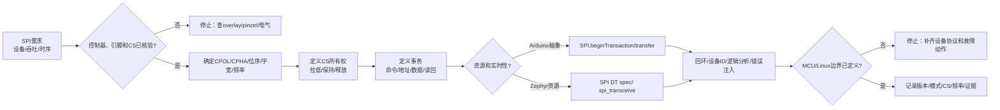

# 第5章 SPI 通信：从片选时序到设备驱动边界

## 学习目标

- 识别串行外设接口（Serial Peripheral Interface，SPI）的时钟、数据和片选信号，并理解全双工传输。
- 用时钟极性（Clock Polarity，CPOL）和时钟相位（Clock Phase，CPHA）解释 SPI mode 0～3，而不是凭经验试参数。
- 区分总线控制器、外设设备和片选线，知道一个 SPI 控制器可以连接多个外设，但每次事务通常只选择一个目标。
- 识读 Arduino UNO Q 当前 ArduinoCore-zephyr 变体中 SPI 控制器声明、延迟初始化和设备节点的证据边界。
- 掌握 Arduino SPI 事务 API 与 Zephyr SPI/Devicetree API 的职责差异。
- 设计命令、地址、数据、读回和片选保持关系明确的 SPI 事务。
- 把 SPI 总线所有权、严格时序、设备协议和 MCU/Linux Bridge 边界写入可验证的工作表。
- 在没有开发板和逻辑分析仪时完成纸面时序、吞吐量和故障注入设计，不把概念代码写成实机结论。

## 本章导读

前 4 章分别建立了 GPIO 的引脚边界、PWM 的时间边界、ADC 的采样边界和 UART 的字节流边界。本章继续处理一种更容易被“短代码”掩盖的硬件接口：SPI。调用一次 transfer() 只能说明程序请求了若干时钟，不代表目标器件看到了正确的 mode、片选、命令和地址。

SPI 常被概括为 SCK、MOSI、MISO 和 CS 四根线，但可维护的 SPI 设计至少要回答：

1. 谁产生时钟，谁是总线控制器，目标设备何时被片选？
2. 数据在 SCK 的哪一个边沿采样，空闲电平是什么，位序和数据字宽是什么？
3. 命令、地址和数据之间是否允许 CS 保持有效，是否需要连续时钟？
4. 当前 Arduino 对象、Zephyr 控制器、pinctrl、CS GPIO 和外部连接器是否已经逐层核验？
5. 事务失败时，MCU、Linux/Bridge 和上层应用分别如何停止、重试、报告和恢复？

本章是**第二篇第 5 章**。编号在本篇内继续递增，不承接第一篇的第 5 章，也不是全书的第 10 章。

## 背景与边界

本章覆盖：

1. SPI 信号、全双工传输、mode 0～3、位序和数据字宽。
2. Arduino UNO Q 当前 ArduinoCore-zephyr main 分支中与 SPI 相关的变体声明。
3. Arduino SPISettings、beginTransaction、transfer 和片选控制的概念边界。
4. Zephyr spi_dt_spec、Devicetree CS、spi_buf、spi_transceive_dt 和操作标志。
5. 片选保持、总线锁、多个外设共享总线和事务协议。
6. MCU、Linux/Bridge 与 SPI 外设驱动之间的所有权和故障边界。
7. 纸面时序、设备 ID、错误 mode、CS 抖动和总线占用验证工作表。

本章不覆盖：

- 具体传感器、Flash、显示器或 ADC 芯片的数据手册命令集；
- UNO Q 当前版本之外的固定 SPI 排针、默认 CS 引脚或永久路由承诺；
- QSPI、OSPI、MSPI、DMA 调优和高速信号完整性的完整硬件设计；
- Arduino CLI、Zephyr 原生工程编译、逻辑分析仪采样和开发板实测；
- Linux 内核 spidev、设备树编译部署或用户空间服务的完整教程。

SPI 的电气电平、最大时钟、CS 建立/保持时间和引脚复用必须回到目标外设数据手册、UNO Q 板级资料、目标 Core 版本、Devicetree 构建结果和实际连接核验。没有硬件证据时，本文使用“当前源代码声明”“概念片段”或“待硬件验证”，不把波形和引脚推测写成已验证事实。

## 1. 从四根信号线到一次完整事务

### 1.1 信号名称与角色

SPI 是同步串行总线。通常由一个总线控制器产生串行时钟（Serial Clock，SCK），并通过数据输出、数据输入和片选信号与一个或多个外设通信。传统资料常写 MOSI（Master Out, Slave In）和 MISO（Master In, Slave Out）；Zephyr 当前文档采用更具包容性的 controller/peripheral 以及从设备自身视角命名的 SDO/SDI，同时保留旧名称作为兼容别名。本章在面向接线的地方使用 COPI/CIPO 解释方向，在引用现有 Arduino/芯片资料时保留 MOSI/MISO。

| 信号 | 常见旧名称 | 从控制器视角的作用 | 从外设视角的作用 |
|---|---|---|---|
| SCK | SCLK | 输出时钟，决定移位和采样节奏 | 输入时钟 |
| COPI | MOSI | Controller Out, Peripheral In，输出命令/地址/数据 | 接收数据 |
| CIPO | MISO | Controller In, Peripheral Out，接收状态/数据 | 输出数据 |
| CS | SS、NSS | 选择目标外设，常见为低有效 | 被选中时响应 |

CS 不是“可有可无的第四根线”。在共享总线上，SCK、COPI 和 CIPO 可以被多个设备共用，而每个设备需要独立的 CS。未被选中的外设必须让 CIPO 处于高阻或符合其数据手册规定的非驱动状态；如果两个外设同时驱动 CIPO，读回数据可能冲突，甚至造成电气风险。

### 1.2 全双工与时钟预算

SPI 通常是全双工接口：控制器每发送一个数据位，同时从 CIPO 采集一个数据位。因此，写入和读取并不是两个彼此独立的“包”，而是同一段时钟窗口里的两个方向。一个只读命令也往往需要控制器发送 dummy byte，才能为外设提供读回所需的时钟。

一次事务可以抽象为：

1. CS 从非有效状态变为有效，满足设备要求的建立时间。
2. 控制器配置 SCK 频率、CPOL、CPHA、位序和数据字宽。
3. 发送命令、地址或 dummy 数据，同时采集对应的 CIPO 位。
4. 按数据手册要求连续发送或读取若干字节。
5. 发送最后一个时钟后满足保持时间，再释放 CS。
6. 检查返回数据、状态位、超时和设备错误，并记录事务结果。

理想情况下，传输 N 个 8 位字节的 SCK 时间为：

$$
T_{clock} = \frac{8N}{f_{SCK}}
$$

这只是线上的时钟时间，不含 CS 建立和保持时间、控制器启动、任务调度、总线仲裁、DMA 准备和设备内部处理时间。若一个设备要求“写命令后等待内部完成”，等待时间不能被简单地从提高 SCK 频率中消除。

### 1.3 CPOL、CPHA 与 mode 0～3

CPOL 定义 SCK 在空闲时的电平；CPHA 定义一个数据位在第一个还是第二个有效边沿被采样。把二者组合成 mode，是连接 SPI 设备前应从数据手册读取的第一组参数。

| SPI mode | CPOL | CPHA | SCK 空闲电平 | 采样边沿 | 数据变化边沿 |
|---:|---:|---:|---|---|---|
| 0 | 0 | 0 | 低 | 第一个边沿：上升 | 第二个边沿：下降 |
| 1 | 0 | 1 | 低 | 第二个边沿：下降 | 第一个边沿：上升 |
| 2 | 1 | 0 | 高 | 第一个边沿：下降 | 第二个边沿：上升 |
| 3 | 1 | 1 | 高 | 第二个边沿：上升 | 第一个边沿：下降 |

表格中的“第一个/第二个边沿”以一次 CS 有效后的时钟开始为基准。实际设备还可能规定 CS 有效前的最小时间、CS 释放后的恢复时间、字节间隙、半双工方向切换或特定的首位行为。只改 SPI_MODE0 为 SPI_MODE3 并观察读数“看起来像对了”，不能替代对数据手册时序图的核对。

### 1.4 字节流不等于设备协议

SPI 控制器只负责在总线上产生时钟和移动位；它通常不知道某个设备的寄存器地址、读写位、忙标志、CRC、页边界、写入保护。设备协议至少应记录：

| 协议字段 | 需要回答的问题 |
|---|---|
| 命令 | 哪个值表示读取、写入、状态查询或复位？ |
| 地址 | 地址是 8 位、16 位还是更宽？高字节先发还是低字节先发？ |
| 数据 | 一次事务的有效数据长度和字节序是什么？ |
| 读写方向 | 读命令后需要多少 dummy clock，CIPO 从第几个字节开始有效？ |
| CS 边界 | 命令、地址和数据之间能否释放 CS？ |
| 完成条件 | 返回值、状态寄存器、忙线、超时和错误码如何定义？ |

如果这些问题没有答案，先停在协议工作表，不要把连续 transfer() 调用当作已经完成的设备驱动。

## 2. Arduino UNO Q 的 SPI 资源边界

### 2.1 当前变体声明能证明什么

截至 2026-09-21 核验的 ArduinoCore-zephyr main 分支，Arduino UNO Q 的 STM32U585 变体 overlay 在 zephyr,user 节点中声明：

| 当前源代码项 | 看到的内容 | 可以作出的结论 | 仍需核验的内容 |
|---|---|---|---|
| spis | spi2、spi3 | Arduino Core 有两个 SPI 控制器候选入口 | Arduino 对象、具体 pinctrl、CS 和连接器如何对应 |
| spi2 | zephyr,deferred-init | 该控制器被纳入延迟初始化策略 | 目标 Sketch 何时初始化、使用哪组复用引脚和时钟 |
| spi3 | zephyr,deferred-init | 该控制器也被纳入延迟初始化策略 | 目标应用是否使用 controller 还是 peripheral 角色 |
| spi3 的 device0 | device@0，compatible 为 zephyr,spi-slave，reg 为 0 | overlay 中存在一个 SPI 外设节点示例 | 该节点与应用目标设备、CS 线路和最终构建配置的关系 |
| digital-pin-gpios | 包含 D20/PB11、D21/PB10 及一组标注为 JSPI 的 GPIO | 当前映射包含这些数字/扩展资源描述 | 不能仅凭 GPIO 列表推断 SCK、COPI、CIPO、CS 的物理连接 |

这里的“候选入口”不是“已验证可用的 Arduino SPI 排针”。spis 说明了 Core 配置层可以引用哪些 SPI 控制器；延迟初始化说明了设备生命周期策略；设备节点说明了 Devicetree 中存在的角色描述。真正的可用路径还要把控制器、pinctrl、CS、时钟、电气域、板级连接和目标外设数据手册串起来。

### 2.2 不要从数字引脚号码猜 SPI

Arduino 参考页会列出部分传统板卡的默认 SPI 引脚，但不同板卡的引脚映射不同，Arduino UNO Q 的当前 Core 也不能用经典 UNO R3 的 10/11/12/13 规则替代。尤其是：

- 数字引脚编号描述 Arduino 逻辑映射，不必然描述 STM32 复用功能；
- digital-pin-gpios 描述 GPIO 资源，不等于某个 SPI 控制器已经启用对应 pinctrl；
- CS 可以由控制器硬件、Devicetree cs-gpios 或应用 GPIO 控制，三者的证据路径不同；
- 同一 GPIO 可能同时出现在其他外设复用、扩展连接器或调试路径中；
- spis 数组顺序是 Core 资源声明的一层，不能单独证明 SPI 对象的物理端点。

接线前应形成下面的资源链：

Arduino SPI 对象 → Core 资源声明 → Zephyr SPI 节点 → pinctrl/时钟 → CS GPIO → 板级连接器 → 外设数据手册

其中任何一环缺失，都把状态标记为“待核验”。不要通过读回一个偶尔变化的数值来反推接线正确，因为错误 mode、浮空 CIPO、CS 竞争和未初始化外设都可能产生看似有意义的字节。

### 2.3 当前 overlay 的安全解读

当前 overlay 的 spi3 节点包含 device0，其 compatible 为 zephyr,spi-slave。这里的 slave 是旧术语，当前 Zephyr 文档正在采用 peripheral；更重要的是，这个节点是源代码配置事实，不是本书对用户外设的默认接线建议。若学习目标是让 STM32 作为控制器访问传感器，应重新核对：

1. 目标构建中控制器的操作模式和驱动是否启用；
2. 外设子节点的 reg 是否与 CS 索引一致；
3. spi-max-frequency、CPOL、CPHA、位序和字宽是否来自目标设备数据手册；
4. cs-gpios 是否由正确的 GPIO 控制器声明，极性是否正确；
5. pinctrl 是否把 SCK、数据线和必要的 CS 引到真实连接器；
6. 该总线是否已经被其他应用、监控器或桥接路径占用。

## 3. Arduino SPI API：把一次访问写成完整事务

### 3.1 beginTransaction、transfer 与 endTransaction

Arduino SPI 库把总线参数封装在 SPISettings 中，并通过 beginTransaction() 和 endTransaction() 界定一次事务。SPI.transfer() 既会发送，也会在同一时钟窗口返回接收字节；片选通常仍由应用通过 GPIO 控制。这个抽象表达了访问意图，但不会替应用确认 UNO Q 的实际 CS 引脚、外设 mode、最大频率或命令协议。

下面片段使用“读取一个 8 位寄存器”的通用形式。寄存器地址、读写位和 CS 数值都是占位示例；它不是某个真实传感器的驱动，也没有在本环境编译或接线。

代码说明
- 用途：展示 Arduino SPI 如何把配置、CS 有效、命令发送、dummy clock、读回和 CS 释放组成一个不可拆开的事务。
- 运行环境：Arduino UNO Q 的 Arduino/Zephyr Sketch 概念片段；本片段未在本环境编译、上传、接线或进行逻辑分析仪采样。
- 文件位置：概念片段；本章没有新增可直接复用的 .ino 工程文件。
- 依赖：目标 Core 提供 SPI.h 和目标 SPI 对象；CS 引脚、SPI 控制器、pinctrl、电气电平和外设协议已经通过版本化资料核验。
- 操作步骤：先把占位 CS 和 SPI mode 替换成目标设备资料中的值，再核对 UNO Q 当前 Core 的 SPI 资源链；最后使用设备 ID 或固定状态寄存器做低风险回读。
- 预期输出：函数返回目标外设在第二个传输字节返回的寄存器值；这是协议预期，不是本次实测输出。
- 故障排查：先观察 CS 是否在命令和读回期间保持有效，再检查 mode、频率、位序、读写位、dummy byte 和 CIPO 电气状态；不要先修改多个参数。
- 验证方式：使用逻辑分析仪记录 CS/SCK/COPI/CIPO，逐项比对数据手册时序；记录设备 ID、错误返回、重试次数和异常波形，本章未执行这些硬件验证。

```cpp
#include <Arduino.h>
#include <SPI.h>

constexpr uint8_t CHIP_SELECT = 10;  // 仅为概念占位，不代表 UNO Q 的物理 CS
constexpr uint8_t REGISTER_READ = 0x80;

uint8_t read_register(uint8_t address)
{
  SPI.beginTransaction(SPISettings(1000000, MSBFIRST, SPI_MODE0));
  digitalWrite(CHIP_SELECT, LOW);

  SPI.transfer(static_cast<uint8_t>(REGISTER_READ | address));
  const uint8_t value = SPI.transfer(0x00);  // 为外设提供读回时钟

  digitalWrite(CHIP_SELECT, HIGH);
  SPI.endTransaction();
  return value;
}

void setup()
{
  pinMode(CHIP_SELECT, OUTPUT);
  digitalWrite(CHIP_SELECT, HIGH);
  SPI.begin();
}

void loop()
{
  const uint8_t status = read_register(0x00);
  (void)status;  // 真实应用应检查设备协议定义的状态字段
  delay(100);
}
```

这个片段有四个故意保留的边界：

1. CHIP_SELECT = 10 只是占位，不能把传统 UNO 的默认 CS 规则带到 UNO Q。
2. SPI_MODE0、1 MHz、MSBFIRST 和 8 位传输必须换成目标设备数据手册要求。
3. 命令与 dummy byte 在同一次 CS 有效期间发送；如果设备要求额外等待或分段 CS，驱动必须按资料调整。
4. SPI.transfer() 返回的字节只有在目标设备已经被正确选择、初始化和提供时钟时才有协议意义。

### 3.2 事务边界和多个设备

当多个外设共享一个 SPI 控制器时，应用至少要维护以下规则：

| 规则 | 目的 |
|---|---|
| 同一时刻只拉低一个 CS | 防止多个外设同时驱动 CIPO |
| 每个设备有独立的 mode、频率和字宽配置 | 防止沿用上一个设备的参数 |
| beginTransaction() 前取得应用级总线互斥 | 防止不同任务交错改变配置 |
| CS 只在完整事务边界释放 | 保持命令、地址和数据的协议连续性 |
| endTransaction() 和 CS 释放都位于清理路径 | 防止异常返回后总线永久占用 |

Arduino API 的事务锁主要解决共享 SPI 配置的并发问题；它不自动替应用决定不同设备的 CS 线，也不自动解释外设内部的忙状态。若设备需要跨多个 API 调用保持 CS，必须确认目标 Core 和控制器是否支持这种保持语义，并把异常恢复写清楚。

## 4. Zephyr SPI API：让 Devicetree 携带设备上下文

### 4.1 从控制器到外设节点

Zephyr 的 SPI API 使用 spi_dt_spec 把总线设备、频率、操作标志和 CS 控制信息组合起来。Devicetree 中的 SPI 外设节点通常通过 reg 表示 CS 索引，并可通过总线节点的 cs-gpios 声明 GPIO 片选；SPI_DT_SPEC_GET() 读取这些描述，spi_is_ready_dt() 检查设备和 CS 所需资源是否 ready，spi_transceive_dt() 执行同步全双工传输。

这使“哪个 GPIO 是 CS”从应用硬编码中移到板级资源描述，但它不会自动验证外设数据手册，也不会自动修复错误的 CPOL/CPHA。SPI_DT_SPEC_GET() 的 node 必须是目标 SPI 外设子节点，而不是只写了 spi2 的控制器节点；如果目标 overlay 没有这个子节点，概念代码不能直接构建。

### 4.2 一个带 Devicetree 前提的全双工读回片段

下面代码使用当前 Zephyr API 的 controller/peripheral 术语。spi_target 是需要由目标 overlay 提供的节点标签，示例故意不假定 Arduino UNO Q 当前 main 分支已经存在同名节点。

代码说明
- 用途：展示 Zephyr 如何从 SPI 外设 Devicetree 节点获得 spi_dt_spec，检查 ready，并用发送/接收 buffer 完成一个命令加读回事务。
- 运行环境：原生 Zephyr SPI API 概念示例；不是本仓库已验证的 Arduino UNO Q 原生工程。
- 文件位置：概念片段；没有新增可直接编译的 Zephyr 应用目录。
- 依赖：目标 Devicetree 提供名为 spi_target 的 SPI 外设子节点、有效的 spi-max-frequency、CS/pinctrl 描述和已启用的 SPI 驱动；目标 Zephyr 版本支持示例中的 inclusive API 名称。
- 操作步骤：先在目标 overlay 中建立外设节点并核对 reg、cs-gpios、CPOL/CPHA 和频率，再运行 Devicetree/构建检查；通过设备 ID 或固定状态寄存器验证后，才接入业务任务。
- 预期输出：函数成功返回 0，并在 rx_data[1] 得到设备协议定义的寄存器值；这是接口预期，不是本次实测结果。
- 故障排查：区分节点不存在、SPI 设备未 ready、CS 配置错误、控制器不支持操作标志和外设返回无效值；检查负 errno，不要把任意非零字节当作有效设备 ID。
- 验证方式：先审查生成的 Devicetree 和驱动能力，再用逻辑分析仪比对 CS、时钟和两个 buffer 的字节顺序；本章未执行编译、烧录和波形验证。

```c
#include <errno.h>
#include <stdint.h>

#include <zephyr/devicetree.h>
#include <zephyr/drivers/spi.h>

#define SPI_TARGET_NODE DT_NODELABEL(spi_target)

static const struct spi_dt_spec spi_target =
  SPI_DT_SPEC_GET(SPI_TARGET_NODE,
                  SPI_WORD_SET(8) |
                  SPI_TRANSFER_MSB |
                  SPI_OP_MODE_CONTROLLER);

int read_register_zephyr(uint8_t address, uint8_t *value)
{
  if (value == NULL) {
    return -EINVAL;
  }

  if (!spi_is_ready_dt(&spi_target)) {
    return -ENODEV;
  }

  uint8_t tx_data[2] = { 0x80U | address, 0x00U };
  uint8_t rx_data[2] = { 0U, 0U };
  struct spi_buf tx_buf = {
    .buf = tx_data,
    .len = sizeof(tx_data),
  };
  struct spi_buf rx_buf = {
    .buf = rx_data,
    .len = sizeof(rx_data),
  };
  const struct spi_buf_set tx = {
    .buffers = &tx_buf,
    .count = 1U,
  };
  const struct spi_buf_set rx = {
    .buffers = &rx_buf,
    .count = 1U,
  };

  int ret = spi_transceive_dt(&spi_target, &tx, &rx);
  if (ret == 0) {
    *value = rx_data[1];
  }
  return ret;
}
```

这段代码的关键不是宏的数量，而是上下文的完整性：

- SPI_TARGET_NODE 必须指向 SPI 外设子节点，不能用“猜测的控制器编号”代替；
- SPI_DT_SPEC_GET() 会把频率、CS 和 Devicetree 中的相关属性纳入 spi_dt_spec；
- spi_buf_set 允许把发送和接收缓冲区作为一次同步传输交给驱动；
- SPI_TRANSFER_MSB 和 8 位字宽只是示例，CPOL/CPHA、半双工、LSB-first、CS 高有效和字间延迟都要按设备资料设置；
- 返回值 0 只说明控制器 API 接受并完成了这次传输，不等于设备 ID 或业务数据一定正确。

### 4.3 操作标志与版本边界

Zephyr SPI API 把配置拆成频率、操作标志和 CS 控制。常见需要显式核对的标志包括：

| 类别 | 需要核对的内容 | 典型失败 |
|---|---|---|
| 角色 | controller 或 peripheral | 两端都认为自己产生时钟，或控制器没有时钟输出 |
| 时钟 | CPOL、CPHA、SCK 频率 | 读回全零、全一、固定错位或偶尔正确 |
| 数据 | 字宽、MSB/LSB-first、全双工/半双工 | 每个字节位序反转或方向切换失败 |
| 片选 | active low/high、cs-gpios、CS 保持 | 命令被拆成多次事务或错误设备被选择 |
| 资源 | pinctrl、时钟、设备 ready、驱动能力 | 构建成功但运行时无法访问或返回 -ENOTSUP |

当前 Zephyr 文档正在从 master/slave、MOSI/MISO 向 controller/peripheral、SDO/SDI 迁移术语。项目若同时支持旧版和新版 Zephyr，应核对目标版本的宏、绑定和兼容别名；不要只看示例代码是否“能找到一个同名宏”。

## 5. 片选时序、总线共享与设备驱动边界

### 5.1 CS 是协议边界

许多 SPI 设备把一次 CS 有效期间的字节序列视为一个命令事务。例如：

CS↓ → command → address high → address low → data/dummy → CS↑

如果应用在 command 和 address 之间释放 CS，外设可能把 address 当成新命令；如果应用让 CS 长时间保持有效而设备要求超时释放，外设可能停留在忙或错误状态。因此，CS 的控制方式必须由设备数据手册与驱动事务模型共同决定。

建议把一次事务建模为结构化记录：

| 字段 | 示例含义 |
|---|---|
| device | 目标设备名称或 Devicetree 节点 |
| cs | 控制器硬件 CS、GPIO CS 或逻辑 CS 编号 |
| mode | SPI mode 0～3 |
| frequency | 本次事务实际请求的最大 SCK 频率 |
| word size | 8、16 或设备规定的其他字宽 |
| tx/rx plan | 命令、地址、dummy、读回和字节序 |
| hold policy | CS 是否跨越多个 buffer/调用保持 |
| completion | 状态位、IRQ、busy GPIO 或固定超时 |
| failure action | 重试、复位、丢弃、断开或进入安全状态 |

这张表比“调用了几次 transfer()”更接近真实的设备驱动接口。

### 5.2 SPI_HOLD_ON_CS 与 SPI_LOCK_ON 不是同一个概念

在 Zephyr 中，SPI_HOLD_ON_CS 表达传输调用结束后尝试继续保持 CS 有效；SPI_LOCK_ON 表达保留 SPI 设备所有权。前者解决片选的时序连续性，后者解决多个调用或任务之间的总线占用，两者都可能受到控制器能力和错误路径影响。应用不能把“总线被锁住”误解为“外设一定处于可接受的 CS 状态”。

Arduino 侧也应把应用互斥、CS GPIO 和 SPI 配置分开记录：

1. 应用互斥防止两个任务同时改 SPI 参数；
2. SPI 事务配置 mode、频率和位序；
3. CS 控制选择具体外设；
4. 设备协议决定 CS 是否跨越命令、地址和数据；
5. 清理路径在超时和异常时恢复 CS、释放互斥并记录错误。

### 5.3 多设备总线的安全检查

共享 SPI 总线前，至少完成以下检查：

- 所有设备的 SCK、COPI 和 CIPO 电气电平兼容；
- 未选设备的 CIPO 不会在选中设备传输时主动驱动；
- 每个设备的 CS 极性、上拉/下拉和上电默认状态明确；
- 控制器切换设备时会重新加载该设备的 mode、频率、字宽和延迟；
- 设备 A 的最大频率不会被设备 B 的配置意外沿用；
- 一个设备的长事务不会阻塞另一个设备的安全服务；
- 总线被 Linux、MCU、Bootloader 或监控路径共享时，所有权和恢复协议已经定义。

如果两个设备需要互不兼容的 mode，不能只依赖“在每次 transfer 前改一个全局变量”。应在驱动边界保存每个设备的配置，并用互斥或更高层调度把整个事务串行化。

## 6. SPI 通信决策图

下面的流程把 SPI 需求从资源和电气核验，推进到 mode、CS、事务、API 和 MCU/Linux 所有权。任何停止节点都表示证据不足时不能继续接线或放行数据。

<a id="fig-11-uno-q-stm32-spi-boundary"></a>



> 图示占位：图号=Fig-11；位置=SPI 通信决策图之后；内容=从 SPI 控制器、引脚和 CS 核验，经过时钟模式、事务和 API 选择，到设备 ID、逻辑分析、错误注入及 MCU/Linux 所有权记录的成功和停止路径；来源=diagrams/uno-q-stm32-spi-boundary.mmd。

可追溯的图源见 [SPI 通信边界 Mermaid 源文件](../../diagrams/uno-q-stm32-spi-boundary.mmd)。图中的 Arduino 路径表示高层事务抽象，Zephyr 路径表示 Devicetree 和设备驱动上下文；两条路径都不能绕过外设数据手册和电气核验。

## 7. MCU、Linux 和 Bridge 的 SPI 所有权

### 7.1 原始 SPI 总线不应被两个执行环境随意争用

SPI 是时间敏感且具有状态的总线。若 STM32 任务正在拉低 CS、发送命令，Linux/Bridge 同时通过另一条路径改写同一控制器或相关 GPIO，可能造成：

- CS 在一个字节中间跳变；
- mode 或频率在事务中途改变；
- 两个执行上下文同时驱动控制器；
- 设备内部状态机接收半条命令；
- 上层收到看似完整但来源不明的数据。

默认建议是：由 MCU 独占硬实时 SPI 总线和外设驱动；Linux/Bridge 通过定义好的消息通道接收已校验的数据或提交经过授权的命令。只有在明确的总线所有权协议、互斥机制和恢复路径存在时，才考虑让 Linux 直接访问某个 SPI 控制器。

### 7.2 边界职责表

| 责任 | MCU/Zephyr 侧 | Linux/Bridge 侧 |
|---|---|---|
| 控制器配置 | 负责 mode、频率、字宽、pinctrl、CS 和设备 ready | 不能替代 MCU 的底层资源核验 |
| 事务时序 | 负责 CS、命令/地址/数据连续性和超时 | 负责高层请求排队，不把 Linux 调度当作硬实时时钟 |
| 设备完整性 | 负责 ID、状态位、CRC/校验和最小错误恢复 | 可再次校验，并把质量状态展示、存储或告警 |
| 安全动作 | 负责快速停止、复位、降级或拒绝危险命令 | 负责通知、重连、人工确认和长期日志 |
| 数据转换 | 负责与采样/执行直接相关的最小转换 | 负责协议适配、缓存、可视化和分析 |
| 所有权 | 维护总线互斥和当前设备配置 | 遵守 MCU 的租约/请求/响应协议 |

Bridge 发送的消息不应只有一个裸寄存器值。至少应带有设备标识、协议版本、事务序号、源时间戳、质量状态、原始错误码和是否为重试结果。Linux 侧不能把超时后的旧缓存标成当前有效值，也不能因为重连成功就假设设备已经恢复到已知状态。

### 7.3 适合跨边界传递的消息

一个可审计的 SPI 结果可以抽象为：

| 字段 | 作用 |
|---|---|
| device_id | 说明哪个 SPI 外设产生结果 |
| transaction_id | 关联请求、重试和响应 |
| bus_config | 记录 mode、频率、字宽和版本 |
| payload | 已通过长度和协议校验的数据 |
| quality | valid、stale、crc_error、timeout、device_not_ready 等 |
| source_timestamp | MCU 采集或完成事务的时刻和时钟来源 |
| retry_count | 防止上层误以为第一次请求已成功 |
| safe_action | 超时或总线故障时 MCU 已执行的动作 |

这组元数据让 Linux/Bridge 能区分“设备返回了错误状态”和“SPI 总线根本没有完成事务”，也让后续章节的 Python Bridge 能够建立可靠的重试和告警策略。

## 8. 操作或实验

### 实验 A：SPI 时钟和事务时间预算

以一次发送 1 字节命令、2 字节地址、16 字节数据的全双工事务为例，合计 19 个字节、152 个 SCK 周期。纸面计算如下：

| 项目 | 1 MHz | 8 MHz |
|---|---:|---:|
| 线上 SCK 周期 | 1 us | 0.125 us |
| 纯时钟时间 | 152 us | 19 us |
| CS 建立/保持 | 另加，取决于设备资料 | 另加，取决于设备资料 |
| 控制器启动/调度 | 待目标驱动测量 | 待目标驱动测量 |
| 设备内部 busy | 不由提高 SCK 自动消除 | 不由提高 SCK 自动消除 |

填写真实设备的最大 SCK、CS 建立时间、CS 保持时间、字节间隙、设备内部处理时间和任务截止时间。若总事务时间超过控制周期，先缩短协议、改变调度或引入设备就绪信号，不要只把频率提高到未经验证的数值。

### 实验 B：SPI 资源工作表

在接线前填写：

| 项目 | 记录内容 |
|---|---|
| Arduino 对象 | SPI 或目标 Core 实际提供的 SPI 对象 |
| Zephyr 控制器 | spi2、spi3 或目标版本实际节点 |
| 外设节点 | 节点标签、compatible、reg/CS 索引 |
| SCK/COPI/CIPO | 控制器 pinctrl、GPIO 复用和连接器 |
| CS | 硬件 CS、cs-gpios 或应用 GPIO；有效电平 |
| mode | CPOL、CPHA、SPI mode |
| 数据格式 | 频率、字宽、MSB/LSB-first、全/半双工 |
| 事务 | 命令、地址、dummy、读回、CS 连续性 |
| 电气条件 | I/O 电压、上拉/下拉、共地、外部供电 |
| 故障动作 | not ready、timeout、设备 ID 错误、总线占用和重试策略 |
| 证据 | overlay、生成的 Devicetree、数据手册页码、原始波形和日志 |

任何一项不能填出来源或验证方法，状态就保持为待核验。

### 实验 C：低风险设备 ID 与错误 mode

有开发板、目标外设和逻辑分析仪时，建议按以下顺序进行：

1. 先确认外设上电电压、共地、CS 默认状态和不会驱动危险负载；不要把未知设备直接接入高频时钟。
2. 只执行数据手册定义的只读设备 ID 或状态寄存器命令，保存第一次成功波形。
3. 用已知正确的 mode 和低于设备上限的频率完成至少多次连续读回，记录一致性。
4. 一次只改变一个变量：mode、频率、位序、CS 释放位置或 dummy byte，并保存对应波形。
5. 断开 CIPO、改变 CS 极性或插入短暂 CS 抖动，确认驱动能报告 timeout/invalid，而不是把随机值当作有效数据。
6. 多设备共享时分别选择每个 CS，确认未选设备不会驱动 CIPO，并观察切换设备后 mode/频率是否重新加载。
7. 断开 Linux/Bridge 或制造 MCU 侧超时，验证消息质量状态、重试次数和安全动作。

每次实验都要记录目标 Core/Zephyr 版本、overlay 摘要、硬件连接、参数、原始帧和停止条件。没有这些证据时，只能把结果写成“待硬件验证”。

## 9. 验证结果

本章本次提交前可静态核验的内容包括：第二篇篇内第 5 章编号、UNO Q 当前 SPI 资源声明、Arduino 与 Zephyr 概念片段的代码说明字段、Fig-11 Mermaid 图源、图示登记、外部来源登记和相对 Markdown 链接。

本章没有宣称本环境已经取得以下结果：

- SPI 对象与 Arduino UNO Q 物理 SPI 连接器之间的实际回环结果；
- spi2、spi3 或 device0 在目标版本下的实际角色、pinctrl、CS 和驱动行为；
- 任意设备的 mode、最大 SCK、CS 建立/保持时间和设备 ID 读回波形；
- Arduino 片段或 Zephyr 片段的编译、Devicetree 构建、烧录和运行输出；
- 多设备共享总线时的 CIPO 高阻、仲裁、锁、重试和故障恢复结果；
- Linux/Bridge 直接访问或通过 MCU 访问 SPI 时的端到端时延和安全动作。

当前环境没有开发板、逻辑分析仪和完整目标工具链；本章保留文档静态检查和 Mermaid 双源一致性，未生成 SVG，也未把纸面时钟时间扩展为硬件测量结论。

## 常见问题

### SPI mode 0～3 可以逐个试到能读出数值吗？

不应把试参数当作验证。应先读设备数据手册中的 CPOL/CPHA 和时序图，再用逻辑分析仪确认采样边沿。错误 mode 也可能产生固定或偶然变化的字节。

### 为什么调用 transfer() 以后还要自己控制 CS？

SPI 控制器负责时钟和数据移动，CS 的自动控制能力因平台、Core 和设备节点而异。Arduino 常见用 GPIO 控制 CS；Zephyr 可以用 spi_cs_control 和 Devicetree 关联 CS。无论哪种方式，CS 的边界都必须符合设备协议。

### spi2 和 spi3 已经写进 overlay，是否可以直接接线？

不能。它们证明了当前变体存在 SPI 控制器声明和延迟初始化配置，但不单独证明 pinctrl、CS、连接器、电气域、Arduino 对象或目标外设协议已经正确。必须完成资源工作表和目标版本构建核验。

### CS 一定要独立占用一个 GPIO 吗？

不一定。某些控制器支持硬件片选，Zephyr 也可以用 cs-gpios 描述 GPIO 片选；但具体设备、控制器和驱动可能有能力限制。若使用应用 GPIO，必须把极性、默认状态、异常清理和并发所有权写清楚。

### SPI 比 UART 更快，是否可以直接替代 MCU/Linux 的所有通信？

不可以。SPI 需要共同的时钟和明确的总线控制，通常适合板内短距离外设；UART 更适合点对点异步链路。选择应由距离、协议、吞吐、实时性、错误恢复和所有权决定，而不是只比较标称时钟。

### Linux 能不能直接打开 SPI 控制器？

技术上取决于系统、驱动和设备树，但在 UNO Q 的学习路线中，不能默认让 Linux 和 MCU 同时争用同一总线。若由 MCU 负责硬实时外设，Linux/Bridge 应使用已定义的消息接口；直接访问需要独立的所有权、互斥和恢复设计。

## 本章小结

SPI 的核心不是“发送几个字节”，而是把 SCK、COPI、CIPO、CS、mode、频率、位序、字宽和设备协议组成一个完整事务。CPOL/CPHA 决定采样边沿，CS 决定设备状态机看到的事务边界，命令/地址/dummy/数据决定读写协议；其中任意一项错误都可能让代码看似运行而设备实际不响应。

Arduino SPI API 适合表达 beginTransaction()、transfer() 和 endTransaction() 这样的应用意图，但 UNO Q 的逻辑对象和物理资源仍需回到 Core、Devicetree、pinctrl、CS 和板级连接核验。Zephyr SPI API 进一步把 spi_dt_spec、cs-gpios、设备 ready 和 buffer 集合纳入设备驱动上下文，减少应用硬编码，但不会替代数据手册和波形验证。

在 Arduino UNO Q 的双处理器边界中，建议由 STM32 MCU 侧拥有硬实时 SPI 总线和外设事务，把经过校验、带质量状态和时间信息的结果交给 Linux/Bridge。只要总线所有权、失败动作和证据记录没有定义，就不应把一次偶然读到的字节当成设备驱动完成。

## 交叉引用与延伸阅读

- 回顾 GPIO、引脚复用和 MCU/MPU 边界：[第二篇第 1 章：STM32 侧开发基础](./第1章_STM32侧开发基础_GPIO与实时边界.md)。
- 回顾 PWM、定时器通道和安全输出：[第二篇第 2 章：PWM 与定时输出](./第2章_PWM与定时输出_从占空比到安全控制.md)。
- 回顾 ADC、采样序列和输入保护：[第二篇第 3 章：ADC 与模拟采样](./第3章_ADC与模拟采样_从电压读数到可验证数据.md)。
- 回顾 UART、帧格式和 MCU/Linux 数据边界：[第二篇第 4 章：串口通信](./第4章_串口通信_从帧格式到MCU_Linux边界.md)。
- 回顾 UNO Q 的硬件与电气边界：[第一篇第 3 章：UNO Q 的硬件架构](../第1篇_认识UNOQ/第3章_UNO_Q的硬件架构.md)。
- 返回第二篇章节地图：[第二篇：STM32](./README.md)。
- 查看 SPI 通信决策图源：[SPI 通信边界 Mermaid 源文件](../../diagrams/uno-q-stm32-spi-boundary.mmd)。
- 查阅全书来源索引：[参考资料索引](../../resources/references.md)。

## 来源与验证

本章于 2026-09-21 核验以下已登记的官方资料：

1. [Arduino SPI 官方参考](https://github.com/arduino/reference-en/blob/master/Language/Functions/Communication/SPI.adoc)：核对 SPI 库的 SPISettings、begin()、beginTransaction()、endTransaction()、transfer() 和不同板卡默认引脚资料；不把其他板卡的引脚表当作 UNO Q 实测。
2. [ArduinoCore-zephyr 变体配置说明](https://github.com/arduino/ArduinoCore-zephyr/blob/main/documentation/variants.md)：核对变体通过资源数组建立 Arduino 外设对象的配置思路；不把通用规则替代 UNO Q 当前 overlay 和构建结果。
3. [ArduinoCore-zephyr UNO Q 当前 overlay](https://github.com/arduino/ArduinoCore-zephyr/blob/main/variants/arduino_uno_q_stm32u585xx/arduino_uno_q_stm32u585xx.overlay)：核对 spis = <&spi2>, <&spi3>、spi2/spi3 延迟初始化、device0 节点及当前 GPIO 资源声明；不把源代码声明当作实物接线、CS 或波形结果。
4. [Zephyr SPI 外设文档](https://docs.zephyrproject.org/latest/hardware/peripherals/spi.html)：核对 controller/peripheral、SDO/SDI/CS 术语及旧术语兼容边界。
5. [Zephyr SPI API 参考](https://docs.zephyrproject.org/latest/doxygen/html/group__spi__interface.html)：核对 spi_dt_spec、SPI_DT_SPEC_GET、spi_buf、spi_buf_set、spi_is_ready_dt、spi_transceive_dt、操作标志、CS 保持和锁相关接口。
6. [Zephyr Devicetree SPI API](https://docs.zephyrproject.org/latest/doxygen/html/group__devicetree-spi.html)：核对 cs-gpios、SPI 外设 reg/CS 索引以及 CS 查询宏的关系。
7. [Zephyr 4.5 SPI 术语迁移说明](https://docs.zephyrproject.org/latest/releases/migration-guide-4.5.html)：核对 controller/peripheral inclusive API 名称迁移及旧 master/slave 宏的版本边界。

本章未复制上述资料的代码、图片或大段正文。链接可访问不等于本项目取得外部材料再分发许可；代码是原创概念片段，控制器角色、引脚路由、CS、电气兼容性、设备协议和 Linux/Bridge 行为仍需在目标版本与实际设备上单独验证。
