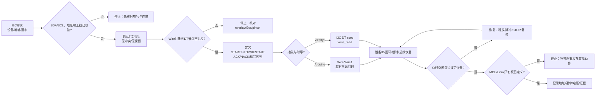

# 第6章 I2C 通信：从设备地址到总线恢复

## 学习目标

- 识别 I2C 的 SDA、SCL、控制器和目标设备，理解开漏输出、上拉电阻与共享总线的关系。
- 区分 7 位设备地址、读写位、ACK/NACK 和数据字节，不把数据手册中的 8 位地址写法直接当作 API 地址。
- 根据 Arduino UNO Q 当前 ArduinoCore-zephyr 变体声明，建立 Wire、Wire1、Wire2 与 I2C 控制器的证据链。
- 理解 UNO Q Qwiic 接口连接到 I2C4、使用 Wire1 且属于 3.3 V 电气域这一板级边界。
- 使用 Arduino Wire API 组织寄存器指针、重复 START、读回和错误码检查。
- 使用 Zephyr i2c_dt_spec、Devicetree 和 i2c_write_read_dt() 表达带资源上下文的 I2C 访问。
- 从 NACK、超时、总线忙和 SDA/SCL 被拉低等现象定位电气、地址、时序、所有权和设备状态问题。
- 设计不破坏 Linux/Bridge 或其他控制器所有权的总线恢复流程，并为每次验证留下可复现证据。

## 本章导读

I2C 只有两根信号线，却要求开发者同时处理电气、协议、资源映射和故障恢复四类边界。一次 requestFrom() 成功返回字节，只能说明某一层 API 接受了访问请求；它不自动证明设备地址正确、上拉合适、目标设备供电正确、重复 START 满足设备协议，或当前总线没有被另一个执行环境占用。

本章把 I2C 访问拆成一条可以审查的链：

> 电气空闲状态 → 7 位地址 → START/ACK/数据/STOP → Arduino 或 Zephyr 资源映射 → 设备协议 → 超时与总线恢复 → MCU/Linux 所有权记录

本章是**第二篇第 6 章**。章节编号在本篇内递增，不承接第一篇的编号，也不把本章称为全书的第 11 章。

## 背景与边界

本章覆盖：

1. I2C 的开漏/上拉电气模型、SDA/SCL 信号、START/STOP、ACK/NACK 和重复 START。
2. 7 位地址与读写位的换算，以及地址冲突、保留地址和地址扫描的安全边界。
3. Arduino UNO Q 当前 ArduinoCore-zephyr 变体中的 I2C 控制器数组、Wire 对象顺序和 Qwiic/Wire1 关系。
4. Arduino Wire 的控制器侧访问模式、错误码、缓冲边界和超时意识。
5. Zephyr 的 i2c_dt_spec、Devicetree 设备节点、组合写读和总线恢复 API。
6. MCU、Linux/Bridge 与 I2C 外设之间的总线所有权、故障处理和证据记录。
7. 纸面地址换算、电气检查、设备识别、NACK/超时和总线恢复验证。

本章不覆盖：

- 任何具体传感器、EEPROM、显示器或扩展板的数据手册命令集；
- UNO Q 未来版本、其他 Core 分支或未核验连接器的固定引脚承诺；
- 5 V 外设直接接入 3.3 V Qwiic 的电平转换电路设计；
- Linux 内核 I2C 驱动、i2c-dev 用户态工具和 Bridge 服务的完整教程；
- 未经硬件、示波器或逻辑分析仪证据支持的频率、上拉值、波形和实测吞吐量结论。

I2C 的电压、电容、上拉阻值、最大速率、时钟拉伸、地址和复位行为必须回到目标设备数据手册、UNO Q 板级资料、目标 Core/Zephyr 版本和实际接线核验。本文中的代码均为边界示例，除非明确标注，否则不表示已编译、上传或接线实测。

## 1. 两根信号线背后的共享总线

### 1.1 SDA、SCL 与开漏模型

I2C 使用双向数据线 SDA 和时钟线 SCL。传统资料把发起访问的一方称为 master、被访问的一方称为 slave；现代文档更常用 controller 和 target。本章使用控制器和目标设备，必要时在来源语境中保留原术语。

I2C 不是由设备主动把总线推到高电平的普通推挽接口。典型设备只能主动拉低 SDA 或 SCL，释放线路后由上拉电阻把线路恢复为高电平。多个设备同时释放时，线路为高；任一设备拉低时，线路为低，这种 wired-AND 特性使共享总线成为可能。

| 信号或角色 | 作用 | 首要核验点 |
|---|---|---|
| SDA | 双向地址、控制和数据线 | 空闲时能否回到高电平；是否被两个设备同时驱动 |
| SCL | 控制器产生的时钟线；目标设备可按协议拉低以延长时钟 | 空闲时能否回到高电平；是否存在时钟拉伸 |
| 上拉电阻 | 在所有设备释放线路时提供高电平 | 阻值、供电电压、总线电容和速率是否匹配 |
| 控制器 | 发起 START、提供时钟、发送地址和终止 STOP | 谁拥有总线；是否支持目标设备所需的时序 |
| 目标设备 | 响应地址、ACK/NACK、发送或接收数据 | 地址、供电、响应时序和复位行为是否满足资料 |

因此，“SDA/SCL 接上就能通信”不是充分条件。缺少上拉、上拉接到错误电压、线路电容过大、目标设备未上电或某个设备长时间拉低 SDA，都可能表现为地址无响应或控制器一直等待。

### 1.2 空闲状态、上拉与速率

在没有事务时，SDA 和 SCL 通常都应处于高电平。一次访问开始时，控制器在 SCL 保持高电平的窗口把 SDA 从高拉低，形成 START；结束时，控制器在 SCL 为高时释放 SDA，使 SDA 从低回到高，形成 STOP。这个边沿关系是协议的一部分，不是任意 GPIO 翻转。

上拉电阻与线路电容共同决定上升时间。电阻过大时，上升沿可能过慢；电阻过小时，低电平灌电流会增加，可能超过器件或板级设计允许范围。总线上挂载的连接器、排线、扩展板和输入引脚都会增加电容。100 kHz、400 kHz 等速率只能作为协议选项，不能脱离目标设备、板级上拉和波形证据单独承诺。

UNO Q 的 Qwiic 接口属于 3.3 V 系统边界。即使某个外部模块在另一块板上能够使用 5 V，也不能据此把它的 SDA/SCL 直接连接到 Qwiic；必须核对电压域、上拉位置和电平转换方案。

### 1.3 一次地址访问的线序

以“从寄存器地址读取若干字节”为例，控制器侧的抽象序列通常是：

1. START。
2. 发送 7 位目标地址与写方向位。
3. 目标设备返回 ACK。
4. 发送寄存器地址；目标设备再次 ACK。
5. 发送重复 START，而不是释放总线。
6. 发送同一个 7 位地址与读方向位。
7. 目标设备 ACK 后发送数据；控制器对继续接收的数据发送 ACK，对最后一个字节发送 NACK。
8. STOP。

这里的地址是 7 位值；最低位的读写位属于线上传输字节的一部分。若数据手册把某设备写地址写成 0x90、读地址写成 0x91，通常应先右移一位得到 API 使用的 7 位地址 0x48。这个示例只是地址表示法说明，不代表本章选择了某个真实设备。

| 线上阶段 | 控制器动作 | 目标设备可能的响应 | 失败含义 |
|---|---|---|---|
| START | 产生开始条件 | 监听总线 | SDA/SCL 电气状态或总线所有权异常 |
| 地址+写 | 发送 7 位地址和写位 | ACK 或 NACK | 地址错误、设备未上电、总线冲突 |
| 寄存器地址 | 发送命令/寄存器指针 | ACK 或 NACK | 协议不匹配、设备忙或数据格式错误 |
| 重复 START | 不发送 STOP，重新开始 | 设备保持事务上下文 | API/设备不接受组合事务 |
| 地址+读 | 发送同一地址和读位 | ACK 或 NACK | 地址换算或读写方向错误 |
| 数据 | 目标设备驱动 SDA | 控制器 ACK/NACK | 目标设备异常、长度错误或超时 |
| STOP | 释放 SDA/SCL | 总线回到空闲 | 设备仍拉低线路或控制器状态未清除 |

### 1.4 ACK、NACK、时钟拉伸与仲裁

ACK/NACK 是每个字节后的协议反馈，不等同于“应用数据正确”。地址阶段的 NACK 说明目标设备没有接受这个地址或当前不能响应；数据阶段的 NACK 可能表示寄存器、长度、写保护或设备状态不接受。即使全程 ACK，读回的设备 ID 仍然需要按数据手册解释。

目标设备可以通过拉低 SCL 暂停控制器的推进，这就是时钟拉伸。控制器必须支持目标设备所需的拉伸行为，超时策略也必须明确。多控制器总线还可能在某个控制器释放线路而另一个控制器继续拉低时产生仲裁结果；UNO Q 的学习实验应先定义单一所有者，不要默认存在可安全共享的多控制器仲裁。

## 2. Arduino UNO Q 的 I2C 资源边界

### 2.1 从变体数组推导 Arduino 对象

截至 2026-09-21 核验的 ArduinoCore-zephyr arduino_uno_q_stm32u585xx.overlay，zephyr,user 节点声明的 i2cs 顺序为：

i2cs = <&i2c2>, <&i2c4>, <&i2c3>;

ArduinoCore-zephyr 的变体配置说明把该数组的第一个控制器作为 Wire，后续控制器依次作为 Wire1、Wire2 等。因此，从当前源代码声明可以建立下面的候选对应关系：

| Arduino 对象 | 当前数组顺序对应 | 可以确认的层级 | 仍需核验的层级 |
|---|---|---|---|
| Wire | i2c2 | Core 变体数组中的第 1 个 I2C 控制器 | 最终构建、引脚复用和物理端点 |
| Wire1 | i2c4 | Core 变体数组中的第 2 个 I2C 控制器 | 目标应用、连接器、上拉和设备供电 |
| Wire2 | i2c3 | Core 变体数组中的第 3 个 I2C 控制器 | 最终构建、引脚复用和物理端点 |

这是一条源代码层级的资源映射，不是凭对象名称猜引脚。变体数组、控制器节点、pinctrl、物理连接器和目标设备必须逐层相连，才能把某个 Wire 对象称为“这根线”。

### 2.2 Qwiic 与 Wire1

Arduino UNO Q 官方用户手册说明，板载 Qwiic 接口连接到次级 I2C 总线 I2C4，并在 Arduino 侧使用 Wire1；Qwiic 系统属于 3.3 V 电气域。结合当前变体数组，可以把板载 Qwiic 的学习路径写成：

> Qwiic 连接器 → I2C4 → Wire1 → 3.3 V SDA/SCL → 外部目标设备

这条路径仍然需要在实验前核对目标设备地址、连接器线序、供电、上拉和当前 Core 版本。手册说明“Qwiic 使用 Wire1”并不等于任何接入 Qwiic 的设备都能在未经配置的情况下成功响应。

### 2.3 当前 overlay 的证据边界

当前 overlay 中，i2c4 声明为启用并采用延迟初始化，默认 pinctrl 使用 i2c4_scl_pd12 与 i2c4_sda_pd13，睡眠 pinctrl 使用 i2c4_scl_pf14 与 i2c4_sda_pf15，时钟配置为 I2C_BITRATE_FAST。i2c3 也声明为启用、延迟初始化和 FAST 速率，并使用 PC0/PC1 对应的 pinctrl 项。

这些内容可以证明当前仓库中的控制器、状态、延迟初始化和 MCU 引脚复用声明；不能单独证明：

- 某个外部连接器已经把这些 MCU 引脚引出；
- 外部线缆上拉接到了正确的 3.3 V 电源；
- 目标设备能够承受当前速率；
- Wire1.begin() 已经在目标程序中完成初始化；
- Linux/Bridge 没有同时访问同一组线路。

建立 I2C 资源链时，至少保留以下证据：

| 层级 | 证据问题 | 缺失时的停止动作 |
|---|---|---|
| Arduino API | 代码使用 Wire、Wire1 还是 Wire2？ | 不要用对象名称猜连接器 |
| Core 变体 | i2cs 数组顺序是否来自当前目标版本？ | 固定版本或重新核对源文件 |
| Zephyr 节点 | 控制器是否启用、是否延迟初始化、速率如何声明？ | 检查生成的 Devicetree |
| pinctrl | SDA/SCL 的复用与睡眠状态是否一致？ | 不把 GPIO 名称当成物理接线 |
| 板级连接 | 目标线缆、接口和供电电压是否确认？ | 停止上电或接入未知电压 |
| 设备协议 | 7 位地址、寄存器和最大速率是否来自资料？ | 先完成设备工作表 |
| 所有权 | MCU、Linux/Bridge 或其他工具谁能访问？ | 先关闭或隔离第二个控制器 |

## 3. Arduino Wire：把地址、重复 START 和返回码写清楚

### 3.1 7 位地址不是 8 位传输字节

Arduino Wire 的设备地址参数通常使用 7 位地址。不要把数据手册中已经包含读写位的 8 位线上字节直接传给 beginTransmission() 或 requestFrom()。对一个资料中出现写地址 0x90、读地址 0x91 的设备，API 地址应先换算为 0x48；对一个直接给出 7 位地址 0x48 的资料，则不再右移。

地址工作表至少应记录：

| 字段 | 示例 | 说明 |
|---|---:|---|
| 数据手册写字节 | 0x90 | 已包含读写位的线上字节写法 |
| 数据手册读字节 | 0x91 | 已包含读写位的线上字节读法 |
| API 7 位地址 | 0x48 | 供 Wire/Wire1 地址参数使用的候选值 |
| 读写位 | 0/1 | 由 API 或驱动按事务阶段产生 |
| 地址来源 | 目标设备数据手册 | 不能用“常见地址”代替确认 |

还要检查地址引脚、总线上的同型号设备数量和其他设备的地址范围。地址扫描只能作为发现响应设备的诊断工具，不能替代设备身份验证；不要在包含会执行副作用命令的设备总线上无条件发送全地址扫描。

### 3.2 endTransmission(false) 与组合事务

对于“先写寄存器指针，再读寄存器数据”的设备，常见做法是：

1. beginTransmission(address) 开始写阶段；
2. write(register) 发送寄存器地址；
3. endTransmission(false) 结束当前消息但保留总线，生成重复 START；
4. requestFrom(address, length, true) 进入读阶段并在最后发送 STOP。

endTransmission(false) 的 false 是一个重要的协议选择：它要求不要在写阶段后立即发送 STOP，而是允许后续读阶段使用重复 START。若目标设备明确要求写阶段结束后出现 STOP，则应使用相应的终止语义；不能机械套用组合事务。

Arduino Wire 常见的 endTransmission() 返回值应被记录，而不是忽略：

| 返回值 | 常见含义 | 首要排查方向 |
|---:|---|---|
| 0 | 成功 | 继续检查读回数据和设备身份 |
| 1 | 数据缓冲区溢出 | 缩短事务或检查 Core 缓冲限制 |
| 2 | 地址阶段 NACK | 7 位地址、供电、上拉、设备状态 |
| 3 | 数据阶段 NACK | 寄存器、长度、写保护、协议格式 |
| 4 | 其他错误 | 控制器状态、线路、电气或驱动错误 |
| 5 | 超时 | 总线被占用、目标拉低、时钟拉伸或超时配置 |

不同 Core 可能在缓冲长度、超时实现或底层错误映射上存在差异。Arduino 通用参考中的缓冲大小不能替代 UNO Q 当前 Core 的源码和构建核验。

### 3.3 一个 Wire1 组合读概念片段

下面片段用一个占位的 7 位地址和寄存器指针展示 Qwiic/Wire1 路径下的组合读结构。它没有选择真实设备，也没有假定 0x48 在当前总线上存在；没有完成编译、上传、接线或波形验证。

代码说明
- 用途：展示 Arduino Wire 如何用 7 位地址、寄存器指针、重复 START、读回长度和 endTransmission() 返回码组成一次组合读。
- 运行环境：Arduino UNO Q Arduino/Zephyr Sketch 概念片段；面向当前 Qwiic 使用 Wire1 的资源边界，但未在本环境编译、上传或接线。
- 文件位置：概念片段；本章没有新增可直接复用的 .ino 工程。
- 依赖：目标 Arduino Core 提供 Wire.h 和 Wire1；目标设备数据手册、Qwiic/连接器电气条件、7 位地址、寄存器协议和所有权已经核验。
- 操作步骤：先把占位地址和寄存器替换为目标设备资料中的值，再确认 SDA/SCL 上拉与 3.3 V 电气域；运行时先记录 endTransmission() 返回码和 requestFrom() 实际字节数，最后才解析设备数据。
- 预期输出：函数成功返回 true 并把设备协议规定的一个寄存器字节写入 value；这是接口预期，不是本次实测输出。
- 故障排查：先区分地址阶段 NACK、数据阶段 NACK、读回长度不足和超时，再检查对象映射、地址位、重复 START、供电、上拉与总线所有权；不要同时修改地址、速率和接线。
- 验证方式：记录逻辑分析仪中的 START、7 位地址、R/W 位、ACK/NACK、重复 START、数据和 STOP；同时保存串口日志与目标设备身份读回结果，本章未执行这些硬件验证。

```cpp
#include <Arduino.h>
#include <Wire.h>

constexpr uint8_t DEVICE_ADDRESS = 0x48;  // 占位：7 位地址，不代表当前总线设备
constexpr uint8_t REGISTER_ID = 0x00;     // 占位：由目标设备数据手册定义

bool read_register(uint8_t &value)
{
  Wire1.beginTransmission(DEVICE_ADDRESS);
  Wire1.write(REGISTER_ID);

  const uint8_t write_result = Wire1.endTransmission(false);
  if (write_result != 0U) {
    return false;
  }

  const uint8_t received = Wire1.requestFrom(DEVICE_ADDRESS, 1U, true);
  if (received != 1U || Wire1.available() < 1) {
    return false;
  }

  value = static_cast<uint8_t>(Wire1.read());
  return true;
}

void setup()
{
  Serial.begin(115200);
  Wire1.begin();
}

void loop()
{
  uint8_t value = 0U;
  const bool ok = read_register(value);

  Serial.println(ok ? "I2C read accepted" : "I2C read failed");
  if (ok) {
    Serial.println(value, HEX);
  }
  delay(1000);
}
```

这个片段有五个不能省略的边界：

1. DEVICE_ADDRESS = 0x48 只是 7 位占位地址；它不是由 UNO Q 或 Qwiic 自动分配的地址。
2. REGISTER_ID = 0x00 只是协议占位值；真实设备可能需要命令字、校验或不同的地址宽度。
3. endTransmission(false) 选择重复 START；若设备协议需要 STOP，事务必须改为对应形式。
4. requestFrom() 返回的是实际请求结果数量，仍需检查 available() 和设备数据有效性。
5. Serial.println() 只记录应用观察，不是逻辑分析仪、万用表或设备身份的替代证据。

## 4. Zephyr I2C API：让 Devicetree 携带总线上下文

### 4.1 i2c_dt_spec 与设备节点

Zephyr 将 I2C 控制器设备、目标地址和 Devicetree 上下文组合成 i2c_dt_spec。应用不必把控制器设备名、地址和速率散落在 C 代码中，而是可以从目标设备节点获得 bus 和 addr，再由 API 检查设备是否 ready。

一个概念性的目标设备节点需要表达：

| 资源 | Devicetree/驱动问题 |
|---|---|
| 总线 | 目标节点挂在哪个 I2C controller 下？controller 是否 status = "okay"？ |
| 地址 | reg 是否是目标设备的 7 位地址？是否与同总线其他设备冲突？ |
| 速率 | 控制器和目标设备能否共同支持该速率？ |
| pinctrl | SDA/SCL 是否被复用到实际连接器，睡眠状态是否安全？ |
| 供电 | regulator、GPIO enable 和电气域是否已定义？ |
| ready | 构建出的设备句柄和底层驱动是否已经可用？ |

I2C_DT_SPEC_GET(node_id) 需要一个设备节点标识；它不会凭空创建节点，也不会验证外部线缆和设备供电。i2c_is_ready_dt() 检查的是软件设备上下文是否 ready，不等同于设备已经在物理总线上 ACK。

### 4.2 组合写读与总线恢复

对寄存器类设备，i2c_write_read_dt() 能表达“写寄存器指针后读数据”的组合事务。应用仍需确认该 API 的 START/STOP 行为满足目标设备协议，并根据目标控制器驱动的能力检查结果。

Zephyr 还提供 i2c_recover_bus() 作为控制器侧总线恢复入口。恢复是否真正可用取决于控制器驱动、引脚控制能力和当前总线所有权；返回 -ENOSYS 时不能假定驱动支持恢复。-EBUSY、-EIO 等结果也必须进入故障记录，不能自动当作已经修复。

### 4.3 带 Devicetree 前提的读寄存器与恢复片段

下面示例使用 i2c_sensor 节点标签。该节点只是概念前提，不是本仓库当前 UNO Q overlay 已经提供的节点；真实工程必须先补齐目标设备节点、地址、速率、pinctrl、供电和构建配置。

代码说明
- 用途：展示 Zephyr 如何从 i2c_dt_spec 获得总线与地址，检查 ready，执行组合写读，并在明确的故障流程中调用总线恢复。
- 运行环境：原生 Zephyr I2C API 概念示例；不是本仓库已验证的 Arduino UNO Q 原生工程，未完成 Devicetree 编译、上传或硬件验证。
- 文件位置：概念片段；本章没有新增可直接编译的 Zephyr 应用目录。
- 依赖：目标 Devicetree 提供 i2c_sensor 节点、7 位 reg、有效 controller/pinctrl/供电和 I2C 驱动；目标 Zephyr 版本提供 i2c_dt_spec、i2c_write_read_dt() 与 i2c_recover_bus()。
- 操作步骤：先生成并审查最终 Devicetree，确认地址和电气边界；先执行设备 ready 与身份读取，再把恢复动作放入明确的超时/人工复核流程，不对未知所有者的总线直接切换 GPIO。
- 预期输出：读寄存器成功返回 0；恢复成功返回 0，若驱动不支持、线路仍忙或恢复失败则返回对应负 errno；这些是 API 预期，不是本次实测输出。
- 故障排查：区分节点不存在、软件设备未 ready、地址 NACK、超时、-EBUSY、-EIO 和 -ENOSYS；检查当前控制器所有权、SDA/SCL 空闲电平和目标复位状态，不要无限重试恢复。
- 验证方式：保存生成 Devicetree、构建日志、控制器错误码、逻辑分析仪总线波形和恢复前后空闲电平；本章未执行这些验证。

```c
#include <errno.h>
#include <stddef.h>
#include <stdint.h>

#include <zephyr/devicetree.h>
#include <zephyr/drivers/i2c.h>

#define I2C_SENSOR_NODE DT_NODELABEL(i2c_sensor)

static const struct i2c_dt_spec sensor =
    I2C_DT_SPEC_GET(I2C_SENSOR_NODE);

int read_register_zephyr(uint8_t reg, uint8_t *value)
{
  if (value == NULL) {
    return -EINVAL;
  }
  if (!i2c_is_ready_dt(&sensor)) {
    return -ENODEV;
  }

  return i2c_write_read_dt(&sensor, &reg, sizeof(reg), value, 1U);
}

int recover_sensor_bus(void)
{
  if (!i2c_is_ready_dt(&sensor)) {
    return -ENODEV;
  }

  return i2c_recover_bus(sensor.bus);
}
```

代码中的 i2c_is_ready_dt() 只说明 Zephyr 侧资源可以被使用；真正的设备身份仍需通过协议读取或其他低风险证据确认。i2c_recover_bus() 只应在应用拥有总线、确认没有正在进行的事务并且控制器驱动支持该动作时调用。若 Linux/Bridge 仍在使用同一线路，MCU 侧的恢复可能把另一个执行环境的事务破坏掉。

## 5. 从 NACK 到总线卡死：故障分类与恢复

### 5.1 先区分“没有响应”和“线路没有释放”

I2C 故障的第一步不是盲目降低速率或更换地址，而是区分线路状态和协议阶段：

| 现象 | 可能原因 | 第一证据 |
|---|---|---|
| 地址阶段 NACK，SDA/SCL 最终回到高 | 地址换算错误、设备未上电、地址冲突、设备仍在复位 | 7 位地址、供电、设备 ID 和地址阶段波形 |
| 数据阶段 NACK | 寄存器/命令不支持、写保护、长度或协议错误 | 数据手册事务图、字节序和 NACK 位置 |
| requestFrom() 返回长度不足 | 目标提前结束、重复 START/STOP 不合适、目标复位 | 实际字节数、ACK/NACK、目标复位线 |
| 总线一直 busy | 上一次 STOP 未完成、目标拉低 SDA/SCL、控制器状态未清除 | SDA/SCL 空闲电平、控制器状态寄存器 |
| 等待超时 | 时钟拉伸、线路短路、上拉太弱、设备失电或驱动超时 | SCL 是否被目标拉低、上升时间和电源 |
| 读回固定 0xFF 或 0x00 | 线路浮空、目标未驱动、地址/命令错误或数据本来就是该值 | 波形、设备身份寄存器和电气测量 |

“收到 ACK”只说明某个阶段有设备拉低了 ACK 位；它不能证明响应者就是预期型号。多设备同地址、错误的电压域或地址扫描误判都可能导致错误归因。

### 5.2 总线恢复的安全顺序

当 SDA 被目标设备保持低电平时，常见的 I2C bus clear 思路是让控制器在安全条件下提供有限次数的 SCL 脉冲，使目标设备完成悬挂中的字节，然后生成一个 STOP。这个动作不是任何板卡都能直接执行的 Arduino 高层 API，必须先确认 GPIO 复用、开漏能力、上拉位置、控制器状态和总线所有权。

建议的恢复记录顺序如下：

1. 停止新的应用事务，记录故障时间、控制器、目标地址和最后一个事务阶段。
2. 确认 MCU 是否是当前总线唯一控制器；若 Linux/Bridge 或其他外设可能正在使用，先执行协调或隔离。
3. 读取并记录 SDA、SCL 空闲电平和供电状态，不要在未知电压的线路上强制输出。
4. 在目标控制器和硬件允许时，将线路切换到安全的开漏/释放状态，最多按目标协议需要的有限次数脉冲 SCL，并在每次脉冲后观察 SDA 是否释放。
5. SDA 释放且 SCL 为高时，按规范形成 STOP，随后恢复控制器 pinctrl 和初始化状态。
6. 先做设备身份或状态读取；若仍失败，进入目标复位、掉电重启或人工检查，不要无限重试。
7. 保存恢复前后波形、错误码、空闲电平、重置动作和最终所有权状态。

如果目标设备在某个数据位上故意拉低 SDA，脉冲 SCL 可能使其前进；如果线路是短路、上拉错误或目标固件失控，继续脉冲并不能修复根因。恢复动作也可能触发目标设备的边沿敏感逻辑，所以“能拉出高电平”不等于“设备状态已恢复”。

### 5.3 Arduino Wire 与 Zephyr 恢复能力的差异

Arduino Wire 的通用高层接口主要表达开始、传输、读取和超时，并不为所有 Core 提供统一的跨平台总线恢复语义。UNO Q 具体能否通过底层 GPIO、Core 扩展或控制器驱动完成 bus clear，需要回到目标版本的实现和电路。不要把 Zephyr 的 i2c_recover_bus() 名称直接假定为 Arduino Sketch 可调用的函数。

Zephyr 的恢复 API 也不是成功保证：控制器驱动可能返回不支持，线路可能仍然忙，或恢复后目标设备仍需复位。API 返回值、硬件波形和设备身份读取应共同构成“恢复成功”的证据链。

## 6. I2C 通信与总线恢复决策图

下面的 Fig-12 把电气检查、地址核对、Arduino/Zephyr API 选择、恢复动作和所有权记录串成一条停止优先的流程。源文件保存在 [diagrams/uno-q-stm32-i2c-recovery-boundary.mmd](../../diagrams/uno-q-stm32-i2c-recovery-boundary.mmd)，图示登记见 [images/第2篇_STM32/README.md](../../images/第2篇_STM32/README.md)。

<a id="fig-12-uno-q-stm32-i2c-recovery-boundary"></a>

> 图示占位：图号=Fig-12；位置=本段之后；内容=展示 I2C 需求从电气、地址和资源映射，经 Arduino/Zephyr API、错误健康检查、总线恢复和所有权记录的成功与停止路径；来源=Arduino、Zephyr、NXP 与 ArduinoCore-zephyr 官方资料，原创重绘。



## 7. MCU、Linux/Bridge 与外设的所有权

### 7.1 一条总线只能有可解释的当前所有者

UNO Q 的双处理器架构允许 MCU 侧实时程序和 MPU/Linux 侧应用协同工作。I2C 设计必须明确某条线路在某个时间段由谁产生 START、谁负责恢复、谁能复位目标设备：

| 所有者模式 | 适用场景 | 必须记录 |
|---|---|---|
| MCU 独占 | Zephyr/Arduino Sketch 直接控制传感器 | 控制器、地址、速率、故障恢复权限 |
| Linux/Bridge 独占 | Linux 驱动或 Python 服务管理设备 | 服务生命周期、设备节点、异常恢复和重启策略 |
| 协议化转发 | MCU 采集，Linux 通过 RPC/Bridge 请求数据 | 请求序列号、超时、取消、队列和单一底层所有者 |
| 分时共享 | 两侧确实需要访问同一条总线 | 交接协议、互斥、停止条件和总线恢复仲裁 |

如果没有交接协议，不要把“两个程序都能打开 I2C”当作共享能力。一个执行环境可能正在等待目标设备的时钟拉伸，另一个执行环境若插入脉冲或 STOP，就会破坏第一个环境看到的事务。

### 7.2 Bridge 只传递语义，不隐藏故障

当 Linux/Bridge 请求 MCU 读取设备时，Bridge 消息至少要保留目标地址、寄存器/命令、期望长度、超时、事务序列号和底层错误码。只返回“读取失败”会丢失 NACK、超时、设备未 ready 和恢复不支持等故障分类，后续无法判断是重试、复位还是人工检查。

建议在每条记录中保留：

- I2C 控制器和 Arduino/Devicetree 对象；
- 7 位地址与地址来源；
- 请求类型、写入字节数、读取字节数和是否使用重复 START；
- 目标设备身份、固件版本或板卡批次（如果设备提供）；
- 控制器返回码、恢复返回码和重试次数；
- SDA/SCL 空闲电平、供电电压和逻辑分析仪文件路径；
- MCU、Linux/Bridge、外部工具的时间戳和所有权。

## 8. 实验与验证工作表

本章实验先以纸面和低风险观测为主。没有 UNO Q、目标设备、万用表和逻辑分析仪时，只能完成资料核对和验证计划，不能填入伪造的地址扫描、波形或实测输出。

### 8.1 实验一：完成 7 位地址换算

1. 从目标设备数据手册摘录地址引脚、7 位地址或读写 8 位地址。
2. 若资料给出写/读两个相邻偶数/奇数地址，右移一位得到 API 候选地址。
3. 与总线上的其他设备地址表比较，标记冲突和保留地址。
4. 记录地址来源页码、目标设备身份寄存器和验证方式。

预期产物不是一个“扫描到的地址”，而是一张包含原始写字节、原始读字节、API 7 位地址、地址引脚状态和设备身份验证计划的工作表。

### 8.2 实验二：检查 Qwiic/多模块电气边界

1. 在断电状态确认 Qwiic 线序、模块方向、插接牢固性和是否存在重复上拉。
2. 核对所有模块的工作电压、I/O 电压和上拉连接；确认没有把 5 V 上拉接入 3.3 V SDA/SCL。
3. 上电后在没有开始事务前测量 SDA/SCL 是否都能回到预期高电平。
4. 只连接一个已知设备进行身份验证，再逐个增加设备。
5. 记录模块数量、线缆长度、电源状态和任何额外电平转换器。

停止条件包括：电压不明、线路被强制拉低、多个模块地址冲突、上拉重复导致电流超出设计边界，或 MCU/Linux 所有权未定义。

### 8.3 实验三：设备 ID、NACK、超时与恢复

| 阶段 | 低风险动作 | 通过证据 | 失败后动作 |
|---|---|---|---|
| 身份 | 读取只读设备 ID 或状态寄存器 | ID 与目标资料一致 | 停止解析业务数据，检查地址/供电 |
| NACK | 使用已知无效地址或断开目标进行受控测试 | 错误阶段和返回码可解释 | 恢复接线，不把 NACK 当作正常数据 |
| 超时 | 在明确的测试边界观察目标失电/拉低行为 | 控制器退出且保留错误码 | 记录 SDA/SCL，禁止无限重试 |
| 恢复 | 仅在唯一所有者和驱动支持时调用恢复 | API 返回 0、线路空闲、身份重新成功 | 进入复位/掉电/人工检查 |
| 复测 | 恢复后重新读取身份与状态 | 与初次成功证据一致 | 标记恢复未闭环，保留波形和日志 |

### 8.4 验证记录模板

| 字段 | 记录内容 |
|---|---|
| 板卡/Core | UNO Q 硬件版本、ArduinoCore-zephyr/Zephyr 版本、Sketch 或应用提交 |
| 资源 | Wire/Wire1/Wire2、I2C 控制器、pinctrl、物理连接器 |
| 电气 | SDA/SCL 电平、上拉位置/阻值、供电电压、线缆和模块数量 |
| 协议 | 7 位地址、速率、寄存器/命令、START/STOP/重复 START |
| 结果 | ACK/NACK 阶段、读回字节、设备 ID、超时和恢复返回码 |
| 证据 | 串口日志、生成 Devicetree、逻辑分析仪文件、照片和时间戳 |
| 结论 | 已验证、部分验证、未验证或需要硬件复测 |

## 9. 本章验证结果

截至 2026-09-21，本章完成了以下资料和一致性核验：

- Arduino Wire 的 7 位地址、endTransmission(false) 重复 START 和返回码语义已与 Arduino 官方参考对照。
- Arduino UNO Q Qwiic 到 I2C4/Wire1 的板级关系已与 UNO Q 官方用户手册对照。
- 当前 ArduinoCore-zephyr UNO Q overlay 的 i2cs 顺序、I2C4/I2C3 状态、pinctrl 和速率声明已与官方仓库对照。
- Zephyr I2C controller/target 文档、i2c_dt_spec、组合写读、ready 检查和 i2c_recover_bus() 返回边界已与官方 API 对照。
- 开漏/上拉、START/STOP、ACK/NACK、时钟拉伸和总线清理的协议背景已登记 NXP UM10204 作为参考。
- Fig-12 Mermaid 源文件与正文中的内联 Mermaid 内容保持一致，图示登记和章节锚点已补齐。

以下内容仍未在本环境完成：arduino-cli 编译与上传、原生 Zephyr 应用构建、UNO Q 实机接线、万用表电压测量、逻辑分析仪波形、地址扫描和真实总线恢复。因此，本章状态保持为 draft。

## 10. 常见问题

### Q1：为什么不能直接把数据手册中的 0x90 传给 Wire1？

因为很多数据手册把读写位放进了线上传输字节。0x90 右移一位得到 0x48，0x48 才是典型的 7 位 API 地址候选值。仍需以目标设备的资料和身份验证为准。

### Q2：为什么地址阶段 ACK 了，读出来还是错？

ACK 只说明某个设备在该阶段响应。地址可能对应了另一设备，寄存器指针、读写方向、重复 START、数据长度、设备初始化或电气时序仍可能错误。应比较完整波形和设备 ID，而不是只看 ACK。

### Q3：Qwiic 一定是 Wire 还是 Wire1？

UNO Q 官方用户手册把板载 Qwiic 连接到 I2C4，并说明 Arduino 侧使用 Wire1。本章同时以当前 ArduinoCore-zephyr 变体数组建立源代码证据链；升级 Core 后仍应重新核对目标版本。

### Q4：可以把 5 V I2C 模块直接插到 UNO Q Qwiic 吗？

不能仅凭“它也是 I2C”就直接连接。Qwiic 是 3.3 V 电气域，必须核对目标模块的 I/O 电压、上拉位置和是否需要电平转换。

### Q5：总线恢复成功后是不是就可以继续业务？

不是。恢复 API 返回成功或线路重新空闲，只能说明控制器完成了某种恢复动作。还应重新读取设备身份/状态，确认目标设备没有处于半事务状态，并记录恢复前后的错误和波形。

### Q6：Arduino Wire 和 Zephyr I2C 代码能互相替换吗？

不能直接替换。Wire 把总线对象和事务封装在 Arduino API 中；Zephyr 通过 Devicetree、设备句柄和 i2c_dt_spec 携带资源上下文。两者可以表达类似的 I2C 协议，但资源、错误码、恢复能力和构建前提不同。

## 11. 本章小结

I2C 的难点不在于“只需要两根线”，而在于两根共享线路同时承载了电气状态、地址协议、事务边界和故障恢复。可维护的 UNO Q I2C 设计应遵循以下顺序：

1. 先确认 SDA/SCL 的电压、上拉、空闲状态和线路电容边界。
2. 再把数据手册地址换算为 7 位 API 地址，检查冲突和设备身份。
3. 再从 Wire 对象、Core i2cs 数组、Zephyr 节点、pinctrl 和物理连接器建立资源链。
4. 再定义 START、地址、ACK/NACK、寄存器、重复 START、数据和 STOP 的完整事务。
5. 再选择 Arduino Wire 或 Zephyr I2C API，并记录长度、返回码、超时和恢复条件。
6. 最后定义 MCU/Linux/Bridge 所有权，只有在安全前提满足时才执行总线恢复。

如果无法回答“谁在控制这条总线、7 位地址是什么、线路为何能回到高电平、失败后谁有权恢复”，就还没有完成 I2C 设计。

## 12. 交叉引用与来源

- 前置章节：[第二篇第 4 章：串口通信](第4章_串口通信_从帧格式到MCU_Linux边界.md)提供 MCU/Linux 边界和错误证据记录方法。
- 前置章节：[第二篇第 5 章：SPI 通信](第5章_SPI通信_从片选时序到设备驱动边界.md)提供同步总线、事务和 Devicetree 资源链的对照。
- 图示登记：[第二篇图示资源 README](../../images/第2篇_STM32/README.md)。
- 参考资料：[资源索引](../../resources/references.md)。
- 变体源文件：[ArduinoCore-zephyr UNO Q overlay](https://github.com/arduino/ArduinoCore-zephyr/blob/main/variants/arduino_uno_q_stm32u585xx/arduino_uno_q_stm32u585xx.overlay)。
- 协议参考：[NXP UM10204 I2C-bus specification and user manual](https://www.nxp.com/webapp/Download?colCode=UM10204&location=null)。
