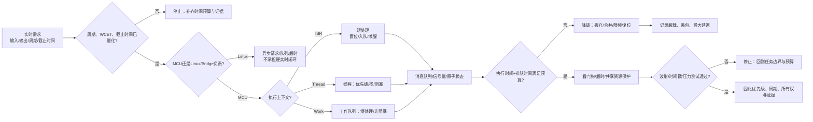

# 第7章 实时任务与调度：从周期循环到可验证响应

## 学习目标

- 区分“运行得很快”和“在截止时间前稳定完成”，用周期、执行时间、截止时间、响应时间和抖动描述实时需求。
- 理解 Arduino Sketch 的 loop 模型与 Zephyr 线程、定时器、工作队列、消息队列之间的职责差异。
- 读懂 Zephyr 合作式线程、可抢占线程和优先级的基本调度规则，不把优先级数字当成业务重要性的简单排序。
- 设计 ISR、线程和工作队列之间的最小交接路径，避免在中断上下文中阻塞、打印或执行不可控的长任务。
- 使用单调时间、绝对释放时刻和超载计数建立周期任务，识别相对睡眠造成的周期漂移。
- 用消息队列、信号量、互斥和原子状态保护共享数据，并明确队列满、超时和丢弃策略。
- 划分 STM32 MCU 与 QRB2210/Linux/Bridge 的实时责任，不把网络、UI、Python 或 AI 请求放进硬实时闭环。
- 通过时间戳、压力测试、队列水位、截止时间违约和看门狗记录，把“应该实时”变成可复核证据。

## 本章导读

实时系统的核心问题不是“平均多久完成”，而是“在最坏的可接受条件下，是否仍能在截止时间前完成”。一个传感器任务平均每 10 ms 返回一次，并不能证明它在总线重试、日志输出、Linux 请求或更高优先级中断出现时仍能按时完成。

本章把任务设计拆成一条可审查的链：

> 需求截止时间 → 周期与执行预算 → MCU/Linux 所有权 → 执行上下文 → 调度与同步 → 超载策略 → 时间证据与故障动作

本章是**第二篇第 7 章**。章节编号在本篇内递增，不承接第一篇编号，也不把本章称为全书的第 12 章。

## 背景与边界

本章覆盖：

1. 周期、释放时间、执行时间、截止时间、响应时间、抖动和超载的基本模型。
2. Arduino loop 与 Zephyr 线程/调度模型的使用边界。
3. Zephyr 合作式和可抢占线程、优先级、时间片、k_sleep()、k_uptime_get() 的概念关系。
4. 定时器、延迟工作、工作队列、消息队列、信号量、互斥和 ISR 交接。
5. Arduino 概念周期循环与 Zephyr 概念任务的代码结构。
6. MCU、Linux/Bridge、通信请求和实时闭环之间的所有权与超时边界。
7. 纸面预算、压力测试、队列溢出、看门狗和时间戳验证工作表。

本章不覆盖：

- 形式化实时性证明、完整响应时间分析或安全认证；
- Linux PREEMPT_RT、调度策略、CPU 隔离和内核驱动的完整教程；
- STM32U585 某一具体产品项目的最终优先级、栈大小、周期或中断向量承诺；
- 未经构建和硬件测量支持的最大采样率、最大任务数或最小响应时间；
- 具体传感器、PWM、ADC、SPI 或 I2C 设备驱动的完整实现。

Zephyr API、Kconfig、板级时钟和 Arduino Core 版本会影响实际行为。本文中的时间值、优先级和栈大小均为概念示例；没有生成的配置、构建产物、时间戳和硬件波形时，不把示例数字写成 UNO Q 的实测保证。

## 1. 先定义“实时”而不是先创建线程

### 1.1 五个时间量

一个周期任务至少需要写清楚以下字段：

| 时间量 | 含义 | 典型问题 |
|---|---|---|
| 周期 T | 两次任务释放之间的目标间隔 | 是固定周期、最小间隔，还是事件触发？ |
| 释放时间 r | 本次任务获得执行资格的时刻 | 由定时器、线程唤醒、ISR 还是消息到达触发？ |
| 执行时间 C | 从开始到完成所需的 CPU/外设时间 | 包含阻塞、总线等待、锁等待和重试吗？ |
| 截止时间 d | 本次结果必须可用的时刻 | 是相对释放时间，还是跟下一个采样窗口绑定？ |
| 抖动 J | 释放、开始或完成时刻相对目标的变化 | 来自中断、抢占、日志、缓存和外设等待吗？ |

响应时间 R 可以从任务释放到结果交付来测量。即使平均 R 很小，只要偶发 R 大于截止时间，就发生了可见的 deadline miss。对于控制输出，过期结果有时比丢弃结果更危险，因此必须预先定义“迟到后继续使用、降级或丢弃”的规则。

### 1.2 周期任务的预算

对多个独立周期任务，可以先做一张粗粒度预算表：

| 任务 | 周期 T | 目标执行预算 C | 截止时间 D | 资源等待 | 迟到动作 |
|---|---:|---:|---:|---|---|
| 采样 | 10 ms | 1 ms | 5 ms | ADC/DMA | 丢弃本次或使用上一稳定值 |
| 控制 | 10 ms | 2 ms | 8 ms | 共享状态 | 输出安全值并记数 |
| 通信 | 100 ms | 5 ms | 50 ms | I2C/SPI/UART | 限速、重试或标记 stale |
| 诊断 | 1000 ms | 20 ms | 500 ms | 日志/队列 | 延后执行，不影响闭环 |

表格中的数字是工作表占位，不是 UNO Q 的硬件结论。真正的 C 应包含最坏路径，而不只是“正常一次读取”的平均耗时。若任务周期为 T，最简单的 CPU 利用率估算是：

$$
U = \sum_i \frac{C_i}{T_i}
$$

当 U 接近 1 时，系统几乎没有留给中断、调度、锁等待、缓存、异常和恢复的余量。即使 U 小于 1，也不能自动推出所有截止时间都能满足，因为优先级、阻塞、资源冲突和释放相位仍会影响响应时间。

### 1.3 周期、事件和后台工作

不要把所有事情都设计成同一个周期线程：

- 周期采样需要稳定释放点和明确的采样窗口；
- 外部中断适合捕获边沿、清除硬件状态和提交小消息；
- 控制任务适合读取一份一致的输入快照并产生有界输出；
- 通信任务适合等待队列和处理协议，不应阻塞控制线程；
- 诊断、日志、统计和低优先级维护可以延后或丢弃。

任务拆分的目标不是线程越多越好，而是让每个执行上下文只有一个可说明的时间责任。一个线程同时做采样、打印、网络请求和设备恢复，最终很难知道哪个动作导致了 deadline miss。

## 2. UNO Q 的实时责任边界

### 2.1 MCU 侧负责确定性闭环

UNO Q 是双处理器架构：STM32U585 MCU 侧运行 Arduino Core on Zephyr，QRB2210 MPU 侧运行 Debian Linux。官方用户手册明确 Arduino IDE 面向 UNO Q Microcontroller；MPU/Linux 侧由 App Lab 等工具和应用路径承担。这里的“负责”不是把所有业务都塞进 MCU，而是根据截止时间把闭环放在拥有合适时钟、外设和故障动作权限的一侧。

适合 MCU/Zephyr 侧的任务通常包括：

- GPIO 安全状态、PWM 更新和紧急关闭；
- 有明确周期与截止时间的 ADC 采样和控制计算；
- 需要受控超时的 SPI、I2C、UART 事务；
- 外部中断的时间戳捕获和短消息入队；
- 对输出安全值、复位、看门狗和故障锁定有直接权限的动作。

适合 Linux/Bridge 侧的工作通常包括：

- UI、网络、文件、日志聚合和用户交互；
- 复杂模型推理、视觉处理和大块数据整理；
- 非实时配置、历史查询和结果展示；
- 通过 RPC/Bridge 向 MCU 提交带序列号、截止时间和取消语义的请求。

Linux 应用即使运行在性能很高的处理器上，也不应被当作 MCU 控制闭环的隐含时钟。网络、文件系统、进程调度、服务重启和 Python 垃圾回收都可能造成不可预测的延迟。

### 2.2 一个请求只能有一个实时所有者

MCU 和 Linux 之间的消息边界应至少写清楚：

| 字段 | 作用 |
|---|---|
| sequence | 区分旧响应、重试响应和当前请求 |
| deadline | 过期请求是否丢弃，而不是无限等待 |
| payload | 输入数据、控制目标或配置版本 |
| ownership | 哪一侧能访问物理外设和执行恢复 |
| result | 成功、超时、过期、队列满、设备错误或拒绝 |
| timestamp | 请求接收、开始、完成和交付的时间 |

如果 Linux 请求一个已经过期的控制输出，MCU 应能识别并拒绝它；如果 MCU 的控制任务等待 Linux 回复才能产生安全输出，那么闭环实际上被 Linux 的非确定性调度接管。合理的设计是让 MCU 保有默认安全状态，Linux 只提供目标、模式或非实时参数。

### 2.3 资源链

本篇前几章已经分别建立 GPIO、PWM、ADC、UART、SPI 和 I2C 的资源边界。本章把时间责任接在这些资源之上：

> 外设事件 → STM32 中断/控制器 → Zephyr ISR/线程 → 同步对象 → 控制输出 → Bridge 消息 → Linux 应用

每一段都应有最大等待时间、缓冲策略、所有权和失败动作。只写“任务每 10 ms 运行一次”而不记录 I2C 等待、日志阻塞和 Linux 回传，是不完整的实时设计。

## 3. Arduino loop：简单入口不是实时保证

### 3.1 loop 模型的优势与风险

Arduino Sketch 通常把应用工作放进 setup() 和 loop()。loop() 适合教学、低复杂度控制和按状态机组织的非阻塞任务；但 loop() 自身不会自动给每个工作项分配截止时间，也不会自动阻止某个函数长期占用 CPU。

以下模式会破坏周期稳定性：

- 在 loop() 中使用不受控的长延时；
- 等待串口、I2C、SPI 或 Linux 回复直到无限期；
- 每一轮都打印大量日志；
- 在一次循环中扫描未知数量的设备或处理无界长度的数据；
- 用“本轮结束后再加一个周期”的相对延时累积处理时间。

一个更可审查的 Arduino 结构是维护下一次绝对释放时刻，并记录迟到和超载。它仍然不是硬实时证明，只是把时间意图显式化。

### 3.2 Arduino 概念周期循环

下面片段把每 10 ms 的采样/控制任务写成一个非阻塞骨架。sample_and_control() 是占位函数，不能代表某个具体传感器或控制算法；时间值也没有在 UNO Q 上实测。

代码说明
- 用途：展示 Arduino loop 如何用单调毫秒计时、绝对下一次释放时刻、超载计数和有限日志表达周期任务。
- 运行环境：Arduino UNO Q Arduino/Zephyr Sketch 概念片段；未在本环境编译、上传、接线或测量真实抖动。
- 文件位置：概念片段；本章没有新增可直接复用的 .ino 工程。
- 依赖：目标 Arduino Core 提供 millis()、Serial 和常规 Sketch 生命周期；真实任务还需定义采样、输出、超时、故障和日志预算。
- 操作步骤：先把 sample_and_control() 替换为有界业务函数，再核对其最坏执行时间；通过 GPIO/计时器或硬件逻辑分析记录释放和完成时间，不能只看串口打印。
- 预期输出：任务按目标周期尝试释放，迟到和超载次数可以被观察；这是结构预期，不是本次实测结果。
- 故障排查：检查是否有阻塞 API、长日志、无界循环或错误恢复重试；区分任务未释放、释放后未完成和完成后交付过期。
- 验证方式：记录 release、start、finish、deadline_miss 和 overrun_count，进行高负载与外设异常测试；本章未执行编译和硬件验证。

```cpp
#include <Arduino.h>

constexpr uint32_t PERIOD_MS = 10U;  // 概念预算，不代表实测能力

uint32_t next_release_ms = 0U;
uint32_t release_late_count = 0U;
uint32_t deadline_miss_count = 0U;
uint32_t overrun_count = 0U;

void sample_and_control()
{
  // 占位：只放入有界采样、计算和安全输出。
}

void setup()
{
  Serial.begin(115200);
  next_release_ms = millis() + PERIOD_MS;
}

void loop()
{
  const uint32_t now_ms = millis();
  if (static_cast<int32_t>(now_ms - next_release_ms) < 0) {
    return;
  }

  const uint32_t release_ms = next_release_ms;
  next_release_ms += PERIOD_MS;

  const uint32_t start_ms = millis();
  sample_and_control();
  const uint32_t finish_ms = millis();

  if (static_cast<int32_t>(start_ms - release_ms) > 0) {
    ++release_late_count;
  }
  if ((finish_ms - release_ms) > PERIOD_MS) {
    ++deadline_miss_count;
  }
  if ((finish_ms - start_ms) > PERIOD_MS) {
    ++overrun_count;
  }

  // 过载时跳过已经失效的释放点，避免追赶循环占满 CPU。
  if (static_cast<int32_t>(finish_ms - next_release_ms) >= 0) {
    next_release_ms = finish_ms + PERIOD_MS;
  }
}
```

这段代码有三个重要限制：

1. millis() 的分辨率、计时实现和中断影响决定了它能支持的最小可观察时间；它不能自动提供微秒级或硬实时保证。
2. 用绝对 next_release_ms 可以避免把本次执行时间简单叠加到下一周期，但遇到连续超载仍必须选择跳过、降级或停机。
3. 计数器只是故障证据的一部分。要判断输出是否按时，还需记录 GPIO 边沿、外设完成时间或更高精度的时间戳。

## 4. Zephyr 调度：线程、优先级和阻塞点

### 4.1 合作式与可抢占线程

Zephyr 调度器从处于 ready 状态的线程中选择优先级最高者；优先级数值越低，优先级越高。负数优先级属于合作式线程，非负数优先级属于可抢占线程。合作式线程运行后，通常要主动阻塞、睡眠或让出 CPU 才能让其他线程获得机会；一个长时间运行的合作式线程可能拖延其他线程。

可抢占线程可以被更高优先级的就绪线程取代；同优先级线程是否轮转还受时间片和配置影响。ISR 的执行优先于线程上下文，因此把一个长任务从 loop() 移到 ISR 并不会让系统更实时，反而可能增加中断延迟和栈风险。

优先级应表达“截止时间和故障影响”，而不是“这个模块在组织上更重要”。一条安全关闭路径可能比诊断日志优先，但优先级仍需结合执行时间、阻塞关系和验证结果，而不是凭感觉赋值。

### 4.2 睡眠、单调时间和释放点

Zephyr 的 k_uptime_get() 提供自系统启动以来的单调毫秒时间；k_sleep() 使当前线程在相对时间内不再运行。对于简单的周期任务，可以用绝对 next_release 计算剩余时间；这样任务处理时间不会无意中改变下一次目标释放点。

直接在循环末尾调用“执行后再睡一个周期”的写法会产生：

$$
T_{observed} \approx T_{work} + T_{sleep} + T_{preemption}
$$

如果 T_work 变化，实际周期也会变化。绝对释放点把周期定义为时间线上的目标，而不是把周期定义成上一轮结束后的等待时间。

### 4.3 定时器、延迟工作和工作队列

定时器适合产生超时或周期事件；工作队列适合把短小、可延后的处理从 ISR 或触发点移到线程上下文。延迟工作可以在未来时刻提交到工作队列，但“到期”不等于“处理已经完成”：工作项仍可能排在队列中等待。

系统工作队列是共享资源。若某个工作处理器执行长计算、阻塞外设或等待 Linux 回复，它会拖延同一工作队列中的其他工作项。只有当任务的执行上下文、优先级或阻塞行为确实不能与系统工作队列共存时，才考虑单独创建工作队列，并把额外栈和线程成本写入预算。

## 5. ISR、同步对象与数据交接

### 5.1 ISR 只做硬件边界动作

一个可审查的 ISR 通常只做以下事情：

1. 读取或清除硬件状态，避免中断立即重复触发；
2. 捕获必要的时间戳或少量状态；
3. 用原子变量、信号量或非阻塞消息队列提交事件；
4. 唤醒负责复杂处理的线程；
5. 快速返回。

ISR 不应等待互斥、睡眠、执行网络请求、打印无界日志或运行复杂的 I2C/SPI 重试。Zephyr 文档允许某些消息队列/信号量操作从 ISR 发起，但 ISR 不能在资源不可用时等待；代码应使用 K_NO_WAIT 或等价的非阻塞路径并处理失败。

### 5.2 选择同步对象

| 需求 | 候选对象 | 关键边界 |
|---|---|---|
| ISR 通知线程“有事件” | 二值/计数信号量 | ISR 可 give；线程 take 可带超时 |
| 传递固定大小样本 | 消息队列 | 拷贝固定大小项目；满时要定义丢弃或覆盖 |
| 保护可阻塞的共享资源 | 互斥 | 只在线程上下文获取和释放；必须设定等待上限 |
| 单个标志或计数器 | 原子变量 | 只适合可原子更新的状态，不代替复杂快照一致性 |
| 极短的 ISR/线程共享临界区 | 适当的自旋/中断保护 | 临界区必须极短，不能在其中睡眠 |
| 大块数据或连续字节流 | 环形缓冲/指针交换 | 避免在 ISR 中复制过大的数据块 |

互斥解决的是所有权，不是实时性。一个低优先级线程持有互斥后，如果高优先级线程等待，它仍然可能产生优先级反转；应缩短持锁区、避免在锁内做外设等待，并核对目标配置提供的优先级继承行为。

### 5.3 队列满是设计事件

队列满不应只打印一条日志。应用必须选择：

- 丢弃最新数据，保留完整历史；
- 丢弃最旧数据，保留最新状态；
- 合并多个样本，只传递最新快照；
- 降低生产频率；
- 触发降级或故障锁定。

控制系统通常更关心“最新状态”而不是无限积累旧样本；事件审计系统则可能必须保留顺序和完整性。这个选择必须跟截止时间和业务后果一致。

## 6. 用消息队列隔离周期任务和后台处理

### 6.1 生产者与消费者的边界

采样线程不应直接承担复杂日志、网络发送和文件写入。更可控的结构是：

> ISR/采样 → 固定大小快照 → 消息队列 → 控制/解析线程 → 输出或 Bridge

生产者只负责产生有界数据并处理队列满；消费者负责解释数据、检查时间戳和执行较慢操作。队列长度不是越大越好：太短容易丢数据，太长则可能把旧数据积压到过期，掩盖消费者已经落后的事实。

### 6.2 Zephyr 概念任务

下面示例展示一个周期生产线程把固定大小样本放入消息队列。它使用绝对下一次释放时刻，并区分队列丢弃与周期超载。示例没有绑定具体 ADC，也没有提供最终的 prio、栈大小和 Kconfig 配置。

代码说明
- 用途：展示 Zephyr 线程、单调时间、固定大小消息队列、非阻塞入队和周期超载记录之间的关系。
- 运行环境：原生 Zephyr kernel API 概念示例；不是本仓库已验证的 Arduino UNO Q 原生工程，未完成 Devicetree、Kconfig、编译或硬件验证。
- 文件位置：概念片段；本章没有新增可直接编译的 Zephyr 应用目录。
- 依赖：目标 Zephyr 版本提供 k_uptime_get_32、K_MSGQ_DEFINE、k_msgq_put、k_sleep 和 K_THREAD_DEFINE；线程栈、优先级、时钟和真实采样函数必须由目标工程定义。
- 操作步骤：先用纸面预算确定周期、执行上限、队列深度和丢弃策略，再替换 sample_value 占位值；构建后用时间戳和队列水位验证，不能把示例 10 ms 当作板卡承诺。
- 预期输出：生产线程按周期尝试入队，队列满和执行超载分别计数；这是接口预期，不是本次实测输出。
- 故障排查：区分线程未启动、周期释放迟到、消息队列满、消费者落后和外设采样阻塞；检查 Kconfig、栈水位、优先级和所有阻塞调用。
- 验证方式：记录 release/start/finish、队列满次数、最大队列深度、消费者延迟和丢弃策略；本章未执行构建和硬件压力测试。

```c
#include <stdint.h>

#include <zephyr/kernel.h>

struct sample_item {
  uint32_t sequence;
  int32_t value;
  uint32_t release_ms;
};

K_MSGQ_DEFINE(sample_queue, sizeof(struct sample_item), 8, 4);

static uint32_t sequence;
static uint32_t queue_drop_count;
static uint32_t overrun_count;

static void sample_thread(void *arg1, void *arg2, void *arg3)
{
  ARG_UNUSED(arg1);
  ARG_UNUSED(arg2);
  ARG_UNUSED(arg3);

  const uint32_t period_ms = 10U;  // 概念预算，不代表实测能力
  uint32_t next_release_ms = k_uptime_get_32() + period_ms;

  while (true) {
    const uint32_t start_ms = k_uptime_get_32();
    struct sample_item item = {
      .sequence = sequence++,
      .value = 0,  // 占位：替换为有界 ADC/传感器采样
      .release_ms = next_release_ms,
    };

    if (k_msgq_put(&sample_queue, &item, K_NO_WAIT) != 0) {
      ++queue_drop_count;
    }

    next_release_ms += period_ms;
    const uint32_t now_ms = k_uptime_get_32();
    if ((int32_t)(now_ms - next_release_ms) >= 0) {
      ++overrun_count;
      next_release_ms = now_ms + period_ms;
    }

    const int32_t remaining_ms =
        (int32_t)(next_release_ms - k_uptime_get_32());
    if (remaining_ms > 0) {
      k_sleep(K_MSEC(remaining_ms));
    } else {
      ++overrun_count;
    }

    (void)start_ms;  // 真实应用应记录或上报执行时间
  }
}

K_THREAD_DEFINE(sample_tid, 1024, sample_thread,
                NULL, NULL, NULL, 4, 0, 0);
```

这个片段仍有几个必须在工程中补齐的前提：

1. 线程优先级 4、栈大小 1024、周期 10 ms 和队列深度 8 都是教学占位，必须通过目标构建和压力测试重新选择。
2. 消费者没有在片段中实现；如果没有及时取走消息，queue_drop_count 会增加，应用必须执行既定的丢弃或降级策略。
3. k_msgq_put() 会复制固定大小结构体；大数据不应直接塞入消息队列，而应考虑指针、缓冲池或环形缓冲。
4. start_ms 只是展示测量点；真正的验证还需捕获消费者完成、控制输出和外部事件的时间戳。

## 7. 从调度选择到可验证的任务架构

### 7.1 任务责任表

每个任务在进入实现前应填写责任表：

| 字段 | 示例问题 |
|---|---|
| 触发 | 周期、GPIO 边沿、外设完成、消息到达还是人工命令？ |
| 上下文 | ISR、线程、系统工作队列、专用工作队列还是 Linux 进程？ |
| 预算 | 最坏执行时间、最长阻塞、最大重试和最大数据量是多少？ |
| 优先级 | 哪些任务的截止时间更早？是否存在低优先级持锁？ |
| 输入 | 是否可能过期、重复、乱序或缺失？ |
| 输出 | 迟到、队列满、设备 NACK 或 Linux 断开时怎么处理？ |
| 观测 | 记录哪些时间戳、计数器、队列水位和复位原因？ |
| 所有权 | 谁可以访问物理外设、复位线路和恢复 API？ |

### 7.2 线程不等于并行

在单核 MCU 上，多个线程通常是时间上的交错执行，而不是同时消耗多个 CPU。创建更多线程会增加栈、上下文切换、同步和测试组合；它不会凭空增加控制预算。

在 UNO Q 的整体系统中，MPU 侧可能有多个 Linux CPU 核，但 MCU 侧任务仍需要按照 STM32 侧的单核调度和中断边界设计。不要因为 Linux 可以并行处理，就把 MCU 任务之间的共享状态写成无锁、无时间戳的“最终一致”变量。

### 7.3 工作队列的使用条件

工作队列适合短小、可延后、不会长期阻塞的工作。以下情况应重新评估：

- 工作处理器里调用可能等待很久的 I2C/SPI/UART；
- 工作处理器里做大块图像、压缩或模型计算；
- 工作项提交频率高于处理速度；
- 多个模块共享系统工作队列却没有预算；
- 工作项会重新提交自己，但没有取消和停止条件。

可行的替代方案包括专用线程、专用工作队列、消息队列加消费者，或把工作移到 Linux 侧；选择应依据截止时间和故障后果，而不是 API 使用方便程度。

## 8. 超载、看门狗与故障降级

### 8.1 超载不是普通日志

至少区分以下计数：

- release_late：任务获得运行资格已经迟到；
- execution_overrun：本次执行超过预算；
- queue_drop：数据无法进入队列；
- stale_input：输入到达但已经过期；
- response_timeout：外部设备或 Bridge 没有在截止时间内回复；
- recovery_attempt：系统执行了重试、复位或总线恢复；
- watchdog_reset：系统由看门狗复位。

这些计数应带时间窗口、最近一次时间戳和当前模式。仅保留一个 error_count 会让诊断无法区分 CPU 超载、外设故障和通信断开。

### 8.2 看门狗只能监督健康，不应无条件喂狗

看门狗的价值在于任务或系统失去正常进展时触发纠正动作。如果一个最高优先级线程无论其他任务是否完成都持续调用 feed，那么看门狗只能证明“喂狗线程还在运行”，不能证明采样、控制、通信和故障监视都健康。

更可审查的做法是维护任务健康标志或递增心跳，由监视任务在确认关键任务最近一次完成、队列未持续溢出、输出状态可解释后执行喂狗。任务看门狗和硬件看门狗的配置、复位动作和暂停条件仍需回到目标板卡和 Zephyr 配置验证。

### 8.3 降级动作必须提前定义

| 故障 | 可选降级 | 禁止的默认行为 |
|---|---|---|
| 周期连续超载 | 降低采样率、跳过诊断、进入安全输出 | 无限追赶过期周期 |
| 队列持续满 | 丢弃旧快照、只保留最新值、停用生产者 | 无界扩大队列 |
| 外设超时 | 使用上一稳定值、关闭输出、复位目标 | 无限同步重试 |
| Bridge 断开 | MCU 使用本地安全策略 | 等待 Linux 回复才能停机 |
| 看门狗复位 | 启动原因记录、限制重启循环 | 重启后不记录原因 |

## 9. 实时任务决策图

下面的 Fig-13 把时间预算、所有权、执行上下文、同步、超载和验证串成一条停止优先的流程。源文件保存在 [diagrams/uno-q-stm32-realtime-scheduling-boundary.mmd](../../diagrams/uno-q-stm32-realtime-scheduling-boundary.mmd)，图示登记见 [images/第2篇_STM32/README.md](../../images/第2篇_STM32/README.md)。

<a id="fig-13-uno-q-stm32-realtime-scheduling-boundary"></a>

> 图示占位：图号=Fig-13；位置=本段之后；内容=展示实时需求从周期和预算量化，经 MCU/Linux 所有权、ISR/线程/工作队列选择、同步、负载与看门狗验证，到超载降级和证据记录的成功与停止路径；来源=Zephyr 与 Arduino UNO Q 官方资料，原创重绘。



## 10. 验证实验与记录模板

本章的实验首先建立纸面预算和观测方案。没有 UNO Q、目标外设、逻辑分析仪或可控负载时，只能完成设计核对，不能填写伪造的最大响应时间或看门狗复位次数。

### 10.1 实验一：周期预算与释放点

1. 为采样、控制、通信和诊断任务填写 T、C、D、最大阻塞和迟到动作。
2. 标出所有可能的 ISR、外设等待、互斥和日志路径。
3. 选择绝对释放点，计算总利用率并保留安全余量。
4. 在代码中记录 release、start、finish 和 deadline_miss。
5. 使用可控负载逐步增加执行时间，观察首次违约和连续违约。

通过标准不是“平均周期接近目标”，而是能够回答：最大响应时间是多少、哪个路径造成抖动、迟到后输出做了什么、证据文件在哪里。

### 10.2 实验二：队列背压与丢弃策略

1. 固定生产周期，逐步降低消费者处理速度。
2. 记录队列深度、入队成功、队列满和消费者延迟。
3. 分别测试丢弃最新、丢弃最旧、合并快照和停止生产者。
4. 判断哪种策略符合控制、监测或审计业务。
5. 将策略写入 Bridge 消息和故障记录，不只留在注释中。

### 10.3 实验三：Bridge 延迟和 MCU 本地安全

1. 让 Linux/Bridge 正常发送目标值，再引入延迟、重复、乱序和断开。
2. 检查 MCU 是否按序列号和截止时间拒绝过期请求。
3. 断开 Bridge，确认 MCU 仍能执行本地安全输出和超时动作。
4. 恢复连接后，确认旧请求不会覆盖当前状态。
5. 保存 MCU 时间戳、Bridge 日志、请求序列号和复位/降级原因。

### 10.4 验证记录模板

| 字段 | 记录内容 |
|---|---|
| 版本 | UNO Q 硬件、ArduinoCore-zephyr/Zephyr 版本、应用提交 |
| 任务 | 名称、上下文、优先级、栈大小、触发方式 |
| 时间 | 周期、执行预算、截止时间、最大响应、最大抖动 |
| 同步 | 队列/信号量/互斥、深度、超时、满载策略 |
| 负载 | 外设等待、日志、Bridge 延迟、CPU 负载和异常注入 |
| 结果 | 迟到、超载、丢包、过期输入、恢复和看门狗计数 |
| 证据 | 时间戳、GPIO 波形、队列水位、日志和复位原因 |
| 结论 | 已验证、部分验证、未验证或需要重新分配责任 |

## 11. 本章验证结果

截至 2026-09-21，本章完成了以下资料和一致性核验：

- Zephyr 线程和调度资料已核对合作式/可抢占优先级、调度点、时间片和阻塞行为。
- Zephyr 时间资料已核对 k_uptime_get()、相对超时、定时器和延迟工作队列的语义边界。
- Zephyr 消息队列、信号量、互斥和工作队列资料已核对 ISR 非阻塞、固定大小项目、线程上下文和共享工作队列风险。
- Zephyr 看门狗资料已核对安装超时、setup、feed 和任务看门狗的监督边界。
- UNO Q 官方资料已核对双处理器、STM32 MCU、Debian Linux MPU 和 Arduino IDE 面向 MCU 的高层分工。
- Fig-13 Mermaid 源文件与正文内联 Mermaid 内容保持一致，图示登记、章节锚点和参考资料已补齐。

以下内容仍未在本环境完成：Arduino CLI 编译与上传、原生 Zephyr 应用构建、任务栈水位测量、真实时间戳、CPU 负载压力测试、Bridge 延迟注入、看门狗复位和 UNO Q 实机运行。因此，本章状态保持为 draft。

## 12. 常见问题

### Q1：线程优先级高，是否就一定能按时完成？

不一定。高优先级线程仍可能被 ISR 打断、被锁阻塞、等待外设、耗尽栈或执行时间超过预算。优先级只是调度选择的一部分，必须结合执行时间、阻塞关系和时间证据验证。

### Q2：把任务放进 ISR 是否比线程更实时？

ISR 可以更快响应硬件事件，但不适合长计算、阻塞和复杂协议。正确做法通常是 ISR 捕获状态并快速提交事件，再由合适优先级的线程处理剩余工作。

### Q3：为什么不能在 loop() 末尾 delay 一个周期？

因为本轮执行时间会叠加到下一周期，导致实际周期漂移；同时，阻塞期间可能错过事件。若任务不适合迁移到 Zephyr 线程，至少用绝对释放点、超载计数和明确的跳过策略。

### Q4：工作队列是不是线程的轻量替代？

工作队列仍由线程执行。它能把短小、可延后的工作统一排队，但工作处理器中的长阻塞会影响同一队列的其他工作项。是否使用系统工作队列，需要看执行预算和共享影响。

### Q5：队列越大，系统是不是越稳定？

不一定。更大的队列能吸收短暂突发，却也可能积累大量过期数据，使延迟变得更大。控制任务通常需要最新值和过期策略，而不是无限保存旧样本。

### Q6：Linux/Bridge 能否直接参与 MCU 的硬实时闭环？

除非建立了明确的调度、通信、截止时间和故障证明，否则不应默认可以。更稳妥的边界是 MCU 维持本地控制和安全输出，Linux/Bridge 提供目标、配置、诊断和非实时服务。

## 13. 本章小结

实时任务设计从时间预算开始，而不是从线程 API 开始。可维护的 UNO Q MCU 任务应遵循以下顺序：

1. 先写清周期、执行预算、截止时间、响应时间和迟到动作。
2. 再决定 MCU、Linux/Bridge 或外设控制器谁拥有时间责任。
3. 再选择 ISR、线程、定时器、工作队列和消息队列的最小组合。
4. 再定义优先级、阻塞上限、共享资源保护和队列满策略。
5. 再用绝对释放点、超载计数、时间戳和压力测试验证，而不是只看平均周期。
6. 最后把看门狗、降级、复位和 Bridge 断开行为纳入故障闭环。

如果无法回答“任务何时必须完成、最坏会等待多久、迟到后输出是什么、谁能在 Linux 失联时保证安全”，就还没有完成实时任务设计。

## 14. 交叉引用与来源

- 前置章节：[第二篇第 1 章：STM32 侧开发基础](第1章_STM32侧开发基础_GPIO与实时边界.md)提供 MCU/MPU 责任边界和 GPIO 资源基础。
- 前置章节：[第二篇第 4 章：串口通信](第4章_串口通信_从帧格式到MCU_Linux边界.md)提供消息帧、超时和 MCU/Linux 传输边界。
- 前置章节：[第二篇第 6 章：I2C 通信](第6章_I2C通信_从设备地址到总线恢复.md)提供外设事务、超时和总线恢复边界。
- 图示登记：[第二篇图示资源 README](../../images/第2篇_STM32/README.md)。
- 参考资料：[资源索引](../../resources/references.md)。
- Zephyr 资料：[线程与调度](https://docs.zephyrproject.org/latest/kernel/services/threads/index.html)。
- Zephyr 资料：[内核时钟与超时](https://docs.zephyrproject.org/latest/kernel/services/timing/clocks.html)。
- UNO Q 资料：[Arduino UNO Q User Manual](https://github.com/arduino/docs-content/blob/main/content/hardware/02.uno/boards/uno-q/tutorials/01.user-manual/content.md)。
