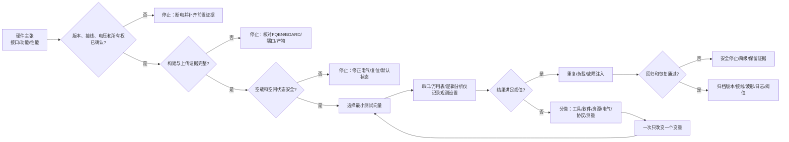

# 第8章 硬件验证与故障定位：从接线检查到证据闭环

## 学习目标

- 区分资料核对、构建成功、上电安全、电气测量、波形观测、功能通过和压力测试这些不同等级的证据。
- 建立从断电检查、供电确认、空闲电平、单外设接入到多外设联调的安全上电顺序。
- 使用 Arduino CLI/IDE 和 Zephyr west 工具完成“能构建、能上传、能运行、能测量”的分层验证。
- 为 GPIO、PWM、ADC、UART、SPI 和 I2C 设计最小可复现的验证向量与通过条件。
- 用串口标记、GPIO 探针、逻辑分析仪、万用表、构建产物和时间戳组成证据链。
- 区分程序错误、资源映射错误、电气错误、设备协议错误、工具链错误和测量方法错误。
- 定义 MCU、Linux/Bridge、外设和测试工具的所有权，避免联调时出现不可解释的并发访问。
- 在没有实机证据时明确标记“待验证”，不把概念代码、编译成功或偶然读数写成硬件结论。

## 本章导读

硬件验证不是在最后“插上开发板看是否能跑”，而是把一个技术主张拆成逐级可复核的证据。比如“PWM 输出正确”至少包含：目标引脚和复用正确、供电和地正确、波形频率正确、占空比正确、初始和停止状态安全、负载连接正确，以及控制任务在异常时仍能退出。

本章把一次验证拆成一条证据链：

> 主张 → 前置条件 → 最小测试向量 → 观测工具 → 通过阈值 → 失败分类 → 可复现记录 → 回归验证

本章是**第二篇第 8 章**。章节编号在本篇内递增，不承接第一篇编号，也不把本章称为全书的第 13 章。

## 背景与边界

本章覆盖：

1. 硬件验证等级、通过条件、停止条件和证据完整性。
2. 断电检查、供电、地、上拉、复位、连接器和电平边界。
3. Arduino CLI/IDE 与 Zephyr west 的构建、上传、运行和产物核验。
4. GPIO、PWM、ADC、UART、SPI、I2C 的最小验证向量。
5. Arduino 概念验证探针、Zephyr 概念自检门和串口/波形证据。
6. 失败隔离、故障注入、MCU/Linux/Bridge 联调和回归矩阵。
7. 没有硬件时如何诚实记录“资料已核验、实机未验证”。

本章不覆盖：

- 某一具体传感器、执行器或测量仪器的完整操作手册；
- 对 UNO Q 未公开或未核验的测试点、排针和内部引脚作固定承诺；
- 任何未经目标板卡、Core 版本和实际外设确认的电压、频率、占空比或精度保证；
- 生产测试夹具、自动化烧录线和安全认证流程的完整设计；
- Linux 内核、Python 服务或 App Lab 的全部部署和运维教程。

硬件验证具有破坏风险。接线、测量、上电、复位、刷写和故障注入都应从低能量、单设备、可恢复状态开始；电压不明、极性不明、上拉不明或所有权不明时，停止操作。

## 1. 证据等级：什么才算“验证通过”

### 1.1 七个常被混淆的状态

| 状态 | 能证明什么 | 不能证明什么 |
|---|---|---|
| 资料核对 | API、引脚声明、连接关系或协议描述来自可追溯来源 | 当前板卡接线和实机行为 |
| 静态检查 | 文件、目录、元数据、链接和配置结构满足规则 | 编译器接受所有目标配置 |
| 构建成功 | 当前源代码和配置生成了目标产物 | 产物已经上传、运行或接线正确 |
| 上传成功 | 工具把某个镜像写入了某个目标路径 | 应用启动、外设工作或版本正确 |
| 启动成功 | 串口、日志或探针看到应用启动标记 | 输出波形、负载能力和异常处理 |
| 功能通过 | 某个输入在某个测试向量下得到预期输出 | 最坏情况、长时间运行和故障恢复 |
| 压力/回归通过 | 在定义的负载、重复次数和异常条件下仍满足阈值 | 未测试的温度、电源、线缆或版本组合 |

“程序能跑”最多覆盖启动成功的一部分；“读到一个数”最多覆盖功能通过的一条路径。发布或交付前，应把主张和证据等级写在同一张验证矩阵里。

### 1.2 主张必须带阈值

不要写“信号稳定”“延迟很小”“电压正常”这类无法复核的结论。改写为：

| 模糊说法 | 可验证说法 |
|---|---|
| PWM 稳定 | 在指定负载和测量点，频率、周期和占空比均落在目标阈值内，采样次数和仪器设置已记录 |
| UART 正常 | 指定波特率、帧格式、长度和方向下，N 次回环无丢字节、错帧或校验错误 |
| I2C 能读 | 指定 7 位地址和寄存器事务中，设备 ID 正确、ACK/NACK 阶段可解释且总线恢复策略已验证 |
| ADC 准确 | 在多个已知输入点、指定参考和采样条件下，误差、重复性和输入保护边界均有记录 |
| 系统实时 | 在定义的任务、负载和异常条件下，最大响应和截止时间违约次数满足阈值 |

### 1.3 验证的停止条件

以下任一条件出现时，停止增加负载或继续刷写：

- 电源极性、电压域、地线或上拉电压不确定；
- 目标接口同时被 MCU、Linux/Bridge 或外部工具访问；
- 目标板、线缆或外设出现异常发热、异味、持续复位或不明电流；
- 逻辑分析仪显示多个驱动者同时控制一条线；
- 测量点、探头地夹或仪器输入可能造成短路或超量程；
- 失败原因尚未分类，却准备通过更换多个参数继续试错；
- 测试结果没有版本、接线、配置和仪器记录，无法复现。

## 2. 从断电检查到最小上电

### 2.1 断电检查清单

在任何外部模块接入前，先完成以下检查：

1. 确认板卡型号、硬件版本和目标 Core/Zephyr 版本。
2. 对照连接器资料确认电源、地、信号方向和未连接引脚。
3. 核对外设工作电压、I/O 电压、上拉位置和是否需要电平转换。
4. 检查线缆是否反插、短路、松脱或把两个输出端直接相连。
5. 确认默认复位、片选、使能和安全输出状态。
6. 记录即将上电的模块、接口、供电来源和预期电流。

没有电气图和接线记录时，不要用“看起来能插上”作为连接依据。Qwiic、UNO headers、底部连接器和外部模块的机械兼容不等于电气兼容。

### 2.2 供电、地和空闲电平

上电顺序应先测量或确认：

| 检查项 | 观测 | 失败动作 |
|---|---|---|
| 电源电压 | 万用表在明确测量点的读数 | 断电，检查电源域和极性 |
| 地参考 | 板卡、模块、仪器地是否按设计连接 | 断电，修正公共参考 |
| GPIO 空闲 | 未运行事务时的高/低电平和上下拉 | 不接负载，先核对复用和默认状态 |
| I2C SDA/SCL | 空闲是否能回到高电平 | 检查上拉、电压和被卡住的目标 |
| SPI CS | 未选中设备是否处于非有效状态 | 检查复位、极性和多设备竞争 |
| UART TX/RX | 空闲极性、方向和电平 | 停止，确认不是 RS-232/TTL 电平误接 |
| PWM 输出 | 启动前是否为安全状态 | 禁止直接接入执行器，先接测量设备 |

测量仪器本身也会影响被测系统。探头地夹、长地线、输入阻抗和带宽都要记录；对高速边沿，长地线可能制造过冲或振铃，不能把探头看到的所有异常都归因于目标板。

### 2.3 单变量上电

第一次上电只连接一个目标设备、一个接口和一个最小测试程序。通过后再增加第二个设备或第二条总线。每次变化只改一个变量，并记录：

- 变更前后的接线图和照片；
- 软件提交、FQBN/BOARD、配置文件和构建目录；
- 电源、地、线缆、上拉和终端状态；
- 启动日志、测试向量、仪器设置和观察结果；
- 失败时间、复位次数、异常温升和停止动作。

## 3. 工具链验证：构建、上传、启动和测量分层

### 3.1 Arduino CLI/IDE 的四个不同结果

Arduino 官方 CLI 入门流程把列板、编译和上传作为不同步骤。对 UNO Q，实际使用的 FQBN、端口和 Core 版本必须从当前安装与目标板卡核验，不能把其他 Arduino 板的命令直接复制过来。

建议把命令结果分成四份证据：

| 阶段 | 典型动作 | 证据 |
|---|---|---|
| 发现 | 列出端口、板卡和 FQBN | 端口、板名、FQBN、时间戳 |
| 构建 | 使用目标 FQBN 编译 Sketch | 完整命令、版本、警告、产物和退出码 |
| 上传 | 指定已确认的端口上传 | 端口、上传日志、镜像摘要或工具结果 |
| 运行 | 打开串口或测量点观察 | 启动标记、版本、测试阶段和硬件证据 |

编译成功只说明源代码和构建配置通过；上传成功只说明工具完成了某种写入流程；两者都不等于 GPIO 电平、PWM 波形、总线 ACK 或 Bridge 协议已经通过。

### 3.2 Zephyr west 的构建产物

Zephyr 官方应用开发流程以应用目录、prj.conf、Devicetree overlay、CMake 和独立 build 目录为核心。west build 生成配置和产物，west flash 负责在目标支持时刷写；两者之间还有板卡、runner、权限和连接状态等前置条件。

至少保存以下文件或信息：

- 应用提交和 west/Zephyr/SDK 版本；
- BOARD 或 SoC/CPU cluster 参数；
- prj.conf、overlay、CMakeLists.txt 和 manifest；
- build/zephyr/.config、生成的 Devicetree 和编译日志；
- 产物文件名、大小、校验值和 flash 命令；
- 启动串口、runner、复位方式和硬件观测。

一个干净构建可以发现旧配置污染，但不应把每次清理都当成修复。若只能通过 pristine build 成功，应记录旧构建目录的配置差异，而不是删除证据。

### 3.3 “能跑”前的版本确认

运行验证前打印或记录：

1. 固件版本、Git 提交和构建日期；
2. Core/Zephyr 版本和板卡目标；
3. 关键配置摘要；
4. 测试向量编号；
5. 复位原因、启动计数和硬件连接编号。

如果同一串口日志没有版本和测试向量，后来看到的 PASS 很难证明来自当前提交。

## 4. 六类外设的最小验证向量

### 4.1 GPIO：静态电平、输入和中断

GPIO 最小测试不应只点亮 LED。至少分三步：

1. 输出低、高、低，测量电平、上升/下降和默认状态；
2. 输入接入已知高/低或受控按钮，验证上下拉和去抖；
3. 受控边沿触发中断，记录事件时间戳和重复触发次数。

通过条件要包含安全初始状态和断电状态。若引脚同时承担复用、片选、复位或调试功能，必须先确认切换时不会影响其他资源。

### 4.2 PWM：频率、占空比和停止

PWM 验证至少要测量：

- 启动前和停止后的电平；
- 周期或频率；
- 低、中、高三个占空比；
- 极性、分辨率和更新边界；
- 负载接入前后的波形变化；
- 任务超时或 Bridge 断开后的安全输出。

串口打印“设置了 50%”只能证明代码请求了 50%，不能证明定时器输出、引脚复用和负载端实际波形是 50%。

### 4.3 ADC：已知输入、参考和保护

ADC 测试使用多个已知输入点，至少覆盖接近低端、中间点和接近上限但仍在安全范围内的点。每个点记录：

- 输入来源和测量值；
- 参考电压、分辨率、采样时间和增益；
- 原始码、换算值、重复次数和最大偏差；
- 输入保护、电阻网络和是否接入外部负载；
- 超范围、断线和噪声条件下的行为。

如果输入超过允许范围，不要用“试一下”作为验证方法；先通过电阻、限流和受控电源建立安全测试向量。

### 4.4 UART：回环、帧和错误

UART 验证应固定波特率、数据位、校验位、停止位、方向和电平标准。最小矩阵包括：

| 向量 | 目标 |
|---|---|
| 空闲 | 确认 TX/RX 默认电平和方向 |
| 固定短帧 | 检查字节顺序和帧边界 |
| 递增字节 | 发现丢字节、重复和错序 |
| 长帧 | 检查缓冲、分包和流控 |
| 错误帧 | 观察校验、超时和恢复 |
| 断线重连 | 检查状态机是否能回到空闲 |

不要把 USB 串口日志路径和目标 UART 物理链路混为一谈；二者可能经过不同控制器、驱动或 Bridge。

### 4.5 SPI：时序和片选

SPI 验证优先使用逻辑分析仪，记录 SCK、COPI、CIPO 和 CS。测试向量至少包含：

- CS 空闲和有效极性；
- SPI mode 0～3 中目标设备要求的 mode；
- 频率、位序、字宽和字节间隔；
- 命令、地址、dummy 数据和读回；
- 多设备只选中一个 CS；
- 超时或设备无响应后的 CS 释放。

读回一个看似变化的字节不能替代对 mode、CS 边界和设备 ID 的观测。

### 4.6 I2C：空闲、地址和恢复

I2C 验证先测 SDA/SCL 空闲高电平，再验证 7 位地址、ACK/NACK、重复 START、数据长度和 STOP。故障向量包括：

- 目标断电或断开；
- 无效地址；
- 地址冲突；
- SDA/SCL 被拉低；
- 目标需要时钟拉伸；
- MCU/Linux 所有权切换。

总线恢复必须在唯一所有者、明确电气状态和可恢复驱动前提下执行；恢复后要重新读取设备身份，不能只看线路变高。

## 5. Arduino 硬件验证探针

### 5.1 让软件留下可测量的标记

串口日志适合记录阶段、版本和结果；GPIO 探针适合让逻辑分析仪看到开始和结束边沿。二者结合可以区分“函数被调用”“外设完成”和“输出真正变化”。

下面片段是一个通用验证探针。PROBE_PIN 只是占位，不能直接推断 UNO Q 的物理引脚；串口打印也会改变执行时间，因此它适合验证阶段标记，不适合直接证明实时性能。

代码说明
- 用途：展示 Arduino 验证程序如何输出版本/阶段标记，并用一个占位 GPIO 包住待测动作，便于串口和逻辑分析仪对齐。
- 运行环境：Arduino UNO Q Arduino/Zephyr Sketch 概念片段；未在本环境编译、上传、接线或测量。
- 文件位置：概念片段；本章没有新增可直接复用的 .ino 工程。
- 依赖：目标 Arduino Core 提供 Arduino.h、Serial、pinMode、digitalWrite、micros 和 delayMicroseconds；PROBE_PIN、待测动作和安全状态必须由目标板卡资料确定。
- 操作步骤：断电确认探针引脚和测量仪器连接，再替换占位引脚和 run_target_probe()；先空载验证阶段标记，再接入一个受控外设。
- 预期输出：串口出现有序的 TEST_BEGIN/TEST_END 标记，探针线上出现一次受控脉冲；这是结构预期，不是本次实测输出。
- 故障排查：先区分端口/上传失败、应用未启动、探针引脚错误和待测动作失败；不要在不明电平或未知负载上重复上电。
- 验证方式：保存串口日志、探针波形、固件提交、接线照片和测试向量；本章未执行编译和硬件验证。

```cpp
#include <Arduino.h>

constexpr uint8_t PROBE_PIN = 2U;  // 占位：不代表 UNO Q 物理引脚
constexpr uint32_t TEST_VERSION = 1U;

void run_target_probe()
{
  // 占位：放入一个有界、可重复、可安全停止的测试动作。
  delayMicroseconds(100);
}

void setup()
{
  Serial.begin(115200);
  pinMode(PROBE_PIN, OUTPUT);
  digitalWrite(PROBE_PIN, LOW);

  Serial.print("TEST_BEGIN version=");
  Serial.println(TEST_VERSION);

  const uint32_t start_us = micros();
  digitalWrite(PROBE_PIN, HIGH);
  run_target_probe();
  digitalWrite(PROBE_PIN, LOW);
  const uint32_t elapsed_us = micros() - start_us;

  Serial.print("TEST_END elapsed_us=");
  Serial.println(elapsed_us);
}

void loop()
{
  // 验证程序完成一次后保持安全状态，不自动重复上电动作。
  delay(1000);
}
```

这个探针有意保持简单：

1. 它只定义测试阶段和测量窗口，不假定某个外设协议已经正确。
2. PROBE_PIN 的数字编号不能从传统 UNO 规则推断；必须回到 UNO Q 当前 Core、pinctrl 和物理连接核验。
3. delayMicroseconds() 的示例动作不是实时性能基准；要做实时验证，应使用前一章的任务时间戳和专门测量设计。
4. 一次性完成并保持安全状态，避免验证脚本在未知负载上无限循环。

## 6. Zephyr 自检门：把通过条件集中记录

### 6.1 自检门的职责

Zephyr 应用可以在启动阶段建立一个自检门，把板卡、配置、关键外设和安全状态分成独立结果。自检门不应把所有错误都吞掉，也不应在硬件不安全时继续进入业务模式。

建议将结果分为：

- PASS：前置条件和测试向量都满足；
- SKIP：该功能未接入或当前产品模式不需要，但原因已记录；
- FAIL：测试向量明确失败，业务模式禁止启动或进入降级；
- UNKNOWN：缺少测量、版本或所有权证据，不能假定通过。

### 6.2 Zephyr 概念自检代码

下面片段展示如何用单调时间和结构化结果记录一个占位检查。真正的 GPIO、ADC、总线和看门狗检查应使用目标 Devicetree 资源与驱动 API；这里不硬编码 UNO Q 的节点名称。

代码说明
- 用途：展示 Zephyr 启动自检如何记录测试名称、返回码、耗时和总体结果，并在失败时阻止业务模式直接启动。
- 运行环境：原生 Zephyr kernel API 概念示例；不是本仓库已验证的 Arduino UNO Q 原生工程，未完成 Kconfig、Devicetree、编译、刷写或实机验证。
- 文件位置：概念片段；本章没有新增可直接编译的 Zephyr 应用目录。
- 依赖：目标 Zephyr 版本提供 k_uptime_get_32、printk 和基本线程 API；真实检查需补齐 gpio_dt_spec、adc_dt_spec、i2c_dt_spec 或其他目标外设资源。
- 操作步骤：先定义每个检查的安全前提和通过阈值，再替换 run_one_check()；失败时保持安全输出或进入降级，不要只打印 FAIL 后继续驱动执行器。
- 预期输出：每个检查输出 CHECK name、rc 和 elapsed_ms，全部通过才输出 SELFTEST_PASS；这是接口预期，不是本次实测输出。
- 故障排查：区分资源未 ready、测量未执行、阈值失败和日志路径不可用；保存构建配置与复位原因，不把 UNKNOWN 改写成 PASS。
- 验证方式：使用断线、无效地址、输入越界和 Bridge 断开等受控向量检查 FAIL/UNKNOWN 分支；本章未执行这些硬件验证。

```c
#include <stdint.h>

#include <zephyr/kernel.h>
#include <zephyr/sys/printk.h>

struct check_result {
  const char *name;
  int rc;
  uint32_t elapsed_ms;
};

static int run_one_check(const char *name)
{
  (void)name;
  // 占位：替换为一个有边界的 GPIO/ADC/I2C/SPI 检查。
  return 0;
}

static bool run_self_test(void)
{
  static const char *const checks[] = {
    "power_state",
    "safe_gpio",
    "peripheral_identity",
  };
  bool all_pass = true;

  for (size_t i = 0; i < (sizeof(checks) / sizeof(checks[0])); ++i) {
    const uint32_t start_ms = k_uptime_get_32();
    const int rc = run_one_check(checks[i]);
    const uint32_t elapsed_ms = k_uptime_get_32() - start_ms;
    const struct check_result result = {
      .name = checks[i],
      .rc = rc,
      .elapsed_ms = elapsed_ms,
    };

    printk("CHECK name=%s rc=%d elapsed_ms=%u\n",
           result.name, result.rc, result.elapsed_ms);
    if (result.rc != 0) {
      all_pass = false;
    }
  }

  printk(all_pass ? "SELFTEST_PASS\n" : "SELFTEST_FAIL\n");
  return all_pass;
}

int main(void)
{
  if (!run_self_test()) {
    // 保持安全输出；真实工程应进入明确的降级状态。
    while (true) {
      k_sleep(K_SECONDS(1));
    }
  }

  printk("APPLICATION_START\n");
  return 0;
}
```

这个片段强调“自检通过后才进入业务模式”，但它没有替代外部测量：

1. power_state、safe_gpio 和 peripheral_identity 都是占位检查，必须由目标板卡和外设资料定义。
2. 返回 0 只代表占位函数同意通过；真实检查应把设备身份、范围、错误码和超时映射到结果。
3. 失败后的 while 循环只是教学上的安全停留；产品应设计复位、人工恢复、降级和故障上报策略。
4. 日志本身也需要验证输出路径和时间预算，不能在高优先级实时闭环里无界打印。

## 7. 故障隔离：一次只排除一类原因

### 7.1 失败分类矩阵

| 症状 | 优先分类 | 第一个检查 | 不要先做的事 |
|---|---|---|---|
| 找不到板卡/端口 | 主机、线缆、权限、模式 | USB、端口、设备管理器和板卡状态 | 反复刷写或更换应用代码 |
| 编译失败 | FQBN、Core、依赖、语法 | 完整命令、版本和第一条错误 | 先改接线 |
| 上传失败 | 端口、bootloader、权限、runner | 端口占用、复位和工具日志 | 连续拔插不记录 |
| 上传成功但无启动日志 | 目标镜像、复位、串口路径 | 固件版本、复位原因和正确串口 | 直接判断程序没运行 |
| GPIO 电平不对 | 复用、方向、上拉、测量点 | 空载、默认状态和 pinctrl | 先接执行器 |
| PWM 波形不对 | 定时器、通道、极性、测量设置 | 频率、占空比、引脚和探头 | 同时改频率和占空比 |
| UART 乱码 | 电平、帧格式、方向、时钟 | 发送固定短帧和逻辑分析 | 先扩大缓冲区 |
| SPI/I2C 无响应 | 供电、地址、CS/上拉、所有权 | 空闲电平和最小事务 | 无限重试或无条件扫描 |
| 偶尔通过 | 时序裕量、接触、竞争、缓存 | 固定接线、重复次数和波形 | 宣布“基本稳定” |

### 7.2 二分隔离路径

遇到失败时，按以下顺序缩小范围：

1. 保留软件版本，去掉所有非必要外设；
2. 用已知安全的最小测试向量确认启动；
3. 替换测量点或仪器，确认不是观测链路问题；
4. 固定供电、地和线缆，只改变一个软件参数；
5. 使用回环、已知 ID 或固定电平替代复杂设备；
6. 恢复一个变量，记录首次失败的边界；
7. 对失败注入做一次复现，再做一次回归。

如果一个修复同时改变了 Core 版本、接线、频率和代码，就无法判断真正原因，也无法把经验迁移到下一块板。

### 7.3 仪器证据的局限

万用表适合静态电压和连续性，不适合证明快速时序；逻辑分析仪适合数字边沿和协议解码，不等于精确模拟电压测量；示波器可以观察上升时间、过冲和噪声，但探头连接会改变被测电路；串口日志能证明软件路径，不等于证明引脚发生了目标波形。

验证结论应写明工具、探头、采样率/带宽、触发条件、测量点和限制。

## 8. MCU、Linux/Bridge 与测试工具的所有权

### 8.1 运行者和观测者分离

对同一接口，尽量明确一个运行者和多个只读观测者：

| 角色 | 示例权限 | 风险 |
|---|---|---|
| MCU 固件 | 初始化、事务、复位和安全输出 | 与测试脚本并发访问 |
| Linux/Bridge | 请求转发、日志和应用展示 | 过期请求或重复命令 |
| 主机工具 | 编译、刷写、串口读取 | 端口占用、复位和日志截断 |
| 万用表/逻辑分析仪 | 观测 | 探头负载、地环路和接线错误 |
| 自动化脚本 | 重复测试和记录 | 无界重试、异常后继续上电 |

测试工具必须写清楚是只读还是会改变状态。串口命令、Bridge RPC、逻辑分析仪触发和刷写工具都可能影响被测时序。

### 8.2 Bridge 联调的回放记录

每次跨处理器验证至少保留：

- 请求序列号、版本、发送时间和截止时间；
- MCU 接收、开始、完成、拒绝和交付时间；
- Linux/Bridge 发送、超时、重试和断开时间；
- 外设事务的地址、命令、错误码和恢复动作；
- 当前输出模式、故障状态和复位原因。

把这些字段组合成可回放的测试记录后，才能判断问题在请求生成、传输、MCU 调度、外设事务还是结果展示。

## 9. 硬件验证决策图

下面的 Fig-14 把主张、前置条件、工具链、电气检查、最小测试向量、失败分类和证据归档串成一条停止优先的流程。源文件保存在 [diagrams/uno-q-stm32-hardware-verification-boundary.mmd](../../diagrams/uno-q-stm32-hardware-verification-boundary.mmd)，图示登记见 [images/第2篇_STM32/README.md](../../images/第2篇_STM32/README.md)。

<a id="fig-14-uno-q-stm32-hardware-verification-boundary"></a>

> 图示占位：图号=Fig-14；位置=本段之后；内容=展示硬件主张从资料、构建、电气和所有权前置检查，经最小测试向量、仪器观测、失败隔离和回归验证，到证据归档或安全停止的路径；来源=Arduino、Zephyr 和 UNO Q 官方资料，原创重绘。



## 10. 验证矩阵与证据包

### 10.1 验证矩阵

| 编号 | 主张 | 前置条件 | 最小向量 | 观测 | 阈值 | 失败动作 |
|---|---|---|---|---|---|---|
| GPIO-01 | 输出能安全翻转 | 引脚复用和负载已确认 | 低→高→低 | 万用表/示波器 | 电平和默认状态合格 | 断电检查复用 |
| PWM-01 | 波形满足配置 | 负载隔离、计时器已确认 | 三档占空比 | 示波器/逻辑分析仪 | 频率/占空比在阈值内 | 停止接入执行器 |
| ADC-01 | 输入换算可重复 | 已知输入和保护已确认 | 三个输入点 | 万用表+串口 | 误差和重复性合格 | 降低输入并复核参考 |
| UART-01 | 帧流可回放 | 电平和格式已确认 | 固定/递增/错误帧 | 逻辑分析仪+日志 | 无丢字节/错帧 | 回到空闲与回环 |
| SPI-01 | 事务时序正确 | CS/mode/频率已确认 | 设备 ID 读回 | 逻辑分析仪 | 时序和 ID 合格 | 释放 CS，停止重试 |
| I2C-01 | 地址事务正确 | 上拉/电压/所有权已确认 | ID/无效地址 | 逻辑分析仪 | ACK/NACK 可解释 | 执行明确恢复流程 |
| RT-01 | 截止时间满足 | 任务预算已量化 | 正常/压力/断链 | GPIO/时间戳 | 最大延迟合格 | 降级并记录超载 |

### 10.2 证据包目录

```text
verification/
└── 2026-09-21_<test-id>/
    ├── README.md
    ├── source-commit.txt
    ├── build-command.txt
    ├── build-output.txt
    ├── firmware-sha256.txt
    ├── wiring.png
    ├── instrument-settings.md
    ├── serial.log
    ├── waveform.csv
    ├── result.json
    └── failure-notes.md
```

如果当前仓库尚未建立 verification 目录，不要把上面的结构写成“已生成文件”；它是推荐的后续资源布局。归档文件应去除密钥、访问令牌和不应公开的设备信息。

### 10.3 通过、未通过和未验证

记录结果时使用明确状态：

- PASS：主张、阈值、版本和证据全部满足；
- FAIL：有可复现的失败证据，已记录停止动作；
- BLOCKED：缺少硬件、仪器、权限或外部依赖；
- NOT_RUN：尚未执行；
- UNKNOWN：已有观察但证据不足以判定。

不要用“基本通过”“应该没问题”替代这些状态，也不要把 BLOCKED 自动改成 PASS。

## 11. 本章验证结果

截至 2026-09-21，本章完成了以下资料和一致性核验：

- Arduino CLI 的列板、编译和上传分层流程已与官方 Getting Started 对照。
- Zephyr 应用目录、prj.conf、overlay、west build、build 产物和 west flash 边界已与官方应用开发和构建/刷写文档对照。
- UNO Q 双处理器、STM32 MCU、Debian Linux MPU 和 Arduino IDE/工具职责边界已与官方资料对照。
- Fig-14 Mermaid 源文件与正文内联 Mermaid 内容保持一致，图示登记、章节锚点和参考资料已补齐。
- 验证矩阵覆盖 GPIO、PWM、ADC、UART、SPI、I2C 和实时任务，且明确了未实测边界。

以下内容仍未在本环境完成：Arduino CLI 实际编译/上传、Zephyr 原生构建/刷写、UNO Q 接线、万用表测量、示波器或逻辑分析仪采样、外设故障注入和 Bridge 回放。因此，本章状态保持为 draft。

## 12. 常见问题

### Q1：编译通过是否说明硬件接线正确？

不是。编译只证明源代码、目标配置和工具链生成了产物。接线、电压、复用、上拉、片选、地址和负载仍需分别验证。

### Q2：上传成功但没有串口日志，应该先改代码吗？

不应先改代码。先确认目标端口、串口路径、复位行为、波特率、固件版本和日志输出控制器，再判断应用是否启动。

### Q3：为什么要先空载验证 PWM 或 GPIO？

因为错误电平、极性、复用或占空比可能损坏执行器或让系统进入不可控状态。空载能把电气和软件问题限制在较低风险范围。

### Q4：逻辑分析仪解码正确，是否代表电压一定正确？

不一定。数字解码可能在边沿仍可识别时掩盖幅度、上升时间、过冲、地参考或电平转换问题。协议证据和电气测量应互相补充。

### Q5：测试脚本能自动重试，为什么还要停止？

无界重试可能持续上电、重复写入、占用总线或掩盖首次故障。自动化应有重试上限、退避、停止条件、复位策略和完整记录。

### Q6：没有开发板时可以写“验证完成”吗？

只能完成资料、静态结构和概念代码检查。应标记硬件相关项目为 BLOCKED、NOT_RUN 或 UNKNOWN，并明确需要的板卡、仪器和测试向量。

## 13. 本章小结

硬件验证的产物不是一句“能用”，而是一组可以被别人复核的证据。可靠的验证流程应遵循：

1. 先写清主张、前置条件、阈值和停止条件。
2. 再从断电、供电、地、空闲状态和所有权开始。
3. 再分开验证构建、上传、启动、功能和压力。
4. 再为 GPIO、PWM、ADC、UART、SPI、I2C 和实时任务选择最小测试向量。
5. 再用合适的仪器和时间戳观测，记录测量限制。
6. 失败时一次只改变一个变量，区分工具、软件、资源、电气、协议和测量问题。
7. 最后归档版本、接线、命令、日志、波形、阈值和回归结果。

如果没有版本、接线、测量设置、通过阈值和失败动作，就没有完成硬件验证，只完成了演示。

## 14. 交叉引用与来源

- 前置章节：[第二篇第 1 章：STM32 侧开发基础](第1章_STM32侧开发基础_GPIO与实时边界.md)提供引脚、Core、Devicetree 和 MCU/MPU 边界。
- 前置章节：[第二篇第 5 章：SPI 通信](第5章_SPI通信_从片选时序到设备驱动边界.md)提供逻辑分析和片选时序验证对照。
- 前置章节：[第二篇第 7 章：实时任务与调度](第7章_实时任务与调度_从周期循环到可验证响应.md)提供任务预算、超载和看门狗边界。
- 图示登记：[第二篇图示资源 README](../../images/第2篇_STM32/README.md)。
- 参考资料：[资源索引](../../resources/references.md)。
- 工具流程：[Arduino CLI Getting Started](https://docs.arduino.cc/arduino-cli/getting-started)。
- Zephyr 流程：[Application Development](https://docs.zephyrproject.org/latest/develop/application/index.html)。
- Zephyr 流程：[Building, Flashing and Debugging](https://docs.zephyrproject.org/latest/develop/west/build-flash-debug.html)。
