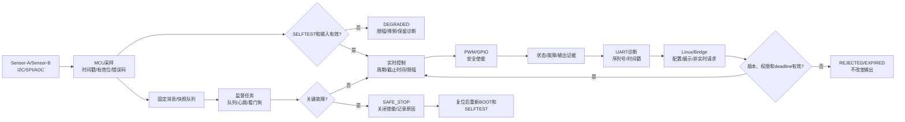

# 第9章 综合实验：传感、控制与 MCU/Linux 协同闭环

## 学习目标

完成本章后，读者应能够：

1. 把 GPIO、PWM、ADC、UART、SPI、I2C、实时调度和硬件验证组织成一个可分阶段执行的控制闭环。
2. 用资源账本、状态机、任务表和数据契约描述一个 MCU 侧综合实验，而不是直接把所有外设调用堆在一个循环里。
3. 区分 MCU 的实时控制责任与 Linux/Bridge 的配置、展示、日志和非实时请求责任。
4. 为输入有效性、输出安全、命令过期、队列溢出、通信断开和 MCU 复位设计可观察、可回归的处理路径。
5. 在进入第三篇 Linux 之前，交接一份可以被进程、服务、文件、网络和 Python 工具继续使用的边界说明。

## 导言：把八章知识合成为一条闭环

前八章分别讨论了 GPIO 的确定性输出、PWM 的定时波形、ADC 的模拟采样、UART 的字节流、SPI 的同步事务、I2C 的设备访问、实时任务调度以及硬件验证证据。本章不再增加一种孤立的外设 API，而是把这些知识放入同一个受约束的控制系统：

$$
\text{传感输入}
\rightarrow
\text{MCU 采样}
\rightarrow
\text{实时控制}
\rightarrow
\text{GPIO/PWM 输出}
\rightarrow
\text{诊断记录}
\rightarrow
\text{Linux/Bridge 展示与配置}
$$

这条链路的关键不在于“所有器件都能同时动起来”，而在于每个动作都有明确的所有者、输入都有有效性、输出都有安全状态、命令都有时效性、故障都有证据。综合实验因此应当先定义闭环和停止条件，再决定使用哪一个具体传感器、执行器、引脚和设备树节点。

本章中的引脚编号、外部器件型号、波特率、采样率、PWM 频率和量程都属于待核实参数。除非某个参数被目标板卡资料、当前 Core、Devicetree、接线记录和仪器观测共同确认，否则不能把它当作 UNO Q 的实机结论。

## 1. 综合实验需求：先写闭环，再写代码

### 1.1 逻辑系统目标

本实验使用两个逻辑输入、一个逻辑执行器和一条诊断/控制通道：

1. MCU 通过 I2C 或 SPI 读取 Sensor-A，得到带序列号、时间戳和有效位的离散传感值。
2. MCU 通过 ADC 读取 Sensor-B，执行范围检查、必要的滤波和校准记录。
3. 控制任务根据最近一组有效输入计算目标值，并执行限幅、斜率限制或模式约束。
4. 输出任务驱动 Actuator-A 的 PWM，同时通过 Safety-Enable GPIO 决定是否允许外部负载进入工作态。
5. 诊断任务通过 UART 输出状态、故障码、计数器和关键时间信息。
6. Linux/Bridge 负责展示状态、下发经过协议验证的配置或模式请求，以及保存可追溯日志。
7. 当输入无效、命令过期、队列溢出、关键输出故障或 Bridge 断开时，系统转入明确的降级或安全停止状态。

这里的 Sensor-A、Sensor-B 和 Actuator-A 是逻辑角色，不等于某个默认器件或 UNO Q 的固定物理接口。替换器件时，只替换角色到资源的映射和相应验证向量，不改变状态机、数据契约和安全不变量。

### 1.2 完成定义

| 维度 | 完成条件 | 证据 |
| --- | --- | --- |
| 资源 | 每个逻辑角色都有候选控制器、引脚、总线和所有者 | 资源账本、板卡资料、Devicetree 或 Core 配置 |
| 软件 | 采样、控制、输出、诊断、Bridge 和监督责任已分开 | 源码结构、任务表、构建日志 |
| 电气 | 电源、电平、上拉、负载、共地和保护条件已核实 | 接线表、照片、万用表或示波器记录 |
| 协议 | 帧版本、序列号、时间戳、错误码和结果状态已定义 | protocol-schema.md、原始日志 |
| 实时 | 周期、截止时间、超载策略和安全超时已定义 | 时间戳、波形、调度记录 |
| 安全 | BOOT、SELFTEST、DEGRADED、SAFE_STOP 的输出策略已定义 | 状态机、故障注入结果 |
| 验证 | 正常、异常、恢复和回归向量均有编号 | verification-matrix.csv、结论记录 |

若任一行只有口头说明而没有可保存证据，综合实验只能标记为设计完成，不能标记为硬件完成。

### 1.3 角色和所有权

| 逻辑角色 | 主要输入/输出 | 首要所有者 | 允许 Linux/Bridge 做什么 |
| --- | --- | --- | --- |
| Sensor-A | I2C 或 SPI 输入 | MCU 采样任务 | 读取镜像状态，不直接抢占总线 |
| Sensor-B | ADC 输入 | MCU 采样任务 | 读取已校验的快照，不解释原始引脚 |
| Actuator-A | PWM 输出 | MCU 输出任务 | 请求模式或目标，不能绕过限幅和安全使能 |
| Safety-Enable | GPIO 输出 | MCU 状态机/监督任务 | 查看状态，不能直接置为危险电平 |
| Diagnostics | UART 输出 | MCU 诊断任务 | 接收、存档和关联序列号 |
| Bridge | 配置、展示、日志 | Linux/Bridge 进程 | 发送有版本、有权限、有截止时间的请求 |

## 2. 资源账本与接口替代

### 2.1 逻辑资源表

| 资源编号 | 逻辑角色 | 候选接口 | 必须核实的事实 | 失败时的处理 |
| --- | --- | --- | --- | --- |
| R-SENS-A | Sensor-A | I2C 或 SPI | 控制器、片选或地址、电平、设备身份、所有者 | 标记输入无效，不更新控制目标 |
| R-SENS-B | Sensor-B | ADC | 输入范围、参考、采样率、保护、校准方法 | 限制输出或进入 DEGRADED |
| R-ACT-A | Actuator-A | PWM | 定时器通道、周期、极性、空载初值、负载安全 | 关闭 Safety-Enable 并记录故障 |
| R-SAFE | Safety-Enable | GPIO | 安全电平、复位状态、外部使能逻辑 | 进入 SAFE_STOP |
| R-DIAG | Diagnostics | UART | 电平、波特率、帧格式、缓冲和日志容量 | 保留本地状态，增加丢帧计数 |
| R-BRIDGE | Bridge | UART、文件、网络或受控 IPC | 协议版本、权限、超时、重连和结果语义 | MCU 不依赖 Bridge 维持本地安全闭环 |

资源账本的最小链条是：

逻辑角色 → Arduino/Zephyr API → Core/Devicetree → pinctrl/时钟 → 物理连接 → 设备协议 → 验证证据

任何一段缺失，都只能称为候选映射。尤其不能因为 Arduino API 可以编译，就推断某个引脚已经连接到目标定时器、ADC 通道或总线控制器。

### 2.2 最小硬件组合

为了降低首次风险，综合实验建议按以下顺序准备：

1. MCU 板卡和稳定供电，不连接外部执行器。
2. 一个可以明确识别的 Sensor-A，优先选择有身份寄存器或固定测试模式的器件。
3. 一个限流、低能量的 Sensor-B 输入，先使用可控电压源或受保护分压。
4. 一个带安全默认态的 Actuator-A 负载，先用示波器、逻辑分析仪或假负载代替真实机械负载。
5. 一路独立 UART 日志，以及可以保存原始帧的 Linux/Bridge 端。
6. 可选的逻辑分析仪、示波器和电源电流观测，用于把“代码执行”与“引脚真实变化”区分开。

外部器件的具体采购清单不属于本章固定内容。接入新器件时，先在资源账本增加器件身份、量程、电平、上拉、负载和安全动作，再写驱动调用。

## 3. 状态机：所有输出都必须有合法状态

### 3.1 状态定义

| 状态 | 进入条件 | 允许动作 | 禁止动作 |
| --- | --- | --- | --- |
| BOOT | 上电、复位或异常重启 | 初始化时钟、日志和内存；设置安全输出 | 直接启动外部负载 |
| SELFTEST | 基础初始化完成 | 检查设备身份、输入范围、队列和输出默认态 | 使用未经验证的输入驱动负载 |
| RUN | 自检通过且输入有效 | 采样、控制、限幅、输出和诊断 | 绕过截止时间或安全限幅 |
| DEGRADED | 非关键输入异常、Bridge 断开或资源暂时不可用 | 降低输出、保持诊断、等待恢复 | 继续使用过期数据进行无限制控制 |
| SAFE_STOP | 关键输出、状态机或电气条件异常 | 关闭安全使能、记录原因、等待人工或复位 | 自动恢复危险输出 |

### 3.2 状态转移事件

- 上电或复位：进入 BOOT。
- 初始化成功：进入 SELFTEST。
- 设备身份、输入范围和安全输出自检通过：进入 RUN。
- 非关键输入超时、Bridge 断开或可恢复队列异常：进入 DEGRADED。
- 关键输出故障、看门狗复位、控制数据越界或无法确认安全状态：进入 SAFE_STOP。
- 人工确认、重新上电并再次通过自检：从 SAFE_STOP 重新走 BOOT → SELFTEST，不能直接回到 RUN。

### 3.3 安全不变量

1. SAFE_STOP 中 Safety-Enable 必须处于已核实的安全电平。
2. 非 RUN 状态不能产生不受限的外部输出。
3. 控制任务只能使用未过期、已通过范围检查的输入快照。
4. Bridge 不能绕过 MCU 的限幅、权限和状态机。
5. 每次状态转移都要有单调序列号、时间戳和原因码。
6. 复位后不自动恢复危险输出，必须重新完成自检。
7. 结果状态 UNKNOWN 不得被 Bridge 当作 APPLIED，也不得无条件自动重试。

### 3.4 Fig-15：综合实验控制闭环架构图

<a id="fig-15-uno-q-stm32-integrated-control-boundary"></a>



图的箭头表示逻辑责任和证据流，不表示 UNO Q 上已经确认的物理连线。图中 Linux/Bridge 的请求必须回到 MCU 的版本、权限、deadline 和状态检查，不能从 Bridge 直接连到 PWM 或 Safety-Enable。

## 4. MCU 任务和数据契约

### 4.1 任务表

| 任务 | 触发方式 | 输入 | 截止时间关注点 | 输出 |
| --- | --- | --- | --- | --- |
| acquisition | 周期或外设完成事件 | Sensor-A、Sensor-B | 总线事务、ADC 采样和时间戳 | SensorFrame |
| control | 固定周期或新快照事件 | 最新有效 SensorFrame、模式 | 计算、限幅、输入新鲜度 | ControlDecision |
| output | 控制结果事件 | ControlDecision、状态机 | PWM/GPIO 更新和安全使能 | 输出状态、故障计数 |
| diagnostics | 周期、事件或错误 | 所有任务摘要 | 日志不可阻塞控制路径 | UART 帧、统计 |
| bridge | 接收事件或周期发送 | 请求帧、状态快照 | 解析、权限、deadline、队列 | ACCEPTED/REJECTED 等结果 |
| supervisor | 高频心跳或定时器 | 队列、任务心跳、状态 | 看门狗、过期检测、故障转移 | DEGRADED 或 SAFE_STOP |

任务表不是对具体线程优先级的承诺。优先级、栈大小、队列长度和时间预算必须结合目标构建、负载和测量确定。

### 4.2 SensorFrame

每次采样都应形成可以被控制任务和 Bridge 复用的快照，至少包含：

| 字段 | 含义 | 约束 |
| --- | --- | --- |
| schema_version | 数据结构版本 | 不识别的版本不能进入控制 |
| sequence | 采样序列号 | 单调递增或可检测回绕 |
| timestamp | MCU 采样时间 | 与控制时间基准一致 |
| source | Sensor-A 或 Sensor-B | 不用字段位置猜来源 |
| value | 原始值或工程值 | 同时记录单位和换算版本 |
| validity | 有效、超范围、超时、校准失败 | 控制前必须检查 |
| error | 设备、总线、范围或校准错误 | 可统计、可回放、可定位 |

控制任务需要记录“使用了哪个输入序列”，而不是只记录最后一次计算结果。这样可以区分旧数据控制、重复数据控制和新数据控制。

### 4.3 ControlDecision

控制结果至少需要包含：

- input_sequence：参与本次计算的输入序列。
- computed_at：计算完成时间。
- mode：正常、限幅、降级或安全停止。
- target：理论目标值。
- limited_target：应用范围、斜率和安全策略后的目标值。
- reason：限幅、输入无效、命令过期或故障原因。
- validity：结果是否允许进入输出任务。
- state_and_fault：当前状态和故障码。
- output_actions：PWM、GPIO 和 Safety-Enable 的明确动作。
- bridge_visibility：Bridge 可以看到 ACCEPTED、APPLIED、REJECTED、EXPIRED、FAILED 还是 UNKNOWN。

## 5. MCU/Linux Bridge 数据契约

### 5.1 请求帧

Linux/Bridge 发出的请求不能只包含一个命令字符串。建议至少包含：

| 字段 | 作用 | MCU 处理规则 |
| --- | --- | --- |
| protocol_version | 协议兼容性 | 不支持则 REJECTED |
| request_id | 请求关联 | 日志、重放和去重必须保留 |
| command | 模式、配置或受控目标 | 由权限表决定是否可用 |
| payload | 命令参数 | 做长度、类型、范围和状态检查 |
| sent_at | Bridge 发送时间 | 用于诊断，不替代 MCU 时间 |
| deadline | 请求截止时间 | 过期请求不得改变输出 |
| permissions | 请求者或能力标签 | 不能由客户端自报后直接信任 |

请求被接收不等于被应用。MCU 需要先验证协议版本、权限、当前状态、参数范围和 deadline，再把结果放入可追踪的状态帧。

### 5.2 结果状态

| 状态 | 含义 | Bridge 行为 |
| --- | --- | --- |
| ACCEPTED | 请求格式和权限通过，已进入 MCU 处理路径 | 等待后续结果，不宣称输出已改变 |
| APPLIED | MCU 已应用并记录对应输出动作 | 关联 request_id、状态和输出证据 |
| REJECTED | 协议、权限、状态或参数不允许 | 显示原因，不自动修改请求 |
| EXPIRED | 到达处理点时已超过 deadline | 记录时钟和延迟，不能重放原命令 |
| FAILED | MCU 明确执行失败 | 关联故障码和资源 |
| UNKNOWN | 通信或复位导致结果无法确认 | 保守展示，人工决定是否发起新请求 |

ACCEPTED、APPLIED 和 UNKNOWN 必须严格区分。Bridge 进程重启后，应从 MCU 查询状态快照或等待新序列，不能凭本地缓存推断 Actuator-A 当前已经执行了什么。

### 5.3 Bridge 断开与恢复

Bridge 断开时，MCU 仍应执行本地采样、控制、输出安全策略和监督任务。具体动作由实验需求决定：

- 若本地闭环可以安全保持，则进入 DEGRADED，降低输出或保持受限目标。
- 若本地闭环缺少必须的授权或输入，则进入 SAFE_STOP。
- Bridge 恢复后先重新协商协议版本、能力和状态序列，再接收新请求。
- 重连不能重放超时请求；需要使用新的 request_id 和新的 deadline。
- 所有断开、重连、丢帧、队列满和状态变化都写入诊断日志。

## 6. Arduino/Zephyr 综合代码骨架

### 6.1 Arduino 状态机概念骨架

下面代码只表达状态转移和安全默认态。SAFETY_ENABLE_PIN 是占位符，不能当作 UNO Q 的物理引脚结论；Sensor-A、Sensor-B、PWM 和实际故障检测仍需按目标资源账本补齐。

代码说明
- 用途：演示 MCU 侧如何把启动、自检、运行、降级和安全停止放进一个显式状态机。
- 运行环境：Arduino Core on Zephyr 的概念片段；本章未在目标板编译、上传或接线。
- 文件位置：概念片段；尚未创建可直接刷写的综合实验工程。
- 依赖：目标 Core 提供 Arduino.h、pinMode、digitalWrite、millis 等 API；安全电平和占位引脚必须先由板卡资料核实。
- 操作步骤：先建立资源账本，替换占位引脚和自检函数，再执行无负载构建、上传、串口观察和输入超时测试。
- 预期输出：上电后保持安全输出；自检通过且输入有效时进入 RUN；输入过期时进入 DEGRADED；关键故障时进入 SAFE_STOP。
- 故障排查：先区分状态机逻辑、引脚映射、输入有效位和实际负载问题；不要用提高日志频率的方式掩盖截止时间超载。
- 验证方式：记录状态序列、输入序列、时间戳、输出动作和故障注入编号；本章只提供代码结构，未产生实机结果。

```cpp
#include <Arduino.h>

enum class AppState { BOOT, SELFTEST, RUN, DEGRADED, SAFE_STOP };

constexpr uint8_t SAFETY_ENABLE_PIN = 2U;  // 占位，不代表 UNO Q 物理引脚
constexpr uint32_t INPUT_TIMEOUT_MS = 100U;

AppState state = AppState::BOOT;
uint32_t last_input_ms = 0U;
bool input_valid = false;

void set_safe_output()
{
  digitalWrite(SAFETY_ENABLE_PIN, LOW);
  // 实际工程还应把 PWM 目标置为安全值，并记录原因码。
}

bool run_self_test()
{
  // 占位：检查传感器身份、输入范围、队列和输出默认态。
  return true;
}

void enter_state(AppState next)
{
  state = next;
  if (next == AppState::DEGRADED || next == AppState::SAFE_STOP) {
    set_safe_output();
  }
}

void setup()
{
  pinMode(SAFETY_ENABLE_PIN, OUTPUT);
  set_safe_output();
  enter_state(AppState::SELFTEST);

  if (run_self_test()) {
    enter_state(AppState::RUN);
  } else {
    enter_state(AppState::SAFE_STOP);
  }
}

void loop()
{
  const uint32_t now_ms = millis();

  // 实际工程应由采样任务更新 input_valid 和 last_input_ms。
  if (input_valid && (now_ms - last_input_ms) <= INPUT_TIMEOUT_MS) {
    if (state == AppState::DEGRADED) {
      enter_state(AppState::RUN);
    }
  } else if (state == AppState::RUN) {
    enter_state(AppState::DEGRADED);
  }

  if (state == AppState::DEGRADED || state == AppState::SAFE_STOP) {
    set_safe_output();
  }
}
```

这段骨架有四个刻意的限制：

1. 安全电平被集中到 set_safe_output，避免不同任务各自写出相反的默认态。
2. 自检函数必须返回可记录的原因，而不是只返回一个无法解释的布尔值；这里为了保持骨架短小才使用布尔结果。
3. 输入新鲜度使用单调时间差判断；真实工程还要处理时间基准、序列号重复、范围错误和传感器重启。
4. DEGRADED 到 RUN 的自动恢复只适合经过需求批准的场景；关键执行器通常应要求人工确认或重新自检。

### 6.2 Zephyr 结果帧概念骨架

Zephyr 侧片段强调结果语义和 deadline 检查。它不负责证明具体设备树节点、线程优先级或 UART 线路已经正确。

代码说明
- 用途：演示 Bridge 请求处理后如何生成可区分 ACCEPTED、APPLIED、REJECTED、EXPIRED、FAILED 和 UNKNOWN 的状态帧。
- 运行环境：Zephyr API 的概念片段；本章未执行 west 构建、烧录、串口采集或跨处理器联调。
- 文件位置：概念片段；尚未创建可独立构建的 Zephyr 应用目录。
- 依赖：Zephyr kernel 和 printk；实际项目还需要协议编解码、权限表、传输驱动和持久化日志。
- 操作步骤：先固定协议 schema 和错误码，再把状态帧接入传输层；先测试过期命令和未知结果，再开放真实输出。
- 预期输出：过期命令返回 EXPIRED；合法命令可先返回 ACCEPTED，再在输出动作确认后返回 APPLIED。
- 故障排查：若状态停留在 UNKNOWN，先检查复位、传输和日志关联，不要把 UNKNOWN 改写成 APPLIED 或无条件重试。
- 验证方式：用固定 request_id、deadline 和故障注入向量进行回放，核对 MCU 状态帧、Bridge 日志和输出证据；本章未执行实测。

```c
#include <stdbool.h>
#include <stdint.h>

#include <zephyr/kernel.h>
#include <zephyr/sys/printk.h>

enum result_state {
  RESULT_ACCEPTED,
  RESULT_APPLIED,
  RESULT_REJECTED,
  RESULT_EXPIRED,
  RESULT_FAILED,
  RESULT_UNKNOWN,
};

struct status_frame {
  uint16_t protocol_version;
  enum result_state state;
  uint32_t sequence;
  uint32_t timestamp_ms;
  uint16_t error_code;
  bool input_valid;
  bool output_enabled;
};

static bool command_is_current(uint32_t deadline_ms)
{
  return k_uptime_get_32() <= deadline_ms;
}

static struct status_frame make_status(enum result_state state,
                                       uint32_t sequence,
                                       uint16_t error_code,
                                       bool input_valid,
                                       bool output_enabled)
{
  struct status_frame frame = {
    .protocol_version = 1U,
    .state = state,
    .sequence = sequence,
    .timestamp_ms = k_uptime_get_32(),
    .error_code = error_code,
    .input_valid = input_valid,
    .output_enabled = output_enabled,
  };
  return frame;
}

static void report_status(const struct status_frame *frame)
{
  printk("status seq=%u state=%d time=%u error=%u input=%d output=%d\n",
         frame->sequence,
         frame->state,
         frame->timestamp_ms,
         frame->error_code,
         frame->input_valid,
         frame->output_enabled);
}

void handle_command(uint32_t deadline_ms, uint32_t sequence)
{
  if (!command_is_current(deadline_ms)) {
    const struct status_frame expired =
      make_status(RESULT_EXPIRED, sequence, 1001U, true, false);
    report_status(&expired);
    return;
  }

  const struct status_frame accepted =
    make_status(RESULT_ACCEPTED, sequence, 0U, true, false);
  report_status(&accepted);

  // 实际工程在这里执行权限、范围、状态和资源检查。
  const bool applied = false;

  if (applied) {
    const struct status_frame done =
      make_status(RESULT_APPLIED, sequence, 0U, true, true);
    report_status(&done);
  } else {
    const struct status_frame failed =
      make_status(RESULT_FAILED, sequence, 2001U, true, false);
    report_status(&failed);
  }
}
```

这里的 applied 固定为 false，是为了提醒读者“接受请求”与“应用输出”必须由两个可验证事件支撑。真实工程应由输出任务或硬件反馈产生 APPLIED；如果 MCU 在动作后复位、传输中断或日志关联丢失，只能产生 UNKNOWN 或要求重新查询状态。

## 7. 分阶段综合实验

| 阶段 | 实验范围 | 关键动作 | 放行证据 | 失败处理 |
| --- | --- | --- | --- | --- |
| A：无负载启动 | MCU、日志、状态机 | 上电进入 BOOT/SELFTEST，不连接外部执行器 | 启动日志、版本、状态序列 | 修复构建、复位和安全默认态 |
| B：单输入 | Sensor-A 或 Sensor-B | 只验证一条输入链路和有效位 | 原始值、工程值、时间戳、错误码 | 保持输出关闭，检查电气和协议 |
| C：空载输出 | PWM/GPIO、假负载 | 验证周期、极性、空载初值和 Safety-Enable | 波形、输出状态、关闭动作 | 立即断开负载，回到资源账本 |
| D：输入到输出 | 单输入、单输出 | 输入有效时控制，过期时降级 | input_sequence、控制结果、输出波形 | 禁止扩大负载，分析截止时间 |
| E：跨处理器协同 | MCU、Linux/Bridge | 配置、状态查询、断开、重连和结果关联 | request_id、状态帧、Bridge 日志 | MCU 保持本地安全策略，重新协商 |
| F：故障回归 | 全链路 | 执行故障注入矩阵和重复运行 | 故障编号、恢复路径、回归差异 | 未解释差异不得进入下一章 |

每个阶段都应保存源代码提交、构建命令、板卡版本、接线状态、日志和结论。只保存“成功截图”无法证明失败路径没有改变系统状态。

## 8. 故障注入矩阵

| 编号 | 故障注入 | MCU 预期行为 | Bridge 预期行为 | 主要证据 |
| --- | --- | --- | --- | --- |
| FI-01 | Sensor-A 断开或设备身份错误 | SensorFrame 无效；进入 DEGRADED 或 SAFE_STOP | 显示输入故障，不发送未经批准的替代值 | 总线日志、状态序列、故障码 |
| FI-02 | ADC 输入超范围 | 拒绝该样本，限制输出 | 展示范围错误和最后有效序列 | 原始码、范围判断、输出波形 |
| FI-03 | PWM 负载断开 | 保持或关闭 Safety-Enable，记录输出异常 | 关联执行器故障，不宣称 APPLIED | 波形、电流、状态帧 |
| FI-04 | UART 帧校验错误 | 丢弃帧、计数并保持本地状态 | 标记丢帧或等待新快照 | 原始字节、校验计数 |
| FI-05 | SPI/I2C NACK 或超时 | 本次输入无效，按策略降级 | 不把旧值伪装成新值 | 总线时序、错误码、input_sequence |
| FI-06 | 控制队列满 | 丢弃有界的低优先级消息或进入降级 | 收到队列满结果并停止突发重试 | 队列水位、丢弃计数 |
| FI-07 | Bridge 断开 | 本地闭环继续或进入安全状态 | 记录断开，恢复后重新握手 | 断开时间、MCU 状态、重连序列 |
| FI-08 | deadline 已过期 | 返回 EXPIRED，不改变输出 | 不重放原 request_id | request_id、deadline、处理时间 |
| FI-09 | 协议版本不匹配 | 返回 REJECTED 和支持版本 | 提示升级或降级方案 | 协议帧、拒绝原因 |
| FI-10 | MCU 复位 | 输出回到安全态，重新 BOOT/SELFTEST | 进入 UNKNOWN 或重新查询状态 | 复位原因、启动序列、输出波形 |

故障注入要先确认能安全停止。不能为了验证“负载断开”而在未知机械机构上直接拔线；应优先使用无负载、假负载、模拟故障或受控电源路径。

## 9. 综合验证矩阵和证据包

### 9.1 验证矩阵

| 编号 | 主张 | 验证方式 | 最小证据 | 状态 |
| --- | --- | --- | --- | --- |
| INT-01 | 逻辑资源有唯一所有者 | 资源账本和资料比对 | ledger、资料链接、版本 | NOT_RUN |
| INT-02 | 启动不会立即产生危险输出 | 上电和复位观察 | 状态日志、Safety-Enable 波形 | NOT_RUN |
| INT-03 | 输入快照可识别、可判定有效 | 传感器正常/异常运行 | 原始值、时间戳、validity | NOT_RUN |
| INT-04 | 控制周期、限幅和截止时间可观测 | 负载和输入边界测试 | 控制日志、波形、超载计数 | NOT_RUN |
| INT-05 | Bridge 结果状态可重放 | 请求、响应、断开和重连 | request_id、状态帧、Bridge 日志 | NOT_RUN |
| INT-06 | 故障进入预期降级或安全停止 | 执行 FI-01～FI-10 | fault matrix、状态转移、输出证据 | NOT_RUN |
| INT-07 | 恢复不会绕过自检 | 复位、重连和人工确认 | 启动序列、权限日志 | NOT_RUN |
| INT-08 | 代码、协议和接线变更可回归 | 重复运行基线向量 | 提交号、差异报告、结论 | NOT_RUN |

### 9.2 证据包建议结构

```text
integrated-experiment/
└── <run-id>/
    ├── requirements.md
    ├── resource-ledger.md
    ├── state-machine.md
    ├── protocol-schema.md
    ├── source-commit.txt
    ├── build-and-flash.log
    ├── wiring-and-instrumentation.md
    ├── mcu-serial.log
    ├── bridge-log.jsonl
    ├── waveform/
    ├── fault-injection.md
    ├── verification-matrix.csv
    └── conclusion.md
```

其中 source-commit.txt 记录源码和配置提交，build-and-flash.log 记录实际命令和工具版本，mcu-serial.log 与 bridge-log.jsonl 保留原始时间序列，waveform/ 保存带通道说明的波形。结论文件必须明确哪些主张已通过实测、哪些仍是设计或代码审查结果。

## 10. 进入第三篇前的边界交接

完成本章的设计和后续实测后，第二篇应向第三篇交接以下稳定接口：

- MCU ownership：每类 GPIO、PWM、ADC、UART、SPI、I2C 和 Safety-Enable 由谁拥有。
- Command/status/result：请求、状态、结果、错误码和版本的结构与兼容策略。
- Sequence/timestamp/deadline：序列号、MCU 时间戳和截止时间的含义、来源及回绕处理。
- Safe states：BOOT、SELFTEST、DEGRADED、SAFE_STOP 的输出策略和恢复条件。
- Linux permissions：Linux/Bridge 可以配置、查询、展示和记录什么，哪些动作必须被 MCU 拒绝。
- Unverified limits：尚未核实的引脚、时序、量程、负载和实测边界。
- Build/flash/log/replay：如何构建、烧录、抓取日志、关联 request_id 并重放验证向量。

第三篇可以在此基础上讨论 Linux 进程、设备、服务、文件、网络和 Python 工具，但不能用 Linux 的便利性替换 MCU 的实时控制环。Linux/Bridge 负责更丰富的计算和交互，MCU 负责有界的采样、控制、输出和安全停止。

## 11. 本章验证结果

截至 2026-09-21，本章完成了以下文档级工作：

- 把第二篇第 1～8 章的 GPIO、PWM、ADC、UART、SPI、I2C、实时调度和硬件验证知识合并到资源账本、状态机和综合验证矩阵。
- 写明了 SensorFrame、ControlDecision、Bridge 请求和结果状态的最小契约，并保留了 ACCEPTED、APPLIED、UNKNOWN 的差异。
- 创建 Fig-15 Mermaid 源文件，并让正文内联 Mermaid 与源文件保持一致。
- 提供 Arduino 状态机和 Zephyr 结果帧的概念骨架，代码说明字段完整。
- 明确故障注入、回归、证据包和第二篇到第三篇的边界交接。

本章仍是 draft。当前未完成具体器件接线、Arduino CLI 或 west 构建、烧录、串口采集、波形测量、Bridge 实际联调、故障注入和回归运行，因此不把综合实验声明为硬件实测完成。

## 12. 常见问题

### Q1：综合实验是否必须一次接入所有外部设备？

不必须。应按 A 到 F 的阶段逐步增加资源。先验证无负载启动和单输入，再验证空载输出，最后才进行跨处理器协同和故障回归。逐步增加资源可以把软件、接线、电气和负载问题分开。

### Q2：Arduino 和 Zephyr 两段骨架能直接烧录吗？

不能。它们是概念骨架，缺少目标板卡资源映射、设备树、实际驱动、协议编解码、构建文件和安全审查。能够通过语法检查也不等于物理资源和输出安全已经确认。

### Q3：Linux 能否直接写 PWM 或 Safety-Enable？

在本书的综合闭环中，不能把 Linux 直接写外部安全输出作为默认方案。Linux 可以提出请求或展示状态，但最终由 MCU 状态机、限幅、权限、deadline 和监督任务决定是否应用。若项目确实需要 Linux 直接拥有某资源，必须重新定义所有权并完成独立安全评审。

### Q4：传感器暂时没有新值时能不能继续使用上一值？

只能按明确的有效期和降级策略使用。上一值必须带原始时间戳、序列号和 freshness 判断；超过期限后应限制输出、进入 DEGRADED 或 SAFE_STOP，不能无期限保持。

### Q5：本章完成后，第二篇是否全部完成？

文档结构上，第二篇的第 1～9 章已形成从单一外设到综合闭环的初稿；实验验证上仍未完成目标硬件构建、烧录、接线、测量、Bridge 联调和回归。因此“章节完成”不等于“硬件实验完成”。

## 13. 本章小结

综合实验的最小闭环可以概括为五个约束：

1. 输入必须有来源、时间戳、有效位和错误码。
2. 输出必须经过状态机、限幅和安全使能。
3. 请求必须经过版本、权限、参数和 deadline 检查。
4. 故障必须由明确的所有者处理，并留下可以关联的证据。
5. 复位、断开和重试必须遵循可重放、不可误判的结果语义。

如果这五个约束还没有写进资源账本、状态机、协议 schema 和验证矩阵，就不应急于增加更复杂的 Linux 服务或 AI 功能。

## 14. 交叉引用与参考资料

- [第二篇第 3 章：ADC 与模拟采样](./第3章_ADC与模拟采样_从电压读数到可验证数据.md)
- [第二篇第 6 章：I2C 通信与总线恢复](./第6章_I2C通信_从设备地址到总线恢复.md)
- [第二篇第 7 章：实时任务与调度](./第7章_实时任务与调度_从周期循环到可验证响应.md)
- [第二篇第 8 章：硬件验证与故障定位](./第8章_硬件验证与故障定位_从接线检查到证据闭环.md)
- [第二篇图示登记](../../images/第2篇_STM32/README.md)
- [参考资料索引](../../resources/references.md)
- [Arduino UNO Q User Manual](https://github.com/arduino/docs-content/blob/main/content/hardware/02.uno/boards/uno-q/tutorials/01.user-manual/content.md)
- [ArduinoCore-zephyr](https://github.com/arduino/ArduinoCore-zephyr)
