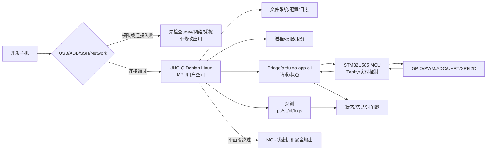

# 第1章 Linux 侧开发基础：文件系统、进程与 MCU 边界

## 学习目标

完成本章后，读者应能够：

1. 解释 Arduino UNO Q 上 Linux/MPU、Arduino App、Bridge 和 STM32/MCU 的职责边界。
2. 按 Linux 文件系统、设备节点、进程、权限、日志和网络入口组织一次可复现的系统检查。
3. 区分“程序已经启动”“服务已经运行”“设备已经可用”“MCU 已应用控制结果”这几个不同事实。
4. 使用只读命令收集主机名、内核、发行版、挂载点、磁盘、进程和工具入口信息，并保存为证据。
5. 在不直接修改 MCU 实时输出的前提下，建立 Linux 侧与第二篇综合实验契约的衔接。
6. 为后续章节的设备、网络、服务和 Python Bridge 学习准备稳定的术语和实验方法。

## 导言：Linux 是系统的一半，不是 MCU 的替代品

第二篇已经把 STM32U585 MCU 侧的 GPIO、PWM、ADC、UART、SPI、I2C、实时调度、硬件验证和综合闭环组织起来。本篇转向 UNO Q 的另一侧：Qualcomm Dragonwing QRB2210 微处理器（MPU）运行的 Debian Linux 用户空间。

UNO Q 的双处理器设计意味着一个动作可能跨越多个层次：

$$
\text{Linux 进程}
\rightarrow
\text{App/Bridge 请求}
\rightarrow
\text{MCU 状态机}
\rightarrow
\text{实时外设输出}
$$

这条链路不能被简化成“Linux 调一个函数，硬件就已经完成动作”。Linux 侧的进程可能只是创建了请求，Bridge 可能只是返回了接收结果，MCU 可能仍在检查状态、权限、范围和 deadline，最终输出还需要独立证据确认。

本章建立 Linux 篇的基础坐标系：文件放在哪里，程序如何成为进程，设备如何出现，权限从哪里来，日志如何保存，Linux 请求如何回到 MCU 的安全边界。这里的命令和代码以可观察、可回滚、低风险为优先；除非特别说明，不执行写入系统配置、安装软件、刷写镜像或改变硬件输出的操作。

## 1. Linux 侧的角色与边界

### 1.1 UNO Q 的两类执行单元

| 执行单元 | 运行环境 | 更适合的责任 | 不应默认承担的责任 |
| --- | --- | --- | --- |
| MPU | Debian Linux 用户空间 | 文件、网络、进程、服务、日志、较重计算、应用编排 | 严格周期控制、微秒级截止时间和未经授权的安全输出 |
| MCU | STM32U585、Arduino Core on Zephyr | GPIO、PWM、ADC、UART、SPI、I2C、实时控制、状态机和安全停止 | 文件系统、复杂网络服务和不可控的长时间阻塞 |
| Bridge | Linux 与 MCU 两侧的 RPC/通信层 | 请求、状态、结果、序列号、时间戳和错误关联 | 替代 MCU 的限幅、权限检查和安全状态机 |
| App | 由 Arduino 工具链组织的 Linux/MCU 应用 | 把 Linux 脚本、Arduino Sketch、容器或 Brick 组织为项目 | 把“应用启动”误报成“硬件动作已应用” |

Arduino 官方资料将 UNO Q 描述为同时包含 Debian Linux MPU 和运行 Arduino Core on Zephyr 的 STM32U585 MCU 的双处理器平台；官方 App CLI 负责管理和运行包含 Linux 与微控制器部分的 Arduino App。具体版本、默认用户、服务名和设备节点仍必须以目标板当前镜像和实际检查结果为准。

### 1.2 事实等级

Linux 实验中至少要区分以下事实：

| 事实等级 | 例子 | 最小证据 |
| --- | --- | --- |
| 资料事实 | 官方文档声明板卡运行 Debian Linux | 官方页面、核验日期 |
| 环境事实 | 当前板卡的内核、发行版、挂载点和接口 | 命令原始输出 |
| 进程事实 | 某个 PID 已创建、退出码为 0 或收到信号 | 进程表、退出码、日志 |
| 服务事实 | 某个服务已被管理器加载并保持运行 | 服务管理器状态、日志 |
| 设备事实 | 设备节点存在且当前用户有权限访问 | 设备节点、权限、读写测试 |
| 控制事实 | MCU 已接受、应用或拒绝某个请求 | request_id、状态帧、输出证据 |

“命令没有报错”只能证明命令进程没有报告错误，不能自动升级为设备、服务或 MCU 控制事实。

## 2. 执行边界图

### 2.1 Linux 到 MCU 的最小路径

<a id="fig-16-uno-q-linux-execution-boundary"></a>



图 3-1 只表达逻辑责任和观测路径，不承诺某个具体 USB 模式、SSH 地址、设备节点或 App 版本。图中的“连接通过”还不是“应用可用”；连接之后仍要分别检查权限、进程、服务、Bridge 和 MCU 结果。

### 2.2 四个必须分开的边界

1. **访问边界**：主机能否通过 USB、ADB、SSH 或网络到达 Linux。
2. **进程边界**：Linux 上的程序是否创建、运行、退出以及写出日志。
3. **设备边界**：内核是否暴露设备节点，当前用户是否有访问权限，驱动是否完成初始化。
4. **控制边界**：Bridge 请求是否经过 MCU 的版本、权限、范围、状态和 deadline 检查，并得到可关联的结果。

后续排错时，必须从左到右确认这些边界。不能因为 SSH 登录成功，就跳过设备和控制边界；也不能因为日志中出现了发送字样，就把请求升级为 APPLIED。

## 3. Linux 文件系统：先知道证据放在哪里

### 3.1 常见路径的职责

Linux 篇不要求读者死记某个镜像的所有目录，而是先建立“路径职责”：

| 路径 | 典型职责 | 使用边界 |
| --- | --- | --- |
| / | 根文件系统入口 | 只读检查挂载和容量；不要在未知目录执行批量操作 |
| /home/用户目录 | 用户项目、脚本和实验输出 | 优先把个人实验放在用户目录下，便于备份和回滚 |
| /tmp | 临时文件 | 默认不作为长期证据目录，重启或清理后可能消失 |
| /var/log | 系统或服务日志 | 读取前先确认权限和日志轮转策略，不假定所有应用都写这里 |
| /dev | 内核暴露的设备节点 | 节点存在不等于设备就绪，也不等于当前用户可访问 |
| /proc | 内核和进程的动态观测接口 | 内容是运行时视图，不是普通持久化文件 |
| /sys | 设备、驱动和内核对象的动态观测接口 | 读取可用于诊断；写入可能改变系统状态，初学阶段保持只读 |
| /run | 启动以来的运行时状态和套接字 | 内容可能随重启改变，不适合作为唯一长期证据 |
| /etc | 系统和服务配置 | 先读取和备份；修改必须有明确回滚方案 |

这里的“用户目录”是占位符，不暗示 UNO Q 的默认用户名或固定家目录。实际实验中先使用 pwd、id 和 echo "$HOME" 检查当前身份，再决定输出目录。

### 3.2 “存在、可读、可写、可用”四层判断

以一个设备节点或配置文件为例，诊断至少分为四问：

1. 路径是否存在？
2. 当前用户是否能读取？
3. 业务需要写入时，当前用户是否有明确的写权限？
4. 目标驱动、服务或应用是否真的已初始化并能完成一次受控操作？

对设备节点直接执行写入不是通用的“可用性测试”。优先选择设备专用的查询命令、服务状态、日志和最小无副作用读取；如果必须执行写操作，先记录目标、备份、停止条件和回滚动作。

## 4. 进程：程序运行起来之后发生了什么

### 4.1 进程的最小模型

Linux 中，程序文件只是磁盘上的输入；执行后才创建进程。进程至少有：

- PID：当前进程标识。
- PPID：父进程标识，用于理解启动链。
- 状态：运行、睡眠、停止、僵尸或其他内核状态。
- 标准输入、输出和错误：可能连接终端、文件、管道或服务日志。
- 环境：工作目录、用户、环境变量和权限。
- 退出状态：通常由父进程或启动器收集，用于判断进程如何结束。

一个应用“窗口出现”或命令返回不能代替对 PID、退出码和日志的检查。后台运行尤其要保存 PID 或使用明确的进程管理器，否则后续无法判断日志来自哪一次启动。

### 4.2 信号和停止

信号是进程间传递控制意图的机制。对实验程序，最重要的原则是：

- 先观察进程和日志，再决定是否停止。
- 优先对自己启动、自己记录 PID 的进程发送终止请求。
- 不使用模糊的进程名批量终止。
- 进程退出后检查退出码和日志尾部。
- 如果进程被管理器拉起，先识别管理器的重启策略，否则手动停止后可能立即被重新启动。

SIGTERM 通常表达“请有序退出”的意图，但具体程序是否处理、多久退出和是否清理资源，仍需要通过日志和进程状态验证。SIGKILL 无法给程序清理机会，应作为最后手段，不作为第一种排错方法。

### 4.3 服务不是普通后台进程

服务通常还涉及启动顺序、权限、环境、重启策略、日志收集和设备依赖。后续章节会单独讨论服务；本章只要求读者先记录：

| 问题 | 需要保存的证据 |
| --- | --- |
| 谁启动了它 | 父进程、服务管理器或 App 入口 |
| 使用什么用户 | 进程身份和文件权限 |
| 工作目录是什么 | 服务配置或进程观测 |
| 失败后会不会重启 | 管理器状态和重启策略 |
| 日志在哪里 | 标准输出、文件、系统日志或 App 日志 |
| 它是否拥有硬件控制权 | 资源账本和 MCU/Bridge 契约 |

## 5. 访问 UNO Q Linux：USB、ADB、SSH 与网络

### 5.1 访问方式的差异

Arduino UNO Q 官方用户手册说明了多种访问路径：USB 连接下可以使用 ADB，网络路径可以使用 SSH 或 Arduino App Lab 的 Network Mode；Network Mode 依赖本地网络发现，能通过 SSH 或 IP 访问并不保证 App Lab 一定能发现设备。

| 入口 | 适合做什么 | 主要前置条件 | 常见误区 |
| --- | --- | --- | --- |
| USB/ADB | 初始配置、近端 shell、设备枚举和低层维护 | USB 连接、主机权限、ADB 设备可见 | 把 ADB 可见当作应用或网络已就绪 |
| SSH | 远程 shell、文件和进程操作 | 网络可达、SSH 服务、账号凭据 | 把登录成功当作 Bridge 或设备节点已就绪 |
| App Lab Network Mode | 通过官方工具发现和运行 App | 同网段、mDNS、主机防火墙允许发现 | IP 可达但 mDNS 被阻断时误判为板卡故障 |
| 本地显示器/键盘 | 单板机模式下的本地操作 | USB-C 供电、显示和输入设备 | 忽略本地会话、用户和权限差异 |

访问入口本身有权限和安全风险。实验报告中不得记录密码、私钥或完整令牌；只保存连接方式、主机名/IP 的必要部分、时间和结果。

### 5.2 Linux 主机的 USB 权限边界

官方用户手册给出了 UNO Q 常规模式和 Emergency Download Mode 使用的 USB 标识，并要求 Linux 主机通过 udev 规则配置用户访问权限。这个配置属于**开发主机的权限层**，不是 UNO Q Linux 内部的业务程序权限。

因此，遇到 ADB 或刷写失败时要先区分：

1. 板卡是否已经连接并处于预期 USB 模式。
2. 主机是否能枚举目标 VID/PID。
3. udev 规则是否存在且已重新加载。
4. 当前用户是否获得设备访问权限。
5. ADB 服务或刷写工具是否已经看到设备。

本章不直接执行需要 sudo 的 udev 修改；只记录官方路径和只读检查方法。真正修改前必须确认目标主机、备份现有规则、保留回滚文件并重新插拔设备。

### 5.3 SSH 的安全边界

SSH 让 Linux 侧进入可持续的远程运维环境，但它不会自动授予 MCU 输出权限。进入远程 shell 后仍然要遵守：

- 先执行只读检查，确认主机名、用户、工作目录、发行版和网络接口。
- 代码和日志使用明确目录，避免在系统目录随意创建文件。
- 复制文件前核对目标路径、文件所有者和剩余空间。
- 执行服务或 App 操作前保存当前状态和日志位置。
- 不在仓库、脚本或终端输出中写入密码、私钥和访问令牌。

## 6. Linux 与 MCU/Bridge 的职责契约

### 6.1 Linux 可以做什么

Linux 侧通常适合：

- 采集和保存 MCU 状态帧、日志和波形索引。
- 运行较重的算法、文件处理、网络接口和用户交互。
- 提出模式、配置或受控目标请求。
- 对请求进行本地格式校验、去重和审计。
- 在 Bridge 断开后保留请求状态，并在恢复后重新查询 MCU。

这些动作都不能绕过第二篇第 9 章定义的 MCU 状态机。Linux 本地缓存的“已发送”不等于 MCU 的 ACCEPTED；Bridge 的“已收到”不等于 APPLIED。

### 6.2 Linux 不应直接假定什么

| Linux 侧观察 | 不能直接推出的结论 |
| --- | --- |
| Python 或 shell 进程仍在运行 | MCU 控制任务仍在按期运行 |
| Bridge 套接字连接成功 | 当前请求已通过 MCU 权限和状态检查 |
| 日志出现 send | 输出已经在物理引脚产生 |
| App CLI 返回成功 | 目标执行器已经进入期望状态 |
| 设备节点存在 | 驱动、总线和外部器件都已正常 |
| SSH 会话保持 | 网络、服务和控制链路一直健康 |

要把观察升级为控制事实，必须关联 request_id、MCU 序列号、时间戳、状态码和必要的 GPIO/PWM/负载证据。

### 6.3 数据方向和权限

建议把 Linux/Bridge 契约分成三类消息：

| 消息类别 | Linux 作用 | MCU 责任 |
| --- | --- | --- |
| 状态快照 | 展示、存档、告警和回放 | 提供来源、序列号、时间戳、有效位和故障码 |
| 配置请求 | 提出模式、阈值或非实时参数 | 校验版本、权限、范围、状态和 deadline |
| 控制结果 | 关联 ACCEPTED、APPLIED、REJECTED、EXPIRED、FAILED、UNKNOWN | 只报告有证据支持的状态，不能把未知写成成功 |

Linux 应把 MCU 当作一个有状态、有边界的控制服务，而不是一个可以随意写寄存器的远程设备。

## 7. 第一个 Linux 实验：只读盘点与证据保存

### 7.1 实验目标

本实验不安装软件、不修改 udev、不启动 App、不改变 MCU 输出。它只回答：

- 当前 Linux 是什么内核和发行版？
- 当前用户、主机名和工作目录是什么？
- 根文件系统挂载在哪里、剩余多少空间？
- 常见访问工具是否存在？
- 当前有哪些进程可观察？
- 结果文件是否能被后续实验引用？

### 7.2 只读盘点脚本

代码说明
- 用途：收集 Linux 侧身份、内核、发行版、挂载点、磁盘、进程和工具入口，形成一次带时间戳的只读检查记录。
- 运行环境：UNO Q Debian Linux shell；也可在普通 Debian/Ubuntu 主机上先演练。
- 文件位置：概念脚本；建议保存为 linux-inventory.sh，由用户目录下的实验目录调用。
- 依赖：bash、date、uname、cat、findmnt、df、ps、head、tee；缺少可选工具时脚本仍应保留主体结果。
- 操作步骤：先检查脚本内容和目标输出路径，再执行；脚本只读取系统信息并在指定位置创建报告，不使用 sudo、不写 /etc、不访问外部网络。
- 预期输出：生成一个包含身份、系统、文件系统、进程和工具可见性的文本报告；这是示例结构，不是本次 UNO Q 实机输出。
- 故障排查：若某个命令不存在，记录缺失项并继续；若输出目录不可写，改用当前用户有权限的目录，不要直接提高权限。
- 验证方式：保存命令、脚本版本、执行时间和原始报告；将报告中的环境事实与后续服务、设备和 Bridge 证据分开。

```bash
#!/usr/bin/env bash
set -eu

out="uno-q-linux-inventory-$(date -u +%Y%m%dT%H%M%SZ).txt"
if [ "$#" -ge 1 ]; then
  out="$1"
fi

{
  printf '%s\n' '== identity =='
  id
  printf 'host=%s\n' "$(hostname)"
  printf 'pwd=%s\n' "$PWD"
  printf 'home=%s\n' "$HOME"

  printf '%s\n' '== kernel =='
  uname -a

  printf '%s\n' '== distribution =='
  if [ -r /etc/os-release ]; then
    cat /etc/os-release
  else
    printf '%s\n' 'os-release=unavailable'
  fi

  printf '%s\n' '== filesystem =='
  findmnt /
  df -h /

  printf '%s\n' '== selected tools =='
  for tool in adb ssh arduino-app-cli; do
    if command -v "$tool" >/dev/null 2>&1; then
      printf '%s=%s\n' "$tool" "$(command -v "$tool")"
    else
      printf '%s=unavailable\n' "$tool"
    fi
  done

  printf '%s\n' '== processes =='
  ps -eo pid,ppid,stat,comm --sort=pid | head -n 20
} | tee "$out"

printf 'report=%s\n' "$out"
```

这里的 tee 会把同一份内容同时写入终端和报告文件；报告目录由调用者决定，因此脚本不会假定用户家目录、App 目录或系统日志目录。command -v 的结果只能表示工具入口是否在当前 PATH 中，不能表示工具已经登录、网络可达或具备设备权限。

### 7.3 盘点结果的读取顺序

建议按以下顺序阅读报告：

1. identity：确认用户和工作目录，避免把主机检查结果误当作板卡检查结果。
2. kernel 与 distribution：记录事实，不把发行版名称推断成内核配置。
3. filesystem：确认输出目录和根分区空间，避免日志写满影响服务。
4. selected tools：区分“工具不存在”和“工具存在但设备不可见”。
5. processes：只作为快照，不把前 20 个进程当成完整的服务清单。

如果是在 Windows 主机上运行脚本，得到的是主机环境，不是 UNO Q Linux 环境；需要通过 ADB 或 SSH 进入板卡 shell 后再执行，或明确把报告标记为 host-side。

## 8. 第二个 Linux 实验：进程生命周期与日志

### 8.1 实验目标

本实验启动一个由当前用户创建的短时测试进程，把标准输出和错误输出写入实验目录，观察 PID、进程状态、退出码和日志。它不接触 MCU、设备节点和系统服务，适合先熟悉 Linux 进程证据链。

### 8.2 受控进程脚本

代码说明
- 用途：演示“启动进程—记录 PID—观察状态—等待退出—检查退出码—读取日志”的最小闭环。
- 运行环境：Linux shell；脚本只创建当前用户自己的短时子进程和一个本地日志文件。
- 文件位置：概念脚本；建议保存为 process-evidence.sh，与第一次实验使用同一个实验目录。
- 依赖：bash、date、ps、sleep、wait、cat；不依赖 Arduino、ADB、SSH 或 MCU。
- 操作步骤：先确认日志路径属于当前用户，再执行；只观察脚本自己启动的 PID，测试结束后确认子进程已退出。
- 预期输出：终端显示 PID、运行中检查、退出码 0 和日志中的 START/END 两条记录；这是示例预期，不是本次实测输出。
- 故障排查：若日志为空，检查重定向和工作目录；若 PID 已退出，仍以 wait 的退出码和日志判断结果；不要用进程名终止其他程序。
- 验证方式：同时保存终端输出、日志文件和脚本提交号，核对 PID、时间顺序、退出码和日志内容一致。

```bash
#!/usr/bin/env bash
set -eu

log="process-evidence-$(date -u +%Y%m%dT%H%M%SZ).log"

(
  printf 'state=START pid=%s time=%s\n' "$$" "$(date -u +%Y-%m-%dT%H:%M:%SZ)"
  sleep 2
  printf 'state=END pid=%s time=%s\n' "$$" "$(date -u +%Y-%m-%dT%H:%M:%SZ)"
) >"$log" 2>&1 &
child_pid=$!

printf 'child_pid=%s\n' "$child_pid"
ps -o pid,ppid,stat,comm -p "$child_pid" || true

wait "$child_pid"
exit_code=$?

printf 'exit_code=%s\n' "$exit_code"
cat "$log"
```

该脚本把 $! 保存为当前 shell 最近一次后台子进程的 PID，并使用 wait 获取退出状态。它没有调用 kill，因为正常路径可以自然结束；需要练习终止信号时，应另建短时测试进程，并只对自己保存的 PID 进行受控操作。

### 8.3 从进程证据到服务证据

这次实验只能证明一个子进程的生命周期。要判断长期运行的 App 或服务，还需要补充：

- 启动入口和父进程；
- 实际运行用户和工作目录；
- 重启策略；
- 日志来源和轮转；
- 对设备节点、网络和 Bridge 的依赖；
- 停止、回滚和重新启动方式。

因此，后续章节会把“进程观察”扩展为“服务运行”和“设备可用性”验证，不会在本章把短时脚本包装成生产服务。

## 9. Linux 篇基础验证矩阵

| 编号 | 主张 | 验证方式 | 最小证据 | 状态 |
| --- | --- | --- | --- | --- |
| LNX-01 | 当前环境身份和发行版可识别 | 执行只读盘点 | inventory 报告、执行时间 | NOT_RUN |
| LNX-02 | 根文件系统和报告目录可用 | 读取挂载和容量 | findmnt、df、报告文件 | NOT_RUN |
| LNX-03 | 进程 PID、父子关系和退出码可关联 | 执行生命周期脚本 | 终端输出、日志、退出码 | NOT_RUN |
| LNX-04 | USB/ADB、SSH、App Lab Network Mode 的入口差异已记录 | 资料核对和环境盘点 | 连接方式、权限记录 | NOT_RUN |
| LNX-05 | Linux 请求不会绕过 MCU 状态机 | 契约审查和边界测试 | request_id、MCU 状态、拒绝路径 | NOT_RUN |
| LNX-06 | 进程事实、服务事实、设备事实和控制事实不混淆 | 逐项复核证据等级 | 证据矩阵、结论 | NOT_RUN |

本章的代码和矩阵默认状态为 NOT_RUN。在真实 UNO Q 上执行后，应把主机/板卡身份、系统镜像、源码提交、命令原文和输出摘要写入实验记录；涉及凭据的部分只保留脱敏信息。

## 10. 与前后篇章的交接

### 10.1 从前两篇接入

- 第一篇提供 UNO Q 双处理器、软件架构和第一个实验的整体认知。
- 第二篇第 7 章提供 MCU 实时任务、同步、超载和看门狗边界。
- 第二篇第 9 章提供 SensorFrame、ControlDecision、Bridge 请求和结果状态契约。
- 本章不重新定义 MCU 输出安全状态，只说明 Linux 如何观察、请求和记录。

### 10.2 交给后续 Linux 章节

下一章可以继续讨论 Linux 设备、网络接口和服务启动；再后续可讨论日志、容器、资源限制和远程运维。每一章都应继续回答：

1. 事实发生在哪一层？
2. 谁拥有资源？
3. 需要什么权限？
4. 如何停止和回滚？
5. 证据如何关联到一次运行？

### 10.3 交给第四篇 Python Bridge

Python Bridge 不是把 shell 命令换成 Python 就完成了。进入第四篇前，需要保留本章建立的四个约束：

- Linux 进程有明确生命周期和退出状态。
- 读写文件、设备和网络的权限显式记录。
- Bridge 消息有版本、request_id、deadline 和结果状态。
- MCU 仍然是实时控制和安全输出的最终所有者。

## 11. 本章验证结果

截至 2026-09-21，本章完成了以下文档级工作：

- 建立了 Linux/MPU、MCU、Bridge 和 App 的职责边界。
- 写明了文件系统、设备节点、进程、服务和控制事实的分层判断方法。
- 创建 Fig-16 Mermaid 源文件，并保留正文内联源图。
- 提供两个低风险 shell 概念实验：只读系统盘点、受控进程生命周期与日志证据。
- 把 USB/ADB、SSH、App Lab Network Mode 和 Linux 主机 udev 权限放入访问边界。
- 与第二篇第 9 章的 MCU/Bridge 契约建立了交叉引用。

本章状态仍为 draft。当前未在实际 UNO Q 上执行 ADB/SSH 连接、Linux 盘点、进程脚本、服务检查、Bridge 联调或硬件控制验证，因此不把示例输出声明为实机结果。

## 12. 常见问题

### Q1：SSH 登录成功是否代表 UNO Q 已经可以控制 MCU？

不代表。SSH 只证明某个远程访问路径和凭据可用；仍需检查进程、Bridge、MCU 状态帧、权限和控制结果。

### Q2：为什么 adb devices 看到了设备，App Lab 却发现不了？

ADB 设备枚举和 App Lab Network Mode 使用的发现机制不同。官方说明 Network Mode 依赖本地网络发现和 mDNS；USB/ADB 可用不保证网络发现可用。

### Q3：设备节点存在，为什么程序还是打不开？

还需要检查当前用户权限、驱动初始化、设备是否被其他进程占用、协议状态和外部器件电气条件。路径存在只是第一层事实。

### Q4：Linux 进程一直运行，是否说明控制循环健康？

不说明。进程可能阻塞、超时、丢失 Bridge、读取旧数据或无法得到 MCU APPLIED 结果。健康判断必须结合心跳、时间戳、队列、状态码和输出证据。

### Q5：本章为什么不直接修改 udev 或安装服务？

因为这些动作会改变主机权限或启动行为，且当前环境没有目标 UNO Q 的实机状态。先建立只读盘点和回滚方法，再在明确目标和证据要求后执行写操作。

## 13. 本章小结

Linux 篇的第一条纪律是分层看事实：

1. 文件存在，不代表设备可用。
2. 进程存在，不代表服务健康。
3. 服务运行，不代表 Bridge 已连通。
4. Bridge 接收，不代表 MCU 已应用。
5. MCU 应用，不代表物理输出已经完成验证。

当每一层都有自己的观察方法、权限边界、停止路径和证据字段时，Linux 才能成为 MCU 实时闭环的可靠协作侧，而不是一个绕过控制边界的快捷入口。

## 14. 交叉引用与参考资料

- [第一篇第 4 章：UNO Q 的软件架构](../第1篇_认识UNOQ/第4章_UNO_Q的软件架构.md)
- [第二篇第 7 章：实时任务与调度](../第2篇_STM32/第7章_实时任务与调度_从周期循环到可验证响应.md)
- [第二篇第 9 章：传感、控制与 MCU/Linux 协同闭环](../第2篇_STM32/第9章_综合实验_传感控制与MCU_Linux协同闭环.md)
- [第三篇图示登记](../../images/第3篇_Linux/README.md)
- [参考资料索引](../../resources/references.md)
- [Arduino UNO Q User Manual](https://github.com/arduino/docs-content/blob/main/content/hardware/02.uno/boards/uno-q/tutorials/01.user-manual/content.md)
- [Arduino App CLI](https://github.com/arduino/arduino-app-cli)
- [Linux Filesystem Hierarchy Standard](https://refspecs.linuxfoundation.org/fhs.shtml)
