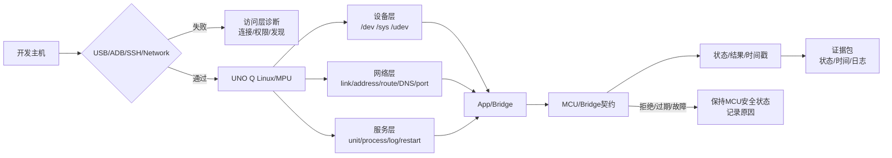

# 第2章 Linux 设备、网络与服务：从可见到可用

## 学习目标

完成本章后，读者应能够：

1. 解释内核、设备节点、udev、用户权限和应用之间的设备可见性链路。
2. 使用只读方法区分网络链路、地址、路由、DNS、发现、端口和应用协议问题。
3. 区分 Linux 进程、服务单元、启动策略、日志和重启策略。
4. 识别 USB/ADB、SSH、App Lab Network Mode 与本地网络发现各自的边界。
5. 在不改变网络配置、不启动未知服务、不泄露凭据的前提下，保存设备、网络和服务证据。
6. 把 Linux 服务状态与第二篇定义的 MCU/Bridge 请求、结果和安全状态关联起来。

## 导言：从“看得见”到“能使用”

第三篇第 1 章建立了 Linux/MPU、MCU、Bridge、进程和访问入口的概念。本章继续向下追踪三个经常被混淆的对象：

$$
\text{设备可见}
\rightarrow
\text{网络可达}
\rightarrow
\text{服务在监听}
\rightarrow
\text{应用协议可用}
$$

这四个状态不是同一个状态。设备节点存在，不代表驱动完成初始化；接口有 IP，不代表目标端口可达；端口在监听，不代表协议握手成功；协议请求成功，也不代表 MCU 已经应用控制结果。

本章的实验以只读观察为主：读取设备和网络状态，查看服务和日志，保存证据。网络连接、配置文件、服务单元和凭据都可能影响整块板卡的可用性，因此所有写入操作都单独标识，不在默认实验中执行。

## 1. 设备可见性：内核、节点和权限

### 1.1 一条设备链路

Linux 侧看到一个设备，通常要经过多层：

| 层次 | 典型对象 | 需要回答的问题 |
| --- | --- | --- |
| 物理/总线 | USB、I2C、SPI、UART、网卡 | 设备是否实际连接，电气和总线条件是否满足 |
| 内核驱动 | 驱动模块、内核对象 | 内核是否识别设备并绑定驱动 |
| 动态设备模型 | /sys、udev 事件 | 设备属性、父子关系和规则是否出现 |
| 设备节点 | /dev 下的文件、套接字或字符设备 | 应用是否有一个可访问的入口 |
| 权限 | 用户、组、ACL、polkit、udev TAG | 当前进程是否被授权访问 |
| 应用协议 | ADB、SSH、串口协议、Bridge RPC | 访问入口是否真的能完成一次受控交互 |

其中任何一层失败，最终都可能表现为“应用打不开”。排错时应记录最靠近根因的一层，而不是只记录应用界面的错误文本。

### 1.2 存在不等于可用

| 观察结果 | 可以说明什么 | 仍不能说明什么 |
| --- | --- | --- |
| /dev 下有节点 | 内核或设备管理器创建了入口 | 驱动已完成初始化、协议已就绪 |
| 节点可读 | 当前用户有读取权限 | 写入安全、设备状态正常 |
| udev 规则存在 | 主机有匹配设备的规则文本 | 规则已重新加载并命中当前设备 |
| USB 设备可枚举 | 主机能看到某个 USB 标识 | ADB shell、刷写或应用传输一定成功 |
| 串口能打开 | 文件描述符可以建立 | 对端波特率、帧格式和应用协议正确 |
| Bridge 进程存在 | Linux 侧进程已创建 | MCU 接受、应用或拒绝某个请求 |

对于 UNO Q，官方用户手册把常规 USB 操作模式和 Emergency Download Mode 区分为不同的 USB 标识，并要求 Linux 主机通过 udev 规则获得用户访问权限。这个事实描述的是主机访问层，不应被写成 UNO Q Linux 内部应用已经健康运行。

### 1.3 设备检查的安全顺序

建议按以下顺序检查：

1. 记录目标主机、当前用户、时间和连接方式。
2. 只读查看 USB、设备节点、内核日志摘要和 udev 属性。
3. 核对当前用户的权限，不先使用 root 绕过问题。
4. 检查设备专用工具的枚举结果，例如 ADB 设备列表。
5. 只有在资源所有者、协议和停止条件都明确时，才做最小读写测试。
6. 保存修改前后的规则、日志和回滚方法。

不要把改变网络、重载 udev、重启服务和重新刷写镜像混在一次“排错命令”中。每一步都要能说明改变了什么、如何观察、如何撤销。

## 2. 网络可达性：链路、地址、路由、解析和端口

### 2.1 网络问题的分层模型

| 层次 | 典型观察 | 失败示例 |
| --- | --- | --- |
| 链路 | 网卡、USB 网络、Wi-Fi 或以太网状态 | 接口不存在、无线关闭、USB 网络未枚举 |
| 地址 | IPv4/IPv6 地址、前缀和租约 | 没有地址、地址在错误网段 |
| 路由 | 默认路由、目标网段和下一跳 | 能访问本地却不能访问目标 |
| 名称解析 | DNS、hosts、mDNS | IP 可达但主机名不能解析 |
| 端口 | TCP/UDP 监听和防火墙 | 主机可达但 SSH 或应用端口拒绝 |
| 协议 | SSH 握手、ADB 会话、HTTP/RPC、Bridge 帧 | 端口开放但认证或版本协商失败 |

网络排错要从下到上推进。直接重复 SSH 命令只能证明最终入口失败，不能区分链路、地址、解析、端口和凭据问题。

### 2.2 NetworkManager 与只读检查

Arduino UNO Q 用户手册给出了通过图形界面或 nmcli 检查、连接和断开 Wi-Fi 的路径；NetworkManager 文档也明确区分了查看状态和改变连接的命令。本章默认只使用状态查询：

- nmcli general status：NetworkManager 总体状态。
- nmcli device status：设备和连接状态。
- nmcli connection show --active：当前活动连接。
- ip -brief link：链路简表。
- ip -brief address：地址简表。
- ip route：路由表。
- ss -lntup：本机监听套接字。
- getent hosts：使用当前解析配置查询名称。

以下动作属于配置或状态变更，不放入默认盘点脚本：启停网络、切换无线电、激活或删除连接、修改连接配置、改变主机名、写入 DNS 配置和重启网络服务。

### 2.3 mDNS 不是普通 DNS

App Lab Network Mode 使用本地网络发现；官方文档提醒，访客 Wi-Fi、企业网络、IoT 网络、VPN 或严格防火墙可能阻断 mDNS。由此要区分：

- IP 地址已知但 mDNS 不工作；
- mDNS 能发现但 SSH 端口不可达；
- SSH 可用但 App Lab Network Mode 没有列出设备；
- App Lab 列出设备但应用部署或 Bridge 仍然失败。

每种情况都应记录实际入口、解析结果、端口状态和工具日志，不把“发现失败”直接归因于板卡硬件故障。

### 2.4 凭据和网络证据

网络报告可能包含主机名、IP、MAC、连接名称、DNS 后缀和用户名。保存证据时：

- 不使用显示密码或网络密钥的命令选项。
- 不把完整私钥、令牌、Cookie 或 ADB 密钥写入仓库。
- IP 和主机名按项目需要脱敏，保留能关联一次实验的标识。
- 对失败重试记录次数和时间，避免把一次瞬时网络抖动写成永久故障。
- 记录执行位置：开发主机、UNO Q Linux 还是中间跳板机。

## 3. 服务可用性：单元、进程、日志和重启

### 3.1 服务与进程的区别

进程是内核调度的执行实例；服务是围绕进程、依赖、启动顺序、权限、日志和重启策略建立的管理对象。使用 systemd 的系统中，service 单元通常描述一个被服务管理器控制和监督的进程，但 UNO Q 当前镜像中具体服务名、管理器和 App 运行方式仍需现场检查。

| 观察对象 | 示例问题 | 证据 |
| --- | --- | --- |
| 单元文件 | 服务声明了什么启动命令和用户？ | unit 内容、版本、路径 |
| 加载状态 | 管理器是否认识该单元？ | list-unit-files、show |
| 活动状态 | 当前是否 active、inactive 或 failed？ | is-active、status |
| 启动策略 | 是否 enabled、何时启动？ | is-enabled、依赖关系 |
| 进程状态 | 主 PID 是否存在、是否反复重启？ | ps、主 PID、时间序列 |
| 日志 | 失败发生在哪一步？ | journal 或应用日志 |
| 资源依赖 | 设备、网络、目录、权限是否满足？ | 依赖清单和环境检查 |

### 3.2 enabled 不等于 active

服务管理中至少要分开：

- loaded：管理器已读取单元定义。
- active：当前实例处于运行态或已完成的一次性状态。
- enabled：已配置为在某些启动目标或事件中自动拉起。
- failed：最近一次启动或运行出现失败。
- listening：相关进程确实在目标端口或套接字上监听。

启用服务不会自动证明当前已经运行；启动服务也不会自动证明应用协议健康。systemd 文档还区分了启动命令返回与服务进程真正可用之间的时间关系，因此需要结合状态、进程、端口和日志判断。

### 3.3 默认只读的服务检查

对一个已知服务名，初学阶段只做：

1. 查询单元是否存在。
2. 查询 is-enabled 和 is-active。
3. 查看 status 的有限日志行。
4. 查询最近时间窗口内的日志。
5. 记录主 PID、监听端口和依赖设备。
6. 保存查询时间和命令退出码。

start、stop、restart、enable、disable、mask、unmask、daemon-reload 和编辑单元文件都属于改变运行状态或配置的动作。执行这些动作前，要说明影响范围、回滚方式和是否会影响 MCU/Bridge 或其他用户。

### 3.4 重启策略是故障的一部分

如果服务失败后自动重启，单次 status 可能只显示当前瞬间。需要记录：

- 第一次失败时间；
- 最近一次启动时间；
- 重启次数或日志中的重复模式；
- 每次失败的退出码和信号；
- 依赖是否在服务之前就绪；
- 重启是否造成重复请求、重复写入或 Bridge 会话丢失。

对于控制相关服务，自动重启不能被当作恢复成功。恢复后仍要重新协商协议、读取 MCU 状态，并明确旧请求的结果是 APPLIED、FAILED 还是 UNKNOWN。

## 4. UNO Q 访问路径与服务边界

### 4.1 从开发主机到 Linux

| 路径 | 设备层前提 | 网络层前提 | 服务层结论 |
| --- | --- | --- | --- |
| USB/ADB | USB 枚举、udev 权限、ADB 设备可见 | 不要求板卡已经加入局域网 | 只能证明 ADB 入口可用 |
| SSH/IP | 网络接口、地址、路由和端口可达 | SSH 服务、账号和凭据 | 只能证明远程 shell 入口可用 |
| App Lab Network Mode | 设备和应用发现机制 | 同网段、mDNS 和防火墙允许 | 能发现不等于部署或控制成功 |
| 本地终端 | 显示、键盘、用户会话 | 可选 | 仍需检查本地服务和权限 |

同一块板卡可能同时存在多个入口，但各入口的用户会话、环境变量、PATH、权限和网络视角可能不同。排错记录中应写明入口，而不是只写“在板子上执行”。

### 4.2 Linux 服务与 Bridge

Linux 服务可以负责：

- 接收主机或网络请求；
- 保存状态和日志；
- 通过 Bridge 请求 MCU 配置或模式变化；
- 暴露查询接口；
- 重新连接后查询当前 MCU 状态。

Linux 服务不能因为自己处于 active，就跳过 MCU 的：

- 协议版本检查；
- request_id 去重；
- 权限和范围检查；
- deadline 检查；
- 当前状态检查；
- ACCEPTED 与 APPLIED 的区分；
- DEGRADED 和 SAFE_STOP 的安全动作。

### 4.3 端口监听与控制结果

端口监听只说明某个 socket 已绑定并等待连接。一个可靠的 Bridge 证据链还需要：

1. 监听进程和服务身份；
2. 客户端认证或本地权限；
3. 协议版本和请求字段；
4. MCU 返回的序列号、时间戳和状态；
5. 必要时的输出反馈或硬件观测；
6. 断开、超时、重连和 UNKNOWN 的处理。

## 5. Fig-17：Linux 设备、网络与服务边界

<a id="fig-17-uno-q-linux-device-network-service-boundary"></a>



图 3-2 重点表达“设备、网络、服务、协议”四层不能互相替代。APP 节点可以位于多个服务和进程之后，但最终控制结果仍然回到 MCU/Bridge 契约和 MCU 安全状态。

## 6. 第一个 Linux 实验：设备与网络只读盘点

### 6.1 实验目标

本实验只读取设备、链路、地址、路由、NetworkManager 状态、监听端口和名称解析信息，形成一个便于与 SSH、ADB 或 App Lab 问题关联的报告。它不启停网络、不修改连接、不显示密码、不重启服务。

### 6.2 盘点脚本

代码说明
- 用途：把设备、链路、地址、路由、NetworkManager、监听端口和名称解析结果保存为一次只读盘点。
- 运行环境：UNO Q Debian Linux 或开发主机的 Linux shell；Windows 主机应在 WSL 或远程 Linux shell 中执行。
- 文件位置：概念脚本；建议保存为 linux-device-network-inventory.sh。
- 依赖：bash、date、id、hostname、ip、ss、getent、tee；nmcli 为可选工具。
- 操作步骤：先确认输出目录属于当前用户，再执行；脚本只读取状态并创建报告，不调用 sudo、不执行连接激活或断开。
- 预期输出：报告包含 link、address、route、NetworkManager、listener 和 resolution 六类信息；这是结构预期，不是本次 UNO Q 实测输出。
- 故障排查：某个命令不可用时记录 unavailable；网络为空时保留原始输出并标记执行位置，不要立即修改网络配置。
- 验证方式：保存报告、主机/板卡标识、执行时间和脚本提交号，分别核对链路、地址、路由、端口和解析结论。

```bash
#!/usr/bin/env bash
set -eu

out="linux-device-network-$(date -u +%Y%m%dT%H%M%SZ).txt"
if [ "$#" -ge 1 ]; then
  out="$1"
fi

{
  printf '%s\n' '== identity =='
  id
  printf 'host=%s\n' "$(hostname)"

  printf '%s\n' '== link =='
  if command -v ip >/dev/null 2>&1; then
    ip -brief link
  else
    printf '%s\n' 'ip=unavailable'
  fi

  printf '%s\n' '== address =='
  if command -v ip >/dev/null 2>&1; then
    ip -brief address
  else
    printf '%s\n' 'ip=unavailable'
  fi

  printf '%s\n' '== route =='
  if command -v ip >/dev/null 2>&1; then
    ip route
  else
    printf '%s\n' 'ip=unavailable'
  fi

  printf '%s\n' '== network-manager =='
  if command -v nmcli >/dev/null 2>&1; then
    nmcli general status || true
    nmcli device status || true
    nmcli connection show --active || true
  else
    printf '%s\n' 'nmcli=unavailable'
  fi

  printf '%s\n' '== listeners =='
  if command -v ss >/dev/null 2>&1; then
    ss -lntup || ss -lntu || true
  else
    printf '%s\n' 'ss=unavailable'
  fi

  printf '%s\n' '== resolution =='
  if command -v getent >/dev/null 2>&1; then
    getent hosts localhost || true
    getent hosts uno-q.local || true
  else
    printf '%s\n' 'getent=unavailable'
  fi
} | tee "$out"

printf 'report=%s\n' "$out"
```

脚本将命令失败和工具缺失记录在报告中，而不是把缺失工具自动解释为网络故障。nmcli 的查询也可能暴露连接名称、接口名或地址，因此提交报告前要按需要脱敏。

### 6.3 结果判读

- link 有接口但 address 为空：优先检查地址分配，不先测试应用端口。
- address 存在但 route 为空：只能访问同一链路或有限本地目标。
- route 正常但 getent 失败：区分 IP 访问和名称解析问题。
- address 和 route 正常但 ss 没有目标监听：服务层尚未就绪或监听在其他接口/端口。
- ss 有监听但 SSH/Bridge 仍失败：继续检查防火墙、认证、协议版本和服务日志。
- App Lab 发现失败但 IP/SSH 正常：优先检查 mDNS 和主机防火墙，不要先刷写系统。

## 7. 第二个 Linux 实验：服务与日志只读观测

### 7.1 实验目标

本实验针对一个已经由项目明确给出的服务单元名称，读取加载状态、启用状态、活动状态、摘要日志和最近日志。实验不会启动、停止、重启、启用或禁用服务。

如果当前项目没有经过确认的服务单元名称，不要随意猜测。可以先盘点已加载单元或使用 App 官方工具的只读检查，再把目标名称写入实验记录。

### 7.2 服务观测脚本

代码说明
- 用途：对一个明确的服务单元收集 loaded、enabled、active、主状态和最近日志，建立服务证据包。
- 运行环境：使用 systemd 的 Linux 用户空间；若目标镜像不是 systemd，记录管理器不可用并停止，不改用猜测命令。
- 文件位置：概念脚本；建议保存为 service-observation.sh。
- 依赖：bash、systemctl、journalctl、date；目标用户必须有读取对应服务状态和日志的权限。
- 操作步骤：脚本要求传入已核实的服务单元名称；只执行 is-enabled、is-active、status、show 和 journal 查询，不执行启动或重启。
- 预期输出：生成包含服务状态、主 PID、最近日志和查询时间的报告；这是示例结构，不是本次 UNO Q 服务实测结果。
- 故障排查：服务不存在、权限不足和管理器不可用要分别记录；不要用 sudo 代替根因分析，也不要把 failed 自动解释成硬件损坏。
- 验证方式：把服务报告与进程、端口、设备和 Bridge 请求日志按同一时间窗口关联，确认服务状态和控制结果没有混淆。

```bash
#!/usr/bin/env bash
set -eu

if [ "$#" -ne 1 ]; then
  printf 'usage: %s SERVICE_UNIT\n' "$0" >&2
  exit 2
fi

unit="$1"
out="service-observation-$(date -u +%Y%m%dT%H%M%SZ).txt"

{
  printf 'unit=%s\n' "$unit"
  printf 'observed_at=%s\n' "$(date -u +%Y-%m-%dT%H:%M:%SZ)"

  if ! command -v systemctl >/dev/null 2>&1; then
    printf '%s\n' 'systemctl=unavailable'
    exit 0
  fi

  printf '%s\n' '== enabled =='
  systemctl is-enabled "$unit" || true

  printf '%s\n' '== active =='
  systemctl is-active "$unit" || true

  printf '%s\n' '== show =='
  systemctl show "$unit" \
    --no-pager \
    --property=LoadState,ActiveState,SubState,MainPID,ExecMainStatus,ExecMainCode \
    || true

  printf '%s\n' '== status =='
  systemctl status "$unit" --no-pager --lines=20 || true

  if command -v journalctl >/dev/null 2>&1; then
    printf '%s\n' '== journal =='
    journalctl -u "$unit" --since '-10 minutes' --no-pager || true
  else
    printf '%s\n' 'journalctl=unavailable'
  fi
} | tee "$out"

printf 'report=%s\n' "$out"
```

服务报告可能包含路径、用户名、参数、网络地址或错误信息。保存和提交前要脱敏；如果日志中包含凭据或请求 payload，不要把原始日志直接推送到公开仓库。

### 7.3 服务证据与 MCU 结果关联

服务观察只回答 Linux 管理层的问题。若要证明某个服务请求影响了 MCU，还需要关联：

1. 服务报告中的主 PID 和时间窗口；
2. Bridge 发送的 request_id；
3. MCU 返回的序列号、时间戳和状态码；
4. 结果是否为 ACCEPTED、APPLIED、REJECTED、EXPIRED、FAILED 或 UNKNOWN；
5. 必要时的 GPIO、PWM、负载或其他硬件证据。

没有这条关联链，服务 active、日志出现 send 或客户端收到响应，都不能证明执行器已经改变。

## 8. 故障定位矩阵

| 编号 | 观察 | 优先检查 | 不要先做什么 | 最小证据 |
| --- | --- | --- | --- | --- |
| DEV-01 | 设备节点不存在 | USB/总线枚举、内核识别、udev 事件 | 不要盲目创建设备节点 | lsusb、/sys、内核日志 |
| DEV-02 | 节点存在但权限拒绝 | 用户、组、ACL、udev 规则 | 不要先用 root 掩盖权限问题 | stat、id、规则和错误 |
| NET-01 | 接口没有地址 | 链路、DHCP、连接状态 | 不要先删除连接配置 | ip、nmcli、时间 |
| NET-02 | IP 可达但主机名失败 | DNS、hosts、mDNS | 不要把解析失败写成硬件故障 | getent、解析结果 |
| NET-03 | 主机可达但端口拒绝 | 监听进程、端口、服务状态 | 不要反复重启未知服务 | ss、服务状态、日志 |
| NET-04 | App Lab 发现失败 | mDNS、同网段、防火墙 | 不要先刷写镜像 | IP/SSH 与发现对照 |
| SVC-01 | 服务 failed | unit、主 PID、退出码、日志 | 不要直接 enable/restart | show、status、journal |
| SVC-02 | 服务反复重启 | Restart 策略、依赖、资源和日志 | 不要把重启循环当恢复 | 时间序列、计数、日志 |
| BRG-01 | Bridge 连接但 MCU 拒绝 | 协议、权限、范围、状态、deadline | 不要把 REJECTED 重试成 APPLIED | request_id、状态帧 |
| BRG-02 | 服务 active 但结果 UNKNOWN | 复位、传输、日志关联 | 不要自动重放旧请求 | MCU 状态、重连记录 |

## 9. Linux 篇设备、网络与服务验证矩阵

| 编号 | 主张 | 验证方式 | 最小证据 | 状态 |
| --- | --- | --- | --- | --- |
| LNX-07 | 设备节点、权限和 udev 事实可分层记录 | 设备盘点和权限核对 | /dev、/sys、id、规则 | NOT_RUN |
| LNX-08 | 链路、地址、路由、解析和端口可区分 | 网络只读盘点 | ip、nmcli、ss、getent | NOT_RUN |
| LNX-09 | App Lab 发现和 SSH/ADB 入口差异可解释 | 同时记录发现与直接访问 | mDNS、防火墙、连接结果 | NOT_RUN |
| LNX-10 | 服务加载、启用、活动和日志状态可关联 | 服务只读观测 | systemctl、journalctl、PID | NOT_RUN |
| LNX-11 | 服务 active 不被误判为 MCU APPLIED | Bridge 请求和结果回放 | request_id、状态帧、时间戳 | NOT_RUN |
| LNX-12 | 故障处理不会扩大为无边界写操作 | 故障矩阵审查 | 命令记录、停止点、回滚说明 | NOT_RUN |

## 10. 与前后篇章的交接

### 10.1 与第三篇第 1 章的关系

第 1 章回答“Linux 上有什么、进程如何运行、入口如何访问”；本章回答“设备如何出现、网络如何分层、服务如何被管理”。两章共同建立 Linux 侧的观察和证据基础。

### 10.2 交给第三篇后续章节

后续章节可在本章基础上展开：

- 日志集中、轮转、结构化事件和时间同步；
- 服务资源限制、容器、文件权限和持久化；
- 远程运维、网络故障注入和安全升级；
- Linux 应用与 Python Bridge 的接口测试。

每个后续主题都要保留设备、网络、服务和 MCU 控制四层边界。

### 10.3 交给第四篇 Python Bridge

Python Bridge 可以调用系统工具、读取日志和访问网络，但不能把 shell 命令成功、服务 active 或套接字建立替代 MCU 控制结果。Bridge 实现应继续沿用第二篇第 9 章的 request_id、deadline、结果状态和 UNKNOWN 语义。

## 11. 本章验证结果

截至 2026-09-21，本章完成了以下文档级工作：

- 建立设备可见性、网络可达性、服务可用性和协议控制结果的四层模型。
- 明确 NetworkManager/nmcli、IP、socket、systemd 服务和 journal 的只读观察边界。
- 创建 Fig-17 Mermaid 源文件，并保留正文内联源图。
- 提供设备/网络盘点和服务/日志观测两个低风险 shell 概念实验。
- 写明 USB/ADB、SSH、App Lab Network Mode、mDNS、udev、服务重启和 MCU/Bridge 结果关联边界。
- 增加设备、网络、服务和 Bridge 故障定位矩阵。

本章状态仍为 draft。当前未在实际 UNO Q 上执行设备盘点、网络查询、systemd 服务观测、ADB/SSH 联调、App Lab 发现或 Bridge 控制验证，因此不把示例输出声明为实机结果。

## 12. 常见问题

### Q1：有 IP 地址就代表 SSH 一定可用吗？

不代表。还要检查路由、端口监听、防火墙、SSH 服务、凭据和主机密钥。IP 只证明地址层存在。

### Q2：为什么不要直接重启服务？

重启可能丢失日志上下文、重复发送请求、改变设备状态或触发自动恢复。先保存状态、日志、主 PID、请求关联和回滚方式，再决定是否重启。

### Q3：NetworkManager 的状态查询会改变网络吗？

本章使用的 status、device status、connection show 等是观察路径；nmcli 也包含启停网络和修改连接的写操作，不能把所有 nmcli 命令都当作只读。

### Q4：服务 active 但 Bridge 没有结果，问题在哪里？

可能在端口、协议、权限、传输、MCU 状态或日志关联。沿设备、网络、服务、协议四层逐项检查，不要只看 active。

### Q5：服务自动重启后是否可以重放旧命令？

不能无条件重放。先确认旧 request_id 的结果；如果是 UNKNOWN，查询 MCU 当前状态或由人工决定发起带新 request_id 和新 deadline 的请求。

## 13. 本章小结

Linux 设备、网络与服务排错应保持一条证据链：

1. 设备节点说明入口出现，不说明设备已就绪。
2. IP 和路由说明网络层可达，不说明应用端口和协议可用。
3. 服务 active 说明管理器观察到运行态，不说明 Bridge 或 MCU 结果成功。
4. Bridge 响应必须关联 request_id、时间戳和 MCU 状态。
5. 所有写操作都要有目标、权限、停止条件和回滚路径。

只有把“可见、可达、可监听、可交互、已应用”分开，Linux 才能稳定地承接 MCU 实时闭环，并为第四篇 Python Bridge 提供可靠的运行基础。

## 14. 交叉引用与参考资料

- [第三篇第 1 章：Linux 侧开发基础](./第1章_Linux侧开发基础_文件系统进程与MCU边界.md)
- [第二篇第 9 章：传感、控制与 MCU/Linux 协同闭环](../第2篇_STM32/第9章_综合实验_传感控制与MCU_Linux协同闭环.md)
- [第三篇图示登记](../../images/第3篇_Linux/README.md)
- [参考资料索引](../../resources/references.md)
- [Arduino UNO Q User Manual](https://github.com/arduino/docs-content/blob/main/content/hardware/02.uno/boards/uno-q/tutorials/01.user-manual/content.md)
- [NetworkManager nmcli Reference Manual](https://networkmanager.dev/docs/api/latest/nmcli.html)
- [systemd.service source documentation](https://github.com/systemd/systemd/blob/main/man/systemd.service.xml)
- [systemctl source documentation](https://github.com/systemd/systemd/blob/main/man/systemctl.xml)
