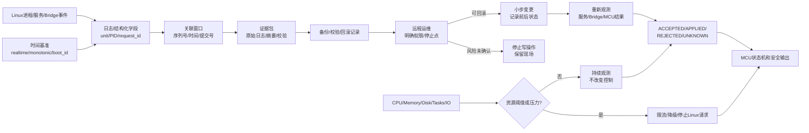

# 第3章 Linux 可观测性与资源管理：日志、时间与安全回滚

## 学习目标

完成本章后，读者应能够：

1. 用事件、上下文、资源和结果四类信息建立 Linux 运行证据链。
2. 解释 journal 字段、实时时钟、单调时间和 boot_id 在故障关联中的不同作用。
3. 观察 CPU、内存、磁盘、任务数、文件描述符、套接字、I/O 和资源压力，而不把 Linux 指标误判为 MCU 实时健康。
4. 设计不泄露凭据和控制载荷的日志采集、摘要、校验和证据归档流程。
5. 把远程运维拆成变更前快照、小步变更、健康检查、停止点和可回滚记录。
6. 将 Linux 服务、Python Bridge 请求和 MCU 的 ACCEPTED、APPLIED、REJECTED、FAILED、EXPIRED、UNKNOWN 结果关联起来。

## 导言：从“服务在运行”到“能够解释发生了什么”

第三篇第 2 章把 Linux 侧的观察链路拆成设备、网络、服务和应用协议四层。本章继续回答一个更困难的问题：

> 当服务偶发失败、系统资源紧张、时钟发生跳变或远程变更中断时，我们能否重建一次运行过程，并在不扩大风险的前提下恢复？

可观测性不是把所有日志无限保存，也不是把监控图表数量做得越多越好。它要求每条重要结论都能回答四个问题：

1. 发生了什么事件？
2. 事件发生在哪个进程、服务、启动周期和请求中？
3. 当时系统还有多少资源，时间基准是什么？
4. 这个事件最终改变了 Linux、Bridge 还是 MCU 的哪一个状态？

在 UNO Q 这类 Linux/MPU 与实时 MCU 协同的平台上，Linux 的负载、服务状态和日志只能证明 Linux 侧发生了什么。它们不能单独证明 MCU 已经应用控制结果。控制闭环仍然必须回到第二篇第 9 章的请求、结果、时间戳和安全状态契约。

## 1. 可观测性模型：事件、上下文、资源与结果

### 1.1 四类最小信息

| 类别 | 典型字段 | 用途 | 不能替代的结论 |
| --- | --- | --- | --- |
| 事件 | 启动、停止、超时、重连、拒绝、资源告警 | 说明发生了什么 | 不能证明执行器已经动作 |
| 上下文 | unit、PID、boot_id、request_id、版本、来源 | 把事件放进正确的运行实例 | 不能修复缺失的硬件反馈 |
| 资源 | CPU、内存、磁盘、任务数、I/O、套接字、压力 | 判断系统是否有能力继续工作 | 不能替代 MCU 的实时测量 |
| 结果 | ACCEPTED、APPLIED、REJECTED、FAILED、EXPIRED、UNKNOWN | 说明请求在协议链哪一步结束 | UNKNOWN 不能自动当成失败或成功 |

四类信息应在同一份实验记录中形成关联，而不是分别保存四张无法对齐的截图。例如，Bridge 请求超时的记录至少要包含请求标识、Linux 服务和进程、boot_id、请求发出时间、最近资源快照、传输错误以及 MCU 对该请求的最终判断。

### 1.2 证据等级

本书对运行结论采用递进的证据等级：

- OBSERVED：工具或日志直接观察到一个状态。
- CORRELATED：多个来源通过时间、启动周期、进程或请求标识关联起来。
- ACCEPTED：对端协议接受了请求，但不等于已经应用。
- APPLIED：对端返回已应用，且有必要的状态或输出反馈。
- UNKNOWN：链路中断、复位、超时或证据缺失，无法安全判断最终结果。

资源图表、服务 active 和客户端收到响应通常最多支持 OBSERVED 或 CORRELATED。只有 Bridge 结果帧与 MCU 状态、反馈或可重复的硬件证据同时成立，才可以把结论提高到 APPLIED。

### 1.3 运行记录的关联键

建议为一次完整运行保留以下关联键：

| 关联键 | 生成方 | 生命周期 | 作用 |
| --- | --- | --- | --- |
| boot_id | Linux 内核 | 一次系统启动 | 区分重启前后的同名 PID 和日志 |
| unit 与 PID | 服务管理器/内核 | 一次服务实例或进程实例 | 定位服务和进程 |
| run_id | 实验或运维流程 | 一次实验/变更 | 把多条请求和证据包归为一组 |
| request_id | Bridge 调用方 | 一次控制请求 | 防止把重试响应错配到旧请求 |
| MCU sequence | MCU 协议 | 一次状态或结果事件 | 关联 MCU 侧状态变化顺序 |
| git_commit | 构建与部署流程 | 一次软件版本 | 判断运行代码是否与记录中的源码一致 |

## 2. 日志：从文本消息到结构化证据

### 2.1 journal 字段的职责

systemd journal 的记录不是只有一行 MESSAGE。常见的结构化字段包括：

- _SYSTEMD_UNIT：产生记录的 systemd 单元。
- _PID：产生记录的进程标识。
- _BOOT_ID：记录所属的 Linux 启动周期。
- _SOURCE_REALTIME_TIMESTAMP：来源记录提供的实时时间。
- _SOURCE_BOOTTIME_TIMESTAMP：来源记录提供的启动后单调时间。
- PRIORITY：日志优先级。
- SYSLOG_IDENTIFIER：来源标识。
- MESSAGE：面向人的消息正文。

这些字段的实际可用性取决于日志来源、服务实现和当前镜像配置。缺失字段要记录为缺失，不能凭字段名称推断它一定存在。尤其不能把 journal 接收时间当作传感器事件发生时间，也不能把 Linux PID 当作跨重启稳定身份。

journalctl 支持按服务、时间窗口、启动周期和输出格式读取日志，也支持 JSON 输出、UTC 显示、游标和有限行数。只读查看时优先使用时间窗口、服务过滤和无分页模式，避免把整块板卡的长期日志直接复制到公开仓库。

### 2.2 推荐的结构化事件字段

Linux 服务或 Python Bridge 可以在应用层形成统一事件记录：

| 字段 | 示例语义 | 记录要求 |
| --- | --- | --- |
| observed_at | Linux 实时时间 | 标明时区，推荐同时保留 UTC |
| monotonic_ms | 进程启动后的单调时间 | 用于延迟和顺序，不用于跨启动比较 |
| boot_id | 当前 Linux 启动周期 | 与日志和 PID 一起保存 |
| source | 服务、Bridge、设备读取器 | 说明事件来源 |
| event | request_sent、result_received、timeout、rollback | 使用稳定事件名 |
| run_id | 当前实验或运维任务 | 便于归档和回放 |
| request_id | 一次请求标识 | 不因重试复用旧请求标识 |
| sequence | MCU 或应用顺序号 | 用于检测丢失、重复和乱序 |
| state | 当前状态或结果分类 | 保留 UNKNOWN，不用空值掩盖不确定 |
| error | 分类后的错误原因 | 避免写入令牌、密码和完整控制载荷 |
| git_commit | 软件版本 | 与构建产物和部署记录相互核对 |

### 2.3 日志采集的最小原则

1. 先确定时间窗口和服务范围，再执行读取。
2. 先保存原始文件的访问权限和路径，不要先格式化覆盖。
3. 对公开仓库只提交经过脱敏的摘要、字段样例和哈希，不提交完整生产日志。
4. 对控制请求只记录必要的字段和摘要，不记录认证头、私钥、Cookie、网络密钥或完整 payload。
5. 发生重启时，用 boot_id 和服务实例时间重新切分窗口。
6. 日志读取失败本身也是证据，应记录权限不足、日志未启用、磁盘满或管理器不可用。

日志轮转、真空清理、改变持久化目录和修改日志级别都会改变系统状态或保留策略。它们不属于默认的只读实验，必须先经过影响评估和回滚设计。

## 3. 时间：实时时钟、单调时间与启动周期

### 3.1 三种时间不要混用

| 时间概念 | 适合回答 | 主要风险 |
| --- | --- | --- |
| 实时时间 | 事件发生在日历上的哪一刻 | NTP、手工校时、时区或 RTC 修正会跳变 |
| 单调时间 | 两个事件相隔多久、是否超时 | 不能直接转换成跨重启的日历时间 |
| boot_id | 事件属于哪次 Linux 启动 | 不是精确时间，不能替代时间戳 |

日志审计通常需要 UTC 实时时间；延迟和超时计算应使用单调时间；跨服务或跨进程关联还要保留 boot_id。若只保存一列日期时间，时钟跳变、重启和 PID 复用都可能导致错误结论。

### 3.2 时钟跳变的处理

当系统时间向前或向后调整时：

- 不用实时时间的差值直接计算控制延迟。
- 保留原始日志时间和采集时间，不覆盖历史字段。
- 用单调时间、sequence 或 journal 游标判断先后。
- 把校时事件纳入故障时间线。
- 对 MCU 时间使用协议中明确的时间基准；没有同步契约时，不把两侧时间戳直接相减。

时间同步成功也只说明时钟服务完成了同步动作，不说明网络、服务或 MCU 控制闭环健康。反过来，时间不同步也不一定表示控制立即失败，但会降低跨系统证据的可解释性。

### 3.3 Linux 与 MCU 的关联方案

一次 Bridge 运行记录至少保留：

1. Linux observed_at 和 boot_id；
2. Linux 发出请求时的 monotonic_ms；
3. request_id 和 run_id；
4. MCU 返回的 sequence、状态和协议时间字段；
5. Linux 收到结果时的 monotonic_ms；
6. 若发生重连、复位或超时，记录连接阶段和原因。

这样可以分别回答“Linux 花了多久发出请求”“传输是否中断”“MCU 是否接收”“MCU 是否应用”“结果返回是否丢失”。如果只留下客户端最终的超时异常，就无法安全地判断是未执行、已执行但回包丢失，还是 MCU 已进入安全状态。

## 4. 资源管理：从指标到安全响应

### 4.1 资源观察面

Linux 资源观察至少覆盖以下对象：

| 资源 | 可观察信号 | 典型影响 |
| --- | --- | --- |
| CPU | 使用率、运行队列、负载、上下文切换 | Bridge 延迟、服务响应抖动 |
| 内存 | 可用内存、回收、交换、OOM 事件 | 进程被杀、缓存抖动、请求失败 |
| 磁盘空间 | 文件系统已用量、inode、写入错误 | 日志丢失、数据库失败、系统只读 |
| 任务与进程 | 任务数、线程数、重启次数、僵尸进程 | 调度压力、服务反复启动 |
| 文件描述符与套接字 | 打开数、监听数、连接数、错误 | 新连接失败、Bridge 断开 |
| I/O | 读写等待、设备错误、队列 | 日志阻塞、启动和响应变慢 |
| cgroup/压力 | CPU、内存、I/O 统计和 PSI | 区分单进程问题与系统级资源争用 |

systemd 可以通过 Linux cgroup 对服务进程分组和进行资源控制；Linux cgroup v2 也定义了统一的控制器和资源压力接口。本文只建立检查和设计边界，不假设当前 UNO Q 镜像已经启用某个特定 controller、默认限制或压力监视器。现场使用前必须核对目标镜像的内核、systemd 版本和服务配置。

### 4.2 指标不是控制结果

以下推断是不安全的：

- CPU 使用率下降，所以 MCU 一定恢复。
- 内存充足，所以 Bridge 请求一定送达。
- 网络套接字仍在监听，所以旧请求一定没有应用。
- 磁盘还有空间，所以所有日志都完整。
- Linux 负载很低，所以 MCU 实时任务没有超时。

资源指标只说明 Linux 侧的运行条件。控制结果仍以协议结果、MCU 状态和必要的硬件反馈为准。

### 4.3 分级响应

资源压力出现时，响应应从低风险到高风险逐级推进：

| 等级 | 动作 | 进入条件 | 停止条件 |
| --- | --- | --- | --- |
| Observe | 继续采集和标记压力 | 指标异常但服务仍可解释 | 证据采集本身加重压力 |
| Reject new work | 拒绝新的非必要 Linux 请求 | 队列、内存或文件描述符接近上限 | 拒绝路径无法区分控制和查询 |
| Degrade | 降低日志详细度、暂停非必要任务 | 控制链路仍有明确优先级 | 无法证明降级不会影响安全任务 |
| Stop | 停止 Linux 侧可选写操作，保留现场 | 证据不一致、磁盘写满、持续 OOM 或无法关联结果 | 只有经过人工确认和回滚后才能恢复 |

停止 Linux 侧请求不等于停止 MCU 安全状态机。MCU 必须按照第二篇的状态契约独立进入保持、降级或 SAFE_STOP。

## 5. 证据包：摘要、脱敏、校验与保留

### 5.1 一个证据包应包含什么

建议每次实验或运维任务建立单独目录，至少包含：

- 任务元数据：run_id、目标、操作者、入口、开始和结束时间。
- 环境摘要：主机、Linux 发行版、内核、boot_id、软件版本。
- 原始只读输出：权限允许时保存在受控目录，不直接提交公开仓库。
- 脱敏摘要：保留结论所需的字段、错误类别和时间窗口。
- 变更记录：如果发生写操作，记录前状态、命令、操作者和停止点。
- 结果关联：request_id、MCU sequence、状态和硬件反馈。
- 校验记录：文件名、大小、哈希算法、哈希值和核验结果。
- 清理记录：哪些字段被删除、替换或截断，以及谁完成了审查。

公开项目只提交脱敏摘要和可复现的采集方法。原始日志、SSH 密钥、App token、无线密钥、用户 Cookie 和完整控制 payload 不应进入公开仓库。

### 5.2 归档前的安全检查

归档前按顺序检查：

1. 路径是否位于预期的本地证据目录。
2. 是否包含凭据、私钥、令牌、Cookie、网络密钥和个人数据。
3. 是否把生产主机名、地址或用户名暴露到不必要的范围。
4. 是否包含未确认结果，尤其是 UNKNOWN。
5. 归档输出是否写在源目录之外，并且不会覆盖已有文件。
6. 哈希是否在归档完成后计算，并能独立复核。
7. 公开提交的内容是否只保留课程需要的字段和结论。

哈希只能证明文件在计算后是否发生变化，不能证明内容本身安全、正确或没有敏感信息。安全审查必须先于归档和推送。

## 6. 远程运维：小步变更与安全回滚

### 6.1 变更前快照

远程操作开始前，建立一个只读基线：

- 当前入口、用户、主机名、时间和 boot_id；
- 服务加载、活动状态、主 PID 和最近日志；
- 网络接口、地址、路由、监听套接字；
- 资源摘要和磁盘可用空间；
- Bridge 连接状态、最近 request_id 和 MCU 状态；
- 当前软件版本、配置版本和回滚介质；
- 允许变更的路径、服务和时间窗口。

基线的目标是回答“改动前是什么”，不是为所有文件做无边界复制。快照范围越大，越可能包含秘密和不相关的个人数据。

### 6.2 变更、验证与回滚

一个安全的远程运维单元应只有一个主要目的：

1. 说明目标和影响范围。
2. 保存变更前状态和回滚入口。
3. 执行最小变更。
4. 立即观察进程、服务、日志、资源和 Bridge。
5. 由人工确认结果，再进入下一步。
6. 异常时停止写操作，保留现场并执行已验证的回滚。
7. 回滚后重新建立服务和 MCU 状态证据，不把恢复进程本身算作控制成功。

回滚不是简单地把文件复制回去。配置版本、服务启动策略、数据库状态、网络连接、进程状态和 MCU 请求结果可能互相依赖。回滚记录应至少包括原版本、变更版本、回滚触发原因、执行者、开始结束时间、验证结果和未解决的不确定性。

### 6.3 远程停止点

出现下列情况时，默认停止进一步写操作：

- 无法确认当前目标主机、用户或权限；
- 证据包中的时间、boot_id 或 request_id 互相矛盾；
- 磁盘空间不足，日志和回滚材料可能无法保存；
- SSH 或 Bridge 连接反复断开；
- 服务重启后结果仍为 UNKNOWN；
- 变更影响范围超出原批准路径；
- 回滚介质不可读、校验失败或版本不明；
- 任何动作可能绕过 MCU 的权限、范围、deadline 或安全状态检查。

停止不是失败。它是为了保留一个可解释的状态，等待人工确认或更可靠的现场条件。

## 7. Fig-18：Linux 可观测性、资源与回滚闭环

<a id="fig-18-uno-q-linux-observability-resource-rollback-boundary"></a>



图 3-3 的重点不是把所有 Linux 工具画在一张图上，而是把“观察”和“控制”分开：

- 事件和时间先进入日志与关联窗口，避免依靠一条孤立文本判断故障。
- 资源压力可以触发限流、降级或停止 Linux 请求，但不直接改写 MCU 安全状态。
- 远程变更必须带着证据包、备份、校验和停止点推进。
- 变更后要重新观察服务、Bridge 和 MCU 结果；没有结果关联时保留 UNKNOWN。
- 最终安全输出仍由 MCU 状态机约束，Linux 侧不能借助资源管理或远程运维绕过 MCU 契约。

## 8. 第一个 Linux 实验：可观测性与资源只读盘点

### 8.1 实验目标

本实验生成一份本地只读报告，记录身份、UTC 时间、boot_id、启动时长、CPU 负载、内存、文件系统、进程、套接字和最近有限行数的 journal。脚本只创建报告文件，不改变服务、网络、日志级别或 MCU 状态。

### 8.2 代码说明

- 用途：把 Linux 事件上下文、资源摘要和最近日志放入同一时间窗口，作为一次可关联的只读观测报告。
- 运行环境：UNO Q Debian Linux 或开发主机的 Linux shell；Windows 主机应在 WSL 或远程 Linux shell 中执行。
- 文件位置：概念脚本；建议保存为 linux-observability-inventory.sh。
- 依赖：bash、date、hostname、cat、free、df、ps、ss、journalctl；缺少单个工具时脚本保留 unavailable 标记。
- 操作步骤：先选择受控输出目录并确认不会覆盖既有文件，再执行；脚本不调用 sudo、不激活连接、不重启服务。
- 预期输出：报告包含 identity、time、boot、load、memory、filesystem、processes、sockets 和 journal 区块；这只是结构预期，不是 UNO Q 实机输出。
- 故障排查：先区分工具缺失、权限不足、日志未启用和资源真的异常；不要把 journal 读取失败直接归因于 Bridge 或 MCU。
- 验证方式：用同一 run_id 将报告与 Bridge request_id、MCU sequence 和服务状态关联，检查时间窗口、boot_id 和未脱敏字段。

```bash
#!/usr/bin/env bash
set -eu

out="linux-observability-$(date -u +%Y%m%dT%H%M%SZ).txt"
if [ "$#" -ge 1 ]; then
  out="$1"
fi

if [ -e "$out" ]; then
  printf 'refusing to overwrite %s\n' "$out" >&2
  exit 3
fi

run_readonly() {
  label="$1"
  shift
  command_name="$1"
  shift
  printf '%s\n' "== $label =="
  if command -v "$command_name" >/dev/null 2>&1; then
    "$command_name" "$@" || true
  else
    printf '%s=unavailable\n' "$command_name"
  fi
}

{
  printf 'observed_at=%s\n' "$(date -u +%Y-%m-%dT%H:%M:%SZ)"
  printf 'host=%s\n' "$(hostname)"
  printf '%s\n' '== identity =='
  id

  printf '%s' 'boot_id='
  if [ -r /proc/sys/kernel/random/boot_id ]; then
    cat /proc/sys/kernel/random/boot_id
  else
    printf '%s\n' 'unavailable'
  fi

  printf '%s' 'uptime='
  if [ -r /proc/uptime ]; then
    cat /proc/uptime
  else
    printf '%s\n' 'unavailable'
  fi

  run_readonly 'load' cat /proc/loadavg
  run_readonly 'memory' free -h
  run_readonly 'filesystem' df -h
  run_readonly 'processes' ps -eo pid,ppid,stat,pcpu,pmem,comm --sort=-pcpu
  run_readonly 'sockets' ss -lntup

  printf '%s\n' '== journal =='
  if command -v journalctl >/dev/null 2>&1; then
    journalctl --since '-10 minutes' --no-pager --utc -n 200 -o short-iso-precise || true
  else
    printf '%s\n' 'journalctl=unavailable'
  fi
} | tee "$out"

printf 'report=%s\n' "$out"
```

脚本默认只读取最近十分钟且最多两百行日志；如果目标镜像的 journal 数据量较大，仍应在保存和公开前审查敏感字段。报告路径可以作为参数传入，但脚本拒绝覆盖已有文件，减少误把新观测混入旧证据的风险。

### 8.3 结果判读

- boot_id 变化：先把时间线切分为不同 Linux 启动周期，再比较 PID、服务和请求。
- CPU 或负载升高：查看进程、I/O 和请求延迟，不直接判定 MCU 故障。
- 可用内存下降或出现 OOM：停止非必要 Linux 工作，保存现场并检查 Bridge 结果是否 UNKNOWN。
- 文件系统接近上限：先保护日志和回滚空间，不把日志清理当成无影响动作。
- 套接字仍在监听：继续检查服务日志、协议握手和 MCU 状态。
- journal 中有错误：按 unit、PID、boot_id 和 request_id 关联，避免只凭关键词定性。

## 9. 第二个 Linux 实验：证据归档与哈希校验

### 9.1 实验目标

本实验把已经完成脱敏审查的本地报告目录归档到源目录之外，并生成 SHA-256 校验文件。脚本拒绝覆盖已有归档和校验文件。它不是远程上传工具，也不是日志清理工具；归档前的脱敏和权限审查仍由人工负责。

### 9.2 代码说明

- 用途：对经过人工审查的本地观测目录建立归档和 SHA-256 校验，验证归档文件在传递前后没有被意外修改。
- 运行环境：Linux shell；示例依赖 GNU 或兼容的 tar、sha256sum、dirname、cd。
- 文件位置：概念脚本；建议保存为 make-evidence-archive.sh。
- 依赖：bash、tar、sha256sum、dirname；归档路径的父目录必须已经存在且可写。
- 操作步骤：第一个参数是已经脱敏的源目录，第二个参数是源目录之外的新归档路径；脚本拒绝覆盖已有归档和校验文件。
- 预期输出：生成归档、同名 SHA-256 校验文件，并立即执行一次 sha256sum --check；这是本地文件验证，不代表远程系统已经收到。
- 故障排查：归档失败先检查路径、权限、磁盘空间和 tar 能力；校验失败时保留原文件和错误输出，不要自动重打包覆盖现场。
- 验证方式：记录源目录审查人、归档路径、哈希值和核验结果；在另一位置复制后再次执行校验，并核对内容清单。

```bash
#!/usr/bin/env bash
set -eu

if [ "$#" -ne 2 ]; then
  printf 'usage: %s REDACTED_SOURCE_DIR ARCHIVE_PATH\n' "$0" >&2
  exit 2
fi

source_dir="$1"
archive="$2"
digest="$archive.sha256"

if [ ! -d "$source_dir" ]; then
  printf 'source directory does not exist: %s\n' "$source_dir" >&2
  exit 2
fi

archive_parent="$(dirname "$archive")"
if [ ! -d "$archive_parent" ]; then
  printf 'archive parent does not exist: %s\n' "$archive_parent" >&2
  exit 2
fi

source_real="$(cd "$source_dir" && pwd -P)"
archive_parent_real="$(cd "$archive_parent" && pwd -P)"

case "$archive_parent_real" in
  "$source_real"|"$source_real"/*)
    printf 'archive must be outside source directory\n' >&2
    exit 3
    ;;
esac

if [ -e "$archive" ] || [ -e "$digest" ]; then
  printf 'refusing to overwrite archive or digest\n' >&2
  exit 3
fi

command -v tar >/dev/null 2>&1
command -v sha256sum >/dev/null 2>&1

tar -cf "$archive" -C "$source_dir" .
sha256sum "$archive" > "$digest"
sha256sum --check "$digest"

printf 'archive=%s\n' "$archive"
printf 'digest=%s\n' "$digest"
```

归档文件和校验文件都属于敏感运行材料。不要把包含凭据、私钥、无线密钥、用户数据或完整控制 payload 的目录交给脚本。哈希验证成功只表示归档文件与校验记录一致；它不表示归档内容已经安全、真实或适合公开。

## 10. 故障处理矩阵

| 编号 | 观察 | 可能边界 | 安全动作 | 最小证据 |
| --- | --- | --- | --- | --- |
| LNX-13 | journalctl 不可用或没有日志 | 管理器、权限、持久化或镜像差异 | 记录工具和日志状态，保留其他只读输出 | 命令退出码、版本、路径 |
| LNX-14 | 实时时间突然跳变 | 校时、RTC、时区或手工修改 | 用 monotonic、sequence 和 boot_id 重建顺序 | 原始时间、校时事件、启动周期 |
| LNX-15 | CPU 持续高或运行队列拥塞 | 单进程、I/O 等待或系统级争用 | 停止非必要新任务，继续观察控制结果 | 进程、负载、I/O、请求延迟 |
| LNX-16 | 内存压力、交换或 OOM | 泄漏、突发任务或缓存回收 | 拒绝非必要工作，保留现场，不自动重放 UNKNOWN | memory、OOM 日志、request_id |
| LNX-17 | 磁盘空间或 inode 接近上限 | 日志、缓存、归档或用户文件增长 | 停止写操作，先确认回滚和证据空间 | df、inode、写入错误、目录范围 |
| LNX-18 | 归档哈希校验失败 | 文件被改写、复制不完整或路径错误 | 保留原件和错误，停止推送和替换 | 文件大小、哈希、传递记录 |
| LNX-19 | 远程变更中途断开 | 网络、SSH、服务重启或电源变化 | 不自动重试写操作，重新盘点后人工决定 | 连接日志、前后状态、boot_id |
| LNX-20 | 服务恢复但 Bridge 结果 UNKNOWN | 回包丢失、MCU 复位或状态未查询 | 查询 MCU 当前状态，使用新 request_id，禁止盲目重放 | 请求链、MCU sequence、状态反馈 |

## 11. Linux 篇可观测性与资源管理验证矩阵

| 编号 | 主张 | 验证方式 | 最小证据 | 状态 |
| --- | --- | --- | --- | --- |
| LNX-13 | journal 字段、服务、PID 和启动周期可以关联 | 读取有限时间窗口并检查字段 | unit、PID、boot_id、时间字段 | NOT_RUN |
| LNX-14 | 实时时间与单调时间不会被混作延迟依据 | 制造或观察时钟跳变并重建时间线 | realtime、monotonic、sequence | NOT_RUN |
| LNX-15 | CPU、内存、磁盘、任务、套接字和 I/O 观察边界明确 | 只读资源盘点 | 资源快照、命令版本、时间窗口 | NOT_RUN |
| LNX-16 | 资源压力会触发分级响应，而非无条件杀进程或重试 | 审查响应矩阵并进行受控演练 | 阈值、停止点、人工确认 | NOT_RUN |
| LNX-17 | 公开证据包不包含凭据和完整控制载荷 | 脱敏审查和字段清单检查 | 审查记录、摘要、敏感字段扫描 | NOT_RUN |
| LNX-18 | 归档文件可以独立校验且拒绝覆盖 | 生成归档、核验并重复复制核验 | tar、SHA-256、文件清单 | NOT_RUN |
| LNX-19 | 远程变更具备快照、验证和回滚路径 | 桌面演练或测试镜像演练 | 前后状态、回滚记录、停止点 | NOT_RUN |
| LNX-20 | Linux 服务恢复不等于 MCU APPLIED | Bridge 结果与 MCU 状态关联 | request_id、sequence、结果和反馈 | NOT_RUN |

## 12. 与前后篇章的交接

### 12.1 与第三篇前两章的关系

第三篇第 1 章建立 Linux/MPU、进程、文件系统和访问入口边界；第 2 章建立设备、网络、服务和 Bridge 的分层观察。本章在此基础上补充时间线、资源压力、证据包和回滚闭环。

### 12.2 交给第四篇 Python Bridge

Python Bridge 后续实现应：

- 为每次调用生成 run_id 和 request_id；
- 保存 boot_id、单调时间和协议 sequence；
- 将日志摘要、资源快照和结果状态分开记录；
- 将 UNKNOWN 作为需要查询或人工决策的状态；
- 在资源压力和连接中断时停止非必要写操作；
- 不把 Python 异常、进程退出码或 socket 成功替代 MCU APPLIED。

### 12.3 与第二篇 MCU 契约的关系

Linux 的资源管理只能控制 Linux 侧的调度、日志、队列和非必要服务。MCU 的权限、范围、deadline、状态转换、看门狗和 SAFE_STOP 仍由第二篇的 MCU 侧实现负责。Linux 远程运维不能通过修改日志、服务或资源限制来绕过 MCU 的状态机。

## 13. 本章验证结果

截至 2026-09-21，本章完成了以下文档级工作：

- 建立事件、上下文、资源和结果四类可观测性模型。
- 区分 journal 字段、实时时间、单调时间和 boot_id 的用途。
- 建立 CPU、内存、磁盘、任务、套接字、I/O 和 cgroup/压力的资源观察边界。
- 创建 Fig-18 Mermaid 源文件，并保留正文内联源图。
- 提供可观测性/资源只读盘点和脱敏证据归档/哈希校验两个低风险概念实验。
- 写明远程变更前快照、小步变更、健康检查、停止点和安全回滚边界。
- 增加 LNX-13 至 LNX-20 故障处理和验证矩阵。

本章状态仍为 draft。当前未在实际 UNO Q 上执行 journal 字段盘点、资源压力演练、证据归档传递、远程变更、Bridge 联调或 MCU 硬件反馈验证，因此不把示例输出声明为实机结果。

## 14. 常见问题

### Q1：journal 中有错误，是否说明 MCU 控制失败？

不一定。它首先说明某个 Linux 日志来源报告了异常。必须用 unit、PID、boot_id、request_id、MCU sequence 和结果状态确认异常是否属于同一条控制链。

### Q2：系统时间不准，所有控制结果都无效吗？

不一定。时间不准会降低跨系统审计和延迟分析的可靠性，但协议仍可能使用单调时间、sequence 和明确的 deadline。应保留不确定性，不用墙上时钟单独否定或确认结果。

### Q3：内存不足时可以直接杀掉占用最多的进程吗？

不能默认这样做。进程可能是 Bridge、日志、网络或安全相关组件；杀进程还可能制造新的 UNKNOWN。先拒绝非必要工作、保留现场并按批准的恢复手册行动。

### Q4：哈希校验成功是否可以把证据包直接推到公开仓库？

不能。哈希只验证文件一致性，不能识别密码、令牌、个人数据或控制 payload。公开前仍要进行敏感字段审查和最小化处理。

### Q5：远程变更后服务 active，是否可以结束任务？

不能。还要核对日志、资源、协议连接、request_id、MCU 状态和必要的输出反馈。若任一关键链路无法关联，保留 UNKNOWN 并停止扩大变更。

## 15. 本章小结

Linux 可观测性与资源管理的核心不是收集更多数据，而是让每个结论都可追溯、可关联、可停止：

1. 用事件、上下文、资源和结果构造证据链。
2. 用 boot_id 区分启动周期，用单调时间计算延迟，用实时时间进行审计。
3. 把资源压力当作 Linux 侧能力边界，不把它误判为 MCU 控制结果。
4. 归档前先脱敏，归档后算哈希，并把校验和内容安全分开判断。
5. 远程操作先做快照，再做单一小步变更，出现不确定就停止并保留现场。
6. 服务恢复、日志成功和 socket 可用都不能替代 MCU APPLIED。

完成本章后，读者应能把第三篇前三章串成一条从 Linux 入口、设备网络服务、日志资源时间到安全运维的可解释链路，并为第四篇 Python Bridge 的实现准备稳定的运行证据接口。

## 16. 交叉引用与参考资料

- [第三篇第 1 章：Linux 侧开发基础](./第1章_Linux侧开发基础_文件系统进程与MCU边界.md)
- [第三篇第 2 章：Linux 设备、网络与服务](./第2章_Linux设备网络与服务_从可见到可用.md)
- [第二篇第 9 章：传感、控制与 MCU/Linux 协同闭环](../第2篇_STM32/第9章_综合实验_传感控制与MCU_Linux协同闭环.md)
- [第三篇图示登记](../../images/第3篇_Linux/README.md)
- [参考资料索引](../../resources/references.md)
- [Arduino UNO Q User Manual](https://github.com/arduino/docs-content/blob/main/content/hardware/02.uno/boards/uno-q/tutorials/01.user-manual/content.md)
- [Linux Filesystem Hierarchy Standard](https://refspecs.linuxfoundation.org/fhs.shtml)
- [systemd journal fields](https://github.com/systemd/systemd/blob/main/man/systemd.journal-fields.xml)
- [journalctl source documentation](https://github.com/systemd/systemd/blob/main/man/journalctl.xml)
- [systemd resource control](https://github.com/systemd/systemd/blob/main/man/systemd.resource-control.xml)
- [Linux cgroup v2 documentation](https://docs.kernel.org/admin-guide/cgroup-v2.html)
- [systemd time documentation](https://github.com/systemd/systemd/blob/main/man/systemd.time.xml)
