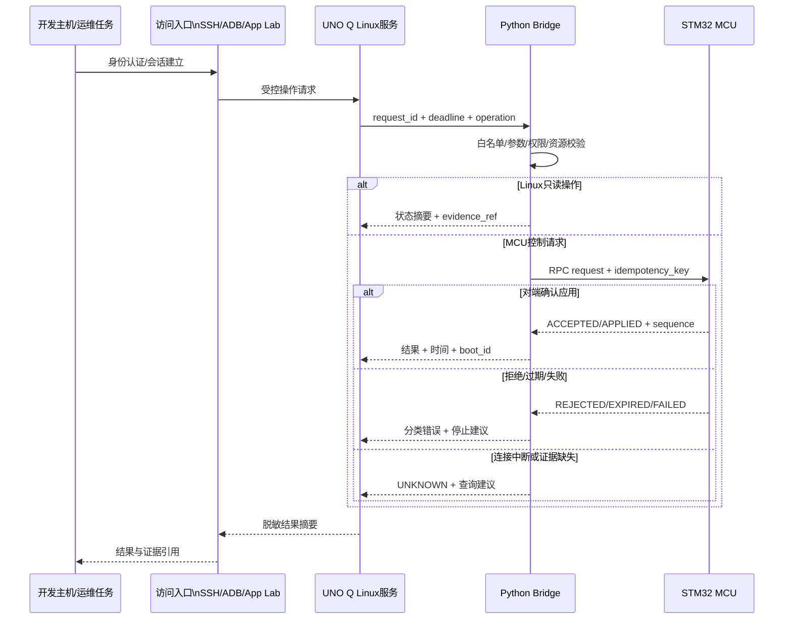

# 第4章 Linux 远程运维与 Python Bridge：从安全命令到可验证请求

## 学习目标

完成本章后，读者应能够：

1. 区分 USB/ADB、SSH、App Lab Network Mode 和本地终端的身份、权限、网络和证据边界。
2. 解释为什么远程执行应采用固定操作白名单、参数校验、超时、输出上限和明确的停止条件。
3. 设计一个不依赖任意 shell 拼接的 Python Linux 命令适配层。
4. 为 Python Bridge 请求定义 request_id、run_id、deadline、幂等键、结果状态和证据引用。
5. 将 Linux 服务结果与 MCU 的 ACCEPTED、APPLIED、REJECTED、FAILED、EXPIRED、UNKNOWN 状态正确关联。
6. 在连接中断、进程超时、重启、重复请求和权限变化时，选择停止、查询、回滚或人工确认，而不是盲目重试。

## 导言：远程可达不等于远程可控

第三篇第 2 章建立了设备、网络、服务和协议四层；第 3 章又补充了日志、时间、资源、证据和回滚。本章把这些边界组合成一个可执行的 Linux 远程运维与 Python Bridge 模型。

Arduino UNO Q 的官方用户手册把 Network Mode、USB/ADB 访问、Linux 环境和 Bridge/RPC 分别放在不同层次。开发主机能够发现板卡、建立 SSH 会话或打开 ADB shell，只能证明某个入口可用；它不能自动证明某个 Linux 服务已经被授权执行，也不能证明 MCU 已经应用控制请求。

本章使用一个严格的判断链：

$$
\text{入口可达}
\rightarrow
\text{身份已确认}
\rightarrow
\text{操作被允许}
\rightarrow
\text{参数和资源可用}
\rightarrow
\text{请求被关联}
\rightarrow
\text{结果被验证}
$$

其中任何一步无法确认，都应保留不确定性。特别是连接在控制请求之后、结果返回之前中断时，正确结果不是“重试直到成功”，而是进入 UNKNOWN 处理路径，先查询当前状态或等待人工决策。

## 1. 远程入口：同一块板卡，不同的控制边界

### 1.1 四类入口的比较

| 入口 | 典型身份 | 依赖 | 可以证明什么 | 不能直接证明什么 |
| --- | --- | --- | --- | --- |
| USB/ADB | 主机上的 ADB 客户端与板卡上的 adbd | USB 枚举、权限、授权、ADB server | ADB 会话或 shell 入口可用 | Linux 服务、Bridge 或 MCU 结果正常 |
| SSH/IP | Linux 用户、主机密钥和网络凭据 | 地址、路由、端口、sshd、认证 | 远程 Linux 会话可用 | 命令已获业务授权或硬件控制已应用 |
| App Lab Network Mode | App Lab 用户会话 | 同网段、mDNS、应用服务和 Linux 密码 | App Lab 能发现并访问板卡 | 任意 SSH 命令或 MCU 控制都可执行 |
| 本地终端 | 板卡上的本地 Linux 用户 | 显示、键盘、会话和权限 | 本地 shell 入口可用 | 其他入口、网络和 Bridge 健康 |

ADB 的客户端、主机侧 server 和设备侧 daemon 是不同进程；SSH 的认证、会话和远程命令也有不同的生命周期。运维记录必须写出入口、用户、主机名、时间和 boot_id，不能只写“已经连上板子”。

### 1.2 身份确认的最小记录

一次远程任务开始前，至少保存：

- 目标标识：主机名、IP 或经过脱敏的设备标识；
- 访问入口：ADB、SSH、App Lab 或本地终端；
- 当前用户和权限：普通用户、组、sudo 能力是否已被批准；
- 主机密钥或设备授权状态：只记录指纹或状态，不记录私钥；
- Linux boot_id、时间和软件版本；
- 运维任务的 run_id、变更范围和停止条件；
- 是否允许写操作，以及允许写入的精确路径或服务。

密码、私钥、ADB 私钥、网络密钥、令牌和 Cookie 不属于运行日志、命令参数或公开仓库。即便某个命令只是在远程机器上执行，也不能把凭据放入 shell 历史、进程列表或异常消息。

### 1.3 访问成功的证据等级

| 结论 | 最低证据 | 结论上限 |
| --- | --- | --- |
| 设备可见 | ADB devices、App Lab 发现或 USB 枚举 | 入口可能可用 |
| 会话建立 | SSH/ADB 返回交互提示或受控查询结果 | Linux 会话可用 |
| 命令完成 | 白名单操作返回退出码和有限输出 | 该命令在 Linux 侧完成 |
| Bridge 接受 | request_id 和协议 ACCEPTED | MCU 已接收或排队，未必应用 |
| MCU 应用 | APPLIED、sequence、状态反馈或必要硬件证据 | 该请求已满足应用条件 |
| 最终不确定 | 连接中断、超时、复位或证据冲突 | 只能保留 UNKNOWN |

## 2. 安全命令模型：不要把 shell 当成 API

### 2.1 任意命令执行的问题

把用户输入直接拼接成一条 shell 字符串，会同时引入：

- 命令注入：参数中的 shell 元字符改变实际执行内容；
- 权限扩大：远程账户被用来执行本不属于任务范围的命令；
- 输出泄露：标准输出、错误输出或环境变量包含秘密；
- 资源失控：命令无限运行、产生无限输出或占满磁盘；
- 证据混乱：多个命令的输出无法对应到同一个 request_id；
- 回滚困难：命令已经改变服务、网络或配置，却没有保存前状态。

安全的 Bridge 不接受“执行这一整行命令”这种接口，而接受有限的业务操作名和结构化参数。每个操作都应有固定的可执行文件、固定参数模板、允许的参数范围、超时、输出上限和结果映射。

### 2.2 操作白名单

| 操作名 | 允许的动作 | 参数 | 默认风险 | 失败处理 |
| --- | --- | --- | --- | --- |
| system_identity | 读取用户和主机摘要 | 无 | 只读 | 记录不可用工具 |
| resource_snapshot | 读取 CPU、内存、磁盘摘要 | 无 | 只读 | 保留缺失项 |
| journal_window | 读取有限时间窗口日志 | 固定窗口和行数 | 只读但可能含敏感信息 | 脱敏后保存 |
| service_observe | 读取已确认服务状态 | 已登记 unit 名称 | 只读 | 不猜测服务名 |
| bridge_query | 查询 MCU 当前状态 | 设备或状态对象 | 查询 | 连接失败保留 UNKNOWN |
| service_restart | 重启已批准服务 | 已登记 unit 名称 | 写操作 | 需要人工批准和回滚 |
| network_change | 修改网络连接 | 不在默认白名单 | 高风险 | 默认拒绝 |

只读不等于无风险。读取 journal 可能暴露凭据和个人数据，读取网络状态可能暴露地址和主机名，读取进程参数可能暴露 token。因此白名单还要配合字段脱敏和输出上限。

### 2.3 参数验证顺序

对一个来自网络、App Lab 或远程终端的请求，按以下顺序处理：

1. 解析 JSON，限制输入字节数和嵌套深度。
2. 检查协议版本、operation 名称和必需字段。
3. 检查 request_id、run_id 和幂等键的格式。
4. 对 unit、路径、时间窗口、行数、端口和资源参数做白名单验证。
5. 检查当前用户、会话和操作授权。
6. 检查 deadline、资源压力、磁盘空间和目标服务状态。
7. 记录请求摘要，不记录秘密和完整控制 payload。
8. 执行固定的 argv 列表，不经过 shell。
9. 保存退出码、有限输出、耗时和结果状态。
10. 对需要 MCU 的请求，再执行 Bridge 协议和 MCU 状态关联。

## 3. Python Bridge 请求契约

### 3.1 请求字段

本书后续 Python Bridge 章节沿用以下最小请求信封：

| 字段 | 类型 | 作用 | 约束 |
| --- | --- | --- | --- |
| protocol_version | 字符串 | 协商消息格式 | 未知版本拒绝 |
| request_id | 字符串 | 唯一标识一次请求 | 重试不复用旧值 |
| run_id | 字符串 | 关联一次实验或运维任务 | 同一任务可以包含多次请求 |
| operation | 字符串 | 白名单操作名 | 不接受任意命令行 |
| args | 对象 | 结构化参数 | 按操作逐字段校验 |
| deadline_ms | 整数 | 请求最晚有效时间 | 不能无限延长 |
| idempotency_key | 字符串 | 防止同一意图重复应用 | 与操作语义一起判断 |
| auth_context | 对象 | 用户、入口和授权摘要 | 不包含密码或私钥 |
| created_at | 字符串 | 审计时间 | 推荐 UTC，同时记录单调时间 |

request_id 解决“响应属于哪个请求”的问题；idempotency_key 解决“同一意图是否已经应用”的问题；两者不是同一个字段。一个网络重试可以有新的 request_id，但如果它代表同一控制意图，应携带同一个幂等键，由 MCU 或 Bridge 判断是否已经处理。

### 3.2 结果字段

| 字段 | 作用 |
| --- | --- |
| request_id | 回显请求关联键 |
| run_id | 归档关联键 |
| status | ACCEPTED、APPLIED、REJECTED、FAILED、EXPIRED 或 UNKNOWN |
| sequence | Bridge 或 MCU 侧顺序号 |
| observed_at | Linux 接收结果的 UTC 时间 |
| monotonic_ms | Linux 侧耗时参考 |
| boot_id | 当前 Linux 启动周期 |
| error_code | 稳定错误分类，不放秘密 |
| evidence_ref | 证据包中的摘要或文件标识 |
| state | MCU 当前状态或服务状态 |
| retry_advice | 明确允许查询、重试、回滚或人工确认 |

ACCEPTED 代表协议层接受，APPLIED 代表已经应用；如果协议只返回前者，Linux 不得把它提升为后者。UNKNOWN 不是普通失败，它表示最终状态还不能安全判断。

### 3.3 状态转换

一个请求可用如下逻辑理解：

- CREATED：请求已生成但尚未发送；
- VALIDATED：字段、权限、资源和 deadline 通过；
- SENT：已交给 Bridge 或受控 Linux 操作；
- ACCEPTED：对端接受或排队；
- APPLIED：对端确认应用；
- REJECTED：权限、范围、状态或版本不允许；
- FAILED：有明确失败证据；
- EXPIRED：超过 deadline；
- UNKNOWN：结果链断裂，需查询或人工决定。

服务重启、SSH 断开或 Python 进程异常发生在 SENT 之后时，不应直接转换为 FAILED。应先判断是否有明确的拒绝、超时或回滚证据；否则保留 UNKNOWN。

## 4. Fig-19：远程运维与 Python Bridge 请求时序

<a id="fig-19-linux-remote-bridge-request-sequence"></a>



图 4-1 展示了三个关键边界：

- 访问入口只负责建立会话和传递受控请求，不替代 Linux 服务的授权。
- Python Bridge 负责结构化校验、时间和结果关联，但不拥有绕过 MCU 状态机的特权。
- MCU 返回的结果和 sequence 是控制闭环的最终依据；Linux 日志和 Python 返回值只是关联证据的一部分。

## 5. 第一个 Python 实验：固定操作的安全执行器

### 5.1 实验目标

本实验实现一个只读操作适配器。它把操作名映射为固定 argv，禁止 shell 拼接，限制执行时间和输出长度，并将工具缺失、超时、退出码和输出摘要转换为结构化结果。

该脚本不连接 UNO Q、不执行 SSH/ADB、不修改服务或网络。它可以先在开发主机的 Linux 环境中进行语法和单元级验证，再由人工选择目标镜像进行受控现场测试。

### 5.2 代码说明

- 用途：演示 Python Bridge 如何把固定只读操作映射为 argv，并统一处理超时、工具缺失、退出码和输出上限。
- 运行环境：Python 3 标准库和 Linux 用户空间；现场使用前应核对目标镜像中工具路径和权限。
- 文件位置：概念脚本；建议保存为 python-safe-ops.py。
- 依赖：Python 标准库 subprocess、shutil、time 和 json；不依赖第三方包，不调用 shell。
- 操作步骤：先在非生产 Linux 环境运行 identity、resource_snapshot 和 journal_window；确认输出脱敏后，再考虑目标板卡上的只读测试。
- 预期输出：每个操作返回 JSON 对象，包含 operation、status、returncode、elapsed_ms 和有限 output；这是结构预期，不是 UNO Q 实测输出。
- 故障排查：先区分操作名拒绝、工具缺失、超时和非零退出码；不要通过打开 shell 或删除超时来“修复”失败。
- 验证方式：检查未知操作被拒绝、超时被标记、输出被截断、命令参数没有经过 shell，并将结果与 run_id 和 evidence_ref 关联。

```python
from __future__ import annotations

import json
import shutil
import subprocess
import time
from typing import Any

MAX_OUTPUT = 4096
DEFAULT_TIMEOUT_SECONDS = 3.0

OPERATIONS: dict[str, tuple[str, ...]] = {
    "identity": ("id",),
    "hostname": ("hostname",),
    "uptime": ("cat", "/proc/uptime"),
    "resource_snapshot": ("free", "-h"),
    "filesystem_snapshot": ("df", "-h"),
    "journal_window": (
        "journalctl",
        "--since",
        "-5 minutes",
        "--no-pager",
        "--utc",
        "-n",
        "50",
        "-o",
        "short-iso-precise",
    ),
}


def _bounded(value: str, limit: int = MAX_OUTPUT) -> str:
    if len(value) <= limit:
        return value
    return value[:limit] + "\n[output-truncated]"


def run_readonly(
    operation: str,
    timeout_seconds: float = DEFAULT_TIMEOUT_SECONDS,
) -> dict[str, Any]:
    argv = OPERATIONS.get(operation)
    if argv is None:
        return {
            "operation": operation,
            "status": "REJECTED",
            "error_code": "operation_not_allowed",
        }

    executable = shutil.which(argv[0])
    if executable is None:
        return {
            "operation": operation,
            "status": "FAILED",
            "error_code": "tool_unavailable",
            "tool": argv[0],
        }

    started = time.monotonic()
    try:
        completed = subprocess.run(
            argv,
            check=False,
            shell=False,
            capture_output=True,
            text=True,
            timeout=timeout_seconds,
        )
    except subprocess.TimeoutExpired as exc:
        elapsed_ms = round((time.monotonic() - started) * 1000)
        partial = _bounded(str(exc.stdout or ""))
        return {
            "operation": operation,
            "status": "UNKNOWN",
            "error_code": "timeout",
            "elapsed_ms": elapsed_ms,
            "output": partial,
            "retry_advice": "query_or_manual_review",
        }

    elapsed_ms = round((time.monotonic() - started) * 1000)
    output = _bounded(completed.stdout)
    error_output = _bounded(completed.stderr)

    if completed.returncode == 0:
        status = "OBSERVED"
    else:
        status = "FAILED"

    return {
        "operation": operation,
        "status": status,
        "returncode": completed.returncode,
        "elapsed_ms": elapsed_ms,
        "output": output,
        "error_output": error_output,
        "executable": executable,
    }


if __name__ == "__main__":
    for name in ("identity", "resource_snapshot", "journal_window"):
        print(json.dumps(run_readonly(name), ensure_ascii=False))
```

这个示例有意将允许操作写成不可变的模板。现场项目可以把服务状态查询加入白名单，但必须同时固定 unit 名称、行数、时间窗口和输出脱敏策略。`subprocess.run` 的参数列表不会隐式调用 shell；如果显式启用 shell，就必须承担额外的转义和注入风险。超时后保留 UNKNOWN，是因为子进程可能已经产生了部分输出或完成了外部动作。

### 5.3 实验结果的边界

- OBSERVED 只表示 Linux 工具返回了一个可读取状态。
- FAILED 只表示有明确的本地工具失败证据，不自动表示 MCU 失败。
- UNKNOWN 需要查询当前状态或由人工决定，不能自动把同一请求重放。
- 输出截断后，证据引用必须说明内容被截断，不能把摘要当作完整日志。
- 任何新增写操作都应建立新的 operation 名称、权限、审批、回滚和验证矩阵。

## 6. 第二个 Python 实验：请求关联与结果分类

### 6.1 实验目标

本实验构造一个最小的 Python Bridge 请求和结果关联器。它生成 request_id、run_id、幂等键和 deadline，检查结果是否属于当前请求，并把连接中断、结果缺失和状态不一致保留为 UNKNOWN。

这段代码只在内存中处理示例字典，不打开网络套接字、不访问 ADB/SSH、不向 MCU 发送请求。它的用途是先验证状态分类和日志结构，再替换为实际 Bridge 传输层。

### 6.2 代码说明

- 用途：演示 Python Bridge 如何生成请求信封、检查响应关联、识别过期和保留 UNKNOWN，不实现真实 MCU 传输。
- 运行环境：Python 3 标准库；可在开发主机上运行，不要求 UNO Q、网络或 Arduino 工具链。
- 文件位置：概念脚本；建议保存为 bridge-request-correlation.py。
- 依赖：Python 标准库 dataclasses、enum、json、time 和 uuid；不依赖第三方 RPC 库。
- 操作步骤：先运行示例中的 APPLIED、REJECTED、EXPIRED、UNKNOWN 四种结果，再替换为真实传输适配器；不要把示例 request_id 当作现场请求。
- 预期输出：每个样例产生一条 JSON 结果，包含 request_id、run_id、status、sequence 和 retry_advice；这是状态机示例，不是 MCU 实测输出。
- 故障排查：关联失败先检查 request_id、run_id、deadline 和状态字段；不要通过忽略字段或自动重试掩盖 UNKNOWN。
- 验证方式：构造错配 request_id、过期 deadline、缺少 sequence 和连接中断样例，确认它们分别进入 REJECTED、EXPIRED 或 UNKNOWN。

```python
from __future__ import annotations

import json
import time
import uuid
from dataclasses import dataclass
from enum import Enum
from typing import Any


class ResultStatus(str, Enum):
    ACCEPTED = "ACCEPTED"
    APPLIED = "APPLIED"
    REJECTED = "REJECTED"
    FAILED = "FAILED"
    EXPIRED = "EXPIRED"
    UNKNOWN = "UNKNOWN"


@dataclass(frozen=True)
class Request:
    protocol_version: str
    request_id: str
    run_id: str
    operation: str
    args: dict[str, Any]
    idempotency_key: str
    deadline_monotonic: float


def new_request(
    operation: str,
    args: dict[str, Any],
    run_id: str,
    timeout_seconds: float = 5.0,
) -> Request:
    now = time.monotonic()
    return Request(
        protocol_version="uno-q-bridge-v1",
        request_id=str(uuid.uuid4()),
        run_id=run_id,
        operation=operation,
        args=args,
        idempotency_key=str(uuid.uuid4()),
        deadline_monotonic=now + timeout_seconds,
    )


def correlate(request: Request, response: dict[str, Any] | None) -> dict[str, Any]:
    if response is None:
        return {
            "request_id": request.request_id,
            "run_id": request.run_id,
            "status": ResultStatus.UNKNOWN.value,
            "error_code": "response_missing",
            "retry_advice": "query_or_manual_review",
        }

    if response.get("request_id") != request.request_id:
        return {
            "request_id": request.request_id,
            "run_id": request.run_id,
            "status": ResultStatus.REJECTED.value,
            "error_code": "request_id_mismatch",
            "retry_advice": "do_not_retry",
        }

    if time.monotonic() > request.deadline_monotonic:
        return {
            "request_id": request.request_id,
            "run_id": request.run_id,
            "status": ResultStatus.EXPIRED.value,
            "error_code": "deadline_exceeded",
            "retry_advice": "new_request_after_state_query",
        }

    raw_status = response.get("status")
    allowed = {item.value for item in ResultStatus}
    if raw_status not in allowed:
        return {
            "request_id": request.request_id,
            "run_id": request.run_id,
            "status": ResultStatus.UNKNOWN.value,
            "error_code": "unknown_status",
            "retry_advice": "manual_review",
        }

    result = {
        "request_id": request.request_id,
        "run_id": request.run_id,
        "status": raw_status,
        "sequence": response.get("sequence"),
        "state": response.get("state"),
        "error_code": response.get("error_code"),
        "retry_advice": response.get("retry_advice", "manual_review"),
    }

    if raw_status == ResultStatus.APPLIED.value and result["sequence"] is None:
        result["status"] = ResultStatus.UNKNOWN.value
        result["error_code"] = "applied_without_sequence"

    return result


if __name__ == "__main__":
    request = new_request(
        operation="set_output",
        args={"channel": 0, "value": 1},
        run_id="run-example",
    )
    responses = [
        {"request_id": request.request_id, "status": "APPLIED", "sequence": 42},
        {"request_id": request.request_id, "status": "REJECTED", "error_code": "range"},
        None,
    ]
    for response in responses:
        print(json.dumps(correlate(request, response), ensure_ascii=False))
```

这里的 `APPLIED` 需要 sequence 只是课程示例的最小约束；真实协议还应根据第二篇第 9 章补充状态反馈、时间戳、权限结果和硬件验证。重要的是，关联器不因为客户端等待超时就猜测最终状态，也不因为服务重新启动就重用旧的幂等键。

## 7. 远程运维运行手册

### 7.1 变更前

远程任务开始前，先建立第三篇第 3 章定义的基线：

1. 确认目标、入口、用户、主机密钥或设备授权状态。
2. 记录 UTC 时间、boot_id、软件版本和 run_id。
3. 观察服务、进程、网络、资源、Bridge 和 MCU 当前状态。
4. 保存配置版本、回滚介质和证据目录位置。
5. 明确允许的 operation、路径、服务、时间窗和停止条件。
6. 检查日志和磁盘空间是否足以记录这次任务。
7. 由人工确认是否允许写操作。

如果无法确认目标主机或当前用户，应停止。不要用 sudo、root 或重新登录来掩盖身份不确定性。

### 7.2 执行中

执行阶段遵循一项变更一个目的：

- 通过白名单 operation 调用，不直接传入完整 shell 字符串；
- 为每次请求保留新的 request_id，为同一意图保留幂等键；
- 记录开始时间、单调耗时、进程退出码和有限输出；
- 每一步完成后先观察，再决定是否进入下一步；
- 不在日志中写入密码、私钥、Cookie、网络密钥和完整控制 payload；
- 连接中断时停止自动写操作，保留当前证据；
- 对服务重启、网络切换和固件写入采用更高等级的人工批准。

### 7.3 执行后

成功的远程任务至少要完成四类验证：

| 验证层 | 问题 |
| --- | --- |
| Linux 进程 | 目标服务、主 PID 和退出状态是否符合预期 |
| 日志与资源 | 日志是否出现异常，CPU、内存、磁盘和套接字是否稳定 |
| Bridge 协议 | request_id、sequence、状态和 deadline 是否一致 |
| MCU 结果 | 是否 APPLIED，是否有状态反馈或必要的硬件证据 |

只有前三层没有错误，不能把结果写成 APPLIED。若第四层无法确认，应保留 UNKNOWN，并记录后续查询或人工处置建议。

### 7.4 回滚

回滚触发条件包括配置无法加载、服务状态异常、资源持续恶化、Bridge 结果不一致、校验失败和变更范围超出批准路径。回滚步骤：

1. 停止继续写入。
2. 保存当前状态和错误证据。
3. 核对回滚介质、版本和哈希。
4. 执行最小回滚动作。
5. 重新观察 Linux 服务、Bridge 和 MCU 状态。
6. 为回滚动作生成新的 run_id 和证据引用。
7. 若仍然 UNKNOWN，停止扩大操作并请求人工判断。

## 8. 权限、凭据与输出安全

### 8.1 权限最小化

Python Bridge 的 Linux 用户不应默认拥有：

- 修改网络配置的权限；
- 任意 systemd 管理权限；
- 访问所有用户文件的权限；
- 读取其他服务秘密的权限；
- 直接写入 MCU 未授权寄存器或状态的权限。

需要提升权限时，应为每个 operation 设计独立的授权路径和审计记录。不要把整个 Python 进程设置为 root，然后用代码注释说明“只执行只读命令”。

### 8.2 凭据边界

- SSH 私钥存放在受控凭据存储，不放入仓库、参数或日志。
- ADB 授权状态只记录设备是否已授权，不复制 ADB 私钥。
- 网络密码通过交互式或专用凭据机制提供，不写进命令行。
- 远程主机密钥应核对指纹，首次连接不应无审查地接受变化。
- 错误信息只返回分类和 evidence_ref，不返回认证头、环境变量或完整路径中的秘密片段。

### 8.3 日志注入与输出上限

远程主机的主机名、服务输出、设备名称和 Bridge 字段都应视为不可信输入。写入 JSON 或日志前要进行正确编码，避免把换行、控制字符和伪造字段混入审计记录。对输出设置字节或字符上限，并记录是否发生截断。

Python 的 JSON 解析也不是无限安全的。来自远程入口的超大对象、过深嵌套和重复字段可能消耗异常的 CPU 或内存，因此输入大小、结构深度和字段数量都应在协议层限制。

## 9. 故障处理矩阵

| 编号 | 观察 | 可能边界 | 安全动作 | 最小证据 |
| --- | --- | --- | --- | --- |
| LNX-21 | ADB devices 为空或 unauthorized | USB、udev、授权或 ADB server | 只做枚举和权限诊断，不盲目刷写 | USB 标识、ADB 状态、用户权限 |
| LNX-22 | SSH 能登录但操作被拒绝 | Linux 用户、operation 白名单或路径权限 | 保留 REJECTED，不改用 root 绕过 | 用户、操作名、权限和错误码 |
| LNX-23 | Python 子进程超时 | 工具、I/O、资源压力或死锁 | 结束受控进程，保留 UNKNOWN，检查外部状态 | request_id、耗时、partial output |
| LNX-24 | 输出超过上限或含敏感字段 | 日志量、环境变量或远端不可信输出 | 截断、脱敏并标记 evidence_ref | 输出长度、脱敏规则、哈希 |
| LNX-25 | response request_id 不匹配 | 并发、旧响应、重连或实现错误 | REJECTED，禁止把响应归到当前请求 | 两个 request_id、连接时间线 |
| LNX-26 | deadline 到期但 MCU 状态未知 | 网络中断、MCU 复位或回包丢失 | UNKNOWN，先查询当前状态，不重放旧请求 | deadline、sequence、boot_id |
| LNX-27 | 服务重启后操作重复 | 非幂等操作、队列重放或客户端重试 | 用幂等键和状态查询判断，必要时人工停止 | run_id、幂等键、服务日志 |
| LNX-28 | 回滚后 Linux 正常但 MCU 未确认 | 两侧状态不同步或 Bridge 重新连接 | 分开记录 Linux 恢复和 MCU 结果 | 前后状态、MCU 反馈、证据包 |

## 10. Linux 远程运维与 Python Bridge 验证矩阵

| 编号 | 主张 | 验证方式 | 最小证据 | 状态 |
| --- | --- | --- | --- | --- |
| LNX-21 | ADB、SSH、App Lab 入口的身份和能力边界不同 | 在测试环境分别建立入口并记录 | 入口、用户、设备/主机状态 | NOT_RUN |
| LNX-22 | 任意命令不会绕过操作白名单 | 输入未知 operation、特殊参数和超长参数 | REJECTED、无 shell 注入、审计记录 | NOT_RUN |
| LNX-23 | Python 子进程具备超时和输出上限 | 受控测试命令超时并产生大量输出 | timeout、截断标记、进程清理 | NOT_RUN |
| LNX-24 | 请求信封能够关联 run_id、request_id、deadline 和幂等键 | 构造正常、重复和过期请求 | JSON 记录、状态转换 | NOT_RUN |
| LNX-25 | 错配响应不会被当作当前请求结果 | 注入旧 request_id、错误 sequence 和未知状态 | REJECTED/UNKNOWN 结果 | NOT_RUN |
| LNX-26 | 服务重启或连接中断不会自动重放旧控制请求 | 中断 SENT 到结果之间的链路 | UNKNOWN、查询建议、无重复写入 | NOT_RUN |
| LNX-27 | 远程运维具备基线、验证和回滚路径 | 测试镜像执行一次小步变更和回滚 | 前后快照、哈希、停止点 | NOT_RUN |
| LNX-28 | Linux 恢复不等于 MCU APPLIED | Bridge 与 MCU 状态联调 | sequence、状态反馈、硬件证据 | NOT_RUN |

## 11. 与后续篇章的交接

### 11.1 交给第四篇 Python Bridge

本章给第四篇留下四条实现约束：

1. 传输层可以替换，但 request_id、run_id、deadline、幂等键和结果状态不能丢失。
2. Python 异常和子进程退出码只说明 Linux 侧问题，不能代替 MCU 结果。
3. 所有写操作必须有 operation 白名单、权限、停止点、回滚和 evidence_ref。
4. UNKNOWN 必须进入查询或人工决策队列，不能被通用重试中间件吞掉。

第四篇可以进一步实现协议适配器、异步队列、重连、状态缓存和测试替身，但不应把网络便利性放在 MCU 安全契约之上。

### 11.2 与第五篇 App Lab

App Lab 可以作为用户界面和编排入口，但界面按钮不应直接拼接远程 shell。UI 事件应转换为结构化 operation，请求经过 Linux 服务和 Python Bridge 校验后，再返回脱敏摘要和证据引用。

### 11.3 与第二篇 MCU

Linux 侧只能提交符合协议的请求。MCU 仍负责权限、范围、状态、deadline、看门狗和 SAFE_STOP；远程运维中的服务重启、网络切换、日志清理或 Python 进程更新都不能修改这个责任边界。

## 12. 本章验证结果

截至 2026-09-21，本章完成了以下文档级工作：

- 建立 USB/ADB、SSH、App Lab Network Mode 和本地终端的远程入口边界。
- 定义 operation 白名单、结构化参数、超时、输出上限和敏感信息处理要求。
- 定义 Python Bridge 的请求信封、结果字段、状态转换和 UNKNOWN 处理方式。
- 创建 Fig-19 Mermaid 源文件，并保留正文内联时序图。
- 提供安全只读操作执行器和请求结果关联器两个 Python 概念实验。
- 增加 LNX-21 至 LNX-28 故障处理和验证矩阵。
- 明确第三篇到第四篇 Python Bridge、第五篇 App Lab 和第二篇 MCU 契约的交接边界。

本章状态仍为 draft。当前未在实际 UNO Q 上执行 ADB/SSH/App Lab 入口验证、Python 远程命令、Bridge 请求、服务重启、回滚或 MCU 硬件反馈验证，因此不把示例输出声明为实机结果。

## 13. 常见问题

### Q1：SSH 登录成功后为什么还不能直接执行所有命令？

登录只确认了一个 Linux 会话。命令还要经过 operation 白名单、参数、用户权限、资源、服务状态和任务批准。安全设计不应因为 SSH 可用就放开任意 shell。

### Q2：为什么 Python 代码不直接使用 shell=True？

shell 会增加命令注入、转义和审计难度。固定 argv 可以把命令和参数拆开，并更容易建立白名单、超时和证据映射。除非有明确的受控需求，否则不启用 shell。

### Q3：子进程超时后杀掉它，是否可以把结果记为 FAILED？

不能一概而论。子进程可能已经完成外部动作，只是输出没有返回；对于控制操作，应查询状态或保留 UNKNOWN。只有有明确未执行或明确失败证据时，才记为 FAILED。

### Q4：可以用 request_id 判断请求是否已经执行吗？

request_id 只能关联消息。判断是否应用，还需要结果状态、sequence、MCU 状态和必要的硬件反馈。幂等键用于判断同一意图是否已经处理，不能替代结果状态。

### Q5：远程运维为什么要区分 Linux 恢复和 MCU 恢复？

两侧有不同的启动周期、资源、状态机和证据来源。Linux 服务 active 只能证明 Linux 侧恢复，MCU 是否仍在安全状态或已经应用请求必须单独确认。

## 14. 本章小结

远程运维和 Python Bridge 的核心不是“能不能远程执行”，而是“每次远程动作是否被限制、被关联、被验证”：

1. 入口可达、会话建立、命令完成和 MCU 应用是四个不同结论。
2. Python Bridge 接受结构化 operation，不接受任意 shell 字符串。
3. Python subprocess 应采用固定 argv、shell=False、超时、输出上限和结果分类。
4. request_id、run_id、deadline 和幂等键共同构成请求证据，但职责不同。
5. ACCEPTED 不等于 APPLIED，连接中断通常应进入 UNKNOWN。
6. 远程变更必须先建立基线，再小步执行、验证和回滚。
7. Linux 恢复、Python 返回和服务 active 都不能绕过 MCU 的安全状态机。

完成本章后，读者应能把第三篇前四章串成从 Linux 基础、设备网络服务、可观测性资源到远程 Bridge 请求的完整链路，并具备进入第四篇 Python Bridge 实现的边界意识。

## 15. 交叉引用与参考资料

- [第三篇第 1 章：Linux 侧开发基础](./第1章_Linux侧开发基础_文件系统进程与MCU边界.md)
- [第三篇第 2 章：Linux 设备、网络与服务](./第2章_Linux设备网络与服务_从可见到可用.md)
- [第三篇第 3 章：Linux 可观测性与资源管理](./第3章_Linux可观测性与资源管理_日志时间与安全回滚.md)
- [第二篇第 9 章：传感、控制与 MCU/Linux 协同闭环](../第2篇_STM32/第9章_综合实验_传感控制与MCU_Linux协同闭环.md)
- [第三篇图示登记](../../images/第3篇_Linux/README.md)
- [参考资料索引](../../resources/references.md)
- [Arduino UNO Q User Manual](https://github.com/arduino/docs-content/blob/main/content/hardware/02.uno/boards/uno-q/tutorials/01.user-manual/content.md)
- [Android Debug Bridge](https://developer.android.com/tools/adb)
- [Python subprocess documentation](https://docs.python.org/3/library/subprocess.html)
- [Python json documentation](https://docs.python.org/3/library/json.html)
