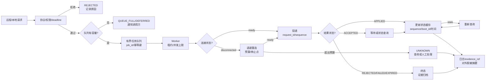

# 第5章 Linux 现场自动化与 Python Bridge：队列、重连与状态缓存

## 学习目标

完成本章后，读者应能够：

1. 区分请求队列、执行器、连接状态、结果缓存和证据归档各自的职责。
2. 解释有界队列、背压、并发上限、任务租约和优雅停止如何影响 Linux/Bridge 控制链。
3. 设计连接断开、退避重连、重连预算和 UNKNOWN 处理路径。
4. 使用状态缓存时明确 freshness、sequence、boot_id 和重新查询条件。
5. 在不声称“恰好一次”交付的前提下，用幂等键和状态查询降低重复控制风险。
6. 把 Python Bridge 进程作为受控 Linux 服务运行，并为启动、停止、崩溃和回滚保留证据。
7. 将队列、重连和缓存行为交接给第四篇 Python Bridge 与第五篇 App Lab。

## 导言：现场自动化不是“加一个 while 循环”

第三篇第 4 章已经定义了安全 operation、请求信封、幂等键、结果状态和远程停止点。本章进一步处理真实系统中必然出现的时间问题：

- 请求到达速度高于 MCU 或 Bridge 的处理速度；
- Linux 服务在请求排队时重启；
- SSH、ADB、Network Mode 或 Router 连接暂时中断；
- 请求已经发出，但结果还没有返回；
- 状态缓存仍然存在，但已经跨越了 Linux 或 MCU 的启动周期；
- App Lab、后台服务和人工操作同时提交了相互冲突的请求。

这些问题不能靠无限重试解决。一个可解释的现场自动化系统应把请求分成四个阶段：

$$
\text{接收}
\rightarrow
\text{排队}
\rightarrow
\text{受控投递}
\rightarrow
\text{结果确认}
$$

每个阶段都要有容量、超时、所有者、停止条件和证据。如果队列满了，应拒绝或降级，而不是无边界地占用内存；如果连接断了，应按照幂等和状态查询判断，而不是自动重放所有控制请求；如果缓存过期，应标记 stale，而不是继续把旧状态显示成当前事实。

## 1. 自动化边界：队列、连接、缓存与 MCU

### 1.1 五个独立组件

| 组件 | 主要职责 | 不应承担的职责 |
| --- | --- | --- |
| 接收层 | 解析入口请求、认证、限流、生成 run_id | 直接执行任意 shell 或直接写 MCU |
| 队列层 | 有界排队、去重、租约、优先级或拒绝 | 判断硬件是否已经应用 |
| 执行层 | 调用安全 operation、Bridge 或状态查询 | 无限重试、绕过权限 |
| 连接层 | 建立会话、退避、重连、关闭和健康状态 | 把连接成功当作请求成功 |
| 缓存与证据层 | 保存最新已验证状态、sequence、时间和摘要 | 隐藏 UNKNOWN 或用旧值替代实时结果 |

一个组件发生异常时，其结果必须能被其他组件识别。例如连接层进入 DISCONNECTED，队列层应暂停需要连接的任务；缓存层应降低状态可信度；结果层应把未确认的控制请求标记为 UNKNOWN。

### 1.2 请求的所有权

一个请求在生命周期内只能有一个明确的当前所有者：

| 阶段 | 所有者 | 可执行动作 | 停止条件 |
| --- | --- | --- | --- |
| RECEIVED | 接收层 | 校验和入队 | 格式、权限或容量不满足 |
| QUEUED | 队列层 | 等待调度、合并或取消 | deadline、队列过期或人工取消 |
| LEASED | 执行 worker | 在租约内处理 | worker 崩溃、租约到期 |
| SENT | Bridge/Router | 等待对端结果 | deadline、连接断开或明确结果 |
| CONFIRMED | 结果层 | 写入证据和缓存 | 证据不完整时降级 |
| UNKNOWN | 查询/人工流程 | 查询状态、停止或新建请求 | 状态明确或人工关闭 |

如果一个 worker 在超时后仍可能运行，旧任务就不能立即被另一个 worker 重新领取，除非幂等键、租约和对端状态共同保证不会重复应用。

## 2. 队列设计：容量、背压与重复投递

### 2.1 为什么要使用有界队列

无界队列会把上游峰值转化成内存增长、延迟增长和最终失控。对于 UNO Q 这类同时承载 Linux 服务、Python、Bridge 和其他应用的设备，队列必须显式设置：

- 最大任务数或最大字节数；
- 单任务最大参数和输出大小；
- 单 operation 的并发上限；
- 最长等待时间；
- 过期任务的清理方式；
- 队列满时的响应；
- 进程停止时的排空或取消策略。

队列容量不是越大越好。容量增大可能让请求看似成功进入系统，却在真正执行前已经超过 deadline。控制请求通常更需要小队列、短等待和明确拒绝，而不是长时间积压。

### 2.2 背压策略

| 队列状态 | 查询请求 | 控制请求 | 证据动作 |
| --- | --- | --- | --- |
| 正常 | 入队 | 入队 | 记录 queue_depth |
| 接近上限 | 降低采样频率或合并 | 只接受已批准的高优先级 | 记录 pressure |
| 已满 | 返回 QUEUE_FULL | 返回 REJECTED 或人工确认 | 保存拒绝原因 |
| 大量过期 | 丢弃过期查询 | 禁止自动丢弃未确认控制 | 记录过期数量 |
| 服务停止 | 允许只读收尾 | 暂停新控制 | 写入 shutdown 证据 |

背压应该在入口处可见。客户端收到 QUEUE_FULL、EXPIRED 或 DEFERRED 后，应知道是否可以稍后查询、提交新的 request_id，或等待人工处理；不能把所有非成功状态统一包装成“稍后自动重试”。

### 2.3 幂等、合并和取消

- 同一个幂等键只能代表同一个控制意图。
- 两个不同 request_id 可能代表同一个幂等键，服务必须返回已知结果或要求查询。
- 查询类任务可以按目标和时间窗口合并，但合并后要保留所有调用方的关联引用。
- 非幂等控制任务不能因为队列相邻就自动合并。
- 取消排队任务不等于取消已发送到 MCU 的请求。
- 取消结果应写成 CANCELLED、NOT_STARTED 或 UNKNOWN，不能静默删除。

## 3. 任务租约与并发控制

### 3.1 租约解决什么问题

任务租约是 worker 暂时拥有处理权的记录，至少包含：

- job_id 和 request_id；
- worker_id；
- lease_started_at；
- lease_expires_at；
- 当前尝试次数；
- operation 和幂等键；
- 最近心跳或进度；
- 结果或 UNKNOWN 原因。

租约不是锁住整个系统。它只说明某个 worker 在一个有限时间内负责处理任务。租约到期后，是否可以重新领取，必须取决于 operation 是否幂等、是否已经发送、是否有对端状态和是否存在未确认的外部动作。

### 3.2 并发边界

建议分别限制：

- 全局 worker 数；
- 每个 operation 的 worker 数；
- 每个设备或 MCU 的并发请求数；
- 每个用户或入口的队列深度；
- 每个连接的未完成请求数；
- 每个证据目录的写入速率。

Bridge 或 Router 可以支持多个 Linux 进程，但“支持并发”不等于业务操作可以并发。对同一个执行器、GPIO、PWM、模式状态或配置对象，必须明确串行化、版本号或冲突检测策略。

### 3.3 优先级不是绕过安全

高优先级只影响调度顺序，不应绕过：

- operation 白名单；
- 用户和服务权限；
- deadline；
- MCU 当前状态；
- 资源压力停止点；
- 幂等和结果确认；
- 人工批准的变更边界。

如果高优先级控制需要抢占低优先级任务，必须记录被延迟、取消或丢弃的任务及其 request_id。

## 4. Fig-20：队列、重连与状态缓存闭环

<a id="fig-20-linux-job-queue-reconnect-state-cache"></a>



图 5-1 说明了三个闭环：

- 队列闭环：容量不足时向调用方施加背压，而不是继续积压。
- 连接闭环：断开时有限退避重连；超过预算就停止自动动作并进入 UNKNOWN。
- 状态闭环：APPLIED 或状态查询结果才更新缓存；缓存过期后必须重新查询。

## 5. 第一个 Python 实验：有界任务队列与优雅停止

### 5.1 实验目标

本实验使用 Python asyncio.Queue 构造一个只在内存中运行的有界任务队列。它展示入队超时、deadline、worker 租约、并发上限、过期任务和优雅停止的基本结构。

代码中的 executor 是本地模拟函数，不访问 UNO Q、SSH、ADB、Router 或 MCU。现场实现应把 executor 替换为第三篇第 4 章定义的安全 operation 或 Bridge 适配器，并保留同样的任务状态字段。

### 5.2 代码说明

- 用途：演示有界队列、入队背压、任务 deadline、worker 处理、结果记录和优雅停止。
- 运行环境：Python 3.10 或更高版本的标准库；不要求 UNO Q、网络或第三方包。
- 文件位置：概念脚本；建议保存为 bounded-bridge-queue.py。
- 依赖：Python 标准库 asyncio、dataclasses、time、uuid 和 typing；executor 仅为本地模拟。
- 操作步骤：先运行本地模拟，观察 QUEUED、APPLIED、EXPIRED 和 STOPPED；替换 executor 前先定义真实 operation、幂等和回滚边界。
- 预期输出：每个 job_id 输出一个结构化状态，队列满或 deadline 到期时不无限等待；这是示例输出，不是 UNO Q 实测输出。
- 故障排查：优先检查 queue maxsize、入队 timeout、worker 数量和 deadline；不要通过改成无界队列掩盖背压。
- 验证方式：构造快速提交、短 deadline、worker 停止和重复幂等键场景，核对任务不会在停止后继续被无界领取。

```python
from __future__ import annotations

import asyncio
import time
import uuid
from dataclasses import dataclass, field
from typing import Any


@dataclass(frozen=True)
class Job:
    job_id: str
    request_id: str
    operation: str
    idempotency_key: str
    deadline: float
    args: dict[str, Any] = field(default_factory=dict)


async def local_executor(job: Job) -> dict[str, Any]:
    await asyncio.sleep(0.05)
    if time.monotonic() > job.deadline:
        return {
            "job_id": job.job_id,
            "request_id": job.request_id,
            "status": "EXPIRED",
            "error_code": "deadline_exceeded",
        }
    return {
        "job_id": job.job_id,
        "request_id": job.request_id,
        "status": "APPLIED",
        "sequence": int(time.monotonic() * 1000),
    }


async def submit(
    queue: asyncio.Queue[Job],
    job: Job,
    timeout_seconds: float = 0.1,
) -> dict[str, Any]:
    try:
        await asyncio.wait_for(queue.put(job), timeout=timeout_seconds)
    except asyncio.TimeoutError:
        return {
            "job_id": job.job_id,
            "request_id": job.request_id,
            "status": "QUEUE_FULL",
            "retry_advice": "wait_for_capacity",
        }
    return {
        "job_id": job.job_id,
        "request_id": job.request_id,
        "status": "QUEUED",
    }


async def worker(
    name: str,
    queue: asyncio.Queue[Job],
    results: asyncio.Queue[dict[str, Any]],
    stop: asyncio.Event,
) -> None:
    while not stop.is_set():
        try:
            job = await asyncio.wait_for(queue.get(), timeout=0.1)
        except asyncio.TimeoutError:
            continue

        try:
            if time.monotonic() > job.deadline:
                result = {
                    "job_id": job.job_id,
                    "request_id": job.request_id,
                    "status": "EXPIRED",
                    "worker": name,
                }
            else:
                result = await local_executor(job)
                result["worker"] = name
            await results.put(result)
        finally:
            queue.task_done()


async def demo() -> None:
    queue: asyncio.Queue[Job] = asyncio.Queue(maxsize=2)
    results: asyncio.Queue[dict[str, Any]] = asyncio.Queue()
    stop = asyncio.Event()
    workers = [
        asyncio.create_task(worker("worker-1", queue, results, stop)),
    ]

    now = time.monotonic()
    jobs = [
        Job(
            job_id=str(uuid.uuid4()),
            request_id=str(uuid.uuid4()),
            operation="bridge_query",
            idempotency_key="query-1",
            deadline=now + 1.0,
        ),
        Job(
            job_id=str(uuid.uuid4()),
            request_id=str(uuid.uuid4()),
            operation="bridge_query",
            idempotency_key="query-2",
            deadline=now - 1.0,
        ),
    ]

    for job in jobs:
        print(await submit(queue, job))

    await queue.join()
    stop.set()
    await asyncio.gather(*workers)
    while not results.empty():
        print(await results.get())


if __name__ == "__main__":
    asyncio.run(demo())
```

Python asyncio 队列本身不提供操作超时参数，入队和出队超时应由 wait_for 等外围机制控制。示例用 queue.join 等待已入队任务完成，再设置 stop，体现了“先排空，再停止”的顺序；真实服务还要处理进程收到停止信号时未完成的 SENT 任务，并将其按规则转为 UNKNOWN 或查询待办。

### 5.3 实验结果的边界

- QUEUED 只表示任务进入 Linux 内存队列。
- APPLIED 这里只是本地模拟结果，真实系统必须来自 Bridge/MCU。
- QUEUE_FULL 是背压信号，不是系统故障，也不是自动重试授权。
- EXPIRED 任务不能因为 worker 恢复就自动发送。
- 优雅停止只处理尚未发送或可安全取消的任务；已经发送的控制请求仍需查询或人工处理。

## 6. 连接重连与状态缓存

### 6.1 连接状态机

建议把连接状态显式记录为：

| 状态 | 进入条件 | 允许动作 | 离开条件 |
| --- | --- | --- | --- |
| DISCONNECTED | 尚未建立或连接已断 | 阻止发送，允许有限重连 | CONNECTING |
| CONNECTING | 正在建立连接 | 使用退避和连接预算 | READY 或 DISCONNECTED |
| READY | 会话和协议检查通过 | 发送受控请求、查询状态 | DEGRADED 或 DRAINING |
| DEGRADED | 连接可用但延迟、错误或资源异常 | 只允许低风险查询或批准控制 | READY、DRAINING 或 DISCONNECTED |
| DRAINING | 服务准备停止 | 完成安全收尾，不接收新控制 | STOPPED |
| UNKNOWN | 结果链断裂 | 查询、保留证据、人工处置 | CONFIRMED 或 CLOSED |

连接状态不能直接复用服务 active。systemd 认为进程仍在运行，不表示 SSH、Router、Bridge 或 MCU 逻辑连接健康。

### 6.2 退避和重连预算

重连策略至少定义：

- 初始等待；
- 最大等待；
- 抖动范围；
- 最大尝试次数；
- 最大总时长；
- 每次连接的握手超时；
- 连接成功后的协议和状态查询；
- 预算耗尽后的状态。

推荐使用指数退避加有限抖动，避免多个 worker 同时重连。重连预算是安全边界，不是越大越可靠。控制请求一旦超过 deadline，就算连接恢复也不能直接发送；应重新查询状态并由调用方生成新 request_id。

### 6.3 状态缓存的可信度

缓存条目至少保存：

- state；
- sequence；
- observed_at；
- monotonic_observed；
- boot_id；
- source；
- freshness window；
- evidence_ref；
- 是否由 APPLIED 或只读查询产生。

缓存状态可以分为：

- FRESH：在 freshness window 内，boot_id 和 sequence 连续；
- STALE：超过时间窗口，需要查询；
- INVALID：boot_id 变化、sequence 倒退或来源冲突；
- UNKNOWN：无法判断真实当前状态。

显示缓存时必须显示状态年龄和来源。用户界面不应把“最后一次已知状态”写成“当前状态”。

### 6.4 重连后的对账顺序

连接恢复后按以下顺序对账：

1. 记录新的连接时间、Linux boot_id 和连接标识。
2. 读取 Bridge 或 Router 的健康状态。
3. 查询 MCU 当前状态和最近 sequence。
4. 将本地未完成 request_id 与幂等键标记为待核对。
5. 对 APPLIED、REJECTED、EXPIRED 和 FAILED 分别归档。
6. 对没有最终结果的请求保留 UNKNOWN。
7. 只有在状态查询和权限检查通过后，才允许新控制请求。
8. 清理过期缓存，但保留证据引用和清理原因。

## 7. 第二个 Python 实验：有限重连与缓存对账

### 7.1 实验目标

本实验实现一个内存中的连接重试和状态缓存模型。它不创建真实网络连接，而是通过 connector 函数模拟成功、断开和恢复，展示如何在预算用尽时返回 UNKNOWN，以及如何在重连后通过新的状态查询更新缓存。

### 7.2 代码说明

- 用途：演示连接状态、指数退避、重连预算、UNKNOWN 结果和状态缓存 freshness/对账。
- 运行环境：Python 3.10 或更高版本的标准库；connector 为本地模拟函数。
- 文件位置：概念脚本；建议保存为 reconnect-and-cache.py。
- 依赖：Python 标准库 asyncio、dataclasses、enum、time 和 typing；不要求网络、SSH、ADB 或 UNO Q。
- 操作步骤：先运行一次成功连接和一次预算耗尽场景，再把 connector 替换为真实传输适配器；替换前先定义握手、查询和关闭语义。
- 预期输出：连接成功时更新缓存，预算耗尽时返回 UNKNOWN，过期缓存重新进入查询路径；这是模拟输出，不是现场结果。
- 故障排查：检查退避上限、总预算、boot_id 变化、sequence 连续性和 freshness window；不要把 READY 直接当作 MCU APPLIED。
- 验证方式：注入断开、旧 sequence、boot_id 变化和过期缓存，确认缓存被标记为 STALE/INVALID/UNKNOWN，并且没有自动重放旧控制。

```python
from __future__ import annotations

import asyncio
import time
from dataclasses import dataclass
from enum import Enum
from typing import Any, Awaitable, Callable


class LinkState(str, Enum):
    DISCONNECTED = "DISCONNECTED"
    CONNECTING = "CONNECTING"
    READY = "READY"
    UNKNOWN = "UNKNOWN"


@dataclass
class CacheEntry:
    state: str
    sequence: int
    boot_id: str
    observed_monotonic: float
    source: str

    def freshness(self, now: float, max_age: float) -> str:
        if self.boot_id == "":
            return "INVALID"
        if now - self.observed_monotonic > max_age:
            return "STALE"
        return "FRESH"


async def deliver_with_budget(
    connector: Callable[[], Awaitable[str]],
    attempts: int = 3,
    budget_seconds: float = 1.0,
) -> dict[str, Any]:
    started = time.monotonic()
    state = LinkState.DISCONNECTED
    delay = 0.05

    for attempt in range(1, attempts + 1):
        if time.monotonic() - started >= budget_seconds:
            break
        state = LinkState.CONNECTING
        try:
            boot_id = await asyncio.wait_for(
                connector(),
                timeout=min(delay, budget_seconds),
            )
        except (asyncio.TimeoutError, ConnectionError):
            state = LinkState.DISCONNECTED
            await asyncio.sleep(delay)
            delay = min(delay * 2, 0.4)
            continue

        state = LinkState.READY
        return {
            "status": "READY",
            "link_state": state.value,
            "attempt": attempt,
            "boot_id": boot_id,
        }

    state = LinkState.UNKNOWN
    return {
        "status": "UNKNOWN",
        "link_state": state.value,
        "error_code": "reconnect_budget_exhausted",
        "retry_advice": "manual_review_or_new_request",
    }


def reconcile_cache(
    cache: CacheEntry | None,
    observed: dict[str, Any],
    max_age: float = 2.0,
) -> dict[str, Any]:
    now = time.monotonic()
    if cache is None:
        return {
            "cache_status": "INVALID",
            "action": "query_required",
        }

    if observed.get("boot_id") != cache.boot_id:
        return {
            "cache_status": "INVALID",
            "action": "query_required",
            "reason": "boot_id_changed",
        }

    if observed.get("sequence", 0) < cache.sequence:
        return {
            "cache_status": "INVALID",
            "action": "query_required",
            "reason": "sequence_regressed",
        }

    freshness = cache.freshness(now, max_age)
    if freshness != "FRESH":
        return {
            "cache_status": freshness,
            "action": "query_required",
        }

    return {
        "cache_status": freshness,
        "action": "cache_usable_for_observation",
        "state": cache.state,
        "sequence": cache.sequence,
    }


async def demo() -> None:
    calls = 0

    async def connector() -> str:
        nonlocal calls
        calls += 1
        if calls < 2:
            raise ConnectionError("simulated disconnect")
        return "boot-example"

    link = await deliver_with_budget(connector)
    print(link)

    cache = CacheEntry(
        state="SAFE_STOP",
        sequence=12,
        boot_id="boot-example",
        observed_monotonic=time.monotonic(),
        source="mcu-query",
    )
    print(reconcile_cache(cache, {"boot_id": "boot-example", "sequence": 12}))


if __name__ == "__main__":
    asyncio.run(demo())
```

这个示例把连接 READY 与缓存可用分开处理：连接恢复后仍需核对 boot_id、sequence 和 freshness。真实系统还要把缓存更新和 evidence_ref 写入同一条事务记录，避免状态已经更新但证据没有保存。

## 8. 服务化运行与安全停止

### 8.1 systemd 只负责进程生命周期

在使用 systemd 的 Linux 环境中，service unit 是被管理和监督的进程描述。它可以负责：

- 启动 Python Bridge；
- 设置工作目录和用户；
- 记录退出、重启和停止；
- 限制资源和权限；
- 将服务日志交给 journal。

它不能代替 Bridge 的 operation 白名单、请求幂等、MCU 状态查询和控制结果验证。服务 active 仍然只说明进程管理层观察到运行态。

### 8.2 服务配置的设计项

| 设计项 | 课程建议 | 需要现场核对 |
| --- | --- | --- |
| User | 使用专用普通用户 | 用户、组和设备访问权限 |
| WorkingDirectory | 使用明确的应用目录 | 目录所有者和持久化位置 |
| ExecStart | 指向固定 Python 入口 | Python 路径、虚拟环境和参数 |
| Restart | 只对可安全恢复的进程启用 | 重启是否会重复投递请求 |
| RestartSec | 设定最小重启间隔 | 是否与重连预算冲突 |
| TimeoutStopSec | 给任务收尾时间 | 未完成请求如何标记 UNKNOWN |
| NoNewPrivileges | 默认启用并审查例外 | 目标 operation 是否需要提升 |
| ProtectSystem/PrivateTmp | 按服务需要收紧 | 是否影响证据目录和设备访问 |
| Resource controls | 结合第三篇第 3 章设置 | 是否会影响 Bridge 延迟或日志 |

任何 unit 文件、启动策略或权限变更都属于写操作。默认学习实验只观察 unit、状态和日志，不直接安装、启用或重启现场服务。

### 8.3 优雅停止

服务收到停止信号时：

1. 停止接收新的控制请求。
2. 保留仍在队列中的任务及其状态。
3. 允许安全的只读查询完成。
4. 对已发送但无最终结果的请求写入 UNKNOWN 待办。
5. 关闭连接并写入 shutdown evidence_ref。
6. 退出进程，等待 systemd 或人工决定是否再次启动。

不要在 finally 中无条件重放未完成任务。重启后应通过 request_id、幂等键和 MCU 状态查询进行对账。

## 9. 现场自动化运行手册

### 9.1 日常运行

每日或每次部署前，检查：

- 队列深度、QUEUE_FULL、过期任务和 UNKNOWN 数量；
- worker 活跃度、租约超时和执行耗时；
- 连接状态、重连次数、最近握手和 Router/Bridge 健康；
- 状态缓存年龄、boot_id、sequence 和来源；
- journal、磁盘和证据目录可写性；
- 服务版本、配置版本和当前 git_commit。

指标异常时先停止非必要控制请求，再做状态查询和证据保存。不要因为服务仍 active 就忽略队列或缓存异常。

### 9.2 部署前后

部署前：

1. 保存当前服务、队列、连接和缓存摘要。
2. 记录旧版本、回滚介质和哈希。
3. 确认队列中没有未处理的高风险控制请求。
4. 设定维护窗口和人工停止点。

部署后：

1. 启动服务但先禁止新控制 operation。
2. 验证进程、日志、资源和连接。
3. 执行只读状态查询，确认缓存建立。
4. 以最小范围的新 request_id 做受控验证。
5. 核对 MCU sequence、状态反馈和 evidence_ref。
6. 通过人工确认后再开放控制请求。

### 9.3 队列和缓存清理

清理不是删除证据：

- 删除过期查询任务前记录数量和原因；
- 关闭 UNKNOWN 任务前记录人工决定和最终状态；
- 清理缓存时保留最后一次状态、sequence、boot_id 和 evidence_ref；
- 轮转日志前确认当前变更或控制请求已经完成对账；
- 任何自动清理都必须有保留期限和失败处理。

## 10. 故障处理矩阵

| 编号 | 观察 | 可能边界 | 安全动作 | 最小证据 |
| --- | --- | --- | --- | --- |
| LNX-29 | 队列持续接近上限 | 上游突发、worker 太少或 MCU 处理慢 | 施加背压，暂停非必要控制 | queue_depth、入队率、处理率 |
| LNX-30 | QUEUE_FULL 后请求持续重试 | 客户端误解状态或没有退避 | 返回明确 retry_advice，限制来源 | request_id、来源、重试次数 |
| LNX-31 | worker 租约到期但任务可能已发送 | worker 崩溃、网络延迟或结果丢失 | 禁止直接重领，先按幂等键查询 | job_id、lease、request_id |
| LNX-32 | 重连次数快速增加 | 网络、Router、服务或资源不稳定 | 进入 DEGRADED，停止新控制 | 连接时间线、退避、资源 |
| LNX-33 | 连接 READY 但缓存过期 | 只恢复传输层，未完成状态查询 | 标记 STALE，先查询 MCU | boot_id、sequence、年龄 |
| LNX-34 | sequence 倒退或 boot_id 改变 | MCU/Linux 重启、旧响应或缓存污染 | 标记 INVALID，禁止使用旧缓存 | 新旧 sequence、boot_id |
| LNX-35 | systemd 重启导致重复投递 | 无幂等、队列恢复错误或旧请求重放 | 暂停控制，进行对账 | unit 日志、幂等键、MCU 状态 |
| LNX-36 | 服务停止时仍有 SENT 请求 | 关闭顺序或超时处理不完整 | 记录 UNKNOWN，禁止退出后自动重放 | shutdown、请求列表、查询结果 |

## 11. Linux 现场自动化与 Python Bridge 验证矩阵

| 编号 | 主张 | 验证方式 | 最小证据 | 状态 |
| --- | --- | --- | --- | --- |
| LNX-29 | 有界队列能够施加背压而不是无限增大 | 填满队列并观察入队结果 | maxsize、QUEUE_FULL、队列深度 | NOT_RUN |
| LNX-30 | deadline 和过期任务不会在 worker 恢复后自动投递 | 构造已过期任务 | EXPIRED、无发送记录 | NOT_RUN |
| LNX-31 | worker 租约到期不会造成未确认控制重复投递 | 在 SENT 前后注入 worker 崩溃 | lease、幂等键、对账记录 | NOT_RUN |
| LNX-32 | 重连使用有限预算和退避 | 注入连续断开和恢复 | attempt、delay、budget、UNKNOWN | NOT_RUN |
| LNX-33 | READY 不等于缓存 FRESH 或 MCU APPLIED | 恢复连接后提供过期缓存 | cache_status、状态查询、sequence | NOT_RUN |
| LNX-34 | boot_id/sequence 变化会使缓存失效 | 模拟重启和乱序响应 | INVALID、查询要求、无旧值使用 | NOT_RUN |
| LNX-35 | systemd 重启不会盲目重放旧控制请求 | 测试服务停止/启动和队列恢复 | shutdown、UNKNOWN、幂等对账 | NOT_RUN |
| LNX-36 | 服务停止能安全处理 SENT 和 QUEUED 任务 | 执行优雅停止演练 | drain、取消、UNKNOWN、evidence_ref | NOT_RUN |

## 12. 与后续篇章的交接

### 12.1 交给第四篇 Python Bridge

第四篇可以在本章基础上实现：

- 以 asyncio.Queue 或持久化队列为基础的任务调度；
- operation 级并发限制和租约；
- Bridge/Router 连接适配器和重连；
- request_id、幂等键和状态缓存；
- 测试替身、故障注入和不确定结果审计；
- systemd 服务化部署说明。

实现时要把传输、队列、结果、缓存和证据拆成可替换组件，不要让一个全局 while 循环承担所有职责。

### 12.2 交给第五篇 App Lab

App Lab UI 只提交结构化请求和显示状态年龄、来源、sequence、结果与 evidence_ref。队列已满、缓存过期、连接 DEGRADED 和 UNKNOWN 都应在界面中有不同呈现，不要统一显示“运行中”。

### 12.3 与第二篇 MCU

MCU 必须对重复、过期、无权限、范围错误和状态不允许的请求独立判断。Linux 队列的重试、服务重启和缓存恢复不能替代 MCU 的 deadline、sequence、状态机和 SAFE_STOP。

## 13. 本章验证结果

截至 2026-09-21，本章完成了以下文档级工作：

- 建立接收层、队列层、执行层、连接层和缓存证据层的职责边界。
- 定义有界队列、背压、任务租约、并发限制、幂等和取消语义。
- 定义连接状态、退避重连、重连预算、状态缓存 freshness 和重连对账流程。
- 创建 Fig-20 Mermaid 源文件，并保留正文内联流程图。
- 提供有界任务队列和有限重连/缓存对账两个 Python 概念实验。
- 增加 LNX-29 至 LNX-36 故障处理和验证矩阵。
- 明确第三篇到第四篇 Python Bridge、第五篇 App Lab 和第二篇 MCU 的交接边界。

本章状态仍为 draft。当前未在实际 UNO Q 上执行队列压力演练、Router/Bridge 重连、systemd 服务化部署、缓存对账、远程操作或 MCU 硬件反馈验证，因此不把示例输出声明为实机结果。

## 14. 常见问题

### Q1：队列越大是不是越不容易丢请求？

不一定。队列越大，等待时间和过期风险可能越高，也会占用 Linux 资源。控制任务更需要有界容量、明确背压和可查询的拒绝原因。

### Q2：连接恢复后可以自动发送队列里的控制请求吗？

不能一概而论。先检查 deadline、幂等键、MCU 当前状态和是否已经发送过。没有最终结果的请求通常应先进入 UNKNOWN 对账，而不是直接重放。

### Q3：缓存显示 SAFE_STOP，是否可以认为 MCU 当前仍然 SAFE_STOP？

只有在 freshness、boot_id、sequence 和来源都满足要求时，缓存才能作为有限时间内的观察证据。过期或跨启动缓存必须重新查询。

### Q4：systemd 自动重启 Bridge 是不是高可用？

自动重启只处理进程生命周期。它可能丢失内存队列、重复发送或制造 UNKNOWN。高可用还需要持久化策略、幂等、状态查询、证据和人工停止点。

### Q5：为什么不追求“恰好一次”发送？

跨进程、网络、Router 和 MCU 的分布式链路很难仅靠 Linux 端保证恰好一次。更可靠的做法是明确可能重复投递，用幂等键、sequence、状态查询和结果审计降低重复应用风险。

## 15. 本章小结

现场自动化的核心不是让系统永不停止，而是让它在压力、断开、重启和不确定状态下仍然可解释：

1. 用有界队列和背压保护 Linux 资源。
2. 用租约和并发限制明确任务所有权。
3. 用退避和重连预算避免连接风暴。
4. 用幂等键、request_id 和状态查询处理重复与 UNKNOWN。
5. 用 boot_id、sequence、时间和 freshness 判断缓存是否可信。
6. 用优雅停止和 systemd 生命周期保护未完成请求。
7. 用 evidence_ref 把队列、连接、缓存和 MCU 结果串成一条证据链。

完成本章后，读者应能把第三篇前五章串成从 Linux 基础、设备网络服务、可观测性、远程请求到现场自动化的完整运行模型，并为第四篇 Python Bridge 的工程实现做好结构准备。

## 16. 交叉引用与参考资料

- [第三篇第 1 章：Linux 侧开发基础](./第1章_Linux侧开发基础_文件系统进程与MCU边界.md)
- [第三篇第 2 章：Linux 设备、网络与服务](./第2章_Linux设备网络与服务_从可见到可用.md)
- [第三篇第 3 章：Linux 可观测性与资源管理](./第3章_Linux可观测性与资源管理_日志时间与安全回滚.md)
- [第三篇第 4 章：Linux 远程运维与 Python Bridge](./第4章_Linux远程运维与Python_Bridge_从安全命令到可验证请求.md)
- [第二篇第 9 章：传感、控制与 MCU/Linux 协同闭环](../第2篇_STM32/第9章_综合实验_传感控制与MCU_Linux协同闭环.md)
- [第三篇图示登记](../../images/第3篇_Linux/README.md)
- [参考资料索引](../../resources/references.md)
- [Python asyncio queues](https://docs.python.org/3/library/asyncio-queue.html)
- [Python asyncio tasks and timeouts](https://docs.python.org/3/library/asyncio-task.html)
- [systemd.service](https://github.com/systemd/systemd/blob/main/man/systemd.service.xml)
- [Arduino UNO Q User Manual](https://github.com/arduino/docs-content/blob/main/content/hardware/02.uno/boards/uno-q/tutorials/01.user-manual/content.md)
- [Arduino App specification](https://github.com/arduino/arduino-app-cli/blob/main/docs/app-specification.md)
- [Arduino Router](https://github.com/arduino/arduino-router)
