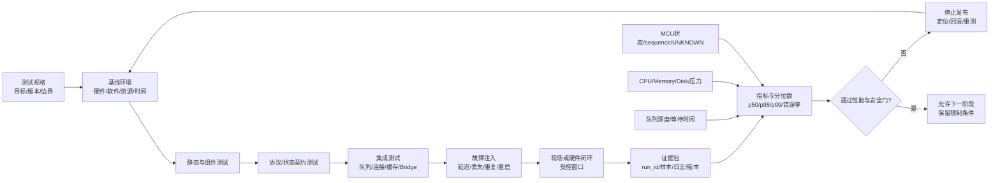

# 第6章 Linux 与 Python Bridge 现场测试与性能治理：从基准、压测到故障注入

## 学习目标

完成本章后，读者应能够：

1. 为 Arduino UNO Q 的 Linux、Python Bridge、队列、连接和缓存链路写出可复现的测试规格。
2. 区分静态检查、组件测试、协议契约测试、集成测试和硬件闭环测试的证据等级。
3. 使用单调时钟和高分辨率性能计时器测量等待时间、Bridge 往返时间、重连时间和缓存年龄。
4. 用样本量、分位数、错误率和资源指标描述性能，而不是用一次最快或平均值代表现场能力。
5. 在不触碰真实设备的前提下，用确定性的传输替身模拟延迟、丢失、重复和陈旧响应。
6. 设计有停止点、回滚路径和证据包的故障注入与现场测试窗口。
7. 把性能预算、测试版本、环境摘要、故障模型和结论交接给第四篇 Python Bridge 与第九篇 Project。

## 背景与边界

第三篇前五章已经建立了 Linux/MPU、设备与网络、可观测性、远程请求、队列、重连和状态缓存的运行模型。本章处理下一层问题：怎样证明这些模型在压力和异常条件下仍然可解释。

“脚本跑通”只能证明一次执行路径没有立即报错；它不能证明请求在 deadline 内完成，不能证明重连后没有重复投递，也不能证明缓存仍然代表 MCU 当前状态。性能治理同样不是寻找一个漂亮的平均值，而是建立以下闭环：

$$
\text{规格}
\rightarrow
\text{基线}
\rightarrow
\text{受控测试}
\rightarrow
\text{故障注入}
\rightarrow
\text{证据分析}
\rightarrow
\text{停止、修复或放行}
$$

本章中的 Python 示例全部是本地概念实验。它们不访问 UNO Q、SSH、ADB、Network Mode、Router、Bridge 或 MCU，不代表任何实机吞吐、延迟、可靠性或功耗结果。凡是需要真实设备、网络、服务重启、MCU 写操作或硬件输出的步骤，都只给出测试设计和安全边界，默认状态为 `NOT_RUN`。

## 1. 测试不是一次运行：先固定问题和证据等级

### 1.1 一条测试规格至少要回答八个问题

每个测试用例都应有稳定的 `case_id`，并回答：

| 问题 | 需要记录的内容 |
| --- | --- |
| 测什么 | operation、连接阶段、队列行为、缓存规则或资源边界 |
| 为什么测 | 安全目标、性能预算、回归风险或发布门 |
| 在什么版本测 | 应用版本、配置版本、Bridge/Router 版本、固件版本和 git commit |
| 在什么环境测 | 主机/目标 Linux、CPU/内存、网络、供电、温度、时间同步状态 |
| 怎么触发 | 输入、并发度、请求间隔、deadline、故障注入和停止条件 |
| 期望什么 | 状态、响应、顺序、错误码、延迟范围和资源上限 |
| 观察到什么 | 原始样本、日志、队列深度、sequence、boot_id、资源和证据引用 |
| 结论是什么 | PASS、FAIL、BLOCKED、NOT_RUN 或 UNKNOWN，以及下一步动作 |

如果测试没有版本、环境或停止条件，后续即使得到一个数字，也无法判断是产品变化、环境变化还是测量方法变化。

### 1.2 五个测试层级

| 层级 | 主要问题 | 允许的动作 | 证据等级 |
| --- | --- | --- | --- |
| 静态检查 | 文档、类型、链接、配置和状态枚举是否自洽 | 读取源码、解析配置、运行 lint 或文档检查 | `DOC_ONLY` |
| 组件测试 | 队列、超时、缓存、退避、幂等模块是否符合局部契约 | 使用内存替身和固定输入 | `HOST_SIM` |
| 协议契约测试 | 请求信封、错误码、sequence、boot_id 和结果状态是否兼容 | 使用 fake transport 或协议回放 | `HOST_SIM`/`CONTRACT` |
| 集成测试 | Linux 服务、Python Bridge、Router、队列和缓存是否正确协作 | 连接测试环境，优先只读和 dry-run | `TARGET_READ_ONLY` |
| 硬件闭环测试 | MCU 是否实际接收、拒绝、应用或安全停止 | 在批准窗口内执行有限写操作和测量 | `TARGET_WRITTEN`/`HW_LOOP` |

证据等级不是质量评分，而是事实范围。`HOST_SIM` 的结果可以证明代码分支被执行，不能升级为 `HW_LOOP` 的时序或电气结论；`TARGET_READ_ONLY` 可以证明访问和观察路径，不等于控制写入成功。

### 1.3 测试用例的最小生命周期

一个用例应从 `PLANNED` 进入 `READY`，完成前置检查后才进入 `RUNNING`。执行结果只能进入 `PASS`、`FAIL`、`BLOCKED`、`NOT_RUN` 或 `UNKNOWN`。其中：

- `PASS` 表示在声明的版本、环境、样本和边界内满足规格；
- `FAIL` 表示观察到与规格冲突的证据；
- `BLOCKED` 表示前置条件或权限不满足，尚未得到行为结论；
- `NOT_RUN` 表示只完成了设计或登记；
- `UNKNOWN` 表示动作可能已经发生，但证据不足以确认最终状态。

不要把“没有日志”写成 `PASS`，也不要把连接失败、权限不足或设备不在场写成 `FAIL`。这几类结果对应的下一步不同：`FAIL` 需要定位实现或配置，`BLOCKED` 需要补齐前置条件，`UNKNOWN` 需要状态查询、人工对账或安全停止。

## 2. 基线与指标：先规定如何计时，再谈快慢

### 2.1 墙上时间、单调时间和 CPU 时间

测试记录至少需要区分三种时间：

| 时间类型 | 适合回答的问题 | 不适合做什么 |
| --- | --- | --- |
| 墙上时间（wall-clock） | 人在什么时候运行、日志和维护窗口如何关联 | 直接计算跨时间同步或时区变化的耗时 |
| 单调时间（monotonic） | 从入队到完成、从断开到恢复经过了多久 | 当作可以展示给用户的日期时间 |
| 性能计时器（`perf_counter`） | 本地短区间的高分辨率经过时间 | 把主机测量直接当作 UNO Q 目标测量 |
| 进程 CPU 时间（`process_time`） | 当前进程实际消耗了多少 CPU | 代表网络等待、磁盘等待或用户感知延迟 |

Python 的 `time.monotonic()` 和 `time.perf_counter_ns()` 用于持续时间测量时，不应和系统墙上时钟相减。墙上时间可以通过 NTP、手工校时或启动周期变化；单调时间和性能计时器的意义是避免这些变化污染持续时间。若要把样本与日志关联，应同时记录 `run_id`、墙上时间和测量用的单调起止值。

### 2.2 Linux/Bridge 链路的时间分解

对一个从入口到结果的请求，可以把总时间拆成：

$$
T_{\text{total}}
=
T_{\text{admission}}
+
T_{\text{queue}}
+
T_{\text{dispatch}}
+
T_{\text{bridge\_rtt}}
+
T_{\text{reconcile}}
$$

其中：

- `T_admission`：参数、权限、容量和 deadline 检查耗时；
- `T_queue`：请求进入有界队列到获得 worker 的等待时间；
- `T_dispatch`：worker 准备 operation、序列化和调用适配器的耗时；
- `T_bridge_rtt`：请求发送到收到 Bridge/Router 响应的往返时间；
- `T_reconcile`：对响应、sequence、boot_id、缓存和证据进行对账的耗时。

应分别保存这些区间，而不是只保存 `T_total`。例如总延迟上升可能来自队列背压，Bridge 本身并没有变慢；若只观察平均总延迟，无法决定是增加 worker、减小入口速率还是定位连接问题。

### 2.3 性能指标字典

| 指标 | 定义 | 典型标签 | 失败时的第一动作 |
| --- | --- | --- | --- |
| 队列深度 | 某一时刻待处理任务数 | `queue_depth` | 停止非必要生产者，检查背压 |
| 队列等待 | 入队时间到 worker 开始时间 | `queue_wait_ms` | 检查生产速率、容量和 worker |
| Bridge 往返 | 发送到响应或超时 | `bridge_rtt_ms` | 区分网络、Router、Bridge 和 MCU |
| 重连时间 | 进入断开到链路再次可用 | `reconnect_ms` | 检查退避、服务、网络和资源 |
| 缓存年龄 | 当前单调时间减最近有效观察时间 | `cache_age_ms` | 标记 `STALE` 并重新查询 |
| 错误率 | 失败、超时、UNKNOWN 占请求的比例 | `error_ratio` | 分开统计错误状态，不把拒绝当成功 |
| 重复响应率 | 同一 `request_id` 收到多个响应的比例 | `duplicate_ratio` | 先去重和对账，不重复应用 |
| 资源压力 | CPU、内存、磁盘、任务数和 I/O 等 | `resource_*` | 关联同一 `run_id` 的资源证据 |

`READY`、`CONNECTED`、`QUEUED` 不是性能成功；它们只是链路或任务生命周期中的中间状态。控制请求仍需根据 MCU 的状态反馈、sequence 和 evidence_ref 判断是否完成。

### 2.4 分位数、样本量和异常值

平均值适合描述总体消耗，不能替代尾延迟。至少同时报告：

- `p50`：典型样本；
- `p95`：大多数请求能达到的尾部边界；
- `p99`：更长尾但需要更多样本；
- 样本数、超时数、错误数和被排除样本的原因。

如果只有几次样本，就不要伪装成稳定的 `p95` 或 `p99`。本章第二个实验在样本不足时明确输出 `null`，让测试报告知道“未计算”与“数值为零”不同。分位数也不能隐藏丢包、重复和 UNKNOWN；这些状态要作为单独计数保留。

### 2.5 资源和安全边界

性能测试期间应把 CPU、内存、磁盘可写空间、任务数、I/O 和日志速率与延迟样本按同一个 `run_id` 关联。Linux `perf` 或性能计数器可以提供更细的观察，但其可用性受内核配置、权限、容器边界和安全策略影响；没有 `perf` 权限不等于系统性能为零，也不应为了测量而放宽生产安全策略。

目标设备上的性能计数器可能暴露跨进程或敏感执行信息。使用 `perf` 前必须核对目标镜像的权限和安全策略，在批准窗口内按最小权限启用；默认实验只记录“可用/不可用及原因”，不修改内核参数、不提升权限、不绕过安全边界。

## 3. Fig-21：测试层、故障注入与证据闭环

<a id="fig-21-linux-test-performance-fault-injection"></a>



> 图示占位：图号=Fig-21；位置=本段之后；内容=展示测试规格、基线、分层测试、故障注入、现场窗口、指标分析和性能/安全门之间的闭环；来源=本项目原创重绘，事实边界见参考资料索引。

图中的“现场或硬件闭环”不是每次测试的默认下一步，而是必须在前置条件、维护窗口、回滚介质和人工停止点均满足后才能进入的阶段。任何一层发现违反规格，都应回到基线和问题定位，不应跳过证据直接放行。

## 4. 第一个 Python 实验：确定性传输替身与故障分类

### 4.1 实验目标

本实验构造一个只在内存中运行的异步传输替身。它可以按测试规格注入固定延迟、无响应、重复响应和陈旧 sequence，帮助读者观察测试框架如何把“没有结果”“结果重复”和“结果过期”分开。

这个实验不是网络模拟器，也不会模拟真实 Router/Bridge 的协议细节。它只提供一个稳定的测试替身接口，使组件测试可以在没有 UNO Q 和没有网络的主机上重复执行。

### 4.2 代码说明

- 用途：演示 fake transport、超时、无响应、重复响应、陈旧 sequence 和结果分类。
- 运行环境：Python 3.10 或更高版本的标准库；不要求 UNO Q、网络、SSH、ADB 或第三方包。
- 文件位置：概念脚本；建议保存为 `fake-bridge-transport.py`。
- 依赖：Python 标准库 `asyncio`、`dataclasses`、`time` 和 `typing`；不创建真实 socket。
- 操作步骤：先运行默认的四个固定故障场景，检查每个 `case_id` 的状态和响应计数；替换为真实适配器前先保留相同的超时、去重和陈旧响应断言。
- 预期输出：`baseline` 返回一条正常响应，`delayed` 在预算内完成，`dropped` 进入 `UNKNOWN`，`duplicated` 报告重复计数，`stale` 被标记为 `STALE`；这是主机模拟输出，不是实机输出。
- 故障排查：检查 `timeout_seconds`、`FaultPlan` 与期望 sequence；不要把无响应改写成 `FAILED`，也不要在测试替身中自动吞掉重复响应。
- 验证方式：逐个启用一种故障并核对状态、响应数量、`request_id` 和 `duplicate_count`；确认陈旧响应不会被当作新缓存。

```python
from __future__ import annotations

import asyncio
import time
from dataclasses import dataclass
from typing import Any


@dataclass(frozen=True)
class Request:
    request_id: str
    operation: str
    expected_sequence: int


@dataclass(frozen=True)
class FaultPlan:
    delay_seconds: float = 0.0
    drop_response: bool = False
    duplicate_response: bool = False
    stale_response: bool = False


class FakeTransport:
    def __init__(self, plan: FaultPlan) -> None:
        self.plan = plan

    async def send(self, request: Request) -> list[dict[str, Any]]:
        await asyncio.sleep(self.plan.delay_seconds)
        if self.plan.drop_response:
            return []

        sequence = request.expected_sequence
        if self.plan.stale_response:
            sequence -= 1

        response = {
            "request_id": request.request_id,
            "operation": request.operation,
            "sequence": sequence,
            "status": "RETURNED",
            "observed_monotonic": time.monotonic(),
            "transport": "fake",
        }
        if self.plan.duplicate_response:
            return [response, {**response, "duplicate": True}]
        return [response]


async def run_case(
    case_id: str,
    transport: FakeTransport,
    request: Request,
    timeout_seconds: float,
) -> dict[str, Any]:
    try:
        responses = await asyncio.wait_for(
            transport.send(request),
            timeout=timeout_seconds,
        )
    except asyncio.TimeoutError:
        return {
            "case_id": case_id,
            "request_id": request.request_id,
            "status": "UNKNOWN",
            "reason": "transport_timeout",
            "responses": 0,
        }

    if not responses:
        return {
            "case_id": case_id,
            "request_id": request.request_id,
            "status": "UNKNOWN",
            "reason": "no_response",
            "responses": 0,
        }

    first = responses[0]
    duplicate_count = max(0, len(responses) - 1)
    status = "STALE" if first["sequence"] < request.expected_sequence else "RETURNED"
    return {
        "case_id": case_id,
        "request_id": request.request_id,
        "status": status,
        "sequence": first["sequence"],
        "responses": len(responses),
        "duplicate_count": duplicate_count,
    }


async def main() -> None:
    request = Request(
        request_id="req-sim-001",
        operation="bridge_query",
        expected_sequence=10,
    )
    cases = (
        ("baseline", FaultPlan()),
        ("delayed", FaultPlan(delay_seconds=0.01)),
        ("dropped", FaultPlan(drop_response=True)),
        ("duplicated", FaultPlan(duplicate_response=True)),
        ("stale", FaultPlan(stale_response=True)),
    )

    for case_id, plan in cases:
        result = await run_case(
            case_id=case_id,
            transport=FakeTransport(plan),
            request=request,
            timeout_seconds=0.05,
        )
        print(result)


if __name__ == "__main__":
    asyncio.run(main())
```

这个实验有三个重要限制：

1. `RETURNED` 只表示传输替身返回了一条字典，不能代表 MCU 已经应用控制。
2. `UNKNOWN` 只表示本次观察没有得到足够响应，后续是否已发生动作仍需真实系统查询或人工对账。
3. `STALE` 和重复响应必须保留为可分析的证据，不能在适配器层静默丢弃后再声称“没有异常”。

## 5. 第二个 Python 实验：基准、尾延迟与故障注入运行器

### 5.1 实验目标

本实验在本地主机上运行一个确定性的异步延迟模型，使用 `perf_counter_ns()` 测量经过时间，使用 `process_time_ns()` 记录进程 CPU 时间，并在样本量足够时计算 `p50` 和 `p95`。它还演示了延迟注入造成的超时如何单独统计。

示例故意不报告 `p99`，因为每个场景只有 20 个样本。真实性能测试应根据 operation 的风险、预算和尾延迟目标增加样本，并保存每个原始样本，而不是只保存汇总数字。

### 5.2 代码说明

- 用途：演示基准场景、延迟故障注入、`perf_counter_ns`、`process_time_ns`、超时计数和分位数门槛。
- 运行环境：Python 3.10 或更高版本的标准库；只在当前主机运行异步 sleep 模型。
- 文件位置：概念脚本；建议保存为 `bridge-benchmark-fault-injection.py`。
- 依赖：Python 标准库 `asyncio`、`dataclasses`、`statistics` 和 `time`；不连接目标设备。
- 操作步骤：先运行 `baseline` 和 `delay-injected` 两个场景，比较完成数、超时数、`p50_ms`、`p95_ms` 和 CPU 时间；将模型替换为真实适配器前，先定义采样量、预算、停止条件和证据格式。
- 预期输出：每个场景输出 20 个计划样本、完成数、超时数、延迟汇总和 CPU 时间；`p99_ms` 保持为 `None`，因为样本不足；这是本地主机模拟输出。
- 故障排查：确认使用的是 `perf_counter_ns` 而不是墙上时间；检查超时样本是否从分位数样本中单独计数，并保留场景、版本和环境信息。
- 验证方式：改变 `timeout_ms` 或延迟序列，确认超时数和错误率变化；将样本数提升到 100 后再验证 `p99_ms` 是否按报告规则出现。

```python
from __future__ import annotations

import asyncio
import statistics
import time
from dataclasses import dataclass
from typing import Any


@dataclass(frozen=True)
class Scenario:
    name: str
    delays_ms: tuple[float, ...]
    timeout_ms: float = 50.0


async def simulated_bridge(delay_ms: float) -> dict[str, str]:
    await asyncio.sleep(delay_ms / 1000.0)
    return {"status": "RETURNED"}


def summarize(samples_ms: list[float]) -> dict[str, Any]:
    if not samples_ms:
        return {
            "n": 0,
            "min_ms": None,
            "max_ms": None,
            "p50_ms": None,
            "p95_ms": None,
            "p99_ms": None,
        }

    summary: dict[str, Any] = {
        "n": len(samples_ms),
        "min_ms": round(min(samples_ms), 3),
        "max_ms": round(max(samples_ms), 3),
        "p50_ms": round(statistics.median(samples_ms), 3),
        "p95_ms": None,
        "p99_ms": None,
    }
    if len(samples_ms) >= 20:
        quantiles = statistics.quantiles(
            samples_ms,
            n=20,
            method="inclusive",
        )
        summary["p95_ms"] = round(quantiles[18], 3)
    if len(samples_ms) >= 100:
        quantiles = statistics.quantiles(
            samples_ms,
            n=100,
            method="inclusive",
        )
        summary["p99_ms"] = round(quantiles[98], 3)
    return summary


async def run_scenario(scenario: Scenario) -> dict[str, Any]:
    samples_ms: list[float] = []
    timeout_count = 0
    started_cpu = time.process_time_ns()

    for delay_ms in scenario.delays_ms:
        started = time.perf_counter_ns()
        try:
            await asyncio.wait_for(
                simulated_bridge(delay_ms),
                timeout=scenario.timeout_ms / 1000.0,
            )
        except asyncio.TimeoutError:
            timeout_count += 1
            continue
        elapsed_ms = (time.perf_counter_ns() - started) / 1_000_000
        samples_ms.append(elapsed_ms)

    cpu_ms = (time.process_time_ns() - started_cpu) / 1_000_000
    return {
        "scenario": scenario.name,
        "planned": len(scenario.delays_ms),
        "completed": len(samples_ms),
        "timeouts": timeout_count,
        "error_ratio": round(timeout_count / len(scenario.delays_ms), 3),
        "latency": summarize(samples_ms),
        "process_cpu_ms": round(cpu_ms, 3),
    }


async def main() -> None:
    baseline = Scenario(
        name="baseline",
        delays_ms=tuple(5.0 + (index % 3) for index in range(20)),
    )
    delay_injected = Scenario(
        name="delay-injected",
        delays_ms=tuple(60.0 if index % 5 == 0 else 5.0 for index in range(20)),
    )

    for scenario in (baseline, delay_injected):
        print(await run_scenario(scenario))


if __name__ == "__main__":
    asyncio.run(main())
```

`perf_counter_ns()` 只负责测量运行计时器所在进程看到的经过时间；操作系统调度、主机负载和异步 sleep 的粒度都会影响样本。`process_time_ns()` 不包括大部分等待时间，因此它更适合回答“进程消耗了多少 CPU”，不能代替请求延迟。

这里把超时样本排除在延迟分位数之外，同时单独报告 `timeouts` 和 `error_ratio`。另一种合理做法是把超时编码成测试预算上限并单独绘制；无论采用哪种方法，都要在测试规格中固定，不能为了得到更好看的分位数临时删除慢样本。

## 6. 故障注入：一次只改变一个假设，再测试组合风险

### 6.1 注入原则

故障注入的目标不是“把系统弄坏”，而是验证系统遇到可预期异常时是否进入预期的安全状态。每次测试应：

1. 先保存基线版本、环境、配置和当前状态摘要。
2. 默认只注入一种故障，确保因果关系可解释。
3. 明确最大持续时间、影响范围、停止命令和回滚介质。
4. 优先使用 fake transport、隔离网络或测试服务，不在生产链路随意丢包。
5. 把注入事件和被测请求绑定到同一个 `run_id`。
6. 一旦出现真实硬件输出异常、未知控制结果、资源耗尽或证据写入失败，立即停止并进入人工处理。
7. 先验证恢复后的状态，再决定是否可以继续下一种故障。

### 6.2 故障模型矩阵

| 故障模型 | 注入点 | 期望观察 | 不允许的结论 |
| --- | --- | --- | --- |
| 固定延迟 | fake transport、测试服务或隔离网络 | `bridge_rtt_ms` 上升，接近预算时出现超时 | 不能把主机 sleep 延迟当作现场网络延迟 |
| 尾延迟 | 少量请求使用更长延迟 | `p95`/`p99` 变化，超时计数独立保留 | 不能只看平均值说系统稳定 |
| 丢失 | 丢弃请求或响应 | `UNKNOWN`、重查询或人工对账路径 | 不能把没有响应写成 MCU 已拒绝 |
| 重复 | 复制响应或重放测试事件 | 去重、sequence/幂等核对、重复计数 | 不能让重复响应触发两次控制 |
| 陈旧状态 | 降低 sequence、改变 boot_id 或延长缓存年龄 | `STALE`/`INVALID`，要求重新查询 | 不能用旧缓存覆盖当前观察 |
| 队列满 | 有界队列达到容量 | `QUEUE_FULL`、背压和 retry advice | 不能把拒绝改成无界排队 |
| 进程重启 | 测试服务或隔离进程 | 持久化/内存队列边界、`UNKNOWN` 对账 | 不能直接重放尚未确认的控制 |
| 资源压力 | 测试 cgroup、受控负载或日志速率 | 资源指标与延迟关联，必要时降级 | 不能为压测放宽生产权限或安全策略 |

### 6.3 故障组合

单一故障通过后，才考虑组合场景，例如“队列接近上限时连接断开”“进程重启时存在 SENT 请求”“缓存过期同时 boot_id 改变”。组合测试应减少并发和影响范围，并保留清晰的基线。组合测试失败时，先拆回单故障，避免把多个问题混成一个不可定位的 `FAILED`。

## 7. 性能治理：预算、基线和放行门

### 7.1 性能预算不是通用常数

一个 operation 的预算应来自它的 deadline、用户体验、MCU 控制周期、网络条件和安全策略。不能从开发主机的一次运行中推导出所有 UNO Q 现场的通用阈值。

可以按下面的方式建立预算：

| 预算项 | 来源 | 超出时的处理 |
| --- | --- | --- |
| 最大排队等待 | operation deadline 减去执行和对账余量 | 入口背压、降低生产速率或拒绝 |
| Bridge 往返上限 | 协议超时、网络窗口和 MCU 响应预算 | 区分超时与拒绝，禁止盲目重放 |
| 重连预算 | 业务允许的降级时长和安全状态 | 预算用尽进入 `UNKNOWN`/`DEGRADED` |
| 缓存 freshness | 状态变化速度和控制风险 | 标记 `STALE` 并重新查询 |
| CPU/内存上限 | 目标 Linux 资源、其他应用和热约束 | 降低并发、暂停非必要任务 |
| 日志/证据空间 | 维护窗口、磁盘配额和保留策略 | 降采样或停止写入型测试，保留摘要 |

预算应版本化。修改 operation deadline、队列容量、重连次数或缓存 freshness window，都应产生新的配置版本和回归测试记录。

### 7.2 一次测试的基线记录

建议每个 `run_id` 至少关联以下字段：

- 软件：应用 commit、Python 版本、Bridge/Router 版本、配置哈希；
- 目标：板卡标识、Linux 镜像、MCU 固件、`boot_id`；
- 环境：网络模式、链路类型、供电、温度、CPU/内存压力、时间同步状态；
- 测试：`case_id`、场景、并发度、样本数、timeout、注入计划；
- 结果：原始样本位置、分位数、错误状态计数、资源摘要、日志引用；
- 决策：阈值版本、`PASS`/`FAIL`/`BLOCKED`/`UNKNOWN`、批准人、回滚或重测建议。

如果只保存 `p95=xx` 而没有原始样本、版本和环境，后续无法判断数字是否可以复现。证据包可以脱敏，但不能删除导致结论不可解释的字段。

### 7.3 放行门

进入下一测试层级前至少检查：

1. 静态检查和协议契约通过，状态枚举和错误路径没有未覆盖项。
2. 基线运行没有资源泄漏、证据写入失败或不明重复。
3. 性能样本达到规格要求；样本不足时明确标记为未完成。
4. 故障注入结果与预期状态一致，尤其是 `UNKNOWN`、`STALE`、`QUEUE_FULL` 和 `DEGRADED`。
5. 未出现未经确认的真实控制输出或安全状态偏离。
6. 回滚介质、人工停止点和下一步查询路径已经准备好。

性能门不应只写“平均值小于某数”。它至少应同时约束尾延迟、错误率、重复率、资源上限和证据完整性。

## 8. 现场测试运行手册

### 8.1 预检阶段：只读确认

现场测试开始前，先完成不改变目标状态的检查：

1. 确认目标板卡、Linux 主机、MCU 固件、应用版本和当前 `boot_id`。
2. 记录网络入口、时间同步状态、磁盘空间、进程和服务状态。
3. 确认没有未对账的 `SENT`、`UNKNOWN` 或高风险控制请求。
4. 检查证据目录可写、日志轮转策略和保留空间。
5. 确认回滚版本、停止命令、人工联系人和维护窗口。
6. 先运行只读健康查询，确认返回值与缓存、sequence 和日志可以关联。

任一项无法确认时，结果应为 `BLOCKED`，而不是继续进入压力或写入测试。

### 8.2 Dry-run 阶段

Dry-run 只走参数、权限、容量、队列、序列化、证据和回滚检查，不向 MCU 发送控制写操作。可以使用前一节的 fake transport 或协议回放，验证：

- `request_id`、`idempotency_key` 和 `run_id` 是否贯穿链路；
- 队列满、deadline 到期和取消是否有明确结果；
- 断开、超时、重复和陈旧响应是否分别分类；
- 证据包中是否同时出现请求、响应、版本和状态；
- 失败时是否停在预定停止点。

Dry-run 通过不等于真实控制通过，但它可以阻止明显的协议和治理错误进入现场窗口。

### 8.3 受控运行阶段

只有在批准窗口内才进入真实目标：

1. 先执行最小范围、只读、低并发的连接和状态查询。
2. 记录首个请求的完整证据，确认日志、Bridge 响应、MCU sequence 和缓存一致。
3. 逐步增加样本或并发，每一步都检查资源、错误、重复、缓存年龄和停止条件。
4. 故障注入只作用于批准的测试对象；生产对象、未授权设备和其他用户请求不在范围内。
5. 出现 `UNKNOWN`、真实输出异常、资源失控或证据断链时，停止继续发包，先查询、隔离和人工对账。

### 8.4 收尾与回滚

收尾时应先停止新请求，再等待允许排空的只读任务结束；对已经发送但没有最终结果的控制请求写入 `UNKNOWN` 待办，不能因为进程退出而假设未发生。回滚后重新执行最小健康查询，确认服务版本、缓存、sequence、日志和安全输出恢复到可接受状态。

“恢复正常”也需要证据。至少保留停止时间、最后请求、未完成列表、回滚版本、回滚结果和后续人工决定。

## 9. 故障处理矩阵

| 编号 | 观察 | 可能边界 | 安全动作 | 最小证据 |
| --- | --- | --- | --- | --- |
| LNX-37 | 延迟注入后尾延迟超过预算 | 队列、网络、Bridge 或目标资源放大尾延迟 | 停止增加负载，分解时间段并恢复基线 | 场景、原始样本、p50/p95、资源 |
| LNX-38 | 请求或响应丢失 | 网络、Router、Bridge、进程或证据链中断 | 保留 `UNKNOWN`，查询状态或人工对账 | request_id、超时、查询结果、run_id |
| LNX-39 | 同一请求出现重复响应 | 重试、重连、缓存重放或对端重复 | 只保留一个可验证结果，禁止重复应用 | request_id、幂等键、sequence、重复数 |
| LNX-40 | 收到陈旧 sequence 或旧 boot_id | 重启、乱序响应、旧缓存或回放 | 标记 `STALE`/`INVALID`，重新查询 | 新旧 sequence、boot_id、缓存年龄 |
| LNX-41 | 队列达到上限或资源持续升高 | 上游突发、worker 不足、日志或内存压力 | 施加背压，暂停非必要控制 | queue_depth、入队率、CPU/内存 |
| LNX-42 | Bridge 进程重启后存在未完成任务 | 内存队列丢失、服务重启或租约到期 | 禁止盲目重放，按幂等键和状态对账 | unit 日志、任务清单、对账记录 |
| LNX-43 | 时间基准或单调时间记录不一致 | 时钟校准、重启、跨主机时间混用 | 分开记录 wall/monotonic，标记测量不可比 | 时间源、boot_id、时钟状态 |
| LNX-44 | `perf`/资源观测不可用或证据空间不足 | 权限、安全策略、内核配置或磁盘压力 | 不放宽权限；降级、停止或标记 `BLOCKED` | 失败原因、资源摘要、权限边界 |

## 10. Linux 与 Python Bridge 性能验证矩阵

| 编号 | 主张 | 验证方式 | 最小证据 | 状态 |
| --- | --- | --- | --- | --- |
| LNX-37 | 延迟和尾延迟能按 operation 预算被测量 | 运行固定样本基线与延迟注入 | run_id、原始样本、p50/p95、预算版本 | NOT_RUN |
| LNX-38 | 无响应不会被误判为失败或成功 | 丢弃响应并执行查询/对账路径 | UNKNOWN、查询结果、停止记录 | NOT_RUN |
| LNX-39 | 重复响应不会导致重复应用 | 复制响应并检查去重、幂等和 sequence | duplicate_count、幂等键、单次应用证据 | NOT_RUN |
| LNX-40 | 陈旧缓存和乱序状态不会覆盖新观察 | 降低 sequence、改变 boot_id 或延长年龄 | STALE/INVALID、重新查询、无旧值使用 | NOT_RUN |
| LNX-41 | 有界队列和资源门能够施加背压 | 填满队列并关联资源样本 | QUEUE_FULL、队列深度、资源摘要 | NOT_RUN |
| LNX-42 | Bridge 重启不会盲目重放未确认控制 | 注入隔离进程重启和租约到期 | UNKNOWN、重启日志、对账结果 | NOT_RUN |
| LNX-43 | wall、monotonic 和 CPU 时间没有混用 | 人为改变墙上时间或跨启动比较 | 时间源字段、boot_id、可比性结论 | NOT_RUN |
| LNX-44 | 观测权限或证据空间不足时系统安全降级 | 隔离测试中拒绝 perf 或限制证据目录 | BLOCKED/DEGRADED、失败原因、无提权记录 | NOT_RUN |

## 11. 与后续篇章的交接

### 11.1 交给第四篇 Python Bridge

第四篇应把本章的测试概念落成可替换的工程组件：

- transport interface 与 fake transport；
- 统一的 `run_id`、`case_id`、`request_id` 和 evidence schema；
- 可配置的超时、重连预算、队列容量和缓存 freshness；
- latency sample、错误状态、重复响应和资源摘要收集器；
- 可暂停、可回滚、可重放但不自动重放控制请求的测试运行器；
- systemd 生命周期与测试证据的关联。

实现时应把时间源、结果分类和证据写入作为显式依赖，不要把 `print` 或单个全局计时器当作性能治理系统。

### 11.2 交给第五篇 App Lab

App Lab 展示测试结果时，应区分：

- 已完成的分位数和样本数；
- 样本不足而未计算的 `p95`/`p99`；
- `TIMEOUT`、`UNKNOWN`、`STALE`、`QUEUE_FULL` 和 `DEGRADED`；
- 模拟、目标只读和硬件闭环三种证据等级；
- 基线版本、测试窗口和限制条件。

界面不能用“绿色”覆盖 `UNKNOWN`，也不能把 `HOST_SIM` 图标显示成“实机性能”。

### 11.3 交给第九篇 Project

综合项目应选取一个低风险、可回滚的 operation 作为贯穿案例，定义：

1. 基线环境和最小样本；
2. 明确的 queue、Bridge、MCU 和缓存预算；
3. 至少一个丢失/重复/陈旧/重启故障；
4. 从主机模拟到目标只读再到硬件闭环的逐级放行；
5. 包含原始样本、日志、版本、资源和结论的证据包。

## 12. 本章验证结果

截至 2026-09-21，本章完成了以下文档级工作：

- 建立静态、组件、协议、集成和硬件闭环五个测试层级及证据等级。
- 定义 wall-clock、monotonic、`perf_counter`、CPU 时间和 Bridge 链路时间分解。
- 建立队列等待、Bridge 往返、重连、缓存年龄、错误率、重复率和资源压力指标字典。
- 创建 Fig-21 Mermaid 源文件，并在正文保留同源内联流程图。
- 提供确定性 fake transport 与基准/故障注入两个 Python 概念实验。
- 增加 LNX-37 至 LNX-44 故障处理和验证矩阵。
- 形成从预检、dry-run、受控运行到回滚收尾的现场测试运行手册。
- 明确第四篇 Python Bridge、第五篇 App Lab 和第九篇 Project 的交接边界。

本章状态仍为 `draft`。当前未在实际 UNO Q 上执行压测、Bridge/Router 网络故障注入、服务重启、`perf` 计数器观测、MCU 写操作或硬件闭环验证；示例中的延迟、分位数和状态均为主机模拟或设计结果，不应引用为实机性能承诺。

## 13. 常见问题

### Q1：为什么不能只报告平均延迟？

平均值会掩盖少量但重要的长尾。控制链路还必须知道超时、UNKNOWN、重复和资源压力；至少应同时报告样本数、p50、p95、错误计数和测试版本。

### Q2：样本不足时可以用插值计算 p95 吗？

数学上可以得到一个数，但它不一定具有足够的统计意义。本章选择在样本不足时明确不报告对应分位数。测试规格可以设定其他规则，但必须提前固定并保留样本量。

### Q3：`perf_counter_ns` 测到的是 UNO Q 的真实性能吗？

不是。它只测量运行计时器所在进程所处环境的经过时间。要得到 UNO Q 性能，必须在目标 Linux、明确版本和受控窗口中运行，并把网络、Bridge、MCU 和资源证据关联起来。

### Q4：丢包后没有响应，能不能直接标记 FAILED？

如果协议能证明请求未发出或对端明确拒绝，可以使用相应状态；如果请求可能已到达但响应丢失，应保留 `UNKNOWN`，先查询或人工对账。`UNKNOWN` 是事实边界，不是失败的同义词。

### Q5：`perf` 没权限是不是必须修改权限后继续？

不应该。观测权限受安全策略约束时，记录不可用原因并把用例标记为 `BLOCKED` 或降低证据等级。不能为了生成一个性能数字而放宽生产安全策略。

### Q6：基线通过后就可以直接做硬件闭环吗？

不能自动升级。还要确认版本、环境、回滚、维护窗口、人工批准、停止条件和未对账请求都满足。基线通过只说明进入下一阶段的条件可能满足。

## 14. 本章小结

Linux 与 Python Bridge 的现场测试应把“能运行”转换为“可重复、可解释、可停止、可回滚”：

1. 先固定测试规格、版本、环境、样本和证据等级。
2. 用单调时间测量持续时间，用墙上时间关联日志，用 CPU 时间观察进程消耗。
3. 把总延迟拆成入队、调度、Bridge 往返和对账阶段。
4. 报告分位数、样本数、超时、UNKNOWN、重复和资源，而不是只报平均值。
5. 用确定性替身测试延迟、丢失、重复和陈旧状态。
6. 用故障注入矩阵和明确停止点保护现场窗口。
7. 只有证据、预算、安全和回滚条件都满足，才允许从主机模拟逐级进入目标和硬件闭环。

完成本章后，第三篇已经从 Linux 基础、设备网络、可观测性、远程请求、现场队列推进到测试与性能治理；下一阶段可以在第四篇把这些边界实现为可测试的 Python Bridge 组件。

## 15. 延伸阅读与交叉引用

- [第三篇第 1 章：Linux 侧开发基础](./第1章_Linux侧开发基础_文件系统进程与MCU边界.md)
- [第三篇第 2 章：Linux 设备、网络与服务](./第2章_Linux设备网络与服务_从可见到可用.md)
- [第三篇第 3 章：Linux 可观测性与资源管理](./第3章_Linux可观测性与资源管理_日志时间与安全回滚.md)
- [第三篇第 4 章：Linux 远程运维与 Python Bridge](./第4章_Linux远程运维与Python_Bridge_从安全命令到可验证请求.md)
- [第三篇第 5 章：Linux 现场自动化与 Python Bridge](./第5章_Linux现场自动化与Python_Bridge_队列重连与状态缓存.md)
- [第二篇第 9 章：传感、控制与 MCU/Linux 协同闭环](../第2篇_STM32/第9章_综合实验_传感控制与MCU_Linux协同闭环.md)
- [第四篇：Python Bridge 预留入口](../第4篇_PythonBridge/README.md)
- [第九篇：Project 预留入口](../第9篇_Project/README.md)
- [第三篇图示登记](../../images/第3篇_Linux/README.md)
- [参考资料索引](../../resources/references.md)
- [Python time](https://docs.python.org/3/library/time.html)
- [Python statistics](https://docs.python.org/3/library/statistics.html)
- [Python asyncio tasks and timeouts](https://docs.python.org/3/library/asyncio-task.html)
- [Linux perf security](https://docs.kernel.org/admin-guide/perf-security.html)
- [Arduino UNO Q User Manual](https://github.com/arduino/docs-content/blob/main/content/hardware/02.uno/boards/uno-q/tutorials/01.user-manual/content.md)
- [Arduino App specification](https://github.com/arduino/arduino-app-cli/blob/main/docs/app-specification.md)
- [Arduino Router](https://github.com/arduino/arduino-router)
