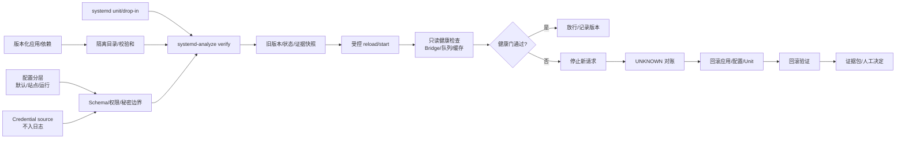

# 第7章 Linux 与 Python Bridge 现场部署与服务化治理：从 systemd、配置分层到安全回滚

## 学习目标

完成本章后，读者应能够：

1. 把 Arduino UNO Q 的 Linux/Python Bridge 发布拆成应用产物、配置、凭据、systemd unit、运行状态和证据六类对象。
2. 区分安装、暂存、daemon-reload、启动、重启、启用、健康检查和放行，不把其中一个动作当作全部部署。
3. 为服务设计普通用户、可写目录、资源上限、停止时限和最小权限边界。
4. 用默认配置、站点配置、秘密材料和运行时覆盖建立可审计的配置优先级。
5. 在不执行真实系统变更的前提下，验证发布清单、版本哈希、配置版本和 unit 版本是否一致。
6. 设计服务升级、排空、UNKNOWN 对账、回滚和回滚后健康验证的现场运行手册。
7. 把部署证据交接给第四篇 Python Bridge、第五篇 App Lab 和第九篇 Project。

## 背景与边界

第三篇第 6 章解决了如何测试延迟、尾部样本和故障注入。本章继续处理“测试通过后怎样进入现场”的问题。部署不是把一个 Python 文件复制到目标机，再执行一次 systemctl start；它是对应用版本、配置、凭据、进程生命周期、资源边界和未完成请求共同做出的受控变更。

对于 Arduino UNO Q，Linux 服务可能与 App、Bridge、Router、MCU 查询和其他本地进程共同运行。服务管理器可以监督进程、建立依赖和施加部分资源/权限边界，但它不能替代 operation 白名单、幂等键、MCU 状态机、缓存 freshness 或 UNKNOWN 对账。

本章的所有命令和示例都按“设计与验证边界”编写。除非明确进入批准的维护窗口，否则不安装 unit、不启用服务、不重启现场进程、不替换目标配置、不写入 MCU，也不把服务的 active 状态当作业务健康。示例 Python 只在主机内存中运行，默认不会访问 UNO Q、SSH、ADB、网络或 systemd。

## 1. 部署对象与状态：先知道正在改变什么

### 1.1 六类部署对象

| 对象 | 内容 | 变更方式 | 回滚依据 |
| --- | --- | --- | --- |
| 应用产物 | Python 包、入口、依赖和构建元数据 | 版本化暂存，不覆盖当前运行目录 | release_id、SHA-256、旧目录 |
| 配置 | 默认值、站点参数、operation 预算和资源边界 | 分层合并，校验后再激活 | config_revision、差异和旧副本 |
| 凭据 | 令牌、证书、设备访问材料或受保护输入 | 从受控来源注入，不进 Git/日志 | credential revision、吊销/替换记录 |
| systemd unit | User、ExecStart、路径、重启、权限和资源设置 | drop-in 或版本化 unit，经语法核验 | unit_revision、原 unit/drop-in |
| 运行状态 | 进程、队列、连接、缓存、boot_id 和未完成请求 | 由服务和观察工具产生 | snapshot、journal、对账清单 |
| 证据包 | 版本、配置、日志、健康结果、批准和决定 | 追加写入、脱敏、可追溯 | evidence_ref、run_id、保留策略 |

这六类对象不能混成一个“部署包”。例如只回滚应用文件而保留了不兼容的配置，可能让服务启动但行为错误；只恢复 unit 而没有处理已经发送的请求，可能制造重复控制；只看服务日志而没有保存版本哈希，则无法证明运行的是哪一份产物。

### 1.2 部署生命周期

| 状态 | 含义 | 最小证据 | 允许的下一步 |
| --- | --- | --- | --- |
| PLANNED | 变更已设计但未准备 | release_id、范围、停止条件 | 生成清单和回滚方案 |
| STAGED | 产物、配置和凭据引用已进入隔离位置 | 哈希、权限、目录和版本 | 做静态验证和 dry-run |
| VERIFIED | unit、配置、依赖和发布清单通过 | verify 输出、差异、审批 | 进入维护窗口 |
| ACTIVATING | 正在 reload/start/restart 或切换版本 | 操作时间线、操作者、unit revision | 等待健康门，不接收新控制 |
| HEALTHY | 进程、只读健康、Bridge、队列和缓存满足门槛 | 健康报告、日志、run_id | 放行下一步或小流量 |
| DEGRADED | 服务存在但部分依赖、资源或缓存不满足 | 具体指标和限制 | 降级、暂停控制或人工处理 |
| ROLLBACK_REQUIRED | 健康门失败或证据断链 | 失败原因、未完成请求 | 停止新请求并回滚 |
| ROLLED_BACK | 旧版本已恢复并重新验证 | 旧版本哈希、健康结果 | 关闭变更或重新规划 |
| UNKNOWN | 变更或控制可能发生，但结果证据不足 | request_id、查询待办 | 状态查询、人工对账或安全停止 |

`systemctl start` 返回成功最多只说明管理器接受了启动作业；它不能自动证明 Bridge 已连接、队列为空、缓存新鲜或 MCU 已应用请求。放行必须由独立健康门完成。

### 1.3 发布身份

每次发布至少生成一个不可复用的 `release_id`，并把以下字段贯穿应用、日志和证据：

- `release_id`：本次候选发布的业务标识；
- `artifact_sha256`：应用产物或归档的内容摘要；
- `config_revision`：合并后的非秘密配置版本；
- `credential_revision`：凭据引用或轮换版本，不记录秘密值；
- `unit_revision`：unit 和 drop-in 的版本；
- `run_id`：本次部署/健康/回滚运行标识；
- `previous_release_id`：当前运行版本，用于回滚和对比。

如果这些字段不能在日志、状态查询和证据包之间关联，发布结论只能是有限的 `BLOCKED` 或 `UNKNOWN`。

## 2. systemd 的职责边界：生命周期不等于业务健康

### 2.1 unit 的四个问题

一个 Python Bridge service unit 至少要回答：

1. **由谁运行**：使用哪个用户、组和环境；
2. **运行什么**：固定的 Python 解释器、入口、工作目录和参数；
3. **如何停止**：收到停止请求时给任务多少时间、如何处理子进程和未完成请求；
4. **能占用什么**：哪些目录可写、哪些设备可见、可以使用多少 CPU、内存、任务和 I/O。

`[Unit]` 描述依赖和顺序，`[Service]` 描述被监督的进程及执行环境，`[Install]` 描述安装到启动目标的关系。具体可用字段受目标 systemd 版本和镜像编译选项影响，不能只因为开发主机支持某字段，就假设 UNO Q 当前镜像一定支持。

### 2.2 常见动作的不同含义

| 动作 | 改变什么 | 风险 | 验证重点 |
| --- | --- | --- | --- |
| 安装文件 | 把 unit、应用或配置放到目标路径 | 覆盖、权限和路径错误 | 哈希、所有者、模式和差异 |
| `systemctl daemon-reload` | 让管理器重新读取 unit 文件 | 只重读配置，不重启进程 | unit 语法、当前进程是否仍是旧版本 |
| `systemctl start` | 启动当前未运行的 unit | 可能接收请求但依赖未健康 | 主进程、日志、Bridge、只读查询 |
| `systemctl restart` | 停止并启动服务 | 中断请求、制造 UNKNOWN 或重复风险 | 停止收尾、未完成清单、重启后对账 |
| `systemctl reload` | 让服务按自身协议重载 | 应用可能不支持或只重载部分配置 | 应用确认、配置 revision、无需重启的边界 |
| `systemctl enable` | 建立开机启动关系 | 改变后续启动行为 | 是否批准、依赖顺序、回滚方式 |
| `systemctl disable` | 移除开机启动关系 | 下次启动可能没有服务 | 维护窗口和恢复步骤 |
| `systemctl stop` | 停止服务 | 可能留下 SENT/UNKNOWN 请求 | 排空、查询和安全停止 |

学习实验默认只读取 unit、状态和日志。涉及安装、enable、start、stop、restart、reload、set-property 或配置写入的动作，都必须在目标、范围、维护窗口、停止点和回滚介质已经明确后执行。

### 2.3 `Type=`、启动成功与健康成功

systemd 的 service 类型影响管理器何时认为启动阶段结束。`Type=exec` 会等待实际的 `execve` 成功后再把启动作业向后推进；`Type=simple` 更早地把进程创建视为启动路径的一部分。具体 unit 应根据目标版本、依赖和服务是否需要报告 ready 来选择，并通过目标环境核验。

无论选择哪种类型，都不能把 unit 的启动成功当作 Bridge 健康。一个进程可以成功执行，但随后因为配置缺失、权限不足、连接失败、缓存过期或协议不兼容而进入 `DEGRADED`。健康门应至少检查进程身份、配置 revision、只读 Bridge 查询、队列状态、缓存 freshness、错误率和证据写入。

### 2.4 进程、路径和停止顺序

建议把应用目录分成只读产物、运行时目录、状态目录、日志目录和证据目录。不要让服务用户对整个应用树或根文件系统拥有写权限；需要写入的目录逐项列出，并确认其轮转、配额和回滚方式。

停止顺序应由应用负责人与 systemd 配合完成：

1. 入口层停止接收新的控制请求；
2. 队列层拒绝或保留新任务，并记录原因；
3. 安全的只读查询允许排空；
4. 已发送但无最终结果的请求进入 `UNKNOWN` 对账；
5. Bridge 连接关闭并写入 shutdown 证据；
6. 进程退出后，systemd 才完成停止；
7. 若超过 `TimeoutStopSec`，要记录强制终止风险，不把强制结束当作优雅成功。

## 3. 配置、凭据与版本：把可变性限制在正确的位置

### 3.1 推荐的配置层

从低优先级到高优先级，可以采用以下配置层：

| 层级 | 示例内容 | 是否进入 Git | 变更规则 |
| --- | --- | --- | --- |
| 默认层 | 安全默认值、字段类型、最小队列和超时 | 可以 | 随应用版本发布 |
| 站点层 | 设备别名、允许 operation、资源预算和日志级别 | 可选择脱敏后纳入 | 有 revision 和审批 |
| 环境层 | 测试/维护/生产窗口、入口和依赖地址 | 通常不直接提交 | 按环境分发并记录 |
| 凭据层 | 令牌、证书、受保护的设备访问材料 | 不提交秘密值 | 通过受控来源注入和轮换 |
| 运行层 | 临时降级、采样比例、维护开关 | 不作为长期事实 | 有过期时间和人工责任 |

高优先级覆盖低优先级时，必须保存最终合并后的字段摘要、来源层和配置 revision。不要只保存“配置加载成功”；还要知道哪些值来自哪个层，哪些值被覆盖，以及是否存在未知字段。

### 3.2 配置校验

在服务启动前校验：

- 必填字段、类型、枚举值和范围；
- operation、设备目标和权限是否在允许集合；
- timeout、deadline、重连预算和队列容量是否互相一致；
- 目录是否存在、所有者和权限是否符合预期；
- 配置 revision 是否与发布清单匹配；
- 禁止把令牌、私钥或完整环境变量写入日志；
- 站点配置是否引用了当前的硬件、MCU 固件和 Bridge 协议版本。

配置校验失败应阻止放行。不要让服务先启动，再依靠第一条业务请求暴露配置问题。

### 3.3 凭据的最小暴露

凭据只需要在真正使用它的进程和时间窗口内可见。systemd 的 credential 机制、受限文件、外部密钥存储或目标平台提供的安全注入方式都可能成为实现选项，但目标镜像是否支持、凭据是否会出现在 `/proc`、环境、core dump、日志或诊断输出中，都需要现场核对。

本项目不在示例、unit、测试输出或 Git 历史中放置真实秘密。若测试需要凭据，测试报告只记录 credential revision、来源类型和校验结果，不记录秘密值。

### 3.4 配置变化与应用变化分开回滚

应用版本回滚不一定应该带回旧配置，配置回滚也不一定需要换回旧应用。两者的兼容性要在发布清单中声明：

| 变化 | 可能影响 | 放行条件 |
| --- | --- | --- |
| 只换应用 | API、状态枚举、依赖和启动参数 | 新应用兼容当前配置，健康门通过 |
| 只换配置 | deadline、队列、权限、目录和端点 | 配置 schema 和预算检查通过 |
| 换 unit | 用户、路径、重启和权限边界 | systemd-analyze verify 与安全审查通过 |
| 换凭据 | 连接认证和访问权限 | 新凭据可验证，旧凭据撤销计划明确 |
| 多对象同时换 | 组合兼容性和回滚复杂度 | 记录完整快照，允许分层回退 |

## 4. Fig-22：Linux Bridge 部署、健康门与安全回滚闭环

<a id="fig-22-linux-bridge-deployment-rollback"></a>



> 图示占位：图号=Fig-22；位置=本段之后；内容=展示应用、配置、凭据和 systemd unit 经过验证、快照、受控激活、健康门、UNKNOWN 对账和回滚验证的闭环；来源=本项目原创重绘，事实边界见参考资料索引。

图中“健康门通过”意味着独立的只读检查满足当前发布规格，不意味着永远健康。发布后仍要观察队列、资源、连接、缓存年龄和错误状态；如果运行态偏离预算，应进入 `DEGRADED` 或回滚，而不是继续扩大流量。

## 5. 第一个 Python 实验：发布清单与版本一致性校验

### 5.1 实验目标

本实验在内存中校验一份发布清单，检查 release_id、应用版本、产物 SHA-256、配置 revision、unit revision 和 Bridge 协议版本。它不读取目标文件、不执行 systemctl、不连接设备，只演示“先校验发布身份，再进入现场窗口”的局部逻辑。

### 5.2 代码说明

- 用途：演示发布清单字段校验、禁止 mutable tag、SHA-256 格式、配置/unit revision 和失败原因收集。
- 运行环境：Python 3.10 或更高版本的标准库；不要求 UNO Q、systemd、网络或第三方包。
- 文件位置：概念脚本；建议保存为 `deployment-manifest-validator.py`。
- 依赖：Python 标准库 `dataclasses`、`re`、`typing`；示例输入是内存字典。
- 操作步骤：先运行一个有效清单和一个缺少哈希/使用 `latest` 的清单，观察校验错误；接入真实发布系统前，把输入替换为脱敏的构建产物元数据。
- 预期输出：有效清单返回 `VALID`，无效清单返回字段级错误；输出不包含秘密值，也不是目标设备部署结果。
- 故障排查：检查字段名称、SHA-256 是否为 64 位十六进制、版本是否使用不可变标识，以及配置和 unit revision 是否为空。
- 验证方式：分别删除必填字段、改短摘要、使用 `latest`、加入空白 release_id 和改变协议版本，确认每种错误都被阻止且不会执行外部动作。

```python
from __future__ import annotations

import re
from dataclasses import dataclass
from typing import Any


SHA256_PATTERN = re.compile(r"^[0-9a-fA-F]{64}$")


@dataclass(frozen=True)
class DeploymentManifest:
    release_id: str
    app_version: str
    artifact_sha256: str
    config_revision: str
    unit_revision: str
    bridge_protocol: str


def validate_manifest(raw: dict[str, Any]) -> dict[str, Any]:
    required = (
        "release_id",
        "app_version",
        "artifact_sha256",
        "config_revision",
        "unit_revision",
        "bridge_protocol",
    )
    errors: list[str] = [
        "missing:" + field for field in required if not raw.get(field)
    ]
    if raw.get("release_id", "").strip() != raw.get("release_id", ""):
        errors.append("release_id_has_whitespace")
    if raw.get("app_version") in {"latest", "main", "HEAD"}:
        errors.append("app_version_is_mutable")
    if raw.get("artifact_sha256") and not SHA256_PATTERN.fullmatch(
        raw["artifact_sha256"]
    ):
        errors.append("artifact_sha256_invalid")
    if raw.get("bridge_protocol") not in {"v1"}:
        errors.append("bridge_protocol_unsupported")

    if errors:
        return {
            "status": "INVALID",
            "errors": errors,
        }

    manifest = DeploymentManifest(
        release_id=raw["release_id"],
        app_version=raw["app_version"],
        artifact_sha256=raw["artifact_sha256"].lower(),
        config_revision=raw["config_revision"],
        unit_revision=raw["unit_revision"],
        bridge_protocol=raw["bridge_protocol"],
    )
    return {
        "status": "VALID",
        "release_id": manifest.release_id,
        "app_version": manifest.app_version,
        "artifact_sha256": manifest.artifact_sha256,
        "config_revision": manifest.config_revision,
        "unit_revision": manifest.unit_revision,
        "bridge_protocol": manifest.bridge_protocol,
    }


def main() -> None:
    valid = {
        "release_id": "release-2026-09-21-001",
        "app_version": "git-a1b2c3d",
        "artifact_sha256": "a" * 64,
        "config_revision": "cfg-17",
        "unit_revision": "unit-08",
        "bridge_protocol": "v1",
    }
    invalid = {
        "release_id": " release-with-space ",
        "app_version": "latest",
        "artifact_sha256": "short",
        "config_revision": "cfg-17",
        "unit_revision": "unit-08",
        "bridge_protocol": "v2",
    }
    print(validate_manifest(valid))
    print(validate_manifest(invalid))


if __name__ == "__main__":
    main()
```

这个清单校验只回答“候选发布身份是否完整”，不回答应用是否能启动或 Bridge 是否健康。有效清单仍然必须经过 unit 验证、配置合并、现场快照、只读健康检查和人工放行。

## 6. 第二个 Python 实验：健康门与回滚决策

### 6.1 实验目标

本实验把部署后的只读观察转换成放行、保持观察或回滚建议。它使用固定的 HealthReport，不调用 systemctl，不发送 Bridge 请求，不修改队列和缓存。重点是让“服务 active 但业务不健康”的情况在决策层可见。

### 6.2 代码说明

- 用途：演示 service active、Bridge ready、队列排空、缓存 freshness、UNKNOWN 数量和证据写入共同决定 PROMOTE/HOLD/ROLLBACK。
- 运行环境：Python 3.10 或更高版本的标准库；健康报告为本地构造数据。
- 文件位置：概念脚本；建议保存为 `rollout-health-gate.py`。
- 依赖：Python 标准库 `dataclasses`、`enum` 和 `typing`；不执行目标系统命令。
- 操作步骤：先运行 healthy、degraded 和 unknown 三种固定报告，比较 decision 和 reasons；接入真实 Bridge 前先定义每个字段的证据来源和过期规则。
- 预期输出：healthy 返回 `PROMOTE`，资源或缓存不满足时返回 `HOLD`，存在未对账请求且旧版本可用时返回 `ROLLBACK`；这是决策模拟，不是现场发布结果。
- 故障排查：检查 `cache_status` 是否为 `FRESH`、`unknown_count` 是否为零、队列是否已停止接收新控制，以及 evidence_written 是否有真实证据。
- 验证方式：逐一改变一个健康字段，确认决策和原因变化；特别验证 service_active=True 但 bridge_ready=False 时不能放行。

```python
from __future__ import annotations

from dataclasses import dataclass
from enum import Enum
from typing import Any


class Decision(str, Enum):
    PROMOTE = "PROMOTE"
    HOLD = "HOLD"
    ROLLBACK = "ROLLBACK"


@dataclass(frozen=True)
class HealthReport:
    service_active: bool
    bridge_ready: bool
    queue_accepting_new_control: bool
    queue_drained: bool
    cache_status: str
    unknown_count: int
    evidence_written: bool
    previous_release_available: bool


def decide(report: HealthReport) -> dict[str, Any]:
    reasons: list[str] = []
    if not report.service_active:
        reasons.append("service_inactive")
    if not report.bridge_ready:
        reasons.append("bridge_not_ready")
    if report.queue_accepting_new_control:
        reasons.append("control_ingress_not_quiesced")
    if not report.queue_drained:
        reasons.append("queue_not_drained")
    if report.cache_status != "FRESH":
        reasons.append("cache_not_fresh")
    if report.unknown_count:
        reasons.append("unknown_requests_present")
    if not report.evidence_written:
        reasons.append("evidence_missing")

    if not reasons:
        decision = Decision.PROMOTE
    elif report.previous_release_available and (
        "unknown_requests_present" in reasons
        or "service_inactive" in reasons
        or "bridge_not_ready" in reasons
    ):
        decision = Decision.ROLLBACK
    else:
        decision = Decision.HOLD

    return {
        "decision": decision.value,
        "reasons": reasons,
    }


def main() -> None:
    healthy = HealthReport(
        service_active=True,
        bridge_ready=True,
        queue_accepting_new_control=False,
        queue_drained=True,
        cache_status="FRESH",
        unknown_count=0,
        evidence_written=True,
        previous_release_available=True,
    )
    degraded = HealthReport(
        service_active=True,
        bridge_ready=True,
        queue_accepting_new_control=False,
        queue_drained=True,
        cache_status="STALE",
        unknown_count=0,
        evidence_written=True,
        previous_release_available=True,
    )
    unknown = HealthReport(
        service_active=True,
        bridge_ready=False,
        queue_accepting_new_control=False,
        queue_drained=False,
        cache_status="UNKNOWN",
        unknown_count=1,
        evidence_written=True,
        previous_release_available=True,
    )
    for name, report in (
        ("healthy", healthy),
        ("degraded", degraded),
        ("unknown", unknown),
    ):
        print(name, decide(report))


if __name__ == "__main__":
    main()
```

这个决策器的输入必须来自真实证据，而不是服务进程自己打印的“ready”。如果健康报告不完整，安全默认应是 `HOLD` 或 `BLOCKED`；如果存在可能已发送但未确认的控制请求，应先做 UNKNOWN 对账，再决定是否回滚。

## 7. 现场部署运行手册

### 7.1 预检：确认范围和旧状态

进入维护窗口前，先只读记录：

1. 目标板卡、Linux 镜像、MCU 固件、当前 release_id、config_revision 和 unit_revision；
2. 当前进程、服务状态、日志游标、Bridge 连接、队列深度和缓存年龄；
3. 未完成的 QUEUED、SENT、UNKNOWN 和高风险控制请求；
4. 应用、配置、unit、凭据引用和证据目录的哈希/权限；
5. 回滚版本是否存在、回滚后健康检查是否可执行；
6. 本次维护窗口的开始/结束时间、操作者、批准人和停止联系人。

任何关键字段不能获取时，变更应停在 `BLOCKED`，不能用“当前服务 active”代替旧状态快照。

### 7.2 暂存：新旧版本并存

新版本先写入隔离暂存目录，完成哈希、所有者、权限、依赖和清单校验后，再决定如何切换。不要直接覆盖当前运行目录，因为覆盖会破坏回滚依据，也会让正在运行的进程和磁盘内容不一致。

暂存验证至少包括：

- 产物摘要与发布清单一致；
- Python 解释器和依赖版本满足约束；
- 配置 schema、字段来源和 revision 一致；
- unit/drop-in 的语法、路径和用户存在；
- 需要写入的目录已经单独授权；
- 凭据只存在于受控位置，且日志/诊断不会回显；
- 旧版本和旧配置的恢复路径仍然可用。

### 7.3 排空：先停止新控制

在改变进程或 unit 前，入口层先进入维护/只读模式：

1. 停止接收新的控制 operation；
2. 保留只读健康查询和必要的状态查询；
3. 等待可以安全排空的任务完成；
4. 对超过 deadline 或无法确认的请求建立 UNKNOWN 清单；
5. 保存队列、连接、缓存和 evidence_ref 快照；
6. 只有清单和停止条件满足，才执行服务变更。

排空失败不是“强制 restart”的理由。应先判断是否可以安全停止、是否需要人工对账，以及是否需要恢复旧版本。

### 7.4 激活：一次只改变一个变量

如果应用、配置和 unit 都需要变化，优先分成可验证的阶段。每个阶段之后都执行最小健康门，避免同时变化导致无法定位。

建议顺序：

1. 验证新产物和配置，不改变当前服务；
2. 保存旧版本快照和未完成请求；
3. 让 systemd 重新读取 unit，确认它看到的是预期版本；
4. 按批准的动作执行 start、reload 或 restart；
5. 观察主进程、日志、资源和连接；
6. 执行只读 Bridge/MCU 查询，检查 sequence、boot_id 和缓存；
7. 在低流量或只读条件下运行健康门；
8. 通过后才恢复入口，否则停止新请求并进入回滚。

### 7.5 回滚：先处理不确定结果，再恢复旧版本

回滚顺序不能只是“把文件换回去”：

1. 立即阻止新控制请求；
2. 保留当前服务日志、unit 状态和最后版本字段；
3. 列出 QUEUED、SENT、UNKNOWN、重复和超时请求；
4. 对可能已到达 MCU 的请求执行状态查询或人工对账；
5. 恢复应用、配置和 unit 的目标旧版本；
6. 重新加载并启动旧版本，必要时按安全流程重启；
7. 验证服务、Bridge、队列、缓存、资源和证据写入；
8. 将回滚结果和遗留 UNKNOWN 写入发布证据，不自动重放未确认控制。

回滚后服务恢复 active 只是一项观察。若缓存仍然过期、Bridge 不可用或证据目录不可写，结论仍应为 DEGRADED、BLOCKED 或 UNKNOWN。

### 7.6 收尾：关闭变更而不是删除痕迹

收尾证据至少包括：

- 新旧 release_id、artifact_sha256、config_revision、unit_revision；
- 维护窗口、操作时间线、操作者和批准；
- unit 验证、健康门、日志、资源和只读查询结果；
- 未完成请求、UNKNOWN 对账结果和人工决定；
- 回滚是否发生、使用了哪一份旧版本；
- 限制条件、待补测试和下一次复核日期。

不要因为回滚成功就删除失败版本和失败证据。失败版本可以禁止再次放行，但它仍是问题定位和审计的一部分。

## 8. 权限、资源与安全治理

### 8.1 最小权限表

| 控制项 | 目标 | 现场核对 |
| --- | --- | --- |
| `User=`/`Group=` | 使用专用普通身份运行 | 用户、组、设备节点和目录权限 |
| `NoNewPrivileges=` | 禁止进程及子进程通过 execve 获取新权限 | 目标 systemd 支持和 operation 例外 |
| `CapabilityBoundingSet=` | 缩小可用 Linux capabilities | 是否有明确的 capability 需求 |
| `ProtectSystem=` | 限制系统路径写入 | 应用、配置和证据目录是否仍可用 |
| `ProtectHome=` | 限制用户主目录访问 | 是否误依赖 SSH 用户目录 |
| `PrivateTmp=` | 隔离临时目录 | 是否影响临时 socket 或调试材料 |
| `ReadWritePaths=` | 仅允许必要路径写入 | 是否出现根目录或应用树全写 |
| `DevicePolicy=`/`DeviceAllow=` | 限制设备节点 | MCU/串口/USB 需求是否明确 |
| `StateDirectory=`/`RuntimeDirectory=` | 让状态和运行时目录有清晰所有权 | 轮转、持久性和回滚 |
| 资源控制 | 限制 CPU、内存、任务、I/O 和压力影响 | 是否把限额造成的延迟误判为 Bridge 故障 |

安全选项不是可以机械全部打开的开关。每项收紧都要结合 Bridge 的设备访问、证据目录、子进程和诊断需求测试；如果必须放宽，记录原因、范围、期限和替代控制。

### 8.2 资源限制与性能预算

资源限制必须回到第三篇第 6 章的预算：

- CPU 限制可能增加队列等待和 Bridge 往返尾延迟；
- 内存限制可能导致 Python 进程被杀或缓存被迫丢弃；
- 任务数限制可能让 worker 或子进程无法创建；
- I/O 限制可能让证据写入落后于控制请求；
- 日志速率和磁盘空间不足可能切断证据链。

因此，资源限制的验证不能只看 unit 是否接受配置，还要做低风险负载、日志和证据写入测试。限制触发时应能区分 DEGRADED、QUEUE_FULL、UNKNOWN 和进程崩溃，而不是统一返回“Bridge 失败”。

### 8.3 观察工具的权限边界

`systemctl status`、`systemctl show`、`journalctl`、`systemd-analyze verify` 和 `systemd-analyze security` 的用途不同：有的读取状态，有的校验 unit，有的给出安全暴露面提示。`systemd-analyze security` 是审查输入，不是自动的安全认证或发布批准；输出还要结合目标镜像、设备需求和例外记录。

对于目标设备，先确认命令作用域、权限和输出是否包含秘密，再决定是否保存原文。日志、环境、命令行参数、异常栈和诊断包都可能泄露凭据或设备标识，应按脱敏规则归档。

## 9. 故障处理矩阵

| 编号 | 观察 | 可能边界 | 安全动作 | 最小证据 |
| --- | --- | --- | --- | --- |
| LNX-45 | unit 校验失败或路径不存在 | 拼写、用户、解释器、WorkingDirectory 或 drop-in 错误 | 不 reload/不 restart，修正后重新验证 | unit_revision、verify 输出、文件权限 |
| LNX-46 | service active 但 Bridge/只读健康失败 | 配置、凭据、Router、协议或 MCU 状态异常 | 停止新控制，进入 DEGRADED 或回滚 | service 状态、健康报告、日志、run_id |
| LNX-47 | 配置 revision 与应用/unit 不匹配 | 分层覆盖、旧文件残留或发布清单错误 | 阻止放行，恢复一致版本 | 配置来源、revision、差异 |
| LNX-48 | 凭据缺失、过期或出现在日志 | 注入、权限、轮换或脱敏失败 | 不打印秘密，停止连接尝试并轮换 | credential revision、权限、脱敏检查 |
| LNX-49 | 资源限制触发队列、超时或进程退出 | CPU/Memory/Tasks/I/O 限额与预算冲突 | 降低负载、暂停控制或回滚限制 | cgroup/资源、队列、退出原因 |
| LNX-50 | 升级后新旧组件混用 | 进程未重启、依赖未更新或 Router 协议不兼容 | 停止放行，核对 release/unit/protocol | 进程命令行、版本字段、协议结果 |
| LNX-51 | 回滚时存在 SENT/UNKNOWN 请求 | 强制停止、响应丢失或状态查询失败 | 先对账，禁止自动重放 | 请求清单、sequence、查询和人工决定 |
| LNX-52 | 回滚后服务 active 但状态/证据不可用 | 旧配置、目录权限、缓存或日志路径错误 | 标记 DEGRADED/BLOCKED，继续限制入口 | 旧版本哈希、健康门、证据写入结果 |

## 10. Linux 与 Python Bridge 部署验证矩阵

| 编号 | 主张 | 验证方式 | 最小证据 | 状态 |
| --- | --- | --- | --- | --- |
| LNX-45 | unit、路径、用户和 drop-in 能在变更前被发现 | 对隔离 unit 运行语法和路径校验 | unit_revision、verify 输出、无现场写入 | NOT_RUN |
| LNX-46 | service active 不会被误判为 Bridge 业务健康 | 构造进程 active 但 Bridge/缓存不健康的报告 | 健康门、DEGRADED、停止点 | NOT_RUN |
| LNX-47 | 配置、应用和 unit revision 不一致时不会放行 | 改变任一 revision 并运行清单校验 | INVALID/BLOCKED、差异、无激活记录 | NOT_RUN |
| LNX-48 | 凭据缺失或日志回显会阻止发布 | 使用无秘密的测试凭据引用和脱敏检查 | credential revision、脱敏结果、无秘密日志 | NOT_RUN |
| LNX-49 | 资源限制能与队列和延迟变化关联 | 在隔离环境施加有限资源压力 | CPU/内存/任务/I/O、队列、尾延迟 | NOT_RUN |
| LNX-50 | 升级不会留下新旧进程或协议混用 | 检查进程版本、unit、配置和只读 Bridge 响应 | release_id、protocol、进程清单 | NOT_RUN |
| LNX-51 | 回滚前会处理 SENT/UNKNOWN 而不是盲目恢复文件 | 注入隔离重启和响应丢失 | 对账记录、sequence、人工决定 | NOT_RUN |
| LNX-52 | 回滚后的 active 状态还要经过完整健康门 | 恢复旧版本后执行只读健康、缓存和证据检查 | HEALTHY/DEGRADED、evidence_ref | NOT_RUN |

## 11. 与后续篇章的交接

### 11.1 交给第四篇 Python Bridge

第四篇应实现：

- 发布清单、配置 revision、unit revision 和 release_id 的统一数据结构；
- systemd 适配层与纯内存 fake runner 的分离；
- 启停、reload、健康查询和回滚的状态机；
- 队列排空、UNKNOWN 对账、幂等查询和证据归档；
- 资源/权限边界的启动前检查和运行时降级；
- 不把秘密写入日志、异常和测试快照的脱敏策略。

任何实际的 service 控制函数都应有 dry-run、目标确认和人工停止点，不要让任意输入直接拼接 systemctl 或 shell 命令。

### 11.2 交给第五篇 App Lab

App Lab 应显示：

- 当前 release_id、config_revision、unit_revision 和健康检查时间；
- 服务 active 与 Bridge ready 的区别；
- HEALTHY、DEGRADED、BLOCKED、ROLLBACK_REQUIRED 和 UNKNOWN；
- 维护窗口、只读模式、入口暂停和恢复条件；
- 回滚发生后的限制与未完成请求数量。

界面不应把“服务已启动”展示成“系统已部署成功”，也不应隐藏回滚和 UNKNOWN。

### 11.3 交给第九篇 Project

综合项目至少要完成一次隔离环境演练：

1. 用发布清单固定应用、配置和 unit 身份；
2. 在不接入真实设备的情况下验证 health gate 和 rollback decision；
3. 在目标只读阶段验证 service、Bridge、队列、缓存和证据关联；
4. 在批准的硬件窗口内执行最小范围闭环；
5. 保存新旧版本、停止点、回滚和遗留 UNKNOWN 的完整证据。

## 12. 本章验证结果

截至 2026-09-21，本章完成了以下文档级工作：

- 建立应用产物、配置、凭据、unit、运行状态和证据六类部署对象。
- 定义 PLANNED、STAGED、VERIFIED、ACTIVATING、HEALTHY、DEGRADED、ROLLBACK_REQUIRED、ROLLED_BACK 和 UNKNOWN 状态。
- 区分 daemon-reload、start、restart、reload、enable、disable、stop 和健康检查的作用与风险。
- 创建 Fig-22 Mermaid 源文件，并在正文保留同源内联流程图。
- 提供发布清单校验与健康门/回滚决策两个 Python 概念实验。
- 增加 LNX-45 至 LNX-52 故障处理和验证矩阵。
- 形成预检、暂存、排空、激活、健康门、回滚和收尾的现场部署运行手册。
- 明确第四篇 Python Bridge、第五篇 App Lab 和第九篇 Project 的交接边界。

本章状态仍为 `draft`。当前未在实际 UNO Q 上安装或启用 systemd unit、重启 Python Bridge、替换配置或凭据、施加 cgroup 资源限制、执行 `systemd-analyze security`、进行 Router/Bridge 联调、执行 MCU 写操作或硬件闭环验证；示例清单和健康报告均为主机内存模拟，不应引用为现场部署成功证明。

## 13. 常见问题

### Q1：服务显示 active，为什么还不能算部署成功？

`active` 只说明服务管理器观察到某种运行态。它不能证明 Bridge 已连接、配置 revision 正确、队列已排空、缓存新鲜、证据可写或 MCU 已应用请求。部署成功必须经过独立健康门。

### Q2：更新 unit 后执行 daemon-reload 就够了吗？

不够。`daemon-reload` 只让管理器重新读取 unit 文件；已经运行的进程是否使用了新入口、新环境或新权限，还要根据变更类型决定 reload 或 restart，并重新执行健康检查。

### Q3：为什么不把所有配置和秘密都放进 EnvironmentFile？

环境文件可能被错误权限、诊断输出、进程环境观察或备份流程暴露。更重要的是，配置和秘密的生命周期不同；应记录引用和 revision，按目标 systemd/平台支持选择更小暴露面的注入方式。

### Q4：资源限制越严格越安全吗？

不一定。过严的 CPU、内存、任务或 I/O 限制可能让服务在安全功能尚未完成时崩溃、丢失证据或制造 UNKNOWN。限制必须与 operation 预算、证据写入和回滚路径一起验证。

### Q5：回滚是不是把旧目录切回来？

不是。回滚还要停止新请求、处理 SENT/UNKNOWN、恢复兼容的配置和 unit、重新加载/启动、验证 Bridge/缓存/资源/证据，并记录遗留问题。否则只是文件恢复，不是状态恢复。

### Q6：systemd-analyze security 分数高就可以放行吗？

不能。它是辅助审查工具，不能替代目标设备、设备节点、Bridge operation、凭据、MCU 状态机和现场风险评估。分数或建议必须结合实际功能需求和例外证据解释。

## 14. 本章小结

Linux 与 Python Bridge 的现场部署应把“进程启动”提升为“版本、配置、权限、状态和证据共同可控”：

1. 将应用、配置、凭据、unit、运行状态和证据分开管理。
2. 用 release_id、哈希和 revision 串起新旧版本。
3. 区分 systemd 生命周期动作与 Bridge/MCU 业务健康。
4. 用配置 schema、秘密边界和最小权限阻止错误进入现场。
5. 先暂存和验证，再排空、激活和健康门放行。
6. 回滚前先处理 SENT/UNKNOWN，回滚后重新验证服务、Bridge、缓存和证据。
7. 将部署状态展示给 App Lab 和 Project，但不把 active 或绿色状态包装成硬件实测成功。

完成本章后，第三篇已经覆盖 Linux 基础、设备网络、可观测性、远程请求、现场自动化、测试性能和服务化部署；第四篇可以把这些规则实现为可测试、可回滚的 Python Bridge 运行时。

## 15. 延伸阅读与交叉引用

- [第三篇第 1 章：Linux 侧开发基础](./第1章_Linux侧开发基础_文件系统进程与MCU边界.md)
- [第三篇第 2 章：Linux 设备、网络与服务](./第2章_Linux设备网络与服务_从可见到可用.md)
- [第三篇第 3 章：Linux 可观测性与资源管理](./第3章_Linux可观测性与资源管理_日志时间与安全回滚.md)
- [第三篇第 4 章：Linux 远程运维与 Python Bridge](./第4章_Linux远程运维与Python_Bridge_从安全命令到可验证请求.md)
- [第三篇第 5 章：Linux 现场自动化与 Python Bridge](./第5章_Linux现场自动化与Python_Bridge_队列重连与状态缓存.md)
- [第三篇第 6 章：Linux 与 Python Bridge 现场测试与性能治理](./第6章_Linux与Python_Bridge现场测试与性能治理_从基准压测到故障注入.md)
- [第二篇第 9 章：传感、控制与 MCU/Linux 协同闭环](../第2篇_STM32/第9章_综合实验_传感控制与MCU_Linux协同闭环.md)
- [第四篇：Python Bridge 预留入口](../第4篇_PythonBridge/README.md)
- [第九篇：Project 预留入口](../第9篇_Project/README.md)
- [第三篇图示登记](../../images/第3篇_Linux/README.md)
- [参考资料索引](../../resources/references.md)
- [systemd.service](https://github.com/systemd/systemd/blob/main/man/systemd.service.xml)
- [systemd.exec](https://github.com/systemd/systemd/blob/main/man/systemd.exec.xml)
- [systemd.resource-control](https://github.com/systemd/systemd/blob/main/man/systemd.resource-control.xml)
- [systemctl](https://github.com/systemd/systemd/blob/main/man/systemctl.xml)
- [systemd credentials](https://github.com/systemd/systemd/blob/main/docs/CREDENTIALS.md)
- [systemd-analyze](https://github.com/systemd/systemd/blob/main/man/systemd-analyze.xml)
- [Arduino UNO Q User Manual](https://github.com/arduino/docs-content/blob/main/content/hardware/02.uno/boards/uno-q/tutorials/01.user-manual/content.md)
- [Arduino App specification](https://github.com/arduino/arduino-app-cli/blob/main/docs/app-specification.md)
