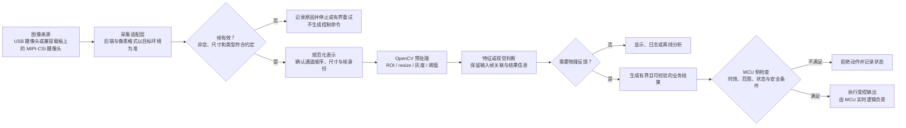

# 第1章 OpenCV 开发基础：图像、像素与视觉处理流水线

## 学习目标

读完本章后，读者应能够：

1. 把数字图像解释为具有高度、宽度、通道和数据类型的数组，而不是把它看作不可分解的“照片”。
2. 正确区分图像的行列索引、像素坐标、BGR 通道顺序和灰度图表示。
3. 说明裁剪区域（Region of Interest，ROI）、缩放、灰度化和阈值化在基础处理管线中的作用。
4. 将采集、帧校验、预处理、视觉判断与设备反馈拆成可以独立观察的阶段。
5. 使用不依赖摄像头的合成图像示例验证数组和像素概念，并准确标注它不构成 UNO Q 摄像头或硬件验收。

## 背景与边界

视觉程序的输入不是抽象的“现实世界”，而是某个采集链路在一个时刻交付给程序的像素数组。曝光、焦距、光照、相机驱动、色彩格式和分辨率都可能改变这组数组；因此，视觉处理的第一步不是立刻分类，而是确认输入是什么、是否有效、是否符合本次运行的预期。

Arduino UNO Q 将 Linux 侧的应用处理能力与 STM32U585 微控制器侧的实时控制能力结合在同一开发板上。OpenCV 图像处理通常属于 Linux 侧应用工作；具有严格时序要求的引脚控制和保护逻辑则应放在经过验证的 MCU 侧路径中。两侧如何传递结构化结果，可衔接[第四篇第1章：Python Bridge 消息模型与调用边界](../第4篇_PythonBridge/第1章_Python_Bridge开发基础_消息模型与调用边界.md)以及[第二篇第7章：实时任务与调度](../第2篇_STM32/第7章_实时任务与调度_从周期循环到可验证响应.md)。

Arduino 官方产品资料列出了 UNO Q 在 SBC 模式下通过 USB 摄像头输入，以及通过底部高速连接器和载板连接 MIPI-CSI 摄像头的路线。摄像头、载板、系统镜像、驱动和采集后端必须作为一个兼容组合核实；例如官方 [UNO Media Carrier](https://docs.arduino.cc/hardware/uno-media-carrier) 页面描述了该载板的 MIPI-CSI 接口及其兼容相机范围，不能据此推断任意 CSI 相机都可直接使用。产品连接选项见[Arduino UNO Q 官方产品页](https://docs.arduino.cc/hardware/uno-q)。

**本章范围：**解释图像数组、像素坐标、常见基础处理和管线边界；通过人工构造的小图像做离线演示。

**本章不覆盖：**安装摄像头驱动、枚举真实摄像头、配置采集后端、训练或部署模型，以及向物理输出发送控制命令。真实摄像头能否打开、帧率和像素格式为何、OpenCV 是否已安装，均需在目标 UNO Q 镜像和具体硬件组合上单独验证。合成帧实验不会访问摄像头、网络、GPIO 或 MCU。

## 图像是有结构的数组

一幅数字图像可以表示成二维或三维数组：

- 灰度图通常是二维数组，概念形状为 `(height, width)`。
- 三通道彩色图通常是三维数组，形状为 `(height, width, channels)`。
- 常见的 8 位无符号整数像素用 `uint8` 表示，单个通道的整数范围为 0～255。

例如，数组形状 `(480, 640, 3)` 表示 480 行、640 列、每个像素 3 个通道。图像宽度是 640，高度是 480。不要把数组的第 0 维误称为宽度。

OpenCV 的 `imread` 常规彩色读取结果按 BGR（蓝、绿、红）顺序排列，而不是许多绘图 API 使用的 RGB（红、绿、蓝）。所以纯红像素在 BGR 数组中的通道值是 `(0, 0, 255)`。这一约定不能无条件套用到所有摄像头后端：采集适配层可能交付其他格式或经过转换的帧，程序要确认实际接口契约，再决定是否转换通道。

灰度化会把每个彩色像素映射到一个亮度值，输出不再有颜色通道。它减少了后续处理的数据维度，但会丢失颜色信息；若任务依赖颜色区分，灰度图就不是合适的唯一输入。阈值化则将灰度值按规则映射为前景和背景，例如把高于阈值的像素设为 255、其余设为 0。阈值对光照和曝光敏感，不应被误解为具有场景理解能力。

### 坐标与区域

NumPy / OpenCV 图像数组按 `image[y, x]` 访问：先行（垂直方向），后列（水平方向）。在常用图形坐标描述中，一个点常写成 `(x, y)`；两种记法只是顺序约定不同。处理边界框、ROI 或鼠标坐标时，要在接口之间明确转换。

数组切片的结束下标不包含在区域内。`image[y1:y2, x1:x2]` 表示行 `y1` 到 `y2 - 1`、列 `x1` 到 `x2 - 1`。在 NumPy 中，这种切片通常是原数组的视图；如果要独立修改 ROI 而不影响原图，应显式复制，例如 `roi = image[y1:y2, x1:x2].copy()`。

对每帧都处理整幅高分辨率图像可能增加计算量。只处理任务相关 ROI 或先缩小图像有助于降低负载，但也会丢失空间细节。分辨率、ROI 和速度之间需要用目标画面与目标设备测量来权衡，不能仅凭桌面电脑上的体验推断 UNO Q 的实时能力。

## 从输入帧到可交付结果

一个可维护的视觉管线应当为每一阶段明确输入、输出和失败处置：

1. **采集：**从明确配置的 USB 或兼容 MIPI-CSI 路径取帧。本章离线实验以程序生成的数组替代此阶段。
2. **帧校验：**检查是否取到帧、尺寸和数据类型是否符合约定，并确认颜色通道顺序。无效帧不得进入视觉判断。
3. **预处理：**按任务选择 ROI、缩放、颜色空间转换、去噪或阈值化，并保留足以定位问题的原始输入或摘要。
4. **特征或判断：**从当前帧产生候选结果。后续章节再展开检测器、分类器及模型推理；本章不把像素阈值说成 AI。
5. **记录或反馈：**可将结果用于显示、日志或上层应用；若结果要影响实体设备，先形成边界清晰、可校验的业务消息，再交给 MCU 侧的安全条件和实时控制逻辑判断。

摄像头采集与视觉计算不是同一件事：采集会受设备节点、权限、驱动和后端影响；处理代码可能在一张合成图上工作正常，但真实流仍可能无帧、延迟或格式不符。调试时保留阶段边界，才能区分“没有拿到图像”和“图像算法判错”。

> 图示占位：图号=Fig-35；位置=本段之后；内容=从图像来源、帧校验、OpenCV预处理到结果记录或受控反馈的阶段，以及无效帧和 MCU 安全门；来源=本书原创，依据本章登记的 Arduino 与 OpenCV 官方资料。

<a id="fig-35-uno-q-opencv-image-pipeline"></a>

### Fig-35：视觉处理管线与控制边界



图中 OpenCV 是 Linux 侧视觉阶段的示意，不代表 Arduino UNO Q 已自动配置摄像头采集、Python 包或 MCU 通信。MCU 安全检查不是可省略的“最后一步”：识别结果可能过期、丢失或超出控制范围。硬件协同的完整实验应沿用[第二篇第9章：传感、控制与 MCU/Linux 协同闭环](../第2篇_STM32/第9章_综合实验_传感控制与MCU_Linux协同闭环.md)的验证与停止边界。

## 实验：检查一幅合成图像

下面的实验不读取图片文件，也不需要摄像头。程序在内存中创建一幅 4×6 的 BGR 图像，在指定 ROI 填入红色像素，再转换为灰度图并执行二值阈值化。这样可以先把数组和通道概念与硬件采集的不确定性隔离。

配套文件位于[第六篇第1章代码目录](../../code/第6篇_OpenCV/第1章_OpenCV开发基础/README.md)。

**代码说明**

- 用途：观察图像形状、数据类型、单个 BGR 像素、灰度值和阈值结果。
- 运行环境：安装了兼容 OpenCV Python bindings（导入名 `cv2`）与 NumPy 的 Python 环境；无需摄像头或 UNO Q。
- 文件位置：[`image_basics.py`](../../code/第6篇_OpenCV/第1章_OpenCV开发基础/image_basics.py)。
- 依赖：OpenCV Python bindings 与 NumPy；具体版本应匹配所用 Python 和目标运行环境，本例不规定 UNO Q 镜像中的包版本。
- 操作步骤：进入代码目录，执行 `python image_basics.py`。程序仅在内存中创建与处理数组，不访问外设、不写文件，也不发送控制命令。
- 预期输出：下列为依据代码与算法推导的示例输出，不是本次实测结果。
- 故障排查：若提示找不到 `cv2` 或 `numpy`，先确认当前解释器和依赖安装位置；若数组形状或 ROI 结果变化，检查切片结束边界是否按“不包含结束下标”处理。不要通过盲目更换摄像头编号来解决离线示例问题。
- 验证方式：输出应显示形状 `(4, 6, 3)`、`uint8`、红色像素 `(0, 0, 255)`、灰度值 `76`，并有 6 个非零阈值像素。这只验证示例逻辑，不代表目标板性能或摄像头链路已通过验收。

```python
import cv2
import numpy as np


def main() -> None:
    image = np.zeros((4, 6, 3), dtype=np.uint8)
    image[:] = (16, 16, 16)
    image[1:3, 2:5] = (0, 0, 255)

    gray = cv2.cvtColor(image, cv2.COLOR_BGR2GRAY)
    _, mask = cv2.threshold(gray, 100, 255, cv2.THRESH_BINARY)

    pixel_bgr = tuple(int(channel) for channel in image[1, 2])
    print("shape={} dtype={}".format(image.shape, image.dtype))
    print("pixel_bgr[1, 2]={}".format(pixel_bgr))
    print(
        "gray[1, 2]={} threshold_nonzero={}".format(
            int(gray[1, 2]), int(cv2.countNonZero(mask))
        )
    )


if __name__ == "__main__":
    main()
```

**示例输出（未运行）**

```text
shape=(4, 6, 3) dtype=uint8
pixel_bgr[1, 2]=(0, 0, 255)
gray[1, 2]=76 threshold_nonzero=6
```

其中 `image[1:3, 2:5]` 覆盖两行、三列，共 6 个像素；红色 BGR 值转换后的灰度值约为 76，因此大于 100 的阈值条件只保留这 6 个 ROI 像素。程序不打开摄像头、不创建窗口，也不改变开发板状态。

## 验证结果与范围

本章新增的是确定性、离线的图像数组示例和原创管线图。示例程序本次未执行，因此代码框中的输出属于按算法推导的预期值，不是实测记录。当前没有摄像头、UNO Q、载板或目标系统运行证据；本章也没有验证 `cv2.VideoCapture`、驱动安装、帧率、温度、内存占用或图像算法准确率。

把本章概念迁移到真实设备前，应记录至少以下环境信息：UNO Q 系统镜像与软件版本、相机型号和连接方式、采集后端、实际帧尺寸和像素格式、帧时间戳或序号，以及无帧时的停止策略。进一步涉及运行记录和 App 组织时，可参考[第五篇第1章：App Lab 开发基础](../第5篇_AppLab/第1章_App_Lab开发基础_应用结构与验证边界.md)。

## 常见问题

### 为什么纯红色不是 `(255, 0, 0)`？

本示例按 OpenCV 常见 BGR 表示排列通道，红色落在第三个通道，所以是 `(0, 0, 255)`。如果数据来自 RGB 接口、绘图库或摄像头后端，应先确认其通道契约；错误的通道假设会让颜色判断和显示结果不一致。

### 为什么访问像素时写 `image[y, x]`？

数组的前两个维度依次是行、高度方向和列、宽度方向，故数组索引先写行 `y` 再写列 `x`。与之相对，几何点通常写作 `(x, y)`。传递坐标时显式命名字段或进行顺序转换，避免把宽高颠倒。

### 为什么本章不用真实摄像头？

先用确定输入验证数组、通道和 ROI，可以把算法概念与相机驱动、设备权限和目标系统依赖分开诊断。真实采集是后续工作，应在确认具体相机、载板、后端和镜像支持后单独进行。

### 离线示例通过了，能说明 UNO Q 实时处理可用吗？

不能。它只说明示例逻辑有明确的输入和预期结果。实时能力还取决于采集链路、分辨率、帧率、处理负载、内存和热状态，需要在目标配置上测量并记录。

## 延伸阅读

- [OpenCV 官方教程：Basic Operations on Images](https://docs.opencv.org/4.12.0/d3/df2/tutorial_py_basic_ops.html)：图像数组、ROI、像素访问和 NumPy 操作。
- [Arduino UNO Q 官方产品页](https://docs.arduino.cc/hardware/uno-q)：核对当前产品资料中的处理器、SBC 模式和相机连接选项。
- [Arduino UNO Media Carrier](https://docs.arduino.cc/hardware/uno-media-carrier)：核对特定载板的相机连接和兼容性说明。
- [第四篇第1章：Python Bridge 消息模型与调用边界](../第4篇_PythonBridge/第1章_Python_Bridge开发基础_消息模型与调用边界.md)：了解 Linux 应用与 MCU 之间的消息边界。
- [参考资料索引](../../resources/references.md)：查看本章来源用途和核验边界。
