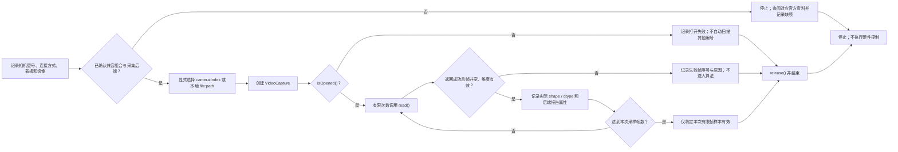

# 第2章 摄像头接入与视频帧采集：从设备确认到帧校验

## 学习目标

读完本章后，读者应能够：

1. 在运行代码前确认相机、载板、系统镜像、驱动与采集后端的兼容关系，不把某个摄像头编号当作通用答案。
2. 使用 OpenCV 的采集对象完成打开、读取、校验和释放的最小生命周期。
3. 区分采集后端报告的属性值与实际帧数组的尺寸、维度和数据类型。
4. 用有限帧数、显式来源的诊断脚本判断采集链路是否交付了有效帧，并按证据定位失败阶段。
5. 明确桌面视频文件或单次取帧成功不代表 UNO Q 摄像头、实时性能或视觉算法已通过验收。

## 背景与边界

Arduino UNO Q 提供不止一条摄像头接入路线。官方产品资料说明，在 SBC（Single-Board Computer，单板计算机）模式下，使用 USB-C 转接设备和外部供电时可连接 USB 摄像头；底部高速连接器也可通过兼容载板连接 MIPI-CSI（Mobile Industry Processor Interface Camera Serial Interface）摄像头。Arduino UNO Media Carrier 则明确列出双路 MIPI-CSI 接口及其当前兼容范围，包括基于 IMX219 的相机。接口形状相似并不能证明传感器、排线、电压、驱动和系统镜像彼此兼容。

因此，真实设备支持应按一个组合来确认：

| 核对项 | 需要记录的事实 | 不能据此推断的结论 |
| --- | --- | --- |
| 相机与连接 | USB 型号，或 CSI 传感器、排线和接口 | “插得上”就一定可用 |
| 载板与主板 | 精确载板型号、连接方式和供电条件 | 其他载板的经验可直接套用 |
| 软件镜像 | UNO Q 镜像、内核及相关软件版本 | 某个 Linux 发行版有驱动就代表目标镜像也有 |
| 采集后端 | OpenCV 构建包含的后端、设备权限和配置 | OpenCV 已安装就必然能打开相机 |
| 实际帧 | 成功读取后的 `shape`、`dtype` 和连续读取表现 | 属性查询值就是实际图像，也不能由一帧证明实时性能 |

本章的通用脚本只接受显式的摄像头索引或本地视频文件，不扫描设备、不接受网络流或任意采集管线，也不配置 MIPI-CSI 驱动。不同载板、镜像或采集栈可能需要设备专用的管线；必须先按该组合的官方资料核对，再选择适配器，不能将不适配的通用脚本当作故障证明。

本章不访问 GPIO、微控制器或网络，不写入视频、图片或配置文件。`read()` 和设备初始化是否会等待、能等待多久，取决于驱动与后端；示例没有跨后端的硬超时保证。OpenCV 文档中的打开/读取超时属性仅适用于特定后端，不能假设任意相机都支持。

## 图：从设备确认到有效帧

下图把“硬件链路确认”和“OpenCV 帧校验”分开：打不开时先停止并记录组合信息，不靠遍历编号碰运气；打开但帧无效时，也不把它交给后续算法。

> 图示占位：图号=Fig-36；位置=本段之后；内容=相机与载板/镜像/后端确认、显式选择输入、VideoCapture 打开与逐帧校验，以及所有失败路径最终释放资源；来源=本书原创，依据本章登记的 Arduino 与 OpenCV 官方资料。

<a id="fig-36-uno-q-opencv-capture-validation"></a>

### Fig-36：摄像头采集与帧校验生命周期



图中的“样本有效”只表示选定来源在有限读取期间交付了符合基本结构的数组，不等同于长期稳定、实时性能达标或视觉任务正确。图源：[Fig-36 Mermaid](../../diagrams/uno-q-opencv-capture-validation.mmd)。

## 操作与实验：显式读取有限数量的帧

OpenCV 使用 `VideoCapture` 把摄像头或视频文件抽象为连续图像来源。程序应显式指定来源，调用 `isOpened()` 检查初始化结果，再用 `read()` 获取帧。每次读取都要同时检查返回标志和帧内容：文件到达末尾、相机断开或后端失败时，可能没有可用图像。结束时调用 `release()` 释放占用的采集资源。

配套代码位于[第六篇第2章代码目录](../../code/第6篇_OpenCV/第2章_摄像头接入与视频帧采集/README.md)，入口脚本为 [`inspect_capture.py`](../../code/第6篇_OpenCV/第2章_摄像头接入与视频帧采集/inspect_capture.py)。

**代码说明**

- 用途：对一个明确选择的视频来源读取有限帧数，报告后端属性和每帧结构；不显示或保存图像。
- 运行环境：安装了兼容 OpenCV Python bindings（导入名 `cv2`）的 Python 环境；使用摄像头时还需目标系统具备该相机对应的驱动、权限和采集后端。
- 文件位置：[`inspect_capture.py`](../../code/第6篇_OpenCV/第2章_摄像头接入与视频帧采集/inspect_capture.py)。
- 依赖：OpenCV Python bindings；脚本仅使用 Python 标准库和 `cv2`，不规定 UNO Q 镜像中的包版本。
- 操作步骤：进入代码目录，按实际环境选择一个来源并运行下列命令。摄像头索引由目标操作系统和后端决定；`camera:0` 只是用户明确指定的示例，不保证适用于任何设备。视频文件必须是本机可读取的路径。
- 预期输出：脚本报告是否打开、后端查询到的宽高/FPS、每帧 `shape` 与 `dtype`，并以有限样本结果结束。下方数值仅为结构示例，不是设备实测值。
- 故障排查：若打不开，先独立确认相机在目标系统可用、权限正确且 OpenCV 包含所需后端，再核对索引或文件路径；若读取失败，记录失败帧序号并停止，不把空帧交给算法。不要自动尝试其他相机编号。若采集调用长时间不返回，应按所用后端和驱动调查；本脚本不提供可移植的硬超时。
- 验证方式：本地视频文件可用于核对文件解码路径；真实摄像头需在目标硬件组合上人工运行并留存系统、相机、载板、后端和帧结构记录。有限帧成功不证明连续运行或实时性能。

摄像头示例：

```text
python inspect_capture.py --source camera:0 --frames 5
```

本地视频文件示例：

```text
python inspect_capture.py --source file:/path/to/sample.mp4 --frames 5
```

Windows PowerShell 下，应给带空格或盘符的视频路径加引号，例如 `--source "file:C:\Videos\sample clip.mp4"`。不要把 URL、RTSP 地址或 GStreamer 管线传给脚本；它们不属于此例的输入范围。

**示例输出（结构示意，未在本次运行）**

```text
opened=true source=camera:0
backend_reported_width=640.000
backend_reported_height=480.000
backend_reported_fps=30.000
frame=1 shape=(480, 640, 3) dtype=uint8
frame=2 shape=(480, 640, 3) dtype=uint8
result=FRAME_SAMPLE_PASS
capture_released=true
```

帧数与输出仅展示字段和顺序；不同来源的帧尺寸、通道数、数据类型以及后端属性都可能不同。脚本不强行设置分辨率，也不假定 `get()` 返回值可用或与实际帧一致。应将帧数组的 `shape` 与 `dtype` 作为本次收到的数据证据；若任务要求特定尺寸或通道格式，应在应用层按明确契约判定，而不是把后端报告值当作帧校验。

### 诊断结果如何解释

- **无法打开**：`VideoCapture` 初始化失败。检查所选来源、设备权限、驱动与后端；对于 UNO Q，重新核对相机、载板和镜像是否属于受支持组合。不要将索引加一后盲试。
- **打开但读取失败**：相机可能断开、文件已到末尾，或后端未能解码/交付帧。失败帧不进入算法；记录来源和帧序号后停止此次诊断。
- **帧非空但结构异常**：收到的数组不满足最基本的维度或数据类型条件。先确认后端输出格式与应用预期，不要擅自将异常数据标记为 BGR。
- **帧结构有效但画面不符**：这是更上层的问题，可能涉及曝光、焦距、光照、方向或颜色格式。本章不判断画面语义；可衔接[第六篇第1章：图像、像素与视觉处理流水线](./第1章_OpenCV开发基础_图像像素与视觉处理流水线.md)继续检查数组含义。
- **后端属性与帧形状不一致**：保留两类观察值，不将其强行等同。以帧数组和应用契约为准，再调查驱动或后端的属性实现。

## 验证结果与范围

本章代码和图示目前作为 `draft` 资料提交。脚本本次未连接 USB 摄像头、MIPI-CSI 相机、UNO Q 或载板，也未运行摄像头或视频文件采集；代码中的示例输出是字段格式示意，不是实测记录。Mermaid 源文件已与正文对应，但本次未渲染 SVG 或进行视觉审阅。

本章定义的最低采集证据包括：运行日期、UNO Q 与系统镜像版本、相机型号和接口、载板（若使用）、OpenCV 版本与实际后端、来源标识、读取帧数、帧尺寸/类型，以及失败帧和停止原因。缺少其中与本次配置相关的字段时，应将结果标为“尚未验证”或“部分验证”，而不是“摄像头已支持”。

## 常见问题

### 为什么不能默认使用摄像头编号 0？

编号由操作系统和采集后端分配，可能随设备、连接顺序和平台而变化。0 是教程中常见的示例值，不是 UNO Q 的固定相机 ID。应从目标系统的受支持设备信息中确认来源，再由操作者显式传入。

### `isOpened()` 返回真，是否代表摄像头可用？

它只表示采集对象完成了初始化，不保证后续每次读取都成功，也不证明图像内容正确、帧率稳定或应用可以实时运行。仍需检查 `read()` 返回值、帧数组和连续采样表现。

### 把宽高属性设为目标值，是否就能得到该分辨率？

不能。后端可能拒绝或忽略属性设置，也可能报告值与交付帧不同。即使设置调用返回成功，也应检查每帧的实际数组形状；若应用有硬性分辨率要求，应明确校验并在不匹配时停止或降级。

### 通用脚本为什么不直接覆盖 MIPI-CSI？

CSI 摄像头通常依赖传感器驱动、设备树、载板走线和平台采集栈。OpenCV 的通用设备索引接口不能替代这些平台配置。确认具体组合及其后端后，再为该系统建立并单独验证专用适配层。

### 有五帧样本就能说明达到实时要求吗？

不能。有限样本只验证该次运行读到了若干结构有效的帧，不测量长期丢帧、端到端延迟、负载、内存和热状态，也不验证视觉算法准确率。实时目标应另设测量方法、时长、环境和通过阈值。

## 延伸阅读

- [Arduino UNO Q 官方产品页](https://docs.arduino.cc/hardware/uno-q)：核对 SBC 模式的 USB 外设与高速连接器相机路线。
- [Arduino UNO Media Carrier](https://docs.arduino.cc/hardware/uno-media-carrier)：核对特定载板的接口和相机兼容说明。
- [OpenCV 官方教程：Video Input with OpenCV](https://docs.opencv.org/4.12.0/d5/dc4/tutorial_video_input_psnr_ssim.html)：了解视频文件/设备输入、打开、读取和释放的生命周期。
- [OpenCV 官方视频 I/O 属性文档](https://docs.opencv.org/4.12.0/d4/d15/group__videoio__flags__base.html)：核对属性与后端适用范围，包括打开/读取超时的限制。
- [第六篇第1章：图像、像素与视觉处理流水线](./第1章_OpenCV开发基础_图像像素与视觉处理流水线.md)：了解帧数组进入视觉处理阶段后的表示与校验。
- [参考资料索引](../../resources/references.md)：查看本章来源用途、许可边界和核验日期。
