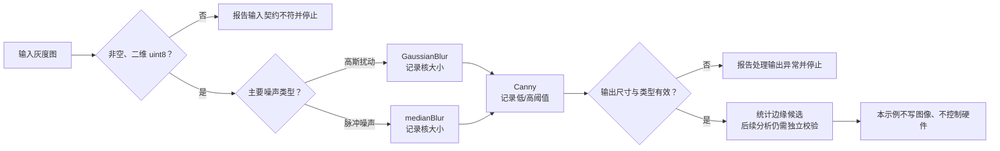

# 第3章 图像预处理与边缘提取：从去噪到结构特征

## 学习目标

读完本章后，读者应能够：

1. 在滤波前检查灰度图是否非空、二维且为 `uint8`。
2. 根据噪声特点选择高斯滤波或中值滤波，并说明平滑可能损失细节。
3. 解释 Canny 的梯度、非极大值抑制与双阈值连接过程。
4. 调整 Canny 阈值时观察边缘连续性、噪声响应和误检，而不是照抄固定数值。
5. 将边缘图作为后续几何分析的中间结果，而不误称为物体识别；理解本章离线实验不构成真实 Arduino UNO Q 摄像头或实机验收。

## 背景与边界

[第六篇第1章：图像、像素与视觉处理流水线](./第1章_OpenCV开发基础_图像像素与视觉处理流水线.md)介绍了图像数组、灰度和基础阈值；[第六篇第2章：摄像头接入与视频帧采集](./第2章_摄像头接入与视频帧采集_从设备确认到帧校验.md)说明了如何取得并检查帧。本章从一张已经验证为二维 `uint8` 灰度图的输入继续，讨论降噪和边缘候选提取，不重复相机接入，也不训练或部署模型。

图像预处理不是“越模糊越好”。滤波能压低某些噪声，但也会改变边界、纹理和细小结构。选择滤波器前，先识别主要噪声模式，再用相同输入比较处理前后的结果。

- **高斯滤波**：以邻域内的高斯权重计算局部平滑值，适合缓和近似高斯分布的随机扰动；强度过大时会把边缘一并变软。
- **中值滤波**：用邻域像素的中位数替换中心值，对孤立的极亮/极暗脉冲点（椒盐噪声）通常更合适；过大的核会抹掉小目标和细线。
- **双边滤波**：同时考虑空间距离和像素差异，可在一定程度上保留边缘，但计算较重。本章不把它加入基准示例，避免在没有性能测量时暗示它适用于实时相机管线。

滤波核大小是奇数且大于零的空间尺度参数，不是“算法质量”开关。核越大，邻域影响通常越广；边缘保留、噪声压制和执行时间要结合目标图像测量。OpenCV 官方平滑教程也指出，平滑会移除噪声和边缘等高频内容，因此滤波前后应保留可对照的输入。

## Canny：从强度变化到细边缘

边缘是图像强度发生显著变化的位置，不是物体类别或完整轮廓的保证。Canny 通常先抑制噪声、计算局部梯度，再通过非极大值抑制压细候选响应，最后用低/高双阈值和滞后连接保留与强边缘相连的弱边缘。OpenCV 的 `Canny` 输入应符合其图像类型要求；本章统一使用已经校验的单通道 `uint8` 灰度图。

参数 `threshold1` 和 `threshold2` 控制弱、强梯度候选的判定。较低阈值可能保留更多细节，也更容易引入噪声边；较高阈值可抑制弱响应，却可能让轮廓断裂。OpenCV 教程给出的高低阈值比例可作为试验起点，不是对所有场景的通过标准。曝光、对比度、纹理、滤波强度和相机输出都会改变合适范围。实验应一次只调整一类参数，并记录输入、滤波器/核大小、阈值和观察结果。

Canny 输出通常是与输入宽高相同的单通道 8 位边缘图；像素值表示候选边缘与非边缘。把边缘图交给后续轮廓、直线或形状分析之前，仍要设计连通性、噪声和误检校验；它本身不说明“画面中是什么”。

## 图：噪声、滤波与边缘候选

Fig-37 展示两个噪声分支共享同一输出契约：输入先通过类型和尺寸校验；选择相应的平滑方式后，再执行 Canny；输出保持尺寸并接受二值/类型检查。任何阶段失败都停止本次离线处理，不生成硬件动作。

> 图示占位：图号=Fig-37；位置=本段之后；内容=灰度图校验、按噪声模式选择高斯或中值滤波、Canny 双阈值提取及输出结构校验和失败停止路径；来源=本书原创，依据本章登记的 OpenCV 官方资料。

<a id="fig-37-uno-q-opencv-denoise-canny"></a>

### Fig-37：去噪到边缘候选的处理流程



此图表达的是可检查的处理顺序，不代表 UNO Q 已部署图像算法或传感器驱动。源文件：[Fig-37 Mermaid](../../diagrams/uno-q-opencv-denoise-canny.mmd)。

## 操作与实验：比较两类去噪结果

配套程序在内存中构造一幅小型灰度几何图，分别加入固定种子的高斯扰动与椒盐脉冲，再用高斯滤波和中值滤波处理，最后对两路结果执行 Canny。实验用均方根误差（Root Mean Square Error，RMSE）比较合成噪声图和已知干净底图的像素差异，并统计边缘图的非零像素数。真实摄像头没有干净参考图时，不能直接把这个 RMSE 当成画质评分。

代码位于[第六篇第3章代码目录](../../code/第6篇_OpenCV/第3章_图像预处理与边缘提取/README.md)，入口为 [`preprocess_edges.py`](../../code/第6篇_OpenCV/第3章_图像预处理与边缘提取/preprocess_edges.py)。

**代码说明**

- 用途：离线比较高斯噪声与椒盐噪声的两种滤波结果，并验证 Canny 边缘图的形状和数据类型。
- 运行环境：Python 3 环境；本次验证环境为 Python 3.14.6、OpenCV 5.0.0 与 NumPy 2.4.6。目标 UNO Q 镜像的依赖可用性未据此推断。
- 文件位置：[`preprocess_edges.py`](../../code/第6篇_OpenCV/第3章_图像预处理与边缘提取/preprocess_edges.py)。
- 依赖：OpenCV Python bindings（导入名 `cv2`）和 NumPy；版本应按目标环境核实。
- 操作步骤：进入代码目录运行 `python preprocess_edges.py`。程序只在内存中造图和处理，不读写图像文件、不访问摄像头/网络/GPIO/MCU。可用 `--low-threshold` 与 `--high-threshold` 改变 Canny 阈值；高阈值必须大于低阈值。
- 预期输出：打印输入尺寸、两种噪声处理前后的 RMSE、阈值、边缘像素数和边缘图值域。结果会受库版本及实现细节影响；下列为本次本机运行输出，不是 UNO Q 实测。
- 故障排查：若找不到 `cv2` 或 `numpy`，确认正在使用的解释器与包环境；若阈值参数不合法，按错误提示调整；若边缘图全黑或过密，检查输入对比度并一次只调整阈值或滤波核。不要为解决离线示例问题而连接或改写硬件。
- 验证方式：运行脚本并执行同目录的 `python -m unittest -v test_preprocess_edges.py`；测试检查两类合成噪声的误差下降、边缘图结构、固定种子可重复性和非法阈值拒绝。这些只验证离线算法示例，不构成目标板性能或相机链路验收。

```text
python preprocess_edges.py
python -m unittest -v test_preprocess_edges.py
```

**本次本机实测输出（Python 3.14.6 / OpenCV 5.0.0 / NumPy 2.4.6）**

```text
input_shape=(128, 160) dtype=uint8
gaussian_rmse_before=18.742 gaussian_rmse_after=14.580
salt_pepper_rmse_before=35.136 salt_pepper_rmse_after=4.000
canny_low=50.0 canny_high=150.0
gaussian_edge_pixels=623
median_edge_pixels=598
edge_map_shape=(128, 160) dtype=uint8 values=[0, 255]
```

这些数值说明固定合成输入上的实现能稳定产生可比较结果，不表示 623 或 598 是正确边缘数量，也不代表某个真实摄像头应得到这些指标。改变噪声种子、OpenCV/NumPy 版本或阈值，数字可能变化；应关注结构约束、对照关系和实验记录，而非背诵输出。

### 调参时按顺序排查

1. **先验证输入契约。**灰度图应非空、二维且为 `uint8`；如果输入来自相机，先按[第六篇第2章](./第2章_摄像头接入与视频帧采集_从设备确认到帧校验.md)记录实际帧格式。
2. **辨认噪声形态。**散布的亮/暗孤立像素与细密随机起伏可能需要不同滤波；不要看到“画面有噪点”就固定使用某一个滤波器。
3. **先定滤波器，再定 Canny 阈值。**保持输入和其他参数不变，对比滤波前后细节损失、噪声响应和真实边界连续性。
4. **记录双阈值。**高阈值升高通常会减少弱响应，低阈值则影响弱边缘是否能通过连接保留；变化方向应通过当前图像观察确认，不能只看边缘像素总数。
5. **设定应用级验收规则。**若边缘要进入后续轮廓或检测流程，需增加几何约束、时效性和失败时的拒绝策略。若结果最终影响执行器，仍需经过独立的消息校验与 MCU 安全逻辑，不得从边缘图直接驱动物理输出。

## 验证结果与范围

本章示例及其 3 项命令行测试已在上述本机软件环境执行并通过；测试覆盖合成噪声误差是否下降、输出边缘图的基本结构、固定随机种子的可重复性和错误阈值拒绝。测试不访问相机、网络、GPIO、MCU 或 UNO Q。

尚未验证目标 UNO Q 上的 Python/OpenCV/NumPy 版本、实时采集或处理性能、真实相机噪声分布、热状态、内存占用以及阈值对实际任务的准确性。投入目标设备前，应在受控场景收集真实帧，保留原始样本和处理参数，再定义延迟、误检、漏检与停止条件。Fig-37 Mermaid 正文与独立源文件保持一致；本次未生成或审阅 SVG。

## 常见问题

### 为什么为两种噪声选择不同滤波器？

高斯滤波是加权邻域平滑，适合作为近似随机微扰的入门示例；中值滤波以邻域中位数代替中心值，对孤立脉冲点更稳健。它们不是严格按噪声标签自动分类的规则，实际相机图像可能同时包含多种噪声与纹理，应以代表性样本比较。

### 为什么先滤波再执行 Canny？

局部噪声会产生强度变化，可能形成大量伪边缘。平滑通常能降低其中一部分响应；但滤波太强也会抹平真实的小边界。因此先确定可接受的细节损失，再调整 Canny 参数，而不是把阈值当成降噪器。

### Canny 的低、高阈值应该取多少？

不存在跨图像通用的固定答案。本章 `50/150` 只用于可重复演示；换成不同曝光、分辨率、对比度或滤波核就可能不合适。用实际样本对比边缘连续性、噪声误检和目标边界遗漏，并记录参数。

### 边缘像素越多，检测效果越好吗？

不是。数量增加可能来自保留了细节，也可能是噪声变多、阈值过低或纹理被误判。像素数是方便复现的观察指标，不是准确率、精确率或召回率。没有标注真值时，不应声称模型或检测器“准确率提高”。

### 本章输出能直接用来控制电机或继电器吗？

不能。边缘图是像素级中间表示，不包含经过校验的对象身份、坐标映射、时效性或动作授权。任何物理控制都应经过具备范围、状态和失效安全检查的独立链路。

## 延伸阅读

- [OpenCV 官方教程：Smoothing Images](https://docs.opencv.org/4.12.0/d4/d13/tutorial_py_filtering.html)：核对高斯、中值和双边平滑的作用及参数约束。
- [OpenCV 官方教程：Canny Edge Detector](https://docs.opencv.org/4.12.0/da/d5c/tutorial_canny_detector.html)：核对 Canny 阶段、双阈值和 OpenCV 接口边界。
- [第六篇第1章：图像、像素与视觉处理流水线](./第1章_OpenCV开发基础_图像像素与视觉处理流水线.md)：回顾数组、灰度和像素结构。
- [第六篇第2章：摄像头接入与视频帧采集](./第2章_摄像头接入与视频帧采集_从设备确认到帧校验.md)：回顾真实来源选择、帧校验和采集证据。
- [参考资料索引](../../resources/references.md)：查看本章资料来源、用途和核验日期。
