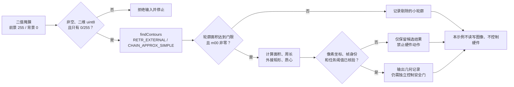

# 第4章 轮廓提取与几何测量：从二值区域到可核验的形状结果

## 学习目标

读完本章并完成实验后，读者应能够：

1. 区分灰度图、Canny 边缘图和前景为白色的二值区域掩膜，说明何时不能直接计算目标面积。
2. 使用 `findContours` 提取外轮廓，理解 `RETR_EXTERNAL` 与 `CHAIN_APPROX_SIMPLE` 的取舍。
3. 计算轮廓面积、闭合周长、轴对齐外接矩形及质心，并正确标注它们的像素坐标单位。
4. 为输入类型、面积门限、零面积轮廓和空结果设置可观察的停止或剔除路径。
5. 将离线几何候选与真实 Arduino UNO Q 摄像头、物理尺寸和硬件动作的验证边界分开。

## 背景与边界

[第六篇第1章](./第1章_OpenCV开发基础_图像像素与视觉处理流水线.md)建立了像素、坐标和二值化的基础；[第六篇第2章](./第2章_摄像头接入与视频帧采集_从设备确认到帧校验.md)处理来源与帧校验；[第六篇第3章](./第3章_图像预处理与边缘提取_从去噪到结构特征.md)得到经过滤波的边缘候选。本章换用**已形成区域的二值掩膜**作为输入：白色（255）是待分析前景，黑色（0）是背景。它是为讲清几何意义而构造的离线数据，不是把上章的 Canny 边缘图无条件改名为“目标掩膜”。

为什么要区分？Canny 输出标出强度变化所在的细线，可能断裂、出现双边或夹杂纹理；区域掩膜则要回答哪些像素属于目标。OpenCV 官方入门教程允许从阈值图或边缘图寻找轮廓，但**找到轮廓**与**拥有可信的目标区域**不是同一件事。若目标面积、占比或填充程度将用于决策，必须先建立针对当前场景的分割规则、连通性和误检检验；否则只能称为边界候选。[OpenCV 官方：Contours—Getting Started](https://docs.opencv.org/4.12.0/d4/d73/tutorial_py_contours_begin.html)

本章只分析内存中的单通道、二维、`uint8`、取值恰为 0/255 的掩膜。不开摄像头，不读取或写入图像文件，不访问网络、GPIO、微控制器（MCU）或执行器；目标板环境、照明变化和实时性能均不在本次验证范围内。

### 轮廓、面积与像素数不是一个量

`findContours` 返回边界点集合。对于本章的实心矩形，`contourArea` 是由边界坐标计算的几何面积，`arcLength(contour, True)` 是闭合轮廓的长度，`boundingRect` 给出轴对齐的 `(x, y, w, h)`，`moments` 可用 `m10/m00` 和 `m01/m00` 计算质心。`m00=0` 时不能除法，必须先剔除。以上接口和定义以 [OpenCV 官方：Contour Features](https://docs.opencv.org/4.12.0/dd/d49/tutorial_py_contour_features.html) 为准。

尤其不要把 `contourArea` 写成“前景像素数”。本章的一个掩膜切片宽 30、高 20，共有 600 个白色像素；由于边界点坐标分别跨越 29 和 19 个间隔，矩形轮廓面积为 551 个**像素坐标平方单位**，周长为 96 个**像素坐标单位**。这不是 OpenCV 丢失了 49 个像素，而是两种定义不同。若任务关心覆盖像素数，另行统计掩膜非零像素；若关心几何轮廓，记录轮廓面积与周长，并始终写明采用哪一种口径。

图像坐标中的 `x` 向右、`y` 向下。`boundingRect` 的 `w/h` 是包含最外侧像素坐标的外接框宽高，不代表物理宽高。若在感兴趣区域（Region of Interest，ROI）上处理，局部结果映射到整帧时需加上 ROI 左上角偏移：`x_全局 = x_ROI + x0`，`y_全局 = y_ROI + y0`。保存结果时还应保留帧标识、采集时间、ROI 偏移和算法参数；本章合成图没有真实帧标识，不能宣称具备跨帧追踪能力。

### 为什么只取外轮廓

`RETR_EXTERNAL` 只返回最外层轮廓，适合本章互不接触的实心目标；内部孔洞不会以子轮廓形式交付。`CHAIN_APPROX_SIMPLE` 压缩水平、垂直和对角线连续点，矩形可保留角点而不存储每个边界像素。若应用需要孔洞面积、嵌套对象或父子关系，必须改用保留层级的检索模式并显式处理 `hierarchy`，不能沿用本章的“外轮廓面积＝目标净面积”假设。[OpenCV 官方：Contours Hierarchy](https://docs.opencv.org/4.12.0/d9/d8b/tutorial_py_contours_hierarchy.html)

## 图：从二值区域到几何记录

Fig-38 把输入契约、外轮廓提取、面积过滤、几何测量和下游安全门分开。面积门限是**教学样例参数**，不是所有摄像头画面的通用阈值。图中的“帧身份和任务阈值已核验”属于未来真实管线必须补齐的条件；本章示例只走离线几何输出，不会据此执行硬件动作。

> 图示占位：图号=Fig-38；位置=本段之后；内容=二值掩膜校验、外轮廓提取、面积过滤、几何测量、结果复核与失败停止路径；来源=本书原创，依据本章登记的 OpenCV 官方资料。

<a id="fig-38-uno-q-opencv-contour-geometry"></a>

### Fig-38：二值区域到几何记录的验证流程



图源：[Fig-38 Mermaid](../../diagrams/uno-q-opencv-contour-geometry.mmd)。这是教学流程图，不是 UNO Q 已部署的视觉控制协议。

## 操作与实验：合成掩膜上的两目标测量

本实验用确定性数组绘制两个互不相连的实心矩形和一个小噪点。默认最小轮廓面积设为 100 个像素坐标平方单位，因此小噪点会被剔除。程序先验证掩膜，再对**外轮廓**测量，并按外接框 `x/y` 排序；不依赖 OpenCV 返回轮廓的原始顺序。代码入口见[第六篇第4章代码说明](../../code/第6篇_OpenCV/第4章_轮廓提取与几何测量/README.md)和[脚本源码](../../code/第6篇_OpenCV/第4章_轮廓提取与几何测量/measure_contours.py)。

**代码说明**

- 用途：在合成二值掩膜上验证外轮廓、面积过滤与像素几何量，区分轮廓面积和白色像素计数。
- 运行环境：Python 3；本次本机使用 Python 3.14.6、OpenCV 5.0.0、NumPy 2.4.6。OpenCV 4.12 官方文档用于接口语义参考，不等于目标 UNO Q 软件版本。
- 文件位置：[`measure_contours.py`](../../code/第6篇_OpenCV/第4章_轮廓提取与几何测量/measure_contours.py)；测试为[`test_measure_contours.py`](../../code/第6篇_OpenCV/第4章_轮廓提取与几何测量/test_measure_contours.py)。
- 依赖：OpenCV Python bindings（导入名 `cv2`）与 NumPy；安装方式和版本需按实际目标环境核验。
- 操作步骤：进入代码目录执行下列两条命令。可用 `--min-area` 调整面积门限，但必须为正且有限的数值。程序只在内存中构造掩膜，不读写图片、不开摄像头、不调用网络或硬件。
- 预期输出：默认找到 3 个外轮廓，保留 2 个实心矩形、剔除 1 个小噪点；输出掩膜形状、白色像素数、轮廓面积、周长、外接框和质心。具体数值见本次实测块，不能当作真实画面的目标尺寸。
- 故障排查：`cv2`/`numpy` 导入失败时检查当前解释器环境；门限非法时按提示改成正的有限值；无目标时先检查 0/255 前景极性、二值化和输入尺寸，**不要**通过降低门限来伪造检测。真实输入必须额外核对帧来源和时间，出现异常即停在视觉候选阶段。
- 验证方式：运行 `python -m unittest -v test_measure_contours.py`，检查小噪点过滤、已知矩形面积/周长/框/质心、非法掩膜与门限拒绝、空前景及命令行稳定性。该测试仅覆盖离线数组与本机库组合。

```text
python measure_contours.py
python -m unittest -v test_measure_contours.py
```

**本次本机实测输出（Python 3.14.6 / OpenCV 5.0.0 / NumPy 2.4.6）**

```text
mask_shape=(128, 160) dtype=uint8 foreground_pixels=3459
raw_contours=3 accepted=2 rejected=1
shape_1 area_px2=1131.0 perimeter_px=136.0 bbox=(15, 20, 40, 30) centroid_px=(34.5, 34.5)
shape_2 area_px2=2156.0 perimeter_px=186.0 bbox=(90, 60, 50, 45) centroid_px=(114.5, 82.0)
```

`foreground_pixels=3459` 是三块白色区域的像素总数，包含被过滤的小噪点；两个 `area_px2` 则是保留下来的**各自外轮廓**面积。它们不能直接相加后与前景像素总数作“正确率”比较。CLI 输出中的 `shape_1/shape_2` 是按本示例的 `x/y` 排序后生成的序号，并非跨帧稳定对象 ID。

### 把本例迁移到真实帧前

1. 固定实际来源、分辨率、曝光与采集时间记录；先按[第六篇第2章](./第2章_摄像头接入与视频帧采集_从设备确认到帧校验.md)拒绝空帧、格式异常帧和过期帧。
2. 用代表性样本定义前景分割、必要的形态学处理与目标真值；对反光、阴影、遮挡、接触目标、孔洞和边界触图情况分别记录误检与漏检。
3. 记录所用阈值、ROI 偏移、检索模式、近似模式和面积口径；选择面积门限时根据目标最小尺寸、分辨率和噪点分布验证，不照搬本章的 `100`。
4. 如果需要毫米、角度或三维位置，增加镜头畸变处理、标定板或其他几何校准，以及视角/距离条件；没有标定就只报告像素坐标，不换算物理量。
5. 若候选结果将传给 [第四篇 Python Bridge](../第4篇_PythonBridge/README.md) 或 MCU，仍需独立校验帧身份、新鲜度、置信边界、动作许可和失效安全状态；视觉结果不得直接触发电机或继电器。

## 验证结果与范围

本章脚本在本机输出了上述确定性结果；4 项 `unittest` 测试通过，分别保护几何计算与噪点过滤、非法输入/门限拒绝、空前景返回空结果和 CLI 输出稳定性。输入掩膜在测量后保持不变，程序没有读取或写入图像文件。面积、周长和质心是本机 OpenCV/NumPy 组合在**合成实心矩形**上的实测，不是 UNO Q 摄像头、镜像、驱动或实时处理能力的证据。

尚未完成真实相机帧分割、孔洞/重叠物体分析、目标板依赖安装、耗时与内存测量、物理标定和硬件联动验证。Fig-38 的 Mermaid 正文与独立源文件保持一致；SVG 仍待生成和视觉审阅。本章保持 `draft`，不标记为实机验收。

## 常见问题

### 为什么不能直接把上章的 Canny 图拿来算目标面积？

Canny 图主要标出可能的边缘像素，未必围成闭合且唯一的区域，纹理和阴影也会形成边缘。`findContours` 可以处理二值边缘图，但所得边界不自动等于“物体外缘”；只有结合分割与真值核对，才能谈目标区域面积。

### 为什么 30×20 的白色矩形不是 600 的轮廓面积？

600 是白色像素的个数；`contourArea` 用边界点坐标围出的几何区域计算。最外侧像素坐标的跨度为 29×19，因此得到 551。两者都可能有用，但必须注明定义。

### 为什么过滤阈值不能固定为 100？

阈值作用于当前图像的像素坐标平方单位，换分辨率、缩放比例、ROI 或目标距离后数值会变化。应在代表性样本上看真实目标和噪点的分布，并记录漏检代价。

### 有孔洞的零件能用本章代码测“净面积”吗？

不能直接用。`RETR_EXTERNAL` 不返回内部孔洞轮廓；外轮廓面积不等于扣除孔洞后的前景面积。可按任务改用层级轮廓分析或直接统计掩膜前景像素，并为两种口径分别设计测试。

### 质心能直接变成机械臂或电机目标位置吗？

不能。这里的质心是图像平面像素坐标；还缺真实帧身份、时间、ROI 映射、相机标定、坐标系转换、动作授权与 MCU 侧安全门。任何一步不成立都应停止物理动作。

## 延伸阅读

- [OpenCV 官方教程：Contours—Getting Started](https://docs.opencv.org/4.12.0/d4/d73/tutorial_py_contours_begin.html)：轮廓输入、前景极性与基本调用。
- [OpenCV 官方教程：Contour Features](https://docs.opencv.org/4.12.0/dd/d49/tutorial_py_contour_features.html)：面积、闭合周长、外接框与矩。
- [OpenCV 官方教程：Contours Hierarchy](https://docs.opencv.org/4.12.0/d9/d8b/tutorial_py_contours_hierarchy.html)：外轮廓与孔洞层级的取舍。
- [第六篇第3章：图像预处理与边缘提取](./第3章_图像预处理与边缘提取_从去噪到结构特征.md)：回顾边缘候选及其限制。
- [参考资料索引](../../resources/references.md)：查看本章资料版本、用途和版权边界。
