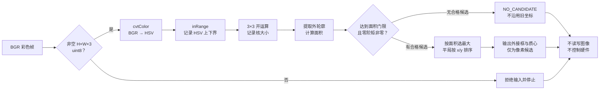

# 第5章 颜色分割与目标定位：从 HSV 掩膜到可核验的像素候选

## 学习目标

读完本章并完成实验后，读者应能够：

1. 说明 OpenCV 常用的 BGR 通道顺序与 8 位 HSV（色调、饱和度、明度）表示的关系，并正确使用 `COLOR_BGR2HSV`。
2. 用 `inRange` 将指定颜色范围转成 0/255 二值掩膜，理解阈值是场景参数而非目标身份。
3. 通过形态学开运算清理孤立小噪点，同时识别它可能删除真实小目标的风险。
4. 在掩膜上提取候选外轮廓、设定面积门限，并以明确规则挑选一个像素位置候选。
5. 面对无候选、颜色相近物体或输入异常时停止使用旧坐标；不把离线结果误认为 Arduino UNO Q 摄像头或硬件控制证据。

## 背景与边界

[第六篇第1章](./第1章_OpenCV开发基础_图像像素与视觉处理流水线.md)定义了图像数组、BGR 和像素坐标；[第六篇第2章](./第2章_摄像头接入与视频帧采集_从设备确认到帧校验.md)讨论真实帧的来源和结构检查；[第六篇第3章](./第3章_图像预处理与边缘提取_从去噪到结构特征.md)处理边缘候选；[第六篇第4章](./第4章_轮廓提取与几何测量_从二值区域到形状结果.md)从**已有二值区域**计算外轮廓几何量。本章补上其中的一条上游路径：从受控场景的彩色图像，用颜色条件构造区域掩膜，再给出一个单帧像素候选。

这不是通用“识别绿色物体”的模型。颜色阈值只回答“哪些像素落入指定色域”；相同颜色的背景、反射、印刷图案或另一件物体都会形成候选。后续的面积、位置和数量规则可以排除一部分干扰，但依然不能证明对象身份。示例使用**内存生成**的 BGR 图，不开摄像头、不读写图像文件、不访问网络或执行器，也不含跨帧跟踪。

### 从 BGR 到 HSV，先弄清数值尺度

OpenCV 的 `cvtColor(frame, COLOR_BGR2HSV)` 把符合约定的 BGR 输入转换为 HSV。对本章的 8 位图像，色调 H 通常取 0～179，饱和度 S 和明度 V 各取 0～255；它不是某些图像软件显示的 0～360° 色调刻度。`inRange` 对三通道分别应用上下界，输出白色为满足条件、黑色为不满足条件的单通道掩膜。详见 [OpenCV 官方：Changing Colorspaces](https://docs.opencv.org/4.12.0/df/d9d/tutorial_py_colorspaces.html)。

本章固定展示一个绿色区间：`H=35～85、S=80～255、V=80～255`。这组数值只为合成图服务，不能直接当作真实摄像头的验收阈值。调高 S 下界可压掉部分灰白背景，也可能遗漏低饱和度目标；调高 V 下界可排除暗部，也可能丢失阴影中的目标。自动白平衡、曝光、照明光谱和压缩都会改变测到的 HSV 值。选择阈值要以真实采集的代表性样本、误检和漏检成本为依据，而不是凭视觉印象复制数字。

色调是环形量：红色附近可能落在 H 轴两端。本章接口要求每个通道的下界不大于上界，**不支持跨 0 的单区间**。若真实任务需要跨界红色，应设计两个区间并合并掩膜，且分别测试；不能把 `lower_H=170, upper_H=10` 悄悄交给当前程序。

### 清理掩膜也会改变证据

`MORPH_OPEN` 是“先腐蚀、后膨胀”的形态学开运算；在本章 3×3 方形结构元素下，单个白色噪点会消失，而足够大的实心矩形仍保留。开运算的效果取决于核大小和目标形状：细线、小孔边缘或真实的小目标也可能被删除，因此“清理后更干净”不等于检测更准确。[OpenCV 官方：Morphological Transformations](https://docs.opencv.org/4.12.0/d9/d61/tutorial_py_morphological_ops.html)

清理后沿用[第六篇第4章](./第4章_轮廓提取与几何测量_从二值区域到形状结果.md)的 `RETR_EXTERNAL`、`CHAIN_APPROX_SIMPLE`、`contourArea`、`boundingRect` 和 `moments`。程序先按轮廓面积剔除不合格候选，再选面积最大的一个；相同面积时按外接框 `x/y` 排序，以免把 OpenCV 的轮廓枚举顺序当成业务规则。**最大绿色区域**仍只是选择规则，不是“正确目标”或跨帧 ID。若没有合格候选，输出 `NO_CANDIDATE`，不得沿用上一帧坐标。

## 图：颜色条件到像素候选

Fig-39 展示从 BGR 帧契约、HSV 区间掩膜、开运算，到外轮廓筛选和单个像素候选的路径。图中“无候选”是正常可报告状态，不是让下游自动降低阈值的信号。此图只覆盖离线算法边界；真实相机接入还需要帧身份、时效、曝光与校准记录。

> 图示占位：图号=Fig-39；位置=本段之后；内容=BGR 输入校验、HSV 范围分割、开运算、轮廓面积筛选、最大候选及无候选停止路径；来源=本书原创，依据本章登记的 OpenCV 官方资料。

<a id="fig-39-uno-q-opencv-hsv-localization"></a>

### Fig-39：HSV 掩膜到像素候选的验证流程



图源：[Fig-39 Mermaid](../../diagrams/uno-q-opencv-hsv-localization.mmd)。图中的位置是图像坐标，不是世界坐标、机械臂坐标或 Arduino UNO Q 控制指令。

## 操作与实验：受控绿色区域的单帧定位

程序生成一幅 128×160 的合成 BGR 图：两个不同大小的绿色矩形、一个红色干扰矩形和一个孤立绿色噪点。其目的不是展示“识别准确率”，而是使读者能独立核对每一阶段的计数与选择规则。通过阈值后得到 2101 个白色像素；3×3 开运算去掉 1 个孤立像素；保留 2 个绿色外轮廓，按轮廓面积选择较大矩形。红色矩形不满足本例绿色 HSV 范围，不进入候选集合。代码见[第六篇第5章代码说明](../../code/第6篇_OpenCV/第5章_颜色分割与目标定位/README.md)与[脚本源码](../../code/第6篇_OpenCV/第5章_颜色分割与目标定位/locate_color.py)。

**代码说明**

- 用途：在确定性合成图中验证 BGR→HSV、`inRange`、开运算、外轮廓筛选和“无候选”路径。
- 运行环境：Python 3；本次本机使用 Python 3.14.6、OpenCV 5.0.0、NumPy 2.4.6。OpenCV 4.12 官方文档用于接口语义核对，目标 UNO Q 环境的版本与性能未知。
- 文件位置：[`locate_color.py`](../../code/第6篇_OpenCV/第5章_颜色分割与目标定位/locate_color.py)；测试为[`test_locate_color.py`](../../code/第6篇_OpenCV/第5章_颜色分割与目标定位/test_locate_color.py)。
- 依赖：OpenCV Python bindings（导入名 `cv2`）和 NumPy；解释器与依赖需按目标设备实际环境核查。
- 操作步骤：进入代码目录运行以下命令。默认 `--min-area=100` 仅用于此合成图；`100000` 会让本图无合格候选。脚本不读写图像，不开摄像头，不发送网络请求或硬件动作。
- 预期输出：默认打印来源为 `synthetic`、HSV 范围、前后掩膜像素数、外轮廓与合格候选数，并输出一个像素外接框与质心；高面积门限返回 `NO_CANDIDATE`。下方数值为本次本机实测，不是目标板实测。
- 故障排查：导入失败先检查 `cv2`/`numpy` 所属解释器；无候选时检查输入通道是否真为 BGR、HSV 数值尺度、前景像素计数、开运算核与面积门限。不要在没有真值和安全边界时盲目放宽阈值，更不要沿用旧位置控制硬件。
- 验证方式：执行 `python -m unittest -v test_locate_color.py`；4 项测试覆盖绿色/红色区分、孤立噪点移除、无候选不保留坐标、非法帧/边界/核拒绝、CLI 稳定输出。它们不验证真实摄像头或目标板实时性能。

```text
python locate_color.py
python locate_color.py --min-area 100000
python -m unittest -v test_locate_color.py
```

**本次本机实测输出（默认参数）**

```text
frame_shape=(128, 160, 3) dtype=uint8 source=synthetic
hsv_lower=(35, 80, 80) hsv_upper=(85, 255, 255) opening_kernel=3 min_area_px2=100.0
raw_pixels=2101 clean_pixels=2100
contours=2 eligible=2
target=PIXEL_CANDIDATE area_px2=1521.0 bbox=(15, 20, 40, 40) centroid_px=(34.5, 39.5)
```

`raw_pixels` 和 `clean_pixels` 是白色像素个数；`area_px2` 是所选外轮廓的几何面积，二者口径不同，详见[第六篇第4章](./第4章_轮廓提取与几何测量_从二值区域到形状结果.md)。`bbox=(x, y, w, h)` 与 `centroid_px` 均相对本幅合成图的左上角。`target=PIXEL_CANDIDATE` 是脚本自定义标签，不表示语义对象身份或置信度；`source=synthetic` 也不是摄像头采集证据。

### 迁移到真实帧时的检查单

1. 先按[第六篇第2章](./第2章_摄像头接入与视频帧采集_从设备确认到帧校验.md)验证来源、帧序号或时间、尺寸、通道顺序和空帧；本章函数只检验数组结构，不负责设备身份或时效。
2. 在实际照明、曝光、背景和目标材质组合下采样 HSV 分布；分别记录误检、漏检及阈值版本。对红色跨 0、低饱和度、反光和阴影建立专门案例。
3. 选择开运算核前，保留未处理掩膜作对照，测量小目标、细线和相邻目标是否被误删或误合并；面积门限也须随分辨率和拍摄距离重新校准。
4. 若处理感兴趣区域（ROI），将局部 `x/y` 加回 ROI 左上角偏移；若要毫米或三维位置，还需相机几何标定，不能把像素中心直接当执行器目标。
5. 若未来把视觉候选交给 [第四篇 Python Bridge](../第4篇_PythonBridge/README.md) 与 MCU，需独立的帧新鲜度、结果幂等、允许动作范围和失效安全门。无候选、过期帧或未授权状态必须停在候选阶段。

## 验证结果与范围

本章脚本在本机打印了上述确定性输出；4 项 `unittest` 测试通过。测试用手工构造的 BGR 数组核对了绿色矩形的掩膜像素、轮廓面积、外接框、质心、红色干扰排除和单像素噪点移除；还核对了非法输入拒绝与 `NO_CANDIDATE` 不能沿用旧位置。原始帧数组在函数调用后保持不变，程序不读取或写入图像文件。

尚未验证 Arduino UNO Q 上的摄像头驱动、真实帧色彩格式、阈值鲁棒性、孔洞/遮挡/重叠情形、实时耗时、内存占用、色彩校准或硬件联动。`Fig-39` 的 Mermaid 正文与独立源文件一致，SVG 尚未生成和视觉审阅。本章保持 `draft`，不把离线数组实验称为设备验收。

## 常见问题

### HSV 阈值能自动识别“绿色零件”吗？

不能。阈值只标记色域内的像素；绿色背景、标签、反光或另一件绿色物体都可能命中。要识别特定零件，还需结合形状、位置、时序、任务上下文和有标注的真值评估。

### 为什么不用 BGR 三通道直接比较？

可以为特定场景设计 BGR 阈值，但 HSV 使色调、饱和度和明度条件分别可见，便于本章解释颜色与亮度的权衡。它并不会消除白平衡、曝光或光照变化，也不保证比其他颜色空间更准确。

### 开运算是否总能“去噪而不伤目标”？

不能。开运算用结构元素侵蚀再扩张，小于核尺度的真实目标和细线也可能消失。应比较处理前后掩膜，并用目标最小尺寸选择核，而不是固定使用本章的 3×3。

### 两个绿色区域为什么只输出一个？

这是本例的明确选择规则：面积合格后取最大轮廓；没有对象身份分类，也没有跨帧跟踪。需要同时处理多个对象时，应保留候选列表并另行定义排序、关联和失效规则，不能把当前 `target` 当稳定 ID。

### 没有候选时可以继续使用上一帧位置吗？

不可以默认如此。上一帧坐标可能已过期或对应移动的物体。本例用 `NO_CANDIDATE` 显式停止；若应用确实需要短时预测，必须另建有时限、有不确定性和安全门的跟踪策略，不能隐藏在颜色分割函数内。

## 延伸阅读

- [OpenCV 官方教程：Changing Colorspaces](https://docs.opencv.org/4.12.0/df/d9d/tutorial_py_colorspaces.html)：8 位 HSV 范围、BGR→HSV 和 `inRange`。
- [OpenCV 官方教程：Morphological Transformations](https://docs.opencv.org/4.12.0/d9/d61/tutorial_py_morphological_ops.html)：开运算与结构元素的作用和局限。
- [OpenCV 官方教程：Contours—Getting Started](https://docs.opencv.org/4.12.0/d4/d73/tutorial_py_contours_begin.html)：二值掩膜与轮廓的输入约定。
- [第六篇第4章：轮廓提取与几何测量](./第4章_轮廓提取与几何测量_从二值区域到形状结果.md)：回顾外轮廓面积与前景像素计数的区别。
- [参考资料索引](../../resources/references.md)：查看本章资料的版本、用途与版权边界。
