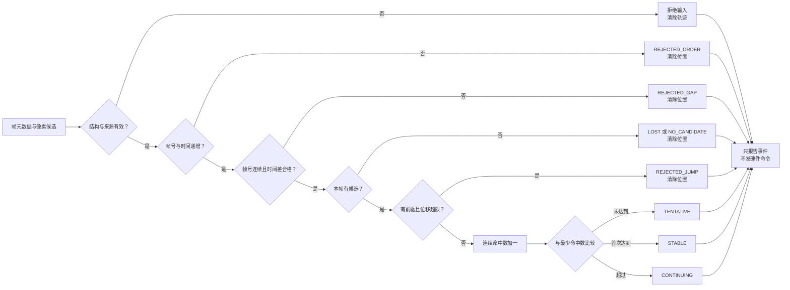

# 第6章 跨帧目标关联与视觉事件：从单帧候选到稳定状态

## 学习目标

读完本章并完成实验后，读者应能够：

1. 将[第六篇第5章](./第5章_颜色分割与目标定位_从HSV掩膜到像素候选.md)的单帧像素候选和帧来源、序号、时间一起描述为可核查的输入记录。
2. 区分“某一帧有候选”“连续多帧满足关联条件”和“证明是同一真实物体”这三个不同命题。
3. 用明确的来源、顺序、时隔和像素位移门限形成`TENTATIVE`、`STABLE`、`CONTINUING`等视觉事件。
4. 对无候选、跳变、缺帧、时间倒退或坏数据清除可复用位置；知道何时必须停止向控制侧传递位置。
5. 运行离线测试，理解本章门限只对合成序列成立，不等于 Arduino UNO Q 上的追踪能力或硬件安全验证。

## 背景与边界

[第六篇第2章](./第2章_摄像头接入与视频帧采集_从设备确认到帧校验.md)讲来源与逐帧检查；[第六篇第5章](./第5章_颜色分割与目标定位_从HSV掩膜到像素候选.md)在一帧中挑选最大合格绿色区域。假设第5章连续两次返回质心 `(34, 40)` 和 `(36, 41)`，两组数字本身**没有**说明它们来自连续帧、同一摄像头或同一物体。若采集端缓冲了旧帧、丢失了中间帧，或两个相近的绿色物体交换位置，简单比较质心会产生错误关联。

OpenCV 的 `VideoCapture.read()` 返回一次读取是否成功及对应的帧；它不自动为本章构造可信的业务来源 ID、单调帧序号或端到端时间证据，见 [OpenCV 官方：Getting Started with Videos](https://docs.opencv.org/4.12.0/dd/d43/tutorial_py_video_display.html)。本章的 `source`、`frame_id`、`timestamp_ms` 是**示例调用者显式提供的元数据**；它们不是 OpenCV API 的原生返回字段。本章不调用 OpenCV，也不读取摄像头：它接收已经检测好的像素候选，演示一个可测试的下游时间门。

更复杂的运动估计可以用光流等方法。例如 OpenCV 的 `calcOpticalFlowPyrLK()` 跟踪跨帧特征点；本章只比较**单个候选的质心距离**，既不是 Lucas–Kanade 光流，也不是多目标跟踪器或对象重识别，不能因此声称获得持久目标 ID，见 [OpenCV 官方：Optical Flow](https://docs.opencv.org/4.12.0/d4/dee/tutorial_optical_flow.html)。

### 输入契约：候选与帧证据必须同来

每条示例记录具有四个字段：

| 字段 | 本章要求 | 不代表什么 |
| --- | --- | --- |
| `source` | 非空、固定来源标识；本例固定为 `synthetic` | 摄像头序列号或认证凭据 |
| `frame_id` | 从 1 起的正整数，严格递增且相邻帧差为 1 | OpenCV 自动生成的可靠全局帧号 |
| `timestamp_ms` | 从 0 起的整数毫秒，严格递增 | 已经校准的真实采集时间或处理完成时间 |
| `candidate` | `None`，或含有限非负 `centroid=(x,y)` 与正面积 `area` 的字典 | 物体身份、米制坐标或检测置信度 |

真实系统应在采集入口明确生成和记录这些元数据，说明计时器、缓冲与同步策略。若跨进程或跨设备传输，时间戳需说明它是**采集时刻**、**到达时刻**还是**处理时刻**，并记录时钟来源。仅比较两个时间戳的大小，无法排除它们都已滞留很久；部署时仍需独立的“相对于当前时刻的新鲜度”检查。若生产链路没有可信 `frame_id`，不要伪造连续编号来“通过”本章门限。

第5章的 `target={"area":..., "bbox":..., "centroid":(...)}` 可提供 `candidate` 的两个必要数值；第5章的 `NO_CANDIDATE` 应映射为 `candidate=None`。`bbox` 可保留作审计，但本章算法不使用它。本章不直接导入第5章脚本，也不把彩色帧与候选的来源一致性自动视为已证实。

### 关联规则：小位移只是候选假设

本章使用一个故意严格、便于审计的教学规则：仅当来源匹配、输入有效、帧号相邻、时间递增且相邻时间差不超过 `max_gap_ms`，才考虑本帧候选；若此前已有候选，还要求两质心欧氏距离不超过 `max_step_px`。连续命中数首次达到 `min_hits` 时输出 `STABLE`，之后持续满足条件输出 `CONTINUING`。示例取 `min_hits=3`、`max_step_px=10.0`、`max_gap_ms=100`。这些数字只使本书的合成序列可复算，不是任何相机帧率、运动速度或安全距离的建议值。

`STABLE` 的精确定义仅为“连续三条输入满足上述门限”。它没有验证颜色分割是否正确，也没有验证两帧是否是同一物体。视角变化、遮挡、尺度改变、邻近同色物体、相机抖动及帧率变化都可能使质心门失效。多物体任务不能把“每帧最大面积”的候选串成单个身份；应另设计候选集合、匹配代价、遮挡与 ID 生命周期，并用有标注数据评估误关联。

> 图示占位：图号=Fig-40；位置=本段之后；内容=帧元数据与候选的校验、连续命中、稳定事件、无候选及顺序/时隔/跳变拒绝路径；来源=本书原创，依据本章登记的 OpenCV 官方资料与原创教学规则。

<a id="fig-40-uno-q-opencv-temporal-gate"></a>

### Fig-40：单帧候选到视觉事件的时间门



图源：[Fig-40 Mermaid](../../diagrams/uno-q-opencv-temporal-gate.mmd)。图中“拒绝输入”对应 Python `ValueError`；其他状态返回结构化结果。所有停止路径的 `centroid` 均为 `None`，不会复用上一帧坐标。图示不表示 UNO Q 官方视觉控制协议。

### 事件语义与停止条件

| 事件 | 触发条件 | 位置处理 |
| --- | --- | --- |
| `TENTATIVE` | 已有 1～2 次连续合格命中 | 本帧质心仅作候选，不具备稳定资格 |
| `STABLE` | 第 3 次连续合格命中 | 返回本帧质心，仍不得直接驱动硬件 |
| `CONTINUING` | 第 4 次及以后连续合格命中 | 返回本帧质心，保持同样的安全边界 |
| `NO_CANDIDATE` / `LOST` | 本帧无候选；先前分别未稳定 / 已稳定 | 命中数归零，质心清空 |
| `REJECTED_ORDER` | 帧号重复/倒退或时间不递增 | 清空轨迹；不把旧输入变成新水位 |
| `REJECTED_GAP` | 帧号跳号或时间差超过上限 | 清空轨迹；记录当前前进水位，但丢弃当前候选 |
| `REJECTED_JUMP` | 与前驱质心距离超过上限 | 清空轨迹；丢弃跳变帧候选 |
| `ValueError` | 来源、字段或数值不合法 | 清空轨迹；保留先前已接受的帧水位 |

这里“水位”是程序记住的最近前进帧号和时间戳。被拒绝的跳号/超时帧只更新水位、不参与新轨迹：下一帧可作为新的第 1 次命中。重复帧与非法输入不推进水位，避免它们占据正常序列。无候选即使尚未达到稳定门也清零，不把分散的命中次数拼接成“连续”。

## 操作与实验：合成帧序列的状态转换

本实验在内存中列出八条记录：前 3 帧形成 `STABLE`；第 4 帧无候选形成 `LOST`；第 5～7 帧重新从 `TENTATIVE` 积累；第 8 帧质心大幅跳变而被拒绝。它刻意不接入真实摄像头：读者应先核对状态机是否符合设定，再考虑如何产生真实元数据。代码入口见[第六篇第6章示例说明](../../code/第6篇_OpenCV/第6章_跨帧关联与视觉事件/README.md)和[脚本源码](../../code/第6篇_OpenCV/第6章_跨帧关联与视觉事件/temporal_events.py)。

**代码说明**

- 用途：验证一条单候选序列的连续命中、丢失、重建及跳变拒绝规则。
- 运行环境：Python 3；本次在本机 Python 3.14.6 运行。目标 UNO Q Linux 镜像、Python 版本和实时性能均未验证。
- 文件位置：[`temporal_events.py`](../../code/第6篇_OpenCV/第6章_跨帧关联与视觉事件/temporal_events.py)；测试为[`test_temporal_events.py`](../../code/第6篇_OpenCV/第6章_跨帧关联与视觉事件/test_temporal_events.py)。
- 依赖：仅 Python 标准库；不要求 OpenCV 或 NumPy。输入候选格式与第5章衔接，但示例数据独立构造。
- 操作步骤：进入代码目录执行下列命令。示例脚本只处理硬编码合成记录，不开摄像头、不读写图像或业务数据文件、不访问网络、GPIO、MCU 或执行器；测试会加载本地脚本并启动子进程。异常/拒绝状态都必须停在视觉结果层。
- 预期输出：依次得到 `TENTATIVE`、`TENTATIVE`、`STABLE`、`LOST`、`TENTATIVE`、`TENTATIVE`、`STABLE`、`REJECTED_JUMP`；丢失与跳变事件的质心为空。下方输出是本次本机实测，不是 UNO Q 板上输出。
- 故障排查：若状态顺序不同，检查 `source`、帧号是否连续、时间是否严格递增、时间差与质心距离是否越界；不要为了让坏帧“通过”而自动放宽门限。若输入非法触发 `ValueError`，先修正采集契约，再从安全状态重新评估；不能沿用旧坐标。
- 验证方式：运行 `python -m unittest -v test_temporal_events.py`。7 项测试检查稳定门、目标丢失、跳变、缺帧/重复/超时、非法输入、配置校验和命令行确定性；它们不证明真实对象身份、摄像头适配或硬件安全性。

```text
python temporal_events.py
python -m unittest -v test_temporal_events.py
```

**本次本机实测输出（前述默认序列）**

```text
frame=1 timestamp_ms=0 status=TENTATIVE hits=1 centroid=(10.0, 10.0)
frame=2 timestamp_ms=40 status=TENTATIVE hits=2 centroid=(13.0, 14.0)
frame=3 timestamp_ms=80 status=STABLE hits=3 centroid=(16.0, 18.0)
frame=4 timestamp_ms=120 status=LOST hits=0 centroid=None
frame=5 timestamp_ms=160 status=TENTATIVE hits=1 centroid=(100.0, 100.0)
frame=6 timestamp_ms=200 status=TENTATIVE hits=2 centroid=(101.0, 101.0)
frame=7 timestamp_ms=240 status=STABLE hits=3 centroid=(102.0, 102.0)
frame=8 timestamp_ms=280 status=REJECTED_JUMP hits=0 centroid=None
```

第 4 帧的 `LOST` 和第 8 帧的 `REJECTED_JUMP` 都将 `hits` 重置为 0、`centroid` 置空。尤其是第 8 帧，不能把 `(102,102)` 当成“最近已知位置”继续交给执行器。第 5 帧的 `(100,100)` 虽然远离第 3 帧，但在第 4 帧已明确失效后是**新假设**的首次命中，绝非旧对象的延续。

### 迁移到真实视频流前必须补的证据

1. 在[第六篇第2章](./第2章_摄像头接入与视频帧采集_从设备确认到帧校验.md)的采集循环中确定来源、取帧失败、缓冲与采集时间策略；同时给帧与候选绑定同一 `frame_id`，并记录运行会话，避免重启后序号碰撞。
2. 在实际场景收集有标注的序列，测量漏检、误检、遮挡、交叉、相机抖动和目标速度分布。根据帧率及视角重新选择门限，并报告误关联与丢轨，而不是引用本章示例数字。
3. 校验处理完成时刻相对于采集时刻的延迟；若单帧结果排队过久，即使帧号相邻也必须拒绝。多摄像头或多进程需要独立时钟与来源校验。
4. 若要把视觉结果送往[第四篇 Python Bridge](../第4篇_PythonBridge/README.md)或 MCU，另设授权、幂等、目标坐标系、限幅、超时、急停与人工验收门。[第六篇第1章](./第1章_OpenCV开发基础_图像像素与视觉处理流水线.md)已解释像素到硬件反馈的层级边界；本章事件不是动作命令。

## 验证结果与范围

本章脚本和 7 项单元测试在本机 Python 3.14.6 通过；脚本的两次命令行运行输出一致。测试覆盖 `STABLE` 首次出现时机、`LOST` 后重建、远距离跳变不沿用位置、帧号缺口/重复、过长时间差、非法候选和错误来源。实验没有 OpenCV 依赖，因此不能用这些测试结果推断 OpenCV 版本兼容性或相机采集效果。

尚未验证 Arduino UNO Q 上的摄像头驱动、实际采集时间戳、帧缓冲、真实色彩定位、对象身份、标定、实时延迟、Bridge/MCU 联动或失效安全。Fig-40 的 Mermaid 正文与独立源文件需保持一致；SVG 尚未生成和视觉审阅。本章仍为 `draft`。

## 常见问题

### 三帧都很接近，为什么不能说是同一物体？

因为接近只是一个关联假设。两个相邻同色物体可能交换位置，背景斑块也可能连续出现。没有真值、外观特征和多对象关联评估，`STABLE` 只能表示门限被满足。

### 没有候选一帧后，为什么下一帧从头计数？

“连续命中”的定义已经被中断。保留旧次数会把相隔很远的观测拼成稳定结果；本章选择清零。允许短时遮挡预测是另一种明确的跟踪策略，需要预测不确定性、有效期和风险评估，不能暗中复用旧质心。

### 只有时间戳，没有帧号可以吗？

可以设计另一种流契约，但那不是本章实验。单有递增时间戳仍无法发现某些帧丢失或重复处理；如需替代 `frame_id`，必须说明如何识别缺失、重放与重启，并写相应测试。

### 时间差小于 100 毫秒，结果就“新鲜”吗？

不一定。这只比较**相邻记录**的时间间隔，不比较采集时刻与当前时刻。若整个队列积压了 10 秒，连续帧依旧可能在本章门限下通过；真实系统要加绝对时效检查。

### 为什么不直接用 OpenCV 跟踪器或光流？

本章先把来源、顺序、时效和失败停止写成可检查的契约。光流能估计帧间像素/特征运动，但同样需要明确输入来源、失效条件和对象身份边界。选择具体算法应基于真实场景和标注评估，不应以“算法名更高级”替代验证。

## 延伸阅读

- [OpenCV 官方教程：Getting Started with Videos](https://docs.opencv.org/4.12.0/dd/d43/tutorial_py_video_display.html)：逐帧读取、成功标志和资源释放。
- [OpenCV 官方教程：Optical Flow](https://docs.opencv.org/4.12.0/d4/dee/tutorial_optical_flow.html)：光流问题与特征点追踪，供与本章质心时间门比较。
- [第六篇第5章：颜色分割与目标定位](./第5章_颜色分割与目标定位_从HSV掩膜到像素候选.md)：单帧候选如何产生及其身份边界。
- [参考资料索引](../../resources/references.md)：来源版本、原创规则与版权边界。
