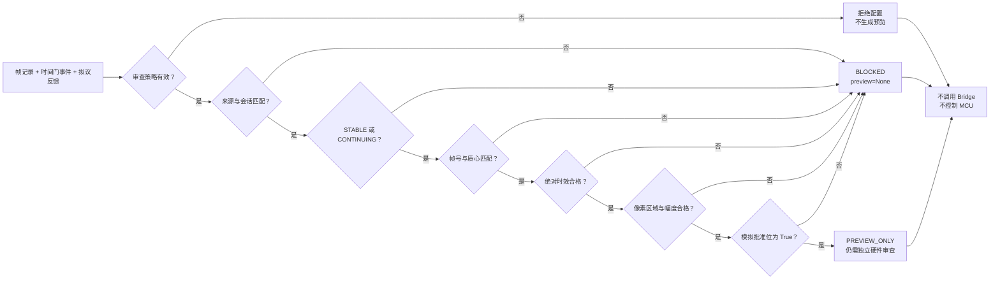

# 第7章 视觉事件与硬件反馈：从稳定候选到受控动作

## 学习目标

读完本章并完成实验后，读者应能够：

1. 解释为什么[第六篇第6章](./第6章_跨帧目标关联与视觉事件_从单帧候选到稳定状态.md)的 `STABLE` 只意味着时间门满足，不意味着可以控制 Arduino UNO Q 的引脚或执行器。
2. 将单帧记录、时间门事件和拟议反馈意图绑到同一来源、运行会话与帧号，避免错帧、跨会话或陈旧结果进入下一层。
3. 区分“可供人工复核的意图”“Bridge/RPC 请求已接收”和“MCU 实际动作已验证”三种证据层级。
4. 使用纯离线程序验证新鲜度、像素区域、反馈幅度与模拟授权的阻断条件。
5. 列出进入真实硬件联调前必须补齐的认证、幂等、MCU 侧安全门、物理观测和回退证据。

## 背景与边界

前六章完成了从图像数组、摄像头采集、预处理、轮廓、颜色候选到跨帧视觉事件的教学链路。但这些结果始终停留在**视觉证据层**。即使第6章返回 `STABLE`，它也只表示连续若干条**合成或已校验输入**满足设定门限，不能证明目标身份、像素到物理位置的标定，更不能自动转为 PWM、GPIO 或机械动作。

Arduino 官方 [UNO Q 产品资料](https://docs.arduino.cc/hardware/uno-q)介绍了 Linux 侧处理器与 STM32U585 MCU 的双侧分工和 Bridge/RPC 能力；[Arduino App 规范](https://github.com/arduino/arduino-app-cli/blob/main/docs/app-specification.md)明确 Python 运行在 Linux 侧、Sketch 运行在 MCU 侧，低层传感器与执行器交互由 Sketch 承担，两侧通过 RPC 消息协作。本章据此设计一个**原创教学审查门**：它只判断是否可以形成待人工复核的反馈意图，不调用官方 Bridge 接口，也不闪烁 LED、写引脚或发网络请求。它不是 Arduino 官方安全认证机制或可直接部署的视觉控制方案。

### 三层证据不能折叠

| 层级 | 可能观察到的证据 | 不能据此断言 |
| --- | --- | --- |
| 视觉候选 | `STABLE`/`CONTINUING`、帧号、质心、采集时间 | 同一真实对象、物理坐标或动作许可 |
| Linux 侧审查 | 本章 `PREVIEW_ONLY` 或 `BLOCKED`、阻断理由、拟议幅度 | Bridge 已发送、MCU 已接收或输出已变化 |
| 硬件执行 | 经授权的请求、MCU 返回与独立物理测量 | 仅凭返回值就认定现场风险已解除 |

第三层不在本章实验范围。即使未来使用 `Bridge.call()` 得到返回，也仍需区分“方法返回”和“输出端实际变化”；若出现超时或通信中断，还需查询或对账，不可自动重发可能导致重复动作。对这类调用生命周期，可回看[第四篇第1章](../第4篇_PythonBridge/第1章_Python_Bridge开发基础_消息模型与调用边界.md)与[第四篇第4章](../第4篇_PythonBridge/第4章_Python_Bridge结果账本与状态查询_从返回值到可验证证据.md)。[Arduino 官方 Python Bridge 源码](https://github.com/arduino/app-bricks-py/blob/main/src/arduino/app_utils/bridge.py)展示了 `call` 与 `notify` 的不同接口；本章不使用它们，也不把接口存在当成实机联调证据。

### 从第6章事件构造审查输入

[第六篇第6章脚本](../../code/第6篇_OpenCV/第6章_跨帧关联与视觉事件/temporal_events.py)的 `TemporalGate.process(sample)` 返回 `status`、`frame_id`、`hits` 和 `centroid`。来源 `source` 与时间 `timestamp_ms` 留在原始 `sample` 中；本章审查门必须同时拿到两者，核对帧号和质心一致，而不是只接一条可脱离来源的 `STABLE` 字符串。示例另给帧记录一个 `run_id`，表示同一运行会话；第6章不会生成或认证这个字段，真实应用应由运行入口建立，并防止重启后的会话标识复用。

拟议反馈在本章固定为 `kind="indicator"`、`level=0～20` 的抽象指示强度。`level` 只是 0～100 范围内的教学百分数，**不是** MCU PWM 寄存器值、引脚电平或已校准亮度。程序不产生 Bridge 方法名或可执行请求。将来若要映射到 LED、蜂鸣器或其他设备，必须重新定义设备清单、量纲、限幅、默认安全态和物理验收；不得把当前 `level` 直接发送给执行器。

## 原创审查门：保留每一次阻断

本章程序按以下顺序审查：配置有效；帧来源与 `run_id` 匹配；视觉事件稳定且与原帧帧号/质心一致；采集时间相对“现在”的年龄不超限；质心位于允许的像素区域（Region of Interest，ROI）；拟议反馈种类和幅度在白名单内；模拟批准位明确为布尔 `True`。任一条件失败都返回 `BLOCKED`、理由码和 `preview=None`。只有全部通过才返回 `PREVIEW_ONLY`，而非 `ALLOW` 或 `EXECUTED`。

时间检查使用 `age_ms = now_ms - timestamp_ms`，默认示例允许 0～100 毫秒，负数（未来帧）和更老的结果都被拒绝。这比第6章只比较**相邻帧**间隔多了一层绝对新鲜度检查，但仅在 `now_ms` 与 `timestamp_ms` 源自**同一可比较时钟**时有意义。真实相机与 Linux 进程之间若存在缓冲或时钟偏移，不能直接套用示例的 100 毫秒值；应测量采集、传输、推理与审查全过程延迟，再规定过期策略。

ROI 示例为左上角 `(0,0)`、宽 160、高 128 的半开区间：`0 ≤ x < 160` 且 `0 ≤ y < 128`。它只检查像素边界，不解决物理标定；处理裁剪图时还须核对 ROI 原点和坐标变换。`simulated_approval=True` 只是离线课堂里的显式开关，**不是账号认证、操作者身份、现场许可或急停复位**。

> 图示占位：图号=Fig-41；位置=本段之后；内容=视觉事件与原帧绑定、来源和绝对时效检查、像素区域及反馈幅度门、模拟批准、阻断与仅供复核的反馈意图；来源=本书原创，依据本章登记的 Arduino 官方资料。

<a id="fig-41-uno-q-opencv-feedback-guard"></a>

### Fig-41：从视觉事件到离线反馈意图的审查门



图源：[Fig-41 Mermaid](../../diagrams/uno-q-opencv-feedback-guard.mmd)。图中 `POLICY` 无效时抛 `ValueError`；其余坏记录返回 `BLOCKED`。图示描述的是本书审查规则，不是 Arduino 官方软硬件拓扑或认证流程。

## 操作与实验：三种离线反馈判定

[配套代码](../../code/第6篇_OpenCV/第7章_视觉反馈安全门/README.md)使用硬编码的第 3 帧合成记录：`source="synthetic"`、`run_id="demo-001"`、`timestamp_ms=80`、`centroid=(16,18)`，对应第6章首次达到 `STABLE` 的事件。拟议指示强度为 12，最大允许强度为 20。用 `now_ms=100` 且模拟批准为真可得到预览；把“现在”改成 181 毫秒会过期；取消模拟批准则阻断。这个例子既不依赖 OpenCV，也不导入 Bridge SDK。

**代码说明**

- 用途：在内存中的合成记录上演示视觉事件到反馈意图之间的多重阻断，输出可检查的预览或理由码。
- 运行环境：Python 3；本次在本机 Python 3.14.6 执行，目标 Arduino UNO Q Linux 镜像与解释器版本未验证。
- 文件位置：[`review_feedback.py`](../../code/第6篇_OpenCV/第7章_视觉反馈安全门/review_feedback.py)；测试为[`test_review_feedback.py`](../../code/第6篇_OpenCV/第7章_视觉反馈安全门/test_review_feedback.py)。
- 依赖：仅 Python 标准库；无 `cv2`、NumPy、Bridge 或设备驱动依赖。
- 操作步骤：进入代码目录运行以下两条命令。示例不接相机、不调用 Bridge、不写引脚、不访问网络，也不读取或写入业务数据文件；对 `BLOCKED`、异常或不确定结果都停止在本地审查层，不能“降级放行”。
- 预期输出：新鲜且模拟批准的样例为 `PREVIEW_ONLY`；超时样例为 `BLOCKED/stale_or_future_frame`；未批准样例为 `BLOCKED/approval_missing`。下方是本次本机实测输出，不是目标板、Bridge 或 MCU 的结果。
- 故障排查：若全被阻断，逐项核对策略、`source`、`run_id`、帧号、质心、同一时钟域、ROI 与 `level`；不要通过扩大发光强度或放宽时效掩盖来源错误。策略配置无效时修正配置后重新离线运行；没有任何硬件动作需要“回滚”。
- 验证方式：执行 `python -m unittest -v test_review_feedback.py`；10 项测试覆盖稳定状态、错源/跨会话/错帧、过期/未来帧、像素越界、非法数值、幅度与种类白名单、模拟批准、无效策略及命令行确定性。测试不验证真实认证或物理动作。

```text
python review_feedback.py
python -m unittest -v test_review_feedback.py
```

**本次本机实测输出**

```text
case=fresh decision=PREVIEW_ONLY reason=requires_separate_hardware_review preview={'kind': 'indicator', 'level': 12, 'run_id': 'demo-001', 'frame_id': 3}
case=stale decision=BLOCKED reason=stale_or_future_frame preview=None
case=unapproved decision=BLOCKED reason=approval_missing preview=None
```

这个预览只含抽象意图、会话和帧号；没有目标引脚、Bridge 方法、物理接线或执行确认。`PREVIEW_ONLY` 不是“通过硬件验收”，更不能因为打印出字典就调用 `Bridge.notify()`。实际物理反馈还需由另一个经批准的工程任务建立审查与执行链路。

### 进入真实联调前的停止清单

1. **设备与权限**：确认具体 UNO Q 型号、镜像、App Lab/Bridge 版本、输出设备和接线，限定允许使用的引脚与电气范围；执行实际身份认证、授权、现场隔离及急停检查。本例的 `simulated_approval` 不能代替这些步骤。
2. **时钟与重放**：让采集时刻、审查时刻处于明确时钟域；给运行会话和反馈请求设置不可复用标识与幂等账本，抵御重启、重复帧、重放与超时后的不确定结果。第6章的时间门和本章的纯函数都没有持久化去重。
3. **坐标与幅度**：在真实图像上验证 ROI、裁剪偏移、标定和遮挡误判；把抽象 `level` 映射为经测量的设备量，并校验最大持续时间和安全默认值。不同输出设备不得共用未经验证的限值。
4. **MCU 独立门**：由 Sketch 再验证方法白名单、参数范围、会话/期限、心跳或看门狗、安全态和失效动作；Linux 侧允许不等于 MCU 必须执行。参阅[第二篇第7章](../第2篇_STM32/第7章_实时任务与调度_从周期循环到可验证响应.md)。
5. **证据闭环**：区分请求准备、Bridge 传递、MCU 接受、输出状态与独立物理观测；对每一步保留可关联证据。通信超时或观察缺失应冻结并人工核查，不能把未知结果重试为第二次动作。

## 验证结果与范围

本章示例和 10 项单元测试在本机 Python 3.14.6 通过。测试验证了“只有满足全部离线条件才出现 `PREVIEW_ONLY`”，并检查多类输入错误使 `preview` 清空。代码没有相机、OpenCV、Bridge 或 MCU 调用；它也没有持久化状态、网络权限或设备资源。

尚未验证真实采集时钟、相机缓冲、目标身份、ROI 标定、操作员认证、幂等账本、Bridge/Router 消息交付、MCU 独立安全门、执行器接线、电气安全或物理输出。Fig-41 的 Mermaid 正文与独立源文件需要保持一致，SVG 尚未生成与视觉审阅。本章保持 `draft`，不把纯函数测试称为硬件反馈验收。

## 常见问题

### `PREVIEW_ONLY` 是否意味着可以把强度 12 发送给 LED？

不意味着。数字 12 是本章的抽象百分数，没有绑定 LED 引脚、电压、PWM 频率或实际亮度；需要另行完成设备、接线、程序、权限和安全验证。代码有意不生成可直接发送的 Bridge 请求。

### 第6章已经检查时间间隔，为什么本章还检查年龄？

相邻时间间隔小，只能说明序列内部连续；整段序列可能在缓冲或队列中滞留很久。本章增加相对于“现在”的年龄门，但要求同一时钟域，且示例 100 毫秒门限不能直接用于实机。

### `simulated_approval=True` 能作为操作员授权吗？

不能。它只是测试一条决策分支。真实授权需要身份、角色、设备、时段、现场状态和审计证据，且权限撤销或急停必须能及时生效。

### 为什么不直接用 `Bridge.notify()` 驱动 MCU？

本章的目的在于先写清哪些视觉结果**不能**进入执行层。没有回执的通知与有返回的调用具有不同的可判定性；无论选择哪一种，MCU 都必须独立做参数与安全检查，物理结果还需独立观测。本章不提供会误导读者直接驱动硬件的示例。

### 如果审查程序崩溃或者 Bridge 超时怎么办？

本章程序崩溃没有硬件副作用；真实系统应把无结果、超时和未知结果视为停机/冻结条件，由 MCU 看门狗或独立保护维持安全态，并通过状态查询与人工核查决定后续动作，不能盲目重试。

## 延伸阅读

- [Arduino UNO Q 官方产品资料](https://docs.arduino.cc/hardware/uno-q)：双处理器与 Bridge/RPC 的产品级说明。
- [Arduino App specification](https://github.com/arduino/arduino-app-cli/blob/main/docs/app-specification.md)：Python、Sketch 与 RPC 的职责边界。
- [Arduino Python Bridge 源码](https://github.com/arduino/app-bricks-py/blob/main/src/arduino/app_utils/bridge.py)：`call`/`notify` 的公开接口语义；本章不导入此库。
- [第六篇第6章](./第6章_跨帧目标关联与视觉事件_从单帧候选到稳定状态.md)：回顾 `STABLE`/`CONTINUING` 的有限含义。
- [参考资料索引](../../resources/references.md)：来源版本、原创规则与许可边界。
