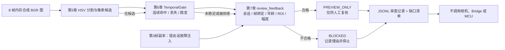

# 第8章 OpenCV 综合验证：从合成画面到反馈审查证据包

## 学习目标

完成本章后，读者应能够：

1. 用一条可重复的合成序列，实际串联[第六篇第5章](./第5章_颜色分割与目标定位_从HSV掩膜到像素候选.md)的单帧定位、[第六篇第6章](./第6章_跨帧目标关联与视觉事件_从单帧候选到稳定状态.md)的时间门，以及[第六篇第7章](./第7章_视觉事件与硬件反馈_从稳定候选到受控动作.md)的离线反馈审查门。
2. 从同一条记录中分辨像素候选、跨帧状态与反馈审查结论，不把其中任何一层当作真实对象身份或 Arduino UNO Q 硬件动作的证明。
3. 复现目标丢失、结果过期、像素跳变和会话不匹配四类阻断，并说明“错会话”故障注入为什么不能冒充一帧新图像。
4. 形成可交接的审查记录与未完成项清单，使后续相机接入和硬件联调有明确的证据门。

## 背景与边界

前几章各自验证了视觉链路的一段；分段测试通过，不等于段与段之间的字段、时序和拒绝路径已协同工作。本章用**同一进程内的八帧合成 BGR 图像**做集成演练。每一帧先由[颜色定位脚本](../../code/第6篇_OpenCV/第5章_颜色分割与目标定位/locate_color.py)生成候选，再交给[时间门脚本](../../code/第6篇_OpenCV/第6章_跨帧关联与视觉事件/temporal_events.py)，最后交给[反馈审查脚本](../../code/第6篇_OpenCV/第7章_视觉反馈安全门/review_feedback.py)。本章的[综合脚本](../../code/第6篇_OpenCV/第8章_综合验证/run_visual_handoff.py)只做连接与证据记录，**不复制**前三章的判定算法。

OpenCV 官方资料将颜色空间转换与 `inRange` 用于颜色掩膜，将二值掩膜交给 `findContours` 提取轮廓；本章沿用前文已登记的这些接口约定，但阈值、开运算核与运动门限都是本书合成实验参数，不是针对真实相机标定的参数。[Arduino UNO Q 产品资料](https://docs.arduino.cc/hardware/uno-q)和[Arduino App 规范](https://github.com/arduino/arduino-app-cli/blob/main/docs/app-specification.md)说明 Linux/Python 与 MCU/Sketch 有不同职责；因此输出止于本地审查记录，没有 Bridge/RPC 调用，更没有 MCU 输出。

### 三层输出，三种不同主张

| 层级 | 本章实际输出 | 能说明什么 | 不能说明什么 |
| --- | --- | --- | --- |
| 像素候选 | `PIXEL_CANDIDATE`、面积、`candidate_centroid` | 合成图中存在满足指定 HSV 与面积条件的区域 | 真实目标身份、物理坐标、跨帧连续性 |
| 时间门 | `TENTATIVE`、`STABLE`、`LOST`、`REJECTED_JUMP` 等 | 这串输入在教学规则下的连续/中断状态 | 独立时钟可信、相机没有缓冲、硬件可动作 |
| 反馈审查 | `BLOCKED` 或 `PREVIEW_ONLY`、理由码、`preview` | 原帧、事件和策略在离线规则下是否可形成待复核意图 | 用户已授权、Bridge 已发出、MCU 已执行、物理输出已测量 |

第三层的 `PREVIEW_ONLY` **不是执行许可**。第7章的 `simulated_approval=True` 只让教学分支可演练，不是身份认证、现场许可或急停复位。即使未来补入 Bridge，也须按[第四篇第1章](../第4篇_PythonBridge/第1章_Python_Bridge开发基础_消息模型与调用边界.md)和[第四篇第4章](../第4篇_PythonBridge/第4章_Python_Bridge结果账本与状态查询_从返回值到可验证证据.md)区分发送、接收、未知与实际执行证据。

### 集成数据契约

综合脚本创建 128×160 像素、`uint8`、BGR 三通道的内存图像；背景各通道值为 30，绿色矩形填充值为 `(0,180,0)`。绿色区域占 20×20 个像素，但轮廓面积由边界多边形计算，本机结果是 **361.0 像素坐标平方单位**，不是 400 个像素，也不是平方毫米。位置 `x=15,18,21` 的前三帧连续命中；`x=100,103,106` 是丢失后的新一轮连续命中；最后一帧 `x=130` 与前一质心相差 24 像素，超过 10 像素跳变门限。

帧记录保留 `source="synthetic"`、`run_id="demo-001"`、从 1 开始递增的 `frame_id` 和采集时刻 `timestamp_ms`。`observed_at_ms` 是本章人为指定的审查时刻；全部数值属于同一**模拟毫秒时钟域**，不是系统墙上时钟，更不是 OpenCV 自动产生的可信时间戳。第7帧虽然重新达到 `STABLE`，其采集时刻为 240 毫秒、审查时刻为 400 毫秒，年龄 160 毫秒，超过 100 毫秒教学门限，因而阻断。第6章只检查相邻帧 40 毫秒的间隔；第7章才检查绝对年龄。这两种时效不能互相替代。

> 图示占位：图号=Fig-42；位置=本段之后；内容=八帧合成图经过像素候选、时间门和反馈审查后形成证据记录，并标出错会话复核探针与阻断停止路径；来源=本书原创，依据第5～7章代码及本章登记的官方资料。

<a id="fig-42-uno-q-opencv-integrated-evidence"></a>

### Fig-42：从合成帧到离线审查记录



图源：[Fig-42 Mermaid 源文件](../../diagrams/uno-q-opencv-integrated-evidence.mmd)。第3帧的错会话副本只通往审查门，**不进入**时间门；它不是一次新的相机采集，也不增加 `frame_id`。图示是本书原创教学关系，不是 Arduino 官方系统图；SVG 尚未生成或目视审阅。

## 操作与实验

### 先明确交接物

脚本向标准输出打印九条 JSON Lines（JSONL）记录：八条 `stage="pipeline"` 对应八帧，一条 `stage="review_probe"` 对应第3帧的错会话副本。每条含 `source`、`run_id`、`frame_id`、`timestamp_ms`、`observed_at_ms`、`candidate`、`area_px2`、`candidate_centroid`、`temporal_status`、`hits`、`centroid`、`decision`、`reason` 与 `preview`。`candidate_centroid` 是定位阶段结果；`centroid` 是时间门保留下来的结果，跳变时前者仍存在、后者被清空。这个差异帮助审查者看出“检测到颜色”与“被允许沿用轨迹”不是一回事。

`run_id` 只是本地测试标签，不具备签名或不可伪造性；JSONL 标准输出也不是防篡改审计账本。若需保存结果，应由后续明确的数据管理流程决定文件位置、运行上下文、访问控制与留存策略。本章默认不写输出文件，配套[交接模板](../../code/第6篇_OpenCV/第8章_综合验证/handoff-template.md)用来记录本次证据边界及后续待办。

**代码说明**

- 用途：把前三章的真实函数组合到一条合成图像链路，并对正常、目标丢失、过期、跳变及错会话复核场景输出可解析记录。
- 运行环境：本机 Python 3；本次在 Python 3.14.6、OpenCV 5.0.0、NumPy 2.4.6 环境验证，Arduino UNO Q 目标镜像、相机与性能未验证。
- 文件位置：[run_visual_handoff.py](../../code/第6篇_OpenCV/第8章_综合验证/run_visual_handoff.py)；回归测试为[test_run_visual_handoff.py](../../code/第6篇_OpenCV/第8章_综合验证/test_run_visual_handoff.py)；[代码说明](../../code/第6篇_OpenCV/第8章_综合验证/README.md)。
- 依赖：Python 标准库、NumPy 和 `cv2`；脚本按文件路径加载本仓库第5～7章代码，不安装或调用 Bridge SDK。
- 操作步骤：从本章代码目录执行下方两条命令。脚本只创建内存图像并打印 JSONL，不打开摄像头、不访问网络、不写业务数据或设备；遇到异常、`BLOCKED` 或未知结果都停在本地，不改为硬件动作。
- 预期输出：九条 JSONL，其中仅第3帧为 `PREVIEW_ONLY`；第4帧丢失、第7帧过期、第8帧跳变，以及第3帧的错会话审查探针均为 `BLOCKED`。下表为本机运行后摘出的字段，不是实机输出。
- 故障排查：若依赖缺失，先核对 `python`、`cv2`、NumPy 是否在同一解释器环境；若第3帧未稳定，核对绿色矩形、HSV 范围、轮廓面积门限与第6章连续命中参数；若 JSONL 数量或理由变化，比较第5～7章脚本接口和测试，不通过放宽时效或幅度门限“修复”失败。
- 验证方式：执行 `python -m unittest -v test_run_visual_handoff.py`；六项测试检查三段实际调用、确定性命令行输出、丢失与重新起算、绝对过期、跳变清空和错会话探针。再按下表核对输出；这不替代目标板测试。

```text
python run_visual_handoff.py
python -m unittest -v test_run_visual_handoff.py
```

**本次本机实测摘录**

| 场景 | 阶段/帧号 | 像素候选 | 时间门 | 审查结果与理由 |
| --- | --- | --- | --- | --- |
| `warmup_1`、`warmup_2` | 管线/1、2 | 均有 | `TENTATIVE` | `BLOCKED / event_not_stable` |
| `fresh_stable` | 管线/3 | 有，质心 (30.5, 29.5) | `STABLE` | `PREVIEW_ONLY / requires_separate_hardware_review` |
| `wrong_run_probe` | 复核探针/3 | 复用第3帧 | 复用 `STABLE` 事件 | `BLOCKED / source_or_session_mismatch` |
| `target_lost` | 管线/4 | 无 | `LOST` | `BLOCKED / event_not_stable` |
| `reacquire_1`、`reacquire_2` | 管线/5、6 | 均有 | `TENTATIVE` | `BLOCKED / event_not_stable` |
| `stale_stable` | 管线/7 | 有 | `STABLE` | `BLOCKED / stale_or_future_frame` |
| `jump` | 管线/8 | 有，但时间门质心为空 | `REJECTED_JUMP` | `BLOCKED / event_not_stable` |

这组结果显示：正例只走到**离线预览**，四类重要负例仍停在各自层级。第4帧 `LOST` 清掉旧轨迹；第5帧不因新候选出现就继承第3帧的 `STABLE`。第8帧即使第5章仍返回绿色像素候选，也不能绕过第6章跳变拒绝。错会话探针只改变第3帧副本的 `run_id` 为 `old-run`，直接调用第7章审查门；若把它送进时间门作为“第4帧”，就会把会话故障与帧顺序故障混在一起，失去单一故障注入的解释力。

### 证据矩阵与后续门槛

| 待证明事项 | 本章已保留的证据 | 仍缺少的证据/停止条件 |
| --- | --- | --- |
| 合成图定位与字段传递 | 第5章函数真实返回候选；第3帧面积 361.0、质心 (30.5, 29.5) | 真实镜头光照、曝光、白平衡、遮挡与误检统计 |
| 时间门拒绝 | 第4帧 `LOST`、第8帧 `REJECTED_JUMP`、重新起算记录 | 真实帧率、掉帧、乱序、时钟来源与多目标身份 |
| 绝对时效及会话绑定 | 第7帧年龄 160 毫秒被拒；第3帧错会话副本被拒 | 可信时钟、抗重放会话标识、持久化去重 |
| 反馈边界 | 正例仅 `PREVIEW_ONLY`；所有拒绝项 `preview=null` | 操作者认证、Bridge/Router 交付、MCU 独立保护、物理输出观测 |
| 可复核性 | 九条确定性 JSONL 与六项回归测试 | 证据落盘规则、版本/配置指纹、签名、审计留存和板上复跑 |

若要进入真实 Arduino UNO Q 联调，先按[第六篇第2章](./第2章_摄像头接入与视频帧采集_从设备确认到帧校验.md)确认具体相机、载板、驱动、镜像和采集后端；用实采样本重新标定 HSV、ROI、延迟与错误率。任何硬件反馈还须另立任务，经权限、接线、电气、MCU 安全态和物理测量审查。本章不提供“直接把 `preview` 发给 Bridge”的步骤。

## 验证结果与范围

本章脚本在本机生成了八条管线记录和一条复核探针；六项单元测试通过。测试包含命令行重复执行一致性和 JSONL 可解析性，实际调用第5～7章文件，而不是用预填的 `STABLE` 字符串替代前两段。确认的只是**本机合成链路的行为**，不是相机输入质量、低延迟能力或硬件可靠性。

仍未完成：UNO Q 实机依赖安装与运行、任何相机/载板兼容性、摄像头时间戳可信度、真实目标标定与误报评估、Bridge/Router 交付、MCU 独立安全门、执行器动作及物理回执。本章和本篇保持 `draft`；Fig-35～Fig-42 的 SVG 渲染与视觉审阅尚未完成。“本篇正文范围收束”只指章节安排，不是出版或现场验收合格。

## 常见问题

### 为什么绿色方块是 20×20 像素，轮廓面积却为 361.0？

NumPy 切片写入 20×20 个像素，属于像素计数；`cv2.contourArea` 对外轮廓点围成的多边形求面积，坐标跨越 19×19 个间隔。两者定义不同，不能把任一数值直接当作物理面积。[OpenCV 轮廓特征文档](https://docs.opencv.org/4.12.0/dd/d49/tutorial_py_contour_features.html)说明了 `contourArea` 与矩量等量的用途。

### 第7帧已经 `STABLE`，为什么仍是 `BLOCKED`？

稳定门只比较相邻帧；本章第7帧相对审查时刻已老化 160 毫秒，超过离线策略的 100 毫秒。真实系统若时钟来源不同，连这个差值也不应直接计算；须先明确采集时间与审查时间的同一时钟域。

### 一条 `PREVIEW_ONLY` 是否可以作为下一篇 AI 或物联网项目的触发器？

可以作为**人工阅读的教学中间结果**，不可以直接作为设备执行或远程发布触发器。下一阶段若加入模型、网络或硬件，必须重新设计来源认证、时效、错误处理、审计和执行侧安全门；AI 置信度也不能替代这些约束。

### 本章是不是验证了第2章的摄像头程序？

不是。合成数组跳过了设备打开、驱动、取帧、缓冲、格式转换和资源释放。本章只验证第5～7章之间的离线集成；第2章的实机步骤仍待目标设备和具体相机组合确认。

## 延伸阅读

- [OpenCV Changing Colorspaces](https://docs.opencv.org/4.12.0/df/d9d/tutorial_py_colorspaces.html)：颜色空间转换和范围掩膜的官方教程。
- [OpenCV Contours: Getting Started](https://docs.opencv.org/4.12.0/d4/d73/tutorial_py_contours_begin.html)与[Contour Features](https://docs.opencv.org/4.12.0/dd/d49/tutorial_py_contour_features.html)：二值区域、轮廓与几何量边界。
- [Arduino UNO Q 产品资料](https://docs.arduino.cc/hardware/uno-q)与[Arduino App 规范](https://github.com/arduino/arduino-app-cli/blob/main/docs/app-specification.md)：Linux/Python 与 MCU/Sketch 分工；并非本章硬件测试记录。
- [本篇导读](./README.md)、[第7章反馈安全门](./第7章_视觉事件与硬件反馈_从稳定候选到受控动作.md)与[参考资料索引](../../resources/references.md)：继续核对来源、限制与后续工作。
