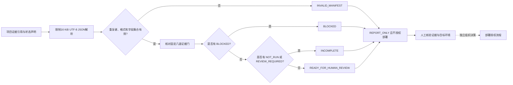

# 第10章 AI 应用综合验证：从端侧基线到云端闭环

本章围绕人工智能（Artificial Intelligence，AI）应用建立端到端复核路径：把章节学习中的测试结果与目标环境证据放进同一份清单，再明确报告能够支持什么、不能替代什么。

## 学习目标

完成本章后，你将能够：

1. 把主机回归、板载 AI Brick、本地 LLM、云端 API、Bridge/MCU 与工具安全组织为互不替代、可追溯的证据路径。
2. 区分“提交者声称通过”“等待人工复核”“未执行”和“已阻断”，避免把缺失证据默认为通过。
3. 使用离线证据清单检查器验证清单结构，并解释它为什么不能独立验证清单背后的模型、数据或设备事实。
4. 为 Arduino UNO Q 应用划分 Linux 侧、微控制器侧和应用级验收责任。
5. 说明综合报告、技术评审、目标板验收和部署授权是不同的决策阶段。

## 背景与边界

### 从单项测试转向端到端证据链

前九章分别讨论任务与推理、数据集评估、模型工件、数值回归、性能、量化、UNO Q 板载 AI Brick、本地 LLM、DeepSeek 公共 API，以及工具调用安全。单项测试通过只能说明该测试覆盖的行为满足其断言；它不会自动证明数据来源可信、部署工件就是被测模型、性能测量代表目标负载，或模型建议能够安全触发设备动作。

综合验证的工作不是把多份“通过”文字相加，而是先明确系统目标、目标环境与风险，再把每个关键主张绑定到可检查的证据引用，标出尚未测量、等待复核或失败的环节。引用标签只用于追踪，不等于文件已存在、签名有效或内容真实；验收人仍需取得并核对原始证据。

### 证据门是项目清单，不是统一标准

本章把证据链整理为八道项目级检查门：

| 检查门 | 对应学习内容 | 评审时应核对的证据例子 |
| --- | --- | --- |
| `task_definition` | [第1章：AI 开发基础](./第1章_AI开发基础_从任务定义到可验证推理.md) | 任务边界、输入/输出契约、拒绝和弃判条件 |
| `dataset_evaluation` | [第2章：数据集与离线评估](./第2章_数据集与离线评估_从分组切分到混淆矩阵.md) | 数据版本、分组隔离、标签来源、测试集指标与分母 |
| `model_artifact` | [第3章：模型工件与部署契约](./第3章_模型工件与部署契约_从清单到目标预检.md) | 工件摘要、格式、输入/输出契约和目标运行时声明 |
| `inference_regression` | [第4章：推理回归与数值一致性](./第4章_推理回归与数值一致性_从黄金样例到目标验收.md) | 固定样例、容差、类别变化和弃判差异 |
| `performance_budget` | [第5章：端侧推理性能评估](./第5章_端侧推理性能评估_从测量方案到资源预算.md) | 工作负载、预热口径、延迟分位数和资源观测 |
| `quantization_evaluation` | [第6章：模型量化与校准验证](./第6章_模型量化与校准验证_从校准数据到资源精度权衡.md) | 校准数据隔离、任务质量对照和目标资源测量 |
| `tool_call_safety` | [第9章：生成式 AI 与工具调用安全边界](./第9章_生成式AI与工具调用安全边界_从模型建议到受控执行.md) | 工具白名单、参数约束、独立批准、重放和下游策略 |
| `target_acceptance` | 多章共同提供目标环境证据 | 精确板卡/镜像/依赖版本、实机运行、故障路径和硬件安全检查 |

这张表是本书为教学和项目复核提出的**综合清单**，不是任何外部机构发布的验收标准。美国国家标准与技术研究院（National Institute of Standards and Technology，NIST）的人工智能风险管理框架（AI Risk Management Framework，AI RMF）生成式 AI 档案说明其用途是帮助组织在 AI 生命周期中治理、映射、测量和管理风险，并明确供自愿使用；其中关注治理、内容来源、部署前测试和事件披露。本章借鉴其生命周期视角组织材料，但八道门、字段和结论状态均为本书设计，不代表符合性认证或法规判断。[来源登记](../../resources/references.md#part7-ch10-references)

### 映射到 Arduino UNO Q

Arduino UNO Q 的官方资料描述了运行 Debian Linux 的 QRB2210 微处理器（Microprocessor Unit，MPU）和运行 Zephyr 的 STM32U585 微控制器（Microcontroller Unit，MCU）；Arduino App Lab 可组合 Python 应用、Arduino sketch 与 AI 模型，Bridge 提供 Linux 与 MCU 间的远程过程调用（Remote Procedure Call，RPC）。官方应用规范也将 Python/Brick/容器与 MCU 侧 sketch 的职责分开，并描述两侧的 RPC 消息通信。这些资料说明平台构成和软件边界，不证明任意模型、Brick、清单检查器或工具调用服务已在具体镜像上兼容或通过安全验收。[来源登记](../../resources/references.md#part7-ch10-references)

因此，`target_acceptance` 不能只由开发机上的单元测试代替。项目需要记录精确板卡与镜像、App/Brick 依赖、设备和外设配置、目标侧输入输出、掉线/超时处置、MCU 侧保护以及独立复核人。若设备或执行器不在本次范围内，应明确标为未验证，而不是用“理论兼容”填补证据空缺。

### UNO Q AI 路径的分项证据矩阵

综合清单中的 `target_acceptance` 是一个粗粒度汇总门，不能把下表各路径合并成一个模糊的“AI 已通过”。实际项目应为每项保留独立记录（对象版本、输入、操作、结果、时间、复核者和原始证据位置）；下表建议的维度**不由本章八门示例程序逐项解析或验证**。任何一项 `NOT_RUN` 都不得被另一条路径的成功替代。

| 证据维度 | 必须单独记录的对象与结果 | 当前教程状态与不可推断事项 |
| --- | --- | --- |
| 主机离线回归 | 代码提交、Python 版本、测试命令/结果、固定样例与 mock 边界 | 本机测试只证明被测断言；不证明目标板、Brick、模型、网络或云 API。 |
| UNO Q 板载 AI Brick | ABX SKU、系统镜像、App Lab/Brick 版本、模型/资产标识、输入与输出、冷/热启动时延、CPU/RSS | 对象检测实验尚未在用户板卡运行（`NOT_RUN`）；官方示例代码不是本书目标板实测。 |
| 板载本地 LLM | Genie/llama.cpp runner 及版本、模型 ID/量化、模型文件摘要、上下文设置、离线/网络条件、输出和资源测量 | runner、模型与 SKU 兼容性均依设备版本核对（`NOT_RUN`）；对象检测 Brick 成功也不证明本地 LLM 可用。 |
| DeepSeek 公共 API | 用户批准的数据范围、目标模型 ID、请求时间/状态、延时、脱敏用量/费用信息及错误类别 | 实际请求和可能费用尚未发生（`NOT_RUN`）；它将数据经网络发送到第三方，不是板载推理。 |
| 图像/相机输入 | 分清上传文件与现场相机；记录文件摘要或相机/驱动/分辨率/权限、样本、标注和检测结果 | 文件上传演示不证明相机链路已验证；本书没有用户现场图像或相机实测（`NOT_RUN`）。 |
| Bridge/MCU 通信 | Bridge/固件/Sketch 版本、RPC 方法与载荷、超时/掉线/重连行为、两侧日志和状态对账 | 本书第7/8章不发起 Bridge/RPC；通信和恢复均为 `NOT_RUN`，云响应不代表 MCU 收到命令。 |
| 安全动作验证 | 可信主体、独立批准绑定、工具白名单、参数/状态门、幂等与重放、MCU 侧互锁及受控台架结果 | 第9章仅为进程内策略模拟，没有真实身份、Bridge、执行器或物理联锁验证（`NOT_RUN`）。 |

以上维度回答的是“哪条路径、哪个版本、用什么输入、产生了什么证据”。只有项目明确范围内的各项检查都独立通过、原始证据经授权人员复核后，才能讨论对应范围的验收；这张矩阵和下方报告脚本本身都不构成部署授权。

## 操作与实验

### 状态标签与汇总结论

清单只接受下面四种状态。`CLAIMED_PASS` 特意保留 “CLAIMED”，因为本程序不能判断提交的引用是否真实，也不能替评审人核验其内容。

| 输入状态 | 含义 | 综合结论影响 |
| --- | --- | --- |
| `CLAIMED_PASS` | 提交者声明该门有证据支持 | 只有所有门都为此状态时，报告才标为 `READY_FOR_HUMAN_REVIEW`；仍不授权部署 |
| `BLOCKED` | 已发现未解决的失败或风险 | 综合结论为 `BLOCKED` |
| `NOT_RUN` | 尚未执行，且没有证据引用 | 综合结论为 `INCOMPLETE` |
| `REVIEW_REQUIRED` | 有材料，但需要指定人员判断 | 综合结论为 `INCOMPLETE` |

优先级是：清单结构无效则 `INVALID_MANIFEST`；结构有效且至少一个门为 `BLOCKED`，则 `BLOCKED`；否则只要存在 `NOT_RUN` 或 `REVIEW_REQUIRED`，则为 `INCOMPLETE`；只有八门全部为 `CLAIMED_PASS` 时，才得到 `READY_FOR_HUMAN_REVIEW`。这最后一个状态只表示“可交给人审”，并不等于评审通过。

### 离线证据清单检查器

合成的 JavaScript Object Notation（JSON，JavaScript 对象表示法）输入位于 `evidence_manifest.json`。它为七个基础证据门填入带有 `EV-` 前缀的教学引用编号，并把粗粒度目标验收门明确设为 `NOT_RUN`。这些编号是虚构标签，不指向仓库中的真实模型、数据集、日志、UNO Q 板卡或审批记录；板载 Brick、本地 LLM、DeepSeek、相机、Bridge/MCU 和安全动作的分项状态不会被该八门示例自动展开或核验，须参考本章分项矩阵单独记录。

清单顶层必须恰好包含 `schema_version`、`report_id` 和 `gates`。`gates` 必须恰好包含上表列出的八个键，每条记录只允许 `status` 和 `reference` 两个字段。对 `NOT_RUN`，`reference` 必须为 JSON `null`；其余状态需要短格式引用字符串。额外字段、未知门、未知状态和非法引用均会被拒绝。

解析入口先限制 UTF-8 JSON 原始字节不超过 16 KiB，并拒绝重复键与非标准的 `NaN`/`Infinity` 常量。这些限制用于让小型教学输入边界明确；它们不是完整的 Web API 解析器、认证机制、数字签名或持久审计系统。报告始终固定 `scope=REPORT_ONLY`、`evidence_independently_verified=false` 和 `deployment_authorized=false`。

代码说明
- 用途：检查固定证据清单结构、汇总各门状态并输出禁止授权部署的报告。
- 运行环境：Python 3.10 或更新版本；本次验证环境为 Python 3.14.6。
- 文件位置：[验收器](../../code/第7篇_AI/第10章_AI应用综合验证/readiness_gate.py)、[合成清单](../../code/第7篇_AI/第10章_AI应用综合验证/evidence_manifest.json)、[测试](../../code/第7篇_AI/第10章_AI应用综合验证/test_readiness_gate.py)、[目录说明](../../code/第7篇_AI/第10章_AI应用综合验证/README.md)。
- 依赖：仅 Python 标准库。
- 操作步骤：在上述代码目录运行验收器；再运行同目录的行为测试。命令行界面（Command-Line Interface，CLI）读取固定样例并输出单行 JSON。
- 预期输出：CLI 以单行 JSON 输出 `INCOMPLETE`；其中七门是提交者声明通过，一门目标验收未执行，`deployment_authorized` 为 `false`。
- 故障排查：重复键或超过 16 KiB 的输入由解析层拒绝；门集合或字段不匹配时返回 `INVALID_MANIFEST`；不得删掉未通过门来绕过失败，应修复证据并保留评审轨迹。
- 验证方式：运行 14 项 `unittest`，核对 CLI JSON 的决策、计数、报告范围和固定否定部署授权。

```shell
python -B readiness_gate.py
python -B -m unittest -v test_readiness_gate.py
```

CLI 输出归纳如下（原始程序输出为 JSON）：

| 字段 | 本例结果 | 解释 |
| --- | --- | --- |
| `decision` | `INCOMPLETE` | `target_acceptance` 尚未执行 |
| `claimed_pass` | `7` | 七个已提交的状态声明，不是七项独立核验 |
| `not_run` | `1` | 目标验收没有执行 |
| `scope` | `REPORT_ONLY` | 仅形成汇总报告 |
| `deployment_authorized` | `false` | 固定不授权部署 |

### 从报告到项目验收

把检查器用于真实项目之前，应由负责团队而不是模型或清单脚本完成以下工作：

1. **固定被测对象**：记录代码提交、模型摘要、数据版本、配置和目标环境标识，防止把不同对象的证据拼成一份报告。
2. **规定证据内容**：为每个门写明产出物、来源、时间、测量方法、适用范围、保留位置和复核人。短 `reference` 只是定位提示，不能替代内容摘要、访问控制或签名验证。
3. **执行适用的测试**：按风险决定离线质量检查、目标性能测量、兼容性验证、工具安全测试和硬件联锁验证；不能把本章虚构数据外推为实际结果。
4. **处理冲突和缺失**：保留原始失败及后续处置关系。不能通过删除 `BLOCKED` 门、重命名证据或把未知状态改成 `CLAIMED_PASS` 来抬高汇总结论。
5. **分别决策**：技术报告、人工风险复核、目标环境验收和上线授权由对应责任人分阶段处理。任何自动化清单工具都不应替代组织明确的批准流程。

本例通过真实程序和本地合成清单验证解析与聚合行为，但输入中的状态和值都不是外部事实。即便测试显示八门全部为 `CLAIMED_PASS`，代码仍只输出 `READY_FOR_HUMAN_REVIEW`，并保留 `deployment_authorized=false`；测试通过也只证明本机模拟规则按断言工作。

### Fig-52：从章节证据到人工验收

图中清单解析、汇总决策和人工复核是不同阶段。所有成功路径最终仍停留在报告层；目标板/现场验收和部署批准不由本章脚本触发。

<a id="fig-52-uno-q-ai-readiness-evidence-gate"></a>

> 图示占位：图号=Fig-52；位置=本段之后；内容=八类项目证据经受限清单解析与状态汇总，进入报告和人工复核；来源=第七篇图示资源登记中的 Fig-52 Mermaid（本书原创）。



图源：[Fig-52 Mermaid 源文件](../../diagrams/uno-q-ai-readiness-evidence-gate.mmd)。虚线只表示组织可能另有独立授权流程，不表示本章程序实现或触发了该流程。该图为本书原创，不是 NIST、Arduino 或任何工具供应商的官方验收模型；SVG 尚未渲染和目视审阅。

## 验证结果与范围

配套的 14 项标准库测试覆盖：完整声明只进入人工复核、目标门未执行、阻断优先级、人工复核门、缺失/未知证据门、未知状态、引用格式、非对象输入、重复 JSON 键、16 KiB 上限、畸形 JSON/UTF-8，以及 CLI 固定清单输出。本次全书回归在本机 Python 3.14.6 环境通过：384 项测试和 306 个子测试全部通过；新增契约检查覆盖活跃 Markdown 本地路径、迁移章节显式引用锚点、全书图号连续性以及 Fig-52 正文/独立源一致性。SVG 尚未渲染或目视审阅。

本章维持 `draft`。没有读取真实模型或数据集、调用生成式 AI、访问 API/网络、启动 App Lab、连接 Bridge/MCU/GPIO 或操控执行器。没有核验模型摘要、签名、数据来源、模型效果、目标镜像、外设兼容、现场时延、物理互锁、身份凭据或组织授权。`READY_FOR_HUMAN_REVIEW` 不是批准上线，测试通过不代表产品验收。

## 常见问题

### 所有门都是 `CLAIMED_PASS`，能否直接部署？

不能。该标签只表示提交者声称有证据；检查器不读取引用的内容，最终结论也只到 `READY_FOR_HUMAN_REVIEW`。本实现的 `deployment_authorized` 固定为 `false`。

### 为什么 `target_acceptance` 单列？

开发机上的模型、脚本和离线测试结果不等于指定 UNO Q 镜像、应用依赖和外设组合已通过验证。目标侧证据必须对应精确硬件/软件版本，并覆盖实际运行与失效路径。

### NIST 的 AI 风险管理框架是否要求这八道门？

不是。NIST 档案是供组织自愿采用的风险管理参考。本章八门是针对本篇学习路线的项目级教学归纳，不声称完整映射 NIST 子类，也不是法规或认证清单。

### 能否把短证据编号当作完整审计记录？

不能。编号只用于关联；生产证据包还需解决内容完整性、授权访问、保留时间、日志脱敏、签名/摘要验证、冲突处理和审计责任。本章不实现这些服务。

## 延伸阅读

- [NIST AI RMF Generative AI Profile](../../resources/references.md#part7-ch10-references)：了解自愿的生成式 AI 生命周期风险管理和部署前测试建议；本章的八门是教程级归纳。
- [Arduino UNO Q 与 App specification](../../resources/references.md#part7-ch10-references)：核对 Linux MPU、MCU、App/Sketch 和 RPC 的官方平台边界；不将产品架构介绍当作本章清单器的兼容性证明。
- [第七篇第3章](./第3章_模型工件与部署契约_从清单到目标预检.md)：模型工件身份和部署预检。
- [第七篇第4章](./第4章_推理回归与数值一致性_从黄金样例到目标验收.md)：推理数值回归证据。
- [第七篇第5章](./第5章_端侧推理性能评估_从测量方案到资源预算.md) 与 [第七篇第6章](./第6章_模型量化与校准验证_从校准数据到资源精度权衡.md)：性能与量化的目标验证边界。
- [第七篇第7章](./第9章_生成式AI与工具调用安全边界_从模型建议到受控执行.md)：工具调用、独立批准和副作用安全门。
