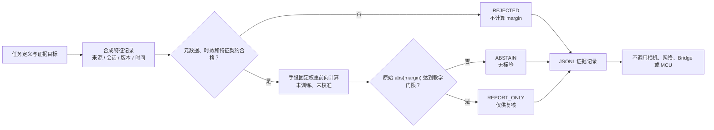

# 第1章 AI 开发基础：从任务定义到可验证推理

## 学习目标

在 Arduino UNO Q 上谈 AI，先要回答“要解决什么问题、输入从哪里来、输出能证明什么”。完成本章后，读者应能够：

1. 区分可明确编码的规则、数据训练得到的机器学习模型、在设备附近运行的边缘推理、资源受限设备上的 TinyML，以及经本地或远程服务运行的生成式模型；不因产品支持 AI 应用就推断任意模型都能在本板实时运行。
2. 为一个推理任务写出输入特征、来源/会话、特征版本、模型版本、时间、输出标签和弃判条件的契约。
3. 复算一个**人工固定权重**的线性前向计算，理解原始间隔分数、标签与真实准确率/概率之间的差别。
4. 用离线测试验证不合格输入必须在计算前拒绝，边界附近的结果必须弃判；把“仅供复核的报告”与 Bridge/MCU 执行彻底分开。
5. 列出从本章教学公式走向真实模型时需要补齐的数据集、训练/评估、模型工件、性能、权限和硬件证据。

## 背景与边界

[Arduino UNO Q 产品资料](https://docs.arduino.cc/hardware/uno-q)给出 QRB2210 Linux 侧和 STM32U585 MCU 侧的双处理器架构，并介绍 App Lab 把 Python、Sketch 与 AI 模型组织在一个应用工作流中。[Arduino App 规范](https://github.com/arduino/arduino-app-cli/blob/main/docs/app-specification.md)明确 Python/Brick/容器运行在 Linux，Sketch 运行在 MCU，两侧以 RPC 消息协作。它们说明**可以设计**边缘 AI 应用，却不证明本章程序在 UNO Q 上部署、某个模型已兼容、存在特定加速器可用，或推理结论自动具有物理控制权限。

本书[第六篇第8章](../第6篇_OpenCV/第8章_OpenCV综合验证_从合成画面到反馈审查证据包.md)已经把合成图像处理、视觉事件和离线反馈审查分成三层。本篇从其结果继续思考：如果加入模型，它应解决哪一层仅靠规则难以稳健解决的问题？比如在真实场景里，颜色阈值会受照明影响，训练过的分类器也许有帮助；但这只是**选题假设**，不能由合成绿方块的成功率推断真实泛化能力，更不能直接打开硬件反馈。

### 先选任务，再选部署位置

| 路线 | 适合考虑的任务 | 必须额外核验 |
| --- | --- | --- |
| 显式规则 | 明确边界、强可解释、少量可测输入；如来源检查或幅度限值 | 规则覆盖、单位、传感器误差与失效默认值 |
| 受监督模型推理 | 有足够代表性、可标注数据的分类/检测/回归任务 | 标签质量、训练与留出测试集、误报漏报、工件版本和部署性能 |
| Linux 侧边缘推理 | 数据留在设备附近，且目标运行时、资源和时延经过实测 | 具体镜像、模型格式、CPU/可用加速路径、内存、功耗及长时间运行 |
| MCU 侧 TinyML | 极小模型、有限内存和确定性输入输出；需要独立设计 | 目标 MCU 内存、算子、固件、实时任务与安全态；不能从 Linux 侧例子直接迁移 |
| 生成式 AI | 自然语言或多模态内容生成、辅助分析 | 模型/服务位置、数据外发、费用、非确定性、提示注入与工具权限 |

上表是本书的**设计分类**，不是官方能力清单或任一 UNO Q 固件版本的性能承诺。模型放在哪里，是资源、数据边界与失效处置的选择；是否允许动作，则是独立的授权和控制问题。无论模型运行于 Linux、MCU 或远程服务，都不能因为返回了“高分”就绕过[第六篇第7章](../第6篇_OpenCV/第7章_视觉事件与硬件反馈_从稳定候选到受控动作.md)的反馈审查门。对于远程工具调用，还应沿用[第四篇第1章](../第4篇_PythonBridge/第1章_Python_Bridge开发基础_消息模型与调用边界.md)关于请求状态和不确定结果的边界。

### 一个可复核的任务契约

在部署真实模型前，应把任务写成可被他人否证的契约，而不是只写“识别准确”。至少列出：

| 字段/证据 | 必须说清的内容 |
| --- | --- |
| 任务与标签 | 输入是什么，预测的是哪一类可观察现象；“未知/不确定”如何表示 |
| 来源与样本身份 | 数据由哪个相机或传感器产生，属于哪次运行，样本号如何关联原始记录 |
| 特征/预处理版本 | 颜色空间、归一化、裁剪、采样率、缺失值策略；训练与推理必须相容 |
| 模型工件 | 文件来源、版本与哈希、训练数据范围、许可、签名/完整性和回退版本 |
| 输出语义 | 原始分数、阈值、弃判、标签；若声称“概率”，需单独验证校准 |
| 验收指标 | 目标场景误报/漏报、不同条件分组结果、端到端时延、内存/功耗和失效路径 |
| 动作边界 | 输出能否进入人工复核；何种额外认证、MCU 门控与物理测量才允许执行 |

本章**只**演练输入/输出契约和前向计算。没有采样数据集、训练步骤、模型文件、模型哈希、标注质量、准确率或硬件性能结果。下文的 `model_id="hand-set-linear-v1"` 仅标记一条写在源码里的教学公式，不能替代上表的模型工件证据。

### 手设权重的教学计算

实验人为给出两个取值 0～1 的特征：`color_fraction` 与 `shape_score`。它们的名字让读者联想到上一篇的像素特征，但**数值完全手工合成**；脚本不读取图片，不运行 OpenCV，也没有已验证的实际特征提取器。固定前向计算为：

```text
margin = 2 × color_fraction + shape_score − 1.5
```

`margin` 是原始线性间隔，不是概率、已校准置信度或正确率。`margin ≥ 0.5` 输出 `candidate_like`，`margin ≤ −0.5` 输出 `other`；中间的 `|margin| < 0.5` 只返回 `ABSTAIN` 和空标签。0.5 是为展示弃判分支而任意选定的教学门限，不是通过验证集选择的阈值。即便 `margin` 很大，也只能给出 `REPORT_ONLY`：本书示例没有训练，不能称它“准确识别目标”。

> 图示占位：图号=Fig-43；位置=本段之后；内容=从任务契约、合成特征的来源/版本/时效检查，经手设权重计算，到拒绝、弃判和仅供复核报告的三种输出；来源=本书原创，依据本章登记的 Arduino 官方资料及原创示例。

<a id="fig-43-uno-q-ai-inference-evidence-gate"></a>

### Fig-43：教学推理契约与停止边界



图源：[Fig-43 Mermaid 源文件](../../diagrams/uno-q-ai-inference-evidence-gate.mmd)。图中 `REJECTED` 表示不计算分数，`ABSTAIN` 表示已计算但没有足够间隔给标签；两者原因不同，均不允许走向执行器。图示为教学模型，不是 Arduino 官方模型部署图；SVG 尚未渲染审阅。

## 操作与实验

### 六条合成记录

[配套脚本](../../code/第7篇_AI/第1章_AI开发基础/teaching_inference.py)固定要求 `source="synthetic"`、`run_id="ai-demo-001"`、`feature_schema="vision-features-v1"`、非空 `sample_id`，以及可比较的非负整数 `timestamp_ms` 与 `observed_at_ms`。后者不早于前者、年龄不超过 100 毫秒；示例中的“毫秒”只是**同一模拟时钟域**的教学数值，不代表相机或 Linux 真实采集时间。特征必须恰有两个字段，均为有限的 0～1 数值；布尔值、`NaN`、多余或缺失字段都应拒绝。

程序先审查元数据，再核对来源/会话、特征版本、绝对时效和特征取值；只对合格记录计算 `margin`。`model_id` 出现在所有输出里，以便审查“预期采用哪条教学公式”，但 `evaluated=false` 的记录**没有执行公式**。`sample_id` 和 `run_id` 不具备认证、签名、去重或抗重放能力；脚本不输出硬件方法、引脚或执行请求。

**代码说明**

- 用途：用手设权重演示一次前向计算、两类报告、弃判以及坏输入提前拒绝，形成可解析的本地证据。
- 运行环境：Python 3；本次在本机 Python 3.14.6 执行，目标 UNO Q Linux 镜像、App Lab 和 MCU 未验证。
- 文件位置：[teaching_inference.py](../../code/第7篇_AI/第1章_AI开发基础/teaching_inference.py)；配套[test_teaching_inference.py](../../code/第7篇_AI/第1章_AI开发基础/test_teaching_inference.py)和[运行说明](../../code/第7篇_AI/第1章_AI开发基础/README.md)。
- 依赖：仅 Python 标准库；不安装模型运行时、不下载权重、不导入 OpenCV 或 Arduino Bridge。
- 操作步骤：在配套代码目录执行下列两条命令。程序只使用内置合成数值并向标准输出打印 JSON Lines（JSONL）；它不读业务数据或模型文件、不访问相机或网络、不写设备或输出文件。遇到异常、`REJECTED` 或 `ABSTAIN` 应停在本地复核层，不转成动作。
- 预期输出：六条 JSONL；两条 `REPORT_ONLY`、一条 `ABSTAIN`、三条 `REJECTED`。下表为本次本机实测摘录，不是目标板结果或真实模型指标。
- 故障排查：若输出为空，先确认在本章代码目录且使用 Python 3；若某条被拒绝，检查来源、会话、版本、两个时间值、特征字段数量和 0～1 范围。不得通过改写样本来源或扩大时效门限把无效记录伪装成合格结果。
- 验证方式：执行 `python -m unittest -v test_teaching_inference.py`；九项测试覆盖手算分数、两类报告、弃判、来源/会话与版本不匹配、过期/未来输入、非法特征、畸形元数据、命令行 JSONL 确定性。测试不覆盖训练、模型精度或板上性能。

```text
python teaching_inference.py
python -m unittest -v test_teaching_inference.py
```

**本次本机实测摘录**

| 案例 | 手算或停止点 | 决策 | 输出语义 |
| --- | --- | --- | --- |
| `clear_candidate` | `2×0.8+0.8−1.5=0.9` | `REPORT_ONLY` | `candidate_like`；仅供复核 |
| `clear_other` | `2×0.1+0.1−1.5=−1.2` | `REPORT_ONLY` | `other`；仅供复核 |
| `borderline` | `2×0.5+0.5−1.5=0.0` | `ABSTAIN` | `insufficient_margin`；标签为空 |
| `stale` | 年龄 150 毫秒，高于教学上限 100 毫秒 | `REJECTED` | `stale_or_future_sample`；未计算分数 |
| `wrong_run` | 会话为 `old-run` | `REJECTED` | `source_or_session_mismatch`；未计算分数 |
| `invalid_feature` | `color_fraction=null` | `REJECTED` | `invalid_features`；未计算分数 |

测试另验证特征版本不匹配，以及来源错误、未来时间、布尔值、非有限数、越界值和畸形元数据。请区分两类“没有标签”：`REJECTED` 因契约不合格**未参与推理**，`ABSTAIN` 则有合法特征和已算分数，只是没有达到本章人工门限。不能把两者混成“模型认为不存在目标”。

### 从教学结果到真实模型，需要补什么

1. **任务与数据**：定义真实标签、采集场景、负例和“无法判定”样本；按设备、时间、地点等维度避免训练/测试泄漏。一个合成示例的六条记录不能计算准确率。
2. **工件与预处理**：保存可核验模型文件、权重来源、许可、特征/预处理版本、哈希和回退版本；训练端与部署端必须复算相同特征。此处的 `model_id` 无法证明文件完整性。
3. **评估与门限**：在独立留出数据上统计误报、漏报、弃判率和场景分组差异；若要把某种输出称为概率，另做概率校准与可靠性验证。不可用当前 `margin=0.9` 宣称 90% 正确率。
4. **部署与资源**：在明确的 UNO Q 板卡、镜像、运行时、模型版本及输入设备上测量端到端时延、内存、功耗和长时稳定性；不要从“Python 能运行”推论“模型能实时运行”。
5. **权限与执行**：模型报告最多进入人工复核或另设的策略门。若未来接入 Bridge，需另行验证操作者权限、可重放请求、MCU 侧限幅/安全态和独立物理观测；超时或未知结果不能盲目重试成第二次动作。

## 验证结果与范围

本章的标准库脚本在本机执行，九项单元测试通过；六条 JSONL 输出的分数和理由与上表一致。验证的只是**合成输入、写死的公式和拒绝/弃判契约**。没有训练模型、数据集、真实图像、传感器、相机、App Lab、Bridge、MCU、NPU/其他加速器或物理动作验证。本章保持 `draft`；Fig-43 Mermaid 的独立源文件已建立，SVG 尚未生成和目视审阅。

后续章节若采用真实模型，应把新工件、数据与部署基线各自形成证据，不允许把本章的九项逻辑测试延伸解释为算法准确率、吞吐量或实机安全性。

## 常见问题

### 这段代码算“AI 模型部署”吗？

不算。它展示一种固定线性公式的**前向计算形状**和外围输入/输出契约。权重为人工设定，没有数据驱动训练、模型文件、运行时适配或真实评估，所以不能声称完成机器学习模型部署。

### `margin=0.9` 能解释为“有 90% 把握”吗？

不能。`margin` 是 `2×color_fraction + shape_score − 1.5` 的结果，可以为负，也不是 0～1 范围概率。即使以后对分数做数值变换，也需要独立数据验证概率校准，不能从格式推断正确率。

### 为什么高分只输出 `REPORT_ONLY`？

因为本章没有证明特征可信、模型有效或硬件安全。高分只说明**这条公式**对**这组手填特征**产生较大正间隔，不是对真实世界的验证。[第六篇第7章](../第6篇_OpenCV/第7章_视觉事件与硬件反馈_从稳定候选到受控动作.md)的审查逻辑仍是独立边界。

### `source`、`run_id` 与 `model_id` 已经能防篡改吗？

不能。它们只是输出记录中的文本标识；本例没有签名、持久账本、密钥管理或版本不可变机制。未来若要作审计或执行依据，应使用可验证工件与具权限的运行环境，而非相信字符串本身。

### TinyML 和 Linux 侧边缘推理是否可以混用代码？

不能直接假定。两者可能使用不同的模型格式、算子、内存和执行环境；即便数学模型相同，也要分别验证预处理、数值误差、延迟和失败时的安全态。本章代码没有进行任一侧的移植测试。

## 延伸阅读

- [Arduino UNO Q 官方产品资料](https://docs.arduino.cc/hardware/uno-q)：核对双处理器与 App Lab 的产品级范围，不把宣传场景当作本章实测。
- [Arduino App specification](https://github.com/arduino/arduino-app-cli/blob/main/docs/app-specification.md)：核对 Python/Linux、Sketch/MCU、Brick 与 RPC 的职责边界。
- [Arduino Learn 的 Edge AI 入口](https://docs.arduino.cc/learn)：官方基础学习路径；具体模型与板卡适配仍需按目标版本核验。
- [第六篇综合验证](../第6篇_OpenCV/第8章_OpenCV综合验证_从合成画面到反馈审查证据包.md)与[参考资料索引](../../resources/references.md)：回看像素候选、时间门、反馈审查和来源登记。
