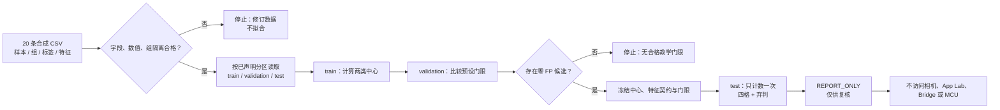

# 第2章 数据集与离线评估：从分组切分到混淆矩阵

## 学习目标

在 Arduino UNO Q 上部署模型之前，必须先弄清楚离线评估到底评价了什么。本章接续[第七篇第1章](./第1章_AI开发基础_从任务定义到可验证推理.md)的手设权重示例，改用**从合成训练样本计算出的参数**。完成本章后，读者应能：

1. 为二分类数据记录样本号、采集组、标签、特征和训练/验证/测试分区，并说明分区中“组不重叠”与“样本真正独立”并不等价。
2. 只用训练集求两类特征中心；只用验证集选弃判门限；冻结选择后才查看测试集计数。
3. 手算原始距离差分数与 `TP`、`FP`、`TN`、`FN`，把弃判样本从四格混淆矩阵中单列出来。
4. 解释覆盖率与“仅在已作决定样本上”的准确率、精确率、召回率各自的分母；当分母为零时写“未定义”，不写 100%。
5. 明确本章 20 条人工合成记录不能证明真实分类能力、UNO Q 推理速度或任何硬件反馈的安全性。

## 背景与边界

[Google 的机器学习教材](https://developers.google.com/machine-learning/crash-course/overfitting/dividing-datasets)区分训练、验证和测试：训练学习参数，验证用于开发选择，测试留作最终检查；反复根据测试结果改模型，会让测试集逐渐失去独立性。[scikit-learn 的交叉验证说明](https://scikit-learn.org/stable/modules/cross_validation.html)进一步指出，同一来源的相关样本应按组隔离，不能让同一组同时出现在训练和验证折中。这里借用这些原则设计教学实验，**不调用 scikit-learn**，也不把本章固定的三分区 CSV 冒充交叉验证。

[Arduino UNO Q 产品资料](https://docs.arduino.cc/hardware/uno-q)说明板上有 Linux 侧与 MCU 侧，并支持 App Lab 的 AI 应用工作流。这是下一阶段选择部署位置的背景，不是本章在板上运行、模型兼容或分类精度的证据。本章脚本只读取仓库内的合成 CSV，在本机输出 JSON 报告；没有图片、相机、模型下载、App Lab、Bridge、MCU 或执行器访问。

### 任务、标签与数据清单

任务沿用上章的两个教学特征 `color_fraction` 和 `shape_score`，取值均为 0～1。标签 `candidate_like` 与 `other` 只是**人工赋予合成样本的课堂真值**，并非经图像标注或现场观察得到的真实对象身份。数据源[synthetic_samples.csv](../../code/第7篇_AI/第2章_数据集与离线评估/synthetic_samples.csv)共 20 行，已人工指定分区；脚本不会随机打乱或重新切分。

| 分区 | 采集组标记 | 样本数 | 在本实验中的唯一职责 |
| --- | --- | ---: | --- |
| `train` | `train-A`、`train-B` | 8 | 估计两类中心，不能读取验证/测试标签参与拟合 |
| `validation` | `val-C` | 4 | 比较预先列出的三个弃判门限，不能修改已拟合中心 |
| `test` | `test-D`、`test-E` | 8 | 在参数与门限冻结后计数，不用于再选门限 |

`group_id` 模拟一次采集会话。组不跨分区，有助于避免同一次采集的近邻帧被拆散；但它仍只是 CSV 中的字符串，不能证明真实采集源、时间或内容。脚本检查字段集合、非空样本号/组号、样本号唯一、两个合法标签、三分区各有两类、组不跨分区、特征为有限的 0～1 数值；它**不**检查图像内容重复、标签一致性、采集偏差或跨设备泛化。[scikit-learn 的数据泄漏说明](https://scikit-learn.org/1.8/common_pitfalls.html)提醒：预处理统计量也应只从训练数据学习，再以同一变换作用于后续数据。本例特征已手填、未拟合预处理器；真实项目不能据此省去预处理版本管理。

### 从训练样本得到类别中心

为让每一步都能纸笔复算，本章选择**最近类别中心**的教学实现，不引入训练框架。对每一类，将训练集中该类两个特征分别求平均，得到中心 `C_candidate=(0.8, 0.8)` 和 `C_other=(0.2, 0.2)`。例如，正类 `color_fraction` 的四个训练值为 `0.9、0.8、0.7、0.8`，平均是 `0.8`；另一个特征与负类同理。与上一章手设权重不同，这两个中心**由训练数据算出**，但 8 条合成样本不构成可用的真实模型训练证据，也没有可部署模型工件。

令 `d²(x,C)` 为两个特征与中心的平方差之和，本章原始分数定义为：

```text
raw_score = d²(x, C_other) − d²(x, C_candidate)
d²(x, C) = (x_color − C_color)² + (x_shape − C_shape)²
```

分数为正说明样本离正类中心更近，为负说明离负类中心更近。验证样本 `va-c-01=(0.85, 0.65)` 的两个平方距离分别为 `0.625` 与 `0.025`，故 `raw_score=0.600`。这只是两个**特征空间距离**之差，不是后验概率、已校准置信度、误差率或风险等级；其数值大小还受特征尺度影响。

### 用验证集选弃判门限

对预先列出的门限 `0.00、0.12、0.36`，程序先用 Python 的 `round(score, 6)` 得到六位小数判定值，**用同一个值作门限比较并写入 JSON 的 `raw_score`**，避免显示 `0.36` 却因浮点误差被判为略小于门限。规则是 `abs(raw_score) < threshold` 时弃判，否则按分数正负报告标签；显示精度内的极近边界值可能因舍入进入同一档，这是本教学例的显式数值政策。`threshold=0` 时恰好零分会按正类报告，是本教学实现的明确约定，不代表通用分类器规则。选择策略是：在验证集上只考虑 `FP=0` 的候选，再选**已决定样本数最多**者；若仍并列，选较小门限。若三个候选都达不到 `FP=0`，脚本报错停止，而不自动放宽目标。

| 验证集门限 | 已决定/全部 | `FP` | 弃判 | 是否符合本次预设策略 |
| ---: | ---: | ---: | ---: | --- |
| `0.00` | `4/4` | 1 | 0 | 否 |
| `0.12` | `3/4` | 1 | 1 | 否 |
| `0.36` | `2/4` | 0 | 2 | 是；冻结后进入测试 |

**四条合成验证记录上的 `FP=0` 不意味着现场误报率为零。**门限选择目标本身也仅为说明训练/验证/测试职责而设；真实任务需要有代表性的独立数据、误报漏报代价和足够样本量。不可根据下文的测试集 `FP=1` 回头改 `0.36` 并仍把同一测试集当作“未见过”。

> 图示占位：图号=Fig-44；位置=本段之后；内容=从合成数据契约与采集组隔离，到仅训练集拟合、仅验证集选门限、冻结后测试计数以及停止/报告边界；来源=本书原创，依据本章登记的机器学习官方资料与原创示例。

<a id="fig-44-uno-q-ai-dataset-evaluation-gate"></a>

### Fig-44：离线评估中的数据隔离与报告边界



图源：[Fig-44 Mermaid 源文件](../../diagrams/uno-q-ai-dataset-evaluation-gate.mmd)。上方占位针对尚未交付的最终 SVG；当前 Mermaid 草图可用于阅读流程。图中“只计数一次”表示开发流程上不以测试结果继续调参；重新执行同一确定性脚本可以检查复现性，但反复试不同模型并挑选测试集上最好的一版，会破坏测试集的决策独立性。该图不是 Arduino 官方训练/部署流程；SVG 尚未渲染审阅。

## 操作与实验

### 运行本地数据审查与评估

**代码说明**

- 用途：读取 20 条合成 CSV，先审查数据契约，再求训练集中心、用验证集选门限，最后输出测试集的逐样本分数、四格计数、弃判和指标。
- 运行环境：Python 3；本次在本机 Python 3.14.6 运行。UNO Q Linux 镜像、App Lab、MCU 和真实数据均未验证。
- 文件位置：[dataset_evaluation.py](../../code/第7篇_AI/第2章_数据集与离线评估/dataset_evaluation.py)、[synthetic_samples.csv](../../code/第7篇_AI/第2章_数据集与离线评估/synthetic_samples.csv)、[test_dataset_evaluation.py](../../code/第7篇_AI/第2章_数据集与离线评估/test_dataset_evaluation.py)；另见[配套运行说明](../../code/第7篇_AI/第2章_数据集与离线评估/README.md)。
- 依赖：仅 Python 标准库和仓库内 CSV；不下载权重、不调用 scikit-learn/OpenCV，不访问网络或硬件。
- 操作步骤：进入本章代码目录，运行下列命令。脚本仅**读取**同目录 CSV 并向标准输出写 JSON，不更改源数据、设备或系统配置。若数据审查失败或验证集无合格门限，程序停止；若指标分母为零，JSON 保留 `null`（未定义）。不得用测试集修正门限后继续宣称独立验收。
- 预期输出：一个 JSON 对象；`centroids` 为 `(0.8,0.8)` 与 `(0.2,0.2)`，`chosen_threshold=0.36`，测试集 `TP=2、FP=1、TN=2、FN=1`，正/负类各弃判 1 条，`disposition=REPORT_ONLY`。
- 故障排查：如提示字段模式错误，检查 CSV 首行和是否有多余列；如提示 `group`，检查同一采集组是否分散到不同分区；如数值非法，检查空值、`NaN`、无穷大或越界特征；如没有合格门限，不要用测试集寻找新门限，应退回任务/数据/验证策略设计。
- 验证方式：运行 19 项标准库测试，覆盖组泄漏、重复样本及 CSV 表头、非法特征、只从训练集拟合、验证集选门限、六位小数边界、测试集隔离、四格/弃判计数、零分母及确定性命令行输出；再核对下面的手算表。

```text
python dataset_evaluation.py
python -m unittest -v test_dataset_evaluation.py
```

### 手算测试集与混淆矩阵

脚本输出中的测试样本如下。逐样本 JSON 同时保留 CSV 中的 `group_id`，便于回看错误来自哪个**声明的**采集组；它不认证实际来源。`raw_score` 可为负数，不能把 `0.72` 说成“72% 可信”。`prediction=null` 即弃判；这与[第七篇第1章](./第1章_AI开发基础_从任务定义到可验证推理.md)中契约错误导致的 `REJECTED` 不同，本章 CSV 先通过契约后才进入模型。

| 样本 | 教学真值 | `raw_score` | 报告或弃判 | 计数 |
| --- | --- | ---: | --- | --- |
| `te-d-01` | `candidate_like` | `0.72` | `candidate_like` | TP |
| `te-d-02` | `other` | `−0.66` | `other` | TN |
| `te-d-03` | `candidate_like` | `0.12` | 弃判 | 正类弃判 |
| `te-d-04` | `other` | `0.24` | 弃判 | 负类弃判 |
| `te-e-01` | `candidate_like` | `−0.60` | `other` | FN |
| `te-e-02` | `other` | `0.60` | `candidate_like` | FP |
| `te-e-03` | `candidate_like` | `0.72` | `candidate_like` | TP |
| `te-e-04` | `other` | `−0.84` | `other` | TN |

四格混淆矩阵**只统计 6 条作出标签的样本**：真值为正类时，报正类 2 条（TP）、报负类 1 条（FN）；真值为负类时，报正类 1 条（FP）、报负类 2 条（TN）。另外 2 条弃判不应偷填进 TN，也不应从原始数据集分母中消失。[Google 的分类指标教材](https://developers.google.com/machine-learning/crash-course/classification/accuracy-precision-recall)解释了四格、精确率与召回率的基本定义；本书在此额外显式区分弃判。

| 本章报告指标 | 算式 | 本次本机结果 | 解读限制 |
| --- | --- | ---: | --- |
| 覆盖率 `coverage` | 已决定数 / 全部数 = `6/8` | `0.75` | 只表示本门限下有多少样本拿到标签 |
| 已决定样本准确率 `accuracy_decided` | `(TP+TN)/(TP+FP+TN+FN)=4/6` | 约 `0.667` | 不包含 2 条弃判，不能写成全部样本准确率 |
| 已决定样本精确率 `precision_decided` | `TP/(TP+FP)=2/3` | 约 `0.667` | 只审视被报告为正类的样本 |
| 已决定样本召回率 `recall_decided` | `TP/(TP+FN)=2/3` | 约 `0.667` | 分母不含正类弃判；不是全部真实正类检出比例 |

如果问题改为“8 条中所有真实正类有多少被成功报为正类”，分母需加上 1 条正类弃判，得到 `2/(2+1+1)=0.5`；这不是程序输出的 `recall_decided`。当某个指标分母为零，JSON 写 `null`（未定义），不推断为零或完美。验证集在所选门限下的已决定样本准确率是 `2/2`，覆盖率却仅 `2/4`；测试集还有一条 FP、一条 FN，这正说明不能拿验证集表面“全对”充当泛化证据。

### 从课堂数据到真实边缘模型，还缺哪些证据

1. **数据来源**：采集设备、现场条件、时间、标签依据、许可和隐私边界；若有连续帧、同一对象或同一场站，分组键应反映真实依赖关系，而不只是填不同字符串。
2. **数据质量**：检查跨组重复内容、错标、缺失、类别不平衡、时段/设备/光照覆盖和难例。20 条手工设定的数值无统计代表性，也无置信区间。
3. **特征与工件**：保存可复算的预处理、特征版本、实际训练代码/参数、模型文件及完整性证据。这里 JSON 的 `model_kind` 只是描述文字，不是签名、模型哈希或部署格式。
4. **评价协议**：在开发前确定 FP/FN 与弃判的代价、目标阈值、分组规则和测试集封存方法；若基于测试集改动模型，必须用新的独立测试集重新评估。
5. **UNO Q 部署**：明确运行于 Linux 还是 MCU、可用运行时、内存/时延/功耗和失效状态，并在指定板卡/镜像实测。[第六篇第8章](../第6篇_OpenCV/第8章_OpenCV综合验证_从合成画面到反馈审查证据包.md)的视觉反馈审查仍是独立的控制边界；模型报告不自动变成动作授权。

## 验证结果与范围

本章在本机对 20 条**人工合成**记录完成一次确定性离线演练：19 项标准库测试通过，CSV 审查、中心 `(0.8,0.8)/(0.2,0.2)`、验证门限 `0.36` 和测试集 `TP=2、FP=1、TN=2、FN=1、弃判=2` 与手算一致。测试还确认更换测试集标签只改变测试集计数，不改变训练中心或验证门限。它验证的是代码的数据隔离与计数契约，**不是**模型真实识别率、概率校准、板上部署性能或安全许可。

本章保持 `draft`：尚无真实数据集、独立标注复核、可部署模型工件、UNO Q 实机运行、相机/传感器输入、App Lab/Bridge/MCU 联调和物理动作验收。Fig-44 独立 Mermaid 源已建，SVG 尚未生成并目视审阅。

## 常见问题

### 这次算不算“训练了模型”？

算一次**教学意义上的数据拟合**：两类中心由训练行求平均，测试集未参与拟合。它不是神经网络训练，没有外部模型权重、生产模型文件或真实任务的泛化证据；不能因为有“训练集”三个字就把结果用于控制。

### 为什么有了不同 `group_id`，仍不能保证没有泄漏？

CSV 字符串不能证明采集组真实独立。相同对象的重复照片可能被赋予不同组号；设备、时间、背景等隐含线索也可能跨组泄漏。脚本只检查**声明的组号**不跨分区和样本号不重复，真实项目还要核对原始内容与采集过程。

### 验证集 `FP=0`，为何测试集还有 `FP=1`？

验证集只有 4 条且人为设计，选门限时仅见到其中的局部情况。测试集另设了一条真值为 `other`、却靠近正类中心的样本；它被错报为正类，正是“验证集零误报不保证未见数据零误报”的反例。

### 能否把弃判都按负类算，提升覆盖率？

不能。弃判表示本门限下**不报告标签**；强行改成负类会改变策略，也可能把正类弃判变成漏报。需要先定义任务代价并在验证集重新选策略，再用未参与选择的新测试集检查，而非修改统计口径。

## 延伸阅读

- [Google：训练、验证和测试集划分](https://developers.google.com/machine-learning/crash-course/overfitting/dividing-datasets)：分区职责、测试集磨损与代表性。
- [scikit-learn：分组交叉验证](https://scikit-learn.org/stable/modules/cross_validation.html)：相关样本按组隔离的原则；本章并未运行其中的交叉验证器。
- [scikit-learn：数据泄漏常见问题](https://scikit-learn.org/1.8/common_pitfalls.html)：预处理与拟合不能窥视测试集。
- [Google：分类指标](https://developers.google.com/machine-learning/crash-course/classification/accuracy-precision-recall)：TP/FP/TN/FN、精确率与召回率。
- [第七篇第1章](./第1章_AI开发基础_从任务定义到可验证推理.md)与[参考资料索引](../../resources/references.md)：回看输入契约、原始分数、弃判及来源登记。
