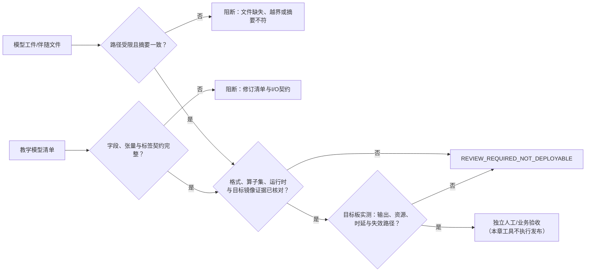

# 第3章 模型工件与部署契约：从清单到目标预检

## 学习目标

在 Arduino UNO Q 上把一个“模型”变成可复核、可部署的工件，不能只把文件复制到开发板。本章接续[第七篇第1章](./第1章_AI开发基础_从任务定义到可验证推理.md)的推理输入/输出约定，以及[第七篇第2章](./第2章_数据集与离线评估_从分组切分到混淆矩阵.md)的数据隔离和离线评价，重点从实验结果转向**模型文件、运行时和目标设备之间的部署契约**。

完成本章后，读者应能：

1. 区分模型文件、描述它的清单、离线评估证据和实际部署运行时；
2. 为模型记录格式/版本、文件摘要、输入输出张量、预处理、标签、运行时、目标软件版本和资源预算；
3. 解释“SHA-256 匹配”“元数据完整”和“目标板兼容”是不同层级的结论；
4. 在评估模型落点时分别考虑 Linux 侧应用处理器与 MCU 侧实时控制器，不把双处理器结构等同于同一模型可在两侧运行；
5. 运行离线预检器，识别它能检查什么、不能证明什么，并在证据不足时保留阻断状态。

本章结束时，配套预检器对清单字段和教学文件摘要可以给出 `PASS`，但最终部署决定仍为 `REVIEW_REQUIRED_NOT_DEPLOYABLE`。这是刻意设置的安全边界，不是实验失败。

## 背景与边界

### “模型”至少包含四类不同证据

一个可维护的模型交付，不应被简化成一个 `.onnx`、`.tflite` 或其他扩展名文件。至少要把以下对象分开记录：

| 对象 | 回答的问题 | 本章示例能否证明 |
| --- | --- | --- |
| 模型工件 | 实际交付了哪些字节？是否包含权重、图结构和所需伴随文件？ | 只核对一份教学文本文件的 SHA-256；它不是模型 |
| 模型清单 | 格式、版本、输入输出、预处理、标签、运行时和目标是什么？ | 可以审查清单结构与部分字段关系 |
| 评估证据 | 用什么数据和协议测了什么指标？测试数据是否独立？ | 仅记录第2章合成实验的引用标识，不重新评估模型 |
| 目标运行证据 | 指定模型是否在指定 UNO Q 镜像和运行时上正确、及时地执行？ | 不能；不连接开发板，也不加载任何推理框架 |

这四类证据互相引用，但不能互相替代。清单写着“格式为 ONNX”不等于文件是结构合法的 ONNX；文件摘要相同不等于其来源可信；运行时能解析图结构不等于真实输入下精度可接受；一次成功推理也不等于延迟、内存和故障路径满足项目要求。

### 格式名不是兼容性证明

[ONNX 的中间表示（IR）规范](https://onnx.ai/onnx/repo-docs/IR.html)描述计算图、数据类型、算子及其版本信息；模型还会标记所依赖的算子集。ONNX 本身不指定唯一运行时。即使两个工件都叫 ONNX，不同运行时版本、执行提供程序、算子覆盖、张量类型或量化方式也可能造成不同结果。ONNX Runtime 的[兼容性说明](https://onnxruntime.ai/docs/reference/compatibility.html)也分别列出平台、依赖库及 opset 版本关系；这些通用表格不能替代对某一块 UNO Q、某一镜像和实际二进制包的验证。

因此，部署预检至少应逐层问清：

1. **工件格式**：格式及版本是什么？模型中实际包含哪些算子、数据类型和外部数据？
2. **运行时**：运行时名称、精确版本、执行提供程序或委托、编译选项及其算子覆盖是什么？
3. **目标环境**：目标是 Linux 侧还是 MCU 侧？板卡型号/修订、系统镜像或固件、CPU 架构和可用依赖是否固定？
4. **张量契约**：输入输出名称、维数/形状、类型、动态维度、量化参数及标签顺序是否一致？
5. **数值路径**：预处理、后处理、阈值和量化/反量化是否与离线评估采用同一版本？
6. **资源与质量**：峰值内存、端到端时延分位数、功耗/温度边界，以及目标板实测输出是否满足预先定义的验收条件？

缺少其中任一关键事实，应记录“未知/待核验”，不要把它改写成“默认兼容”。

### 在 UNO Q 上选择执行侧

Arduino 的[UNO Q 产品资料](https://docs.arduino.cc/hardware/uno-q)区分 Linux 侧 QRB2210 MPU 与运行 Zephyr 的 STM32U585 MCU。[Arduino App 规范](https://github.com/arduino/arduino-app-cli/blob/main/docs/app-specification.md)进一步说明，Python、Bricks 和容器运行在 Linux 操作系统侧，Arduino Sketch 运行在集成 MCU 上，两侧通过基于 RPC 的消息协作。它们描述的是软件分工，不是对某种任意 AI 模型、某个推理后端或模型加速器可用性的承诺。

| 候选执行侧 | 常见的工程考虑 | 必须补齐的目标证据 |
| --- | --- | --- |
| Linux MPU | 适合评估依赖 Python/系统库、较复杂数据处理或需要与 Linux 服务整合的方案；这不代表某模型运行时已预装。 | 精确镜像/架构、运行时安装来源和版本、算子/执行提供程序支持、峰值内存、端到端时延与长期运行表现。 |
| STM32U585 MCU | 适合承担传感器采样和确定性控制等 MCU 职责；若计划 TinyML 推理，还需证明模型经过适当转换且目标构建链、运行时和内存能够承载。 | 固件/构建目标、运行时与算子支持、静态/峰值内存、栈与缓冲区预算、最坏执行时间和失效时的安全状态。 |

**单板双处理器不等于模型可以跨侧透明迁移。**先按任务选择执行侧，再确认该侧的格式、运行时和资源；不要从产品页上的 AI 应用描述推断任何自定义模型都能直接加载。当前 Arduino 文档中对更新产品或其他开发板的推理能力，也不能自动套用到 UNO Q。

### App Lab 的应用描述不是通用模型工件清单

Arduino App 规范把 `app.yaml` 定义为 App 的描述文件；其中 `bricks` 可列出应用依赖的 Brick，Brick 配置也可能包含 `model` 标识。规范还允许 App 带其他文件，并说明运行环境会保留这些文件供 Python 逻辑访问，但不会自动对这些文件执行操作。因此，把 `model.onnx` 放进 App 目录，或在 `app.yaml` 中写入一个模型 ID，都不等于已核对模型格式、签名、输入输出、目标运行时兼容或推理结果。

本章的 `model_manifest.json` 是**本书定义的教学清单**，不是 Arduino 官方 App 格式、Brick 描述文件或模型交换标准；它不会替代 `app.yaml`。应用导入/启动及 Brick 依赖解析仍参见[第五篇第2章](../第5篇_AppLab/第2章_AppLab运行生命周期_导入启动运行与停止.md)和[第五篇第3章](../第5篇_AppLab/第3章_AppLab启动配置与Brick依赖_从声明到可部署性检查.md)。

### SHA-256 能说明什么，不能说明什么

安全散列算法 256 位（Secure Hash Algorithm 256-bit，SHA-256）把文件字节映射为固定长度摘要。将工件重新计算得到的摘要与清单中的摘要相比较，可以发现字节变化或复制错误；本章脚本只做这一项本地字节一致性检查。

它不验证谁创建了清单、谁授权了工件、下载来源是否可信、文件是否安全、许可证是否允许使用，也不证明模型精度。若攻击者可同时替换文件与未签名清单，两个摘要仍可相互匹配。正式交付还应保留可信来源、版本/提交、许可核验、签名或受控发布证据；是否采用具体签名/制品库机制由项目治理决定，本章脚本不实现这些机制。

此外，某些 ONNX 模型可将较大的常量张量存放在独立文件中。[ONNX IR 规范](https://onnx.ai/onnx/repo-docs/IR.html#external-tensor-data)明确描述了外部张量数据。正式工件因此可能是多文件集合；若只计算主 `.onnx` 文件的摘要，会遗漏伴随数据、插件或自定义算子依赖。本章的单文件教学脚本不适用于这类工件，必须扩展清单并逐项验证，不能因检查器显示 `PASS` 就认为整个模型包完整。

### 本章检查器的能力边界

| 检查层 | 本章脚本 | 后续目标验证 |
| --- | --- | --- |
| JSON 可解析、必需字段/类型/张量形状存在 | 检查 | 另需审查字段语义和来源 |
| 模型格式与清单中运行时格式声明一致 | 检查字符串一致性 | 不检查二进制内真实格式，也不检查运行时实际支持 |
| 清单目录内单个文件存在、SHA-256 匹配 | 检查 | 多文件工件和可信来源仍须另行处理 |
| 数据预处理和标签声明完整 | 只检查部分结构 | 要用固定输入样例验证端到端数值语义 |
| 算子、设备执行后端和系统库兼容 | 不检查 | 使用确切目标镜像与模型做运行时加载/执行验证 |
| 识别精度、P95 时延、内存、热/功耗 | 不检查 | 定义测量条件、重复次数和验收门限后在目标上实测 |
| 物理反馈安全、业务授权或发布批准 | 不检查 | 走独立的系统安全与业务验收；不由模型清单自动触发 |

脚本的 `REVIEW_REQUIRED_NOT_DEPLOYABLE` 是刻意的终态标签：清单字段完整、摘要匹配，只说明这两项检查通过；检查器没有“自动转成可发布”的分支。

> 图示占位：图号=Fig-45；位置=本段之后；内容=模型/清单与文件摘要审查、运行时和目标证据核验、阻断路径及独立人工验收之间的关系；来源=本书原创，依据本章登记的 Arduino 与 ONNX 官方资料。

<a id="fig-45-uno-q-ai-model-deployment-contract"></a>

### Fig-45：模型工件到目标部署的证据门



图源：[Fig-45 Mermaid 源文件](../../diagrams/uno-q-ai-model-deployment-contract.mmd)。图中前两个检查对应本章脚本可以做的结构与摘要核对；目标运行时和实机验收是后续独立证据。本图是本书原创教学流程，不是 Arduino 官方部署规范、安全认证或自动发布流水线；SVG 尚未生成并进行视觉审阅。

## 操作与实验

### 阅读教学清单并运行本地预检

**清单字段说明**

| 字段组 | 必须记录的内容 | 为什么需要 |
| --- | --- | --- |
| `model` | 名称、模型版本、工件格式、工件相对路径、SHA-256 和许可标识 | 区分模型身份与复制完整性；许可标识必须回到实际来源核对。 |
| `target` | 板卡、候选执行侧、系统镜像或固件版本 | “Linux”或“MCU”过于宽泛，更新版本后也应重新评估。 |
| `runtime` | 运行时及版本、工件格式、执行提供程序、算子集版本 | 名称相同不等于库版本、算子集合或硬件后端相同。 |
| `io_contract` | 输入/输出名称、数据类型、形状、类别标签及顺序 | 避免 RGB/BGR、NHWC/NCHW、量化尺度或标签次序错配。 |
| `preprocessing` | 有版本的预处理步骤 | 训练、验证、转换和部署应共享同一可复现变换。 |
| `evaluation` | 数据集/协议/报告标识 | 回链到第2章的独立评估记录；该 ID 本身不是评估真实性证明。 |
| `resource_budget` | 峰值内存、P95 时延等有单位的目标预算 | 未知值应保留为 `null` 并阻断结论，不能默认为无限资源。 |

清单中输入 `shape` 的 `"batch"` 表示动态批次维度，非负整数表示本教学契约中的固定维度，空数组 `[]` 表示标量。ONNX 将张量形状定义为维度序列，标量形状可以为空，维度值也允许为 0；本章预检器因此只校验维度描述的基本结构，不把它误判为运行时可执行证明。实际运行时对动态维度、零长度维、非连续布局和数据类型的支持仍要按具体格式/运行时核验。对于分类输出，标签数组的顺序必须对应模型输出索引；本例仅有一个输出，预检器会检查固定的最后一维长度与标签数量一致。

示例清单把候选目标写为 `Arduino UNO Q` 的 `linux_mpu`，但 `software_release`、运行时和资源预算都未固定。`teaching-artifact.txt` 是普通提示文字，并非模型文件；其 SHA-256 是：

```text
f487288a7b526f960a17827de918a27814a84d8666c9d34965e601323e96423d
```

该示例刻意同时包含“可核对的摘要”与“不可部署的工件/目标声明”，借此说明完整性和兼容性不是同一件事。[完整教学清单](../../code/第7篇_AI/第3章_模型工件与部署契约/model_manifest.json)另有逐字段内容；它不是有效 ONNX 文件，也不是 `app.yaml`。

**代码说明**

- 用途：校验教学清单的必需字段和张量描述，检查单个相对工件路径未逃出清单目录，再比较该文件的 SHA-256；输出明确的复核阻断项。
- 运行环境：Python 3 标准库；本次本机版本为 Python 3.14.6。目标 UNO Q 的 Python 版本和依赖未验证。
- 文件位置：[预检器](../../code/第7篇_AI/第3章_模型工件与部署契约/model_preflight.py)、[教学清单](../../code/第7篇_AI/第3章_模型工件与部署契约/model_manifest.json)、[教学文本工件](../../code/第7篇_AI/第3章_模型工件与部署契约/teaching-artifact.txt)、[配套说明](../../code/第7篇_AI/第3章_模型工件与部署契约/README.md)。
- 依赖：仅 Python 标准库与上述仓库内文本/JSON文件；不需要 ONNX、TensorFlow、模型权重或网络。
- 操作步骤：进入本章代码目录执行以下命令。脚本仅读取清单及其目录内单文件，向标准输出写 JSON；不会执行清单中的模型、调用外部程序、下载、安装、刷写或更改配置。
- 预期输出：`manifest_schema` 与 `artifact_sha256` 均为 `PASS`，决策为 `REVIEW_REQUIRED_NOT_DEPLOYABLE`，并列出教学工件、运行时、目标镜像、资源预算、目标执行、许可/来源、评估和部署验收等未完成项。退出码 `0` 表示检查报告生成成功，而不是部署获准。
- 故障排查：`ARTIFACT_SHA256_MISMATCH` 时先查文件是否改变，再重算受控版本摘要；`ARTIFACT_PATH_OUTSIDE_MANIFEST_DIR` 时把经批准的工件放入清单目录或设计明确的工件包；`MODEL_RUNTIME_FORMAT_MISMATCH` 时不能只改清单来消除问题，需核实实际转换输出；张量或标签错误应回到模型导出信息与预处理契约；任何 `REVIEW_REQUIRED_NOT_DEPLOYABLE` 都应继续补充目标证据，不能当作运行失败或成功发布。
- 验证方式：运行 10 项标准库行为测试，检查通过摘要仍不可部署、清单路径穿越被阻断、哈希不匹配阻断、模型/运行时格式不一致阻断、固定输出维度与标签数量不一致阻断、缺失张量形状阻断、标量/零长度维可作为元数据描述，以及畸形 JSON 可读地阻断。

```shell
python model_preflight.py --manifest model_manifest.json
python -m unittest -v test_model_preflight.py
```

第一条命令本机示例摘要如下（字段顺序可能随输出格式调整）：

```json
{
  "checks": {
    "artifact_sha256": "PASS",
    "manifest_schema": "PASS"
  },
  "decision": "REVIEW_REQUIRED_NOT_DEPLOYABLE",
  "errors": []
}
```

完整报告仍包含阻断项。脚本把结构/摘要错误用退出码 `1` 标为 `BLOCKED`；有效教学清单以退出码 `0` 返回复核报告。调用方必须读取 `decision`，不能只依据进程退出码推断“可以部署”。

### 从预检清单到正式部署证据

对真实工件，以下顺序比“先复制文件再试运行”更容易定位问题：

1. **固定来源**：记录训练/导出代码版本、来源 URL 或制品库位置、许可证、模型版本和批准人；把签名、哈希和传递链分开说明。
2. **盘点完整工件集合**：主模型、外部张量、分词器/标签表、插件和自定义算子分别列出版本与摘要；明确哪些可执行、哪些只供解析。
3. **冻结契约**：写清输入输出名、类型、形状/动态轴、布局、颜色顺序、归一化、量化尺度/零点、标签顺序、阈值和后处理版本。
4. **锁定目标栈**：记录 UNO Q 硬件侧、系统/固件镜像、运行时版本、执行提供程序和依赖版本；逐项核对目标运行时的算子与数据类型支持。
5. **做数值回归**：建立固定输入向量/图像样例，把训练框架、转换后模型和目标运行时输出并排比较。浮点或量化转换应定义容差、阈值敏感性和分类结果变化的处理规则，不能只看“能加载”。
6. **量资源与时延**：区分模型文件大小、运行时常驻内存、峰值工作内存和输入缓冲；测量预处理至后处理的端到端延迟，并说明预热、输入尺寸、并发、温度和重复次数。
7. **独立验收**：确认数据代表性、离线指标、失效输出、审查责任和业务授权。若模型结果接到执行器，应经过独立控制边界与人工/系统安全验证；不要让模型加载脚本直接触发物理动作。

第2章的合成数据评估只能作为教学性的评估协议引用，不能为真实模型填充生产指标。目标板上的一次成功输出、某个通用运行时的兼容表或 App Lab 中出现了 AI Brick，也都不能替代这条证据链。

## 验证结果与范围

本章脚本在本机 Python 3.14.6 完成 10 项标准库测试；测试实际启动命令行程序，覆盖正常教学报告、摘要错误、目录越界、格式冲突、张量/标签不一致、缺字段、标量与零长度维声明和畸形 JSON。教学清单实测得到 `manifest_schema=PASS`、`artifact_sha256=PASS`、`errors=[]`，但决策仍为 `REVIEW_REQUIRED_NOT_DEPLOYABLE`。

这只验证本机清单预检代码和配套示例，不证明清单完整表达了任意模型格式，不验证任何模型文件结构/精度、Arduino App Lab 或 Brick 的自动加载行为、ONNX Runtime 的 UNO Q 支持、MCU TinyML 工具链、目标镜像兼容、时延/内存或执行器安全。本章保持 `draft`；Fig-45 Mermaid 源已登记，SVG 尚未渲染并预览。`mmdc` 当前未安装，因此没有将 Mermaid 图标记为视觉审阅完成。

## 常见问题

### 摘要匹配了，为什么还不能部署？

摘要只对比清单声明的摘要与当前文件字节。它不会自动检查文件格式，也不能证明摘要由可信发布者签署，更不能验证算子/运行时/设备支持。本章的教学文件甚至不是模型；摘要仍然能正确匹配。这是完整性检查成功但部署资格不成立的直接反例。

### 清单中的 `format` 和运行时格式写成一样，就代表兼容吗？

不代表。脚本只检查两个声明字符串一致，避免明显自相矛盾；它既不解析模型二进制，也没有本地运行时能力清单，更没有在指定目标板上执行推理。实际兼容性还受模型版本、算子、类型、设备后端、系统库和转换方式影响。

### 为什么本章不直接安装 ONNX Runtime 并加载模型？

本仓库没有经许可核验、可复现且针对 UNO Q 目标镜像确认过的真实模型工件和运行时组合。本机安装成功也不能证明开发板上的 Linux 架构、镜像、依赖和执行提供程序相同。当前先把清单与审查边界建立起来；真实目标实验应在工件、来源、软件版本和验收条件固定后单独进行。

### App Lab 已有 AI Brick，是否可以跳过清单？

不可以。Brick 能提供预封装功能，但应用仍要核对所选 Brick、模型标识、设备依赖、输入语义、版本和目标运行效果。App 的导入/启动契约和模型的数值/运行时契约互相关联，却不是同一个契约；本章不评估或替代 Brick 的具体能力。

## 延伸阅读

- [Arduino UNO Q 产品页](https://docs.arduino.cc/hardware/uno-q)：核对 Linux MPU 与 MCU 的产品侧分工；不作为本章实际模型兼容或性能证明。
- [Arduino App specification](https://github.com/arduino/arduino-app-cli/blob/main/docs/app-specification.md)：了解 App 文件结构、`app.yaml`、Brick 与 Python/Sketch 的职责边界；本章教学清单不是其组成部分。
- [ONNX IR Specification](https://onnx.ai/onnx/repo-docs/IR.html)：了解图、数据类型、算子集版本和外部张量数据等格式层信息。
- [ONNX Runtime compatibility](https://onnxruntime.ai/docs/reference/compatibility.html)：查看指定运行时版本的通用平台、依赖和 opset 兼容信息；目标 UNO Q 仍须实测。
- [第七篇第1章](./第1章_AI开发基础_从任务定义到可验证推理.md)、[第七篇第2章](./第2章_数据集与离线评估_从分组切分到混淆矩阵.md)与[参考资料索引](../../resources/references.md)：回看输入/输出、数据评估与本章来源登记。
- [第五篇第3章](../第5篇_AppLab/第3章_AppLab启动配置与Brick依赖_从声明到可部署性检查.md)：回看 App/Brick 声明与依赖预检，两者不等于模型格式和目标推理验收。
