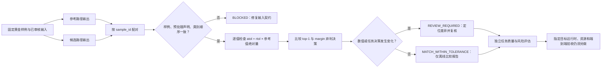

# 第4章 推理回归与数值一致性：从黄金样例到目标验收

## 学习目标

完成本章后，你将能够：

1. 区分模型输出“与参考实现接近”与模型“对真实任务正确”这两种不同结论。
2. 为固定样例建立可配对的参考输出和候选输出记录。
3. 用绝对/相对容差检查数值差异，同时单独检查 top-1 类别和弃判门变化。
4. 解释 `MATCH_WITHIN_TOLERANCE` 为什么不是 UNO Q 部署验收结论。

## 背景与边界

### 回归比较回答的是“变了多少”，不是“答案是否正确”

模型从训练框架导出、转换为其他表示、进行图优化或量化后，候选实现可能与参考实现产生数值差异。ONNX Runtime 的官方导出教程就把框架输出与运行时输出作比较，并用 `assert_allclose` 设置相对和绝对容差；该教程中的容差只服务于它的示例，不是所有模型的通用门槛。[参考资料索引中的 ONNX Runtime 导出教程](../../resources/references.md#第七篇第4章补充核验)

这种比较是**回归检查**：它检查同一批输入在两条实现路径上的输出差异。它不自动验证参考输出正确，也不代替独立标注测试集上的准确率、误报率、漏报率、覆盖率或风险评审。若参考模型本身就错，两边高度一致仍然只是“错得相似”。第2章的独立测试集仍承担任务质量评估职责。

在部署研究中，建议把证据分成四层：

| 层次 | 比较对象 | 能发现的问题 | 单独不能证明什么 |
| --- | --- | --- | --- |
| 输入身份 | 样例 ID、预处理版本、张量形状/类型 | 配错样例、标签顺序或声明版本不一致 | 预处理代码实际执行正确 |
| 数值输出 | 参考与候选的逐元素分数/张量 | 转换、量化或运行时导致的数值偏移 | 任务指标仍达标 |
| 任务决策 | 类别、拒判/阈值分支、后处理结果 | 小数值变化触发决策翻转 | 现场分布、业务损失可接受 |
| 目标验收 | 指定开发板、镜像、运行时、负载与流程 | 目标兼容、资源和端到端行为 | 未测场景或未授权动作安全 |

本章实验停在前三层的离线记录比较；不会运行模型，也不会访问 Arduino UNO Q。

### 黄金样例必须先固定，而且参考路径需要有来历

“黄金样例”不是随意挑出的几条容易样本，而是一组版本固定、输入可复现、覆盖任务边界的回归输入。建议覆盖常见类别、容易混淆样例、阈值附近样例、缺失/异常输入，以及产品明确支持的输入范围。每条记录应能关联到相同的逻辑样例；若比较两条预处理路径，还要记录输入张量如何产生。

参考输出可以来自已验收的模型版本、经审核的参考实现或独立计算路径。应记录其来源、模型/导出版本、运行时和执行提供程序；若参考侧未经质量验证，它只是比较基线，不是“正确答案”。候选与参考的样例集合应一一对应，不应通过删除失败样例来制造全绿报告。

当前代码示例只接收 `sample_id`、声明的 `preprocess_id`、有序类别名和分数向量。两个标识相同只能表明数据提交者声明它们相同；脚本看不到原始图像或实际张量字节，因此不能证明两边真正吃进了同一输入。

### 逐值误差和决策变化需要分开看

对参考值 (r_i) 和候选值 (c_i)，本章采用如下逐值规则：

```text
误差 e_i = |c_i - r_i|
允许误差 t_i = atol + rtol × |r_i|
该值通过 ⇔ e_i ≤ t_i
```

`atol` 是绝对容差，负责接近零的值；`rtol` 是相对容差，容许误差随参考值量级变化。比较必须逐元素进行，不能只看平均误差：少数高风险输出的偏差可能被大量正常值掩盖。实际门槛应根据模型输出尺度、数值精度、任务风险和独立验证数据确定。不要直接照抄某篇示例中的容差，也不要在测试集上反复调门槛。

分类任务还要看数值偏移是否改变实际决策。代码以分数最高的类别作为 top-1，并计算 top-1 与次高分之间的 `margin`：

```text
margin = 最高分 - 次高分
若 margin ≤ min_margin，则输出 ABSTAIN；否则输出最高分类别。
```

这里的 `margin` 只是两个原始分数的间隔，不是概率、置信度或校准保证。分数并列时，即使 `min_margin=0` 也弃判；JSON 报告用 `null` 表示该项 `ABSTAIN`。`min_margin` 是本书为了演示边界而定义的策略，不是 Arduino 或 ONNX Runtime 的官方规范；真实阈值应在验证集上预先确定。量化等变换可能影响精度，因此数值对齐与任务指标回归都要保留；ONNX Runtime 文档也明确提示量化并非无损，并介绍了对齐中间张量以定位差异的调试办法。[参考资料索引中的量化文档](../../resources/references.md#第七篇第4章补充核验)

### 执行路径本身也是比较条件

即使文件格式相同，输出仍可能受到算子实现、运行时版本、执行提供程序、设备及输入/输出放置方式影响。ONNX Runtime 的 API 文档说明，推理会由执行提供程序承载，并根据配置的顺序选择可用 kernel；因此实际验收记录必须写明目标运行时和执行提供程序，不能把开发机 CPU 的比较结果外推为开发板结果。[参考资料索引中的 ONNX Runtime Python API](../../resources/references.md#第七篇第4章补充核验)

第3章的模型工件清单回答“拿的是什么、声明了什么、目标预检还缺什么”；本章比较参考和候选运行输出。二者衔接，但都不意味着已在指定目标上完成安装、推理、资源测量或业务验收。

### Fig-46：从固定样例到离线回归报告

本图描述本章教学工具的输入配对、结构阻断、逐值容差、任务决策检查和报告边界。它不是官方部署流水线或安全认证流程。

<a id="fig-46-uno-q-ai-inference-regression"></a>

> 图示占位：图号=Fig-46；位置=本段之后；内容=展示固定参考与候选输出如何按样例配对、如何依次检查结构/预处理声明、逐值数值容差和分类/弃判变化，并将报告明确停在离线复核而不是目标部署验收；来源=第七篇图示资源登记中的 Fig-46 Mermaid（本书原创）。



## 操作与实验

### 阅读配对记录并运行离线比较器

本例给参考路径和候选路径各四条合成分数记录，故意把候选记录顺序打乱，证明配对依据是 `sample_id` 而不是数组位置。所有逐值差异都在本例声明容差内；但一条样例发生 top-1 翻转，另一条从弃判跨到 `normal`，所以报告需要人工复核。

代码说明
- 用途：按样例 ID 对照两组分类分数，输出逐值容差、top-1 和最小间隔门的离线报告。
- 运行环境：Python 3.10 或更新版本；本次本机版本为 Python 3.14.6。
- 文件位置：[比较器](../../code/第7篇_AI/第4章_推理回归与数值一致性/compare_inference.py)、[合成对照记录](../../code/第7篇_AI/第4章_推理回归与数值一致性/comparison.json)、[配套测试](../../code/第7篇_AI/第4章_推理回归与数值一致性/test_compare_inference.py)、[代码说明](../../code/第7篇_AI/第4章_推理回归与数值一致性/README.md)。
- 依赖：Python 标准库；不需要 NumPy、ONNX、ONNX Runtime、网络、模型文件或 UNO Q。
- 操作步骤：进入本章代码目录，先查看 `comparison.json` 的 `atol`、`rtol`、`min_margin` 和两侧记录，再运行下方命令。脚本只读取 JSON 并向标准输出写报告。
- 预期输出：`decision` 为 `REVIEW_REQUIRED`、`report_only` 为 `true`；4 条样例、8 个分数值、0 个数值超差、1 个 top-1 变化、1 个最终决策变化。进程退出码 `0` 表示报告成功生成，不代表模型通过部署审核。
- 故障排查：`BLOCKED` 时先检查 JSON 字段、唯一样例 ID、分数长度、标签顺序和配对的 `preprocess_id`；`REVIEW_REQUIRED` 时查看对应样例的逐值差异、margin 和类别变化，不要直接放宽容差以压掉报告。脚本不改写文件，失败后无需回滚；不要据此继续设备写入或执行器动作。
- 验证方式：运行 17 项标准库行为测试；测试覆盖乱序配对、绝对/相对容差、top-1 翻转、margin 门跨越、并列弃判、结构不匹配、数值溢出阻断和报告退出码语义。

```shell
python compare_inference.py --input comparison.json
python -m unittest -v test_compare_inference.py
```

示例报告的关键字段如下；报告其余部分还包含逐条样例的误差、margin 与决策：

```text
decision=REVIEW_REQUIRED
report_only=true
sample_count=4
compared_values=8
values_over_tolerance=0
argmax_changed_samples=1
decision_changed_samples=1
```

脚本会将结构或数值类型错误作为 `BLOCKED` 并以退出码 `1` 结束。对于数据契约有效的对照，即使结果为 `REVIEW_REQUIRED`，报告仍以退出码 `0` 输出；调用方必须读取 JSON 的 `decision`，不能只看进程退出码。`MATCH_WITHIN_TOLERANCE` 也只表示本工具检查的离线分数及所编码决策规则一致。

### 把差异定位到正确层次

若真实系统后续产生了参考和候选输出，可按下列次序缩小问题范围；本章没有真实输入或模型，因此这里只提供排查流程：

1. **先确认配对**：核对原始样例 ID、预处理版本、输入张量形状/类型和标签顺序。声明版本相同并不等于实际张量相同，应保留可审阅的预处理参数与输入摘要。
2. **再看数值分布**：检查最大绝对误差、近零输出和超差位置，不能只看总体均值。若可访问模型中间激活，应在语义对应的节点上做分层比较；模型优化改变图结构时，不能把名称相似的节点当作天然一一对应。
3. **单独看决策边界**：检查差异是否集中在 top-1 接近、弃判边界附近的样例，并将类别翻转、弃判数和任务指标变化单独汇总。
4. **最后核对运行环境**：锁定候选模型、运行时/执行提供程序、系统镜像、设备、输入尺寸和重复次数；目标侧实测与离线报告分别留证。

如果候选输出数值更接近参考，但参考模型没有经独立测试集确认，仍无法得出质量结论。如果整体误差很小但少数关键样例决策翻转，不能用平均误差掩盖这些边界案例。对于真实任务，还要回到经标注的数据重新评估误报、漏报、覆盖率及相应业务损失。

## 验证结果与范围

本章比较器在本机 Python 3.14.6 使用标准库完成 17 项自动化测试；合成样例命令实际返回 `REVIEW_REQUIRED`，四条记录的八个数值均未超过配置容差，但报告分别检出 1 条 top-1 翻转和 1 条 margin 弃判决策变化。JSON 输入错误使用 `BLOCKED`，过程退出码与业务比较结果分开表达。

本次只验证本机 JSON 配对与分类分数比较代码。没有加载或执行任何真实模型，没有测量数值精度、端侧运行时、UNO Q 目标镜像、执行提供程序、资源/时延、温度、功耗、现场数据分布、真实标签、模型许可或业务验收；`preprocess_id` 是声明字段，不证明张量相同。示例门槛是为了演示边界而人工设定，不是产品建议值。本章保持 `draft`。Fig-46 Mermaid 源已登记；SVG 是否渲染和目视审阅以图示资源登记为准。

## 常见问题

### `MATCH_WITHIN_TOLERANCE` 是否表示候选模型正确？

不是。它只表示此工具收到的固定分数记录在配置的逐值容差、top-1 和 margin 决策规则下没有检测到差异。参考实现可能不正确，输入可能不代表真实场景，标签也可能错误。还需要独立质量评估和目标端验收。

### `atol` 和 `rtol` 应该设置多少？

没有适用于所有模型和输出的统一答案。相对容差在参考值远离零时按其量级缩放，绝对容差负责近零区；两者必须结合输出语义、数值类型、已知转换、任务风险和独立验证数据选定。文档示例里的参数只能解释该示例，不能当作 UNO Q 或其他模型的推荐值。

### 数值仍在容差内，为什么还要人工复核？

容差是逐值误差规则，并不保证分类决策不变。两个接近的类别分数可能只差很小数值就交换 top-1；弃判策略也可能因 margin 穿过门限而变化。本章把误差、top-1 和决策变化分别输出，避免一个总体数值指标替代任务判断。

### 为什么不在这里直接调用 ONNX Runtime？

本机成功安装某运行时不等于它适用于特定 UNO Q 镜像、依赖、模型格式或执行提供程序。第3章也说明仓库尚无经过来源/许可审查且目标栈已确认的真实模型组合。本章先验证可复核的输出比较协议；将来确定真实工件和目标环境后，再单独执行目标端实验并记录版本与证据。

## 延伸阅读

- [ONNX Runtime Export PyTorch model](../../resources/references.md#第七篇第4章补充核验)：官方示例比较框架和运行时输出，并演示 `assert_allclose`；示例容差不构成通用标准。
- [ONNX Runtime Quantize ONNX models](../../resources/references.md#第七篇第4章补充核验)：了解量化可能影响精度，以及比较模型权重/激活的调试思路；这些 API 和算子支持不代表目标板兼容。
- [ONNX Runtime Python API](../../resources/references.md#第七篇第4章补充核验)：了解 `InferenceSession`、输出与执行提供程序接口；本章不导入该运行时。
- [第七篇第1章](./第1章_AI开发基础_从任务定义到可验证推理.md)、[第七篇第2章](./第2章_数据集与离线评估_从分组切分到混淆矩阵.md)、[第七篇第3章](./第3章_模型工件与部署契约_从清单到目标预检.md)与[参考资料索引](../../resources/references.md)：分别回看任务契约、独立离线评估、模型工件和来源边界。
