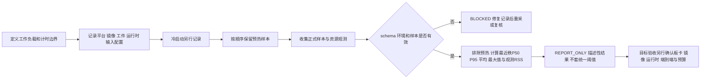

# 第5章 端侧推理性能评估：从测量方案到资源预算

## 学习目标

完成本章后，你将能够：

1. 分开描述冷启动、预热、稳态推理和端到端流程的测量边界。
2. 为一次推理基准记录设备、系统、运行时、模型、输入、批量和线程配置。
3. 用明确的最近秩定义解释 P50、P95、平均值和最大观测值，并知道它们各自的盲区。
4. 区分进程 RSS 观测值、真实峰值、吞吐量和时延，避免把不同工作负载下的数字直接比较。
5. 使用离线分析器复核合成记录，并解释 `REPORT_ONLY` 不代表性能合格或部署验收。

## 背景与边界

### 先定义测量问题，再讨论“快不快”

对 **Arduino UNO Q** 上的 AI 任务来说，“模型用了多少毫秒”并不足以回答应用是否响应及时。相机画面可能要经过采集、解码、预处理、数据搬运、模型执行、后处理、队列和通信；如果最后还要把结果交给另一个执行侧，则完整任务还有等待和调度时间。一个只计模型调用的数字，与从输入事件出现到应用收到可用结果的端到端时延，不是同一个测量对象。

应先把测量边界写成可检查的问题：计时从哪一个事件开始，在哪一个事件结束；包含不包含图像预处理、张量转换、运行时排队、设备同步、后处理、Bridge/RPC 和应用响应；一次测量对应一个样本、一个批次还是固定时间窗。若执行接口存在异步提交或队列，应说明记录的是“调用返回”还是“工作完成”；否则一个较小的调用时长可能只说明任务较早进入队列。

ONNX Runtime 的性能指南把时延、吞吐量、内存利用率、模型/应用大小列为随场景需求选择的常见维度。[官方性能指南索引](../../resources/references.md#第七篇第5章补充核验)支持的是测量维度，不提供适用于所有模型、运行时或 UNO Q 镜像的统一门槛。本章配套工具只分析单次运行中的推理时延分布和输入记录的 RSS 观测值；它不计算吞吐量、模型大小、功耗、温度或端到端时延。

| 指标 | 回答的问题 | 常见误读 |
| --- | --- | --- |
| 单次请求时延 | 从已定义的起点到终点用了多久？ | 把“函数调用返回”默认当成异步设备工作完成。 |
| P50 / P95 | 一组测量的中位位置和高分位尾部大约在哪里？ | 把 P95 当成最坏情况、95% 置信区间或服务等级承诺。 |
| 最大观测时延 | 当前记录中最大的样本是多少？ | 把有限样本最大值说成设备的理论上限。 |
| 吞吐量 | 固定负载下，单位时间完成多少项工作？ | 用单请求时延倒数推导并发或批处理吞吐量。 |
| RSS / 内存 | 观察期间进程常驻内存达到什么记录值？ | 把稀疏采样的最大值当成真实瞬时峰值，或当成设备总内存占用。 |
| 模型与应用大小 | 模型工件及其运行所需软件占用多少存储？ | 把模型文件大小等同于加载后的 RAM。 |

端到端时延也不能简单由各阶段 P95 相加得到：各阶段耗时会共同变化，且阶段之间可能重叠、排队或并行。需要端到端指标时，应直接测量端到端事件，同时保留阶段指标用于定位瓶颈。

### 冷启动、预热与稳态不是一组可互换的数据

“冷启动”应由场景定义。它可能包括进程启动、模型文件读取、运行时初始化、内存分配和第一次请求；设备上电、系统启动与应用冷启动也不是同一件事。若真实产品关注首次可用时间，应单独记录启动阶段的边界、起始状态和重复次数，不要把它并入稳态 P95 再称为“单次推理时间”。

预热样本用于观察首轮执行、缓存或初始化等影响，不能悄悄丢弃。记录预热数及其顺序，之后才汇总正式测量样本。本章分析器要求所有预热行先出现，再出现正式样本；报告明确列出两类数量，并只用正式样本计算时延统计。示例的 3 条预热和 20 条正式测量是为了让公式易于复算，**不是推荐的通用预热数、样本数或验收方案**。

Python 的 `time.perf_counter_ns()` 提供适合短时间间隔的高分辨率计数值；它的绝对起点没有含义，应使用结束读数减去开始读数，再换算单位。[Python 时间函数文档索引](../../resources/references.md#第七篇第5章补充核验)同时区分了经过时间与进程 CPU 时间。实际采集时需明确计时器与单位，并保证计时范围和等待完成的边界符合所测场景。本章离线脚本本身不启动计时器，也不执行推理。

### 让两次测量真的可比较

模型文件相同仍不足以说明两次基准条件相同。每次运行至少应固定或记录：

- 板卡/平台身份、系统镜像和相关固件版本；
- 模型工件版本或摘要、运行时版本、执行提供程序；
- 输入来源、预处理版本、输入形状、批大小和数据类型；
- 并发数、线程配置、应用版本，以及是否启用 profiling；
- 电源模式、环境温度、后台负载和采样时段等可能影响结果的条件；
- 预热规则、正式样本数、计时边界、测量工具和原始数据位置。

本章 JSON 记录中的字段只是教学用的最小身份快照；诸如 `synthetic-runtime-v1` 只是标签，脚本不会核对运行时是否存在、模型摘要是否真实，也不会从板卡上读取配置。真正比较两个配置时，应先确认任务和输入等价，再一次只改变一个目标因素；保留每轮原始数据和失败样本，不要在看到结果后删掉“难看”的尾部值。 profiling 适合帮助定位算子、线程或运行时瓶颈；ONNX Runtime 文档说明可生成含线程和算子延迟等信息的 JSON trace。[官方 profiling 文档索引](../../resources/references.md#第七篇第5章补充核验)；诊断配置应作为单独条件记录，不要把带诊断观测的数字冒充未开启观测时的基线。

## 操作与实验

### 明确时延分位数的算法

先把正式样本从小到大排序，得到 `x`，样本数为 `n`。本章分析器将分位数 `p` 定义为 0 到 1 之间的比例，最近秩结果为：

```text
rank = ceil(p × n)
nearest_rank(p) = x[rank - 1]
```

例如 20 条正式样本按时延升序排列时，P50 取第 10 个值，P95 取第 19 个值。不同软件包可能提供插值型的分位数定义；只写“P95”而不写算法，会让样本较少时的结果无法复算。本章固定最近秩作为教学约定，不声称它是 Arduino、Python 或 ONNX Runtime 的强制标准。

P95 是这批样本中的一个经验分位点。若样本量小、测试时段短、负载过于单一，它无法覆盖突发排队、温度变化、长时间运行或罕见输入。最大值则只描述已记录样本。应同时保留样本量、P50、P95、最大值和测量条件；需要更强统计结论时，应设计独立的重复运行和样本规模论证。

### RSS 观测值不等于完整内存峰值

RSS（resident set size，常驻集大小）表示某次观测时进程驻留的内存量；具体系统工具的口径、单位和采样时机要随证据一同说明。若采样频率较低，瞬时峰值可能发生在两个采样点之间。本章分析器把正式样本所提交的 `rss_mib` 记录中的最大值命名为 `observed_max_rss`，并在报告中说明它**不保证是进程真实峰值**。该值不包含“设备全部可用内存”或所有进程的合计。

实际目标测量还应把内存采集方法、采样间隔、单位换算、进程身份和工具版本记入运行记录；还可按场景监测 CPU、温度或功耗，但本章的 JSON schema 和分析器并未采集这些信号。不要在没有对应传感器或计量证据时补写温度/功耗结果，也不要只因模型文件小就推断其运行内存可接受。

### 运行离线分析器

分析器读取严格定义的 schema v1 记录。顶层包括 `run_id`、环境元数据、预热数、正式测量数和样本数组；环境身份包含平台、系统、运行时、执行提供程序、工件标识、输入形状、批大小和线程数；每个样本包含一基连续索引、`phase`、正的有限 `latency_ms` 和正的有限 `rss_mib`。缺失/多余字段、计数或顺序不符、布尔/非有限测量值都会阻断分析。

代码说明
- 用途：从固定 JSON 记录离线计算正式样本的最近秩 P50/P95、平均时延、最大观测时延和观测 RSS 最大值。
- 运行环境：Python 3.10+；本次本机 Python 3.14.6。
- 文件位置：[分析器](../../code/第7篇_AI/第5章_端侧推理性能评估/analyze_benchmark.py)、[合成记录](../../code/第7篇_AI/第5章_端侧推理性能评估/benchmark.json)、[行为测试](../../code/第7篇_AI/第5章_端侧推理性能评估/test_analyze_benchmark.py)、[代码说明](../../code/第7篇_AI/第5章_端侧推理性能评估/README.md)。
- 依赖：仅 Python 标准库；不需要网络、模型文件、ONNX Runtime、NumPy、Arduino CLI、Bridge 或 UNO Q。
- 操作步骤：进入上述代码目录，查看 `benchmark.json`，运行下方命令。分析器只读输入并向标准输出写 JSON 报告。
- 预期输出：schema 有效时为 `REPORT_ONLY`，`thresholds_applied=false`；合成样例 P50 为 14.5 ms、P95 为 19.0 ms、最大观测时延为 23.0 ms，`observed_max_rss` 为 507.4 MiB。
- 故障排查：`BLOCKED` 且退出码为 1 时，根据错误检查 schema、身份字段、样本计数/顺序及数值；修复来源数据，不要为了得到 `REPORT_ONLY` 删除样本或放宽数据契约。输入文件不会被程序改写。
- 验证方式：运行 21 项 `unittest` 行为测试；覆盖最近秩边界、预热隔离、异常类型、计数/顺序阻断、报告状态、极大有限时延均值及 CLI 输入只读。

```shell
python -B analyze_benchmark.py --input benchmark.json
python -B -m unittest -v test_analyze_benchmark.py
```

本次在本机对**合成记录**运行分析器，摘要如下；不是 UNO Q 的测量结果：

```text
status=REPORT_ONLY
warmup_count=3
measured_count=20
latency_ms.quantile_method=nearest_rank
latency_ms.p50_nearest_rank=14.5
latency_ms.p95_nearest_rank=19.0
latency_ms.mean=15.12
latency_ms.max=23.0
memory_mib.observed_max_rss=507.4
thresholds_applied=false
```

退出码 0 只表示输入符合教学 schema 并成功生成描述性报告；报告没有应用性能门槛。通过检查绝不表示候选模型质量合格、ONNX Runtime 可用于指定镜像、输入张量与实机路径一致，或 Arduino UNO Q 达到产品要求。

### 从教学记录走向将来的目标测量

真正把模型放到 UNO Q 或其他边缘设备评估前，先以已确认的目标镜像、模型工件和运行时为前提，至少完成这些工作：

1. **冻结实验条件。** 固定工件摘要、输入样例/形状、预处理、输出后处理、运行时/provider、线程和批大小；记录设备与镜像身份。
2. **分别定义启动与稳态。** 若首次可用时间是需求，就单独设计冷启动试验；若关注长期交互，明确预热策略和正式样本边界。
3. **直接采集所需指标。** 用单调高分辨率计时器计算每个样本的 elapsed time；要回答端到端体验就直接测端到端。用独立、已说明口径的工具观察 RSS/峰值；记录是否开启 profiling，以及环境负载、温度和电源状态。
4. **重复相同运行并留原始证据。** 保留逐样本值、失败和中断；记录实际采样数与时段。不把离线统计摘要替代原始 trace 和设备身份。
5. **解释而不是套门槛。** 对照任务允许的响应时间、内存预算和风险需求，评审尾部时延与资源余量。验收阈值应来自明确的应用要求和被确认的目标配置，不应从本章合成数字推导。

本章不执行以上实机步骤。它提供的是下一步采集前的记录与复核框架；硬件/镜像/运行时兼容、模型精度、真实性能、功耗、热行为和应用端到端响应仍需单独验证。

### Fig-47：从目标测量记录到可解释报告

本图把实验设计、预热隔离、统计输出和停止边界放在同一条路径上。有效报告依然只是描述性证据，不自动转化为目标验收。

<a id="fig-47-uno-q-ai-inference-performance"></a>

> 图示占位：图号=Fig-47；位置=本段之后；内容=显示从定义测量阶段和负载到记录运行环境、分离预热、计算时延分布/观测 RSS，并以 REPORT_ONLY 停止在目标验收之前；来源=第七篇图示资源登记中的 Fig-47 Mermaid（本书原创）。



图源：[Fig-47 Mermaid 源文件](../../diagrams/uno-q-ai-inference-performance.mmd)。这是本书原创测量教学流程，不是 Arduino 官方 benchmark、性能规范、运行时适配声明或部署批准流程；SVG 尚未渲染并视觉审阅。

## 验证结果与范围

本机 Python 3.14.6 执行了 21 项行为测试，检查最近秩分位数、正式样本边界、schema 校验、`REPORT_ONLY` 语义、大数量级有限输入和 CLI 输入只读；分析器实际读取 3 条预热与 20 条合成正式记录，并产生上面的摘要。由于输入是手工合成值，这次执行没有计时模型、查询操作系统内存、连接目标板、验证 ONNX Runtime、改变配置或访问任何设备。

本章保持 `draft`。本次证据不包括实际目标时延/吞吐量/RSS 峰值、功耗/温度、镜像兼容、执行提供程序可用性、模型准确率、应用端到端性能、现场负载或安全验收。Fig-47 Mermaid 源已登记；SVG 和视觉审阅状态见图示资源索引。

## 常见问题

### P95 达到需求线，就能宣布性能通过吗？

不能只凭本章输出下结论。样本数、输入分布、负载、设备/镜像、运行时版本和测量边界都决定其解释范围；当前工具不接受阈值，因此不可能给出自动通过结论。目标条件与业务预算应先被明确，再以可审查证据评审。

### 为什么 P95 不是“最坏时延”？

它由排序后某个位置的样本给出。少量高于该位置的观测仍可能存在；有限记录之外更不能推出上限。最大观测值也仅是本轮已记录样本的最大值，不是未来保证。

### 20 条正式样本是否足够？

本章恰好选择 20 条，是为了演示最近秩 P95 落在第 19 个样本的位置。它不提供对真实场景有足够统计效力的普遍建议。正式测试应根据负载变异、尾部风险、运行时长和希望的统计把握设计样本量与重复次数。

### 为什么工具不把 `1 / mean_latency` 写成吞吐量？

该倒数至多是无排队、单请求顺序执行假设下的速率换算，不能代表批处理或多请求持续负载下的完成吞吐量。吞吐量测试要显式固定并发/批量、到达模式、积压和测量时间窗，同时报告响应时间分布。

### `observed_max_rss` 是否等同于进程峰值？

不等同。它只是正式样本记录里 `rss_mib` 的最大值；采样可能错过瞬时峰值，采样工具和系统口径也可能不同。要报告真实峰值，需要提供相应系统工具、采样方法、进程身份和证据。

## 延伸阅读

- [ONNX Runtime 性能测量维度](../../resources/references.md#第七篇第5章补充核验)：了解按使用场景衡量时延、吞吐、内存和模型/应用大小等维度；不证明该运行时适配任何特定目标板。
- [ONNX Runtime profiling tools](../../resources/references.md#第七篇第5章补充核验)：了解运行时可生成的性能 trace 类型及诊断用途；trace 选项和执行提供程序必须按真实目标验证。
- [Python `time` 文档](../../resources/references.md#第七篇第5章补充核验)：核对单调高分辨率计数器和纳秒接口；本章合成实验没有使用它测量模型。
- [第七篇第1章](./第1章_AI开发基础_从任务定义到可验证推理.md)、[第七篇第2章](./第2章_数据集与离线评估_从分组切分到混淆矩阵.md)、[第七篇第3章](./第3章_模型工件与部署契约_从清单到目标预检.md)和[第七篇第4章](./第4章_推理回归与数值一致性_从黄金样例到目标验收.md)：回看任务质量、模型契约及推理一致性与本章性能测量之间的证据边界。
