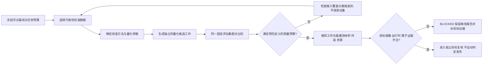

# 第6章 模型量化与校准验证：从校准数据到资源—精度权衡

## 学习目标

完成本章后，你将能够：

1. 说明量化改变数值表示，但不自动证明模型精度、运行时兼容或推理加速。
2. 区分静态校准、动态参数计算与量化感知训练的职责边界。
3. 为校准数据说明来源、预处理、输入分布和与评估/测试数据的隔离关系。
4. 读懂 scale、zero point、整数范围、舍入和饱和/截断对数值的影响。
5. 把浮点基线与量化候选在相同输入上配对评估，并把任务质量、数值误差、资源和时延分别记录。
6. 使用本章合成标量实验解释“校准范围变宽会减少截断、也可能降低小数值分辨率”，而不把它误称为真实模型量化。

## 背景与边界

### 量化改变表示，不替模型通过验收

模型量化通常把浮点权重或激活映射到较低位宽的整数表示，并借助缩放因子 `scale` 和零点 `zero_point` 在两种数值空间之间转换。开放神经网络交换（Open Neural Network Exchange，ONNX）Runtime 的[官方量化文档](../../resources/references.md#第七篇第6章补充核验)介绍了线性量化、量化模型表示、静态/动态处理方式及量化调试；这些是该运行时文档所述的能力，并不证明某个 Arduino UNO Q 镜像、执行提供程序或算子已经支持特定模型。

降低表示位宽可能减少部分张量数据的理论载荷，也可能改变误差分布；它不保证模型文件按同一比例缩小，更不保证目标设备更快。实际结果还取决于算子覆盖、内核实现、数据搬运、转换开销和硬件指令支持。ONNX Runtime 文档也提醒量化并非无损变换，且性能收益取决于模型和硬件。应把“候选文件生成成功”“数值/任务质量满足要求”“目标运行时可执行”和“目标资源/时延达标”当作不同证据门。

### 静态校准、动态量化与量化感知训练

- **静态量化**：先用一组代表性输入运行校准流程，估计激活的量化参数并写入候选模型；推理时使用预先确定的参数。校准样本不需要含标签，但必须能反映预期输入及预处理后的数值分布。
- **动态量化**：在推理过程中根据当前输入动态计算相关量化参数。参数计算会带来运行期开销；是否合适须用所选模型和执行目标测量，不能仅凭方法名称下结论。
- **量化感知训练（QAT）**：训练阶段显式模拟量化带来的数值效应，再导出/转换候选模型。它涉及训练框架和训练过程，不是本章离线小程序执行的操作。

本章只解释概念，并模拟一个对称 8 位有符号整数（int8）标量向量。程序不会读取模型、运行校准推理或生成 ONNX/其他模型工件。静态与动态的具体支持、量化格式、算子范围和舍入规则都必须查阅所选框架、版本及目标执行提供程序的正式资料。

### 校准数据不能取代独立评估

校准数据用于估计或选择数值表示参数，不等同于评估模型是否完成任务。按照[第七篇第2章](./第2章_数据集与离线评估_从分组切分到混淆矩阵.md)的数据隔离原则，应记录校准样本的来源、组别、预处理版本和覆盖范围；测试集保持隔离，不应用来反复挑选校准范围、量化方案或通过门槛。若观察到精度退化，应先检查输入分布、预处理、量化配置和差异位置，再使用独立保留样例复核。

至少需要三类可追溯证据：

| 证据 | 需要记录 | 不能单独证明 |
| --- | --- | --- |
| 校准证据 | 校准数据身份/版本、样本覆盖、预处理、方法、scale/zero point 来源 | 任务精度、目标设备可执行 |
| 质量证据 | 同一组固定评估输入上的浮点/候选输出、任务指标与数值差异 | 目标时延、功耗或内存达标 |
| 部署/性能证据 | 模型摘要、运行时/provider、算子覆盖、设备/镜像、同边界资源与时延测量 | 未验证配置的兼容性或其他负载下的保证 |

这里的字段是书稿建议的记录清单，不是 Arduino 官方工件规范或 ONNX Runtime 强制 schema。

## 操作与实验

### 对称 int8 标量演示

为使计算可手工复核，本章示例固定整数范围为 `[-127, 127]`、零点为 0，并以校准向量最大绝对值 `A` 定义 `scale = A / 127`。对每个输入 `x`，教学程序执行 `q = clip(round(x / scale), -127, 127)`，再用 `x_hat = q × scale` 重建浮点近似值。误差是 `abs(x - x_hat)`；落在量化范围之外并被压到边界的样本记为 clipped。本章标题中的“精度”指数值表示/重建精细程度及其对任务评估的影响，不表示本例测得了模型分类准确率。

这是一个特意简化的标量计算示范：没有通道维度、权重/激活图、算子累加、模型输出或框架特有的量化流程。Python 的 `round()` 只定义本例的整数舍入；不能据此推断目标运行时采用相同规则。本例取 `[-127,127]` 而不是依赖某个格式默认值，所有报告都标记为 `REPORT_ONLY`。

校准范围较窄时，较小的 scale 能给范围内的小数值更细的量化步长，但超出范围的评估值可能饱和；把极端离群值纳入校准范围会增大 scale，可能减少这些截断，却使普通小数值映射到更粗的格点。哪种结果更可接受，取决于真实输入分布和任务风险，不能从一个玩具向量推导通用校准算法。

### 运行合成案例

代码说明
- 用途：比较窄范围校准与包含离群值的校准对同一组标量评估值的影响，并生成无门槛报告。
- 运行环境：Python 3.10 或更新版本；本次验证环境为 Python 3.14.6。
- 文件位置：[教学模拟器](../../code/第7篇_AI/第6章_模型量化与校准验证/quantization_demo.py)、[行为测试](../../code/第7篇_AI/第6章_模型量化与校准验证/test_quantization_demo.py)、[代码说明](../../code/第7篇_AI/第6章_模型量化与校准验证/README.md)。
- 依赖：仅 Python 标准库；不需要模型文件、训练框架、ONNX Runtime、网络或硬件。
- 操作步骤：进入代码目录后运行以下命令。程序将合成向量的描述性 JSON 写到标准输出，不写文件。
- 预期输出：`REPORT_ONLY`、无阈值判定；窄范围案例有 2 个截断值，含离群值案例有 0 个截断值，但后者对 `0.1` 的重建误差更大。
- 故障排查：输入校准或评估序列为空、包含布尔/非有限值、校准全为零或不能生成正有限 scale 时，程序抛出 `QuantizationInputError`；修正教学输入，不要放宽范围以制造通过结论。
- 验证方式：运行 9 项 `unittest` 行为测试，并检查 CLI 输出可解析为 JSON 且状态固定为 `REPORT_ONLY`。

```shell
python -B quantization_demo.py
python -B -m unittest -v test_quantization_demo.py
```

本机运行得到的关键摘要如下；全部数字都来自固定合成标量，不是模型质量或硬件结果：

| 校准场景 | scale | 截断数 | 平均绝对重建误差 | 最大绝对重建误差 | 对 `0.1` 的重建值 |
| --- | ---: | ---: | ---: | ---: | ---: |
| 窄范围 `[-1,1]` | 0.007874 | 2/5 | 0.200945 | 0.500000 | 0.102362 |
| 含离群值 `[-8,8]` | 0.062992 | 0/5 | 0.015118 | 0.025984 | 0.125984 |

这组评估值包含 `-1.5` 和 `1.5`，因此窄范围方案的平均误差主要由两个截断值拉高；同一方案对 `0.1` 的重建更细。离群值方案覆盖了评估范围，减少截断，但 `0.1` 的绝对误差由约 `0.002362` 增至约 `0.025984`。这只解释给定数字，不能得出“校准时总应包含离群值”的结论。

程序还按 5 个数值元素估算裸载荷：32 位浮点数（float32）为 20 字节，int8 为 5 字节，理论比值为 4:1。它不计 scale/zero point、模型图、容器/对齐、压缩、运行时工作区和其他元数据，**不是模型文件大小、随机存取存储器（RAM）占用或 UNO Q 存储收益的测量值**。整型运算也不自动比浮点快；性能须按[第七篇第5章](./第5章_端侧推理性能评估_从测量方案到资源预算.md)的同一计时边界在目标上重新测量。

### 从教学例子转为模型候选评审

实际模型工作应把量化当作受控候选分支，而非覆盖浮点基线：

1. 固定浮点基线、任务指标、输入/预处理和模型摘要，参考[第七篇第3章](./第3章_模型工件与部署契约_从清单到目标预检.md)记录工件身份。
2. 选择能代表目标输入分布的校准数据，记录来源和处理版本；锁定独立验证/测试样本，不从测试结果反向调校准参数。
3. 在框架支持的工作流中生成量化候选，同时记录方法、位宽、signedness、granularity、calibration method、输入数据版本和工具版本。
4. 使用同一组固定评估输入配对运行浮点基线与候选模型；检查任务指标、关键输出、数值误差和异常样例。必要时按官方工具提供的调试能力定位权重/激活差异，避免只看一个总平均数。
5. 按[第七篇第5章](./第5章_端侧推理性能评估_从测量方案到资源预算.md)保持工作负载、批大小、并发和计时边界不变，单独测量候选的模型工件大小、推理时延、资源使用和启动影响；记录观测工具与环境身份。
6. 对目标镜像、运行时、执行提供程序、量化算子/类型和实际部署路径逐项留证。静态文档、格式检查或模拟器都不能替代目标板验证。

任一关键证据缺失时，状态应停在待复核或阻断，不得把位宽、平均误差或文件后缀当作部署批准。允许的精度下降、资源预算和风险阈值应来自具体任务并在看见测试结果前确定。

### Fig-48：校准选择与候选复核证据链

图中校准与评估数据分开，量化输出需先过任务质量/数值复核，再按同一边界测量资源；目标运行时和设备证据仍是独立门槛。

<a id="fig-48-uno-q-ai-quantization-calibration"></a>

> 图示占位：图号=Fig-48；位置=本段之后；内容=显示浮点基线、代表性校准集、量化候选、独立评估、固定边界资源测量及目标兼容证据门；来源=第七篇图示资源登记中的 Fig-48 Mermaid（本书原创）。



图源：[Fig-48 Mermaid 源文件](../../diagrams/uno-q-ai-quantization-calibration.mmd)。本图是本书原创的评审流程，不是 ONNX Runtime、Arduino 或 UNO Q 的官方量化/发布规范；SVG 尚未渲染并视觉审阅。

## 验证结果与范围

本机 Python 3.14.6 的 9 项行为测试覆盖对称 scale、整数边界、截断计数、离群校准对步长的影响、空值/全零/布尔/非有限输入及 `REPORT_ONLY` CLI。命令输出来自内置合成向量；没有导入模型库、生成模型工件、计算分类准确率、运行 ONNX Runtime、读取目标设备资源或访问 Arduino UNO Q。

本章保持 `draft`。这次没有验证真实校准集代表性、模型质量、量化后的文件/RAM变化、算子与执行提供程序支持、目标推理速度、功耗/温度或硬件部署。合成实验仅说明所列标量和固定公式的结果；不能据此选择实际模型量化参数。

## 常见问题

### int8 是否一定比 float32 快？

不一定。只有当模型结构、算子内核、设备指令和数据路径都能有效利用整数计算，且转换/调度开销没有抵消收益时，才可能观察到加速。ONNX Runtime 的通用量化文档也明确把性能收益与模型和硬件关联；目标配置必须实际测量。

### 把最大校准范围扩大，是否一定更安全？

不会。更宽的范围可能减少范围外样本的饱和，但也会增大 scale，使同一整数格点覆盖更大的浮点间隔。本章案例中 `0.1` 的重建误差增加；真实模型的任务指标还受层间误差传播和运行时实现影响。

### 能用测试集做静态校准吗？

不要把最终测试集同时用于校准或反复挑选方案。校准输入应代表目标分布；保留独立评估数据检查候选行为，并让最终测试集保持其评估角色。具体数据治理应遵循任务方案和[第七篇第2章](./第2章_数据集与离线评估_从分组切分到混淆矩阵.md)的隔离要求。

### 裸元素载荷减少到四分之一，模型文件是否也会如此？

不能这样推断。模型文件还包含结构、参数、元数据和格式开销；量化可能只覆盖部分张量或算子，甚至额外加入参数和转换节点。应检查实际导出工件，并在目标环境观察加载与运行资源。

### 本章测试通过，是否说明目标支持量化？

不是。它只验证本书的标量演示实现及报告边界。目标兼容仍须有指定镜像、运行时、执行提供程序、算子和实际部署路径的独立证据。

## 延伸阅读

- [ONNX Runtime：Quantize ONNX models](../../resources/references.md#第七篇第6章补充核验)：了解该运行时对量化表示、静态校准、动态参数与误差调试的说明；不代表 UNO Q 支持这些功能。
- [第七篇第2章](./第2章_数据集与离线评估_从分组切分到混淆矩阵.md)：回看校准/评估/测试数据边界与分组隔离。
- [第七篇第3章](./第3章_模型工件与部署契约_从清单到目标预检.md)：回看模型工件身份、运行时声明与目标预检边界。
- [第七篇第4章](./第4章_推理回归与数值一致性_从黄金样例到目标验收.md)：回看参考/候选配对输出及数值差异解释。
- [第七篇第5章](./第5章_端侧推理性能评估_从测量方案到资源预算.md)：回看公平比较所需的负载、计时和资源测量边界。
