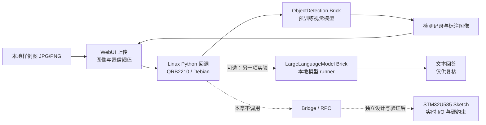

# 第7章 UNO Q 板载 AI 实战：App Lab AI Brick 与本地推理

## 学习目标

完成本章后，你将能够：

1. 把“UNO Q 板载 AI”准确定位到 QRB2210/Linux 侧的 App Lab 应用与 Brick，而不是把它误写成 STM32U585 上运行的通用大模型。
2. 使用 Arduino 官方对象检测示例的真实入口，说明图像如何从 WebUI 到达 `ObjectDetection`，以及标签、检测框和标注图像如何返回界面。
3. 区分 Brick 提供的视觉任务、本地 LLM 运行器和公共云 API，并识别它们各自的网络、隐私、资源与版本边界。
4. 为目标板记录 SKU、系统和 App Lab/Brick 版本、模型标识、预热、CPU/RSS 与时延；不把主机测试或文档示例写成实机结果。
5. 将任何检测或生成结果限制为“待复核信息”，不让模型直接控制 GPIO、Bridge、MCU 或执行器。

## 背景与边界

### 先确认 AI 跑在哪一侧

Arduino UNO Q 是双处理器板：QRB2210 MPU 运行 Debian Linux；STM32U585 MCU 运行 Arduino Core on Zephyr。App Lab 可以把 Linux Python 应用、可选的 MCU Sketch 和一个或多个 Brick 组织为同一个 App；Brick 与 Python 应用运行在 Linux 侧，跨处理器数据经 Bridge/RPC 交换。这个组合让“Linux 侧做较重的数据处理、MCU 侧保持确定性 I/O 控制”成为一种可设计的分工，但不会自动授予 AI 输出硬件操作权限。

| 路径 | 本章中的位置 | 不能据此推出什么 |
| --- | --- | --- |
| `ObjectDetection` Brick | Linux 侧 Python App 调用打包好的视觉能力 | 不代表相机已接通、每个模型都兼容，也不代表用了 GPU、DSP 或某个 NPU |
| `LargeLanguageModel` Brick | 可选的本地 LLM 接口；当前实现把模型请求交给本地 Genie 或 llama.cpp runner | 不代表任意模型都已下载、可装入内存、能实时运行或走特定硬件加速路径 |
| STM32U585 Sketch | 采样、时序、I/O 及独立安全约束 | 不应把 Linux 上的通用 LLM 当成 MCU 实时控制器 |
| 公共 LLM API | 由 Linux 应用经网络把请求发送给外部服务 | 这属于云端推理，不是板载推理；详见[第8章](./第8章_UNO_Q接入DeepSeek_API_从云端LLM到可验证应用.md) |

截至本章核验日期，Arduino 数据表列出两个 SKU：ABX00162 为 2 GB RAM/16 GB eMMC，ABX00173 为 4 GB RAM/32 GB eMMC。数据表在资源较重的 SBC/App 场景建议 4 GB 版本以留出稳定运行余量；这只是资源规划建议，不是某个模型或 Brick 的兼容承诺。记录你手上板卡的 SKU，比根据“UNO Q”名称猜测内存更可靠。

QRB2210 的 Qualcomm 产品资料列出 Cortex-A53 CPU、Adreno 702 GPU 和 Hexagon DSP，并提到 DSP 支持轻量 AI 推理；但 UNO Q 数据表没有为 AI Brick 指定独立 NPU，也没有说明 Arduino 示例把算子派发给 CPU、GPU 或 DSP 中的哪一个。Arduino 官方 `object-detection` 示例明确说明该示例使用板上 CPU，且没有 C++ Sketch。应把“芯片具备某项能力”“某个运行时支持某种后端”和“本 Brick 在这块板上实际使用该后端”作为三种不同证据。

### 本章示例的范围

主实验采用 Arduino 官方 App Bricks Examples 仓库当前的 `inspirational/common/object-detection` 示例。网页上传一张 JPG/PNG 图像，Python 回调调用预训练模型，界面显示标注图像与类别标签。示例路径包含 `ObjectDetection` 和 `WebUI` 两个 Brick，输入图片由用户上传；它不是相机采集教程。本章不连接真实摄像头，不需要 MCU Sketch，也不调用 DeepSeek。

> **实机状态：`NOT_RUN`。** 本次只核对了官方资料并编写书稿与离线契约测试；没有连接 Arduino UNO Q、启动 App Lab、部署 Brick、下载模型或测量设备性能。后文的操作步骤和结果形态是复现实验指南，不是本项目已取得的运行结果。

## 操作与实验

### 实验一：用 AI Brick 对上传图片做对象检测

#### 1. 检查运行目标和 App 结构

在开始之前记录：

- 目标是否为 UNO Q；SKU 是 ABX00162 还是 ABX00173；板上可用存储与供电/散热条件。
- App Lab、板上系统、示例仓库和相关 Brick 的版本或提交标识。
- App Lab 当前选中的执行目标。App Lab 可以安装在电脑上，也可直接在 UNO Q SBC 模式运行；不能只根据编辑器在哪台机器上打开就推断推理发生在哪台机器。
- 此实验是否确实没有 MCU Sketch。官方对象检测示例没有 C++ Sketch；若你导入的项目另含 Sketch，App Lab 的 Run 可能还会编译/刷写 MCU 部分，应先检查 App 内容，不要把它当成纯 Linux 改动。

Arduino App 的基础布局是根目录 `app.yaml`、必需的 `python/main.py`，以及可选的 `sketch/`。`app.yaml` 中 Brick ID、模型和设备声明必须与当前 App Lab/Brick 版本匹配。官方 App 规范的示例把 descriptor 中的 Brick ID 写作 `arduino:objectdetection`，而 Python 示例的导入名是 `arduino.app_bricks.object_detection`；这是 manifest ID 与 Python 模块名的不同形式，不要互换，也不要把某一版本的配置复制到未核对的项目中。

#### 2. 导入当前官方示例

1. 在 Arduino App Lab 的 Examples 中查看当前可用的 Object Detection 示例，或从官方仓库定位 [`inspirational/common/object-detection`](https://github.com/arduino/app-bricks-examples/tree/main/inspirational/common/object-detection)。不要再从已过时的 `bricks/arduino/object_detection/...` 路径寻找本示例。
2. 打开示例的 `README.md`，核对依赖、所需 Brick、界面端口和输入格式。官方 README 当前描述 `objectdetection` 与 `web_ui` 两个 Brick，上传 JPG/PNG 后返回标注图片，并将推理耗时写入控制台。
3. 使用一张本地、无个人敏感内容的测试图片；第一轮不接相机，也不把含隐私的人脸/文档图像上传到网页界面。检查项目目录、`app.yaml`、`python/main.py` 与资产，不要把 API key 放入配置。
4. 若首次启动提示安装、更新系统/App Lab 或拉取模型，先记下提示并停止；这属于会改变设备状态的操作，应确认目标版本、下载内容和回滚方式后再单独决定。本章不要求自动更新或下载。

#### 3. 阅读关键调用链

下面是依据 Arduino 当前公开示例中可核对的 API 形态重新组织的关键片段。它展示对象与图像之间的调用，不是一个可直接替代官方 App 的完整 `main.py`；WebUI 回调签名、Brick 清单字段和模型 ID 仍以你安装版本随附的示例为准。

```python
from arduino.app_bricks.object_detection import ObjectDetection

detector = ObjectDetection()

def detect_uploaded_image(pil_image):
    # pil_image 应来自已校验的 JPG/PNG 上传；生产应用还需限制字节数、尺寸和解码资源。
    result = detector.detect(pil_image, confidence=0.5)
    if result is None:
        return {"status": "NO_RESULT", "detection_count": 0}

    annotated = detector.draw_bounding_boxes(pil_image, result)
    detections = result.get("detection", [])
    return {
        "status": "RESULT_FOR_REVIEW",
        "detection_count": len(detections),
        "annotated_image": annotated,
    }
```

这里的 `confidence=0.5` 只是示例阈值，不是 Arduino 推荐值、准确率保证或任何任务的验收门槛。检测记录字段和模型类别由实际 Brick/模型决定；应查看所选版本的输出，不要把框内标签当作对象身份认证。`None`、空检测集、解码错误、超时和 Brick 未就绪都要成为显式状态，而不是沿用上一帧结果。

示例界面大致遵循如下流程：浏览器上传图像与置信阈值 → Linux Python 回调解析请求 → `ObjectDetection.detect()` → `draw_bounding_boxes()` 生成标注图 → WebUI 返回结果。官方样例中的一张图片是送到 UNO Q 上运行的 App；这是板端对象检测，不是云端 API，但也不等同于 MCU 控制或已验证的真实相机管线。

> 图示占位：图号=Fig-49；位置=本节之后；内容=由 WebUI 输入进入 QRB2210/Linux Python 和 ObjectDetection Brick、返回标注图；可选本地 LLM 独立显示，并把 Bridge/STM32U585 放在未连接的边界之外；来源=Arduino UNO Q 数据表、App 规范及当前官方对象检测示例，原创绘制。

<a id="fig-49-uno-q-onboard-ai-brick-flow"></a>

## 图 7-7：从上传图片到板载 AI Brick 的结果复核



图源：[Fig-49 Mermaid 源文件](../../diagrams/uno-q-onboard-ai-brick-flow.mmd)。图中 Bridge/MCU 的虚线仅标出后续可能设计的接口，不表示本实验发送了 RPC、控制了引脚或完成了硬件验证；本图为原创说明，不是官方硬件加速拓扑图。

#### 4. 在 App Lab 运行并观察结果

当且仅当目标、版本和 App 内容已核对后：

1. 在 App Lab 运行 Object Detection App，等待 Linux Python 启动与 Brick 部署完成。若 Console 报出启动失败、缺少 Brick 或模型不可用，停在该错误状态；不要把界面能打开当成模型已就绪。
2. 打开当前示例 README 指定的 WebUI 地址（官方样例当前使用板卡 IP 的 `:7000` 端口；实际端口以该版本 descriptor/README 为准）。
3. 上传本地 JPG 或 PNG，先用小尺寸静态样例；查看预览、阈值与状态，再手动点击检测。官方示例显示类别标签和边框，并在 Python 控制台输出推理耗时。
4. 记录输入文件摘要、图像尺寸、模型/Brick 标识、阈值、冷启动/预热轮次、逐次耗时、CPU/RSS 观察方式和错误。若要比较模型或阈值，一次只改变一个因素。
5. 结束时使用 App Lab 的 Stop，确认 Python 进程和 UI 请求都已停止，再清除上传的临时图片。不要将这一步扩大成删除 App 数据目录或重置板卡。

CPU 与内存数据必须注明采集工具、采样间隔、App/系统负载及是否包含模型加载。先做一次冷启动记录，再单独预热；正式统计至少保留原始观测值，并报告 P50、P95、最大值和样本数。样本量小、系统负载不同或模型版本改变时，不应作跨环境性能结论。官方示例打印的单次耗时不是性能承诺，也不自动包含上传、解码、渲染和 UI 传输时间。

### 实验二：把本地 LLM Brick 当作可选能力，而不是规格保证

Arduino 当前公开 Python 实现的 `LargeLanguageModel` 继承云 LLM Brick 接口，但其模型配置要求指定本地运行器前缀：`genie:<model-id>` 或 `llamacpp:<model-id>`。源码分别连接 `genie-models-runner` 与 `llamacpp-models-runner` 容器端点，并通过 `list_models()` 查询 runner 当前报告的模型。模型列表为空、ID 不匹配或 runner 未就绪都必须视为未准备好。

概念调用顺序如下；尖括号中的标识是占位符，代码不可原样运行。实际导入路径、App descriptor、可用 ID 和方法签名必须从目标板安装版本的 Brick 文档/包中确认。

```python
# 伪代码：先在当前 App Lab/Brick 版本中核对真实导入路径与可用模型 ID。
model_id = "genie:<模型列表中实际存在的 ID>"
local_llm = LargeLanguageModel(model=model_id, max_tokens=128, timeout=30)
local_llm.init()                 # 可能加载模型并占用明显 RAM/CPU
reply = local_llm.chat("请把这条合成读数解释为仅供复核的摘要。")
```

这个路径与上一节的对象检测是两项独立的实验。先确认 2 GB/4 GB SKU、系统可用内存和存储，再确认模型文件、runner、App Lab/Brick 版本及上下文/输出上限。第一次加载可能耗时较长；`init()` 会主动触发 runner 初始化，不应在未经说明的情况下作为“无副作用探测”。本章没有下载模型，也未在目标板运行 `LargeLanguageModel`。

芯片资料中的 GPU、DSP 或“AI inference”能力并不证明该 Brick 能把某个张量算子委派给其中任一设备。只有同时保存目标板 SKU、OS/固件、Brick/runner 版本、模型摘要、运行日志和测量方法，才能讨论这一具体组合的资源和时延。不要仅凭类名、品牌宣传或单次结果写出“NPU 加速”“实时”或“比 CPU 快”的结论。

## 目标板验证记录

连接实体 UNO Q 后，可复制下表作为实验记录。没有实际观测值的单元保留 `NOT_RUN`，不可用预期值填补。

| 字段 | 应记录的值 | 本项目当前状态 |
| --- | --- | --- |
| 板卡 SKU / RAM / eMMC | 产品标签或只读系统信息；区分 ABX00162 与 ABX00173 | `NOT_RUN` |
| App Lab 与 OS | 版本、运行目标（PC-hosted/SBC） | `NOT_RUN` |
| 示例 / Brick / runner | 仓库提交、Brick ID/版本、容器/服务状态 | `NOT_RUN` |
| 模型 | 名称、版本/文件摘要、来源、授权、精度阈值 | `NOT_RUN` |
| 输入 | 本地合成图片的 SHA-256、分辨率、格式、字节数；不记录私人图片 | `NOT_RUN` |
| 检测质量 | 样本标签、阈值、漏检/误检人工复核结果 | `NOT_RUN` |
| 性能 | 冷启动、预热轮数、样本数、P50/P95/max、计时边界 | `NOT_RUN` |
| 资源 | CPU、RSS、采样工具/间隔、系统负载和温度观察 | `NOT_RUN` |
| 数据路径 | 是否离开设备、摄像头/网络/Bridge/RPC 状态 | `NOT_RUN` |

开始目标验证前，先让用户接入设备并核对只读版本信息。下载模型、更新系统/App Lab、安装未知 Brick、刷写 MCU、启用相机或连接外设都不是本章自动步骤；执行其中任何一项前，需单独说明目标、影响和恢复办法。后续若需要把 AI 结果交给 MCU，应另设身份、消息 schema、时间戳/新鲜度、限幅、独立批准和 MCU 端硬约束；LLM 或视觉标签本身不能成为动作授权。

## 验证结果

本章可在没有网络、模型、密钥或板卡的情况下完成目录/文本契约检查。它验证的是书稿引用、图源和导航，不验证 Brick 代码能在 UNO Q 运行。

- 官方对象检测示例、导入路径、CPU-only 描述和上传输入形式已在 2026-09-26 对照 Arduino 官方仓库核验。
- 新增的本地测试为文档/资源契约测试，不导入 Arduino Brick、不启动浏览器、不读取用户图像，也不访问目标硬件。
- 本项目当前实机、模型推理、相机、CPU/RSS、端侧 LLM 和 Bridge/MCU 结果：全部 `NOT_RUN`。
- Fig-49 的 Mermaid 正文与独立源按测试逐字比较；SVG 尚未渲染，也尚未进行目视审阅。
- 本章仍为 `draft`。通过本机检查不得改写成“已在 Arduino UNO Q 上验证”。

## 常见问题

| 现象 | 可能原因 | 安全处置 |
| --- | --- | --- |
| `ObjectDetection` 导入失败 | Brick 未声明/未部署，或 Python 模块路径随版本变化 | 对照该版本官方示例与 Brick 列表；不要通过随意 `pip install` 代替 App Lab Brick 管理 |
| App 启动但检测报错 | 模型 runner 未就绪、输入解码失败、上传为空/过大，或模型/阈值配置不兼容 | 保存已脱敏日志，检查版本、JPG/PNG、字节数与尺寸；确认失败后再决定是否重启，不重复执行未知写操作 |
| 返回空结果或 `None` | 输入无可检测目标、阈值过高，或模型返回未完成 | 显式显示无结果并人工检查；不要复用上一次检测框或把“未检出”解释成对象不存在 |
| CPU/RSS 高或 App 被杀 | SKU 内存差异、模型加载、图像尺寸、并发或其他进程竞争 | 停止新增请求，记录系统状态；降低图像/并发需先作为受控对照实验，不能假装已满足性能门槛 |
| 本地 LLM ID 找不到 | runner 尚未就绪、模型未安装或 ID/前缀与版本不符 | 只读查询本机模型列表；下载或变更 runner 前确认空间、来源和授权 |
| 想把标签直接接到执行器 | 视觉输出存在误检/漏检且未经过独立授权 | 不将 Brick 输出直接接到 GPIO/Bridge；先建审查层，再让 MCU 独立执行限幅、状态机和故障安全逻辑 |

## 延伸阅读

- [Arduino UNO Q 数据表](https://docs.arduino.cc/resources/datasheets/ABX00162-ABX00173-datasheet.pdf)：SKU、双处理器、App Lab、Bridge 和硬件资料。该文件在核验时标示修订日期 2026-09-22。
- [Arduino 官方 Object Detection 示例说明](https://github.com/arduino/app-bricks-examples/blob/main/inspirational/common/object-detection/README.md)与[示例 Python 入口](https://github.com/arduino/app-bricks-examples/blob/main/inspirational/common/object-detection/python/main.py)：输入/输出、Brick 名称和当前 API 调用形态。
- [Arduino App specification](https://github.com/arduino/arduino-app-cli/blob/main/docs/app-specification.md)：`app.yaml`、Python/Sketch、Brick 声明及变量/secret 规则。
- [Arduino 当前 LargeLanguageModel 源码](https://github.com/arduino/app-bricks-py/blob/main/src/arduino/app_bricks/llm/local_llm.py)：runner/model 前缀和本地模型查询实现；main 分支会变化，应对照设备上的安装版本。
- [Qualcomm QRB2210 官方产品资料](https://www.qualcomm.com/internet-of-things/products/q2-series/qrb2210)：SoC 级 CPU/GPU/DSP 资料，不证明特定 Arduino Brick 的后端映射。
- [第7篇第5章：端侧推理性能评估](./第5章_端侧推理性能评估_从测量方案到资源预算.md)：性能记录和样本统计口径。
- [第8章：UNO Q 接入 DeepSeek API](./第8章_UNO_Q接入DeepSeek_API_从云端LLM到可验证应用.md)：公共云 LLM 路径，与本章板载 Brick 形成对照。
- [第9章：生成式 AI 与工具调用安全边界](./第9章_生成式AI与工具调用安全边界_从模型建议到受控执行.md)：把模型提案与实际执行授权分开。

代码与图示登记见[本章代码说明](../../code/第7篇_AI/第7章_UNO_Q板载AI实战/README.md)、[第七篇图示资源登记](../../images/第7篇_AI/README.md)和[图示源目录](../../diagrams/README.md)。本章文字和经过改写的短 API 片段为本书原创教学说明；外部仓库只作为链接来源，不复制其图片、CSS、页面或完整源码。
