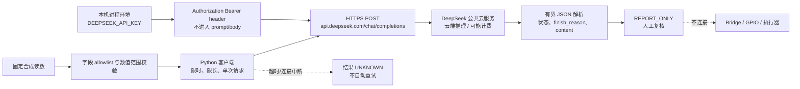

# 第8章 UNO Q 接入 DeepSeek API：从云端 LLM 到可验证应用

## 学习目标

完成本章后，你将能够：

1. 在 Arduino UNO Q 的 Linux/Python 应用中，把公共 LLM API 与板载 Brick、本地模型及 MCU Sketch 区分开。
2. 按当前 DeepSeek Chat Completions 文档构造 HTTPS 请求，理解 base URL、endpoint、认证头、messages、模型名、思考模式和输出上限。
3. 在本机进程环境读取 API key，以窄输入、限时、限长、无自动重试的方式请求一个报告型回答。
4. 用完全离线的 mock transport 覆盖成功、异常响应、超时、HTTP 错误和密钥脱敏，而不伪称调用过真实 API。
5. 解释输入会离开设备、服务可能计费以及模型输出只是待复核文字；不把云端回答接成 GPIO、Bridge 或执行器指令。

## 背景与边界

### 云端 LLM 不等于板载 AI

UNO Q 的 QRB2210 运行 Debian Linux，STM32U585 运行 Zephyr Sketch。App Lab 的 `Python`、Brick 和容器运行在 Linux 侧；Bridge 可在已设计的 App 中交换 Linux/MCU 数据。本章用 Linux Python 通过 HTTPS 调用 DeepSeek 公共服务：模型推理发生在服务端，提示和输入数据从设备经网络传出。它与[第7章的板载 ObjectDetection Brick / 可选本地 LLM](./第7章_UNO_Q板载AI实战_App_Lab_AI_Brick与本地推理.md)是不同路线。

| 项目 | 本章处理方式 |
| --- | --- |
| 推理位置 | DeepSeek 公共云服务；不是 UNO Q 本地推理，也不是 STM32U585 上的模型 |
| 示例输入 | 固定的合成温度、湿度和样本年龄；不读真实传感器、不上传图片 |
| 输出用途 | 简体中文文字报告，`REPORT_ONLY`、仅供人工复核 |
| 下游动作 | 不调用工具，不调用 Bridge，不输出 GPIO/MCU 命令 |
| 实机/API 状态 | UNO Q 上 Python/TLS 与真实 DeepSeek 请求均为 `NOT_RUN` |

真实设备读数、设备 ID、个人信息、凭据、组织内部数据或相机图片不应因为“只是做摘要”就自动发送给第三方。开始真实请求之前，先审查将发出的精确 payload、服务条款/隐私要求、账号费用和速率限制；本章的示例只用合成数字。

### 接口契约（核验日期：2026-09-26）

DeepSeek 官方 Chat Completions 文档当前的标准 HTTPS 形态为：

- 基址：`https://api.deepseek.com`
- 路径：`POST /chat/completions`
- 完整 endpoint：`https://api.deepseek.com/chat/completions`
- 认证：`Authorization: Bearer <本机凭据>`，请求载荷采用 `application/json`
- 主要字段：`model`、`messages`；本章额外给出 `thinking: {"type":"disabled"}`、`max_tokens` 和 `stream: false`
- 非流式文字读取路径：`choices[0].message.content`；`finish_reason="length"` 表示输出可能被截断，本章拒绝将其当成完整报告。

本章示例模型使用 `deepseek-flash`。DeepSeek 2026-09-10 的变更公告说明该标识对应当时发布的 V4.1 Flash，旧 `deepseek-v4-flash` 名称只是兼容期路由；不要把旧示例名当永久模型契约。模型名、路由、价格、可用性和限额都会变化，发布或部署前从 [官方模型列表](https://api-docs.deepseek.com/api/list-models/)、[模型与价格页](https://api-docs.deepseek.com/quick_start/pricing/)和[变更日志](https://api-docs.deepseek.com/updates/)重新核对。

官方文档说明思考模式默认开启；本例只是对三个数字写简短摘要，因此请求中明确设为 `{"type":"disabled"}`，并用 `max_tokens: 256` 限定输出预算。这里使用 API 当前的 `max_tokens` 字段，而不是从其他供应商/旧 SDK 示例复制相似名称。价格会随模型与时段变化，本书不固定抄录价格；一次测试也可能产生费用。

Chat Completions 是无状态请求：若要多轮对话，客户端需要自行保留并再次提交历史 messages。当前例子刻意没有自由文本历史、文件或图片上传，也不提供多轮代理；这样可让请求大小和第三方数据范围保持可审查。

## 操作与实验

### 实验：把合成实验室读数写成复核报告

#### 1. 凭据只留在本机

代码只识别进程环境中的变量名 `DEEPSEEK_API_KEY`，不在正文、源文件、命令行参数、测试 fixture 或 Git 中放入真实值。不要把密钥发到聊天、提交到仓库、写进截图、`app.yaml` 或日志，也不要把密钥作为 shell 命令文本保存到命令历史。

本章客户端的 `from_environment()` 读取当前 Python 进程的环境；它不猜测密钥文件位置，也不把值打印出来。Arduino App specification 说明 `app.yaml` 的 Brick `variables` 会传给相应 Brick 容器，且只有 Brick 定义中声明为 secret 的变量才会在 App 导出时自动脱敏；这不等于通用保证 `app.yaml` 变量会自动变成 Python `os.environ`。将本客户端接入某个 App Lab 版本时，须先核实该版本安全、受支持的进程环境配置方式。若版本不能安全注入，就不要把 key 塞入源码或普通 manifest。

**本次不需要也不会读取你电脑上的密钥。** 测试使用的仅是标为不可用的合成字符串，并且通过 mock transport 验证。

#### 2. 检查 payload 和默认 dry run

代码仓库中的 `summarize_readings.py` 固定使用以下合成值：

```python
SYNTHETIC_READINGS = {
    "temperature_c": 23.4,
    "humidity_pct": 47.0,
    "sample_age_s": 2,
}
```

客户端拒绝额外字段，拒绝字符串、布尔值、NaN/Infinity 和超范围数值。它不会接受设备动作、用户自选 prompt、任意 URL 或图像，因此该例比一个可执行工具的自由对话面窄得多。实际序列化出的请求体结构如下，Authorization 值只在运行时请求头中构造：

```json
{
  "model": "deepseek-flash",
  "messages": [
    {"role": "system", "content": "仅摘要合成读数；输出仅供复核，不生成设备命令。"},
    {"role": "user", "content": "温度、湿度和样本年龄的合成值……"}
  ],
  "thinking": {"type": "disabled"},
  "max_tokens": 256,
  "stream": false
}
```

从仓库根目录运行默认命令只显示 `DRY_RUN`，不读取环境变量、不建立客户端、不发送数据：

```text
python code/第7篇_AI/第8章_DeepSeek_API实战/summarize_readings.py
```

实际发送请求需要用户显式提供两个开关：

```text
python code/第7篇_AI/第8章_DeepSeek_API实战/summarize_readings.py --send-request --confirm-network-and-cost
```

这会将上述合成 payload 发送给 DeepSeek 公共服务，可能产生费用。只有在你本人已在本机安全配置凭据、审阅了将发送的值并同意网络传输和可能费用后，才运行该命令。它在当前 Python 主机运行，并不意味着请求来自 UNO Q；将客户端包进 App Lab 并在实体板上验证是另一个尚未完成的步骤。

#### 3. 客户端的边界与错误处理

代码实现位于 [`deepseek_client.py`](../../code/第7篇_AI/第8章_DeepSeek_API实战/deepseek_client.py)。关键行为如下：

1. 固定 HTTPS endpoint 和模型标识；不接受外部覆盖 URL，也不拼接用户提供的 HTTP 路径。
2. 对输入字段/值做 allowlist 与数值范围校验；请求 JSON 有本机字节上限。
3. 使用明确超时、有限 `max_tokens`、有限响应读取大小；只读取需要的 `choices[0].message.content`。
4. 对非 2xx 状态只保留 HTTP 状态码，不输出服务端错误体；响应 JSON 畸形、超限、缺字段或被截断时返回脱敏错误。
5. 请求只发一次，不自动重试。超时可能意味着服务端已经处理并计费但响应没有到达，所以结果状态应记录为“未知”，而不是盲目重发。
6. 结果只作为文本展示，不能成为设备操作或授权信号。

客户端接受可注入的 transport 函数。单元测试使用固定响应字节，不使用默认 `urlopen`，因此不会查询 DNS、建立 TLS、访问 DeepSeek 或消耗额度。实际非流式 response 的字段由 API 文档规定；测试夹具只是合成响应，不是 DeepSeek 返回。

下面的字段是 `CloudLLM` 与直接 REST 之间的取舍：Arduino `CloudLLM` 当前源码存在 `api_key`、`model` 和额外配置参数，但 `CloudLLM` 经版本、provider factory 和 Brick 配置后的 DeepSeek 端到端兼容性，本项目尚未在目标 App Lab 版本验证。因此本章选择 Python 标准库 REST 作为**协议级示例**；`CloudLLM` 只登记为候选集成，不给读者一段未经核实的“可直接运行配置”。

#### 4. UNO Q Linux App 的接入清单

把示例放入 App Lab 的 `python/main.py` 之前，先逐项确认：

- 用户确认运行的是板上 Linux 目标，不是电脑上的 App Lab/本机 Python。
- 本板 Python 版本与代码语法兼容，系统 CA 证书可用于 HTTPS；证书链、DNS、Wi-Fi/代理和时钟尚需真实板验证。
- App Lab 启动 Python 子进程的安全环境变量配置方式已在当前版本核实；secret 不在打包导出时暴露。
- 已经设定账户预算/用量限制、可接受一次请求的费用与数据处理范围；只发本章三项合成值。
- 先用默认 dry run 或 mock 单测；真实网络调用需要用户单独授权。若响应超时或未知，不自动重复请求。

若 App Lab 没有经核实的 Python secret/environment 注入方式，停止集成，不要把变量直接写入 App descriptor。对于 Brick 自带的 secret variable，先确认其 Brick 定义、容器作用域和从 Python 侧访问的方法，再进行独立验证。

> 图示占位：图号=Fig-50；位置=本小节之后；内容=合成读数经过客户端校验、密钥从进程环境进入 Authorization header、一次 HTTPS 请求到 DeepSeek，再经有界 JSON 解析成为仅供复核报告；超时指向未知/不重试，整个流程无 Bridge/执行器分支；来源=DeepSeek 官方 API 文档及本章原创客户端。

<a id="fig-50-uno-q-deepseek-cloud-api-flow"></a>

## 图 7-8：UNO Q Linux 客户端到云端 LLM 的受限请求



图源：[Fig-50 Mermaid 源文件](../../diagrams/uno-q-deepseek-cloud-api-flow.mmd)。箭头表示本章概念流程，不表示本机、UNO Q 或 DeepSeek 已实际完成调用；图中结果到硬件执行路径明确断开。

## 验证结果

| 验证项 | 当前证据 | 状态 |
| --- | --- | --- |
| 请求 JSON/模型名/Thinking/输出上限 | 对照 DeepSeek 官方 Chat Completions 与 Thinking 文档，并由单测检查固定字段 | `PASS_HOST_CONTRACT` |
| 成功、HTTP 错误、畸形 JSON、超限、空响应 | 固定 mock transport 和响应夹具；不会触网 | `PASS_MOCK_ONLY` |
| 超时与未知结果 | mock transport 抛出超时；确认单次调用且不重试 | `PASS_MOCK_ONLY` |
| 密钥读取/脱敏 | 仅检查环境读取接口和合成哨兵不出现在异常文本；未读取用户密钥 | `PASS_MOCK_ONLY` |
| 示例默认运行 | CLI 默认状态不构造客户端、不读取 key、不发送请求；双开关缺一仍 dry run | `PASS_HOST_CONTRACT` |
| UNO Q Linux Python / DNS / TLS | 尚无实体板验证 | `NOT_RUN` |
| 真实 DeepSeek API 请求、账号额度与响应 | 未发送请求 | `NOT_RUN` |
| App Lab 进程环境中的 secret 注入 | 尚未核对目标版本并实测 | `NOT_RUN` |
| Bridge、MCU、GPIO 或执行器 | 本章没有动作接口 | `NOT_RUN / OUT_OF_SCOPE` |

复现离线测试：

```text
python -m pytest -q code/第7篇_AI/第8章_DeepSeek_API实战/test_deepseek_client.py
```

测试通过只说明此版本 Python 代码对本地合成数据和 mock contract 的处理符合断言。它不证明 API key 可用、DeepSeek 会接受请求、账号未限流、实际价格、UNO Q 上 TLS 成功或响应内容正确。真实线上请求如果未来获批，也仍需单独记录时间、模型 ID、脱敏状态码/用量、时延和目标板版本。

## 常见问题

| 现象 | 原因/边界 | 处理方式 |
| --- | --- | --- |
| `DEEPSEEK_API_KEY` 未配置 | 当前 Python 进程环境中没有本机凭据 | 使用目标部署支持的本机 secret 机制；不要把 key 放进源码、聊天、manifest 或命令历史 |
| HTTP 401/403 | key 无效/权限或账号状态问题 | 只查看脱敏状态码与服务官方控制台；不要打印完整请求头或把 key 粘贴进日志 |
| HTTP 429 | 账号/模型限流或额度限制 | 停止重复请求，先查看官方限流说明/账户状态；此样例不自动重试 |
| HTTP 5xx 或超时 | 服务故障、网络中断或响应丢失；远端是否已处理可能未知 | 记为 `UNKNOWN`；不要立即重放，先查账号用量和请求记录 |
| response 为空、畸形或 `finish_reason=length` | 上游错误、格式变化或输出截断 | 丢弃为不完整结果；检查当前官方 API schema/模型说明，不要用部分文字触发动作 |
| PC 请求成功、UNO Q 失败 | 两个环境的 DNS、CA、代理、时间、Python/OpenSSL、环境变量可能不同 | 不能外推；收集目标板版本与脱敏错误类别，再开展单独实测 |
| `app.yaml` secret 设置后 Python 看不到环境变量 | Brick variables 的作用域由 App/Brick 规范约束，并非通用的 Python 环境注入保证 | 核验具体版本/Brick 的 secret 接口；没有支持路径时停止集成 |
| 想让模型直接读真实传感器或操作板卡 | 输入敏感度、时效性、工具权限和物理风险都改变 | 另做设计与授权；先定义数据范围、人工审查、白名单、身份/状态/参数校验和 MCU 端不变量 |

## 延伸阅读

- [DeepSeek Chat Completions API](https://api-docs.deepseek.com/api/create-chat-completion/)：endpoint、messages、模型 ID、request/response schema、`max_tokens`、错误/finish_reason。
- [DeepSeek Thinking Mode](https://api-docs.deepseek.com/guides/thinking_mode/)：默认思考模式和关闭思考模式的字段；本例明确关闭。
- [DeepSeek 多轮对话](https://api-docs.deepseek.com/guides/multi_round_chat/)：无状态接口中由调用者提交历史消息的责任。
- [DeepSeek Models API](https://api-docs.deepseek.com/api/list-models/)、[模型与价格](https://api-docs.deepseek.com/quick_start/pricing/)及[变更日志](https://api-docs.deepseek.com/updates/)：调用前核对易变 model IDs、服务路由和费用。
- [Arduino App specification](https://github.com/arduino/arduino-app-cli/blob/main/docs/app-specification.md)：App 目录、Python/Sketch/Brick 边界与 Brick secret variables；不证明通用变量注入到 Python 环境。
- [Arduino `CloudLLM` 当前实现](https://github.com/arduino/app-bricks-py/blob/main/src/arduino/app_bricks/cloud_llm/cloud_llm.py)：候选集成入口；对目标 UNO Q / App Lab / DeepSeek 组合仍需验证。
- [第7章：UNO Q 板载 AI 实战](./第7章_UNO_Q板载AI实战_App_Lab_AI_Brick与本地推理.md)：板载对象检测与本地 runner，与本章云 API 路径对照。
- [第9章：生成式 AI 与工具调用安全边界](./第9章_生成式AI与工具调用安全边界_从模型建议到受控执行.md)：云端输出和工具执行授权必须分开。

代码与图示登记见[本章代码说明](../../code/第7篇_AI/第8章_DeepSeek_API实战/README.md)、[第七篇图示资源登记](../../images/第7篇_AI/README.md)和[图示源目录](../../diagrams/README.md)。正文 API 字段仅用于说明当前协议；DeepSeek、Arduino 与 Qualcomm 名称归其权利人。本章示例代码为本书原创，所有网络/实机验证状态均保持明确标记。
