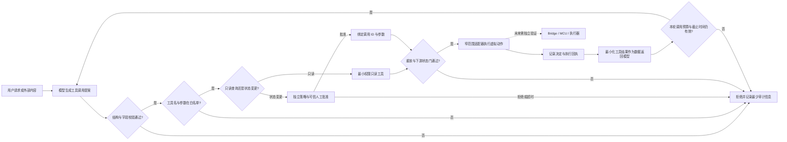

# 第9章 生成式 AI 与工具调用安全边界：从模型建议到受控执行

## 学习目标

完成本章后，你将能够：

1. 区分生成式人工智能（Generative AI，GenAI）给出的工具调用提案与应用实际执行的动作。
2. 为工具调用建立窄范围白名单、严格参数约束和失败关闭路径。
3. 把只读查询、虚拟状态变更和真实硬件动作按风险分层，并将授权与模型输出分离。
4. 使用请求标识、重放阻断和最小化审计记录保护一次性副作用。
5. 用标准库模拟安全策略门，验证允许、拒绝、待批准、冲突和重放等分支。
6. 说明把生成式 AI 接入 Arduino UNO Q 前仍需补齐的身份、权限、目标侧联锁和实机验证证据。

## 背景与边界

### 工具调用是提案，不是执行

大语言模型（Large Language Model，LLM）的自然语言回答通常供人阅读；工具调用则是模型响应中描述“可能要调用哪个工具、参数是什么”的结构化请求。以 OpenAI 应用程序编程接口（Application Programming Interface，API）文档描述的流程为例，应用先把可用工具发给模型，再接收工具调用，由**应用侧代码**执行所选逻辑，把工具结果关联到该调用并交回模型，最后取得模型回答。该流程是 OpenAI API 的说明，不是所有供应商的统一协议，也不意味着模型本身访问了本地引脚或外设。[来源登记](../../resources/references.md#part7-ch09-references)

因此，本书把工具调用看作不可信输入：模型可以建议调用，但不能通过提示词授予自己权限。应用必须在每次副作用发生前独立检查调用名、字段、数据类型、取值范围、调用身份、目标状态和策略；检查失败时拒绝执行并保留最少必要的审计信息。提示词中的“请谨慎操作”不能代替代码中的授权门。

### 结构正确仍不等于安全

JSON（JavaScript Object Notation，JavaScript 对象表示法）Schema（结构描述模式）一类约束可以限制参数形状。某些 API 还提供严格模式来提高输出遵循已声明结构的程度；这仍只回答“参数是否符合这个结构”，不自动回答“此人是否有权操作这个对象”“现在是否允许动作”或“硬件处于什么安全状态”。即使 JSON 格式完全正确，`set_virtual_indicator(color="green")` 也必须由本地策略判断是否允许。

以下威胁面应分开处理：

| 输入或能力 | 可能的问题 | 应由谁控制 |
| --- | --- | --- |
| 用户文本、网页、邮件或感知结果 | 直接/间接提示注入、歧义或误导性上下文 | 应用区分指令与数据；模型输出不作为授权凭证 |
| 模型提出的工具名与参数 | 未知工具、额外字段、越界值或类型混淆 | 应用侧白名单、精确 schema、范围与状态检查 |
| 工具注册表和下游身份 | 工具过多、权限过大、复用高权限账号 | 最小功能、最小权限、按调用身份授权 |
| 写操作或物理动作 | 意外副作用、重复动作、危险时序 | 高影响动作人工批准；幂等/重放控制；下游再次授权 |
| 工具返回内容 | 外部文本继续携带恶意指令或敏感信息 | 最小化返回；作为数据处理；限制后续模型可见范围 |
| 模型/API 凭据 | 密钥泄漏、滥用或费用失控 | 放在受控应用侧；设置配额、超时、调用上限和密钥轮换 |

开放全球应用安全项目（Open Worldwide Application Security Project，OWASP）的 2026 版 LLM 风险清单把“过度代理权”列为风险项之一，涉及工具功能、权限和自主性过量，并建议缩减工具能力、在应用/下游强制授权和按风险设置人工审批。该 PDF 标示为 Version 2026，但封面日期仍待填写；这里把它作为当前可查阅的社区安全指南，而非定稿法规或产品认证要求。美国国家标准与技术研究院（National Institute of Standards and Technology，NIST）的生成式 AI 风险管理档案也强调治理、测试、人类监督与记录；其建议属于自愿风险管理指南，不能替代具体系统的威胁建模和验收。[来源登记](../../resources/references.md#part7-ch09-references)

该清单还把同时接触不可信输入、敏感数据和状态变更/外部通信的配置列为高风险组合，并讨论逐次人工审批。这个筛查有助于识别复杂场景；审批策略仍须结合系统威胁模型确定，不能把单一风险清单机械地当作普遍法规。[来源登记](../../resources/references.md#part7-ch09-references)

### 映射到 Arduino UNO Q 的责任边界

Arduino 官方资料将 Arduino UNO Q 描述为结合 Linux 侧微处理器（Microprocessor Unit，MPU）、微控制器（Microcontroller Unit，MCU）与 Arduino App Lab 的平台；App Lab 可编排 Python 应用、Arduino sketch 和 AI 模型，内置 Bridge 提供 Linux 与 MCU 之间的远程过程调用（Remote Procedure Call，RPC）通信。这些产品资料说明了可组合的架构组成，**不证明**任意 LLM、工具调用服务、认证流程或安全执行策略已内置或兼容。具体镜像、Brick、API、网络和目标硬件组合必须依据相应版本资料验证。[Arduino UNO Q 官方文档](../../resources/references.md#part7-ch09-references)

本章不调用真实模型 API，不连接网络、App Lab、Bridge、MCU、通用输入/输出（General-Purpose Input/Output，GPIO）或执行器。配套程序只接收手工编写的合成请求，并修改进程内的“虚拟指示灯”变量。后文把它映射为 UNO Q 上可进一步设计的参考分层；这只是本书的安全架构建议，不是 Arduino 官方工具调用规范。

开放全球应用安全项目的 Agent Control Standard（ACS）可作为策略钩子设计的探索材料，但截至本章核验的公开仓库 v0.1.0 示例，Guardian 通信通道未认证，示例默认故障策略为继续（`proceed`）。因此它不是可直接部署的安全边界；采用任何类似组件前，都要核对具体版本、身份保护和故障时是否拒绝执行。[来源登记](../../resources/references.md#part7-ch09-references)

## 操作与实验

### 一次调用经过哪些门

建议把处理顺序固定下来，任何一步不确定时都失败关闭（fail closed，即不执行副作用）：

1. **接收完整提案**：只处理已完整组装的调用，不把流式传输中的半截参数送给工具。
2. **验证结构**：要求对象类型、必需字段和允许字段完全匹配；拒绝额外字段、畸形值或超限请求。若入口接收原始 JSON 文本，还应在解析前限制字节数并拒绝重复键。本章模拟器接收已经解析的 Python 字典，只演示字段/类型检查，不实现原始文本解析器或请求大小限制。
3. **查工具白名单**：按注册表精确匹配工具名；禁止模型构造任意命令、URL、文件路径、函数名或 Bridge 方法。
4. **校验参数和当前状态**：检查类型、枚举、数值范围、目标身份、数据新鲜度和当前安全状态；模型置信度不是授权依据。
5. **分离读与写**：低风险只读工具也应遵循用户权限和数据最小化；会改变状态的工具先暂停，由可信应用界面或策略服务提供绑定此调用的批准。
6. **阻断重放并执行窄动作**：为调用建立唯一 ID 和内容指纹；相同 ID 的相同请求最多产生一次副作用，同 ID 携带不同内容则拒绝。为代理循环设置总调用次数、截止时间和资源预算，防止工具链无界延伸；实际下游也需要自身幂等和权限检查。
7. **记录与回传**：审计记录只保留排查所需的调用 ID、工具、决定、批准主体和时间等，不默认保存完整提示词、密钥或不必要的个人数据。返回给模型的工具结果仍按不可信数据处理。

工具调用能力适合“由确定性程序完成、接口狭窄、权限可限制”的动作。若目标只是生成解释或建议，普通文本生成可能已经足够，不必授予工具权限。

### 离线模拟：读取状态与请求改变虚拟指示灯

模拟请求采用简化结构：

```json
{
  "call_id": "demo-write-001",
  "name": "set_virtual_indicator",
  "arguments": {"color": "green"}
}
```

对象只表示一个待审查的提案。批准不是这个 JSON 的字段，而是由调用者在单独参数中提供的教学对象。真实应用必须从受信任的登录会话/审批界面取得授权，绑定调用 ID、具体动作、参数、目标和有效期；不能把模型回传的 `approved: true`、自然语言同意或任意字符串当作身份认证。

代码说明
- 用途：模拟只读状态查询与一个受限的虚拟状态写入；校验工具白名单和参数，要求单独批准，按调用 ID 阻断重放并记录最少审计字段。
- 运行环境：Python 3.10 或更新版本；本次验证环境为 Python 3.14.6。
- 文件位置：[模拟器](../../code/第7篇_AI/第9章_生成式AI与工具调用安全边界/tool_guard.py)、[行为测试](../../code/第7篇_AI/第9章_生成式AI与工具调用安全边界/test_tool_guard.py)、[代码说明](../../code/第7篇_AI/第9章_生成式AI与工具调用安全边界/README.md)。
- 依赖：仅 Python 标准库；不安装模型 SDK、推理运行时或 Arduino 库。
- 操作步骤：在代码目录中运行模拟器和测试；程序将单行 JSON 报告写到标准输出，不写文件。命令行界面（Command-Line Interface，CLI）仅接受固定演示流程，不提供远程调用入口。
- 预期输出：范围为 `SIMULATION_ONLY`；只读调用执行，虚拟写操作先得到 `APPROVAL_REQUIRED`，独立批准后才改变模拟变量；相同调用的再次提交为 `DUPLICATE_BLOCKED`。
- 故障排查：未知工具、额外字段、非法颜色、调用 ID 冲突或无效批准都不会改变虚拟状态；不要通过放宽白名单或让模型自报批准来消除阻断。
- 验证方式：运行 12 项 `unittest` 行为测试，并检查 CLI 输出可解析为 JSON、声明没有模型 API、网络或硬件 I/O。

```shell
python -B tool_guard.py
python -B -m unittest -v test_tool_guard.py
```

核心调用方式如下。`OperatorApproval` 与模型提案分开传递；这只演示接口分离，并没有实现用户登录或真正的授权服务：

```python
from tool_guard import OperatorApproval, ToolCallGuard

guard = ToolCallGuard()
proposal = {
    "call_id": "demo-write-001",
    "name": "set_virtual_indicator",
    "arguments": {"color": "green"},
}

pending = guard.dispatch(proposal)  # APPROVAL_REQUIRED；状态仍为 off
approval = OperatorApproval(
    call_id="demo-write-001", actor="operator-demo", approved=True
)
executed = guard.dispatch(proposal, approval=approval)  # 仅改内存中的模拟状态
replay = guard.dispatch(proposal, approval=approval)  # DUPLICATE_BLOCKED
```

> 教学代码的 `actor` 是调用者提供的普通字符串，数据类也可由任意本地代码构造；本例没有认证、会话绑定、签名、授权服务或持久存储。重放表只在当前进程内有效，进程重启会丢失；真实系统必须使用经过认证的批准来源、持久幂等记录和下游强制策略。

本机固定案例的结果如下：

| 步骤 | 请求 | 状态 | 可观察结果 |
| --- | --- | --- | --- |
| 1 | `read_virtual_status` | `EXECUTED` | 返回虚拟状态，写入次数仍为 0 |
| 2 | `set_virtual_indicator(green)`，不传批准 | `APPROVAL_REQUIRED` | 不执行；指示灯仍为 `off` |
| 3 | 对同一 `call_id` 单独提供演示批准 | `EXECUTED` | 进程内变量变为 `green`，写入次数为 1 |
| 4 | 重放同一调用 | `DUPLICATE_BLOCKED` | 写入次数仍为 1 |
| 5 | 未知工具、越权字段或同 ID 改参数 | `REJECTED` / `CALL_ID_CONFLICT` | 不访问工具，不改变状态 |

测试中的工具和批准均由固定夹具构造，不调用生成模型。通过测试只说明本地策略模拟符合列出的断言，不能证明真实代理、用户身份、API 安全或 UNO Q 兼容性。

### 面向实机的参考分层

若将来把模型建议接入 UNO Q，建议先保持职责分离：

```text
模型 / 云端或本地生成服务
        │ 不可信的结构化提案
        ▼
Linux 应用侧策略门：身份、工具白名单、schema、参数/状态、批准、限速、审计
        │ 仅调用具体、窄范围适配器
        ▼
Bridge / MCU：再次检查运行模式、硬限位、超时、看门狗与安全停机
        │
        ▼
外设或执行器
```

这不是把所有动作都放进人工确认的意思：风险低且权限受限的读取可以由预先批准策略处理；写操作、运动控制、解锁、配置变更或不可逆动作则应有显式、针对本次动作的批准及硬件侧约束。MCU 的限位、互锁、看门狗和急停不能依赖网络模型、Linux 进程或提示词持续正常。通信失败、审批超时、模型重试、状态过期或 Bridge 不可用时，应进入事先定义的安全状态，不得自动重放旧动作。

实际接入前还要验证目标镜像、App Lab/Brick 接口版本、运行时依赖、设备身份、凭据存储、网络隔离、速率/成本上限、数据保留策略、日志脱敏、掉线行为、恢复流程和执行器失效安全。Arduino 官方平台资料不替代这些应用自身的安全设计或目标板验证。

### Fig-51：从模型提案到受控工具执行

图中“模型建议”和“应用执行”是两个独立阶段；只有窄范围白名单、输入校验、独立授权和重放/下游策略门全部满足后，才允许进入本章的虚拟动作。虚线目标设备仅表示将来需要另行验证的架构边界。

<a id="fig-51-uno-q-ai-tool-call-guard"></a>

> 图示占位：图号=Fig-51；位置=本段之后；内容=模型提案经结构校验、工具白名单、人工批准和重放门后进入虚拟动作；真实 Bridge/MCU/执行器仅以待验证边界表示；来源=第七篇图示资源登记中的 Fig-51 Mermaid（本书原创）。



图源：[Fig-51 Mermaid 源文件](../../diagrams/uno-q-ai-tool-call-guard.mmd)。虚线不表示本章实现或验证了真实控制链；本图是本书参考安全流程，不是 Arduino、OpenAI、NIST 或 OWASP 的官方发布规范。SVG 尚未渲染和目视审阅。

## 验证结果与范围

配套的 12 项标准库测试覆盖：只读调用、写操作待批、匹配/不匹配批准、明确拒绝、模型自批字段、未知工具、参数约束、重放、调用 ID 内容冲突、审计字段和 CLI 报告。样例程序只处理本地固定对象，并修改进程内虚拟状态。

本章保持 `draft`。没有真实生成模型、API 凭据、网络请求、工具服务、App Lab、Brick、Bridge、MCU、GPIO、UNO Q 板卡或执行器参与；没有验证身份提供程序、真实人工批准、持久化重放表、真实传感器、物理安全互锁、模型质量、时延、成本或实机兼容性。CLI 中的 `hardware_io=false` 是程序范围声明，不是对操作系统或硬件环境的独立安全认证。

## 常见问题

### 模型返回了格式正确的工具调用，为什么还要校验？

格式约束只保证有限的结构条件。工具名可能不在允许集合内，参数可能与用户权限、当前设备状态、调用目标或安全边界冲突；严格 JSON Schema 不是身份认证、授权或硬件联锁。

### 提示词已经写了“不要操作危险设备”，是否还要策略门？

要。提示是模型行为引导，不是强制执行边界。外部内容可能改变模型输出，模型也可能误解任务。所有副作用必须在代码和下游权限层重新校验；高影响动作在执行前暂停并由可信主体确认。

### 是否所有工具都必须人工批准？

不一定。读取型工具可以使用用户范围内的最小权限和确定性策略，但仍要检查数据敏感度与访问身份。风险较高、不可逆或会改变物理状态的动作，应采用更严格的批准和独立保护。风险分级要由具体应用定义，不能由模型自己下结论。

### 这份模拟器能作为 UNO Q 硬件控制代码吗？

不能。它没有 Arduino 库、Bridge 或设备 I/O；批准对象不是认证凭据，重放状态不持久，也没有 MCU 侧限位或急停。把示例接到真实执行器前，必须另做威胁建模、权限实现、失效安全设计、实机联调和验收。

## 延伸阅读

- [OpenAI Function Calling 文档](../../resources/references.md#part7-ch09-references)：查看模型如何提交函数工具请求、应用侧如何执行并回传结果；API 行为只适用于其文档范围。
- [OWASP GenAI LLM Top 10 2026](../../resources/references.md#part7-ch09-references)：阅读 LLM03“Excessive Agency”及相邻风险；本章注明所查 PDF 封面仍未填写发布日期。
- [OWASP Agent Control Standard](../../resources/references.md#part7-ch09-references)：了解运行时策略钩子的探索方向；其参考仓库披露了未认证 wire 和默认 fail-open 等限制，不可视为即插即用的生产防护。
- [NIST AI RMF Generative AI Profile](../../resources/references.md#part7-ch09-references)：了解生成式 AI 风险治理、测试、监督和记录方面的自愿指南。
- [Arduino UNO Q 与 App Lab 官方资料](../../resources/references.md#part7-ch09-references)：核对 Linux/MCU、App Lab 与 Bridge 平台组成；这些资料不证明本章安全工具调用模拟器可直接部署。
- [第七篇第3章](./第3章_模型工件与部署契约_从清单到目标预检.md)：回看模型与运行环境身份、目标预检和部署证据。
- [第七篇第5章](./第5章_端侧推理性能评估_从测量方案到资源预算.md)：回看测量工作负载和证据边界。
