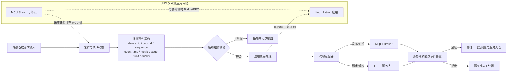

# 第1章 IoT 开发基础：从采样数据到可验证遥测

物联网（Internet of Things，IoT）系统并不是“让开发板连上 Wi-Fi”就完成了。一个可维护的数据链还要回答：这条测量来自哪台设备、何时发生、采用什么单位、属于哪个格式版本、网络重复或中断后如何处理，以及服务端凭什么接受它。本章从一条人工合成的温度记录出发，建立这些问题的最小共同语言。

## 学习目标

完成本章后，你将能够：

1. 画出从采集端、边缘应用、网络传输到服务端处理的 IoT 数据路径，并标明每一层的责任边界。
2. 为遥测事件定义可演进的载荷契约，区分设备身份、启动代次、事件序号、事件时间、测量值、单位和质量标记。
3. 解释消息队列遥测传输（Message Queuing Telemetry Transport，MQTT）的交付等级与应用层幂等/业务处理不是同一个保证。
4. 使用本章的标准库校验器验证一条合成 JSON 载荷，并理解 `VALID` 的有限含义。
5. 列出走向真实设备、网络和云端前还必须完成的安全、时钟、单位、持久化及目标环境验证。

## 背景与边界

### IoT 是端到端系统，不是单个网络接口

典型遥测路径可以拆成采集、事件建模、边缘处理、传输、服务端入口、持久化/分析和运维观察。每层都有自己的失败方式：传感器可能断线或漂移；设备时钟可能未同步；网络可能中断、重连或重复发送；服务端可能拒绝旧格式；应用还可能把摄氏度误当成华氏度。只验证“Wi-Fi 已连接”不能证明数据正确到达并被正确解释。

[Arduino UNO Q 产品资料](../../resources/references.md#第八篇第1章补充核验)描述了 Linux 侧微处理器（microprocessor unit，MPU）与微控制器（microcontroller unit，MCU）的双侧架构；[Arduino App specification](../../resources/references.md#第八篇第1章补充核验)把 Sketch 的低层硬件交互放在 MCU 侧，把 Python、Brick 和容器放在 Linux 侧，二者可通过远程过程调用（Remote Procedure Call，RPC）消息协作。这帮助我们安排工作位置，但不意味着所有传感器都必须接 MCU、所有网络请求都由 Linux 侧发送，或 Bridge/RPC 自动等于 MQTT 上报。具体路径取决于外设、应用和目标环境。

以下图示是一个**参考架构**。对采用 UNO Q 双侧应用的项目，只有当数据需要跨 MCU/Linux 边界时，才需要相应的 Bridge/RPC 通信；设备侧网络客户端也可能部署在不同的软件层。图并不是自动生成的 Arduino 工程或产品能力保证。

### 把测量变成事件

传感器给出的数值还不是一条完整的遥测事件。接收方至少需要知道“谁、何时、什么量、数值、单位，以及读数状态”。本章示例采用如下教学契约：

| 字段 | 示例 | 设计意图 | 不能据此断言 |
| --- | --- | --- | --- |
| `schema_version` | `1` | 解释载荷字段和语义所需的契约版本 | 版本号不会自动迁移旧数据 |
| `device_id` | `sensor-01` | 应用分配的逻辑设备标识 | 它不是认证凭据，也不证明设备真实身份 |
| `boot_id` | `boot-a7` | 区分同一设备不同启动代次 | 示例值不是持久、随机或防伪的启动标识 |
| `sequence` | `42` | 在一个启动代次内标记事件顺序 | 它不单独提供全局唯一性或可靠时钟 |
| `event_time` | `2026-09-24T10:30:00+08:00` | 表示事件发生时间，并带协调世界时（Coordinated Universal Time，UTC）关系 | 格式正确不证明设备时钟准确 |
| `metric` / `value` / `unit` | `temperature` / `23.75` / `degC` | 明确测量项、数值和单位 | 校验器不验证传感器校准或单位换算 |
| `quality` | `GOOD` | 记录采集端声明的数据质量类别 | 该字符串本身不是真实质量证据 |

`device_id + boot_id + sequence` 在此模型中组成便于追踪和去重的事件键。要让它在真实系统里可靠，设备必须制定启动标识生成、持久化、碰撞检查、重置和替换规则。若设备恢复出厂后复用标识，或重启时复用同一 `boot_id`，键就可能碰撞。不要把可读 ID 当作秘密或身份认证；认证、授权和防伪需要独立机制。

事件时间与服务端接收时间也应分开保存。设备可以给 `event_time` 使用带 `Z` 或数字时区偏移的互联网时间戳格式；服务端另记 `received_at`。两者相差可能反映网络延迟、缓存或设备时钟误差，不能简单覆盖成一个字段。[RFC 3339](../../resources/references.md#第八篇第1章补充核验)定义了与协调世界时（Coordinated Universal Time，UTC）有明确关系的互联网时间戳格式。本章校验器支持其中一个明确子集：大写 `T`、秒、最多六位小数和明确偏移；为简化标准库演示，不支持闰秒，也拒绝表示本地偏移未知的 `-00:00`。这只是教学契约，不是所有 IoT 系统必须采用的时间策略。

### 载荷契约和传输协议分层

JavaScript 对象表示法（JavaScript Object Notation，JSON）是本章用于说明字段的文本格式。它只回答“消息内容怎样表示”，不负责把消息送到哪里。主题（topic）、认证、加密连接、重试、缓存、服务端写入和设备授权属于其他层。超文本传输协议（Hypertext Transfer Protocol，HTTP）和 MQTT 可作为不同的传输选择；选协议不会自动定义载荷字段。

MQTT 是发布/订阅消息传输协议，发布者把消息发送给代理（broker），代理再按订阅关系分发。其服务质量（Quality of Service，QoS）等级描述 MQTT 传输链路上的交付语义；[OASIS MQTT 5.0 标准](../../resources/references.md#第八篇第1章补充核验)定义 QoS 0 为至多一次、QoS 1 为至少一次，QoS 2 使用协议握手避免该协议交换中的重复交付。重要的是：QoS 1 允许重复，QoS 2 不会替你保证数据库写入、告警、计费或设备动作的端到端业务只执行一次。跨系统仍需事件键、去重/幂等策略、持久化和明确的确认边界。

| 机制 | 能帮助处理 | 不能替代 |
| --- | --- | --- |
| MQTT QoS / 协议确认 | 传输端的交付流程与确认 | 应用去重、服务端事务、业务结果确认 |
| `event_key` / 幂等记录 | 识别重放到应用层的同一事件 | 设备认证、数据真实性、无限期全局唯一 |
| 本地缓存/发件箱 | 在约定条件下暂存等待发送的数据 | 不间断供电、无限存储、自动解决冲突 |
| 传输层安全（Transport Layer Security，TLS）与主题访问控制 | 保护传输通道并限制访问范围 | 载荷模式正确、传感器校准、应用逻辑安全 |

本章只解释协议与载荷的分层关系，不建立 MQTT 连接，也不配置 broker、证书、主题或重试队列。主题组织、QoS 语义、保留状态与消费者幂等见[本篇第2章](./第2章_MQTT消息上报与幂等消费_从主题设计到重复投递.md)。协议选择、连接生命周期、重连与缓存策略应结合数据频率、时效、丢失代价、带宽、功耗、平台支持和运维能力逐项确定。

## 实验：校验一条离线遥测载荷

实验数据保存在[合成载荷](../../code/第8篇_IoT/第1章_IoT开发基础/telemetry_sample.json)。其中 `23.75 degC`、设备标识和时间都由作者编写，不是传感器读数。校验器只用 Python 标准库检查一个使用 8 位 Unicode 转换格式（Unicode Transformation Format 8，UTF-8）编码的 JSON 对象是否符合本章的字段契约。

代码说明
- 用途：检查有限大小的 UTF-8 JSON 遥测对象，拒绝重复键、非标准数值、字段不匹配和明显类型错误。
- 运行环境：Python 3.10 或更新版本；本次验证环境为 Python 3.14.6。
- 文件位置：[校验器](../../code/第8篇_IoT/第1章_IoT开发基础/validate_telemetry.py)、[合成载荷](../../code/第8篇_IoT/第1章_IoT开发基础/telemetry_sample.json)、[测试](../../code/第8篇_IoT/第1章_IoT开发基础/test_validate_telemetry.py)、[代码说明](../../code/第8篇_IoT/第1章_IoT开发基础/README.md)。
- 依赖：Python 标准库；无需安装第三方包。
- 操作步骤：在代码目录运行样例检查和行为测试。命令只读取仓库内固定样例，不接受网络数据或设备输入。
- 预期输出：第一条命令输出 `result=VALID`、`scope=OFFLINE_SCHEMA_ONLY`；测试覆盖有效样例和拒绝路径。
- 故障排查：`INVALID` 的 `reason` 指向本地输入契约失败；不要为得到 `VALID` 而删除必需字段或放宽未知值。程序不发起重试、不写数据库，也不访问网络。
- 验证方式：运行 16 项标准库行为测试，并确认命令行报告仍把范围标为 `OFFLINE_SCHEMA_ONLY`。

```shell
python -B validate_telemetry.py
python -B -m unittest -v test_validate_telemetry.py
```

校验器限制原始载荷不超过 4096 字节，要求顶层对象恰好包含九个字段，并拒绝重复 JSON 成员名、非法 UTF-8、`NaN`/`Infinity`、非有限浮点值、布尔值冒充整数/测量值、无时区时间、未知枚举和额外字段。拒绝未知字段是本例的严格教学策略，不是每种生产系统的唯一兼容策略；真实系统应明确消费者如何升级和处理新字段。Python 的标准 `json` 解码器默认对重复键采用最后一个值；本例主动用对象键回调拒绝此类输入。[RFC 8259](../../resources/references.md#第八篇第1章补充核验)指出对象成员名应唯一，并说明重复名称会造成接收端行为不确定。

本次本机样例输出：

```json
{"event_key": "sensor-01/boot-a7/42", "reason": null, "result": "VALID", "schema_version": 1, "scope": "OFFLINE_SCHEMA_ONLY"}
```

`VALID` 的唯一含义是：这份输入符合本章有限的结构和类型规则。校验器没有查询设备登记、验证时钟同步、检查测量范围/校准、验证 TLS 或凭据、发送 MQTT/HTTP 请求、确认服务端写入、检查重复事件，也不授权控制动作。字段合法绝不等于数据可信。

## Fig-53：从采样事件到服务端遥测入口

该参考流程展示载荷检查、传输和服务端处理的责任分层，并把本章离线代码与真实 IoT 路径区分开。网络中断后的缓存/重试和远程运维命令不在本章实现范围内。

<a id="fig-53-uno-q-iot-telemetry-contract"></a>

> 图示占位：图号=Fig-53；位置=本段之后；内容=传感器采样形成带身份、启动代次、序号、时间、值、单位和质量的事件，经过边缘契约门与可选 MCU/Linux 协作，再由 MQTT/HTTP 传输至服务端校验、去重和观测；来源=本书原创，平台与协议边界见参考资料索引。



图源：[Fig-53 Mermaid 源文件](../../diagrams/uno-q-iot-telemetry-contract.mmd)。MCU/Linux 虚线只表示一种可选应用部署边界，不表示传感器一定接 MCU，也不表示 RPC 是网络上报协议。HTTP 和 MQTT 是传输选项，不改变同一载荷契约的字段语义。图为本书原创参考架构，不是任何相关产品或标准组织发布的官方系统图；SVG 尚未渲染和目视审阅。

## 验证结果与范围

本章 16 项标准库测试覆盖有效载荷、非字节输入、大小上限、UTF-8、畸形/非标准 JSON、重复键、根节点、字段集合、版本类型、设备/启动标识、序号、时区时间戳、布尔/非有限读数、指标/单位/质量枚举以及 CLI 样例。测试只证明本机 Python 代码符合这些教学断言。

本章处于 `draft`。未读取或控制真实传感器、未连接 Wi-Fi、MQTT broker、HTTP 服务或互联网，未验证 UNO Q 网络配置、Bridge/RPC 实机通信、传输加密、设备身份、证书轮换、数据持久化、服务端幂等/数据库事务、时钟精度、采样率、校准、单位本体或远程命令。图示 SVG 尚未生成或视觉审阅。

## 常见问题

### `device_id` 能直接使用介质访问控制（Media Access Control，MAC）地址吗？

不要把可读标识当作认证凭据。项目应单独决定逻辑标识的生成、隐私暴露、替换与登记方式；认证秘密应通过安全的凭据管理和访问控制处理。本章示例的 `sensor-01` 是虚构标签。

### 设备重启后，`sequence` 从零开始会不会冲突？

因此示例把 `sequence` 与 `boot_id` 配对。真实系统仍需保证启动代次在相关保留期限和设备替换场景下不会错误复用；如果做不到，就应使用持久序号或另外定义更强的事件标识和冲突处理。

### MQTT QoS 2 是否能保证业务只执行一次？

不能。它定义 MQTT 协议交换中的交付语义，不替代从设备、broker、消费者到数据库/执行器的完整业务事务。订阅端仍应按事件身份实现重复检测和幂等，并验证结果持久化及故障恢复。

### 校验器显示 `VALID`，是否可以把值写入生产数据库？

不能仅凭本章结果作此决定。你还需要确定设备身份、授权、加密、字段和单位语义、时间质量、测量校准、重放处理、留存策略、隐私/安全要求及生产服务端行为。当前报告明确限定为离线结构校验。

## 延伸阅读

- [Arduino UNO Q 产品资料与 Arduino App specification](../../resources/references.md#第八篇第1章补充核验)：理解 MCU 与 Linux 应用侧职责及可选 RPC 边界。
- [OASIS MQTT 5.0 标准](../../resources/references.md#第八篇第1章补充核验)：核对发布/订阅、QoS 和传输确认语义。
- [RFC 8259 JSON](../../resources/references.md#第八篇第1章补充核验)与 [RFC 3339 时间戳](../../resources/references.md#第八篇第1章补充核验)：查阅互操作载荷和明确时间偏移的规范背景。
- [第二篇第3章 ADC 与模拟采样](../第2篇_STM32/第3章_ADC与模拟采样_从电压读数到可验证数据.md)：回顾 MCU 模拟测量路径；其输入范围与校准不能由本章 JSON 校验器推断。
- [第三篇第2章 Linux 设备、网络与服务](../第3篇_Linux/第2章_Linux设备网络与服务_从可见到可用.md)与[第四篇第1章 Python Bridge](../第4篇_PythonBridge/第1章_Python_Bridge开发基础_消息模型与调用边界.md)：延伸阅读服务边界和板内跨侧通信。
