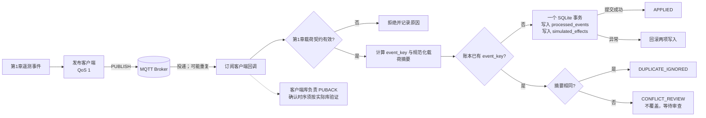

# 第2章 MQTT 消息上报与幂等消费：从主题设计到重复投递

上一章定义了遥测事件的身份、数据字段和有限校验规则。本章把这条事件放入 MQTT 发布/订阅链路，继续回答三个实际问题：主题怎样组织、QoS 到底保证什么、重复消息如何避免重复写入业务记录。示例使用人工合成消息和本地 SQLite，不连接 MQTT Broker 或 Arduino UNO Q。

## 学习目标

完成本章后，你将能够：

1. 设计可读、可授权、便于订阅的 MQTT 主题，并区分发布主题名和订阅过滤器。
2. 解释 QoS 0、QoS 1、QoS 2 的协议交付含义，以及发布端、Broker、订阅端之间的确认边界。
3. 区分保留消息、会话队列和应用数据库中的事件历史。
4. 复用[第1章的事件键](./第1章_IoT开发基础_从采样数据到可验证遥测.md)实现消费者去重，并把去重账本与同一数据库中的模拟业务写入放在一个事务内。
5. 识别同键异载荷冲突、确认时序和数据库之外副作用仍需单独设计的情形。

## 1. 从事件契约到 MQTT 发布/订阅

MQTT 是轻量发布/订阅消息传输协议。发布者把带有主题名和载荷的 Application Message 交给 Broker；Broker 根据订阅关系把消息分发给一个或多个客户端。协议不规定 JSON 字段、温度单位、设备身份认证或业务数据库结构，因此传输前仍要遵守[第1章的遥测契约](./第1章_IoT开发基础_从采样数据到可验证遥测.md)。

下面用一个教学主题表示实验环境中的遥测流：

```text
demo/v1/devices/sensor-01/telemetry
```

可以把层级读作“演示环境 / 主题契约版本 / 设备 / 设备标识 / 遥测”。主题适合承载路由和授权需要的稳定维度；事件时间、启动代次、序号、测量值、单位、质量和模式版本仍放在载荷里。若主题里再加入指标名，例如 `.../telemetry/temperature`，订阅者可以更细分，但主题规则、ACL 和客户端订阅也要一起维护。本书示例选择一个设备遥测主题，让载荷里的 `metric` 决定测量类型。

MQTT 中 `/` 分隔主题层级，主题名区分大小写；发布主题名不能含通配符。订阅过滤器可以使用 `+` 匹配一个层级、使用末尾的 `#` 匹配后续多个层级。因此 `demo/v1/devices/+/telemetry` 可以匹配一个设备层级，而 `demo/v1/#` 覆盖范围很广，通常不应在生产应用里不加审查地使用。[OASIS MQTT 5.0 标准第4.7节](../../resources/references.md#第八篇第2章补充核验)定义了主题层级和过滤器规则。主题结构只是寻址方案，不是安全控制；Broker 仍需单独配置客户端身份认证、发布/订阅 ACL、TLS 和密钥轮换。载荷里的 `device_id` 也不能因为与主题相同就自动成为可信身份。

实际消费时，应至少检查：客户端是否有权订阅该过滤器；发布客户端是否只可向获准设备主题发布；主题中的设备标识是否与通过第1章结构校验后的载荷标识一致；越权、未知版本和字段冲突是否进入拒绝或审查路径。客户端凭据与设备身份的映射方式取决于部署，不由主题字符串本身提供。

## 2. QoS：传输确认不是业务提交

MQTT 定义三个 QoS 等级。它们描述一段 MQTT 客户端—服务器的消息交付流程，不是“整个业务链只执行一次”的开关。[标准第4.3节](../../resources/references.md#第八篇第2章补充核验)描述的交付对象是单一发送方到单一接收方；Broker 向多个订阅客户端分发时，各接收关系分别处理，且服务器可按订阅授予的最大 QoS 降低该段交付等级。

| QoS | 协议含义 | 工程取舍 |
| --- | --- | --- |
| 0 | 至多一次；不等待接收确认，也不按 QoS 级别重发。消息可能到达一次，也可能丢失。 | 适合很快会被下一次采样替代、允许单点缺失的读数；不适合把它当可靠告警队列。 |
| 1 | 至少一次；接收端以 `PUBACK` 确认，未完成的交换可能重发，所以应用可能看到重复消息。 | 常见遥测选择；消费者必须按应用事件身份去重。 |
| 2 | MQTT 协议提供恰好一次交付流程，使用 `PUBLISH`、`PUBREC`、`PUBREL`、`PUBCOMP` 完成更长的握手。 | 协议开销更高；仍不把数据库事务、外部 API 或设备动作纳入同一个端到端原子操作。 |

QoS 1 的 Packet Identifier（报文标识符）是协议交换中的短期标识，确认完成后可复用；它不是第1章的 `device_id/boot_id/sequence` 事件键，也不能用来跨重启、跨连接或跨消费者做业务去重。`DUP` 标记帮助协议识别重发控制包，也不能取代载荷级事件身份。更重要的是，如果发送方没有收到协议确认，就可能再次发送；接收端无法仅靠“看起来相同的 Packet Identifier”判断是否是同一业务事件。

QoS 也不等于数据留存。非零 Session Expiry Interval 可让 MQTT 会话状态在网络断开后保留一段时间，服务器会按协议和实现能力维护待处理状态；会话到期、存储限额、Broker 管理策略或客户端身份变化都可能改变恢复结果。业务需要的长期历史、审计和离线补传策略，应由应用持久化与运维配置明确承担。详见标准第3.1.2.11.2节和第4.1节。

## 3. 保留状态不是事件历史

Retain（保留消息）适合表达“当前值”或“最新状态”：Broker 为某个主题保存最近一条保留消息，新订阅者建立订阅时可收到匹配主题的当前保留值。它不是该主题的完整事件日志；连续发布的多个保留读数不会自动变成可回放历史。若空载荷以 Retain 发布，可用于清除该主题当前保存的保留消息。[OASIS 标准第3.3.1.3节](../../resources/references.md#第八篇第2章补充核验)说明了该行为。

一个常见约定是：周期性测量事件发布到 `.../telemetry`，通常不设置 Retain；设备在线状态或最新配置摘要发布到单独的 `.../state`，由项目决定是否保留。订阅端必须按数据语义区分“新发生的事件”和“订阅时补发的当前状态”，不能因为收到一条消息就把它当作刚刚采集的传感器读数。若确实要重建历史，应使用明确的数据库、事件日志或有界缓存，而不是把 Retain 当消息仓库。

## 4. 消费者幂等：先验证，再用一个事务落账

本书继续复用第1章定义的事件键：

```text
event_key = device_id + "/" + boot_id + "/" + sequence
```

启动代次不可省略：设备重启后序号可以从头开始，而不同 `boot_id` 下的同一序号代表不同事件。时间戳也不适合作唯一键，因为设备时钟可能回拨、未同步或只保留有限精度。

消费者的最小决策流程如下：

1. 依据连接身份、Broker ACL 和主题规则确定消息是否可接收；核对主题设备标识与载荷中的设备标识。
2. 调用第1章的结构校验器，拒绝格式错误、未知模式或不合契约的载荷。结构校验通过仍不证明传感器读数真实。
3. 在消费者数据库内计算稳定事件键和规范化载荷摘要，然后开启事务并查询事件账本。
4. 键不存在：在同一个事务中写入 `processed_events` 账本和本章的 `simulated_effects` 记录，再提交。
5. 键已存在且摘要相同：返回 `DUPLICATE_IGNORED`，不重复写业务效果。键相同但摘要不同：返回 `CONFLICT_REVIEW`，不覆盖旧记录，也不自动选择新载荷。
6. 数据库操作出错：回滚账本和模拟业务记录；后续是否重投及何时发送 `PUBACK`，必须结合实际 MQTT 客户端库的确认模式验证。

把两个数据库写入放进同一事务，才能避免“去重标记已保存、业务记录却没写入”或相反的半完成状态。SQLite 事务提供单个数据库事务内的原子提交/回滚；[SQLite 事务文档](../../resources/references.md#第八篇第2章补充核验)与 [Python `sqlite3` 事务控制文档](../../resources/references.md#第八篇第2章补充核验)分别说明数据库和 Python 接口边界。这个例子只能保护同一个本地 SQLite 数据库里的两项写入。若业务效果是发邮件、调用远端 HTTP、再次发布 MQTT 或驱动 GPIO，SQLite 无法与这些外部副作用自动组成原子事务；应另行设计事务发件箱、下游幂等键、状态机或人工恢复流程。

还要验证 MQTT 库的确认时序。某些客户端库会在应用回调之前自动确认；另一些支持应用控制确认。若应用数据尚未持久化，协议确认就已发出，随后进程崩溃，Broker 可能不再重送该消息。反过来，数据库已提交而确认包未能完成时，重送会再次到达，事件账本应把它识别为重复。本章模拟器不实现 MQTT ACK，也不替任何客户端库作确认顺序保证。

## 实验：模拟 QoS 1 重复投递

实验输入 [qos1_redelivery.jsonl](../../code/第8篇_IoT/第2章_MQTT消息上报与幂等消费/qos1_redelivery.jsonl) 包含两行完全相同的人工合成遥测事件，用于模拟订阅端重复收到同一 QoS 1 载荷。它不是 MQTT 抓包，也没有 Packet Identifier、Broker 或网络重传过程。

代码说明
- 用途：复用第1章校验器；以事件键和规范化载荷 SHA-256 识别重复或同键冲突；在一个 SQLite 事务中写入去重账本和模拟业务记录。
- 运行环境：Python 3.10 或更新版本；仅使用标准库 `sqlite3`、`json`、`hashlib` 等。
- 文件位置：[消费者](../../code/第8篇_IoT/第2章_MQTT消息上报与幂等消费/idempotent_consumer.py)、[重复投递样例](../../code/第8篇_IoT/第2章_MQTT消息上报与幂等消费/qos1_redelivery.jsonl)、[行为测试](../../code/第8篇_IoT/第2章_MQTT消息上报与幂等消费/test_idempotent_consumer.py)、[代码说明](../../code/第8篇_IoT/第2章_MQTT消息上报与幂等消费/README.md)。
- 依赖：Python 标准库；无需安装 MQTT 客户端或第三方包。
- 操作步骤：进入代码目录运行默认演示和本章行为测试。默认演示在临时目录创建 SQLite 文件并在退出时清理，不改写仓库数据。
- 预期输出：两条 JSON 结果依次为 `APPLIED` 与 `DUPLICATE_IGNORED`，范围均为 `OFFLINE_QOS1_REDELIVERY_SIMULATION`。
- 故障排查：`INVALID_REJECTED` 表示第1章载荷契约拒绝输入；`CONFLICT_REVIEW` 表示同事件键出现不同规范化载荷，需人工审查，不自动覆盖；SQLite 异常会使当前事务回滚。
- 验证方式：5 项测试覆盖首次与重复投递、新启动代次、同键异载荷冲突、数据库写入失败回滚，以及两个独立进程共用账本时的重复抑制。

```shell
python -B idempotent_consumer.py
python -B -m unittest -v test_idempotent_consumer.py
```

SQLite 文件演示持久账本可在进程退出后供新进程复用，但不等于保证任意断电、文件系统损坏或存储设备故障下的数据恢复。真实部署需要评估磁盘空间、备份、保留期限、权限、数据库锁争用、同步/写入模式和迁移策略。账本还必须至少保留到系统不再接受相同事件重放为止；过早清理会重新开放重复副作用窗口。

## Fig-54：MQTT 重复投递与消费端事务门

此图把发布/订阅传输、事件键查重、同库原子写入和冲突审查分开。协议确认由客户端库负责，应用必须验证它与持久提交的先后关系。

<a id="fig-54-uno-q-mqtt-idempotent-consumer"></a>

> 图示占位：图号=Fig-54；位置=本段之后；内容=合成事件经 QoS 1 发布和 Broker 到达消费者后，经过第1章契约检查，以 event_key 和载荷摘要分流为首次原子落账、相同重复忽略或冲突人工审查；来源=本书原创，QoS、主题及保留消息边界见参考资料索引。



图源：[Fig-54 Mermaid 源文件](../../diagrams/uno-q-mqtt-idempotent-consumer.mmd)。本图的重复消息由固定 JSONL 样例模拟，不代表协议抓包或 Broker 运行结果；数据库只模拟本地业务效果。未实现 MQTT 客户端确认、不保证外部副作用恰好一次。SVG 尚未生成和目视审阅。

## 验证结果与范围

本章 5 项标准库行为测试覆盖：同事件首次处理与重复忽略；`boot_id` 变化后同序号形成新事件；同键异载荷进入审查而不增加记录；模拟业务表写入失败时账本与业务表一并回滚且可安全重试；两个独立 Python 进程使用同一个临时数据库时，第二次投递被忽略。测试通过只证明本机离线实现满足这些断言。

本章仍为 `draft`。未连接 MQTT Broker、网络或真实订阅客户端；未验证 TLS、认证、ACL、客户端重连、Broker 会话存储、服务端配额、QoS 包级顺序、真实 PUBACK 时序、消息保留、事件积压或现场数据库运行策略。未连接传感器、Bridge/RPC、Linux App 或 UNO Q 实机。SQLite 的原子性范围不包含数据库以外的 API、消息、文件或硬件动作；Fig-54 SVG 尚未渲染审阅。

## 常见问题

### 选择 QoS 2 后还需要事件键吗？

仍需要。QoS 2 保护相应 MQTT 协议交付流程，不会自动把消费者数据库或外部副作用纳入 Broker 的握手事务。应用事件键还能支持跨客户端重启、消息重放、补传和业务审计。

### 收到 `PUBACK` 是否代表数据库已提交？

不一定。协议确认只说明 MQTT 接收端已确认对应协议交换；应用持久化与确认的顺序取决于客户端库和调用方式。必须查阅所选库的确认/回调文档，并通过崩溃和重连测试验证，不能仅凭 QoS 名称推断。

### 保留消息能否代替数据库历史？

不能。保留消息服务于后来订阅者获取主题当前保留值，不会自动保存同一主题的完整时间序列。需要历史时，应为数据保留、查询、备份和删除定义独立存储策略。

### 为什么同一事件键但载荷不同不直接覆盖？

这可能意味着设备错误复用事件键、数据在传输链被错误改写、重复检测实现有误，或来源声明不一致。自动选择新值会掩盖冲突；先保留证据并进入审查，再按项目规则处置更安全。

## 延伸阅读

- [第八篇第1章：IoT 开发基础](./第1章_IoT开发基础_从采样数据到可验证遥测.md)：复习事件契约、事件键与离线载荷校验。
- [OASIS MQTT 5.0 标准](../../resources/references.md#第八篇第2章补充核验)：查阅主题过滤器、QoS、Retain 和 Session 语义。
- [SQLite 事务与 Python `sqlite3`](../../resources/references.md#第八篇第2章补充核验)：核对单库事务、提交/回滚接口及实现边界。
