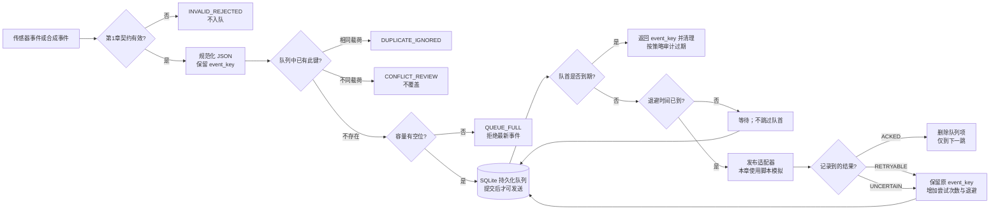

# 第3章 离线缓存与补传：从持久化队列到可验证恢复

第二篇至第七篇已经分别建立 MCU、Linux、Python Bridge、App Lab、OpenCV 和 AI 的基础。本篇前两章则把合成遥测契约送入 MQTT 语境，并在消费端建立事件键与幂等账本。本章继续沿着这条链路向前：当网络或 Broker 暂时不可用，发布端怎样先把事件可靠地留在本机，恢复后怎样按受控节奏补传，以及怎样处理“对方可能已经收到、自己却没拿到确认”的不确定结果。

本章的全部实验仅在本机 Python 和 SQLite 中运行。网络发布结果由脚本显式模拟，不连接 MQTT Broker、Arduino UNO Q、传感器、Bridge/RPC 或外部服务。SQLite 文件演示进程重开后仍能读到已提交队列项，但不证明任意断电、文件系统损坏或存储介质故障下都能恢复。

## 学习目标

完成本章后，你将能够：

1. 区分 MQTT 会话状态与应用自己维护的持久化离线队列。
2. 用 SQLite 保存经过第1章契约校验的遥测事件，并为队列条数、单条载荷大小、过期时间和满队列行为设定明确边界。
3. 设计不丢弃队首事件的 FIFO 补传、确定性指数退避和结果不确定后的重试策略。
4. 解释重试会带来重复消息的原因，并复用第2章的稳定 `event_key` 与消费者幂等处理。
5. 用进程重开、容量溢出、TTL 边界、数据库故障和脚本化发布结果验证本地模型，同时清楚说明它没有验证什么。

## 1. 为什么需要应用侧持久化队列

即使传感器采样正常，发布路径也可能短时中断：Wi-Fi 未连接、路由不可达、DNS 或 TLS 握手失败、Broker 拒绝连接，或应用正在重启。若采样值只存在内存变量中，进程退出就可能丢失尚未发布的数据。应用侧离线发件箱（outbox）把“形成事件”和“尝试发送”分成两个阶段：先校验并提交到本机持久介质，再由一个发布工作循环按序取出待发事件。

这个队列与 MQTT 持久会话不是同一层。MQTT 5.0 为 QoS 1/2 协议交换定义会话状态；会话状态可能包括尚未完成确认的消息和待发送消息，且会话是否保留受连接与 Session Expiry Interval 等规则影响。它不自动替应用保存所有尚未交给 MQTT 客户端的传感器事件，也不是设备侧业务历史数据库。[OASIS MQTT 5.0 标准](../../resources/references.md#第八篇第3章补充核验)要求实现方评估会话存储容量和故障边界。因此，在应用需要跨进程重启保存采样事件时，应明确设计并验证自己的本地持久化策略，而不能仅从“启用了 QoS 1”推断离线事件已经落盘。

本章的处理边界可以概括为：

| 阶段 | 本章模型负责什么 | 仍须由其他层负责什么 |
| --- | --- | --- |
| 事件入队 | 校验第1章遥测契约，规范化 JSON，保存稳定事件键与载荷 | 传感器真实性、校准、设备身份认证与时钟可信度 |
| 离线积压 | 条数与单条载荷上限、满队列拒绝新事件、TTL 到期清理 | 实际磁盘配额、日志告警、闪存寿命、数据保留法规 |
| 恢复补传 | 按 FIFO 选择队首，以退避时间控制下一次尝试 | Broker 地址、TLS、凭据、ACL、客户端库与真实网络状态 |
| 结果处理 | `ACKED` 删除队列项；`RETRYABLE` / `UNCERTAIN` 保留事件并延后 | 协议确认语义、消费者业务提交、外部副作用与端到端审计 |

> 重要：队列容量与载荷限制只约束本实现中的逻辑待处理数据，不等于 SQLite 文件物理大小上限。生产部署还要监控数据库/WAL 文件、磁盘余量和存储写入寿命，并验证具体文件系统与 SQLite 配置。

## 2. 定义队列记录和故障策略

队列不重新发明事件身份，而是使用第1章定义的 `device_id/boot_id/sequence` 事件键。设备重启后 `sequence` 可能归零，`boot_id` 让两个不同启动周期中的事件保持可区分。入队时将载荷规范化为稳定 JSON 文本；相同事件键、相同规范化载荷被视为重复入队，不增加一行；相同事件键但载荷不同进入 `CONFLICT_REVIEW`，不静默覆盖。

SQLite 表中每条活动记录包含：

| 字段 | 用途 |
| --- | --- |
| `sequence` | 本机队列中的追加顺序，用于严格 FIFO。它不是设备事件序号。 |
| `event_key` | 第1章的稳定业务事件身份；跨重试保持不变。 |
| `payload`、`payload_bytes` | 规范化 JSON 和其 UTF-8 字节数。 |
| `created_at`、`expires_at` | 本机 UTC Unix 秒时间及过期时刻；本模型假设系统时钟可用。 |
| `attempts`、`next_attempt_at`、`last_outcome` | 已记录的重试次数、下次允许尝试的时刻及上次结果。 |

队列策略不是唯一答案，本章示例选择一个可审计的教学基线：

- **容量**：最多 3 条待处理事件；单条规范化载荷最多 4096 字节。示例可配置其他小上限。
- **溢出**：队列已满时拒绝最新事件，并返回 `QUEUE_FULL`。不悄悄淘汰更早的数据；调用方必须记录告警或采用经业务批准的降级策略。
- **过期**：`expires_at <= now` 即过期。`expire_due()` 返回过期事件键后删除记录；生产系统应先按审计要求持久记录清理结果，再决定是否删除或转入单独归档。
- **顺序**：总是先处理最早的未过期记录。队首处于退避等待时，不跳过队首去发送更新的记录；这保持顺序，但可能产生队头阻塞。
- **退避**：第 `n` 次已记录的失败后，等待 `min(B × 2^(n-1), Dmax)` 秒。代码没有随机抖动（jitter），多台设备同时重连时生产实现应评估加入抖动，并依据 Broker 限流和网络策略调参。
- **确认**：`ACKED` 只表示发布适配器报告了“发布端到下一跳”的接收结果，示例因此删除队列记录；它不证明订阅者已经执行数据库事务或外部动作。

MQTT QoS 1 定义为至少一次交付，重复可能发生；其 `PUBACK` 是该协议发送方与接收方之间的确认，不是第2章消费者业务数据库的提交证明。[OASIS 对 QoS 1 的协议说明](../../resources/references.md#第八篇第3章补充核验)也提醒：协议包级标识符与载荷级业务事件身份用途不同。此处的稳定 `event_key` 必须贯穿补传，再由消费端幂等账本抑制应用重复。

## 3. 从本地提交到补传状态机

流程的关键不是“不断重试”，而是把每个结果分类并保持可恢复状态：

1. 验证载荷并从契约中取得事件键；无效输入不入队。
2. 在一个 SQLite 写事务中清理已过期项、检查已有事件键、检查容量并追加新事件。
3. 发布循环先记录过期项，再读取队首未过期事件。若队首仍在退避期，暂不取后面的事件。
4. `ACKED`：在本地事务中删除对应队列项；含义限制为发布端到下一跳。
5. `RETRYABLE`：例如适配器明确报告暂时不可用；保留该行、增加尝试次数并安排退避。
6. `UNCERTAIN`：例如发送调用已经开始，但连接中断导致调用方无法判断对端是否收到。仍保留同一事件键并稍后重试，因此对端可能再次收到相同业务事件。
7. 数据库写入失败时回滚本次本地状态变化，向调用方报告故障；不得把未提交误报成已保存。

“发送成功后、记录确认前进程崩溃”是分布式边界的核心困难：本地 SQLite 与远端 Broker 不共享一个原子事务。重启后队列项仍在，就可能再次发布；如果它在对端已经被接受，就形成重复消息。相反，若在发布前先删队列项，则崩溃可能导致数据丢失。因此，常见的安全取舍是保留消息并接受至少一次重试，再用稳定事件键和下游幂等处理控制重复副作用，而不是宣称端到端“恰好一次”。



图中 SQLite 事务只保护本地数据库内的入队或状态更新。它不能把本地提交、MQTT `PUBLISH/PUBACK`、消费者事务及任何 HTTP/GPIO 副作用合并为一个原子操作。Python 的 `sqlite3` 文档说明连接与事务的提交/回滚接口；SQLite 事务文档描述单库事务边界。请查看[参考资料索引中的本章来源](../../resources/references.md#第八篇第3章补充核验)。

## 4. 实验：模拟断网积压和恢复补传

本实验读取三条人工合成遥测事件，先将其加入一个最多 3 条的本地 SQLite 队列。脚本为第一条事件注入 `RETRYABLE`、`UNCERTAIN`、`ACKED` 三种结果；退避期间进程时间由脚本推进，不会真实等待，也没有发起网络连接。接着按 FIFO 处理另外两条事件。

代码说明
- 用途：验证已提交队列跨新连接重开可读，模拟队列满、过期清理、严格 FIFO、结果不确定和稳定事件键重试。
- 运行环境：Python 3.10 或更新版本；本次测试环境为 Python 3.14.6；只用标准库 `sqlite3`、`json`、`argparse`、`tempfile` 等。
- 文件位置：[离线队列实现](../../code/第8篇_IoT/第3章_离线缓存与补传/outbox.py)、[合成遥测事件](../../code/第8篇_IoT/第3章_离线缓存与补传/offline_telemetry.jsonl)、[行为测试](../../code/第8篇_IoT/第3章_离线缓存与补传/test_offline_outbox.py)、[代码说明](../../code/第8篇_IoT/第3章_离线缓存与补传/README.md)。
- 依赖：Python 标准库和第1章的本地 JSON 契约校验器；不需要安装 MQTT 库或第三方包。
- 操作步骤：进入代码目录，先运行默认演示，再运行本章测试。默认演示在系统临时目录创建数据库并在退出时清理。若使用 `--database`，只可传入教程专用的本地测试文件路径；程序会创建或更新该文件。
- 预期输出：第一条事件依次报告 `RETRYABLE`、`UNCERTAIN`、`ACKED_REMOVED`，退避时间分别为示例中的 2 秒和 4 秒；随后队列按序处理事件 43、44。输出范围标记为 `OFFLINE_PERSISTENT_OUTBOX_SIMULATION`。
- 故障排查：`INVALID_REJECTED` 检查载荷是否符合第1章契约；`QUEUE_FULL` 表示新事件被拒绝而旧项未被淘汰；`CONFLICT_REVIEW` 表示同键异载荷；SQLite 锁定或写入失败应停止并排查文件路径、权限和并发写入，不要改指向业务数据库来绕过错误。
- 验证方式：运行 11 项 `unittest`；测试使用可控整数时钟，并覆盖容量、过期边界、FIFO、进程重开、重复键、退避上限、未知结果阻断和数据库触发器注入的事务回滚。

```shell
python -B outbox.py
python -B -m unittest -v test_offline_outbox.py
```

示例输出中 `ACKED_REMOVED` 的 `ack_scope` 固定为 `PUBLISHER_TO_NEXT_HOP_ONLY`。实际 MQTT 客户端库可能在不同阶段自动或由应用发送确认；生产使用必须核对库的 API、重连行为、会话参数与 PUBACK 时序，并在选定硬件、系统镜像和 Broker 上做断网、进程终止与恢复演练。本章输出不替代该验证。

## Fig-55：持久化队列的离线补传与不确定结果恢复

这张图把本地队列、过期/满队列处置、发布结果和稳定事件键重试放在同一条可审查路径中。

<a id="fig-55-uno-q-iot-offline-outbox"></a>

> 图示占位：图号=Fig-55；位置=本段之后；内容=验证事件先持久化，再由有界 FIFO 队列发布；容量满、TTL 到期、成功确认、可重试及结果不确定各有明确处置；来源=本书原创，协议与事务边界见参考资料索引。


图源：[Fig-55 Mermaid 源文件](../../diagrams/uno-q-iot-offline-outbox.mmd)。流程和测试数据为本书原创；协议语义以 OASIS MQTT 标准为准，数据库边界参考 Python 与 SQLite 官方文档。未连接真实发布客户端或 Broker；SVG 尚未渲染和目视审阅。

## 验证结果与范围

本章 11 项标准库测试和脚本演示均已在本机 Python 3.14.6 运行通过。覆盖范围包括：

- 重开 SQLite 文件后仍可读取尚未确认的队列记录；
- 相同键与规范化载荷去重，同键不同载荷进入审查；
- 满队列拒绝最新事件，不淘汰既有队首；单条载荷超过配置上限时不落库；
- TTL 在 `expires_at == now` 边界清理并返回被清理事件键；
- 队首退避时保持 FIFO，不越过队首发送较新事件；
- `RETRYABLE` 与 `UNCERTAIN` 保留相同事件键，退避按公式递增并受上限约束；
- 记录 `ACKED` 只删除对应行；非法状态不会删除数据；模拟 SQLite 写失败不会留下半条入队记录。

本章仍为 `draft`。测试没有创建真实 MQTT PUBLISH/PUBACK 包，没有 Broker、网络、TLS、身份认证、ACL、客户端库重连、服务端会话存储、真实离线时长或端到端消费者运行。也没有验证设备断电、存储损坏、闪存磨损、实际队列容量、磁盘配额、文件权限、SQLite 并发写负载、时钟跳变或 UNO Q 实机兼容。Fig-55 SVG 尚待渲染和审阅。测试通过仅证明固定本地条件下的教学契约。

## 常见问题

### MQTT 持久会话已经开启，为什么还要应用侧队列？

两者存储的状态和生命周期不同。MQTT 会话主要管理协议会话和待交付消息；应用侧队列负责保存“尚未交给传输客户端的事件”，并落实本项目定义的容量、TTL、审计和恢复策略。是否需要两者，取决于故障模型与数据保留需求，应分别配置和验证。

### 结果不确定时为什么不直接删除事件？

调用超时或连接中断并不能证明对端没有收到消息。直接删除可能丢数据；保留并重试可能产生重复。示例保留原事件键，由下游消费者幂等账本识别重复。若下游没有可靠的持久化幂等处理，不能把本章队列单独宣称为“无重复”的业务方案。

### 为什么队列满时拒绝最新事件？

这是一个清晰、可测试的示例策略：系统不悄悄牺牲已经积压的旧数据，也不伪装新事件已被接收。生产策略可能因数据价值不同而采取采样合并、分级队列或人工清理，但必须显式记录丢弃/合并原因，并经业务确认。不能把传感器告警与可覆盖的周期状态使用同一无差别淘汰规则。

### TTL 和退避使用系统墙上时钟，会不会受校时影响？

会。该队列将 UTC Unix 秒持久化，以支持跨进程重开；时钟大幅回拨或前跳会影响过期和重试判定。生产系统需验证启动时钟同步、离线期间漂移和校时策略；也可组合单调时钟、启动代次和持久化截止时间设计，但不能把不可跨重启的单调时钟读数直接写成长期时间戳。

### SQLite 文件存在，是否就表示断电恢复已经可靠？

不表示。事务提交和数据库完整性还依赖 SQLite 设置、文件系统、块设备与硬件行为。SQLite 的原子提交资料解释的是数据库事务模型及其前提；本章没有在目标设备上做电源故障或存储损坏注入。生产验收必须验证实际镜像、文件系统挂载、同步策略、备份/恢复和剩余空间。

## 延伸阅读

- [第八篇第1章：IoT 开发基础](./第1章_IoT开发基础_从采样数据到可验证遥测.md)：事件字段、启动身份、事件键与校验边界。
- [第八篇第2章：MQTT 消息上报与幂等消费](./第2章_MQTT消息上报与幂等消费_从主题设计到重复投递.md)：QoS、消费端事件键幂等和同库事务。
- [OASIS MQTT 5.0、Python `sqlite3` 与 SQLite 事务来源](../../resources/references.md#第八篇第3章补充核验)：核对 QoS 1、会话状态、事务提交与存储假设。
