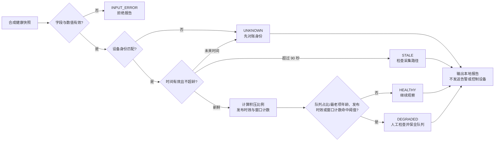

# 第4章 IoT 可观测性与告警：从设备状态到可操作信号

前几章依次建立了遥测事件契约、MQTT 上报与幂等消费，以及断网时的本地持久化队列。本章把视线转向运行过程：队列是否正在积压、最近一次成功发布距今多久、重试和拒收是否增加，以及观察数据本身是否仍然可信。目标不是把一块开发板“变成监控平台”，而是练习把运行状态压缩成**有身份、有时间、有阈值、有处置方向**的可核验信号。

本章程序读取仓库里的合成 JSONL 快照，仅用 Python 标准库计算状态并打印报告。它不运行于 UNO Q，不接入传感器、网络、MQTT Broker、OpenTelemetry Collector 或 Prometheus；也不发送通知、重试队列、操作 App Lab 或控制硬件。章节给出的数值阈值仅用于演示。任何生产系统都需要根据采样周期、链路预算、业务影响、时钟误差和组织值守流程重新设计并验证。

## 学习目标

读完本章后，你应能够：

1. 区分指标、日志和追踪各自回答的问题，并为 IoT 上报链路选择最小一组有效信号。
2. 为健康快照定义设备身份、启动身份、采集时刻、发布时效、队列容量和窗口计数等字段。
3. 区分 `HEALTHY`、`DEGRADED`、`STALE` 与 `UNKNOWN`，避免把“没有新数据”误报成“没有故障”。
4. 将告警条件写成可解释的阈值和建议动作，同时避免高基数标签、重复噪声与未经批准的自动控制。
5. 运行离线样例和行为测试，并准确说明其没有验证的设备、网络、监控后端与值守闭环。

## 背景与边界

### 1. 可观测性不是一个“在线”布尔值

一个端到端遥测路径可能包含采样、事件校验、发件箱入队、发布客户端、Broker、消费服务和业务存储。任一节点显示“进程正在运行”，都不足以证明事件已抵达服务端或业务结果已被处理。排障时应拆成可验证的问题：

| 关注点 | 代表信号 | 能支持的判断 | 不能单独证明的事项 |
| --- | --- | --- | --- |
| 采集 | 最近采样时刻、采样失败数 | 设备近期是否产生观测 | 传感器校准正确或物理量真实 |
| 本地缓存 | 队列深度、容量、最老事件年龄 | 数据是否积压、离容量上限多近 | 队列之外没有丢失或 SQLite 文件健康 |
| 发布 | 最近一次发布成功时刻、重试计数 | 发布路径近期是否取得适配器所称的成功结果 | Broker 已持久化、订阅者已收到或业务已提交 |
| 消费 | 接收数、去重数、拒绝数、处理延迟 | 服务端消费链是否出现异常趋势 | 下游副作用已完成或正确 |
| 观察系统 | 最近采集成功时刻、采集错误数 | 监控数据本身是否仍可用 | 被观察设备健康 |

这张表延续了[第八篇第1章的遥测契约](./第1章_IoT开发基础_从采样数据到可验证遥测.md)、[第八篇第2章的消费者幂等边界](./第2章_MQTT消息上报与幂等消费_从主题设计到重复投递.md)和[第八篇第3章的离线发件箱](./第3章_离线缓存与补传_从持久化队列到可验证恢复.md)：传输层的“已发布”、消费层的“已接收”和业务层的“已完成”必须分别陈述，不能汇总成一个未经限定的成功标志。

OpenTelemetry 将指标、日志和追踪列为不同的遥测信号：指标是运行时测量，日志记录事件，追踪描述请求经过组件的路径。[官方信号概念文档](../../resources/references.md#第八篇第4章补充核验)可用来核对这些基本定义。本章快照只练习状态指标和报告；真实项目通常还需要保留带关联 ID 的日志，并在跨服务处理时为追踪定义边界。并非所有设备都适合完整追踪，也不应为了“有数据”而收集无关或敏感载荷。

### 2. 先确定契约，再写告警条件

本章样例的一个快照包含以下字段。字段的意义比名字更重要：若计数的统计窗口、队列容量的单位或“成功发布”的确认边界不明确，阈值看起来精确也没有操作价值。

| 字段 | 类型与解释 | 设计注意点 |
| --- | --- | --- |
| `device_id`、`boot_id` | 设备和本次启动的身份 | 用来核对快照归属；启动 ID 变化本身不代表故障 |
| `observed_at_utc` | 快照采集时刻，UTC | 需校验时钟来源；快照未来时间进入 `UNKNOWN` |
| `last_publish_at_utc` | 最近一次发布适配器报告成功的时刻，可为空 | 若为空表示尚无成功记录，不应伪造为零延迟 |
| `queue_depth`、`queue_capacity` | 当前队列项数与逻辑上限 | 二者单位一致；深度不能大于容量 |
| `oldest_event_age_seconds` | 当前最老待发事件的年龄 | 队列为空时必须为零；队列非空时必须大于零 |
| `retries_5m` | 前五分钟的重试次数 | 这是本章快照契约中的窗口计数；现场应定义重置、时钟和窗口算法 |
| `rejected_5m` | 前五分钟被拒绝的事件数 | 应能追溯拒绝原因；只记总数不替代错误日志 |

在监控后端中，诸如队列深度、容量和年龄通常是会升也会降的状态量，适合按“当前值”来解释；累计重试/拒绝总数则需要按计数器语义记录，再从相邻采样点计算窗口增量。本章输入已经带有 `retries_5m` 与 `rejected_5m`，表示上游采集器已经形成该窗口的合成统计；离线程序本身不维护跨快照窗口。Prometheus 的官方仪表化指南也区分可升降的 gauge 与只增（进程重启时可重置）的 counter，并建议对“距事件多久”优先暴露事件时间戳，再计算年龄。[相关规范和术语见参考资料索引](../../resources/references.md#第八篇第4章补充核验)。

### 3. 状态必须保留数据质量信息

本章定义的是**教学判定模型**，不是 OpenTelemetry、Prometheus、Arduino 或 UNO Q 的标准状态：

| 状态 | 本章含义 | 建议方向（人工判断） |
| --- | --- | --- |
| `HEALTHY` | 身份匹配、快照新鲜，且没有命中本章演示阈值 | 继续观察；不等于业务端到端验收 |
| `DEGRADED` | 快照有效，但积压、发布时效、重试或拒收信号命中阈值 | 查看队列和关联日志，判断积压原因及是否影响服务 |
| `STALE` | 身份和时间结构可读，但快照超过允许的新鲜度 | 先检查采集路径、设备时钟和观察系统，不沿用旧“健康”状态 |
| `UNKNOWN` | 设备身份不匹配，或时间关系使当前状态无法可靠判断 | 暂停自动结论，先核对设备、启动周期与时钟 |

数据质量检查先于业务阈值判定。若采集时间是未来时刻，或最近发布时刻晚于其所属快照，不能因为队列当前为零就给出 `HEALTHY`。反过来，快照过期时也不要继续对其中的队列值发出当前容量判断。本章脚本在身份/时间不可信时输出 `UNKNOWN`，超出 90 秒示例窗口时输出 `STALE`，并停止对该行的业务指标分析。

## 操作与实验

### 4. 从“想知道什么”推导信号

建议从用户或运维人员实际需要采取的动作反推指标，而不是从设备能导出的所有字段开始。对本书的发件箱练习，最小可用集合可包括：

1. **积压是否接近容量上限，或旧事件是否长期滞留**：同时观察 `queue_depth`、`queue_capacity` 和 `oldest_event_age_seconds`。单看队列深度无法比较不同容量的设备；单看比例也可能漏掉少量事件长时间滞留，因此本章还把最老事件年龄纳入独立阈值判断。
2. **发布是否停止取得成功结果**：记录 `last_publish_at_utc`，根据场景预期的发布周期计算年龄。无业务流量的设备不能只因长时间没有消息就被判死；本章假设设备应周期发布，所以示例使用固定时效阈值。
3. **重试是否持续增加**：计数要带清楚窗口。孤立的单次重试可能是瞬时抖动，反复重试或队列年龄增长才更接近需要人工处理的现象。
4. **输入是否被拒绝**：拒收数量增加可能表示契约漂移、容量策略或上游数据错误。告警要连到可定位的原因记录，不能只把数字推给值班人员。
5. **观察系统是否失明**：采集成功时间、采集错误和观察后端可用性必须独立监测。设备没有上报时，中心端“没数据”既可能是设备问题，也可能是采集/网络/监控链路问题。

Prometheus 的告警实践建议尽量告警在用户可感知的症状上，留出短暂抖动余量，并减少“响了却无人可行动”的页面；离线处理链路尤其要关注数据通过系统所需的时间。[官方告警指南](../../resources/references.md#第八篇第4章补充核验)是设计参考，不表示本章的具体阈值适用于你的设备或业务。

### 5. 教学阈值与判定顺序

程序把阈值固定在源码中，防止样例通过随意改变阈值掩盖异常：

| 条件 | 演示阈值 | 结果 |
| --- | --- | --- |
| 快照年龄 | 大于 90 秒 | `STALE`，不继续评估队列/发布信号 |
| 快照时刻晚于显式参考时刻，或最近发布时刻晚于所属快照时刻 | 任意未来时间 | `UNKNOWN` |
| 快照设备身份与显式预期身份不符 | 不相等 | `UNKNOWN` |
| 队列深度 / 容量 | 大于或等于 0.80 | 加入 `QUEUE_PRESSURE` finding，状态为 `DEGRADED` |
| 最老待发事件年龄 | 大于 600 秒 | 加入 `OLDEST_EVENT_DELAYED` finding，状态为 `DEGRADED` |
| 最近成功发布年龄 | 大于 300 秒，或从未成功发布 | 加入 `PUBLISH_STALE` 或 `PUBLISH_NEVER_SEEN` |
| 五分钟窗口重试次数 | 大于或等于 3 | 加入 `RETRIES_ELEVATED` |
| 五分钟窗口拒收数 | 大于 0 | 加入 `EVENTS_REJECTED` |

这些条件是**演示政策**：固定参考时刻便于测试；它不代表生产建议使用 90 秒、300 秒、600 秒、80% 或 3 次作为阈值。实际设定需考虑采样周期、预期空闲时段、网络恢复时间、缓存容量、数据时效要求和排班能力。一个真实告警还应说明持续多久才触发、多久恢复、是否抑制重复通知、由谁接手以及无响应时如何升级。本章只按单个快照即时分类，未实现持续窗口、抖动抑制、去重、通知渠道、确认/恢复状态或自动化动作；因此不能拿它直接当告警服务。

建议遵循如下先后顺序：

1. 限制输入大小、字段集合和数值范围，拒绝重复 JSON 键与类型歧义。
2. 验证快照身份以及时间先后关系。
3. 判定数据是否新鲜；过期快照不参与当前积压和发布健康结论。
4. 对新鲜快照计算队列利用率与发布年龄，并逐条附上可解释 finding。
5. 给出人工检查方向；报告不触发通知、重试、清队列、重启或硬件输出，异常时的建议明确要求保全队列。

### 6. 判定流程

图中的状态名和顺序是本书的离线教学模型。图示强调：输入质量失败时，应停止得出设备健康结论；有效快照也只会生成本地报告，不会直接触发告警或设备动作。

<a id="fig-56-uno-q-iot-observability-alerts"></a>

#### 图 8-4：从健康快照到可操作信号



> 图示占位：图号=Fig-56；位置=本节之后；内容=健康快照身份/时效门、阈值判定和不触发外部动作的输出边界；来源=[第八篇 IoT 图示登记](../../images/第8篇_IoT/README.md#fig-56-uno-q-iot-observability-alerts)。

独立 Mermaid 源保存在 [`diagrams/uno-q-iot-observability-alerts.mmd`](../../diagrams/uno-q-iot-observability-alerts.mmd)，图号、节点与正文保持一致。SVG 尚未生成或目视审阅。

### 7. 运行合成样例

仓库中的 `health_snapshots.jsonl` 有四条手工构造记录：健康、队列压力/最老事件超龄/发布久未成功/重试升高、过期快照和设备身份不匹配。运行时显式传入预期设备身份和固定 UTC 参考时刻，不读取本机当前时间，因此结果可重复。

代码说明
- 用途：对受限 JSONL 合成健康快照输出离线分类报告。
- 运行环境：Python 3.10 或更高版本；本次在 Python 3.14.6 验证。
- 文件位置：`code/第8篇_IoT/第4章_IoT可观测性与告警/health_observer.py` 和 `health_snapshots.jsonl`。
- 依赖：仅 Python 标准库；不需要网络或第三方监控 SDK。
- 操作步骤：从仓库根目录运行下方命令；仅读取固定样例，不写文件、不连接设备或外部服务。
- 预期输出：4 行 JSON 报告，依次为 `HEALTHY`、`DEGRADED`、`STALE`、`UNKNOWN`；第二行同时含 `QUEUE_PRESSURE`、`OLDEST_EVENT_DELAYED`、`PUBLISH_STALE` 与 `RETRIES_ELEVATED`。
- 故障排查：若文件路径错误，确认当前目录为仓库根目录；若时间、字段或数据类型不符合契约，脚本以 `INPUT_ERROR` 返回，不应通过放宽校验掩盖问题。停止条件是发现样例以外的数据或期望设备身份不明确；不执行修复性写入。
- 验证方式：对照上述状态顺序运行脚本，再运行同目录的 `test_health_observer.py`；输出只是本地模型证据，不是设备健康或告警送达证明。

```powershell
python -B "code/第8篇_IoT/第4章_IoT可观测性与告警/health_observer.py" --snapshots "code/第8篇_IoT/第4章_IoT可观测性与告警/health_snapshots.jsonl" --expected-device-id uno-q-demo-01 --now-utc 2026-09-24T10:00:00Z
```

命令结果应按四行状态读取，而不是把最后一个 `UNKNOWN` 归类为“设备故障”：它表示样例身份和运行时显式指定的预期设备不同，当前结论必须停在对账阶段。实际执行结果及测试证据见下文。

### 8. 指标标签、隐私与告警噪声

在把快照映射到指标后端前，先区分稳定维度与逐事件身份：

- 可考虑有限、稳定的设备类别、固件通道或站点分组，但每增加一个标签维度都要估算组合数。
- 不要把 `event_key`、请求 ID、任意路径、用户标识或原始载荷作为每条指标时间序列的标签。高基数会增加存储、内存和查询成本；Prometheus 与 OpenTelemetry 的官方术语/仪表化资料都专门提醒这一点。
- 设备 ID 对排查可能有用，但是否作为资源属性、日志字段或指标标签，要由设备规模、后端基数限制、权限与保留策略共同决定。不能简单地将所有身份从观测中删除，也不能无评估地把全量身份加入每条指标。
- 指标一般用于趋势、聚合和阈值；日志用于保留原因、事件身份和处置上下文；追踪用于理解跨组件处理路径。原始传感器数据仅在有明确用途、授权和留存策略时记录。
- `HEALTHY` 不应成为“没有告警”的替代解释；`UNKNOWN` 与 `STALE` 本身就是监控链需要被看见的状态。观察系统也应有独立的采集成功/失败信号。

告警质量看的是是否及时发现可行动的服务影响，而不是告警条数。建议先做只读仪表盘或离线回放，观察真实基线后再设规则；上线后还要验证通知接收链、升级路径、恢复通知、重复抑制和误报成本。若一次告警没有明确的负责人和下一步，它通常只增加噪声。

## 验证结果

本章的验证分三层，不能互相替代：

1. **行为测试**：14 项标准库测试覆盖健康、队列占比与最老事件年龄阈值、分别独立的重试和拒收信号、发布时效、过期/未来时间、身份不匹配、逻辑字段一致性、JSON 重复键和输入行数上限。
2. **固定样例演示**：四行输入分别得到 `HEALTHY`、`DEGRADED`、`STALE`、`UNKNOWN`；这是合成记录的确定性结果。
3. **目标环境验收**：本章没有在 UNO Q、App Lab、MCU、传感器、Broker、网络、OpenTelemetry Collector、Prometheus 或通知渠道运行；没有测量采集延迟、资源开销、告警送达率、恢复时间或物理安全。

测试通过只说明本机 Python 下的纯函数和输入边界符合当前教学契约。若改动快照字段、阈值或状态优先级，应同步更新正文、测试、示例、图示和本篇资源登记。提交前还应执行[项目写作规范](../../docs/writing-guidelines.md)中的链接、元数据和 Mermaid 检查。

## 常见问题

### 快照刚刚更新，为什么 `last_publish_at_utc` 仍然会告警？

采集系统仍可能正常生成本地状态快照，但发布路径已停止取得成功结果。将“快照采集时效”和“最近一次业务发布时效”分开，正是为了避免把监控采集活跃误当成设备数据正在上报。

### 队列利用率只有 20%，为什么仍需要看最老事件年龄？

容量利用率说明空间压力，不说明等待时间。一个低流量设备可能长期保留少量旧事件；对时效敏感的业务，最老事件年龄或端到端处理延迟可能比队列比例更有意义。

### 看到 `STALE` 是否就证明设备离线？

不能。可能是设备离线，也可能是采集器、网关、网络、时钟、配置或观察平台中断。`STALE` 的含义是“本快照不能代表当前状态”，处置应先检查整条采集路径。

### 为什么脚本不在连续几次失败后才触发告警？

本章判定器只接收单个快照，没有维护跨样本状态、持续时间、迟滞或告警生命周期。生产告警应显式设计持续窗口、恢复条件和通知去重，并用回放/故障演练检验；不能假设一个单样本阈值足以抑制抖动。

### `DEGRADED` 会自动开始补传或重启程序吗？

不会。报告中的 action 是教学建议文本，不是命令。重试、清队列、重启和硬件输出会改变系统状态，应由独立、经授权且有对账/回滚条件的操作流程决定。

## 延伸阅读

- [OpenTelemetry 官方信号概念、指标与基数术语](../../resources/references.md#第八篇第4章补充核验)
- [Prometheus 官方仪表化、命名与告警实践](../../resources/references.md#第八篇第4章补充核验)
- [第八篇第1章：IoT 开发基础——从采样数据到可验证遥测](./第1章_IoT开发基础_从采样数据到可验证遥测.md)
- [第八篇第2章：MQTT 消息上报与幂等消费](./第2章_MQTT消息上报与幂等消费_从主题设计到重复投递.md)
- [第八篇第3章：离线缓存与补传](./第3章_离线缓存与补传_从持久化队列到可验证恢复.md)
- [代码入口与固定 JSONL 样例](../../code/第8篇_IoT/第4章_IoT可观测性与告警/README.md)
- [第八篇 IoT 图示登记：Fig-56](../../images/第8篇_IoT/README.md#fig-56-uno-q-iot-observability-alerts)
- [第八篇参考资料登记](../../resources/references.md#第八篇第4章补充核验)
