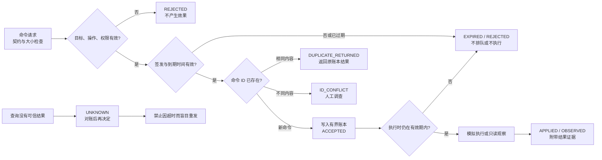

# 第5章 IoT 远程命令与受控维护：从授权请求到结果对账

前四章建立了遥测上报、离线补传和观察设备状态的路径。本章转向相反方向：管理端如何把一项维护意图送到设备，并在消息延迟、重复、过期或结果丢失时，不把“请求已送达”误当成“设备已执行”。我们用 Arduino UNO Q 作为学习对象，但实验只在电脑本地模拟一个虚构设备的配置状态；它不连接开发板、传感器、执行器或网络。

远程命令与遥测的风险不对称：重复上报通常可以在消费端去重，而重复执行配置或动作可能产生新的影响。因此，本章把流程拆成**命令契约、身份与权限门、有效期、幂等账本、执行结果和结果对账**。所有示例操作都限制为读取合成状态或修改模拟采样周期；它们不代表生产设备的安全维护策略。

## 学习目标

完成本章后，你应能够：

1. 为远程维护请求定义目标设备、命令身份、关联标识、参数和有效时间窗。
2. 解释授权上下文为何不能由命令正文自我声明，并区分演示权限映射与真实身份认证。
3. 用命令 ID 和规范化内容指纹区分重复请求与同 ID 内容冲突。
4. 区分传输确认、`ACCEPTED`、`APPLIED`、`OBSERVED` 和 `UNKNOWN`，并说明每种状态能证明什么。
5. 在结果未知时先查询和对账，不因超时而盲目重发可能改变状态的命令。
6. 运行本地模拟与测试，清楚标出它没有验证的 Broker、设备、认证和物理动作边界。

## 背景与边界

### 1. 命令不是一条“发出去就成功”的消息

至少要分开回答三个问题：传输层是否确认了某个协议报文、应用是否接纳了这个命令、设备是否确实完成了目标操作。即使某一层返回成功，也不能自动推出下一层成功。

| 可观察状态 | 本章含义 | 不能据此证明 |
| --- | --- | --- |
| 传输确认 | 某个客户端/协议栈按其定义确认了消息处理阶段 | 命令被应用接纳、设备在线或动作已完成 |
| `ACCEPTED` | 本地教学门通过契约/权限/时间检查，并记录了待处理命令 | 设备端已收到、已执行或外部效果已发生 |
| `APPLIED` | 模拟器把虚构的采样周期改为命令值并记录结果 | UNO Q、MCU 或传感器真的发生了变化 |
| `OBSERVED` | 模拟器返回当前虚构配置快照 | 现场设备状态与该快照一致 |
| `EXPIRED` / `REJECTED` | 教学策略拒绝接纳或执行该命令 | 网络中没有其他副本、设备端没有其他执行路径 |
| `UNKNOWN` | 当前可用账本无法给出可信结果，需要对账 | 命令失败、成功或可以安全重发 |

本章沿用[第四篇第4章的结果账本与状态查询](../第4篇_PythonBridge/第4章_Python_Bridge结果账本与状态查询_从返回值到可验证证据.md)：超时是“结果暂时不可知”，不是失败的同义词。真实系统应保留请求 ID、设备报告、时间、来源以及结果证据，并区分服务端接受、设备端执行与业务侧观察。

### 2. 为命令建立最小契约

本实验使用以下 JSON 对象。这里展示的是结构示例，不是可直接发送到设备的控制指令：

```json
{
  "schema_version": 1,
  "command_id": "cmd-demo-001",
  "correlation_id": "corr-demo-001",
  "device_id": "uno-q-demo-01",
  "operation": "set_sampling_period",
  "parameters": {"seconds": 20},
  "issued_at_unix": 2000,
  "expires_at_unix": 2120
}
```

| 字段 | 用途 | 检查重点 |
| --- | --- | --- |
| `schema_version` | 命令契约版本 | 本模拟器只接受整数 `1`，布尔值不算整数版本 |
| `command_id` | 单次命令的稳定幂等键 | 有界 ASCII 标识；相同 ID 不应代表两份不同命令 |
| `correlation_id` | 将请求与后续响应/日志关联 | 它是关联信息，不是凭证或授权证明 |
| `device_id` | 预期目标设备 | 必须与模拟器配置的目标完全一致 |
| `operation`、`parameters` | 允许执行的操作及参数 | 只接受固定白名单与精确参数形状；拒绝未知字段 |
| `issued_at_unix`、`expires_at_unix` | UTC Unix 秒表示的签发与到期时刻 | 拒绝未来签发、倒置/空时间窗、过长有效期和已过期命令 |

请求者身份不放在上述 JSON 中让发送方自行声称，而由单独的 `principal` 上下文传入。实验把 `maintenance-demo` 和 `observer-demo` 映射到固定权限集合；这个上下文是**预先可信的教学输入**，并非本代码完成了登录、证书校验、签名验证或身份认证。生产系统要由受信认证边界产生主体身份，再对主体、设备、操作、参数和环境状态实施最小权限策略；授权失败必须在产生效果前拒绝。

NIST 的 IoT 设备网络安全能力目录可用于思考设备识别、配置控制、数据保护、逻辑访问、软件更新与安全状态感知等能力，但它是按用途裁剪的设计基线，不是本章模拟器的认证证书或法律合规结论。相关官方资料登记在[本章参考资料](../../resources/references.md#第八篇第5章补充核验)。

### 3. 有效期、重复与冲突

命令即使在排队时通过检查，执行时也要再次检查期限。网络延迟、设备离线和维护窗口变化都可能使先前合法的请求变得过时。本实验设置的最大有效期 300 秒、命令正文 4096 字节、内存账本 64 条、采样周期 1～60 秒，全部是为了让测试有界、结果可复现的**教学策略**，不是 NIST 要求、MQTT 限制或通用生产阈值。

命令 ID 与内容按如下规则处理：

- 同一 ID、同一规范化命令：返回账本已有状态，不再次模拟执行；若记录仍为 `ACCEPTED` 但命令现已到期，则先把账本收敛为 `EXPIRED`。
- 同一 ID、不同命令内容：返回 `ID_CONFLICT`，即使原命令已过期也不复用该 ID；应调查调用方、账本和消息来源，不覆盖旧记录。
- 新 ID：完成目标、操作、参数、权限和时间检查后才记为 `ACCEPTED`。
- 到期时仍未执行：返回 `EXPIRED`，不应用过期配置。
- 找不到可信结果：保持 `UNKNOWN`，先通过权威状态查询、设备回执或人工维护记录对账。只有确认旧命令不可能再执行、且重复操作安全并经过重新授权后，才决定是否创建新命令。

幂等键只能在其账本的保留范围内有效。本示例的账本只存在于进程内，程序退出就会丢失；它没有跨进程持久化、并发锁、分布式一致性或设备端去重。因此，这段代码仅展示判断结构，不能提供生产级“恰好执行一次”保证。

### 4. MQTT 请求/响应与业务结果的分层

MQTT 5.0 定义了请求/响应相关属性，例如 Response Topic 与 Correlation Data，可帮助请求方将响应与请求关联。它们不会替应用验证请求者身份、决定设备操作权限，也不会自动证明执行器已完成动作；响应主题的访问控制和业务结果定义仍需由应用及部署策略负责。QoS 或协议报文确认属于传输协议语义，不能替代设备应用回执和状态观测。协议条款与本章的解释边界见[OASIS 标准登记](../../resources/references.md#第八篇第5章补充核验)。

本章不启动 Broker、不配置主题、不发送 MQTT 消息。它先把传输适配器留在边界之外，专注验证命令在应用层的接纳和状态对账模型；未来接入真实传输时，不能把模拟器的 `ACCEPTED` 直接映射成设备执行成功。

## 操作与实验

### 5. 查看从接纳到结果的状态机

下图是本书的本地教学流程，而不是 Arduino、MQTT 或 NIST 发布的标准架构。关键是 `ACCEPTED` 与应用结果之间保留了独立阶段；对账无法得到可信状态时，流程停在 `UNKNOWN`，不自动创建替代命令。

<a id="fig-55-uno-q-iot-remote-command-lifecycle"></a>

#### 图 8-5：远程命令的接纳、执行与结果对账



> 图示占位：图号=Fig-55；位置=本节之后；内容=命令契约、授权/有效期检查、幂等账本、执行结果与 UNKNOWN 对账分支；来源=[第八篇 IoT 图示登记](../../images/第8篇_IoT/README.md#fig-55-uno-q-iot-remote-command-lifecycle)。

独立源文件为 [`diagrams/uno-q-iot-remote-command-lifecycle.mmd`](../../diagrams/uno-q-iot-remote-command-lifecycle.mmd)。图中出现的“权限有效”只表示应用应在此处核验，不意味着本章提供真实身份凭证、认证协议或设备策略引擎。

### 6. 运行固定的本地命令演示

配套目录中的 `commands.jsonl` 包含有限的合成输入：接纳并应用模拟配置、相同命令重复提交、同 ID 不同内容冲突、只读状态观察、排队后过期、提交前已过期，以及一个本地账本中不存在的结果查询。演示使用固定的合成时钟，不读取当前时间，也不会联网或写入设备。

代码说明
- 用途：展示远程命令在本地教学门中的校验、接纳、模拟执行、重复处理和结果对账状态。
- 运行环境：Python 3.10 或更高版本；本次在 Python 3.14.6 验证。
- 文件位置：`code/第8篇_IoT/第5章_IoT远程命令与受控维护/remote_command_gate.py` 与 `commands.jsonl`。
- 依赖：仅 Python 标准库；不需要 Arduino CLI、MQTT 客户端、Broker、网络或第三方库。
- 操作步骤：从仓库根目录运行下方命令。程序仅读取仓库内固定样例并向标准输出打印 JSON 行；不改写样例、不访问凭据或外部服务。
- 预期输出：10 行，状态顺序为 `ACCEPTED`、`APPLIED`、`DUPLICATE_RETURNED`、`ID_CONFLICT`、`ACCEPTED`、`OBSERVED`、`ACCEPTED`、`EXPIRED`、`EXPIRED`、`UNKNOWN`。
- 故障排查：若找不到输入文件，检查是否从仓库根目录运行；若 Python 版本或 JSON 结构不符，先修正本地环境/样例，不要通过跳过权限、目标或时间检查来“让命令通过”。停止条件是目标身份或样例来源不明确；本实验不应连接真实设备。
- 验证方式：核对每行的 `scope` 为 `OFFLINE_IOT_REMOTE_COMMAND_SIMULATION`，并运行同目录的 `test_remote_command_gate.py`；这只验证固定离线契约，不证明远程送达或物理效果。

```powershell
python -B "code/第8篇_IoT/第5章_IoT远程命令与受控维护/remote_command_gate.py"
```

观察第一条命令：`ACCEPTED` 后，模拟执行阶段才出现 `APPLIED` 和 `sampling_period_seconds: 20`。第二次提交相同内容返回 `DUPLICATE_RETURNED`，不会再次改变模拟状态；复用命令 ID、把参数改成 30 秒则被分为 `ID_CONFLICT`。只读主体可以取得 `OBSERVED` 快照，但不能申请写配置。另一个请求虽曾被接纳，执行前已到期，所以保持未应用状态并转为 `EXPIRED`。

最后一行 `UNKNOWN` 的具体原因是固定示例 ID 不在这个新建的内存账本中。它说明“本地账本没有可信结果”时不能凭空生成成功或失败结论。在真实远程系统里，超时后也可能出现设备已执行但响应丢失的情形；那时需要查询持久账本、设备侧状态/回执和维护记录。若无法证明原请求不会再执行，不要用新 ID 立即重发一个会产生效果的操作。

### 7. 运行行为测试

测试覆盖状态分离、只读/写权限、目标设备校验、未知操作和参数拒绝、到期前后检查、重复回放、同 ID 冲突、未登记结果的 `UNKNOWN`、账本容量上限、JSON 重复键/非标准数值/载荷大小边界，以及调用方修改输入对象不会篡改已接纳记录等情形。

代码说明
- 用途：对命令模拟器的契约边界、状态转换、输入拒绝和 CLI 集成输出执行自动化回归。
- 运行环境：Python 3.10 或更高版本；仅在本机运行。
- 文件位置：`code/第8篇_IoT/第5章_IoT远程命令与受控维护/test_remote_command_gate.py`。
- 依赖：Python 标准库 `unittest`；无第三方测试框架要求。
- 操作步骤：从仓库根目录运行下方命令；测试会启动本地 Python 子进程并读取仓库固定样例，不访问网络、硬件或用户数据。
- 预期输出：30 项测试全部通过；任何失败都应先检查命令状态、输入边界和样例是否一致，不要把失败测试当作真实设备故障。
- 故障排查：确认命令在仓库根目录执行、Python 可用且代码目录未被改名。若测试期望与输出不一致，应停止并同步检查实现、正文状态表和 Fig-55；不通过放宽断言来掩盖不一致。
- 验证方式：除测试结果外，独立运行固定演示并检查十行状态顺序；测试通过不是认证、网络、设备或物理安全验收。

```powershell
python -B -m unittest discover -s "code/第8篇_IoT/第5章_IoT远程命令与受控维护" -p "test_*.py" -v
```

## 验证结果

本机本轮运行得到：章节 30 项标准库测试通过，固定命令演示产生预期的 10 行状态序列。验证覆盖的是 Python 进程内的教学逻辑、输入契约和本地输出。账本在进程退出后消失；测试没有模拟两个真实服务之间的并发竞争、进程崩溃、数据库恢复或网络交付。

下列事项**未验证**：真实身份认证与授权凭证；安全密钥保管、签名、TLS 或 MQTT ACL；Arduino UNO Q、Linux 主机、MCU、Bridge/RPC、App Lab 与传感器；真实 Broker、网络延迟/断连、消息重复投递；持久化/分布式幂等；设备回执和真实配置状态；执行器、电气/机械风险；固件或软件 OTA 更新、回滚和启动链。特别是，教学 `APPLIED` 只代表模拟变量被改写，不是硬件证据。

接入生产系统前，至少要重新设计并评审主体认证、目标绑定、权限撤销、时钟可信度、持久化且可恢复的命令账本、设备端幂等、并发和重放策略、撤销/过期处理、敏感参数保护、结果签名/来源、审计保留及故障恢复。危险动作还需独立的人工批准、设备本地互锁和安全停止机制；不得由“命令格式正确”推导出“操作安全”。固件 OTA 是不同的供应链与恢复问题，不在本章模拟范围。

## 常见问题

### Broker 确认了消息，为什么还要等 `APPLIED`？

Broker/客户端的协议确认说明的是相应传输阶段，不是设备应用已接受命令，更不一定证明物理效果完成。应用应返回带命令/关联 ID 的结果，并在需要时通过独立状态读取核对实际设备状态。

### `ACCEPTED` 可不可以对用户显示“执行成功”？

不可以。本章的 `ACCEPTED` 只表示命令通过当前应用门并进入本地教学账本。可以显示“已接纳/待处理”，但应另行呈现执行中、已应用、被拒绝、过期或结果未知。

### 为什么重试时必须沿用同一个命令 ID？

同 ID、同内容可以让仍在有效账本中的服务识别重放并返回既有记录；待处理记录到期时会收敛为 `EXPIRED`，同 ID 的改写内容仍是冲突。换新 ID 会看起来像新操作。即使沿用同 ID，若账本已丢失或设备端没有幂等保护，也不能保证副作用只发生一次，所以仍要先查询和对账。

### `UNKNOWN` 是失败吗？

不是，它表示当前证据不足以判断结果。处理顺序应是查询可信账本和设备状态，关联回执与日志，确认原命令是否仍可能执行；证据不足时保留未知并升级人工处理，而不是猜测或盲目重发。

### MQTT 的 Correlation Data 能作为授权令牌吗？

不能。它用于关联请求与响应，不负责认证身份或授予操作权限。授权必须来自独立且可信的认证上下文和策略检查。

### 本章是否能用于真正的远程设备维护或固件升级？

不能直接使用。本章没有传输层、凭据系统、持久账本、设备端执行器或更新回滚机制。请先完成目标平台、身份策略、危险动作分析和故障恢复设计；固件升级应另行设计供应链验证、签名、分区/恢复与版本回退。

## 延伸阅读

- [NISTIR 8259A：IoT Device Cybersecurity Capability Core Baseline](../../resources/references.md#第八篇第5章补充核验)：理解按设备用途裁剪能力基线的设计视角。
- [NIST IoT Device Cybersecurity Requirement Catalogs](../../resources/references.md#第八篇第5章补充核验)：核对设备识别、配置、数据保护、逻辑访问、更新和安全状态感知等能力主题。
- [OASIS MQTT Version 5.0](../../resources/references.md#第八篇第5章补充核验)：核对请求/响应属性与协议层职责边界。
- [第四篇第4章：结果账本与状态查询](../第4篇_PythonBridge/第4章_Python_Bridge结果账本与状态查询_从返回值到可验证证据.md)：延伸了解持久化记录、查询和未知结果收敛。
- [第七篇第7章：生成式 AI 与工具调用安全边界](../第7篇_AI/第7章_生成式AI与工具调用_从模型建议到受控执行.md)：比较模型提案、独立批准、幂等和执行权限边界。
- [本章代码入口、固定合成命令及测试](../../code/第8篇_IoT/第5章_IoT远程命令与受控维护/README.md)。
- [第八篇 IoT 图示登记：Fig-55](../../images/第8篇_IoT/README.md#fig-55-uno-q-iot-remote-command-lifecycle)。
