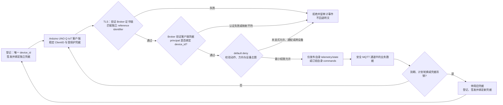

# 第6章 IoT 设备身份与安全通信：从连接信任到最小权限

前五章依次建立了遥测契约、MQTT 上报、离线补传、设备观测和远程命令模型。本章继续追问一个更基础的问题：服务器如何知道连接的是谁，客户端如何知道自己连对了服务，以及一个已认证设备究竟可以发布或订阅哪些消息？我们以 Arduino UNO Q IoT 场景组织这些概念，但实验只在本机检查虚构 JSON，不连接 UNO Q、网络或 Broker。

本章把“安全通信”拆为彼此独立的检查：**传输保护、服务端身份验证、设备身份认证、身份到设备的绑定、消息授权和凭据生命周期**。TLS 能保护一个连接，不会自动替应用完成 MQTT 权限策略；MQTT ClientID 可以标识会话，也不是身份凭证。把这些层次分开，才能在任一层失败时拒绝连接或操作，而不靠关闭校验或回退明文“修复”问题。

## 学习目标

完成本章后，你应能够：

1. 区分设备业务标识、MQTT ClientID、经验证的安全主体、凭据引用和 TLS 服务名。
2. 说明 TLS 加密、服务身份校验和客户端认证分别解决什么问题、不能证明什么。
3. 为 MQTT publish 与 subscribe 分别建立按设备划分、默认拒绝的授权规则。
4. 按明确参考时间判断凭据尚未生效、有效、过期、应轮换或已撤销。
5. 运行离线检查器，并解释其 PASS/DENY 是固定教学策略结果，不是证书、TLS、Broker 或硬件验证。

## 背景与边界

### 1. 先把“身份”拆成不同字段

真实系统中，一个连接会经过多个标识空间。下面的字段在本章 JSON 中用于讲解和静态检查；除协议明确规定的含义外，其余是本书定义的参考模型，不是 Arduino 或 MQTT 强制的数据模型。

| 名称 | 代表什么 | 典型来源 | 不应被误当成什么 |
|---|---|---|---|
| `device_id` | 业务资产或逻辑设备的稳定标识 | 设备登记系统或受控配置 | 仅凭 JSON 自报就可信的身份凭证 |
| MQTT `client_id` | MQTT 连接/会话的客户端标识 | 客户端配置、Broker 会话 | 身份认证结果或授权本身 |
| `principal_id` | 认证层验证后得到的主体 | 经验证的客户端证书、受信认证系统等 | 由消息正文自行声明的用户名 |
| `credential_ref` | 指向外部凭据记录的引用 | 密钥或证书管理流程 | 私钥、口令或可直接登录的 Token |
| TLS `server_name` | 客户端期望连接的服务身份 | 受控端点配置或协议上下文 | Broker 证书中任意出现的名字 |
| `trust_ref` | 指向受信任根/信任包配置的引用 | 受控信任配置 | 对证书链已通过验证的证明 |

MQTT 5.0 说明 ClientID 用于标识 Client 及其 MQTT Session State，且同一 Server 上连接的 ClientID 应唯一；Server 也可能在特定条件下分配新的 ClientID。它处理的是协议会话身份，不会单凭这个字段验证设备是否真实。Broker 应在认证后判断客户端是否获准使用相应 ClientID，并以授权策略限制 publish/subscribe。[OASIS MQTT 5.0](https://docs.oasis-open.org/mqtt/mqtt/v5.0/mqtt-v5.0.html)

因此，样例把 `client_id` 设置为 `device_id`、把 `principal_id` 写成 `device:<device_id>`，只是为了让本地检查器验证一致性。它不是认证流程：生产程序必须从可信认证边界取得 `principal_id`，验证该主体被授权代表哪个设备，再将该绑定交给业务层。若应用仅复制配置文件中的 `principal_id`，检查器即使返回 PASS，也没有确认任何连接者身份。

### 2. TLS 通道、服务身份与设备认证不是同一件事

TLS 为连接提供加密和完整性保护；但加密到一个“名字不对”的服务器，仍可能是连错服务。RFC 9525 要求客户端独立于服务器证书所呈现的标识构造可接受的 reference identifier，再与证书中服务端标识匹配；匹配失败时，自动化客户端应终止通信并记录错误。RFC 9525 还明确把证书路径验证留给 PKIX 等完整证书校验过程，因此“名字匹配”本身不等于证书链可信。[RFC 9525](https://datatracker.ietf.org/doc/html/rfc9525)

双向 TLS（mTLS）可在 TLS 建连时让服务端验证客户端凭据。真实部署还需要完成信任链、有效期、用途、撤销和设备主体映射等检查。TLS 服务名回答“我连的是不是预期的 Broker”；客户端认证回答“连进来的凭据代表哪个主体”；MQTT 授权再回答“这个主体可以进行什么操作”。三者不可互相替代。

| 检查层 | 通过后可以说明 | 不能单独说明 |
|---|---|---|
| TLS 传输保护 | 当前连接按协商参数获得相应加密/完整性保护 | 对端就是预期服务、设备已通过业务授权 |
| Broker 服务身份校验 | 服务端呈现的身份与客户端独立构造的期望标识相符 | 客户端身份可信或它可以访问所有主题 |
| 客户端凭据认证 | 认证器在既定策略下接受了某个客户端凭据 | 该主体被绑定到正确业务设备、操作均获授权 |
| MQTT 授权 | 当前主体获准执行某项 publish/subscribe 操作 | 消息业务含义正确、设备实际执行了动作 |

截至本章核验日，TLS 1.3 的 IETF 文档为 2026 年 7 月发布的 RFC 9846，该文档取代 RFC 8446。协议版本仍是 TLS 1.3；本章只用它说明规范版本背景，不讲解密码套件选型，也没有执行任何 TLS 握手。[RFC 9846](https://datatracker.ietf.org/doc/rfc9846/)

### 3. MQTT 授权必须同时检查操作方向与主题范围

认证成功并不意味着设备应获得任意消息权限。OASIS MQTT 5.0 的安全考虑部分建议服务端在认证后检查授权，并通过访问控制限制客户端发布到哪些 Topic、订阅哪些 Topic Filter；同时建议考虑限制范围很广的过滤器，例如 `#`。这是标准中的安全建议，具体授权策略仍须结合部署配置。本章采用更严格的固定教学子集，不应被解读为 MQTT 协议禁止使用通配符。[OASIS MQTT 5.0](https://docs.oasis-open.org/mqtt/mqtt/v5.0/mqtt-v5.0.html)

本书样例为每个设备构造如下权限矩阵：

| 操作 | 唯一允许的本设备主题 | 本书教学检查器 |
|---|---|---|
| `publish` | `demo/v1/devices/<device_id>/telemetry` | 允许发布本设备遥测 |
| `publish` | `demo/v1/devices/<device_id>/state` | 允许发布本设备状态 |
| `subscribe` | `demo/v1/devices/<device_id>/commands` | 允许订阅本设备命令 |
| 其他操作/主题 | 任意未列明主题，包括跨设备主题 | 默认拒绝 |

这里的尖括号表示替换为一个经过校验的单层设备标识，并不是 MQTT 通配符。教学检查器拒绝 `+`、`#`、跨设备主题以及方向不匹配的规则；它还将 `device_id` 限制为单个字面主题层，防止斜杠意外扩大路径。这是本书的静态规则，不是对实际 Broker ACL 的检查。真实 Broker 还必须对已认证主体执行等价或更精细的服务端授权，而不能依赖客户端自律。

### 4. 凭据要有生命周期，而不只是一个“证书文件”

建议把设备凭据视为有所有者、有状态、有有效期、可轮换、可撤销的受保护资产。一个常见的运维流程是：

1. 登记设备资产与唯一 `device_id`，建立受控的凭据签发和主体映射。
2. 安全地向设备交付凭据；私钥不得写进普通配置、日志或示例仓库。
3. 连接时校验 Broker 服务身份；若使用 mTLS，再由 Broker/认证边界验证客户端凭据并映射主体。
4. 在到期前完成轮换和绑定切换；新旧凭据并存的过渡窗口应由实际系统明确设计。
5. 发现遗失、泄漏或设备退役时撤销/停用凭据，更新信任和授权记录，并保留必要审计。

NIST IR 8259 Rev. 1（2026 年 4 月最终版）描述 IoT 产品制造商在产品售出前应考虑的基础网络安全活动，并取代 2020 年版 IR 8259；NISTIR 8259A（2020 年 5 月）给出设备网络安全能力核心基线，作为组织识别所需设备能力的起点。它们为生命周期和设备能力提供参考，不是本章检查器的认证清单或合规声明。[NIST IR 8259 Rev. 1](https://csrc.nist.gov/pubs/ir/8259/r1/final)；[NISTIR 8259A](https://csrc.nist.gov/pubs/ir/8259/a/final)

本地样例明确使用 `reference_time` 做可重复的时间判定，不读系统当前时间。固定策略要求状态为 `active`，并满足 `not_before <= reference_time < not_after`、`rotation_due_at > reference_time`。因此，生效时刻相等可用，到期时刻相等视为已过期，轮换时刻相等视为轮换逾期；`revoked` 有独立拒绝码，倒置或空有效区间也拒绝。`rotation_due_at` 是本书示例中设置的策略字段，不是 MQTT 或 TLS 标准字段。

错误诊断只返回问题码和结构路径，不回显配置值。筛查器只检测一组固定敏感字段名与显著 PEM 私钥头，并限制扫描深度为 256 层、最多访问 50,000 个节点；超过上限会 fail closed。`SECRET_LITERAL_REJECTED` 表示发现了已知标记**或筛查无法完整完成**，不证明输入一定含秘密；反过来，未命中也不证明任意形式的秘密都不存在。`credential_ref` 和 `trust_ref` 中的 `synthetic://` 引用是普通合成引用，不会被当作秘密。

## 操作与实验

### 5. 阅读 Fig-58：从登记到最小权限通信

Fig-58 是本书的教学参考流程：客户端校验 Broker 服务身份，服务端验证客户端凭据并绑定主体，再按 default-deny 策略检查动作与主题。任何一层失败都进入拒绝/审计，不回退明文。轮换或撤销事件会让旧凭据停止使用并回到身份登记流程。该图不是 Arduino、NIST、IETF 或 OASIS 发布或认可的架构。

<a id="fig-58-uno-q-iot-device-identity-secure-communication"></a>

#### 图 8-6：从连接信任到每设备最小权限



> 图示占位与登记：图号=Fig-58；位置=本节；内容=服务身份校验、设备认证/绑定、默认拒绝 ACL、失败审计和凭据轮换闭环；来源边界=本书原创教学流程，标准仅作概念核对；SVG 尚未渲染和视觉审阅。参见[第八篇图示登记](../../images/第8篇_IoT/README.md)。

唯一 Mermaid 源文件为 [`diagrams/uno-q-iot-device-identity-secure-communication.mmd`](../../diagrams/uno-q-iot-device-identity-secure-communication.mmd)。正文代码围栏与独立 `.mmd` 文件应保持一致；若后续生成 SVG，应记录渲染器/版本并做视觉审阅，不能把未渲染状态写成已完成。

### 6. 运行固定的离线策略演示

`profiles.json` 只包含虚构设备、`example.invalid` 域名、`synthetic://` 引用和假日期。样例包括一个全通过配置，以及 TLS 服务身份校验关闭、主体复用、通配/跨设备 ACL、凭据过期和凭据撤销等刻意拒绝情形。配置里没有可用证书、私钥、口令或真实设备参数。

代码说明
- 用途：在固定策略和显式 UTC 参考时间下，演示身份/TLS 声明、MQTT ACL、凭据生命周期及稳定拒绝诊断。
- 运行环境：Python 3.10 或更高版本；本轮在 Python 3.14.6 上执行。
- 文件位置：`code/第8篇_IoT/第6章_IoT设备身份与安全通信/policy_linter.py`；唯一数据文件为同目录 `profiles.json`。
- 依赖：Python 标准库 `json`、`datetime`、`pathlib`、`re` 和 `sys`；不需要 Arduino CLI、第三方包、Broker、网络或硬件。
- 操作步骤：从仓库根目录执行下面的命令。`--now` 必填且只接受秒精度 UTC；CLI 仅读取脚本旁的固定 `profiles.json`，不读取系统时钟、环境变量或任意路径。
- 预期输出：每个配置按输入顺序输出一行紧凑 JSONL；固定样例预期有 1 个 `PASS` 和 6 个 `DENY`，因此退出码为 `1`。这是设计好的策略拒绝，不是命令故障。
- 故障排查：`CLI_ARGUMENTS_INVALID` 表示参数缺失或多余，`TIMESTAMP_INVALID` 表示参考时间无效，`INPUT_READ_FAILED` 表示固定样例不可读；其他输入错误只显示稳定问题码。若意外得到全 PASS 或全 DENY，先检查当前分支和固定样例，不要关闭服务身份校验、改成默认允许或加入真实凭据。
- 验证方式：运行下方单元测试命令，并将演示输出与后文记录逐行比较。测试通过只证明固定 JSON 输入和本地教学规则一致，不证明真实连接、身份或 Broker 执行策略。

```powershell
python -B "code/第8篇_IoT/第6章_IoT设备身份与安全通信/policy_linter.py" --now "2026-09-24T12:00:00Z"
```

本轮实测的 JSONL 输出如下；拒绝报告只含 finding code 与结构路径：

```jsonl
{"profile_id":"profile-uno-q-demo-01","decision":"PASS","findings":[]}
{"profile_id":"tls-verification-disabled","decision":"DENY","findings":[{"code":"TLS_SERVER_VERIFY_DISABLED","path":"profiles[1].tls.verify_server"}]}
{"profile_id":"shared-principal","decision":"DENY","findings":[{"code":"DEVICE_PRINCIPAL_REUSED","path":"profiles[2].principal_id"},{"code":"DEVICE_PRINCIPAL_MISMATCH","path":"profiles[2].principal_id"}]}
{"profile_id":"wildcard-acl","decision":"DENY","findings":[{"code":"ACL_WILDCARD_TOO_BROAD","path":"profiles[3].authorization.rules[0].topic"}]}
{"profile_id":"cross-device-acl","decision":"DENY","findings":[{"code":"ACL_CROSS_DEVICE_TOPIC","path":"profiles[4].authorization.rules[0].topic"}]}
{"profile_id":"expired-credential","decision":"DENY","findings":[{"code":"CREDENTIAL_EXPIRED","path":"profiles[5].not_after"}]}
{"profile_id":"revoked-credential","decision":"DENY","findings":[{"code":"CREDENTIAL_REVOKED","path":"profiles[6].credential_state"}]}
```

本轮实测输出与上述内容一致，进程退出码为 `1`，原因是样例内六项预设 DENY。更改 `--now` 会改变时效判断，因此复现实验时应保留示例时间；这不是生产系统的时钟同步或可信时间验证。

### 7. 运行行为测试

测试覆盖严格 UTC、凭据边界、秘密标记筛查与脱敏、身份/TLS/profile 校验、default-deny ACL、固定输入 CLI、文件/参数错误、JSONL 顺序和 Fig-58/章节交叉引用。测试只使用合成数据和临时目录。

代码说明
- 用途：验证离线解析器、策略评估、CLI 输出和本章资源契约的回归测试。
- 运行环境：Python 3.10 或更高版本；本轮在 Python 3.14.6 上执行。
- 文件位置：`code/第8篇_IoT/第6章_IoT设备身份与安全通信/test_policy_linter.py`。
- 依赖：Python 标准库 `unittest`、`tempfile`、`pathlib` 和 `unittest.mock`；不安装测试框架。
- 操作步骤：在仓库根目录运行下方命令。测试会构造临时合成配置、覆盖固定输入路径供 CLI 测试读取，并检查静态章节资源。
- 预期输出：本轮章节测试应报告 45 项全部通过；若测试数量变化，以当前实际发现结果为准。
- 故障排查：先读取失败用例与稳定问题码，确认工作目录、章节文件和 Mermaid 源是否一致；不要通过跳过测试、屏蔽失败或放宽固定安全规则来制造绿灯。
- 验证方式：结合上方真实 CLI 演示复核一条 PASS、六条 DENY 和退出码 `1`；这是本地逻辑验证，不替代 Broker、证书或硬件验收。

```powershell
python -B -m unittest discover -s "code/第8篇_IoT/第6章_IoT设备身份与安全通信" -p "test_*.py" -v
```

## 验证结果

本轮验证范围是 Python 本地进程、静态 JSON 配置和固定教学策略。CLI 使用调用者提供的参考时间，按固定顺序打印报告；单元测试检查其代码、报告格式和文档契约。本章不启动 Arduino CLI，不导入密钥，不连接 TLS 服务、MQTT Broker 或网络，也没有在 UNO Q 实机上运行。

`PASS` 仅表示该份 JSON 满足这里实现的有限教学条件。未验证事项包括：证书签发、私钥生成/保护、证书链与撤销检查、mTLS 实际握手、服务名匹配、可信时钟、真实主体映射、Broker ACL 生效、凭据安全轮换、掉电/断网、MCU/Linux/Bridge 集成、传感器和硬件。更不能据此宣称符合 NIST 基线或达到生产安全。

上线前必须由具体系统的责任方确定信任根、证书生命周期、身份绑定、授权语义、审计保留、时间来源、撤销传播、离线和故障恢复，以及设备端回滚/恢复策略；默认拒绝和无明文回退应由实际 Broker 与客户端共同落实并在目标部署中验证。本章检查器只帮助学习如何表达一部分静态策略。

## 常见问题

### TLS 加密了，为什么还要验证 `server_name`？

加密只能说明对某个对端建立了受保护的通道。客户端仍须把证书呈现的服务身份与独立得出的预期身份匹配，并按信任策略验证证书链；匹配失败时不应关闭校验后继续连接。

### MQTT `client_id` 唯一，是否就能证明它是那台设备？

不能。ClientID 是 MQTT 客户端/会话标识，客户端可能自行提供它。应先从受信认证机制取得 principal，再检查 principal 与 `device_id` 的绑定；授权检查还需将主体、动作和主题一起考虑。

### 为什么设备可以发布自己的状态，却不能订阅 `#`？

发布与订阅是不同方向的权限。`#` 是 MQTT 多层订阅过滤器，可覆盖宽泛主题范围。本书为教学安全子集规定设备仅发布自身遥测/状态，并订阅自身命令；真实部署可采用不同策略，但必须明确评估其范围，而不是默认全开。

### 证书即将到期但此刻仍有效，为什么检查器会拒绝？

示例不仅校验证书当前是否位于有效期，还将 `rotation_due_at <= reference_time` 视为教学策略逾期。实际轮换提前量取决于签发、交付、离线时长和恢复设计，不存在由本章代码确定的通用天数。

### `SECRET_LITERAL_REJECTED` 是否能证明配置包含秘密？

不能。它既可能表示扫描到固定字段名或 PEM 私钥头，也可能表示深度/节点上限使筛查不完整。未命中也不等于任意秘密格式都不存在；不要把这个有限检测器用作生产密钥扫描器。

### 本地 PASS 是否代表 Broker 会接受连接？

不代表。CLI 读取静态配置并执行固定规则，没有连接 Broker、验证证书或发送 MQTT 报文。真实系统仍需在可信认证与授权边界中执行相同或更严格的策略，并验证实际部署结果。

## 延伸阅读

- [NIST IR 8259 Rev. 1：IoT 产品制造商基础网络安全活动](https://csrc.nist.gov/pubs/ir/8259/r1/final)：制造商与产品能力的风险管理背景；不是本章合规证书。
- [NISTIR 8259A：IoT 设备网络安全能力核心基线](https://csrc.nist.gov/pubs/ir/8259/a/final)：设备能力识别的起点；具体能力应结合设备与用例。
- [RFC 9525：TLS 服务身份](https://datatracker.ietf.org/doc/html/rfc9525)：reference identifier 构造、匹配与错误处置。
- [RFC 9846：TLS 1.3](https://datatracker.ietf.org/doc/rfc9846/)：当前 TLS 1.3 IETF 规范文本。
- [OASIS MQTT Version 5.0](https://docs.oasis-open.org/mqtt/mqtt/v5.0/mqtt-v5.0.html)：ClientID、Topic Filter、认证后授权和安全考虑。
- [第八篇第1章：IoT 开发基础](./第1章_IoT开发基础_从采样数据到可验证遥测.md)、[第2章：MQTT 消息上报](./第2章_MQTT消息上报与幂等消费_从主题设计到重复投递.md)、[第3章：离线缓存与补传](./第3章_离线缓存与补传_从持久化队列到可验证恢复.md)、[第4章：IoT 可观测性与告警](./第4章_IoT可观测性与告警_从设备状态到可操作信号.md)和[第5章：远程命令与受控维护](./第5章_IoT远程命令与受控维护_从授权请求到结果对账.md)：承接遥测、消息、离线、观测和应用级操作的章节背景。
- [本章代码说明、固定合成配置与测试](../../code/第8篇_IoT/第6章_IoT设备身份与安全通信/README.md)；[policy_linter.py](../../code/第8篇_IoT/第6章_IoT设备身份与安全通信/policy_linter.py)；[profiles.json](../../code/第8篇_IoT/第6章_IoT设备身份与安全通信/profiles.json)；[测试文件](../../code/第8篇_IoT/第6章_IoT设备身份与安全通信/test_policy_linter.py)。
- [Fig-58 独立图源](../../diagrams/uno-q-iot-device-identity-secure-communication.mmd)；[第八篇 IoT 图示登记](../../images/第8篇_IoT/README.md)。
