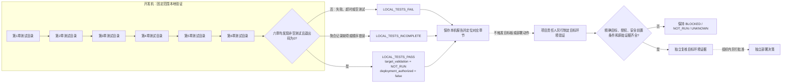

# 第7章 IoT 综合验证：从分章测试到系统级证据

前六章分别构造了遥测契约、消息消费、离线补传、运行观察、远程命令和设备安全策略。本章把它们的**本地测试**放入一条可重复的检查路径，同时明确这条路径的止点：本机测试只能说明被调用的代码在固定输入和断言下表现符合预期，不等于六章组件已经完成端到端集成，更不等于目标 UNO Q、Broker 或部署环境已经验收。

本章提供一个固定范围的离线聚合器。它逐个启动前六章的测试目录，检查发现的测试数量和进程退出状态，并输出仅限本机的 JSON 报告。工具不接受自定义路径，不连接外部服务或硬件，不生成现场证据，也没有能够批准部署的状态。

## 学习目标

完成本章后，你将能够：

1. 区分章节单元测试、进程内/本地模拟、目标环境观察和独立证据复核。
2. 使用固定范围的测试聚合器，定位哪一章失败、超时或没有发现测试。
3. 为系统验证记录被测版本、命令、环境、原始输出和复核责任人，而不是只保存一个绿色摘要。
4. 说明 `LOCAL_TESTS_PASS` 为什么不会改变 `target_validation=NOT_RUN`，也不会授权部署。
5. 在失败、证据缺失、结果不确定或安全前置条件不满足时停止并保留原始状态。

## 背景与边界

### 综合验证不是“通过项相加”

把六个测试目录连续运行，可以快速发现回归、重复运行故障和目录级测试遗漏；它并不会自动证明这些章节构成了真实的端到端系统。测试使用的输入仍是固定合成数据或本机临时资源，组件之间也没有因此连到实际传感器、Bridge、MQTT Broker、监控后端或执行器。

因此，报告把结论限定为 `LOCAL_TESTS_ONLY`。它记录本机测试进程观察到的章节结果，不能判断数据来源是否可信、目标固件是否兼容、Broker 是否实施 ACL、设备是否完成真实认证，也不能替组织核实风险接受和部署批准。通过只回答一个窄问题：**本次执行的固定本机测试是否按预期退出？**

### 前六章可复核的证据边界

| 章节 | 本地测试实际检查的对象 | 证据类别 | 本地结果不能推出什么 |
| --- | --- | --- | --- |
| [第1章：IoT 开发基础](./第1章_IoT开发基础_从采样数据到可验证遥测.md) | 合成 JSON 遥测的结构、身份字段、时序和受限数据契约。 | 固定输入上的离线单元测试。 | 传感器已采样、校准正确、设备身份真实或事件已经送达服务端。 |
| [第2章：MQTT 消息上报与幂等消费](./第2章_MQTT消息上报与幂等消费_从主题设计到重复投递.md) | 模拟重复交付、幂等判断和本机 SQLite 事务行为。 | 协议语义的本地模拟。 | 已连接 MQTT 客户端/Broker，或真实 PUBACK 顺序及端到端恰好一次效果。 |
| [第3章：离线缓存与补传](./第3章_离线缓存与补传_从持久化队列到可验证恢复.md) | 固定 JSONL 事件、本地队列策略、FIFO/TTL/退避与状态变化。 | 本地数据库和脚本化结果模拟。 | 断电、闪存寿命、真实断网、Broker 接受或目标介质恢复能力。 |
| [第4章：IoT 可观测性与告警](./第4章_IoT可观测性与告警_从设备状态到可操作信号.md) | 合成健康快照中的身份/时效、队列和发布信号分类。 | 固定样例上的本地观察逻辑。 | OpenTelemetry/Prometheus 后端已接通、告警已送达或值班流程有效。 |
| [第5章：IoT 远程命令与受控维护](./第5章_IoT远程命令与受控维护_从授权请求到结果对账.md) | 合成命令契约、进程内幂等账本和结果状态边界。 | 离线应用层逻辑模拟。 | 请求者已认证、设备已执行动作、持久审计有效或现场结果已观察。 |
| [第6章：IoT 设备身份与安全通信](./第6章_IoT设备身份与安全通信_从连接信任到最小权限.md) | 静态合成策略中的身份关联、TLS 声明、凭据元数据和 ACL 规则。 | 离线策略检查。 | 证书链或 TLS 握手有效、Broker 执行授权、凭据已安全轮换或设备安全。 |

表中的“本地测试通过”只覆盖第三列所列软件行为。章节代码、数据和限制说明见各章链接及[代码目录索引](../../README.md)；本篇第1～6章共运行 121 项标准库测试（16、5、11、14、30、45）。这个总数便于定位本次覆盖范围，不表示测试独立性、风险覆盖率或产品质量百分比。

### 四种证据类别和停止状态

为避免把没有执行的事情写成“通过”，项目复核至少要区分以下状态：

| 状态/类别 | 意义 | 允许的结论 |
| --- | --- | --- |
| `SYNTHETIC_LOCAL` | 受控合成输入、本机代码或临时数据库上的结果。 | 仅描述对应本地规则或函数；本章聚合器的六条记录均属于此范围。 |
| `TARGET_READ_ONLY` | 在被授权的精确目标上读取版本、状态或日志，未执行会改变设备状态的动作。 | 仅说明观察到的对象和时点；需要保存原始输出、时间和目标身份。 |
| `INDEPENDENTLY_VERIFIED` | 与实现或提交者相独立的复核人取得并检查原始证据，确认其对应同一被测版本。 | 说明哪些主张经何人、按何范围复核；不能自动扩展到未观察的设备或风险。 |
| `BLOCKED` / `NOT_RUN` / `UNKNOWN` | 前置条件不满足、未执行，或结果不能确定。 | 保留原状态并停止相关验收；不能改写成成功，也不能以其他章节全绿抵消。 |

本章程序只产生本地测试结果，不采集、存储或判定后三类目标环境证据。若项目没有目标板授权、精确软件/硬件版本、安全操作边界或可审计证据路径，应把目标验证保持为 `NOT_RUN` 或 `BLOCKED`。

## 端到端证据矩阵

将章节结果交给系统评审时，可以使用下表组织主张和证据。它是本书提出的项目复核模板，不是 NIST、Arduino、OASIS 或其他组织发布的统一验收标准。

| 验证层 | 被测对象与证据 | 证据来源 | 状态示例 | 人工复核重点 |
| --- | --- | --- | --- | --- |
| 代码与契约 | 固定测试、输入样例、明确的预期值和本地依赖。 | 版本控制中的测试文件与实际执行输出。 | `SYNTHETIC_LOCAL` | 测试是否真的执行、是否命中目标提交、是否存在零测试误报。 |
| 章节协作 | Python/Linux、Bridge/RPC、MCU、App Lab 与协议之间的接口。 | 明确版本的集成测试记录、接口日志和失败注入记录。 | `NOT_RUN`，除非该具体组合已实际验证。 | 组件版本、消息契约、错误/超时路径和测试边界是否一致。 |
| 目标环境观察 | 精确 UNO Q 板卡、Linux 镜像、App Lab/Brick、MCU 固件、外设和网络配置。 | 经授权的只读采样、版本清单和带时间戳的原始日志。 | `TARGET_READ_ONLY` 或 `NOT_RUN` | 设备身份、配置摘要、观察命令、操作授权、输出保存位置和目标时间。 |
| 端到端行为 | 指定输入从采集、传递、消费、观测到结果对账的完整路径。 | 可关联的事件/命令标识、两端日志、失败和恢复证据。 | `BLOCKED`、`UNKNOWN`，或有完整证据时进入人工复核。 | 是否把“已接收”“已应用”“已观察”拆开；网络中断、重放和超时是否有安全处置。 |
| 安全控制 | 身份绑定、TLS 服务身份、Broker 认证/ACL、凭据生命周期与硬件保护。 | 目标侧策略、配置来源、握手/拒绝日志、轮换记录及安全评审。 | `NOT_RUN`，直至真实控制点和原始证据经检查。 | 不回显秘密；默认拒绝；不关闭校验、不回退明文；权限和撤销范围是否适当。 |
| 独立结论 | 上述证据与尚未覆盖风险。 | 非提交者复核的证据清单、审阅记录和责任人结论。 | `INDEPENDENTLY_VERIFIED` 或待处理 | 复核人是否独立、证据是否绑定同一版本、结论和残余风险是否获责任人接受。 |

一份可复核的项目记录，至少应把仓库提交标识、解释器/依赖版本、确切命令、运行时间、逐章退出码和测试数量、原始日志位置、测试失败处置人、目标设备/镜像身份、被授权的观察范围、未运行项目、独立复核人及尚存风险放在同一索引中。本地聚合器只提供其中的逐章状态/测试数量示例；它不产出审计签名、来源证明或目标身份凭据。

## 操作与实验

### 运行六章固定测试

工具的实现和使用说明分别位于[第7章代码目录](../../code/第8篇_IoT/第7章_IoT综合验证/README.md)。从仓库根目录执行：

```powershell
python -B "code/第8篇_IoT/第7章_IoT综合验证/aggregate_local_tests.py"
```

脚本把目录固定为本篇第1～6章的相对路径，按顺序分别启动一个子进程；每个进程执行以下形式的发现命令：

```powershell
python -B -m unittest discover -s "code/第8篇_IoT/第1章_IoT开发基础" -p "test_*.py"
```

Python `unittest` 官方命令行支持用 `discover`、`-s` 指定起始目录、`-p` 指定文件匹配模式；本章把目录和模式固定在程序中，不向调用者开放任意路径。[官方来源及核验日期](../../resources/references.md#第八篇第7章补充核验)

聚合器不用 shell 拼接命令，不接受参数，也不自行解析或输出环境变量、凭据和子进程日志；它只捕获子进程输出以解析标准测试计数，不把底层日志或输入值复制进汇总结果。**但子进程会继承调用进程的环境，并以当前用户权限运行固定目录里的 Python 测试代码；本工具不是沙箱。只在可信仓库中运行，运行前应审阅将执行的测试及其副作用，不要把密钥放入测试可访问的环境。**单个章节最多运行 120 秒。目录缺失或未发现 `test_*.py`、退出码非零、超时、无法启动子进程或无法解析非零测试计数，均不会被记作 `LOCAL_PASS`。

### 报告字段与结论规则

成功报告的结构如下；测试数量来自本轮实际六个目录，汇总总计 121 项：

```json
{
  "schema_version": 1,
  "scope": "LOCAL_TESTS_ONLY",
  "decision": "LOCAL_TESTS_PASS",
  "target_validation": "NOT_RUN",
  "deployment_authorized": false,
  "chapters": [
    {"chapter": "第1章", "status": "LOCAL_PASS", "returncode": 0, "tests_run": 16},
    {"chapter": "第2章", "status": "LOCAL_PASS", "returncode": 0, "tests_run": 5},
    {"chapter": "第3章", "status": "LOCAL_PASS", "returncode": 0, "tests_run": 11},
    {"chapter": "第4章", "status": "LOCAL_PASS", "returncode": 0, "tests_run": 14},
    {"chapter": "第5章", "status": "LOCAL_PASS", "returncode": 0, "tests_run": 30},
    {"chapter": "第6章", "status": "LOCAL_PASS", "returncode": 0, "tests_run": 45}
  ]
}
```

`LOCAL_TESTS_PASS` 需要六个章节按固定顺序齐全、每个目录发现至少一项测试、退出码为零，且所有摘要字段有效。一个章节非零退出、超时或空测试目录会得到 `LOCAL_TESTS_FAIL`；结果清单缺失章节或顺序被改动则为 `LOCAL_TESTS_INCOMPLETE`。无论结论是哪一种，`target_validation` 都固定为 `NOT_RUN`，`deployment_authorized` 都固定为 `false`。

本章配套 15 项标准库测试覆盖：固定六章顺序；聚合成功、失败、缺项和额外无效记录；子进程超时或启动错误；拒绝额外参数；实际启动六个现有目录并解析非零测试数；章节 front matter/标题、导航、本地链接、来源登记，以及 Fig-57 唯一锚点和正文/独立 Mermaid 同步。章节测试证明本地工具按约定工作，不构成系统或设备安全测试。

### 逐层验证而不是一次性“上线测试”

项目可按下列顺序将教程代码转成受控验证，但每一步的授权和证据都由项目责任人管理，而不是本章工具：

1. **固定被测版本**：记录仓库提交、依赖、固件和配置的精确标识；把测试输出与被测对象绑定。版本未知或混用时停止。
2. **确认本地逻辑**：在隔离的开发环境运行固定测试和应用级仿真；保存失败输出，不以删测试、屏蔽错误或降低断言换取全绿。
3. **审阅接口与故障路径**：分别检查正常、重复、超时、掉线和未知结果；明确 `ACCEPTED`、`APPLIED`、`OBSERVED` 与 `UNKNOWN` 的差异。
4. **制定目标板检查单**：由责任人确认具体 UNO Q 板卡/镜像、操作授权、供电与执行器安全条件、允许的只读命令、预期输出、日志保留和紧急停止方式。本地聚合器不会连接目标板。
5. **执行并保全原始证据**：把目标、时间、命令、操作者、逐行结果和失败路径记录在项目批准的证据库；不得在日志中写入私钥、密码或有效令牌。
6. **独立复核与项目决策**：由非提交者确认原始证据对应同一版本，并显式记录未验证项、残余风险和批准责任人。脚本的绿色摘要不是批准凭据。

若目标环境未获批准，或者证据不能确认测试对象、身份、版本、时点或执行结果，应保留 `NOT_RUN`、`BLOCKED` 或 `UNKNOWN`。不得把缺失日志、客户端超时或无确认回执按成功处理；也不得让端侧自动重试造成未经审查的重复动作。

### Fig-57：从章节测试聚合到独立目标验收

图中的左侧是本机固定目录和测试汇总；其绿色结论仍停留在本机报告。虚线表示项目可能另有独立的目标验证和授权流程，不是脚本触发的后续动作。

<a id="fig-57-uno-q-iot-integration-validation"></a>

> 图示占位与登记：图号=Fig-57；位置=本段之后；内容=六章本机固定测试依次聚合，失败/超时/空测试与缺失记录分别停止，目标板验收和部署审批由独立责任人另行处理；来源边界=本书原创流程图；SVG 尚未生成或视觉审阅。参见[第八篇 IoT 图示登记](../../images/第8篇_IoT/README.md)。



图源：[Fig-57 Mermaid 独立源文件](../../diagrams/uno-q-iot-integration-validation.mmd)。本图是本书的教学流程建议，不是 Arduino、NIST、Python 或 MQTT 标准组织的官方验收图。SVG 只有在实际渲染、记录工具版本并完成视觉审阅后，才可把图示登记状态更新为已审阅。

## 目标环境验证与证据交接

本章提供的本地报告不含目标设备字段，因为工具从不观察目标板。若项目开展真实验收，应在另一个经授权的计划/报告中至少包含以下信息：

| 证据项 | 建议记录内容 | 无法取得时的处理 |
| --- | --- | --- |
| 目标身份 | 设备资产标识、板卡版本、镜像/固件摘要、App/Brick 版本和配置版本。 | `UNKNOWN`；停止任何依赖该版本判断的验收。 |
| 操作边界 | 授权人、执行人、允许的观察/写入范围、时间窗口、接触的执行器和紧急停止约束。 | `BLOCKED`；不得由测试脚本自行扩大范围。 |
| 测试记录 | 测试用例、起止时间、精确输入、观察步骤、原始输出、退出码、关联 ID 和日志位置。 | `NOT_RUN` 或 `UNKNOWN`；不从控制台片段推断完整成功。 |
| 安全信任 | 目标服务身份、可信根来源、客户端主体绑定、Broker 实际 ACL 和拒绝路径证据。 | `NOT_RUN`；静态 JSON 策略检查不能替代握手和 Broker 执行证据。 |
| 复核责任 | 与实现者分离的复核人、复核材料、结论、未解决风险和责任人批准。 | 保持待复核；不把代码作者的自述标为独立验证。 |

如果真实操作可能改变配置、启动执行器、下发远程命令、轮换凭据或影响网络，必须先走适用于该项目的正式审批和风险评估。第5章的远程命令演示以及本章本地聚合器都不是实际部署控制面；不得为了让报告变绿而把真实操作接入测试工具。

## 验证结果与范围

本章实际验证使用本机 Python 3.14.6、仓库内六个固定 IoT 测试目录和合成/静态样例。第1～6章分别报告 16、5、11、14、30、45 项测试，合计 121 项；本章 `aggregate_local_tests.py` 只运行这六组测试并输出六条 `LOCAL_PASS`。本章工具自身的 15 项标准库测试也通过，覆盖固定目录、汇总规则、超时/启动错误、CLI 参数边界和文档/图源契约。

聚合器本身没有发起 DNS、Socket、HTTP、MQTT、TLS、SSH、ADB 或 Arduino CLI 调用；本次固定测试运行也没有连接 UNO Q、改变设备配置、操控执行器、访问监控后端或生成目标环境验收证据。测试子进程按前述约定继承环境并在当前用户权限下执行，因此聚合器不提供对任意仓库代码的安全隔离。没有验证 App Lab、Linux 镜像、MCU、Bridge/RPC、真实 Broker、TLS 握手、ACL 执行、传感器、掉电恢复、现场时延或组织审批。本地测试通过仅是有限的软件回归证据，章节仍为 `draft`。

全书 pytest 回归、Markdown 本地链接、篇内导航和 Fig-57 双源检查的实际计数应以当前提交对应的验证记录为准；根目录 README 和[本篇地图](./README.md)随每次验证结果更新。图示源尚未渲染为 SVG，不能声称已完成视觉检查。

## 常见问题

### 为什么六章都显示 `LOCAL_PASS`，目标验证还是 `NOT_RUN`？

因为测试命令运行在开发机，只读取固定本地测试代码和样例。没有连接目标设备、核对镜像或保全目标日志，便没有目标环境证据。报告把这两个事实分别编码，避免读者把“本地测试全绿”误读成实机已通过。

### `tests_run` 是系统覆盖率吗？

不是。它是各 `unittest` 子进程摘要报告的测试项数量，不描述断言质量、代码覆盖百分比、风险覆盖率、测试独立性或实际系统范围。应结合具体测试内容、未覆盖列表和原始输出判断。

### 汇总器超时或找不到测试时怎么办？

结果分别标为 `LOCAL_TIMEOUT` 或 `LOCAL_NO_TESTS`，总决策不可能是 `LOCAL_TESTS_PASS`。进入对应章节目录复现并查明原因；不要提高限制以掩盖慢测试，不要把测试文件移出匹配范围，也不要把空测试目录当作成功。

### 本机工具是否可以用于 CI 并自动发布？

它可作为仓库内固定回归检查，但它不是发布门、签名工具或环境授权系统。若项目希望把它接入 CI，仍需由项目负责人设计目标保护、发布审批、证据保留和可信执行身份；本工具永远将 `deployment_authorized` 设为 `false`。

## 本章小结

本章把第1～6章的本机测试整理为确定顺序的离线聚合，并将成功、失败、超时和缺失区分开。报告只能回答固定代码测试的本机执行结果；系统集成、目标 UNO Q 验收、安全控制实测、独立复核和部署批准仍须分别计划、授权、收集原始证据并由责任人决策。最重要的规则是：**证据缺失不等于通过，本机测试全绿也不改变目标验证状态。**

## 延伸阅读

- [Python `unittest` 官方文档](https://docs.python.org/3.14/library/unittest.html)：测试发现与命令行选项；本章只使用固定目录的 `discover` 模式。
- [本章来源登记](../../resources/references.md#第八篇第7章补充核验)：记录官方资料、版本基线和用途边界。
- [第八篇 IoT 图示登记](../../images/第8篇_IoT/README.md)：查看 Fig-51～Fig-57 的图号、来源和渲染状态。
- [第八篇第1～7章](./README.md)：回到本篇章节地图。
- [本章代码说明和测试](../../code/第8篇_IoT/第7章_IoT综合验证/README.md)：查看运行命令、退出码和工具安全范围。
