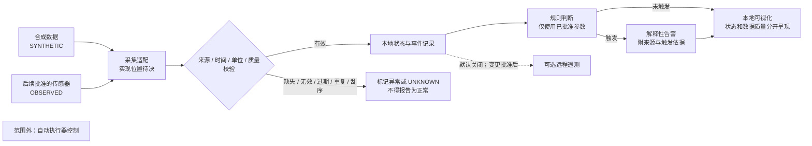

# 第1章 项目立项与需求基线：从场景到可验收目标

第九篇以“实验室环境监测与告警”为贯穿项目。本章先把要解决的问题、系统边界、需求和验收证据固定下来；不提前选定传感器、接线、采样周期、告警阈值或部署拓扑。这样做的目的，是让后续架构与实现章节能够回答“为什么这样设计、如何证明它满足需求”，而不是把尚未讨论的技术选择写成既定事实。

本书以 Arduino UNO Q 为目标学习平台，但这不表示开发板自带本项目所需的环境传感器，也不表示本章已经在实体板、传感器或实验室现场完成验证。本章所有试验记录均为明确标注的合成数据。

## 学习目标

完成本章后，读者应能够：

- 把“监测实验室环境”转化为有边界、可追溯的项目章程。
- 区分范围内、范围外和仍待决定的事项，不把临时示例当成批准配置。
- 为功能和非功能需求分配稳定 ID，并为每项需求写出可判定的验收条件与验证方法。
- 设计能保留来源、时间、单位和质量状态的数据契约；无效或不确定读数不得被显示成“正常”。
- 区分设计审查、合成数据、主机测试、目标板观察和独立复核各自能证明什么。
- 为下一章的系统架构设计交付一份明确的决策输入清单。

## 1. 背景与项目章程

### 1.1 场景陈述

实验室或设备间可能需要持续了解若干环境量及采集链路是否健康。项目的学习目标不是宣称某种环境风险已经发生，而是建立一条可以解释、记录和复核的监测流程：每条读数都能回答它来自哪里、何时产生、使用什么单位、质量状态如何；若规则触发告警，操作者能看到触发依据，而不是只看到一个没有上下文的红色图标。

具体监测对象、精度要求和现场响应流程由项目相关人员另行确认。本项目原型不得代替经过验证的实验室安全设施、法定检测设备或现场应急程序，也不得以“当前没有告警”推断环境一定安全。

### 1.2 项目章程

| 项目要素 | 基线说明 | 本章的证据边界 |
|---|---|---|
| 项目名称 | 实验室环境监测与告警学习项目 | 项目名称，不是产品或安全认证名称 |
| 问题陈述 | 需要让读者练习从读数接入、质量校验、本地记录到解释性告警的完整工程链路 | 场景动机，不代表某个真实实验室已经出现故障 |
| 主要使用者 | 实验室值守人员、设备维护人员和负责实现的开发者 | 具体人员、权限与值守制度待项目方确认 |
| 目标 | 形成可追溯的数据与告警闭环；能够审查需求、验证失败输入并复盘证据 | 本章不承诺未测量的精度、延迟、可用率或覆盖范围 |
| 运行边界 | 初始基线只讨论本地采集、记录、告警与展示 | 远程遥测默认关闭；任何远端连接须作为后续变更单独审议 |
| 安全边界 | 仅提示人，不自动操作物理设备 | 不驱动继电器、电机、门锁、加热器或其他执行器 |
| 交付物 | 需求矩阵、边界图、合成验收案例、风险与未决决策清单 | 本章不交付可部署的软件或现场安全结论 |

### 1.3 典型使用流程

1. 操作者启动系统，先看到采集链路和数据源状态；刚启动或尚无有效读数时，状态应为“未知/等待数据”，而非“正常”。
2. 采集层提交带有来源、事件时间、单位和质量信息的记录。
3. 校验层检查字段、时间顺序、单位及质量状态。缺失、无效、过期、重复或乱序记录进入明确的异常处理路径。
4. 只有通过校验的记录才参与当前状态计算；本地事件记录保留输入摘要、判断结果和规则版本。
5. 规则使用经项目相关人员批准的参数产生告警。告警说明触发读数、来源、时间、单位、阈值版本和数据质量。
6. 操作者核对现场情况，并按实验室已有流程处理。原型本身不发出物理控制命令。

## 2. 范围边界与假设

| 范围类别 | 事项 | 当前决定 |
|---|---|---|
| 范围内 | 数据来源与质量 | 为数据源、事件时间、数值、单位和质量状态定义统一契约；本章用合成数据演示 |
| 范围内 | 本地处理 | 讨论校验、状态判断、事件记录、规则告警和可视化之间的逻辑关系 |
| 范围内 | 可验收性 | 以稳定需求 ID、明确通过条件、验证方法和证据级别建立基线 |
| 范围外 | 执行器控制 | 禁止由本项目告警自动驱动继电器、电机、门锁、加热器或其他执行器 |
| 范围外 | 安全认证与现场应急 | 不替代合规检测设备、实验室安全系统或经过批准的应急程序 |
| 范围外 | 初始远程通信 | 远程遥测默认关闭；本章和本地测试不连接 Broker、云服务或外部 API |
| 未决 | 传感器与物理量 | 尚未确定传感器型号、测量对象、量程、精度、校准方法、数量和安装位置 |
| 未决 | 采集实现 | 尚未确定采集适配器运行在 MCU、Linux 还是其他受控边界，也未确定总线与接线 |
| 未决 | 时间与数据策略 | 采样周期、时钟同步、过期判定、数据保留期限和断电恢复策略均待确认 |
| 未决 | 告警策略 | 阈值、滞回、持续时间、通知对象、升级流程和解除条件均待相关人员批准 |
| 未决 | 部署与访问 | 最终网络拓扑、用户角色、存储位置、设备身份和远程遥测审批流程待后续设计 |

本章只作以下有限假设：项目原型可以先用合成记录演练数据契约；将来接入的真实数据必须保留 `OBSERVED` 来源标记及其采集上下文；在项目方批准告警参数之前，系统不得声称某个真实现场状态属于正常或异常。除这些假设外，不推定已有传感器、网络、云服务或稳定供电条件。

### 2.1 概念数据流与系统边界

下图只表达需求层的逻辑关系，不指定适配器部署位置、处理器分工、通信协议或传感器型号。虚线远程通道在当前基线中关闭；“执行器控制”作为明确排除项，不存在从告警到执行器的控制路径。

**Fig-60｜实验室环境监测项目的数据流与范围边界**

图中 `SYNTHETIC` 表示用于确定性教学的合成记录；`OBSERVED` 仅在后续确实采集到真实传感器读数并保留原始证据时使用。图中的“未触发”只表示给定规则和有效输入未产生告警，不等价于“实验室安全”。源文件为 [Fig-60 Mermaid 源文件](../../diagrams/uno-q-lab-environment-project-baseline.mmd)；图示仅以 Markdown/Mermaid 源码维护，SVG 尚未生成或目视审阅。

## 3. 需求基线与验收矩阵

### 3.1 数据契约

每条记录至少需要表达以下语义：稳定的数据源标识、唯一事件标识、事件时间、数值、单位、来源标记和质量状态。实际序列化格式由下一章确定。时间戳应区分“设备测量时间”和“系统接收时间”，避免把重传时间误认为测量时间。单位必须显式携带，禁止仅靠图表标题或变量名猜测。

质量状态不能只是布尔值。至少需要区分有效、缺失、格式无效、过期、重复和乱序等情况；系统还应能表达“没有足够信息判断”。具体枚举、过期窗口和乱序策略作为后续架构与需求决策。

### 3.2 功能与非功能需求

下表是本项目的需求基线草案，不是传感器选型、性能规格或安全标准。`LEM-FR-NNN` 和 `LEM-NFR-NNN` 是项目内稳定标识；若后续调整描述，应保留 ID 或记录明确的废弃/替代关系，不能悄悄复用。

| 需求 ID | 类型 | 需求描述 | 验收条件 | 验证方法 | 证据级别 |
|---|---|---|---|---|---|
| LEM-FR-001 | 功能 | 系统接收包含数据源、事件 ID、事件时间、数值、单位、来源和质量状态的记录 | 完整且字段合法的合成记录被接受；缺少必需字段的记录被拒绝或标为无效，且原因可见 | 固定合成输入覆盖完整、缺字段和错误类型三组情况，检查输出状态 | SYNTHETIC，后续 HOST_TEST |
| LEM-FR-002 | 功能 | 系统保留每条记录的数据来源与时间语义 | 任一展示值或告警均可追溯到数据源、事件时间、接收时间和来源标记；不得把 `SYNTHETIC` 改写为 `OBSERVED` | 审查数据模型与合成记录端到端字段保留情况 | DESIGN_ONLY，SYNTHETIC |
| LEM-FR-003 | 功能 | 系统处理缺失、无效、过期、重复及乱序输入 | 每类输入都产生明确质量状态或拒绝原因；任何一类都不能静默转成有效“正常”状态 | 对每种异常输入执行独立固定样例，比较预期状态与实际状态 | SYNTHETIC，后续 HOST_TEST |
| LEM-FR-004 | 功能 | 系统记录状态变化与告警事件 | 事件包含事件 ID、数据源、触发时间、规则/配置版本及可解释的触发依据；相同事件重放不会伪造第二次新测量 | 使用含重复事件 ID 的合成序列，核对事件记录和去重结果 | SYNTHETIC，后续 HOST_TEST |
| LEM-FR-005 | 功能 | 系统根据已批准的规则参数生成解释性告警 | 告警能指出输入值、单位、来源、时间及所用规则版本；未批准或缺失规则参数时显示“未配置/未知”，不得默认判为正常 | 用教学合成值验证规则路径，并单独验证参数缺失路径 | SYNTHETIC；阈值批准后再验证 |
| LEM-FR-006 | 功能 | 操作者查看当前状态、数据新鲜度与数据质量 | 界面能区分有效未触发、告警、数据异常、等待数据和未知；不得仅用颜色表达状态 | 对每种状态提供合成输入并检查文字状态和更新时间 | SYNTHETIC，后续 HOST_TEST |
| LEM-FR-007 | 功能 | 操作者能从告警定位到其来源记录 | 告警详情可以通过稳定事件 ID 找到原记录及对应规则版本；引用不存在时显示无法追溯而非空白“正常” | 删除或替换合成引用，检查告警详情的降级表现 | SYNTHETIC，后续 HOST_TEST |
| LEM-NFR-001 | 非功能 | 系统不得自动控制物理执行器 | 本项目组件、规则和告警通道中不存在继电器、电机、门锁、加热器等执行输出；相关自动化验收必须为通过 | 审查架构图、接口清单和测试边界；确认未配置执行器接口 | DESIGN_ONLY，INDEPENDENT_REVIEW |
| LEM-NFR-002 | 非功能 | 远程遥测默认关闭 | 新部署或未配置状态不建立远端连接、不上传数据；开启前须有独立审批、目的地、字段、保留期限和退出方案 | 检查默认配置与本地测试网络调用清单；本章测试不发起网络请求 | DESIGN_ONLY，HOST_TEST |
| LEM-NFR-003 | 非功能 | 系统不得把数据质量不确定解释成环境正常 | 无有效新读数、时钟不可信、规则未配置或数据源未知时，状态只能是未知、等待或异常之一 | 逐一移除质量条件，检查状态分类；审阅是否存在默认正常分支 | SYNTHETIC，HOST_TEST，INDEPENDENT_REVIEW |
| LEM-NFR-004 | 非功能 | 合成测试可重复且不依赖现场设备 | 固定输入在重复运行时给出相同判定；测试无需网络、传感器、凭据、Broker 或 UNO Q | 在隔离主机运行本章契约测试与合成案例，检查输入/输出快照 | HOST_TEST |
| LEM-NFR-005 | 非功能 | 配置变更能够追溯 | 每次阈值或规则变更记录批准者、变更时间、变更原因、影响需求 ID 和生效版本；未批准参数不得进入有效配置 | 审查变更记录模板及配置版本字段 | DESIGN_ONLY，INDEPENDENT_REVIEW |
| LEM-NFR-006 | 非功能 | 性能和现场安全阈值必须由项目方基于场景确定 | 本章不得给出未经确认的精度、采样周期、响应时限、保留期限或现场安全阈值；所有此类值在需求批准前标记为“未决” | 审阅需求、配置和图表中的数值及来源说明 | DESIGN_ONLY，INDEPENDENT_REVIEW |

### 3.3 教学用合成验收例

以下数据只用于说明怎样把需求转换为可判定案例。所有读数和规则参数均为 `SYNTHETIC`，不是实测数据、实验室限值或安全建议。

| 案例 | 合成输入 | 预期判定 | 不能得出的结论 |
|---|---|---|---|
| S-01 有效记录 | `sim-room-a`，事件 `e-001`，值 `24.0`，单位 `°C`，来源 `SYNTHETIC`，质量 `valid` | 接受记录并显示来源、事件时间和质量状态；若规则未配置则环境状态仍不能标为安全 | 不能证明温度传感器精度或现场读数准确 |
| S-02 教学阈值触发 | `sim-room-a`，事件 `e-002`，值 `31.0 °C`，规则参数 `T_demo=30.0 °C`，全部标记 `SYNTHETIC` | 生成演示告警，并显示 `31.0 °C`、`T_demo`、来源、时间与规则版本 | `T_demo` 不是实验室安全阈值，也不能直接用于真实部署 |
| S-03 缺失值 | 事件时间存在，数值缺失，来源 `SYNTHETIC` | 记录被拒绝或标为缺失/未知；不得沿用旧值伪装为新读数 | 不能推断环境无变化 |
| S-04 过期读数 | 事件时间超出测试夹具中设定的教学过期窗口 | 标为过期或未知；不更新“最近有效测量时间” | 不能推断当前状态仍与旧读数相同 |
| S-05 重复事件 | 两条记录具有相同数据源和事件 ID | 第二条被识别为重复，不作为新的测量触发告警；重复情况仍可审计 | 不能将重复投递计作两次独立采样 |
| S-06 乱序事件 | 较旧事件在较新事件之后到达 | 保留事件时间与到达时间；按后续批准的策略标记迟到，不静默覆盖较新状态 | 不能把到达顺序当作测量顺序 |

## 4. 风险、依赖与未决决策

| 风险 ID | 风险 | 影响 | 当前缓解策略 | 关闭条件 |
|---|---|---|---|---|
| R-01 | 无效、过期或断连数据被显示为正常 | 操作者可能产生错误信心 | 缺数据和不确定性使用显式状态；测试覆盖空值、超时、重复和乱序 | 数据契约、界面状态和故障注入验收通过独立审查 |
| R-02 | 教学阈值被复制到现场 | 造成误报、漏报或不适当的安全判断 | 每处示例标记 `SYNTHETIC`；阈值必须经过场景评估、批准并记录版本 | 有责任人、批准记录、依据和回滚策略 |
| R-03 | 未确定的传感器或安装环境不满足需要 | 读数可能偏移、漂移或不具代表性 | 传感器选型、校准、安装位置和环境适用性留待后续验证 | 完成器件资料审查、台架测量和现场适用性评估 |
| R-04 | 告警原型被误认为安全联锁 | 可能延误正式响应 | 明确无执行器路径；产品说明中不使用“保证安全”等承诺 | 相关人员确认使用边界和人工响应流程 |
| R-05 | 后续远程遥测暴露敏感运行数据 | 产生未授权访问或数据留存风险 | 默认关闭；启用前另行评审字段、身份、权限、目的地、保留与撤回 | 完成书面审批和受控的安全验证 |
| R-06 | 平台/处理边界尚未确定，导致需求无法映射实现 | 后续出现重构或不可测接口 | 本章先保持平台无关的数据契约；下一章比较 MCU、Linux 和跨边界方案 | 架构决策记录明确边界、失败模式和验证方法 |

下一章至少需要作出或明确延期以下决策：监测物理量与器件候选；传感器接口与电气约束；采集逻辑所在处理器；MCU 与 Linux 间是否需要消息桥接；本地记录方式与掉电语义；告警规则配置和版本管理；现场显示方式；网络与远程遥测是否仍关闭；各项目标板验证的安全准备和停止条件。未拿到足够资料的决策应记录为“未决”，不得以推测补齐。

## 5. 证据分级与需求变更

### 5.1 证据分级

以下标签是本项目的工作分类，不是行业标准或认证等级。更高层级证据不自动使低层级主张成立，证据必须绑定到具体需求 ID、版本、测试输入和原始记录。

| 标签 | 可以支持的结论 | 不能支持的结论 | 最小留存物 |
|---|---|---|---|
| `DESIGN_ONLY` | 需求、边界或数据流已被书面描述并可审阅 | 代码已经实现、设备可以工作或现场风险已经降低 | 需求版本、审阅记录、未决项 |
| `SYNTHETIC` | 给定的固定合成输入按预期规则被处理 | 传感器精度、现场覆盖、板载部署或实际环境安全 | 固定输入、预期输出、运行版本和结果 |
| `HOST_TEST` | 本地主机上的测试代码对给定契约通过 | UNO Q 目标板、真实传感器、网络或现场环境验证通过 | 命令、软件版本、退出状态、日志和测试范围 |
| `TARGET_OBSERVED` | 指定目标板、连接方式和指定传感器曾观察到记录的行为 | 不同固件、传感器、位置或长时间运行也必然正常 | 设备身份、固件/配置、接线、原始日志、时间和复现步骤 |
| `INDEPENDENT_REVIEW` | 独立审阅者针对指定工件和需求提出了审阅结论 | 自动证明所有部署、法规或安全要求已满足 | 审阅者、范围、工件版本、发现项和处置记录 |

任何实体板验证都应在传感器、目标设备身份、供电/接线方案、操作步骤、风险与停止条件明确后另行安排。本章和它的自动化文档测试不连接 UNO Q 或外设。当前硬件证据状态见[本章验证记录](#7-验证结果与当前证据)。

### 5.2 需求变更流程

需求基线批准后，每项变更先提交变更说明，而不是直接改阈值或配置。记录至少包含：变更编号、提出者、原因、受影响的需求 ID、用户/安全/隐私影响、测试和证据变化、审批者、生效版本、回滚条件。若变更影响数据来源、物理量、告警语义、远程通信或执行器边界，应重新审阅项目章程和风险表。

被替代的需求保留原 ID 与状态，并链接到替代需求；已废弃 ID 不得重新分配。未批准的变更不得进入正式配置，实验记录需注明其是否只用于教学或评审。

## 6. 本章实验：用合成记录走通验收

本实验是纸面验收练习，不需要 Arduino UNO Q、传感器、网络连接或可运行程序。目标是检查读者能否把数据质量与环境判定分开。

1. 抄录 `S-01` 至 `S-06` 的预期判定，并为每条记录标记来源、事件时间和质量状态。
2. 对 `S-02` 查找告警必须附带的证据字段，确认 `T_demo` 被标为合成教学参数。
3. 对 `S-03`、`S-04` 和 `S-06` 分别说明为什么旧值或无告警不能被解释为当前正常。
4. 对 `S-05` 区分“同一事件重放”和“另一次物理采样”，说明事件 ID 在后续架构中如何保持稳定。
5. 随机选取一项 `LEM-*` 需求，写出输入、操作、预期结果、失败条件和保存的证据。

### 实验通过标准

- 六个案例均被标为 `SYNTHETIC`，没有被称作实测。
- 缺失、过期、重复和乱序数据都有显式结果，不会默认为有效正常。
- 告警能回溯到来源、时间、单位、触发值和规则版本。
- 读者能明确说明本项目不驱动执行器，教学阈值不用于真实实验室。
- 实验报告写清它没有连接硬件、网络或现场服务。

## 7. 验证结果与当前证据

本章提交时运行的静态契约测试只检查仓库内 Markdown、Mermaid 和导航文件，不访问网络、凭据、实体板或传感器。完成检查后据实填写以下结果；主机测试通过不会升级为目标板验证。

| 验证项 | 状态 | 证据与限制 |
|---|---|---|
| 章节元数据、目录与内部链接 | PASS | 本章离线契约测试 9 项通过，章节内相对链接解析通过；不证明页面渲染质量 |
| 需求 ID、表格字段与范围边界 | PASS | 本章离线契约测试检查 ID 唯一性、验收字段和范围分类；不证明需求已经由真实实验室负责人批准 |
| Mermaid 正文与独立源一致 | PASS | 本章离线契约测试确认源码一致；SVG 尚未渲染或目视审阅 |
| UNO Q 实机与传感器采集 | NOT_RUN | 本章不连接实体板、传感器或采集总线；没有产生目标环境证据 |
| 远程遥测、Broker 与云服务 | NOT_RUN | 默认关闭；未建立网络连接 |
| 执行器控制 | NOT_RUN | 本项目排除自动控制；没有执行或接线 |

## 8. 常见问题

### 本章是否已经选好了温湿度传感器？

没有。测量对象、型号、精度、校准、接线、安装位置和采样策略都是未决项。读者可以在后续架构与实现章节依据官方资料、现有硬件和项目风险共同决定。

### `T_demo=30.0 °C` 能用在真实实验室吗？

不能。本值只为了展示“规则触发时要保留什么证据”而构造，来源是 `SYNTHETIC`。真实阈值必须由相应责任人根据场景、设备、规范和响应流程另行确定。

### 没有告警是不是表示环境安全？

不是。可能没有数据、传感器失效、规则未配置或告警通道不可用。本项目必须将未知和数据质量问题显式显示；原型不代替安全设施或专业检测。

### 本章已经确定由 UNO Q 的 Linux 或 MCU 采集吗？

没有。此处只描述逻辑契约，不指定处理器分工或 Bridge/RPC 路径。下一章需要在需求、风险与实际可用硬件基础上比较方案。

### 为什么远程遥测默认为关闭？

目前没有确定数据字段、目的地、访问身份、保留期限和责任人。先完成本地闭环，待这些事项被审议并形成可回滚的批准变更后，再讨论外发。

## 9. 延伸阅读与交接下一章

### 延伸阅读

- [Arduino UNO Q 官方用户手册](https://docs.arduino.cc/tutorials/uno-q/user-manual/)：仅用于了解目标平台的官方产品与使用背景；本章不从该手册推断环境传感器已集成，也不借此证明本项目设计经过实测。来源、核验日期及适用边界见[参考资料索引](../../resources/references.md)。
- [本书写作规范](../../docs/writing-guidelines.md)：章节结构、图示登记和证据边界的维护规则。
- [第九篇目录](README.md)：本篇章节入口和范围说明。

### 交接给下一章：系统架构设计

下一章可以据本章需求比较系统边界和候选实现，但不应把未决事项写成既定选择。架构决策至少要带上：

1. 经确认的物理量、传感器候选及官方电气/软件资料。
2. 数据契约和异常质量状态的映射方案。
3. 采集、校验、持久化、规则计算和展示的处理边界。
4. 断电、时钟漂移、重启、重复/迟到数据等失败策略。
5. 告警参数的审批、版本、审计与回滚机制。
6. 默认关闭的远程遥测是否继续保持关闭，以及如需启用时的独立安全评审条件。
7. 目标板和传感器实测的授权范围、操作步骤、原始证据格式与停止条件。

本章建立的是可供后续讨论的需求基线草案；项目方批准前，它仍是 `draft`。本章没有完成传感器、UNO Q 实机、网络或现场安全验证。
