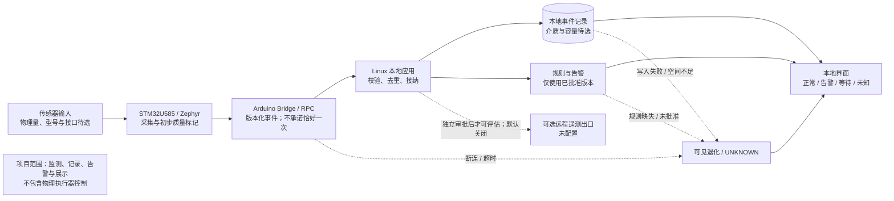

# 第2章 系统架构设计：从处理器边界到可验证数据流

> **本章性质：** `DESIGN_ONLY` 教学参考架构。本文把第1章的需求基线映射为可审查的处理器边界、数据契约与失效行为；它不是已经批准的现场部署方案，也不是 UNO Q 实机验证报告。任何传感器、接线、时间窗口、规则阈值、存储容量和部署选项，在取得项目证据前均保持未决。

本章承接[第1章《项目立项与需求基线》](第1章_项目立项与需求基线_从场景到可验收目标.md)。第1章回答“要解决什么、怎样判断完成”；本章回答“系统由哪些边界组成、数据怎样通过这些边界、异常时为什么不能继续显示无条件正常”。后续实施章节再依据实际器件、官方规格和授权验证确定驱动、参数及部署方式。

## 学习目标

完成本章后，读者应能够：

1. 说明 UNO Q 上 Linux/MPU 与 STM32/MCU 各自适合承担的职责，并区分官方平台事实与本项目的设计选择。
2. 比较分层混合、MCU 单体和 Linux 直连三种候选方案，说明推荐方案成立的前提及改变它所需的证据。
3. 设计同时保留事件时间、接收时间、来源、单位、质量与来源标记的测量契约。
4. 为重复、迟到、断连、重启、时钟不可信、存储失败和规则缺失定义安全的可观察结果。
5. 使用合成记录做一次离线架构走查，并明确这种走查不能证明传感器或目标板可用。

## 1. 架构目标与项目约束

### 1.1 从需求基线推导边界

第1章的需求标识继续作为追踪入口：`LEM-FR-*` 描述数据采集、来源与时间保留、质量处理、告警和展示；`LEM-NFR-*` 限定不控制执行器、遥测默认关闭、未知状态不得伪装正常以及配置可追溯。架构应让每条处理链都能回答三个问题：

- **谁负责这一步？** 例如采集、消息校验、持久化、规则判定和界面呈现不能混成一个不可观察的回调。
- **输入依据是什么？** 每个值要能回到来源、事件身份、时间语义、单位、质量和 `provenance`。
- **失败时显示什么？** 缺少依据、规则或新鲜数据时，系统应等待、未知或退化，而不是沿用旧值推断当前正常。

本章的架构目标是先定义责任和接口，不追求提前确定某一组传感器、数据库、网络服务或具体 App Lab 版本。逻辑数据流应可在不接硬件的情况下评审；实体验证则作为单独的后续证据门。

### 1.2 UNO Q 的平台事实与项目假设

Arduino 官方资料将 UNO Q 描述为双处理器平台：Qualcomm QRB2210 作为运行 Debian Linux 的 MPU，STM32U585 作为运行 Zephyr/Arduino Core 的 MCU。官方用户手册还说明 Arduino Bridge/RPC 用于 Linux 与 STM32 之间的双向调用，并由 Linux 侧的 Arduino Router 管理通信。标准 UNO 风格数字引脚由 STM32 管理。可核对[官方用户手册](https://docs.arduino.cc/tutorials/uno-q/user-manual/)与[官方数据表](https://docs.arduino.cc/resources/datasheets/ABX00162-datasheet.pdf)；本书的来源登记及适用边界见[参考资料索引](../../resources/references.md)。

这些资料支持“存在两个处理器域和受支持的 Bridge/RPC 逻辑边界”这一平台事实，但不自动证明某个尚未选定的传感器、电压、电平转换、引脚组合、驱动或采样速率可用。连接器、备用资源、电气限制与驱动支持必须逐项核对，不从“板子有这个处理器”推导“任意接口都能直接连接”。

官方手册指出 Linux 侧 Router 使用并管理板内通信资源；应用不应绕开 Bridge 去直接占用 Router 保留的串行接口。本章因此把 Bridge/RPC 当作受支持的软件边界，不把底层链路描述为普通应用可自行打开的串口，也不承诺消息恰好一次送达、不会丢失或跨重启自动恢复。具体接口行为和版本需以目标板所装软件及官方资料为准。

本项目采用的**候选参考架构**是：如果最终传感器连接到由 MCU 管理且规格已核实的常规接口，则由 STM32 侧采集并附加初步质量信息；Linux 本地应用接纳、校验、记录事件，按批准的规则版本计算告警状态并提供本地界面。两侧通过 Bridge/RPC 交换有版本的数据事件。此为设计选择，不是 Arduino 对传感器方案的认证，也不是已经在本机板上验证的结果。

### 1.3 不可越过的项目边界

- 项目只监测、记录、告警和展示；**不连接或控制继电器、电机、门锁、加热器或其他物理执行器**，不构成安全联锁。
- 远程遥测和云端外发默认关闭。启用前需要另行批准目的地、数据字段、身份权限、留存期限、退出方式和验证方案。
- 没有经过授权并保留原始证据的目标板实验时，UNO Q 实机状态必须为 `NOT_RUN`。
- 文中所有示例数据与规则结果均标为 `SYNTHETIC`。`HOST_TEST` 只支持主机测试范围内的结论；不得把它升级称为 `TARGET_OBSERVED`。
- 物理量、传感器型号、接口/引脚、采样周期、量程、校准、新鲜度窗口、规则阈值、存储介质、缓存容量、保留期限及 App Lab 运行版本均为**未决**。

## 2. 候选方案比较

| 方案 | 处理器与主要职责 | 优点 | 代价与风险 | 适用条件 |
|---|---|---|---|---|
| **A. 分层混合（本章参考方案）** | 当传感器属于已核实的 MCU 管理接口时，由 STM32 采集；Linux 本地应用负责接纳、记录、规则、告警与界面；经 Bridge/RPC 交换事件 | 采集边界清楚；Linux 侧便于组织本地应用与记录；两个边界可以分别评审和测试 | 需要定义数据契约、消息版本、重放/去重及断连和重启行为；Bridge 的实际时延与恢复必须验证 | 传感器接入 MCU 域且项目需要 Linux 本地应用能力时，作为待验证起点 |
| **B. MCU 单体** | 采集和有限状态处理都在 STM32；不依赖 Linux 应用路径 | 减少跨处理器依赖；有限、短周期控制逻辑可以靠近采集端 | 本地记录、复杂界面和配置审计需要另行设计；资源、驱动和可维护性限制必须核实 | 项目需求可被 MCU 能力满足，且有实测资源与可靠性依据时重新评估 |
| **C. Linux 直连** | Linux 应用直接接收由 MPU 域管理的外设或已确认的 Linux 输入 | 当外设原生属于 Linux 管理域时，可减少不必要的 MCU 转发 | 不能泛化成 Linux 直接操作 UNO 风格标准 I/O；必须核对连接器、电气域、内核驱动和资源所有权 | 设备明确由 Linux 管理且接口规格、权限与驱动均已确认时采用 |

**当前选择：方案 A 仅作为教学参考，不是冻结的 ADR（架构决策记录）。** 若未来传感器属于 Linux 域、Bridge 行为不满足已批准需求，或目标板证据显示 MCU 侧无法支持该接口，可以变更方案。变更前应记录依据、受影响的 `LEM-*` 需求、失败模式、迁移影响和需要重跑的验证；不得为了保持图示一致而忽略新证据。

## 3. 分层组件与数据流

### 3.1 组件责任

| 边界/组件 | 输入与责任 | 明确不承担的责任 | 可观察结果 |
|---|---|---|---|
| 传感器与采集适配 | 只在型号、接口、电气条件与驱动得到核实后采样；提供来源、单位、事件身份和可用的测量时间 | 不补造缺失读数，不宣称未经验证的精度，不控制执行器 | 原始候选值、来源身份和初步质量原因 |
| STM32U585 / Zephyr | 驱动 MCU 管理的接口；进行有限输入检查；形成有版本的数据事件并交给受支持的 Bridge | 不负责 Linux 文件持久化、云端服务、复杂界面或未经批准的环境阈值 | 采集健康、事件标识、质量标记和 Bridge 调用结果 |
| Arduino Bridge / RPC | 在 MPU 与 MCU 软件端点间传递请求、响应或通知 | 不等同于持久消息队列；不提供本章未验证的恰好一次、零丢失或跨重启保证 | 调用成功/错误及应用层可记录的关联 ID；恢复/重试策略待实现验证 |
| Linux 本地接纳层 | 校验 schema、设备/来源身份、字段类型和允许的质量值；登记 Linux 接收时刻；识别重复或迟到事件 | 不把格式正确等同于测量真实；不把重复、迟到或未知状态转换为新鲜有效值 | 接纳、拒绝、重复、迟到或退化的结构化原因 |
| 本地记录与状态层 | 保存已接纳的测量/诊断事件、告警事件及其来源关联；重启时区分已持久化历史和新鲜当前状态 | 数据库类型、事务策略、容量、留存和满盘行为尚未选型 | 写入结果、最后持久化事件、恢复状态、容量/错误提示 |
| 规则与告警层 | 仅用已批准且有版本的规则评估质量合格、新鲜、可追溯的数据 | 不以示例阈值作为默认值；不因为“没有告警”就声称环境安全 | 规则 ID/版本、输入事件 ID、判定与解释 |
| 本地界面 | 展示正常、告警、等待、未知、数据异常或服务退化及其依据 | 不隐去状态原因，不只用颜色表达，不提供安全联锁或执行控制 | 人可读状态、最后有效事件时间、来源及数据/规则健康 |

### 3.2 事件流与职责顺序

1. 采集适配器读取一个输入；没有确定硬件前，这只是架构步骤，不代表已选择传感器或驱动。
2. STM32 侧保留原始来源信息，并标记可识别的缺失、格式错误或采集故障。若 MCU 时钟没有可信依据，`event_time` 应明确为未知/不可信，不能拿 Linux 时间回填成“测量时间”。
3. STM32 将带 schema 版本的事件通过官方支持的 Bridge/RPC 交给 Linux 侧。跨边界失败需成为诊断状态；调用 API 本身不证明事件已持久化。
4. Linux 接纳层独立验证必需字段、数据类型、来源与版本；在接收时记录 `received_at`。不合法消息不进入有效当前值。
5. 接纳层用稳定事件标识检查重复；迟到或乱序事件保留审计/诊断信息，但没有已批准排序策略时不得覆盖较新有效状态。
6. 本地记录层返回明确写入结果。未确认持久化的事件不得被描述成“已保存”。空间不足或写入失败应暴露为存储退化或未知。
7. 规则层只有在输入有效且足够新鲜、规则存在并已批准时才产生正常或告警判定；没有规则时返回 `UNKNOWN`/未配置。
8. 界面展示状态与时间、来源和原因。最后一次有效值可作为历史参考显示，但必须标出其时间，不能冒充当前正常。

<a id="fig-61-uno-q-lab-environment-architecture"></a>
**图 9-2（Fig-61）UNO Q 实验室环境监测的分层参考架构。** 虚线仅表示默认关闭的可选遥测出口或失败路径；传感器和存储细节未定。Mermaid 源在[独立图示文件](../../diagrams/uno-q-lab-environment-architecture.mmd)维护，当前状态与登记见[第九篇图片索引](../../images/第9篇_Project/README.md)。



### 3.3 可观测边界和本地优先

架构图描述的是责任和信息流，不是接线图、线程时序保证或故障恢复证明。实施时至少要为接纳、拒绝、重复、写入失败和规则未配置定义机器可读原因，并能在界面或诊断记录中找到它们。若采用 Arduino App Lab，Python 应用和 MCU sketch 可作为候选组成；要在目标板上核实版本、运行入口、Bridge 注册和重启语义。本章不假定相应 Brick、版本或依赖已经安装。

“本地优先”不等于“永远不联网”，而是当前路径不依赖外部服务才能采集、判定和展示。远程遥测属于单独的数据出口，不与正常事件链隐式耦合；未批准时不得创建远端连接、上传事件或在样例中放入密钥。

## 4. 版本化测量与告警契约

### 4.1 测量事件的最低字段

下表定义的是**逻辑字段**，不是 Arduino RPC 最终序列化格式。它让两个处理器和后续本地记录对同一个事件的含义保持一致；字段类型、最大长度、编码和兼容策略需在实现章结合官方接口及目标板验证确定。

| 字段 | 含义 | 校验/处理约束 |
|---|---|---|
| `schema_version` | 事件契约版本 | 未知版本拒绝接纳或进入隔离诊断；不能按当前版本猜测解释 |
| `device_id` | 目标设备/逻辑设备身份 | 不应依赖可随意复用的显示名；身份的配置和持久化方式待实现决策 |
| `source_id` | 传感器通道或逻辑来源 | 来源未登记、与设备不匹配时不得静默接受 |
| `event_id` | 单条采集事件的稳定身份 | 用于检测重复；跨重启唯一性和持久化策略仍未决 |
| `event_time` | 来源声称的测量时间 | 可能为 null/不可信；禁止用 `received_at` 冒充 |
| `received_at` | Linux 接纳边界观察到的接收时刻 | 与测量时间分开保存；Linux 主机时钟也要单独评估可信度 |
| `value` / `unit` | 带单位的数值 | 单位必须显式；量纲、范围与精度只有在物理量和器件确认后制定 |
| `quality` / `quality_reason` | 质量分类及原因 | 质量无效不能进入有效当前值或规则正常分支 |
| `provenance` | 数据来源/证据标签 | 教学样例为 `SYNTHETIC`；真实观测必须有原始证据，不能由应用自行升级标签 |

下例的时间和值完全虚构，只为展示逻辑字段。`example-unit` 不是传感器单位规范，`event_id` 也不是已经确定的跨重启算法。它不是最终固件消息、RPC 编码或真实测量：

**SYNTHETIC 示例事件**

```json
{
  "schema_version": 1,
  "device_id": "demo-uno-q",
  "source_id": "demo-source-a",
  "event_id": "demo-session-01:0001",
  "event_time": "2030-01-01T08:00:00+08:00",
  "received_at": "2030-01-01T08:00:01+08:00",
  "value": 12.3,
  "unit": "example-unit",
  "quality": "valid",
  "quality_reason": null,
  "provenance": "SYNTHETIC"
}
```

若事件时间不可验证，更诚实的表示是 `event_time: null`，同时把 `quality` 设为 `unknown` 并填写原因；接收时间只说明 Linux 在何时看到了消息，不证明传感器在同一时刻测量。若 Linux 时钟也不可信，需附带相应的主机时钟健康状态，不能因为字段格式是 ISO 8601 就将时钟标为可信。

### 4.2 质量、排序与状态判定

建议的逻辑质量枚举为 `valid`、`missing`、`invalid`、`stale`、`duplicate`、`out_of_order`、`unknown`。这里的英文值是契约示意；最终值、传输类型和兼容方式待实现阶段定稿。它们表达不同事实，不能折叠成简单的“有值/没值”：

- **`valid`**：字段和来源通过校验；仍需新鲜度、时钟和规则门禁，不能单独推出“环境正常”。
- **`missing` / `invalid`**：所需读数缺失、格式不符或不满足经批准的校验条件；拒绝进入正常规则输入并留下原因。
- **`stale`**：存在旧事件，但超过项目后续确认的新鲜度策略；不更新当前有效状态。
- **`duplicate`**：同一来源的同一 `event_id` 被再次处理；可以记录重复计数，但不能计作新的采样或重复触发新告警。
- **`out_of_order`**：事件时间/来源序列显示事件迟到或顺序异常；保留原始时间并执行经批准的排序规则，未定时不得静默覆盖。
- **`unknown`**：来源身份、时钟、规则或证据不足以判定；应明确告诉操作者缺少什么。

状态门禁按顺序检查：消息契约有效 → 来源和事件身份已知 → 质量为 `valid` → 来源时钟与 Linux 主机时钟可信 → 事件足够新 → 本地持久化已确认 → 规则版本已批准且输入/单位匹配。任何一道门失败或健康证据未知，都不得产出 `NORMAL`。尤其是时钟不可信时无法可靠判定新鲜度；记录尚未持久化时也不能把该读数作为已验收当前状态。二者均进入 `UNKNOWN`/退化路径；历史值应作为历史显示，而非当前测量。

下面是**纯教学逻辑骨架**，用来审查状态门禁。它不访问硬件、Bridge、文件或网络；`fresh`、时钟可信度、持久化确认和 `rule_result` 必须由后续经过批准的实现提供。只有各项健康门明确为真时，函数才可能返回 `NORMAL`；缺少或未知的健康信息按未通过处理。本章离线测试会执行这段纯函数并覆盖时钟/持久化失败，但这只是 `HOST_TEST`，不是目标板验证。本段没有设置任何物理阈值：

```python
def classify_measurement(
    record: dict[str, object],
    *,
    fresh: bool,
    rule_approved: bool,
    rule_result: bool | None,
    source_clock_trusted: bool,
    host_clock_trusted: bool,
    record_persisted: bool,
) -> tuple[str, str]:
    """Return a fail-closed state; health flags require positive evidence."""
    if not record.get("source_id") or not record.get("event_id"):
        return "UNKNOWN", "SOURCE_OR_EVENT_ID_MISSING"
    if record.get("quality") != "valid":
        return "UNKNOWN", "QUALITY_NOT_VALID"
    if not source_clock_trusted:
        return "UNKNOWN", "SOURCE_CLOCK_UNTRUSTED"
    if not host_clock_trusted:
        return "UNKNOWN", "HOST_CLOCK_UNTRUSTED"
    if not fresh:
        return "UNKNOWN", "DATA_NOT_FRESH"
    if not record_persisted:
        return "UNKNOWN", "PERSISTENCE_UNCONFIRMED"
    if not rule_approved:
        return "UNKNOWN", "RULE_NOT_APPROVED"
    if rule_result is None:
        return "UNKNOWN", "RULE_RESULT_UNAVAILABLE"
    return ("ALERT", "APPROVED_RULE_MATCH") if rule_result else ("NORMAL", "APPROVED_RULE_NO_MATCH")
```

这里的 `NORMAL` 只表示“来源/主机时钟可信、当前事件足够新、持久化已确认，且这条已批准规则没有触发”，不等于环境绝对安全。真实 UI 还要并列呈现数据质量、新鲜度、最后更新时间和各项系统健康状态；规则批准、持久化语义与项目运行边界不能仅从函数的布尔参数推断。

### 4.3 告警记录与配置版本

告警是一个可审计事件，不是界面上的瞬时颜色。建议关联：告警 ID、源测量 `event_id`、`source_id`、输入值及单位、规则 ID 与版本、判定时间、数据质量/来源标签、可读解释和关闭/确认状态。对重复事件的处理应可幂等，避免重放同一事件就创建新的“首次告警”。

规则参数在责任人、审批流程和现场场景明确前不填写默认值。每次参数变更应记录批准者、理由、影响需求、版本、生效范围和回滚线索；没有已批准的规则版本时应显示“未配置/未知”，不能把教程中的合成数字作为默认阈值。

### 4.4 失效矩阵

| 失效条件 | 系统处理与可观察状态 | 禁止的错误表现 |
|---|---|---|
| 传感器缺失、格式无效或质量未知 | 记录来源和拒绝/未知原因；当前状态为 `UNKNOWN`、等待或数据异常 | 沿用旧值并显示当前正常 |
| 相同 `event_id` 重复到达 | 标为重复并审计；去重，不更新当前测量，不重复触发新告警 | 把消息重放计成新采样或新告警 |
| 较旧事件在较新事件之后到达（乱序） | 保留事件时间并标记迟到；策略未批准时不覆盖较新当前状态，必要时转 `UNKNOWN`/退化 | 用到达顺序覆盖测量顺序 |
| Bridge/RPC 中断、超时或服务不可用 | 记录链路退化；当新鲜度无法证明时显示等待或 `UNKNOWN`；恢复后的重放按事件身份审计 | 假设从不丢失、永不阻塞或恰好一次 |
| Linux 应用进程重启 | 从成功持久化的历史中恢复；收到新鲜有效事件并核实规则/时钟前保持等待或 `UNKNOWN` | 把缓存的最后值直接标成当前正常 |
| 来源或主机时钟不可信 | 保留可用接收时刻，测量事件时间明确标为未知/不可信；状态按时钟门禁退化 | 伪造 UTC、用接收时间覆盖测量时间 |
| 本地存储写入失败、空间不足 | 显示存储退化或 `UNKNOWN`，记录可观察错误；未确认写入不算已保存 | 静默丢数据后继续报告无条件正常 |
| 规则缺失、未批准或版本不匹配 | 显示未配置/`UNKNOWN`，指出缺失的规则 ID/版本 | 将无规则解释成“无告警，因此正常” |

矩阵刻意不指定超时秒数、队列大小、重试次数、数据库事务或跨重启去重期限。这些数字依赖测量对象、负载、故障恢复目标和硬件证据。实现前应由项目需求明确，并把边界值与溢出、时钟漂移、断连恢复一起纳入测试。

## 5. 失效、恢复与安全边界

### 5.1 Bridge 不是持久队列

Bridge/RPC 提供跨处理器调用抽象，不表示应用已经取得持久化确认。架构必须区分至少四个时点：MCU 形成事件、Bridge 调用返回、Linux 接纳消息、Linux 持久化成功。只有实现能观察并关联这些结果时，才可声称完成了相应阶段。断连重试、缓冲、确认、去重保留和重启恢复策略属于后续实现决策；测试前不宣称“零丢失”或“恰好一次”。

如果未来加入有界队列，设计文档须说明最大容量的配置来源、满队列时的策略、丢失/拒绝计数、恢复顺序及事件身份的生命周期；容量未知或时间语义无法确定时，优先暴露退化状态，不以无限增长缓存掩盖问题。

### 5.2 时间、重复与当前值

测量时间和 Linux 接收时间具有不同语义。`event_time` 由来源声明，可能缺失、漂移或在重启后重复；`received_at` 是 Linux 看见消息的时间，可能受 Linux 主机时钟影响。二者都需保留，且其可信状态应独立记录。使用接收时间排序可以支持诊断，但不自动等于测量先后顺序。

重复检测需要稳定事件标识，但“稳定”需要落实到来源、启动会话、计数器持久化与 Linux 去重记录生命周期。未定这些策略前，只能说明契约需要 `event_id`，不能保证跨设备或跨重启绝对唯一。重复/迟到事件可以审计；是否更新当前状态必须遵守明确策略，不可用最后到达值覆盖真实最新值。

当新鲜度窗口还未批准时，系统不能给出持续“正常”的保鲜承诺。实现应由需求设定窗口及边界比较规则；窗口过期后，把最后有效读数降级为历史信息并显示 `UNKNOWN`/过期，而不是继续标记为当前。

### 5.3 数据、网络和执行器边界

- Bridge 输入也应视为待验证数据：验证版本、字段、类型、长度和来源，不用字符串拼接形成命令，不因消息来自 MCU 就跳过校验。
- Linux 本地应用按最小权限运行；真实部署时保护日志、配置、文件权限和备份。此章不引入凭据，也不把密钥放进示例、仓库、环境输出或测试夹具。
- 遥测出口在结构上可被独立评审，但部署默认关闭；离线验收只检查配置/文档，不尝试连接公共网络或第三方 API。
- 本项目没有命令执行、继电器、电机、门锁、加热器或其他自动物理执行路径。未来若需求改变，必须另行修订范围、危害分析、授权、人工确认和验证方案，本章的监测架构不能直接当作控制设计复用。

## 6. 本章实验：纸面走查事件边界

本实验只使用下表合成情况，不接 UNO Q、传感器、USB、Bridge、网络或外部服务。建议在纸面或本地文本中填写“输入状态 → 应有记录 → 当前 UI 状态 → 禁止的误判”，用来检查架构契约是否足够清晰。

| 编号 | `SYNTHETIC` 输入情形 | 预期接纳/状态结果 | 必须拒绝的推断 |
|---|---|---|---|
| A | 完整字段、来源已知、质量 `valid`、数据新鲜、已批准规则未触发 | 接纳并保留来源、时间、单位、事件 ID 与规则版本；可显示规则范围内的 `NORMAL` | 不能推出环境绝对安全，也不能声称真实测量准确 |
| B | 同一个来源和 `event_id` 的消息再次到达 | 记录重复审计并去重，不新增测量或告警 | 不能把两次投递当成两次采样 |
| C | 较旧 `event_time` 的事件在更新事件后抵达 | 保存原始时间与迟到原因；未有排序决策时不覆盖较新当前值 | 不能用到达时间替代物理测量顺序 |
| D | Bridge 不可用或 Linux 重启后只有历史缓存 | 显示链路/恢复等待或 `UNKNOWN`，直到新的有效证据通过门禁 | 不能把历史缓存直接恢复为当前正常 |
| E | `event_time` 不可信，或 Linux 本地记录返回写入错误 | 标记时钟或存储退化；保留可用诊断信息，状态未知 | 不能伪造时间、隐去写入失败或继续无条件正常 |
| F | 没有已批准规则版本 | 显示规则未配置/`UNKNOWN`，不计算演示阈值 | 不能把“没有告警”当成正常 |

### 实验步骤

1. 在事件示例中找出 `event_time`、`received_at`、`event_id`、`quality` 和 `provenance`，说明每个字段不能替代哪个字段。
2. 依次走查 A–F，逐项指出数据在“采集、Bridge、Linux 接纳、持久化、规则、界面”中的位置。
3. 对 B 和 C 写出为什么不能更新有效当前值；对 D 和 E 写出 UI 应呈现的退化原因。
4. 为 F 写出一个将来需要批准的规则版本元数据清单，但不要填写真实阈值。
5. 记录本次实验为 `SYNTHETIC`/设计走查，写清无实机、无传感器和无网络访问。

### 通过标准

- 六种情形都能映射到明确的接纳、拒绝、审计或退化结果。
- 重复/乱序数据不会冒充新采样；失去新鲜数据、存储或批准规则时不会显示无条件正常。
- 测量时间与接收时间从始至终区分，所有样例保留 `SYNTHETIC` 标签。
- 实验结论明确限定为设计/纸面走查，没有升级成 `TARGET_OBSERVED`。

## 7. 验证结果与当前证据

以下状态只记录本章实际证据。离线文档契约与纯函数主机测试通过，也不验证目标板的软件版本、Bridge 运行、传感器精度、电气兼容或现场可靠性。

| 验证项 | 状态 | 证据与限制 |
|---|---|---|
| 本章契约测试与全仓测试 | `PASS` | 本章 9 项离线文档/纯逻辑示例测试通过；本次全仓 `python -B -m pytest -q` 为 402 项测试、355 个子测试通过。逻辑示例只在主机进程内运行，不证明设备行为 |
| Mermaid 源与章节图块一致 | `PASS` | 本章离线契约测试逐字比较正文块与 `.mmd` 源；文本相等不代表渲染效果通过 |
| Fig-61 SVG 渲染与目视检查 | `NOT_RUN` | 当前环境没有 Mermaid CLI（`mmdc`）；保留源文件，未生成 SVG，也未做视觉审阅 |
| UNO Q 实机、传感器和采集链路 | `NOT_RUN` | 当前章节工作不访问目标板或器件，不产生目标环境证据 |
| Bridge 断连、Linux 重启、存储故障注入 | `NOT_RUN` | 当前为架构设计与静态文档验证；故障注入留待实现和另行授权 |
| 远程遥测 / 公共 API | `NOT_RUN` | 默认关闭；本章不发起网络请求，不读取 API 凭据 |
| 物理执行器控制 | `NOT_RUN` | 本项目范围排除执行器；没有接线、配置或执行 |

证据标签使用第1章定义的 `DESIGN_ONLY`、`SYNTHETIC`、`HOST_TEST`、`TARGET_OBSERVED` 和 `INDEPENDENT_REVIEW`。标签须绑定到实际工件、输入、版本和原始记录；通过某一等级的测试不能自动证明另一个等级的主张。

## 8. 常见问题

### STM32 采集、Linux 处理是不是 UNO Q 唯一正确的架构？

不是。本章方案 A 是依照候选 MCU 接口和本项目本地处理需求选择的教学参考。具体器件可能由 Linux 管理，实际测量目标也可能要求重新分配职责。应先核验目标外设的归属、电气条件、驱动和需求，而不是把参考图当作芯片级限制。

### Bridge/RPC 返回成功，是否代表测量已保存？

不代表。它最多说明某一层调用得到结果；Linux 是否接纳、持久化并将结果用于规则，需要单独的应用级回执与关联证据。本文没有给 Bridge 加上持久队列或 exactly-once 语义。

### 系统暂时没有新消息，能否继续显示最后一次正常？

可以作为带时间戳的历史值展示，但是否仍“新鲜”必须按未来批准的新鲜度策略计算。窗口未定、已过期、链路退化或来源时钟不可信时，不得把历史值标为当前正常。

### 规则尚未审批，但读数看起来正常怎么办？

显示规则未配置/`UNKNOWN`。数字本身与物理含义、精度和适用条件尚未确认时，没有依据把它判定为安全或正常。教程中的合成数值不能被复制成现场阈值。

### 现在就需要接板验证吗？

不需要完成本章。本章的交付目标是可审查的参考架构、离线文档契约与纯逻辑状态门禁示例。未来做实机验证前，先确定传感器、接口/电气规格、软件版本、操作步骤、风险与停止条件，并单独保存原始证据；本章当前实机状态仍为 `NOT_RUN`。

## 9. 延伸阅读与交接下一章

### 延伸阅读

- [Arduino UNO Q 官方用户手册](https://docs.arduino.cc/tutorials/uno-q/user-manual/)：核对双处理器、标准数字引脚归属、Bridge/RPC 与 Router 边界。平台文档用于支持架构事实，不证明本项目已连接任何传感器。
- [Arduino UNO Q 官方数据表](https://docs.arduino.cc/resources/datasheets/ABX00162-datasheet.pdf)：核对 MPU/MCU 器件域和板级规格；具体接口连接仍需看对应引脚/载板资料。
- [参考资料索引](../../resources/references.md)：查看来源登记、核验日期和使用边界。
- [本书写作规范](../../docs/writing-guidelines.md)：查看章节结构、图号登记和证据用语。
- [第九篇目录](README.md)：查看本篇章节入口、进展和范围。

### 交接下一章

本章输出的是处理器边界、逻辑数据契约、失败状态和未决决策清单；下一章可以据此进入传感器候选与采集接口设计，但不得跳过器件证据。开始具体接线或写驱动前，先完成：

1. 确认实际测量对象、候选器件型号及制造商规格。
2. 对照 UNO Q 官方用户手册、数据表和相关载板/模块文档核实接口所有者、电压、供电和驱动支持。
3. 确定事件身份、来源时间可信度和 `received_at` 的独立记录方式。
4. 把采样周期、新鲜度窗口、超时、重试、缓存与满载策略标记为“待批准”，直到项目负责人给出依据。
5. 规划在不接执行器、不开放遥测的情况下验证采集链路的方法、证据格式和停止条件。

任何一项尚无资料时，继续保留“未决”是有效的工程结果；不得用猜测把设计缺口伪装成已完成决策。
