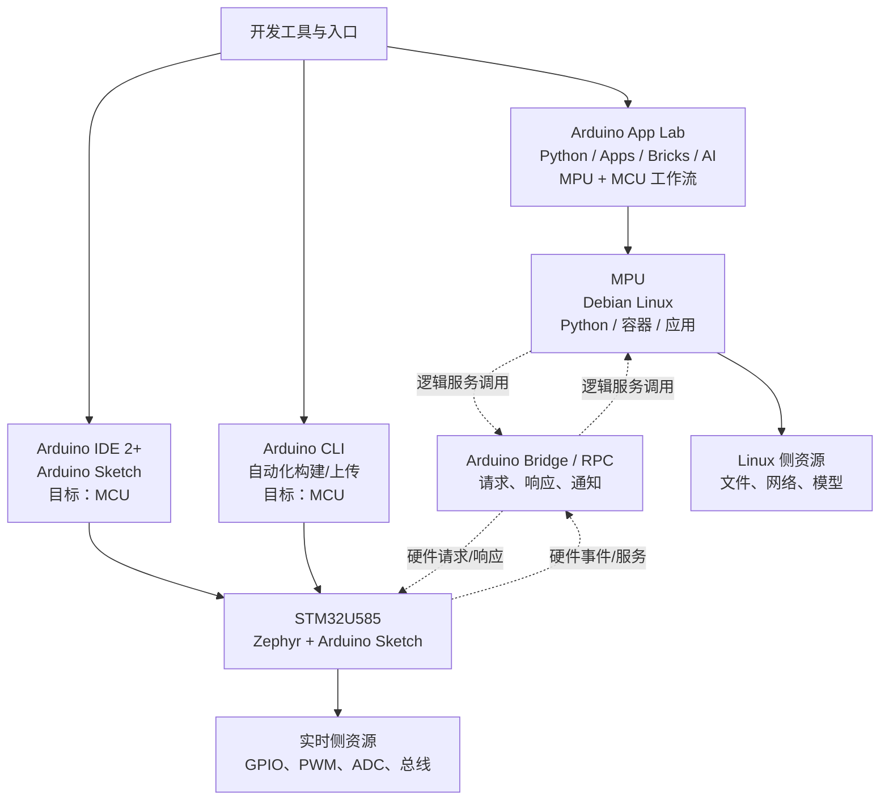

# Arduino UNO Q 第 4 章：软件架构 Implementation Plan

> **For agentic workers:** REQUIRED SUB-SKILL: Use superpowers:subagent-driven-development (recommended) or superpowers:executing-plans to implement this plan task-by-task. Steps use checkbox (`- [ ]`) syntax for tracking.

**Goal:** 在第一篇新增出版级第 4 章《UNO Q 的软件架构》，让读者建立开发工具、Linux/MPU、Zephyr/Arduino/MCU 与 Bridge/RPC 的责任边界，并把章节登记到全书导航和来源索引。

**Architecture:** 章节以“工具入口 → 运行时 → 跨处理器协同 → 资源边界”的单一主线展开。正文内嵌一幅与 `diagrams/` 下独立源文件逐字一致的 Mermaid 软件责任图；本章只做架构识读和工具选择练习，不把 CLI、IDE、App Lab 或 Bridge/RPC 的静态说明写成实机运行证据。

**Tech Stack:** UTF-8 Markdown、YAML front matter、Mermaid `flowchart TB`、PowerShell 静态链接/结构检查、Git。

**Spec:** `docs/superpowers/specs/2026-09-15-arduino-uno-q-book-design.md`

## Global Constraints

- 章节文件固定为 `book/第1篇_认识UNOQ/第4章_UNO_Q的软件架构.md`，图源固定为 `diagrams/uno-q-software-architecture.mmd`。
- front matter 必须包含 `title: Arduino UNO Q 的软件架构`、`part: 1`、`chapter: 4`、`status: draft`、`last_verified: 2026-09-20`。
- 第一次叙述使用完整产品名 `Arduino UNO Q`；后文使用 `UNO Q`，不要创造 `UNOQ` 变体。
- 正文必须包含学习目标、本章导读、背景与边界、操作或实验、验证结果、常见问题、本章小结、交叉引用与延伸阅读、来源与验证；无可运行代码时必须明确写出“本章没有可运行代码”。
- Mermaid 只表达“软件责任与逻辑协同”这一主要关系；正文内 Mermaid 与独立 `.mmd` 源文件必须逐字一致；图号使用全书唯一的 `Fig-05`。
- 事实基线只使用已经登记的四个 Arduino 官方来源：UNO Q 产品页、UNO Q 数据表、UNO Q User Manual、ArduinoCore-zephyr；不新增外部 URL，不复制外部正文、代码或图片。
- 第 4 章来源索引用途必须在 `resources/references.md` 中显式登记；外部 URL 和许可证声明保持原样，日期更新为 `2026-09-20`。
- 章节内仓库链接使用相对路径；未创建的后续篇入口可以作为预留入口，但本章引用的第 1～3 章、参考索引和图源必须可解析。
- 未完成 Arduino CLI 编译、上传、App Lab 实际运行、Linux 进程观察或 Bridge/RPC 硬件通信验证时，不得写成“已运行”“已通过”或“实机结果”。

---

### Task 1: Author Chapter 4 and its traceable Mermaid source

**Files:**
- Create: `book/第1篇_认识UNOQ/第4章_UNO_Q的软件架构.md`
- Create: `diagrams/uno-q-software-architecture.mmd`

**Interfaces:**
- Consumes: Chapter 2 positioning, Chapter 3 hardware/electrical boundaries, the four official rows in `resources/references.md`, and the terminology rules in `docs/writing-guidelines.md`.
- Produces: The stable chapter anchor `#fig-05-uno-q-software-architecture`, the Fig-05 placeholder, and an independent Mermaid source that exactly matches the chapter's fenced block.

- [x] **Step 1: Write the chapter metadata and learning frame.** Use the exact front matter from Global Constraints, then add `# 第4章 UNO Q 的软件架构`, `## 学习目标`, `## 本章导读`, and `## 背景与边界`. Explain that the chapter follows the hardware responsibility map and answers “which tool targets which runtime” rather than teaching every tool's installation procedure.

- [x] **Step 2: Explain the four software responsibility layers.** Cover: host-side development entry points; MPU-side Debian Linux applications and services; MCU-side Zephyr plus Arduino Sketch; and Bridge/RPC as a logical request/response/notification boundary. State the supported high-level distinction from the official product page/User Manual: App Lab is the unified workflow for Python, sketches, Bricks and Linux-side applications; Arduino IDE and CLI target the MCU-side Arduino/Zephyr workflow. Do not imply that IDE/CLI programs the MPU or that Debian replaces Zephyr.

- [x] **Step 3: Add the software responsibility diagram.** The independent source and inline block must contain exactly this Mermaid content, with no second diagram:

Add a paragraph explaining that solid arrows are responsibility/entry relationships and dotted arrows are logical coordination, not a physical wire, timing guarantee, or shared-memory claim. Add the exact stable anchor and one Fig-05 placeholder after the diagram.

- [x] **Step 4: Add the paper exercise, verification boundary, FAQ, summary, and references.** Include sections `## 操作或实验`, `## 验证结果`, `## 常见问题`, `## 本章小结`, `## 交叉引用与延伸阅读`, and `## 来源与验证`. The exercise classifies tasks such as Blink, file processing, GPIO sampling, Python network service, App Lab Brick, and cross-processor control by runtime/tool. Explicitly state that the exercise needs no hardware and that no runnable code is introduced. FAQ must address App Lab vs IDE, whether IDE programs MPU, whether Linux replaces Zephyr, what Bridge/RPC guarantees, and whether Python may directly use any GPIO. Link back to Chapters 2–3, forward to the reserved STM32/Linux/Python Bridge/App Lab entries, and link the diagram source and reference index.

- [x] **Step 5: Self-check the chapter.** Confirm the first product mention, metadata, fixed headings, single Fig-05 placeholder, inline/source Mermaid equality, source citations, and no claims of CLI upload or hardware runtime. Commit the chapter and source as `docs: add chapter 4 software architecture`.

### Task 2: Synchronize navigation, figure registry, and source traceability

**Files:**
- Modify: `SUMMARY.md`
- Modify: `book/第1篇_认识UNOQ/README.md`
- Modify: `README.md`
- Modify: `images/第1篇_认识UNOQ/README.md`
- Modify: `resources/references.md`

**Interfaces:**
- Consumes: Task 1's chapter path, Fig-05 anchor, and Mermaid source path.
- Produces: One canonical navigation entry, a chapter map entry, a Fig-05 registry row, and four official source rows whose usage explicitly covers Chapter 4.

- [x] **Step 1: Add the chapter to `SUMMARY.md`.** Append `- [第4章 UNO Q 的软件架构](book/第1篇_认识UNOQ/第4章_UNO_Q的软件架构.md)` immediately after the Chapter 3 entry, preserving the existing order and paths.

- [x] **Step 2: Update the First Part README and root progress.** Add Chapter 4 to the reading order and chapter map. Update the root README's current progress and verified file list to include Chapter 4 and `diagrams/uno-q-software-architecture.mmd`, without claiming hardware runtime verification.

- [x] **Step 3: Register Fig-05.** In `images/第1篇_认识UNOQ/README.md`, add exactly one row for `Fig-05` pointing to the Chapter 4 stable anchor and Mermaid source. Record that the image is a future SVG generated from the project-owned Mermaid source; do not create an SVG in this task.

- [x] **Step 4: Extend the four existing official source rows.** Keep each URL, license wording, and source identity unchanged while adding the Chapter 4 software-architecture usage: product page for App Lab/IDE/Bridge boundaries; datasheet for processor and Bridge/RPC boundary; User Manual for Debian/Zephyr/App Lab/IDE workflow; ArduinoCore-zephyr for MCU-side Zephyr Core and IDE/CLI/App Lab target support. Set their last verification date to `2026-09-20`.

- [x] **Step 5: Check cross-file consistency.** Confirm the Chapter 4 link appears once in SUMMARY and the Part README, Fig-05 appears once in the registry and once in the chapter, all local targets exist, and no duplicate alias path is introduced. Commit as `docs: register chapter 4 software architecture`.

### Task 3: Whole-change verification and delivery record

**Files:**
- Modify: `docs/superpowers/plans/2026-09-20-arduino-uno-q-chapter-4.md` (checkboxes only during execution)
- Create: `.superpowers/sdd/2026-09-20-arduino-uno-q-chapter-4/progress.md` (ignored execution ledger)

**Interfaces:**
- Consumes: Task 1 and Task 2 commits.
- Produces: Fresh verification evidence for the whole change; no generated image, npm cache, or other temporary tool output in the repository.

- [x] **Step 1: Run structural and link checks.** Verify required files, front matter, required headings, Fig-05 uniqueness, inline/source Mermaid equality, Mermaid declaration, official URL registration, and all local Markdown link targets.

- [x] **Step 2: Run diff hygiene checks.** Run `git diff --check` over the Chapter 4 range, confirm no generated SVG is present, and confirm `git status --short` contains only intended tracked edits or is clean after commits.

- [x] **Step 3: Record boundaries.** Record that no Arduino CLI compile/upload, App Lab run, Linux process inspection, Bridge/RPC communication, or hardware measurement was performed. A GitHub push remains a separately authorized external delivery step and must only be claimed after the remote SHA matches the verified local SHA.

- [ ] **Step 4: Mark the plan and ledger complete after review.** Preserve every `Ruling:` line for the final handoff before deleting the ignored SDD workspace.
